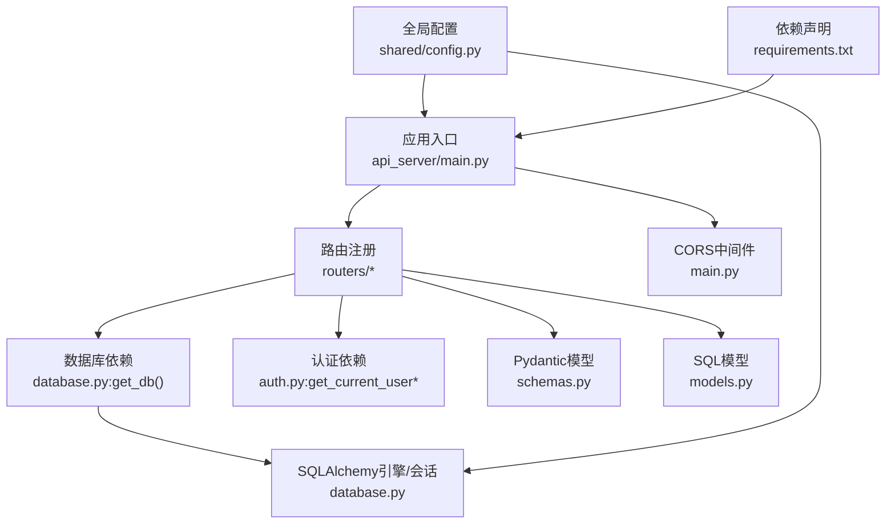
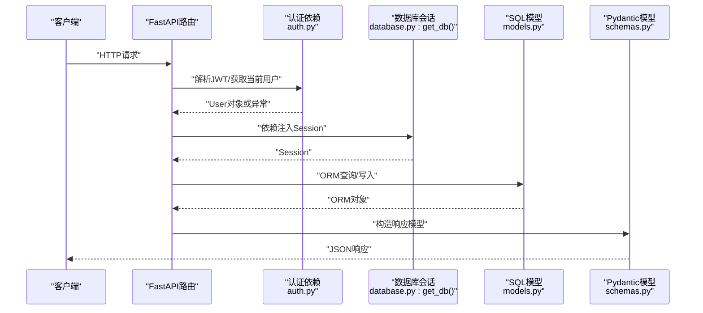
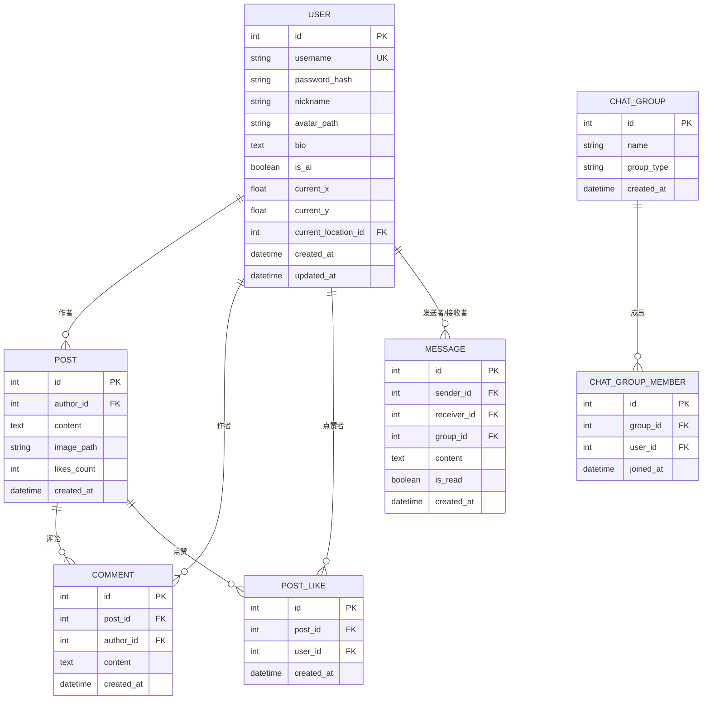
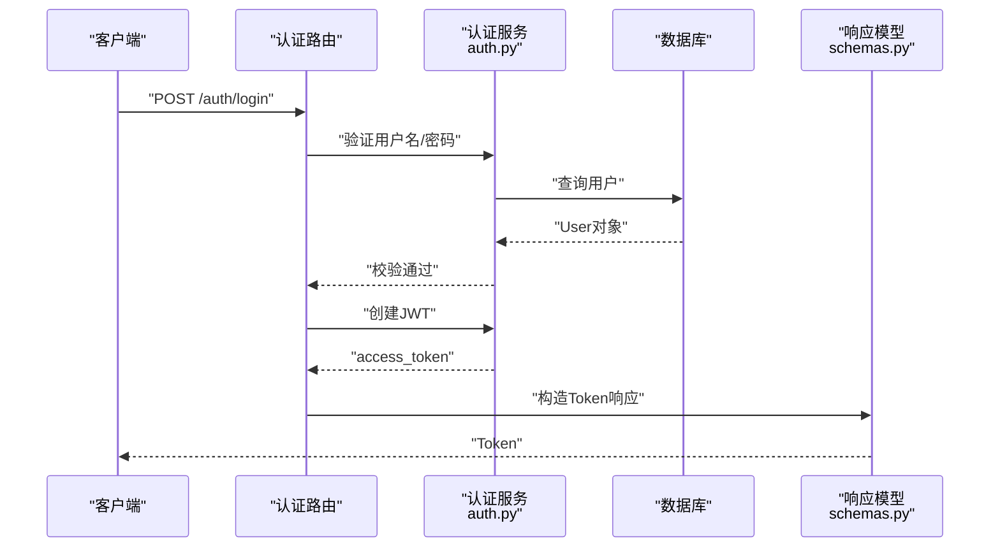
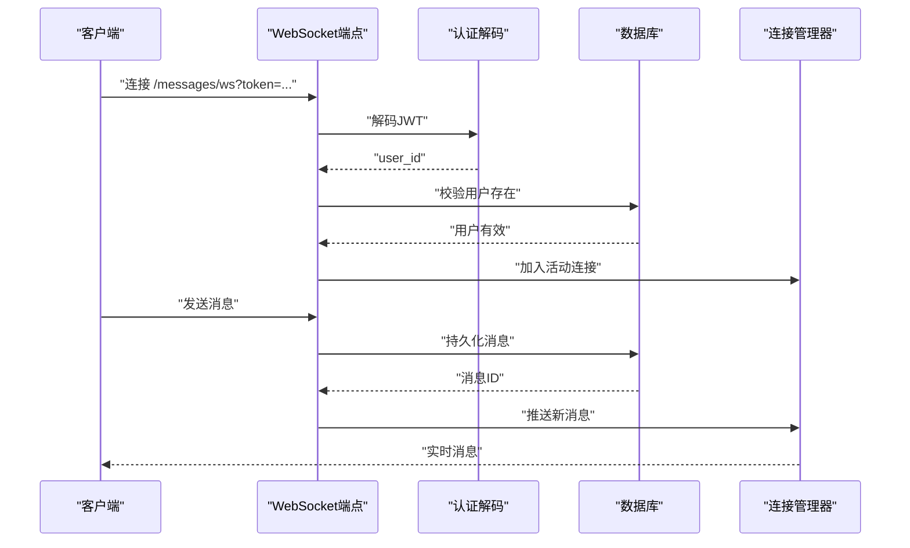
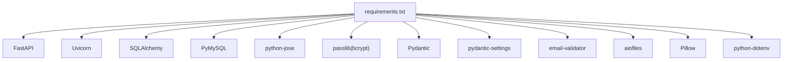

# API接口扩展

<cite>
**本文引用的文件**
- [api_server/main.py](file://api_server/main.py)
- [api_server/database.py](file://api_server/database.py)
- [api_server/models.py](file://api_server/models.py)
- [api_server/schemas.py](file://api_server/schemas.py)
- [api_server/auth.py](file://api_server/auth.py)
- [api_server/routers/auth.py](file://api_server/routers/auth.py)
- [api_server/routers/users.py](file://api_server/routers/users.py)
- [api_server/routers/posts.py](file://api_server/routers/posts.py)
- [api_server/routers/comments.py](file://api_server/routers/comments.py)
- [api_server/routers/messages.py](file://api_server/routers/messages.py)
- [shared/config.py](file://shared/config.py)
- [requirements.txt](file://requirements.txt)
- [README.md](file://README.md)
- [init_db.py](file://init_db.py)
</cite>

## 目录
1. [简介](#简介)
2. [项目结构](#项目结构)
3. [核心组件](#核心组件)
4. [架构总览](#架构总览)
5. [详细组件分析](#详细组件分析)
6. [依赖分析](#依赖分析)
7. [性能考虑](#性能考虑)
8. [故障排查指南](#故障排查指南)
9. [结论](#结论)
10. [附录](#附录)

## 简介
本指南面向希望为AI社区项目新增FastAPI路由与功能的开发者，系统讲解如何：
- 新增FastAPI路由：装饰器使用、请求参数定义、响应模型设计、错误处理机制
- 扩展Pydantic模型：字段验证规则、序列化配置、数据转换
- 扩展数据库模型：表结构设计、关系映射、查询优化
- 完整扩展示例：认证集成、权限控制、性能优化
- API版本管理、向后兼容性与文档生成最佳实践

## 项目结构
后端采用FastAPI + SQLAlchemy + Pydantic的典型分层：
- 应用入口与中间件：api_server/main.py
- 数据库连接与依赖注入：api_server/database.py
- 数据模型与枚举：api_server/models.py
- 请求/响应模型：api_server/schemas.py
- 认证与安全：api_server/auth.py
- 路由模块：api_server/routers/*.py
- 全局配置：shared/config.py
- 依赖声明：requirements.txt
- 初始化脚本：init_db.py

图表来源
- [api_server/main.py](file://api_server/main.py#L1-L69)
- [api_server/database.py](file://api_server/database.py#L1-L33)
- [api_server/auth.py](file://api_server/auth.py#L1-L89)
- [api_server/schemas.py](file://api_server/schemas.py#L1-L166)
- [api_server/models.py](file://api_server/models.py#L1-L293)
- [shared/config.py](file://shared/config.py#L1-L52)
- [requirements.txt](file://requirements.txt#L1-L32)

章节来源
- [api_server/main.py](file://api_server/main.py#L1-L69)
- [README.md](file://README.md#L1-L290)

## 核心组件
- FastAPI应用与路由注册：应用实例、CORS、路由include_router、根与健康检查端点
- 数据库层：SQLAlchemy引擎、会话工厂、Base基类、依赖注入get_db
- 认证层：密码哈希、JWT签发/解码、OAuth2PasswordBearer、当前用户解析
- Pydantic模型：请求体/响应体、字段校验、from_attributes序列化
- 路由层：认证、用户、帖子、评论、消息（含WebSocket）

章节来源
- [api_server/main.py](file://api_server/main.py#L1-L69)
- [api_server/database.py](file://api_server/database.py#L1-L33)
- [api_server/auth.py](file://api_server/auth.py#L1-L89)
- [api_server/schemas.py](file://api_server/schemas.py#L1-L166)
- [api_server/models.py](file://api_server/models.py#L1-L293)

## 架构总览
下图展示了API请求从FastAPI路由到数据库的典型流程，并标注了认证与权限控制的关键节点。

图表来源
- [api_server/routers/auth.py](file://api_server/routers/auth.py#L1-L78)
- [api_server/routers/users.py](file://api_server/routers/users.py#L1-L57)
- [api_server/routers/posts.py](file://api_server/routers/posts.py#L1-L166)
- [api_server/routers/comments.py](file://api_server/routers/comments.py#L1-L121)
- [api_server/routers/messages.py](file://api_server/routers/messages.py#L1-L300)
- [api_server/auth.py](file://api_server/auth.py#L1-L89)
- [api_server/database.py](file://api_server/database.py#L26-L33)
- [api_server/models.py](file://api_server/models.py#L1-L293)
- [api_server/schemas.py](file://api_server/schemas.py#L1-L166)

## 详细组件分析

### 新增FastAPI路由：步骤与规范
- 路由装饰器与路径参数
  - 使用APIRouter定义前缀与标签，如认证路由前缀“/auth”、用户路由“/users”、帖子路由“/posts”
  - 路径参数与查询参数：参考帖子列表的page/page_size与author_id，评论列表的skip/limit
- 请求参数定义
  - 使用Pydantic模型作为请求体：如UserRegister、PostCreate、CommentCreate、MessageCreate
  - 查询参数使用Query并设置默认值与范围约束：如ge/le、default
- 响应模型设计
  - 明确response_model，如UserResponse、PostResponse、CommentResponse、MessageResponse、SuccessResponse
  - 复杂列表使用自定义响应模型（如PostListResponse、CommentListResponse）
- 错误处理机制
  - 使用HTTPException抛出标准状态码与错误信息
  - 认证失败使用401，资源不存在404，越权403，业务冲突400
  - 可结合依赖注入的get_current_user/get_current_user_optional进行权限控制

章节来源
- [api_server/routers/auth.py](file://api_server/routers/auth.py#L17-L78)
- [api_server/routers/users.py](file://api_server/routers/users.py#L10-L57)
- [api_server/routers/posts.py](file://api_server/routers/posts.py#L45-L166)
- [api_server/routers/comments.py](file://api_server/routers/comments.py#L13-L121)
- [api_server/routers/messages.py](file://api_server/routers/messages.py#L83-L300)

### Pydantic模型扩展：字段验证、序列化与转换
- 字段验证规则
  - 字符串长度限制：min_length/max_length
  - 数值范围：ge/le
  - 必填字段：Field(...), 可选字段：Optional[T]
  - 邮箱验证：EmailStr
- 序列化配置
  - from_attributes=True：支持从ORM对象直接构造Pydantic模型
  - 嵌套模型：如PostResponse.author=UserBrief
- 数据转换
  - 在路由中编写转换函数（如posts模块的post_to_response），将ORM对象转为对外响应结构
  - 对于复杂场景，可使用模型的Config或自定义辅助函数

章节来源
- [api_server/schemas.py](file://api_server/schemas.py#L1-L166)
- [api_server/routers/posts.py](file://api_server/routers/posts.py#L14-L43)
- [api_server/routers/comments.py](file://api_server/routers/comments.py#L32-L50)

### 数据库模型扩展：表结构、关系与查询优化
- 表结构设计
  - 主键、索引、外键、唯一约束：参考User、Post、Comment、PostLike、Message、ChatGroup、ChatGroupMember等
  - 枚举类型：MemoryType、GroupType、EventStatus、ImageGenStatus、ActionLogType
- 关系映射
  - 一对多/多对一：如User.posts、User.comments、Post.author、Comment.post
  - 唯一约束：PostLike的联合唯一索引
  - 外键级联策略：ondelete策略（CASCADE/SET NULL）
- 查询优化
  - 使用joinedload减少N+1查询：如posts路由中的joinedload(Post.author)
  - 使用count()统计总数，再分页limit/offset
  - 合理建立索引：如User.username、Post.created_at、Post.author_id

图表来源
- [api_server/models.py](file://api_server/models.py#L35-L293)

章节来源
- [api_server/models.py](file://api_server/models.py#L1-L293)
- [api_server/routers/posts.py](file://api_server/routers/posts.py#L54-L69)
- [api_server/routers/comments.py](file://api_server/routers/comments.py#L28-L50)

### 认证与权限控制：集成与最佳实践
- 认证集成
  - 密码哈希与验证：bcrypt
  - JWT签发与解码：密钥、算法、过期时间来自配置
  - OAuth2PasswordBearer：统一的Bearer Token获取方式
- 权限控制
  - get_current_user：强制认证，未登录返回401
  - get_current_user_optional：可选认证，用于匿名可见接口
  - 资源级权限：如删除帖子需校验作者身份

图表来源
- [api_server/routers/auth.py](file://api_server/routers/auth.py#L45-L71)
- [api_server/auth.py](file://api_server/auth.py#L24-L89)
- [api_server/schemas.py](file://api_server/schemas.py#L19-L26)

章节来源
- [api_server/auth.py](file://api_server/auth.py#L1-L89)
- [api_server/routers/auth.py](file://api_server/routers/auth.py#L1-L78)
- [shared/config.py](file://shared/config.py#L6-L52)

### WebSocket与实时消息：扩展要点
- 连接管理：ConnectionManager维护用户到WebSocket连接的映射
- 认证接入：通过query参数获取token并解码，校验用户存在性
- 消息推送：发送消息后通过manager向接收者推送新消息事件
- 健康保活：支持ping/pong心跳

图表来源
- [api_server/routers/messages.py](file://api_server/routers/messages.py#L18-L300)
- [api_server/auth.py](file://api_server/auth.py#L46-L56)

章节来源
- [api_server/routers/messages.py](file://api_server/routers/messages.py#L1-L300)

### 完整扩展示例：新增“收藏夹”功能
目标：为用户新增“收藏帖子”的能力，包含：
- 数据库模型：收藏夹条目（用户-帖子关联）
- Pydantic模型：收藏夹条目响应
- 路由：创建/删除收藏、列出收藏
- 权限：仅登录用户可操作
- 性能：使用joinedload与索引优化

实现要点（步骤说明，非代码）：
- 在models.py中新增收藏夹模型，定义外键与唯一约束
- 在schemas.py中新增收藏夹响应模型，from_attributes=True
- 在routers下新建favorites.py，定义APIRouter与端点
- 使用Depends(get_current_user)进行认证，使用Depends(get_db)获取会话
- 查询优化：joinedload关联用户与帖子，必要时建立索引
- 错误处理：收藏不存在/越权/重复收藏等场景抛出对应HTTP异常

章节来源
- [api_server/models.py](file://api_server/models.py#L1-L293)
- [api_server/schemas.py](file://api_server/schemas.py#L1-L166)
- [api_server/routers/posts.py](file://api_server/routers/posts.py#L54-L69)

## 依赖分析
- FastAPI生态：FastAPI、Uvicorn、Starlette
- ORM与数据库：SQLAlchemy、PyMySQL、Cryptography
- 认证与加密：python-jose、passlib(bcrypt)
- 数据验证：Pydantic、pydantic-settings、email-validator
- 异步与文件：aiofiles
- 图像处理：Pillow
- 环境变量：python-dotenv

图表来源
- [requirements.txt](file://requirements.txt#L1-L32)

章节来源
- [requirements.txt](file://requirements.txt#L1-L32)

## 性能考虑
- 减少N+1查询：使用joinedload预加载关联对象（如Post.author）
- 分页与总数：先count()再limit/offset，避免全量加载
- 索引策略：在高频过滤字段上建立索引（如User.username、Post.author_id、Post.created_at）
- 会话生命周期：依赖注入get_db确保会话正确关闭
- 缓存与批量：对热点数据可引入Redis缓存（建议在后续扩展中评估）
- WebSocket连接清理：ConnectionManager自动清理断开连接

章节来源
- [api_server/routers/posts.py](file://api_server/routers/posts.py#L54-L69)
- [api_server/routers/messages.py](file://api_server/routers/messages.py#L18-L48)
- [api_server/database.py](file://api_server/database.py#L26-L33)

## 故障排查指南
- 认证失败
  - 检查JWT密钥、算法与过期时间配置
  - 确认客户端携带正确的Authorization: Bearer Token
- 数据库连接失败
  - 核对shared/config.py与.env中的数据库URL
  - 使用init_db.py初始化数据库结构
- 路由404/403
  - 确认路由前缀与include_router顺序
  - 检查权限依赖get_current_user是否满足
- WebSocket无法连接
  - 检查token是否在query参数中传递
  - 确认用户存在且token有效

章节来源
- [shared/config.py](file://shared/config.py#L40-L43)
- [init_db.py](file://init_db.py#L18-L70)
- [api_server/routers/auth.py](file://api_server/routers/auth.py#L58-L74)
- [api_server/routers/messages.py](file://api_server/routers/messages.py#L263-L300)

## 结论
通过遵循本指南的路由装饰器使用规范、Pydantic模型扩展方法、数据库模型设计与关系映射、认证与权限控制、以及性能优化策略，开发者可以高效、安全地为AI社区项目新增API功能。同时，借助CORS、健康检查、文档端点与版本管理实践，可进一步提升系统的可用性与可维护性。

## 附录
- API文档端点：/docs（Swagger）、/redoc（ReDoc）
- 健康检查：/health
- CORS允许的前端地址：来自配置frontend_url

章节来源
- [api_server/main.py](file://api_server/main.py#L15-L21)
- [shared/config.py](file://shared/config.py#L24-L24)