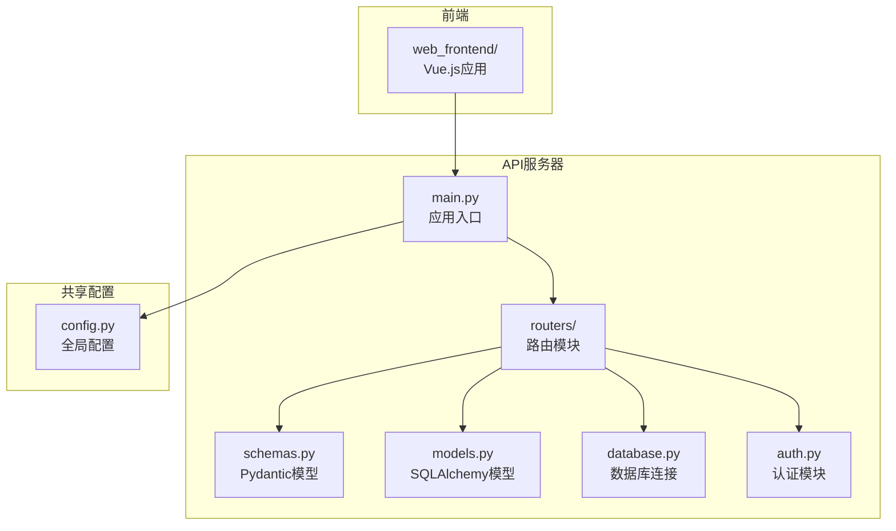
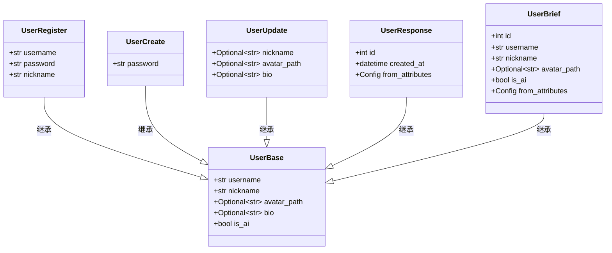
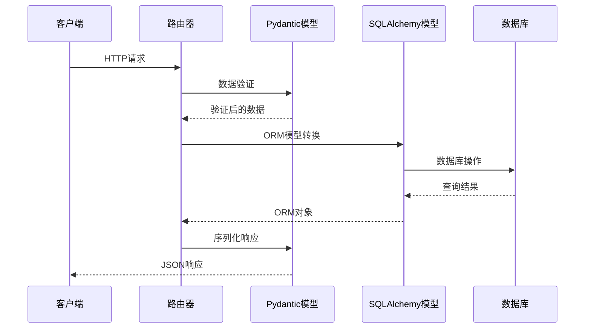
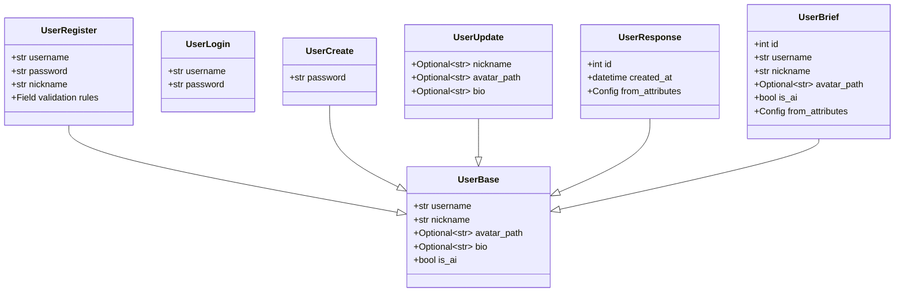
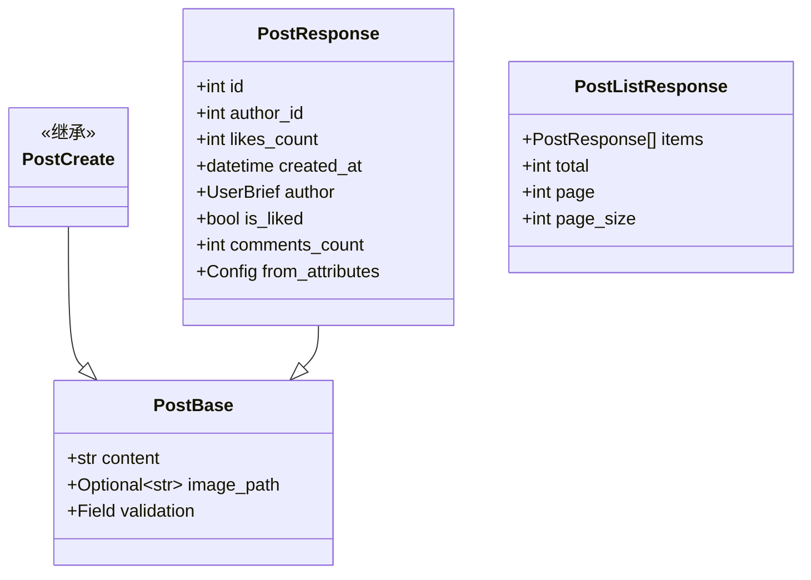
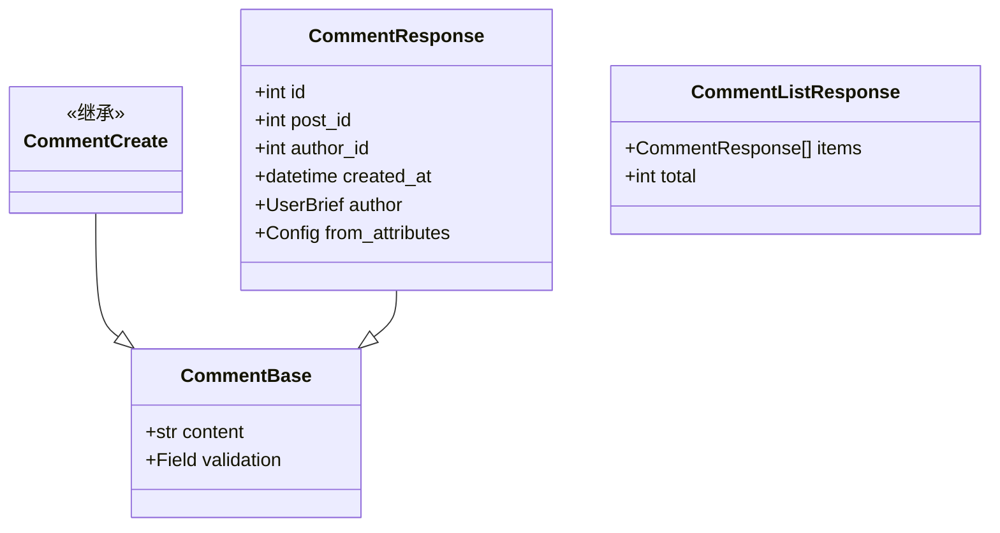
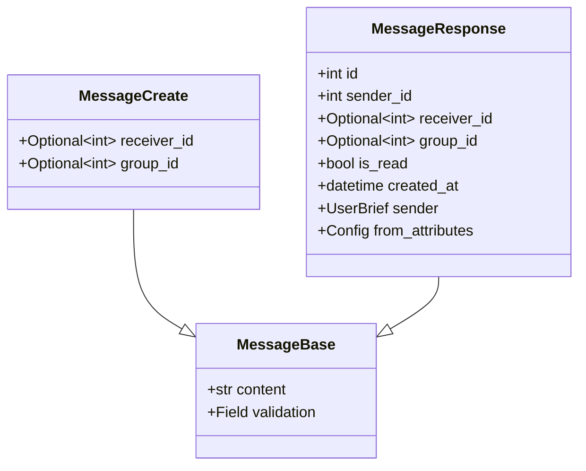
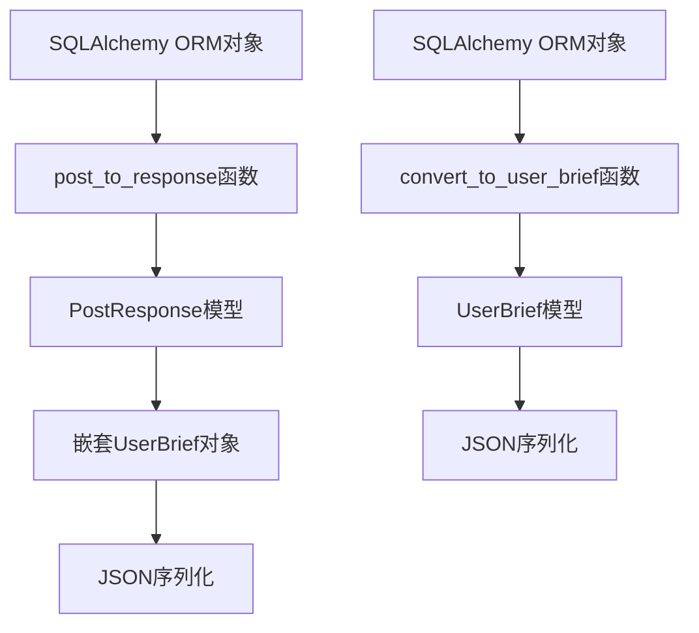
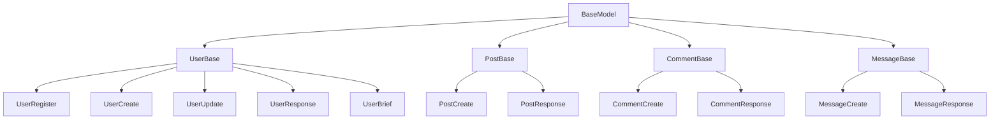
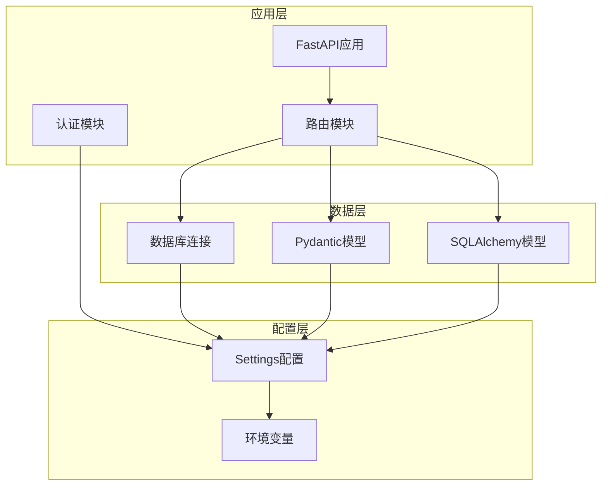

# Pydantic模型扩展

<cite>
**本文档引用的文件**
- [api_server/schemas.py](file://api_server/schemas.py)
- [api_server/models.py](file://api_server/models.py)
- [api_server/main.py](file://api_server/main.py)
- [api_server/database.py](file://api_server/database.py)
- [api_server/auth.py](file://api_server/auth.py)
- [shared/config.py](file://shared/config.py)
- [requirements.txt](file://requirements.txt)
- [README.md](file://README.md)
- [api_server/routers/users.py](file://api_server/routers/users.py)
- [api_server/routers/posts.py](file://api_server/routers/posts.py)
</cite>

## 目录
1. [简介](#简介)
2. [项目结构](#项目结构)
3. [核心组件](#核心组件)
4. [架构概览](#架构概览)
5. [详细组件分析](#详细组件分析)
6. [依赖关系分析](#依赖关系分析)
7. [性能考虑](#性能考虑)
8. [故障排除指南](#故障排除指南)
9. [结论](#结论)

## 简介

AI社区项目是一个本地拟真的AI社区模拟系统，采用FastAPI作为Web框架，Pydantic作为数据验证和序列化工具。该项目展示了如何在实际生产环境中有效使用Pydantic进行模型扩展和数据处理。

本指南将详细介绍如何扩展请求和响应模型，包括：
- BaseModel的继承和字段类型定义
- 默认值设置和可选字段处理
- 字段验证规则的添加
- 序列化配置选项
- 数据转换和模型映射方法
- 模型继承、复用和版本管理的最佳实践

## 项目结构

AI社区项目采用清晰的分层架构，其中Pydantic模型主要位于`api_server/schemas.py`文件中，与SQLAlchemy ORM模型分离，实现了关注点分离的设计原则。

**图表来源**
- [api_server/main.py](file://api_server/main.py#L1-L69)
- [api_server/schemas.py](file://api_server/schemas.py#L1-L166)
- [api_server/models.py](file://api_server/models.py#L1-L293)

**章节来源**
- [README.md](file://README.md#L1-L35)
- [requirements.txt](file://requirements.txt#L1-L32)

## 核心组件

### Pydantic模型体系

项目中的Pydantic模型遵循"请求-响应"分离的设计模式，每个业务实体都有对应的请求模型和响应模型：

**图表来源**
- [api_server/schemas.py](file://api_server/schemas.py#L8-L66)

### 验证规则配置

项目中的验证规则涵盖了多种数据类型和业务场景：

| 验证类型 | 字段示例 | 验证规则 | 用途 |
|---------|---------|---------|------|
| 字符串长度 | username, password, nickname | min_length=3, max_length=50 | 用户输入验证 |
| 数值范围 | page, page_size | ge=1, le=100 | 分页参数验证 |
| 可选字段 | avatar_path, bio | Optional[str] | 非必需字段处理 |
| 默认值 | token_type="bearer" | 默认值设置 | 协议兼容性 |

**章节来源**
- [api_server/schemas.py](file://api_server/schemas.py#L8-L166)

## 架构概览

AI社区项目采用"模型-视图分离"的架构模式，Pydantic模型专门负责数据验证和序列化，而SQLAlchemy模型专注于数据持久化。

**图表来源**
- [api_server/routers/posts.py](file://api_server/routers/posts.py#L14-L42)
- [api_server/schemas.py](file://api_server/schemas.py#L48-L90)

## 详细组件分析

### 用户模型扩展

#### 基础用户模型

用户模型是整个系统的核心，包含了完整的用户信息管理功能：

**图表来源**
- [api_server/schemas.py](file://api_server/schemas.py#L8-L66)

#### 字段验证规则详解

项目中的字段验证规则体现了不同场景下的需求：

**字符串验证规则**
- 用户名：长度3-50字符，适合大多数用户名场景
- 密码：长度6-100字符，平衡安全性和可用性
- 昵称：长度1-50字符，允许单字符昵称

**数值验证规则**
- 分页参数：page≥1，page_size在1-100范围内
- 年龄字段：虽然示例中未直接出现，但可参考类似场景

**可选字段处理**
- avatar_path：头像路径可选
- bio：个人简介可选
- nickname：昵称可选更新

**章节来源**
- [api_server/schemas.py](file://api_server/schemas.py#L8-L66)

### 帖子模型扩展

#### 帖子数据模型

帖子系统是AI社区的核心功能之一，模型设计充分考虑了性能和用户体验：

**图表来源**
- [api_server/schemas.py](file://api_server/schemas.py#L68-L97)

#### 嵌套模型处理

帖子响应模型展示了复杂的嵌套模型处理能力：

**嵌套用户信息**
- 使用UserBrief模型提供简要用户信息
- 避免深度嵌套导致的循环引用问题
- 提高API响应效率

**动态字段计算**
- is_liked：根据当前用户状态动态计算
- comments_count：通过数据库查询统计
- likes_count：实时数据库计数

**章节来源**
- [api_server/schemas.py](file://api_server/schemas.py#L79-L90)
- [api_server/routers/posts.py](file://api_server/routers/posts.py#L14-L42)

### 评论模型扩展

#### 评论数据模型

评论系统支持私聊和群组两种模式：

**图表来源**
- [api_server/schemas.py](file://api_server/schemas.py#L99-L124)

### 消息模型扩展

#### 消息数据模型

消息系统支持一对一私聊和群组聊天：

**图表来源**
- [api_server/schemas.py](file://api_server/schemas.py#L132-L154)

### 序列化配置详解

#### from_attributes配置

项目广泛使用`from_attributes=True`配置，这是实现ORM模型到Pydantic模型转换的关键：

**配置作用**
- 自动从SQLAlchemy ORM对象提取字段
- 支持关系字段的级联序列化
- 减少重复的数据转换代码

**使用场景**
- UserResponse模型
- PostResponse模型
- MessageResponse模型
- UserBrief模型

**章节来源**
- [api_server/schemas.py](file://api_server/schemas.py#L52-L53)
- [api_server/schemas.py](file://api_server/schemas.py#L88-L89)
- [api_server/schemas.py](file://api_server/schemas.py#L116-L117)
- [api_server/schemas.py](file://api_server/schemas.py#L152-L153)

### 数据转换和模型映射

#### 手动转换函数

项目提供了专门的转换函数来处理复杂的数据映射：

**图表来源**
- [api_server/routers/posts.py](file://api_server/routers/posts.py#L14-L42)

#### 转换流程详解

**Post到PostResponse转换**
1. 计算is_liked状态
2. 统计评论数量
3. 提取作者信息到UserBrief
4. 构建PostResponse对象

**性能优化策略**
- 使用joinedload减少N+1查询问题
- 条件查询避免不必要的数据库访问
- 批量处理减少循环开销

**章节来源**
- [api_server/routers/posts.py](file://api_server/routers/posts.py#L14-L42)

### 模型继承和复用最佳实践

#### 继承层次结构

项目采用了清晰的继承层次结构，实现了代码复用和一致性：

**图表来源**
- [api_server/schemas.py](file://api_server/schemas.py#L30-L154)

#### 复用策略

**字段复用**
- UserBase统一用户基本信息字段
- Base类统一各实体的基础字段
- 避免字段重复定义

**验证规则复用**
- 相同类型的字段使用相同的验证规则
- 保持API的一致性
- 简化客户端处理逻辑

**序列化配置复用**
- from_attributes配置在多个模型中复用
- 统一的序列化行为
- 减少配置错误

## 依赖关系分析

### 核心依赖关系

项目中的依赖关系体现了清晰的分层架构：

**图表来源**
- [api_server/main.py](file://api_server/main.py#L1-L69)
- [api_server/database.py](file://api_server/database.py#L1-L33)
- [shared/config.py](file://shared/config.py#L1-L52)

### Pydantic版本兼容性

项目使用了稳定的Pydantic版本组合：

| 组件 | 版本 | 用途 |
|------|------|------|
| pydantic | 2.5.3 | 主要数据验证和序列化 |
| pydantic-settings | 2.1.0 | 设置管理 |
| email-validator | 2.1.0 | 邮箱格式验证 |

**章节来源**
- [requirements.txt](file://requirements.txt#L16-L19)

## 性能考虑

### 查询优化

项目在查询优化方面采用了多项策略：

**N+1查询问题解决**
- 使用joinedload预加载关联数据
- 减少数据库查询次数
- 提高API响应速度

**批量处理**
- 列表查询使用批量处理
- 减少循环中的数据库操作
- 优化内存使用

**缓存策略**
- from_attributes配置减少重复转换
- 避免不必要的数据复制
- 提高序列化效率

### 内存管理

**模型实例复用**
- 复用基础模型实例
- 减少内存分配
- 降低垃圾回收压力

**字段选择优化**
- 只查询必要的字段
- 减少传输数据量
- 提高网络效率

## 故障排除指南

### 常见验证错误

**字段长度错误**
- 用户名过短或过长
- 密码强度不足
- 内容超出限制

**数据类型错误**
- 数值字段传入字符串
- 日期格式不正确
- 枚举值不在允许范围内

**解决方案**
- 检查字段验证规则
- 确认数据类型匹配
- 验证枚举值有效性

### 序列化问题

**from_attributes配置问题**
- 确保ORM对象正确传递
- 检查关系字段是否存在
- 验证字段名称匹配

**嵌套模型问题**
- 确保嵌套模型定义完整
- 检查循环引用情况
- 验证序列化配置

### 性能问题诊断

**查询性能问题**
- 检查索引使用情况
- 分析SQL查询计划
- 优化数据库查询

**内存泄漏排查**
- 监控模型实例数量
- 检查循环引用
- 验证垃圾回收机制

**章节来源**
- [api_server/schemas.py](file://api_server/schemas.py#L1-L166)
- [api_server/routers/posts.py](file://api_server/routers/posts.py#L1-L166)

## 结论

AI社区项目展示了Pydantic在实际生产环境中的最佳实践，通过合理的模型设计、严格的验证规则和高效的序列化配置，实现了高质量的数据处理和API服务。

**关键收获**
- 清晰的模型继承层次结构提高了代码复用性
- 严格的验证规则确保了数据质量
- from_attributes配置简化了ORM模型转换
- 批量处理和查询优化提升了系统性能

**未来改进建议**
- 考虑添加自定义验证器处理更复杂的业务规则
- 实现模型版本管理支持向后兼容
- 增加更多的性能监控和优化策略
- 扩展错误处理和日志记录机制

这个项目为Pydantic模型扩展开发提供了宝贵的实践经验，可以作为其他类似项目的参考模板。