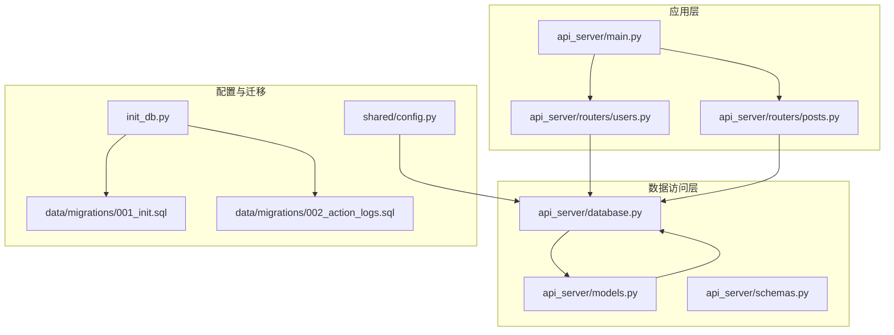
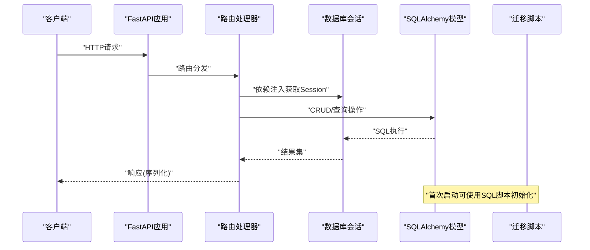
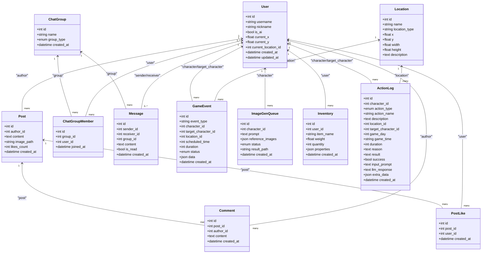
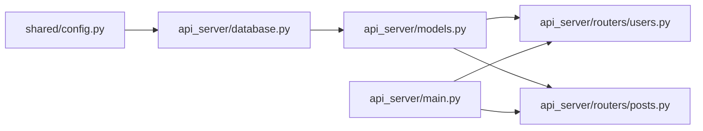

# 数据库模型扩展

<cite>
**本文引用的文件**
- [api_server/models.py](file://api_server/models.py)
- [api_server/database.py](file://api_server/database.py)
- [api_server/schemas.py](file://api_server/schemas.py)
- [api_server/main.py](file://api_server/main.py)
- [api_server/routers/users.py](file://api_server/routers/users.py)
- [api_server/routers/posts.py](file://api_server/routers/posts.py)
- [shared/config.py](file://shared/config.py)
- [init_db.py](file://init_db.py)
- [data/migrations/001_init.sql](file://data/migrations/001_init.sql)
- [data/migrations/002_action_logs.sql](file://data/migrations/002_action_logs.sql)
- [requirements.txt](file://requirements.txt)
</cite>

## 目录
1. [简介](#简介)
2. [项目结构](#项目结构)
3. [核心组件](#核心组件)
4. [架构总览](#架构总览)
5. [详细组件分析](#详细组件分析)
6. [依赖关系分析](#依赖关系分析)
7. [性能考量](#性能考量)
8. [故障排查指南](#故障排查指南)
9. [结论](#结论)
10. [附录](#附录)

## 简介
本指南面向需要在现有AI社区项目中扩展数据库模型的开发者，系统讲解如何基于SQLAlchemy进行模型扩展，包括：
- 继承Base、字段定义与数据类型选择
- 主键与外键关系建立
- 模型关系映射（一对一、一对多、多对多）及back_populates配置
- 数据库迁移管理（当前采用SQL脚本，建议引入Alembic）
- 查询优化（索引设计、联表查询、批量操作）
- 数据完整性约束、事务处理与并发控制
- 模型验证、数据清理与性能监控最佳实践

## 项目结构
项目采用分层架构，数据库相关的核心位于api_server模块，包含模型定义、数据库连接与会话管理、路由层调用以及配置加载。迁移脚本位于data/migrations目录，使用原生SQL初始化数据库。

图表来源
- [api_server/main.py](file://api_server/main.py#L1-L69)
- [api_server/routers/users.py](file://api_server/routers/users.py#L1-L57)
- [api_server/routers/posts.py](file://api_server/routers/posts.py#L1-L166)
- [api_server/models.py](file://api_server/models.py#L1-L293)
- [api_server/database.py](file://api_server/database.py#L1-L33)
- [shared/config.py](file://shared/config.py#L1-L52)
- [init_db.py](file://init_db.py#L1-L70)
- [data/migrations/001_init.sql](file://data/migrations/001_init.sql#L1-L205)
- [data/migrations/002_action_logs.sql](file://data/migrations/002_action_logs.sql#L1-L44)

章节来源
- [api_server/main.py](file://api_server/main.py#L1-L69)
- [api_server/routers/users.py](file://api_server/routers/users.py#L1-L57)
- [api_server/routers/posts.py](file://api_server/routers/posts.py#L1-L166)
- [api_server/models.py](file://api_server/models.py#L1-L293)
- [api_server/database.py](file://api_server/database.py#L1-L33)
- [shared/config.py](file://shared/config.py#L1-L52)
- [init_db.py](file://init_db.py#L1-L70)
- [data/migrations/001_init.sql](file://data/migrations/001_init.sql#L1-L205)
- [data/migrations/002_action_logs.sql](file://data/migrations/002_action_logs.sql#L1-L44)

## 核心组件
- 数据库引擎与会话：通过SQLAlchemy创建引擎、会话工厂，并提供依赖注入函数以供路由使用。
- 模型基类：统一继承declarative_base()生成的Base，确保所有模型具备一致的元数据与生命周期。
- 模型枚举：使用Python enum定义状态与类型，配合SQLAlchemy Enum列类型，保证数据一致性。
- 路由层：通过依赖注入获取Session，执行CRUD与复杂查询，结合Pydantic模型进行序列化。

章节来源
- [api_server/database.py](file://api_server/database.py#L1-L33)
- [api_server/models.py](file://api_server/models.py#L1-L293)
- [api_server/schemas.py](file://api_server/schemas.py#L1-L166)
- [api_server/routers/users.py](file://api_server/routers/users.py#L1-L57)
- [api_server/routers/posts.py](file://api_server/routers/posts.py#L1-L166)

## 架构总览
下图展示从FastAPI路由到数据库模型与迁移脚本的整体流程。

图表来源
- [api_server/main.py](file://api_server/main.py#L1-L69)
- [api_server/routers/users.py](file://api_server/routers/users.py#L1-L57)
- [api_server/routers/posts.py](file://api_server/routers/posts.py#L1-L166)
- [api_server/database.py](file://api_server/database.py#L1-L33)
- [api_server/models.py](file://api_server/models.py#L1-L293)
- [init_db.py](file://init_db.py#L1-L70)
- [data/migrations/001_init.sql](file://data/migrations/001_init.sql#L1-L205)
- [data/migrations/002_action_logs.sql](file://data/migrations/002_action_logs.sql#L1-L44)

## 详细组件分析

### 模型基类与继承
- 所有模型均继承自Base，确保统一的元数据注册与反射能力。
- 使用Column定义字段，结合index=True提升查询效率；使用server_default与onupdate自动维护时间戳。
- 外键通过ForeignKey声明，支持级联删除与SET NULL策略，确保数据一致性。

章节来源
- [api_server/models.py](file://api_server/models.py#L1-L293)
- [api_server/database.py](file://api_server/database.py#L1-L33)

### 字段定义与数据类型选择
- 字符串：VARCHAR长度限制，如用户名、昵称、头像路径等。
- 文本：Text用于长内容，如帖子正文、评论、记忆内容。
- 数值：Integer、Float用于计数、坐标、权重等。
- 布尔：Boolean用于状态标记，如私聊已读。
- 时间：DateTime配合server_default与onupdate自动维护创建与更新时间。
- JSON：JSON用于灵活存储结构化或半结构化数据，如物品属性、事件数据。
- 枚举：Enum(MemoryType, values_callable=...)与自定义枚举类，确保状态值可控。

章节来源
- [api_server/models.py](file://api_server/models.py#L1-L293)

### 主键与外键关系建立
- 主键：统一使用自增Integer作为主键，部分中间表使用复合唯一约束防止重复。
- 外键：通过ForeignKey("表名.字段")建立关联，配合ondelete策略控制级联行为。
- 示例：Post.author_id -> users.id；PostLike(post_id,user_id)复合唯一；Message.group_id -> chat_groups.id。

章节来源
- [api_server/models.py](file://api_server/models.py#L1-L293)
- [data/migrations/001_init.sql](file://data/migrations/001_init.sql#L1-L205)
- [data/migrations/002_action_logs.sql](file://data/migrations/002_action_logs.sql#L1-L44)

### 模型关系映射与back_populates
- 一对一/一对多：通过relationship声明，back_populates建立双向关系，便于懒加载与反向查询。
- 多对多：通过中间表（如ChatGroupMember、PostLike）实现，配合UniqueConstraint避免重复。
- 复杂关系：ActionLog与User/Location/TargetUser的多方向关联，通过foreign_keys显式指定以区分多外键场景。
- 级联策略：使用cascade="all, delete-orphan"在删除父对象时级联删除子对象，保持数据整洁。

图表来源
- [api_server/models.py](file://api_server/models.py#L1-L293)

章节来源
- [api_server/models.py](file://api_server/models.py#L1-L293)

### 查询优化与索引设计
- 索引策略：在高频过滤字段上建立索引（如users.username、posts.author_id、messages.created_at等），减少全表扫描。
- 联表查询：使用joinedload减少N+1查询问题；在路由层对Post.author进行预加载。
- 批量操作：在需要时使用bulk_insert_mappings/bulk_update_mappings减少往返次数，但需注意事务边界与一致性。
- 分页与排序：按created_at降序分页，结合索引提升排序效率。

章节来源
- [api_server/routers/posts.py](file://api_server/routers/posts.py#L1-L166)
- [data/migrations/001_init.sql](file://data/migrations/001_init.sql#L1-L205)
- [data/migrations/002_action_logs.sql](file://data/migrations/002_action_logs.sql#L1-L44)

### 数据完整性约束与事务处理
- 外键约束：通过SQL脚本定义外键，确保参照完整性；在模型层通过ondelete策略控制级联行为。
- 唯一约束：中间表使用UNIQUE KEY防止重复关系（如PostLike、ChatGroupMember）。
- 事务：在路由层使用db.commit()提交事务，异常时回滚；必要时使用try/except包裹复杂逻辑。
- 并发控制：使用数据库锁（SELECT ... FOR UPDATE）或应用层重试机制处理高并发场景。

章节来源
- [api_server/routers/posts.py](file://api_server/routers/posts.py#L1-L166)
- [api_server/routers/users.py](file://api_server/routers/users.py#L1-L57)
- [data/migrations/001_init.sql](file://data/migrations/001_init.sql#L1-L205)
- [data/migrations/002_action_logs.sql](file://data/migrations/002_action_logs.sql#L1-L44)

### 模型验证、数据清理与性能监控
- Pydantic验证：在路由层使用Pydantic模型进行输入校验与序列化输出，确保数据质量。
- 数据清理：定期清理过期日志、临时队列任务；对JSON字段进行Schema校验与归档。
- 性能监控：结合数据库慢查询日志与应用埋点，识别热点查询与瓶颈；对热点表增加索引或读写分离。

章节来源
- [api_server/schemas.py](file://api_server/schemas.py#L1-L166)
- [api_server/routers/posts.py](file://api_server/routers/posts.py#L1-L166)

### 数据库迁移管理（当前与建议）
- 当前方案：使用init_db.py读取SQL脚本初始化数据库，适合快速原型与开发环境。
- 建议方案：引入Alembic进行版本化迁移，支持增量变更、回滚与团队协作。迁移文件应与模型同步演进，遵循“先模型，后迁移”的原则。

章节来源
- [init_db.py](file://init_db.py#L1-L70)
- [data/migrations/001_init.sql](file://data/migrations/001_init.sql#L1-L205)
- [data/migrations/002_action_logs.sql](file://data/migrations/002_action_logs.sql#L1-L44)
- [requirements.txt](file://requirements.txt#L1-L32)

## 依赖关系分析
- 配置加载：shared/config.py提供数据库URL，api_server/database.py通过get_settings()读取并构建引擎。
- 路由依赖：各路由通过Depends(get_db)注入Session，实现轻耦合的数据访问。
- 模型依赖：所有模型依赖Base，形成统一的ORM元数据体系。

图表来源
- [shared/config.py](file://shared/config.py#L1-L52)
- [api_server/database.py](file://api_server/database.py#L1-L33)
- [api_server/models.py](file://api_server/models.py#L1-L293)
- [api_server/routers/users.py](file://api_server/routers/users.py#L1-L57)
- [api_server/routers/posts.py](file://api_server/routers/posts.py#L1-L166)
- [api_server/main.py](file://api_server/main.py#L1-L69)

章节来源
- [shared/config.py](file://shared/config.py#L1-L52)
- [api_server/database.py](file://api_server/database.py#L1-L33)
- [api_server/models.py](file://api_server/models.py#L1-L293)
- [api_server/routers/users.py](file://api_server/routers/users.py#L1-L57)
- [api_server/routers/posts.py](file://api_server/routers/posts.py#L1-L166)
- [api_server/main.py](file://api_server/main.py#L1-L69)

## 性能考量
- 索引设计：为高频过滤与排序字段建立合适索引，避免过度索引导致写入性能下降。
- 查询优化：使用joinedload减少N+1查询；合理分页与LIMIT；避免SELECT *。
- 连接池：启用pool_pre_ping与pool_recycle，提升连接稳定性。
- 批量写入：使用bulk操作减少网络往返；注意事务大小与锁竞争。
- 缓存：对热点数据与统计结果进行缓存，降低数据库压力。

## 故障排查指南
- 连接失败：检查数据库URL、主机、端口、账号密码；确认网络连通性。
- 权限不足：核对数据库用户权限与表级权限；确认外键约束是否满足。
- 重复数据：中间表唯一约束冲突时，检查业务逻辑避免重复插入。
- 事务异常：捕获异常后回滚事务，确保数据一致性；对并发场景增加重试与锁机制。
- 慢查询：开启慢查询日志，定位热点SQL；为关键字段添加索引或重构查询。

章节来源
- [api_server/database.py](file://api_server/database.py#L1-L33)
- [api_server/routers/posts.py](file://api_server/routers/posts.py#L1-L166)
- [init_db.py](file://init_db.py#L1-L70)

## 结论
本指南基于现有AI社区项目的SQLAlchemy模型与路由实现，总结了模型扩展的关键要点与最佳实践。建议在后续迭代中引入Alembic进行版本化迁移，持续优化索引与查询，强化事务与并发控制，以支撑更复杂的AI社交场景。

## 附录
- 快速参考：新增模型时，优先确定字段类型与索引策略，再定义关系与back_populates，最后编写迁移脚本或Alembic迁移。
- 安全建议：对敏感字段（如密码哈希）进行加密存储；对输入进行严格校验；对输出进行脱敏处理。