# 路由扩展开发

<cite>
**本文档引用的文件**
- [api_server/main.py](file://api_server/main.py)
- [api_server/routers/__init__.py](file://api_server/routers/__init__.py)
- [api_server/routers/auth.py](file://api_server/routers/auth.py)
- [api_server/routers/users.py](file://api_server/routers/users.py)
- [api_server/routers/posts.py](file://api_server/routers/posts.py)
- [api_server/routers/comments.py](file://api_server/routers/comments.py)
- [api_server/routers/files.py](file://api_server/routers/files.py)
- [api_server/routers/messages.py](file://api_server/routers/messages.py)
- [api_server/auth.py](file://api_server/auth.py)
- [api_server/database.py](file://api_server/database.py)
- [api_server/models.py](file://api_server/models.py)
- [api_server/schemas.py](file://api_server/schemas.py)
- [shared/config.py](file://shared/config.py)
</cite>

## 目录
1. [简介](#简介)
2. [项目结构](#项目结构)
3. [核心组件](#核心组件)
4. [架构概览](#架构概览)
5. [详细组件分析](#详细组件分析)
6. [依赖关系分析](#依赖关系分析)
7. [性能考虑](#性能考虑)
8. [故障排除指南](#故障排除指南)
9. [结论](#结论)
10. [附录](#附录)

## 简介

本指南面向AI社区项目的路由扩展开发，详细说明如何在routers目录下创建新的路由模块。通过分析现有代码库，我们将展示FastAPI路由装饰器的使用方法、路径参数和查询参数的定义、请求体模型的绑定和响应模型的返回。同时提供完整的路由实现示例，包括认证中间件的集成、权限验证的添加、异常处理的统一管理，以及路由注册流程和CORS配置。

## 项目结构

AI社区项目采用模块化架构，主要分为以下层次：

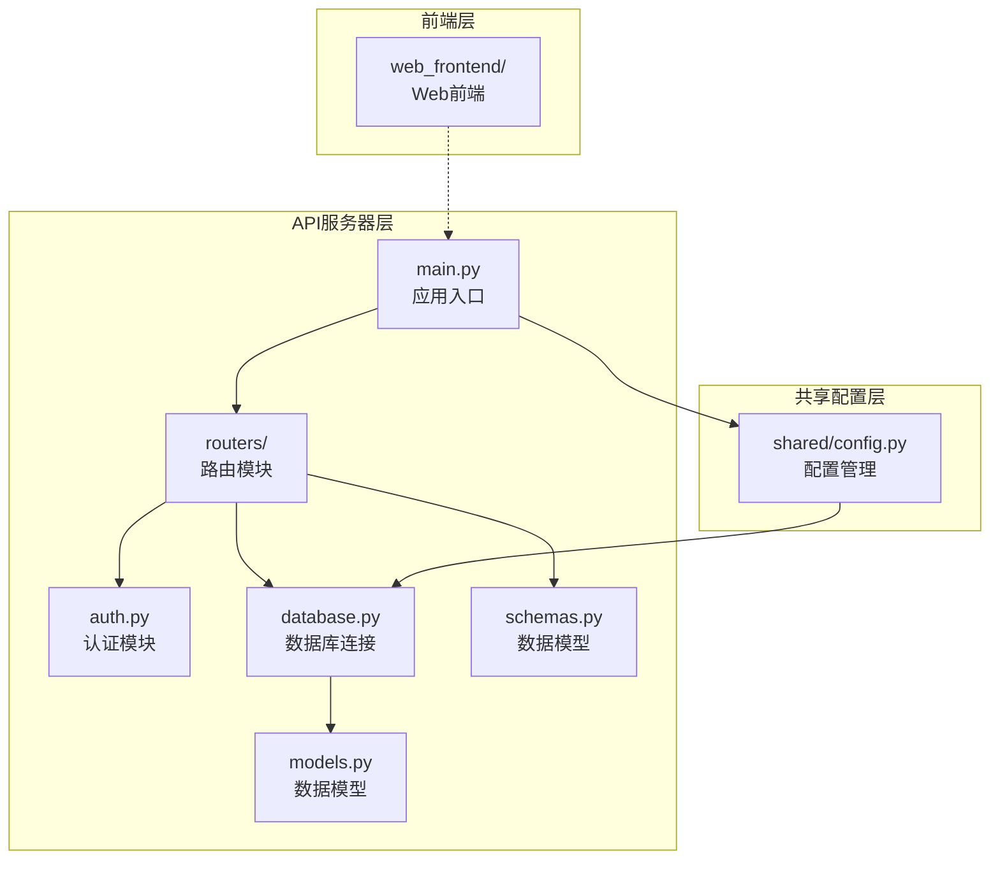

**图表来源**
- [api_server/main.py](file://api_server/main.py#L1-L69)
- [api_server/routers/__init__.py](file://api_server/routers/__init__.py#L1-L1)
- [shared/config.py](file://shared/config.py#L1-L52)

**章节来源**
- [api_server/main.py](file://api_server/main.py#L1-L69)
- [api_server/routers/__init__.py](file://api_server/routers/__init__.py#L1-L1)
- [shared/config.py](file://shared/config.py#L1-L52)

## 核心组件

### 路由装饰器系统

项目使用FastAPI的APIRouter进行路由定义，支持多种HTTP方法装饰器：

- `@router.get()` - GET请求，用于数据检索
- `@router.post()` - POST请求，用于数据创建
- `@router.put()` - PUT请求，用于数据更新
- `@router.delete()` - DELETE请求，用于数据删除

### 数据模型绑定

所有路由都采用Pydantic模型进行数据绑定：

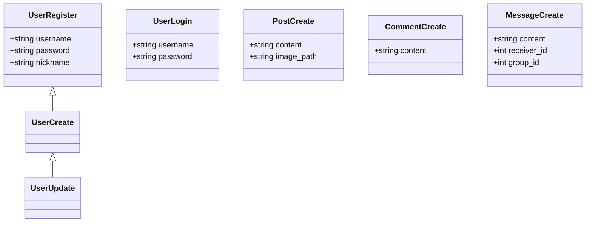

**图表来源**
- [api_server/schemas.py](file://api_server/schemas.py#L8-L166)

### 认证与授权

系统采用JWT令牌进行身份验证，支持两种用户获取方式：

- `Depends(get_current_user)` - 强制要求登录用户
- `Depends(get_current_user_optional)` - 可选用户，未登录返回None

**章节来源**
- [api_server/routers/auth.py](file://api_server/routers/auth.py#L1-L78)
- [api_server/auth.py](file://api_server/auth.py#L58-L89)

## 架构概览

AI社区API采用分层架构，各层职责明确：

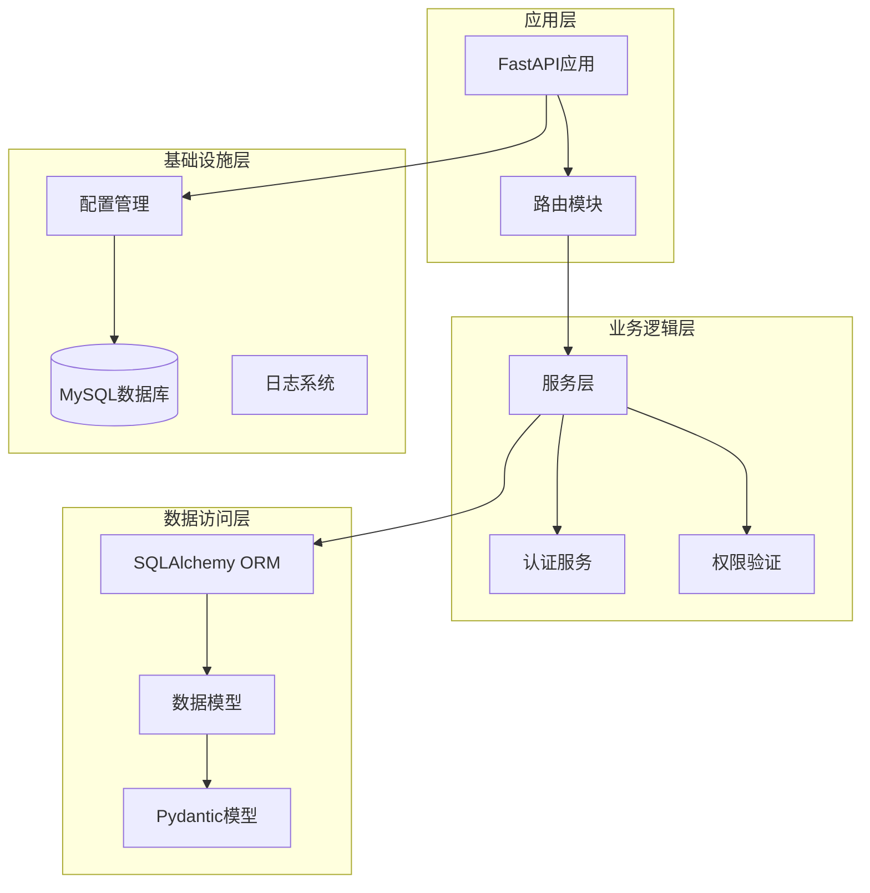

**图表来源**
- [api_server/main.py](file://api_server/main.py#L15-L42)
- [api_server/auth.py](file://api_server/auth.py#L1-L89)
- [api_server/database.py](file://api_server/database.py#L1-L33)

## 详细组件分析

### 认证路由模块

认证模块提供了完整的用户认证功能：

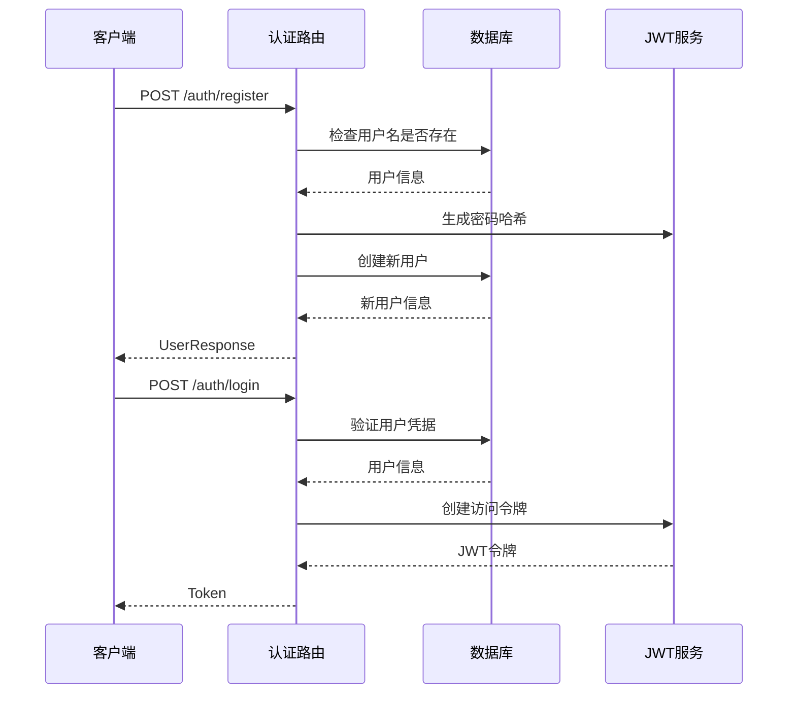

**图表来源**
- [api_server/routers/auth.py](file://api_server/routers/auth.py#L20-L78)
- [api_server/auth.py](file://api_server/auth.py#L24-L74)

**章节来源**
- [api_server/routers/auth.py](file://api_server/routers/auth.py#L1-L78)
- [api_server/auth.py](file://api_server/auth.py#L1-L89)

### 用户管理路由模块

用户模块实现了用户信息的CRUD操作：

```mermaid
flowchart TD
Start([用户请求]) --> Route{路由选择}
Route --> |GET /users/{user_id}| GetUser[获取用户信息]
Route --> |PUT /users/me| UpdateUser[更新用户信息]
Route --> |GET /users| ListUsers[获取用户列表]
GetUser --> CheckExist{用户存在?}
CheckExist --> |否| NotFound[404 错误]
CheckExist --> |是| ReturnUser[返回用户信息]
UpdateUser --> ValidateData[验证更新数据]
ValidateData --> UpdateDB[更新数据库]
UpdateDB --> ReturnUpdated[返回更新后的用户]
ListUsers --> FilterQuery[构建查询条件]
FilterQuery --> Paginate[分页处理]
Paginate --> ReturnList[返回用户列表]
ReturnUser --> End([结束])
ReturnUpdated --> End
ReturnList --> End
NotFound --> End
```

**图表来源**
- [api_server/routers/users.py](file://api_server/routers/users.py#L13-L57)

**章节来源**
- [api_server/routers/users.py](file://api_server/routers/users.py#L1-L57)

### 帖子管理路由模块

帖子模块是最复杂的业务模块，包含完整的CRUD操作和点赞功能：

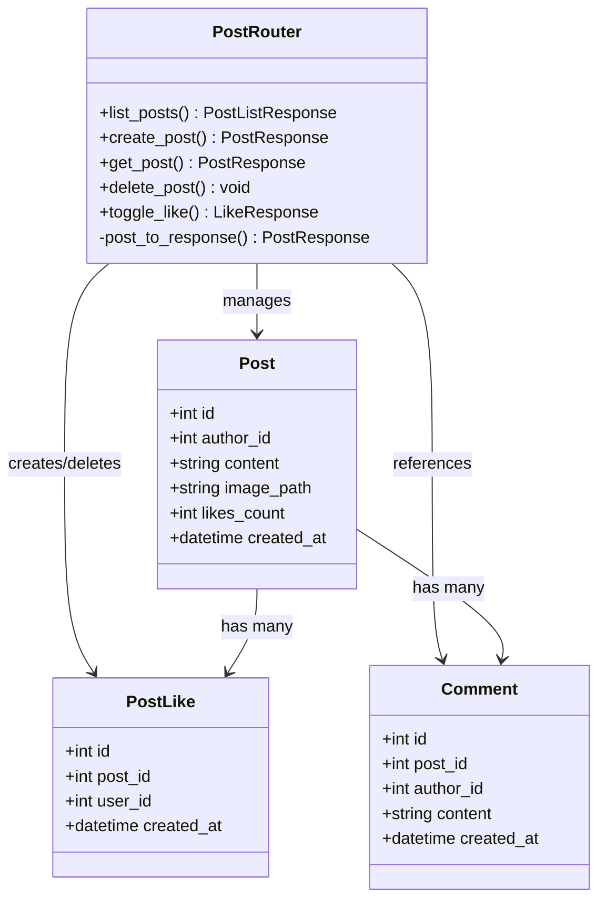

**图表来源**
- [api_server/routers/posts.py](file://api_server/routers/posts.py#L14-L166)
- [api_server/models.py](file://api_server/models.py#L80-L124)

**章节来源**
- [api_server/routers/posts.py](file://api_server/routers/posts.py#L1-L166)
- [api_server/models.py](file://api_server/models.py#L80-L124)

### 评论管理路由模块

评论模块实现了嵌套路由模式，支持按帖子分类的评论管理：

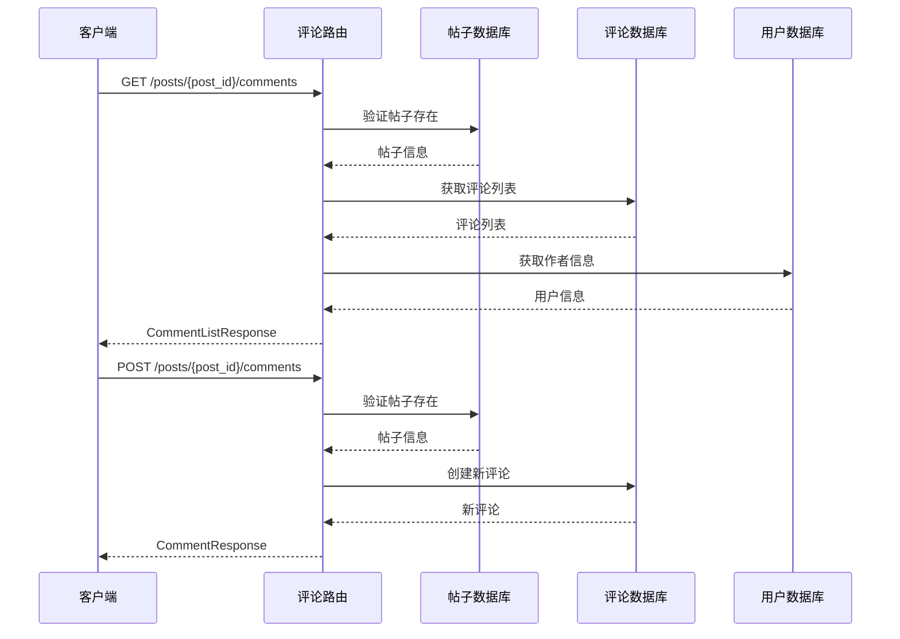

**图表来源**
- [api_server/routers/comments.py](file://api_server/routers/comments.py#L13-L121)

**章节来源**
- [api_server/routers/comments.py](file://api_server/routers/comments.py#L1-L121)

### 文件上传路由模块

文件模块提供了完整的文件上传和管理功能：

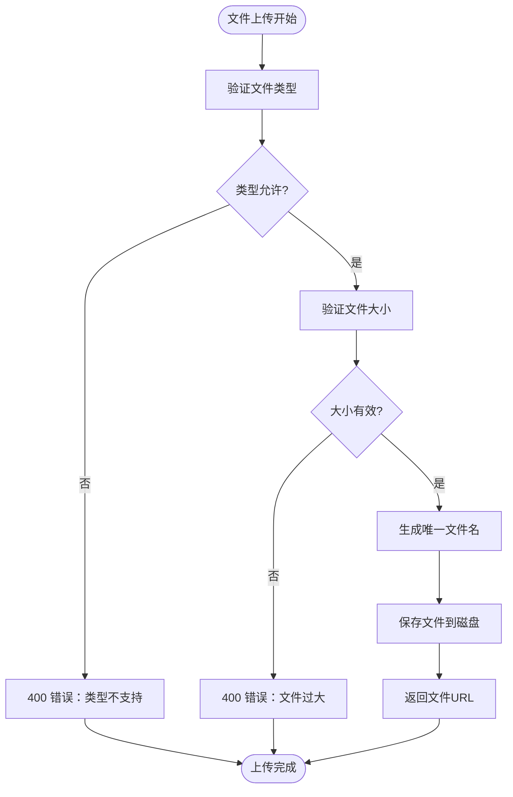

**图表来源**
- [api_server/routers/files.py](file://api_server/routers/files.py#L41-L81)

**章节来源**
- [api_server/routers/files.py](file://api_server/routers/files.py#L1-L138)

### 实时消息路由模块

消息模块集成了WebSocket实现实时通信：

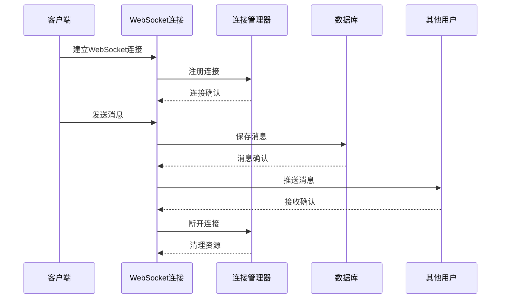

**图表来源**
- [api_server/routers/messages.py](file://api_server/routers/messages.py#L263-L300)

**章节来源**
- [api_server/routers/messages.py](file://api_server/routers/messages.py#L1-L300)

## 依赖关系分析

### 路由注册流程

系统通过main.py集中注册所有路由模块：

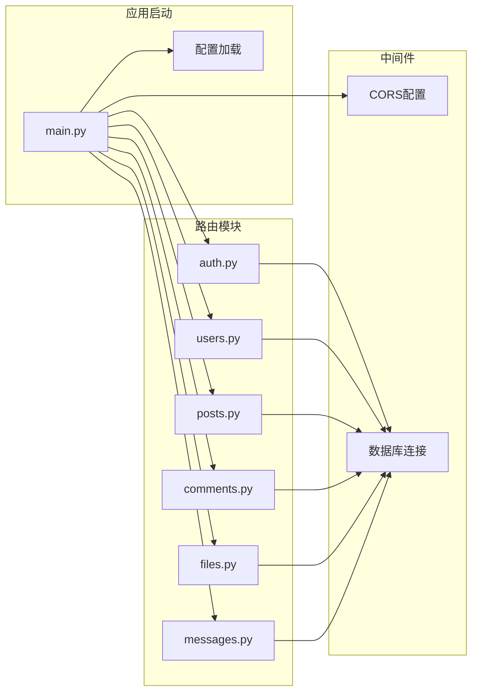

**图表来源**
- [api_server/main.py](file://api_server/main.py#L11-L42)

### 数据模型关系

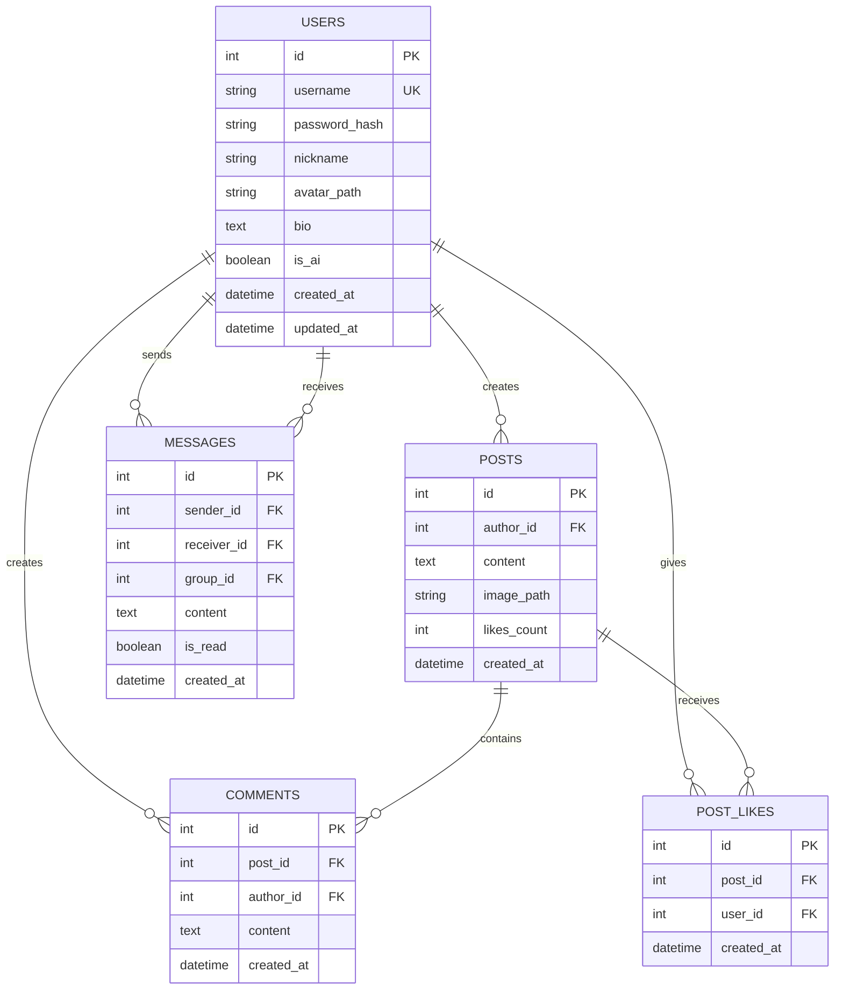

**图表来源**
- [api_server/models.py](file://api_server/models.py#L35-L170)

**章节来源**
- [api_server/main.py](file://api_server/main.py#L37-L42)
- [api_server/models.py](file://api_server/models.py#L1-L293)

## 性能考虑

### 数据库优化策略

1. **连接池配置**：使用预连接和回收机制减少连接开销
2. **查询优化**：使用joinedload避免N+1查询问题
3. **索引设计**：对常用查询字段建立索引
4. **分页处理**：限制单页数据量防止内存溢出

### 缓存策略

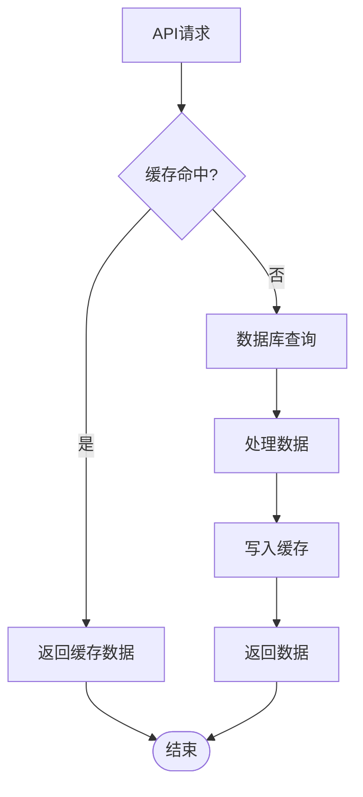

### 异步处理

文件上传采用异步I/O操作，WebSocket使用异步连接管理，提升并发处理能力。

## 故障排除指南

### 常见错误类型

1. **认证失败**：检查JWT密钥配置和token格式
2. **数据库连接**：验证MySQL连接参数和网络连通性
3. **文件上传**：检查上传目录权限和磁盘空间
4. **CORS问题**：确认前端域名配置正确

### 调试技巧

1. **启用调试模式**：在开发环境中设置调试标志
2. **日志记录**：使用结构化日志跟踪请求流程
3. **单元测试**：为关键业务逻辑编写测试用例
4. **API文档**：利用Swagger UI验证接口行为

**章节来源**
- [api_server/auth.py](file://api_server/auth.py#L63-L74)
- [api_server/routers/files.py](file://api_server/routers/files.py#L122-L138)

## 结论

AI社区项目的路由扩展开发遵循了RESTful API最佳实践，采用了模块化设计和清晰的分层架构。通过分析现有路由实现，开发者可以快速理解和扩展系统的功能。建议在新增路由时遵循以下原则：

1. **一致性**：保持路由命名和响应格式的一致性
2. **安全性**：始终进行输入验证和权限检查
3. **可维护性**：使用清晰的错误处理和日志记录
4. **性能**：优化数据库查询和缓存策略

## 附录

### 路由命名规范

- 使用名词复数形式表示资源集合
- 采用层级结构组织相关资源
- 保持URL简洁明了，避免过深的嵌套

### RESTful API最佳实践

- 使用适当的HTTP状态码
- 提供一致的响应格式
- 实现适当的错误处理
- 支持分页和过滤
- 提供API版本控制

### 配置管理

系统使用Pydantic Settings进行配置管理，支持环境变量覆盖和类型安全的配置访问。

**章节来源**
- [shared/config.py](file://shared/config.py#L6-L52)
- [api_server/database.py](file://api_server/database.py#L40-L43)