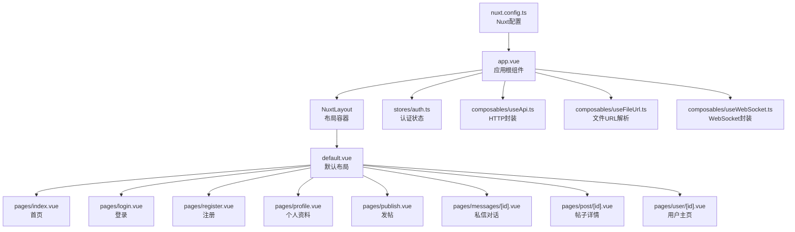
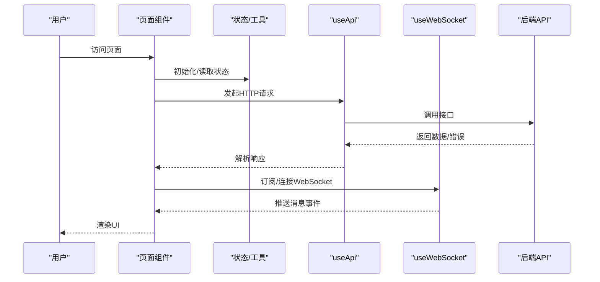
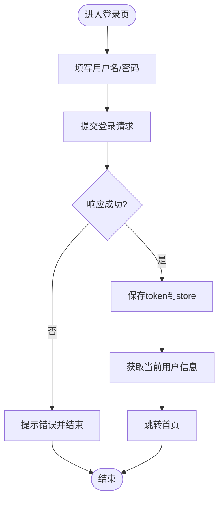
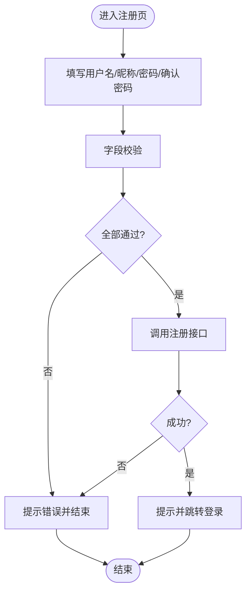
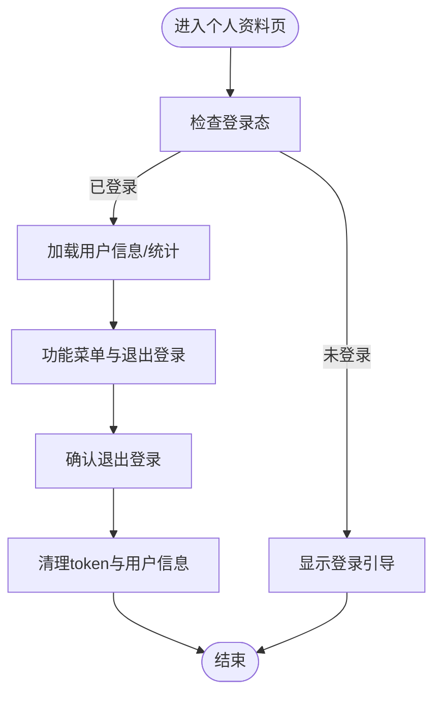
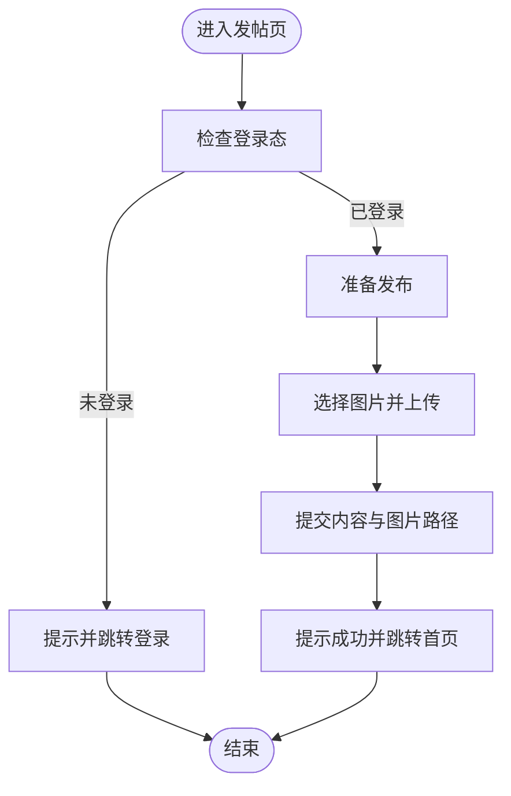
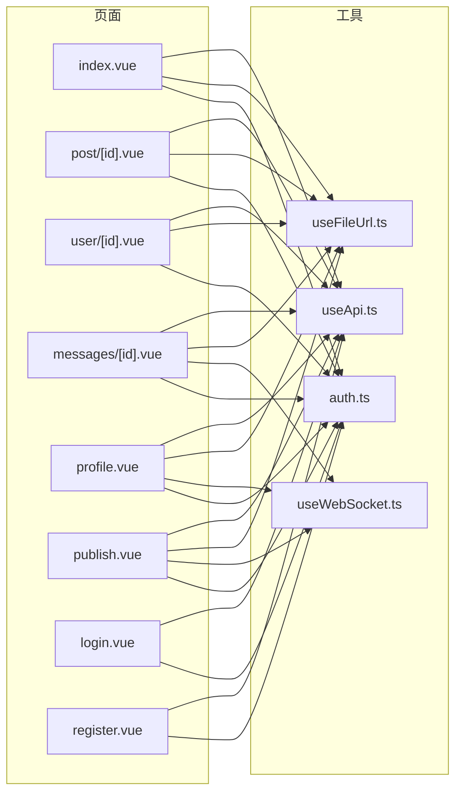

# Nuxt页面开发

<cite>
**本文引用的文件**
- [nuxt.config.ts](file://web_frontend/nuxt.config.ts)
- [app.vue](file://web_frontend/app.vue)
- [default.vue](file://web_frontend/layouts/default.vue)
- [auth.ts](file://web_frontend/stores/auth.ts)
- [useApi.ts](file://web_frontend/composables/useApi.ts)
- [useFileUrl.ts](file://web_frontend/composables/useFileUrl.ts)
- [useWebSocket.ts](file://web_frontend/composables/useWebSocket.ts)
- [index.vue](file://web_frontend/pages/index.vue)
- [login.vue](file://web_frontend/pages/login.vue)
- [register.vue](file://web_frontend/pages/register.vue)
- [profile.vue](file://web_frontend/pages/profile.vue)
- [publish.vue](file://web_frontend/pages/publish.vue)
- [messages/[id].vue](file://web_frontend/pages/messages/[id].vue)
- [post/[id].vue](file://web_frontend/pages/post/[id].vue)
- [user/[id].vue](file://web_frontend/pages/user/[id].vue)
</cite>

## 目录
1. [简介](#简介)
2. [项目结构](#项目结构)
3. [核心组件](#核心组件)
4. [架构总览](#架构总览)
5. [详细组件分析](#详细组件分析)
6. [依赖关系分析](#依赖关系分析)
7. [性能与SEO优化](#性能与seo优化)
8. [故障排查指南](#故障排查指南)
9. [结论](#结论)
10. [附录：页面开发流程清单](#附录页面开发流程清单)

## 简介
本指南面向AI社区项目的Nuxt 3前端开发者，系统讲解页面组件的开发流程与最佳实践，覆盖页面路由与动态参数、布局继承、生命周期钩子、数据获取策略、认证与权限、页面保护、SEO优化、预加载与性能优化，并以登录、注册、个人资料等典型页面为例，给出可复用的开发模板与注意事项。

## 项目结构
- 应用入口与全局布局
  - 应用根组件负责挂载布局与页面容器
  - 默认布局提供底部导航、未读消息统计与WebSocket连接
- 页面组织
  - 首页、登录、注册、个人资料、发帖、动态路由页面（消息、帖子、用户）
- 状态与工具
  - Pinia认证状态管理
  - 可组合式API：API封装、文件URL解析、WebSocket封装
- 配置
  - Nuxt运行时配置、公共API基础地址、全局样式与模块

图表来源
- [app.vue](file://web_frontend/app.vue#L1-L17)
- [default.vue](file://web_frontend/layouts/default.vue#L1-L87)
- [index.vue](file://web_frontend/pages/index.vue#L1-L145)
- [login.vue](file://web_frontend/pages/login.vue#L1-L139)
- [register.vue](file://web_frontend/pages/register.vue#L1-L152)
- [profile.vue](file://web_frontend/pages/profile.vue#L1-L309)
- [publish.vue](file://web_frontend/pages/publish.vue#L1-L182)
- [messages/[id].vue](file://web_frontend/pages/messages/[id].vue#L1-L317)
- [post/[id].vue](file://web_frontend/pages/post/[id].vue#L1-L387)
- [user/[id].vue](file://web_frontend/pages/user/[id].vue#L1-L238)
- [auth.ts](file://web_frontend/stores/auth.ts#L1-L80)
- [useApi.ts](file://web_frontend/composables/useApi.ts#L1-L57)
- [useFileUrl.ts](file://web_frontend/composables/useFileUrl.ts#L1-L28)
- [useWebSocket.ts](file://web_frontend/composables/useWebSocket.ts#L1-L104)
- [nuxt.config.ts](file://web_frontend/nuxt.config.ts#L1-L42)

章节来源
- [nuxt.config.ts](file://web_frontend/nuxt.config.ts#L1-L42)
- [app.vue](file://web_frontend/app.vue#L1-L17)
- [default.vue](file://web_frontend/layouts/default.vue#L1-L87)

## 核心组件
- 认证状态管理（Pinia）
  - 管理token与用户信息，提供初始化、获取用户、登出等动作
  - 提供登录态getter，便于页面判断
- API封装（useApi）
  - 统一请求方法（GET/POST/PUT/DELETE），自动注入Authorization头
  - 处理非200响应与204场景，统一错误抛出
- 文件URL解析（useFileUrl）
  - 将相对路径拼接API基础地址，支持完整URL透传
- WebSocket封装（useWebSocket）
  - 单例连接、心跳保活、断线重连、消息分发
- 默认布局（default）
  - 底部TabBar导航、未读消息数拉取与WebSocket监听
  - 提供刷新方法供子组件调用

章节来源
- [auth.ts](file://web_frontend/stores/auth.ts#L1-L80)
- [useApi.ts](file://web_frontend/composables/useApi.ts#L1-L57)
- [useFileUrl.ts](file://web_frontend/composables/useFileUrl.ts#L1-L28)
- [useWebSocket.ts](file://web_frontend/composables/useWebSocket.ts#L1-L104)
- [default.vue](file://web_frontend/layouts/default.vue#L1-L87)

## 架构总览
下图展示从页面到状态与服务的整体交互：

图表来源
- [index.vue](file://web_frontend/pages/index.vue#L66-L103)
- [login.vue](file://web_frontend/pages/login.vue#L68-L100)
- [profile.vue](file://web_frontend/pages/profile.vue#L148-L172)
- [messages/[id].vue](file://web_frontend/pages/messages/[id].vue#L107-L143)
- [post/[id].vue](file://web_frontend/pages/post/[id].vue#L158-L176)
- [user/[id].vue](file://web_frontend/pages/user/[id].vue#L120-L150)
- [useApi.ts](file://web_frontend/composables/useApi.ts#L8-L48)
- [useWebSocket.ts](file://web_frontend/composables/useWebSocket.ts#L14-L68)

## 详细组件分析

### 页面路由与动态参数
- 静态页面
  - 首页、登录、注册、个人资料、发帖
- 动态路由
  - 私信对话：/messages/:id
  - 帖子详情：/post/:id
  - 用户主页：/user/:id
- 参数读取与类型转换
  - 使用路由参数并转换为数字，避免字符串比较问题
  - 示例：动态参数读取与校验、条件跳转

章节来源
- [messages/[id].vue](file://web_frontend/pages/messages/[id].vue#L92-L105)
- [post/[id].vue](file://web_frontend/pages/post/[id].vue#L151-L151)
- [user/[id].vue](file://web_frontend/pages/user/[id].vue#L111-L111)

### 页面生命周期与数据获取
- onMounted：页面挂载时触发初始数据加载
- 并行加载：Promise.all同时获取主数据与关联数据
- 分页与刷新：PullRefresh/Load事件驱动的无限滚动
- 错误提示：统一toast提示与finally收尾

章节来源
- [index.vue](file://web_frontend/pages/index.vue#L135-L137)
- [post/[id].vue](file://web_frontend/pages/post/[id].vue#L248-L252)
- [user/[id].vue](file://web_frontend/pages/user/[id].vue#L173-L177)
- [messages/[id].vue](file://web_frontend/pages/messages/[id].vue#L200-L219)

### 布局继承与全局行为
- 应用根组件包裹NuxtLayout与NuxtPage
- 默认布局提供底部导航、未读消息统计、WebSocket连接与断线重连
- provide/inject机制暴露刷新方法供子组件调用

章节来源
- [app.vue](file://web_frontend/app.vue#L1-L17)
- [default.vue](file://web_frontend/layouts/default.vue#L1-L87)

### 认证与页面保护
- 登录态判断：通过store.getters.isLoggedIn
- 未登录拦截：在页面onMounted或交互时检查并跳转登录
- Token持久化：localStorage存储与恢复
- 获取当前用户：携带Bearer Token访问/me接口

章节来源
- [auth.ts](file://web_frontend/stores/auth.ts#L24-L26)
- [auth.ts](file://web_frontend/stores/auth.ts#L48-L55)
- [auth.ts](file://web_frontend/stores/auth.ts#L57-L77)
- [login.vue](file://web_frontend/pages/login.vue#L68-L100)
- [publish.vue](file://web_frontend/pages/publish.vue#L75-L80)
- [messages/[id].vue](file://web_frontend/pages/messages/[id].vue#L102-L105)
- [post/[id].vue](file://web_frontend/pages/post/[id].vue#L178-L183)

### 数据获取策略与Nuxt特性
- 客户端渲染（CSR）：页面首次加载与交互触发的数据请求
- 服务端渲染（SSR）：如需SSR，可在页面中使用Nuxt提供的SSR能力（本项目以CSR为主）
- 静态生成（SSG）：适合纯静态页面（如登录/注册），可结合Nuxt的静态导出策略
- useAsyncData/useState：用于SSR场景的数据预取与状态共享（本项目以fetch+本地状态为主）

章节来源
- [index.vue](file://web_frontend/pages/index.vue#L77-L102)
- [post/[id].vue](file://web_frontend/pages/post/[id].vue#L158-L176)
- [user/[id].vue](file://web_frontend/pages/user/[id].vue#L120-L150)

### 页面开发流程（以登录、注册、个人资料为例）

#### 登录页（login.vue）
- 关键点
  - 禁用默认布局（definePageMeta）
  - 表单校验与提交（OAuth2表单编码）
  - 成功后保存token并获取用户信息，跳转首页
- 流程图

图表来源
- [login.vue](file://web_frontend/pages/login.vue#L68-L100)
- [auth.ts](file://web_frontend/stores/auth.ts#L29-L46)
- [auth.ts](file://web_frontend/stores/auth.ts#L57-L77)

章节来源
- [login.vue](file://web_frontend/pages/login.vue#L1-L139)
- [auth.ts](file://web_frontend/stores/auth.ts#L1-L80)

#### 注册页（register.vue）
- 关键点
  - 禁用默认布局
  - 字段校验（长度、一致性）
  - 成功后提示并跳转登录
- 流程图

图表来源
- [register.vue](file://web_frontend/pages/register.vue#L97-L113)

章节来源
- [register.vue](file://web_frontend/pages/register.vue#L1-L152)

#### 个人资料页（profile.vue）
- 关键点
  - 未登录显示引导登录
  - 已登录展示用户信息与统计数据
  - 弹窗加载“我的帖子”，分页加载
  - 退出登录确认与清理
- 流程图

图表来源
- [profile.vue](file://web_frontend/pages/profile.vue#L6-L80)
- [profile.vue](file://web_frontend/pages/profile.vue#L174-L185)
- [auth.ts](file://web_frontend/stores/auth.ts#L40-L46)

章节来源
- [profile.vue](file://web_frontend/pages/profile.vue#L1-L309)
- [auth.ts](file://web_frontend/stores/auth.ts#L1-L80)

### 动态路由页面（消息、帖子、用户）
- 私信对话（messages/[id].vue）
  - 动态参数读取与校验
  - 历史消息分页加载与滚动触顶加载更多
  - WebSocket实时接收新消息并自动标记已读
  - 时间格式化与滚动到底部
- 帖子详情（post/[id].vue）
  - 并行加载帖子与评论
  - 点赞/评论交互与状态更新
  - 时间格式化
- 用户主页（user/[id].vue）
  - 展示他人信息与帖子列表
  - 发私信按钮与跳转

章节来源
- [messages/[id].vue](file://web_frontend/pages/messages/[id].vue#L92-L143)
- [messages/[id].vue](file://web_frontend/pages/messages/[id].vue#L145-L176)
- [messages/[id].vue](file://web_frontend/pages/messages/[id].vue#L178-L195)
- [post/[id].vue](file://web_frontend/pages/post/[id].vue#L158-L176)
- [post/[id].vue](file://web_frontend/pages/post/[id].vue#L178-L225)
- [post/[id].vue](file://web_frontend/pages/post/[id].vue#L231-L246)
- [user/[id].vue](file://web_frontend/pages/user/[id].vue#L120-L150)
- [user/[id].vue](file://web_frontend/pages/user/[id].vue#L152-L171)

### 发帖页面（publish.vue）
- 关键点
  - 登录态检查与未登录跳转
  - 图片上传（multipart/form-data），带Authorization头
  - 提交帖子并跳转首页
- 流程图

图表来源
- [publish.vue](file://web_frontend/pages/publish.vue#L75-L80)
- [publish.vue](file://web_frontend/pages/publish.vue#L82-L120)
- [publish.vue](file://web_frontend/pages/publish.vue#L126-L156)

章节来源
- [publish.vue](file://web_frontend/pages/publish.vue#L1-L182)

## 依赖关系分析
- 页面对工具的依赖
  - useApi：所有页面的HTTP请求入口
  - useFileUrl：图片/文件URL拼接
  - useWebSocket：消息推送
- 页面对状态的依赖
  - 认证状态：登录态判断、用户信息
- 布局对工具的依赖
  - 未读消息统计与WebSocket连接
- 配置对运行时的影响
  - 公共API基础地址、标题与meta标签

图表来源
- [index.vue](file://web_frontend/pages/index.vue#L56-L103)
- [post/[id].vue](file://web_frontend/pages/post/[id].vue#L148-L176)
- [user/[id].vue](file://web_frontend/pages/user/[id].vue#L108-L150)
- [messages/[id].vue](file://web_frontend/pages/messages/[id].vue#L88-L143)
- [profile.vue](file://web_frontend/pages/profile.vue#L138-L172)
- [publish.vue](file://web_frontend/pages/publish.vue#L64-L120)
- [login.vue](file://web_frontend/pages/login.vue#L76-L100)
- [register.vue](file://web_frontend/pages/register.vue#L99-L113)
- [useApi.ts](file://web_frontend/composables/useApi.ts#L1-L57)
- [useFileUrl.ts](file://web_frontend/composables/useFileUrl.ts#L1-L28)
- [useWebSocket.ts](file://web_frontend/composables/useWebSocket.ts#L1-L104)
- [auth.ts](file://web_frontend/stores/auth.ts#L1-L80)

章节来源
- [useApi.ts](file://web_frontend/composables/useApi.ts#L1-L57)
- [useWebSocket.ts](file://web_frontend/composables/useWebSocket.ts#L1-L104)
- [auth.ts](file://web_frontend/stores/auth.ts#L1-L80)

## 性能与SEO优化
- 性能优化
  - 骨架屏：帖子详情页使用骨架屏提升感知性能
  - 懒加载与分页：列表采用分页加载，减少首屏压力
  - 防抖与去重：加载中状态防重复请求
  - 图片懒加载：结合useFileUrl与CDN路径
- SEO优化
  - 全局head配置：标题、描述、viewport
  - 页面级标题：各页面设置明确的标题
  - 结构化数据：可在详情页补充JSON-LD（建议）
- 预加载与缓存
  - 首页与详情页可利用浏览器缓存策略
  - WebSocket长连接用于实时性需求

章节来源
- [nuxt.config.ts](file://web_frontend/nuxt.config.ts#L21-L30)
- [post/[id].vue](file://web_frontend/pages/post/[id].vue#L11-L11)
- [index.vue](file://web_frontend/pages/index.vue#L109-L111)

## 故障排查指南
- 登录失败
  - 检查API基础地址是否正确
  - 确认响应体包含错误信息并提示
- 未读消息不更新
  - 确认WebSocket连接状态与心跳
  - 检查消息推送类型与路由匹配
- 图片上传失败
  - 确认Authorization头与上传接口路径
  - 检查文件类型与大小限制
- 退出登录后仍显示登录态
  - 确认store清理与localStorage移除
  - 检查路由守卫与页面初始化逻辑

章节来源
- [login.vue](file://web_frontend/pages/login.vue#L84-L87)
- [useWebSocket.ts](file://web_frontend/composables/useWebSocket.ts#L14-L68)
- [publish.vue](file://web_frontend/pages/publish.vue#L96-L110)
- [auth.ts](file://web_frontend/stores/auth.ts#L40-L46)

## 结论
本指南基于现有代码梳理了Nuxt 3页面开发的关键流程与最佳实践，涵盖路由、布局、认证、数据获取、实时通信与性能优化。建议在新增页面时遵循本文模板，统一使用useApi、useFileUrl、useWebSocket与Pinia状态管理，确保一致的用户体验与可维护性。

## 附录：页面开发流程清单
- 页面命名与路由
  - 静态页面：按功能命名（如login.vue）
  - 动态路由：使用方括号（如messages/[id].vue）
- 布局选择
  - 需要全局导航时使用默认布局；否则在页面内禁用布局
- 生命周期与数据
  - 在onMounted中发起初始数据加载
  - 对于详情页，考虑并行加载主数据与关联数据
- 认证与保护
  - 在页面初始化或交互时检查登录态
  - 未登录跳转至登录页
- 请求与错误处理
  - 统一使用useApi封装请求
  - 对非200响应进行错误提示
- 实时通信
  - 使用useWebSocket进行消息推送
  - 注意连接状态、心跳与断线重连
- 性能与SEO
  - 骨架屏、分页、懒加载
  - 设置页面标题与描述