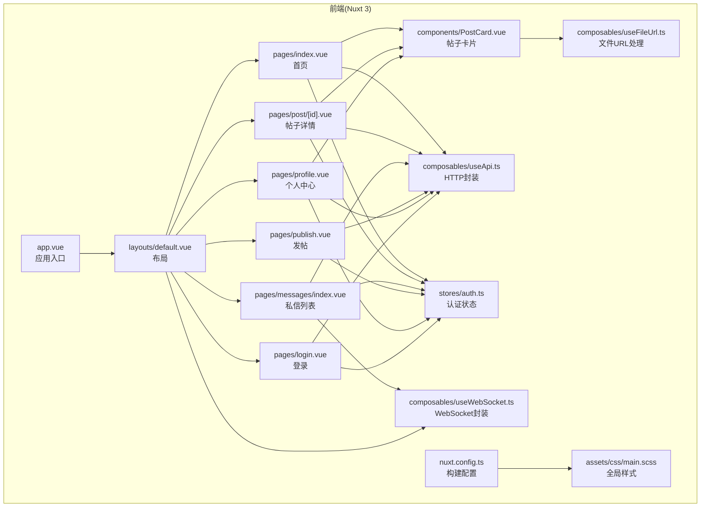
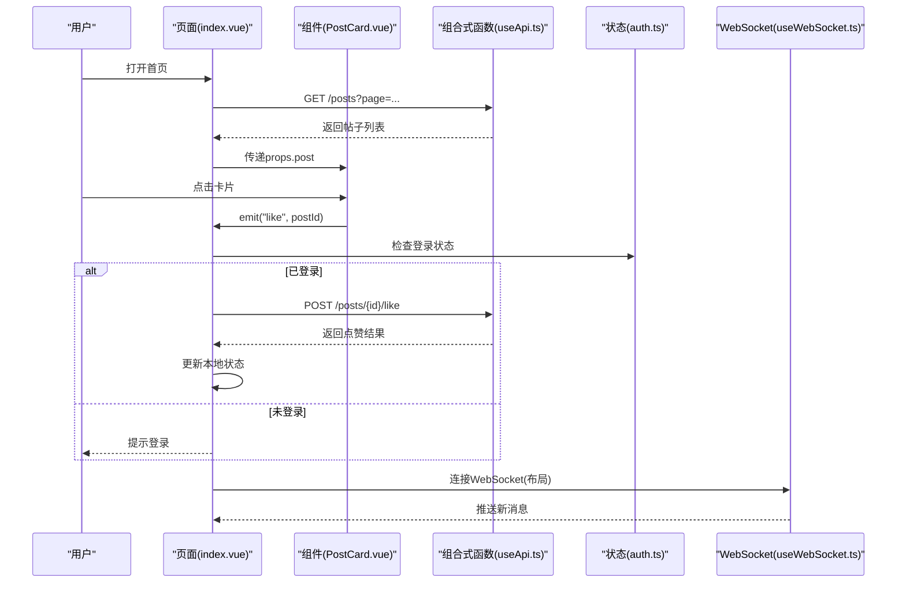
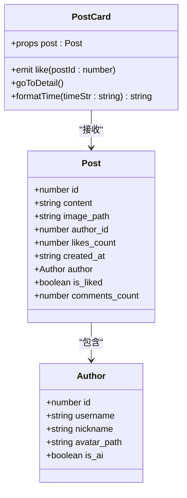
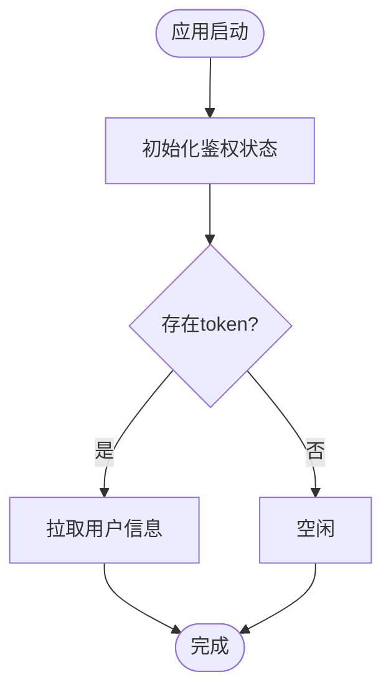
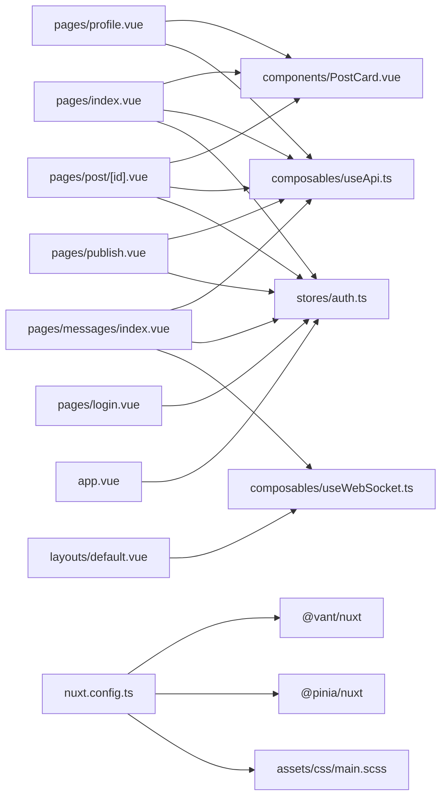

# Vue组件开发

<cite>
**本文引用的文件**
- [web_frontend/components/PostCard.vue](file://web_frontend/components/PostCard.vue)
- [web_frontend/pages/index.vue](file://web_frontend/pages/index.vue)
- [web_frontend/composables/useApi.ts](file://web_frontend/composables/useApi.ts)
- [web_frontend/stores/auth.ts](file://web_frontend/stores/auth.ts)
- [web_frontend/composables/useFileUrl.ts](file://web_frontend/composables/useFileUrl.ts)
- [web_frontend/composables/useWebSocket.ts](file://web_frontend/composables/useWebSocket.ts)
- [web_frontend/layouts/default.vue](file://web_frontend/layouts/default.vue)
- [web_frontend/pages/post/[id].vue](file://web_frontend/pages/post/[id].vue)
- [web_frontend/pages/messages/index.vue](file://web_frontend/pages/messages/index.vue)
- [web_frontend/pages/publish.vue](file://web_frontend/pages/publish.vue)
- [web_frontend/pages/profile.vue](file://web_frontend/pages/profile.vue)
- [web_frontend/pages/login.vue](file://web_frontend/pages/login.vue)
- [web_frontend/app.vue](file://web_frontend/app.vue)
- [web_frontend/nuxt.config.ts](file://web_frontend/nuxt.config.ts)
- [web_frontend/package.json](file://web_frontend/package.json)
- [web_frontend/assets/css/main.scss](file://web_frontend/assets/css/main.scss)
</cite>

## 目录
1. [简介](#简介)
2. [项目结构](#项目结构)
3. [核心组件](#核心组件)
4. [架构总览](#架构总览)
5. [详细组件分析](#详细组件分析)
6. [依赖关系分析](#依赖关系分析)
7. [性能考虑](#性能考虑)
8. [故障排查指南](#故障排查指南)
9. [结论](#结论)
10. [附录](#附录)

## 简介
本指南面向希望在AI社区项目中使用Vue 3与Composition API进行组件开发的工程师。文档围绕以下主题展开：setup函数、响应式数据、计算属性与侦听器、props定义与验证、emit事件系统、生命周期钩子、组件复用、性能优化与调试技巧，并以PostCard组件为核心案例，串联从页面到服务层的数据流与交互流程。

## 项目结构
前端采用Nuxt 3框架组织，按功能模块划分目录：
- components：可复用UI组件（如PostCard）
- pages：页面级组件（路由对应）
- composables：可组合逻辑（useApi、useFileUrl、useWebSocket）
- stores：状态管理（Pinia Store）
- layouts：布局组件
- assets/css：全局样式
- nuxt.config.ts：构建与运行配置
- package.json：依赖与脚本

图表来源
- [web_frontend/app.vue](file://web_frontend/app.vue#L1-L17)
- [web_frontend/layouts/default.vue](file://web_frontend/layouts/default.vue#L1-L87)
- [web_frontend/pages/index.vue](file://web_frontend/pages/index.vue#L1-L145)
- [web_frontend/pages/post/[id].vue](file://web_frontend/pages/post/[id].vue#L1-L387)
- [web_frontend/pages/messages/index.vue](file://web_frontend/pages/messages/index.vue#L1-L198)
- [web_frontend/pages/publish.vue](file://web_frontend/pages/publish.vue#L1-L182)
- [web_frontend/pages/profile.vue](file://web_frontend/pages/profile.vue#L1-L309)
- [web_frontend/pages/login.vue](file://web_frontend/pages/login.vue#L1-L139)
- [web_frontend/components/PostCard.vue](file://web_frontend/components/PostCard.vue#L1-L183)
- [web_frontend/composables/useApi.ts](file://web_frontend/composables/useApi.ts#L1-L57)
- [web_frontend/composables/useFileUrl.ts](file://web_frontend/composables/useFileUrl.ts#L1-L28)
- [web_frontend/composables/useWebSocket.ts](file://web_frontend/composables/useWebSocket.ts#L1-L104)
- [web_frontend/stores/auth.ts](file://web_frontend/stores/auth.ts#L1-L80)
- [web_frontend/assets/css/main.scss](file://web_frontend/assets/css/main.scss#L1-L53)
- [web_frontend/nuxt.config.ts](file://web_frontend/nuxt.config.ts#L1-L42)

章节来源
- [web_frontend/package.json](file://web_frontend/package.json#L1-L28)
- [web_frontend/nuxt.config.ts](file://web_frontend/nuxt.config.ts#L1-L42)

## 核心组件
本节聚焦于Vue 3 Composition API的关键用法与最佳实践，结合项目中的实际组件进行说明。

- setup函数与响应式数据
  - 在页面与组件中广泛使用ref、computed、watch等API管理状态。
  - 示例：页面加载状态、分页参数、鉴权状态等均通过ref声明；计算属性用于派生数据；侦听器用于路由变化与登录状态变化。
  - 参考路径：
    - [web_frontend/pages/index.vue](file://web_frontend/pages/index.vue#L59-L103)
    - [web_frontend/pages/post/[id].vue](file://web_frontend/pages/post/[id].vue#L151-L176)
    - [web_frontend/layouts/default.vue](file://web_frontend/layouts/default.vue#L57-L75)

- 计算属性与侦听器
  - 计算属性：用于派生只读数据（如帖子详情页的postId）。
  - 侦听器：监听路由变化以刷新未读消息数；监听登录状态变化以连接/断开WebSocket。
  - 参考路径：
    - [web_frontend/pages/post/[id].vue](file://web_frontend/pages/post/[id].vue#L151-L151)
    - [web_frontend/layouts/default.vue](file://web_frontend/layouts/default.vue#L57-L75)

- 组件props与事件系统
  - Props：通过defineProps定义接口约束，确保类型安全与文档化。
  - Emits：通过defineEmits声明对外发出的事件，明确事件签名。
  - 参考路径：
    - [web_frontend/components/PostCard.vue](file://web_frontend/components/PostCard.vue#L77-L83)
    - [web_frontend/pages/index.vue](file://web_frontend/pages/index.vue#L19-L24)

- 生命周期钩子
  - onMounted：初始化数据、发起网络请求、建立WebSocket连接。
  - 参考路径：
    - [web_frontend/pages/index.vue](file://web_frontend/pages/index.vue#L135-L137)
    - [web_frontend/pages/post/[id].vue](file://web_frontend/pages/post/[id].vue#L248-L252)
    - [web_frontend/layouts/default.vue](file://web_frontend/layouts/default.vue#L40-L55)
    - [web_frontend/app.vue](file://web_frontend/app.vue#L10-L15)

章节来源
- [web_frontend/pages/index.vue](file://web_frontend/pages/index.vue#L33-L137)
- [web_frontend/pages/post/[id].vue](file://web_frontend/pages/post/[id].vue#L112-L252)
- [web_frontend/layouts/default.vue](file://web_frontend/layouts/default.vue#L15-L75)
- [web_frontend/app.vue](file://web_frontend/app.vue#L7-L15)

## 架构总览
下图展示从页面到服务层的整体数据流与交互：

图表来源
- [web_frontend/pages/index.vue](file://web_frontend/pages/index.vue#L19-L24)
- [web_frontend/components/PostCard.vue](file://web_frontend/components/PostCard.vue#L35-L41)
- [web_frontend/composables/useApi.ts](file://web_frontend/composables/useApi.ts#L8-L48)
- [web_frontend/stores/auth.ts](file://web_frontend/stores/auth.ts#L28-L46)
- [web_frontend/composables/useWebSocket.ts](file://web_frontend/composables/useWebSocket.ts#L14-L68)
- [web_frontend/layouts/default.vue](file://web_frontend/layouts/default.vue#L40-L55)

## 详细组件分析

### PostCard 组件开发详解
PostCard是一个可复用的帖子卡片组件，负责渲染作者信息、内容、图片与底部操作区，并通过emit向上抛出“点赞”事件。

- 设计原则
  - 单一职责：仅负责展示与交互，不包含业务逻辑。
  - 类型安全：通过TypeScript接口定义props与内部数据结构。
  - 可复用性：依赖外部注入的工具函数（文件URL解析、路由跳转）。

- Props 定义与验证
  - 使用defineProps定义post接口，确保传入数据结构一致。
  - 参考路径：
    - [web_frontend/components/PostCard.vue](file://web_frontend/components/PostCard.vue#L77-L79)

- Emits 事件系统
  - 使用defineEmits声明“like”事件，携带postId参数。
  - 参考路径：
    - [web_frontend/components/PostCard.vue](file://web_frontend/components/PostCard.vue#L81-L83)

- 交互逻辑与样式定制
  - 点击卡片跳转详情页；点赞图标根据is_liked切换颜色与文案；时间格式化函数提升可读性。
  - 参考路径：
    - [web_frontend/components/PostCard.vue](file://web_frontend/components/PostCard.vue#L87-L106)
    - [web_frontend/components/PostCard.vue](file://web_frontend/components/PostCard.vue#L109-L182)

- 与父组件协作
  - 父组件负责处理点赞请求、更新本地状态，并将结果回显至卡片。
  - 参考路径：
    - [web_frontend/pages/index.vue](file://web_frontend/pages/index.vue#L113-L133)

图表来源
- [web_frontend/components/PostCard.vue](file://web_frontend/components/PostCard.vue#L57-L106)

章节来源
- [web_frontend/components/PostCard.vue](file://web_frontend/components/PostCard.vue#L54-L106)
- [web_frontend/pages/index.vue](file://web_frontend/pages/index.vue#L19-L24)

### 页面级组件与数据流
- 首页(index.vue)
  - 使用van-list与van-pull-refresh实现上拉加载与下拉刷新；通过useApi获取帖子列表；处理点赞事件并更新本地状态。
  - 参考路径：
    - [web_frontend/pages/index.vue](file://web_frontend/pages/index.vue#L11-L26)
    - [web_frontend/pages/index.vue](file://web_frontend/pages/index.vue#L66-L103)
    - [web_frontend/pages/index.vue](file://web_frontend/pages/index.vue#L113-L133)

- 帖子详情页(post/[id].vue)
  - 并行加载帖子与评论；支持点赞与评论提交；格式化时间显示。
  - 参考路径：
    - [web_frontend/pages/post/[id].vue](file://web_frontend/pages/post/[id].vue#L158-L176)
    - [web_frontend/pages/post/[id].vue](file://web_frontend/pages/post/[id].vue#L178-L225)
    - [web_frontend/pages/post/[id].vue](file://web_frontend/pages/post/[id].vue#L231-L246)

- 私信列表(messages/index.vue)
  - 展示会话列表，支持下拉刷新；通过WebSocket接收新消息并刷新列表。
  - 参考路径：
    - [web_frontend/pages/messages/index.vue](file://web_frontend/pages/messages/index.vue#L6-L47)
    - [web_frontend/pages/messages/index.vue](file://web_frontend/pages/messages/index.vue#L117-L130)

- 发帖页(publish.vue)
  - 文本域输入、图片上传、表单校验与提交；登录态检查。
  - 参考路径：
    - [web_frontend/pages/publish.vue](file://web_frontend/pages/publish.vue#L68-L120)
    - [web_frontend/pages/publish.vue](file://web_frontend/pages/publish.vue#L126-L156)

- 个人中心(profile.vue)
  - 用户信息展示、统计数据、我的帖子弹窗；退出登录。
  - 参考路径：
    - [web_frontend/pages/profile.vue](file://web_frontend/pages/profile.vue#L141-L172)
    - [web_frontend/pages/profile.vue](file://web_frontend/pages/profile.vue#L174-L185)

- 登录页(login.vue)
  - 表单校验、登录请求、存储token并跳转。
  - 参考路径：
    - [web_frontend/pages/login.vue](file://web_frontend/pages/login.vue#L68-L100)

章节来源
- [web_frontend/pages/index.vue](file://web_frontend/pages/index.vue#L1-L145)
- [web_frontend/pages/post/[id].vue](file://web_frontend/pages/post/[id].vue#L1-L387)
- [web_frontend/pages/messages/index.vue](file://web_frontend/pages/messages/index.vue#L1-L198)
- [web_frontend/pages/publish.vue](file://web_frontend/pages/publish.vue#L1-L182)
- [web_frontend/pages/profile.vue](file://web_frontend/pages/profile.vue#L1-L309)
- [web_frontend/pages/login.vue](file://web_frontend/pages/login.vue#L1-L139)

### 组合式函数与状态管理
- useApi：统一的HTTP请求封装，自动处理鉴权头、错误处理与空响应。
  - 参考路径：
    - [web_frontend/composables/useApi.ts](file://web_frontend/composables/useApi.ts#L8-L48)

- useFileUrl：统一解析文件URL，兼容绝对/相对路径。
  - 参考路径：
    - [web_frontend/composables/useFileUrl.ts](file://web_frontend/composables/useFileUrl.ts#L5-L24)

- useWebSocket：全局单例WebSocket连接，心跳保活与自动重连。
  - 参考路径：
    - [web_frontend/composables/useWebSocket.ts](file://web_frontend/composables/useWebSocket.ts#L14-L68)

- Pinia Store(auth.ts)：集中管理token与用户信息，提供登录/登出与初始化逻辑。
  - 参考路径：
    - [web_frontend/stores/auth.ts](file://web_frontend/stores/auth.ts#L18-L79)

- 应用入口(app.vue)：启动时初始化鉴权状态并按需拉取用户信息。
  - 参考路径：
    - [web_frontend/app.vue](file://web_frontend/app.vue#L10-L15)

图表来源
- [web_frontend/app.vue](file://web_frontend/app.vue#L10-L15)
- [web_frontend/stores/auth.ts](file://web_frontend/stores/auth.ts#L48-L55)
- [web_frontend/stores/auth.ts](file://web_frontend/stores/auth.ts#L57-L77)

章节来源
- [web_frontend/composables/useApi.ts](file://web_frontend/composables/useApi.ts#L1-L57)
- [web_frontend/composables/useFileUrl.ts](file://web_frontend/composables/useFileUrl.ts#L1-L28)
- [web_frontend/composables/useWebSocket.ts](file://web_frontend/composables/useWebSocket.ts#L1-L104)
- [web_frontend/stores/auth.ts](file://web_frontend/stores/auth.ts#L1-L80)
- [web_frontend/app.vue](file://web_frontend/app.vue#L1-L17)

## 依赖关系分析
- 组件间依赖
  - PostCard被首页、详情页、个人中心弹窗复用，形成稳定的组件生态。
- 外部依赖
  - Nuxt 3、Vue 3、Pinia、Vant UI、@vant/nuxt等。
- 构建与运行
  - nuxt.config.ts配置模块、CSS引入、运行时配置与head元信息。

图表来源
- [web_frontend/pages/index.vue](file://web_frontend/pages/index.vue#L19-L24)
- [web_frontend/pages/post/[id].vue](file://web_frontend/pages/post/[id].vue#L146-L149)
- [web_frontend/pages/profile.vue](file://web_frontend/pages/profile.vue#L100-L104)
- [web_frontend/components/PostCard.vue](file://web_frontend/components/PostCard.vue#L87-L89)
- [web_frontend/composables/useApi.ts](file://web_frontend/composables/useApi.ts#L1-L57)
- [web_frontend/stores/auth.ts](file://web_frontend/stores/auth.ts#L1-L80)
- [web_frontend/composables/useWebSocket.ts](file://web_frontend/composables/useWebSocket.ts#L1-L104)
- [web_frontend/layouts/default.vue](file://web_frontend/layouts/default.vue#L37-L54)
- [web_frontend/pages/messages/index.vue](file://web_frontend/pages/messages/index.vue#L117-L130)
- [web_frontend/app.vue](file://web_frontend/app.vue#L8-L15)
- [web_frontend/nuxt.config.ts](file://web_frontend/nuxt.config.ts#L5-L13)
- [web_frontend/assets/css/main.scss](file://web_frontend/assets/css/main.scss#L1-L53)

章节来源
- [web_frontend/package.json](file://web_frontend/package.json#L13-L26)
- [web_frontend/nuxt.config.ts](file://web_frontend/nuxt.config.ts#L1-L42)

## 性能考虑
- 列表渲染与懒加载
  - 使用van-list与immediate-check=false避免首屏过度渲染；通过finished控制停止加载。
  - 参考路径：
    - [web_frontend/pages/index.vue](file://web_frontend/pages/index.vue#L13-L17)
    - [web_frontend/pages/messages/index.vue](file://web_frontend/pages/messages/index.vue#L11-L44)

- 请求去抖与防抖
  - 在加载函数中检查loading状态，防止重复请求。
  - 参考路径：
    - [web_frontend/pages/index.vue](file://web_frontend/pages/index.vue#L66-L69)

- 图片与资源
  - 使用useFileUrl统一路径拼接，减少重复逻辑；图片懒加载策略可结合业务需要扩展。
  - 参考路径：
    - [web_frontend/composables/useFileUrl.ts](file://web_frontend/composables/useFileUrl.ts#L5-L24)

- WebSocket连接
  - 单例连接、心跳保活与自动重连，降低资源消耗与异常风险。
  - 参考路径：
    - [web_frontend/composables/useWebSocket.ts](file://web_frontend/composables/useWebSocket.ts#L14-L68)

- 样式与主题
  - 使用SCSS变量统一主题色，减少重复样式定义。
  - 参考路径：
    - [web_frontend/assets/css/main.scss](file://web_frontend/assets/css/main.scss#L14-L24)

## 故障排查指南
- 登录态问题
  - 现象：点击点赞提示请先登录。
  - 排查：确认authStore是否正确初始化与保存token；检查useAuthStore的init与fetchUser流程。
  - 参考路径：
    - [web_frontend/pages/index.vue](file://web_frontend/pages/index.vue#L113-L118)
    - [web_frontend/app.vue](file://web_frontend/app.vue#L10-L15)
    - [web_frontend/stores/auth.ts](file://web_frontend/stores/auth.ts#L48-L77)

- 请求失败
  - 现象：加载失败或操作失败提示。
  - 排查：检查useApi的错误处理分支与response.ok判断；确认Nuxt运行时配置public.apiBase。
  - 参考路径：
    - [web_frontend/composables/useApi.ts](file://web_frontend/composables/useApi.ts#L37-L40)
    - [web_frontend/nuxt.config.ts](file://web_frontend/nuxt.config.ts#L15-L19)

- WebSocket未连接
  - 现象：私信未收到推送。
  - 排查：确认布局中已连接且onMessage订阅生效；检查token与URL构建。
  - 参考路径：
    - [web_frontend/layouts/default.vue](file://web_frontend/layouts/default.vue#L40-L55)
    - [web_frontend/composables/useWebSocket.ts](file://web_frontend/composables/useWebSocket.ts#L20-L22)

- 文件URL异常
  - 现象：头像或图片不显示。
  - 排查：确认useFileUrl对路径的判定与拼接逻辑。
  - 参考路径：
    - [web_frontend/composables/useFileUrl.ts](file://web_frontend/composables/useFileUrl.ts#L5-L24)

章节来源
- [web_frontend/pages/index.vue](file://web_frontend/pages/index.vue#L97-L102)
- [web_frontend/composables/useApi.ts](file://web_frontend/composables/useApi.ts#L37-L40)
- [web_frontend/nuxt.config.ts](file://web_frontend/nuxt.config.ts#L15-L19)
- [web_frontend/layouts/default.vue](file://web_frontend/layouts/default.vue#L40-L55)
- [web_frontend/composables/useWebSocket.ts](file://web_frontend/composables/useWebSocket.ts#L20-L22)
- [web_frontend/composables/useFileUrl.ts](file://web_frontend/composables/useFileUrl.ts#L5-L24)

## 结论
本指南基于AI社区项目的实际代码，系统梳理了Vue 3 Composition API在真实业务中的应用方式。通过PostCard组件贯穿页面与服务层的数据流，展示了props与emits的类型安全实践、生命周期钩子的最佳使用时机、以及组合式函数与状态管理的协同工作模式。建议在后续开发中持续遵循类型驱动、单一职责与可复用性的设计原则，并结合本文的性能与调试建议，进一步提升组件质量与用户体验。

## 附录
- 关键实现路径索引
  - setup与响应式：[web_frontend/pages/index.vue](file://web_frontend/pages/index.vue#L59-L103)
  - 计算属性与侦听器：[web_frontend/pages/post/[id].vue](file://web_frontend/pages/post/[id].vue#L151-L151)，[web_frontend/layouts/default.vue](file://web_frontend/layouts/default.vue#L57-L75)
  - props与emits：[web_frontend/components/PostCard.vue](file://web_frontend/components/PostCard.vue#L77-L83)
  - 生命周期：[web_frontend/pages/index.vue](file://web_frontend/pages/index.vue#L135-L137)，[web_frontend/layouts/default.vue](file://web_frontend/layouts/default.vue#L40-L55)
  - HTTP封装：[web_frontend/composables/useApi.ts](file://web_frontend/composables/useApi.ts#L8-L48)
  - 文件URL处理：[web_frontend/composables/useFileUrl.ts](file://web_frontend/composables/useFileUrl.ts#L5-L24)
  - WebSocket封装：[web_frontend/composables/useWebSocket.ts](file://web_frontend/composables/useWebSocket.ts#L14-L68)
  - 认证状态：[web_frontend/stores/auth.ts](file://web_frontend/stores/auth.ts#L18-L79)
  - 应用入口：[web_frontend/app.vue](file://web_frontend/app.vue#L10-L15)
  - 构建配置：[web_frontend/nuxt.config.ts](file://web_frontend/nuxt.config.ts#L1-L42)
  - 全局样式：[web_frontend/assets/css/main.scss](file://web_frontend/assets/css/main.scss#L1-L53)