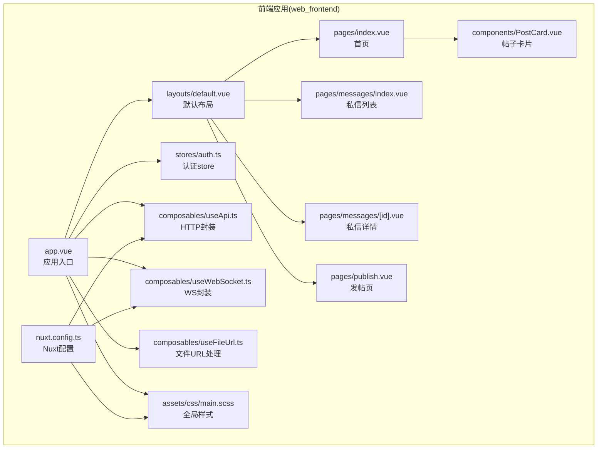
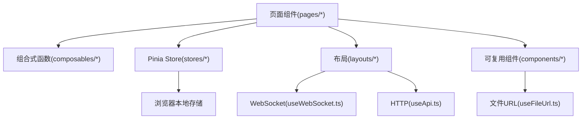
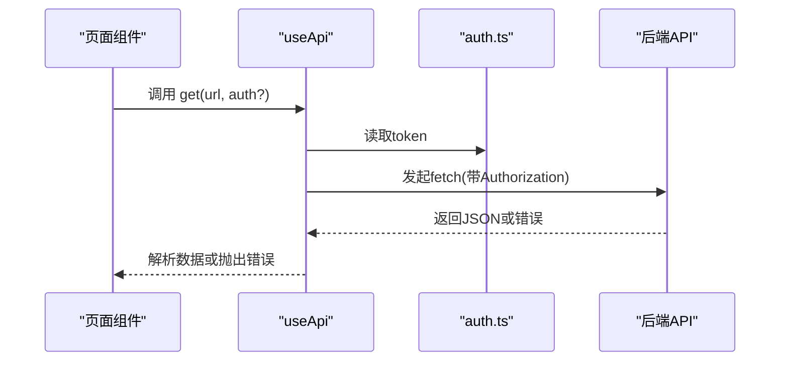
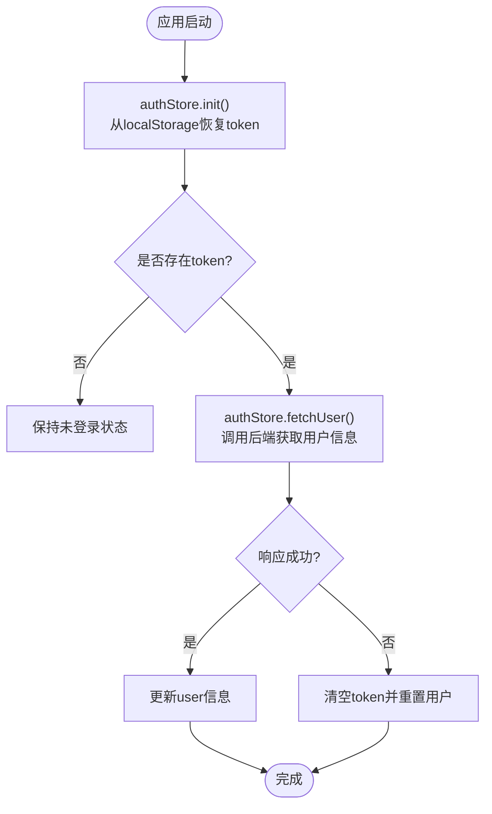
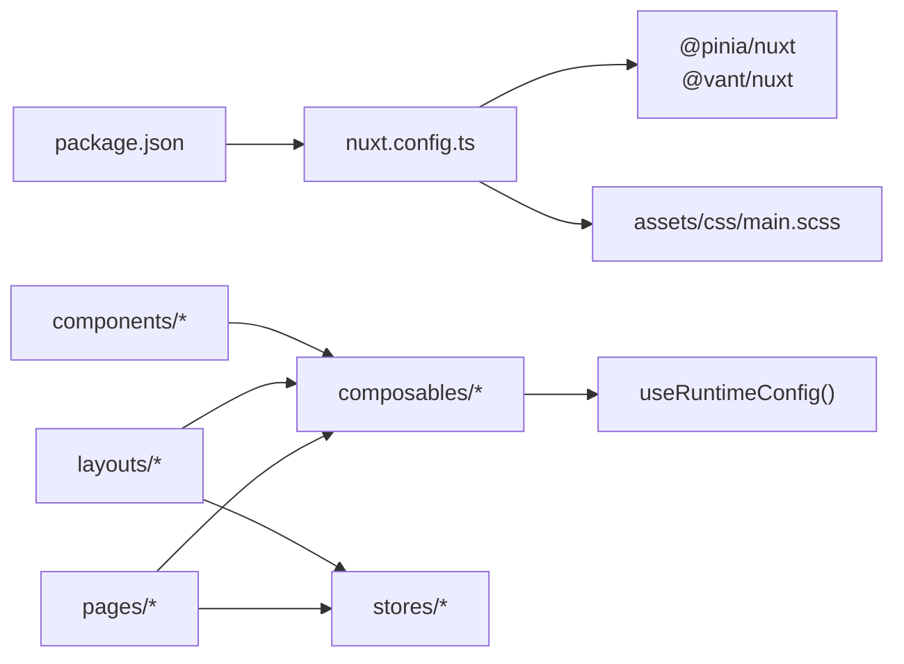

# 前端组件扩展

<cite>
**本文引用的文件**
- [package.json](file://web_frontend/package.json)
- [nuxt.config.ts](file://web_frontend/nuxt.config.ts)
- [app.vue](file://web_frontend/app.vue)
- [default.vue](file://web_frontend/layouts/default.vue)
- [auth.ts](file://web_frontend/stores/auth.ts)
- [useApi.ts](file://web_frontend/composables/useApi.ts)
- [useWebSocket.ts](file://web_frontend/composables/useWebSocket.ts)
- [useFileUrl.ts](file://web_frontend/composables/useFileUrl.ts)
- [PostCard.vue](file://web_frontend/components/PostCard.vue)
- [index.vue](file://web_frontend/pages/index.vue)
- [messages/index.vue](file://web_frontend/pages/messages/index.vue)
- [messages/[id].vue](file://web_frontend/pages/messages/[id].vue)
- [publish.vue](file://web_frontend/pages/publish.vue)
- [main.scss](file://web_frontend/assets/css/main.scss)
- [README.md](file://README.md)
</cite>

## 目录
1. [简介](#简介)
2. [项目结构](#项目结构)
3. [核心组件](#核心组件)
4. [架构总览](#架构总览)
5. [组件详解](#组件详解)
6. [依赖关系分析](#依赖关系分析)
7. [性能考量](#性能考量)
8. [故障排查指南](#故障排查指南)
9. [结论](#结论)
10. [附录](#附录)

## 简介
本指南面向希望在AI社区项目前端中进行扩展开发的工程师，围绕Vue 3与Nuxt 3生态，系统讲解组件扩展、页面开发、组合式函数（Composables）与状态管理（Pinia）的实践方法。通过现有代码中的真实实现，给出可复用的模式与最佳实践，帮助你快速构建高质量的前端功能。

## 项目结构
- 前端位于 web_frontend 目录，基于 Nuxt 3 + Vue 3 + Pinia + Vant 移动端组件库。
- 关键目录职责：
  - components：可复用UI组件（如帖子卡片）
  - composables：组合式函数（API封装、WebSocket、文件URL处理）
  - pages：页面级组件（路由页面）
  - layouts：布局组件（全局底部导航、状态同步）
  - stores：Pinia状态管理（认证状态）
  - assets/css：全局样式与SCSS变量
  - nuxt.config.ts：模块、CSS、运行时配置
  - package.json：依赖与脚本

图表来源
- [app.vue](file://web_frontend/app.vue#L1-L17)
- [default.vue](file://web_frontend/layouts/default.vue#L1-L87)
- [index.vue](file://web_frontend/pages/index.vue#L1-L145)
- [messages/index.vue](file://web_frontend/pages/messages/index.vue#L1-L198)
- [messages/[id].vue](file://web_frontend/pages/messages/[id].vue#L1-L317)
- [publish.vue](file://web_frontend/pages/publish.vue#L1-L182)
- [PostCard.vue](file://web_frontend/components/PostCard.vue#L1-L183)
- [auth.ts](file://web_frontend/stores/auth.ts#L1-L80)
- [useApi.ts](file://web_frontend/composables/useApi.ts#L1-L57)
- [useWebSocket.ts](file://web_frontend/composables/useWebSocket.ts#L1-L104)
- [useFileUrl.ts](file://web_frontend/composables/useFileUrl.ts#L1-L28)
- [main.scss](file://web_frontend/assets/css/main.scss#L1-L53)
- [nuxt.config.ts](file://web_frontend/nuxt.config.ts#L1-L42)

章节来源
- [README.md](file://README.md#L15-L35)
- [nuxt.config.ts](file://web_frontend/nuxt.config.ts#L1-L42)
- [package.json](file://web_frontend/package.json#L1-L28)

## 核心组件
- 组件层：PostCard.vue 提供统一的帖子展示与交互（点赞、跳转详情），具备props定义、事件发射与生命周期使用。
- 页面层：index.vue、messages/index.vue、messages/[id].vue、publish.vue 展示了列表加载、分页、下拉刷新、私信聊天、图片上传与WebSocket消息推送等典型场景。
- 组合式函数层：useApi.ts、useWebSocket.ts、useFileUrl.ts 封装了HTTP请求、WebSocket连接与文件URL解析，形成跨页面复用能力。
- 状态管理层：auth.ts 使用 Pinia 管理token与用户信息，支持初始化、持久化与用户信息获取。

章节来源
- [PostCard.vue](file://web_frontend/components/PostCard.vue#L54-L107)
- [index.vue](file://web_frontend/pages/index.vue#L33-L138)
- [messages/index.vue](file://web_frontend/pages/messages/index.vue#L51-L131)
- [messages/[id].vue](file://web_frontend/pages/messages/[id].vue#L65-L219)
- [publish.vue](file://web_frontend/pages/publish.vue#L59-L156)
- [useApi.ts](file://web_frontend/composables/useApi.ts#L1-L57)
- [useWebSocket.ts](file://web_frontend/composables/useWebSocket.ts#L1-L104)
- [useFileUrl.ts](file://web_frontend/composables/useFileUrl.ts#L1-L28)
- [auth.ts](file://web_frontend/stores/auth.ts#L1-L80)

## 架构总览
前端采用“布局-页面-组件-组合式函数-状态管理”的分层架构，页面通过组合式函数与store进行数据与行为抽象，组件负责UI与交互，布局统一处理导航与全局状态同步。

图表来源
- [default.vue](file://web_frontend/layouts/default.vue#L15-L79)
- [index.vue](file://web_frontend/pages/index.vue#L33-L138)
- [messages/index.vue](file://web_frontend/pages/messages/index.vue#L51-L131)
- [messages/[id].vue](file://web_frontend/pages/messages/[id].vue#L65-L219)
- [useApi.ts](file://web_frontend/composables/useApi.ts#L1-L57)
- [useWebSocket.ts](file://web_frontend/composables/useWebSocket.ts#L1-L104)
- [useFileUrl.ts](file://web_frontend/composables/useFileUrl.ts#L1-L28)
- [auth.ts](file://web_frontend/stores/auth.ts#L1-L80)

## 组件详解

### Vue 3 组件扩展指南
- 组件创建
  - 使用 <script setup> 与 TypeScript 接口定义 props 类型，确保类型安全与IDE提示。
  - 在模板中使用作用域样式与移动端UI库（Vant）组件，提升交互体验。
- Props 定义
  - 通过 defineProps<Interface>() 明确传入数据结构，避免运行期错误。
- 事件处理
  - 使用 defineEmits 声明事件签名，保证父子通信契约清晰。
- 生命周期管理
  - 在 onMounted 中发起数据加载与资源初始化；在 watch 中监听状态变化以触发副作用。
- 示例参考
  - 帖子卡片组件：PostCard.vue 展示了 props、事件、路由跳转与时间格式化的完整用法。

章节来源
- [PostCard.vue](file://web_frontend/components/PostCard.vue#L54-L107)

### Nuxt 3 页面组件开发流程
- 路由配置
  - Nuxt 3 基于文件系统的路由，页面文件名即路由路径；动态路由使用方括号命名。
- 页面布局
  - 默认布局 default.vue 提供底部导航与全局状态（未读消息计数、WebSocket连接），页面通过 NuxtLayout/NuxtPage 组合。
- 数据获取
  - 页面在 onMounted 中触发数据加载；使用 useApi 封装的 GET/POST 方法与后端交互；结合 vant 的 PullRefresh/List 实现下拉刷新与无限滚动。
- 示例参考
  - 首页 index.vue：列表渲染、分页、点赞交互、登录态校验。
  - 私信列表 messages/index.vue：会话列表、未读数、WebSocket消息到达刷新。
  - 私信详情 messages/[id].vue：消息历史加载、滚动加载更多、实时消息推送、自动已读。
  - 发帖页 publish.vue：富文本输入、图片上传、提交发布。

章节来源
- [default.vue](file://web_frontend/layouts/default.vue#L1-L87)
- [index.vue](file://web_frontend/pages/index.vue#L33-L138)
- [messages/index.vue](file://web_frontend/pages/messages/index.vue#L51-L131)
- [messages/[id].vue](file://web_frontend/pages/messages/[id].vue#L65-L219)
- [publish.vue](file://web_frontend/pages/publish.vue#L59-L156)

### 组合式函数扩展方式
- useApi：封装 fetch 请求，自动注入认证头、错误处理与204特殊处理，暴露 get/post/put/delete 方法。
- useWebSocket：全局单例WebSocket连接，自动心跳、断线重连、消息分发与清理；提供 onMessage 订阅接口。
- useFileUrl：统一分辨完整URL、相对路径与API Base拼接，适配多类资源地址。
- 自定义组合函数建议
  - 单一职责：每个组合函数聚焦一个领域能力（如鉴权、缓存、节流防抖）。
  - 状态隔离：内部使用 ref/computed，对外暴露只读状态与受控方法。
  - 错误处理：统一抛出可识别的错误，便于上层toast或降级处理。
  - 资源清理：在 onUnmounted 或组合函数内部提供清理方法，避免内存泄漏。

图表来源
- [useApi.ts](file://web_frontend/composables/useApi.ts#L8-L48)
- [auth.ts](file://web_frontend/stores/auth.ts#L57-L77)

章节来源
- [useApi.ts](file://web_frontend/composables/useApi.ts#L1-L57)
- [useWebSocket.ts](file://web_frontend/composables/useWebSocket.ts#L1-L104)
- [useFileUrl.ts](file://web_frontend/composables/useFileUrl.ts#L1-L28)

### 状态管理扩展方法（Pinia）
- 认证状态
  - 初始化：在应用挂载时从localStorage恢复token。
  - 持久化：登录设置token时写入localStorage；登出清除。
  - 异步处理：fetchUser 通过运行时配置的API Base调用后端，根据响应更新用户信息或触发登出。
- 扩展建议
  - 分离模块：将用户、主题、语言等拆分为独立store，降低耦合。
  - 持久化策略：对轻量状态使用localStorage/sessionStorage；对敏感或大对象考虑服务端同步。
  - 并发控制：对高频动作（如点赞）使用防抖或乐观更新，再与后端结果对齐。

图表来源
- [app.vue](file://web_frontend/app.vue#L7-L15)
- [auth.ts](file://web_frontend/stores/auth.ts#L48-L77)

章节来源
- [auth.ts](file://web_frontend/stores/auth.ts#L1-L80)
- [app.vue](file://web_frontend/app.vue#L1-L17)

### 组件通信、样式定制与响应式设计
- 组件通信
  - 父子：通过 props 传递数据，通过 emits 发射事件；PostCard.vue 展示了点赞事件的发射与接收。
  - 兄弟/跨层：通过 provide/inject 暴露刷新方法；default.vue 通过 provide('refreshUnreadCount') 供子页面调用。
- 样式定制
  - 使用 SCSS 变量与通用类（如 .page-container、.card）统一风格；组件样式使用 scoped 避免污染。
  - Vant 组件样式可通过 :deep 选择器进行局部覆盖。
- 响应式设计
  - 使用 Vant 的移动端组件与固定布局（fixed placeholder）适配手机屏幕；在样式中使用弹性布局与最大宽度控制。

章节来源
- [PostCard.vue](file://web_frontend/components/PostCard.vue#L77-L83)
- [default.vue](file://web_frontend/layouts/default.vue#L77-L79)
- [main.scss](file://web_frontend/assets/css/main.scss#L14-L53)

## 依赖关系分析
- 模块与配置
  - nuxt.config.ts 启用 @pinia/nuxt 与 @vant/nuxt，引入全局CSS与运行时配置（API Base）。
  - package.json 指定 nuxt、vue、pinia、vant 等依赖及脚本。
- 组件间依赖
  - 页面依赖组合式函数与store；布局依赖组合式函数与store；组件依赖组合式函数与store。
- 外部依赖
  - fetch 用于HTTP请求；WebSocket用于实时消息；Vant 提供UI组件与交互反馈。

图表来源
- [package.json](file://web_frontend/package.json#L13-L26)
- [nuxt.config.ts](file://web_frontend/nuxt.config.ts#L5-L40)

章节来源
- [package.json](file://web_frontend/package.json#L1-L28)
- [nuxt.config.ts](file://web_frontend/nuxt.config.ts#L1-L42)

## 性能考量
- 列表加载
  - 使用 van-list 与分页参数控制加载节奏；在 reset 场景重置页码与数组，避免重复数据。
- 无限滚动
  - 结合 scrollTop 与 hasMore 控制加载时机，减少不必要的请求。
- WebSocket
  - 心跳与断线重连降低连接失效风险；消息去重与延迟刷新避免频繁渲染。
- 图片与资源
  - 使用 useFileUrl 统一资源URL，避免重复拼接；上传图片时及时关闭loading与toast。
- 样式与渲染
  - 组件样式scoped与SCSS变量减少样式冲突；合理使用 v-show/v-if 与 v-for key 提升渲染效率。

## 故障排查指南
- 登录态异常
  - 检查 authStore.init 是否正确从localStorage读取token；fetchUser 失败时会触发logout，确认后端返回与网络状态。
- 请求失败
  - useApi 对非2xx响应抛出错误，检查后端接口与Authorization头；204无内容时返回null需注意调用方处理。
- WebSocket 不通
  - 确认 useWebSocket 的URL构建（http->ws/wss）与token拼接；查看onclose与自动重连逻辑。
- 图片显示异常
  - 使用 useFileUrl 统一解析路径；若返回空字符串，页面需提供占位图。
- 页面空白或导航异常
  - 检查 default.vue 的底部导航与路由配置；确认 NuxtLayout/NuxtPage 包裹。

章节来源
- [auth.ts](file://web_frontend/stores/auth.ts#L48-L77)
- [useApi.ts](file://web_frontend/composables/useApi.ts#L35-L47)
- [useWebSocket.ts](file://web_frontend/composables/useWebSocket.ts#L14-L68)
- [useFileUrl.ts](file://web_frontend/composables/useFileUrl.ts#L5-L24)
- [default.vue](file://web_frontend/layouts/default.vue#L6-L12)

## 结论
通过现有实现可以总结出一套可复用的前端扩展范式：以页面为中心组织数据流，以组合式函数抽象能力，以store集中管理状态，以布局统一处理全局行为。遵循本文的组件扩展、页面开发、状态管理与通信样式规范，可高效迭代出稳定可靠的前端功能。

## 附录
- 快速开始
  - 安装依赖：在 web_frontend 目录执行安装脚本。
  - 启动开发：运行 dev 脚本启动Nuxt开发服务器。
- API Base
  - 通过 nuxt.config.ts 的 runtimeConfig.public.apiBase 配置后端地址，可在 .env 中覆盖。

章节来源
- [README.md](file://README.md#L114-L121)
- [nuxt.config.ts](file://web_frontend/nuxt.config.ts#L15-L19)
- [package.json](file://web_frontend/package.json#L6-L12)