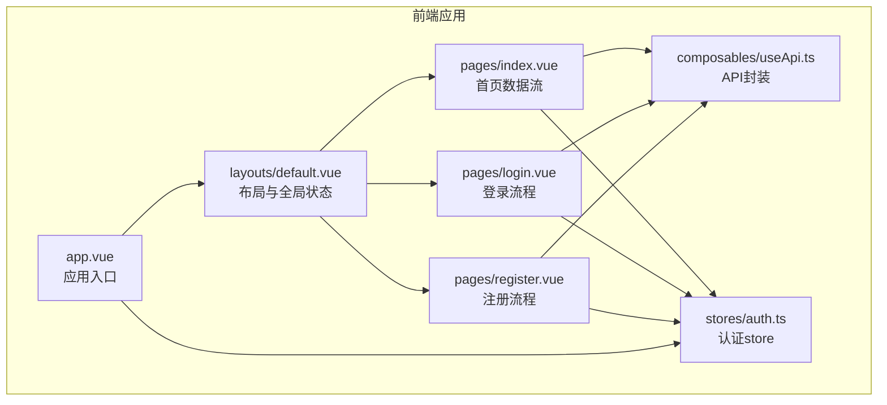
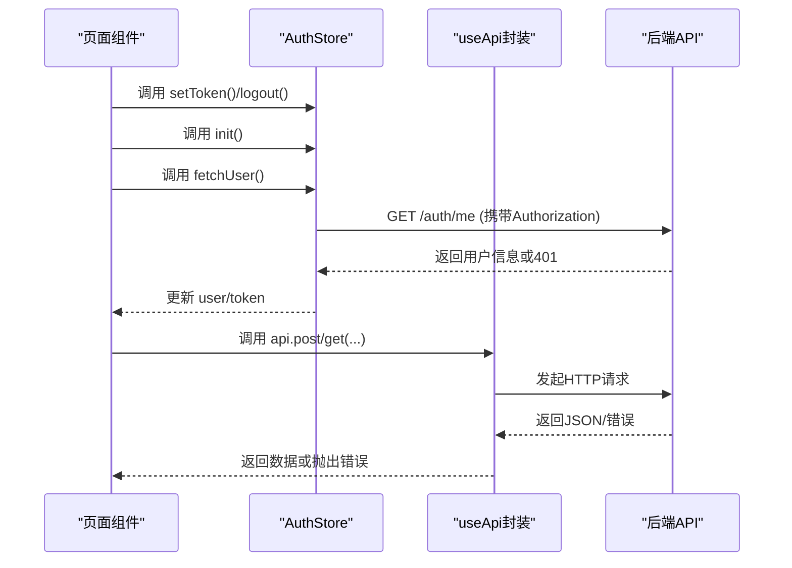
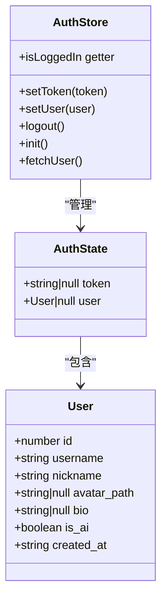
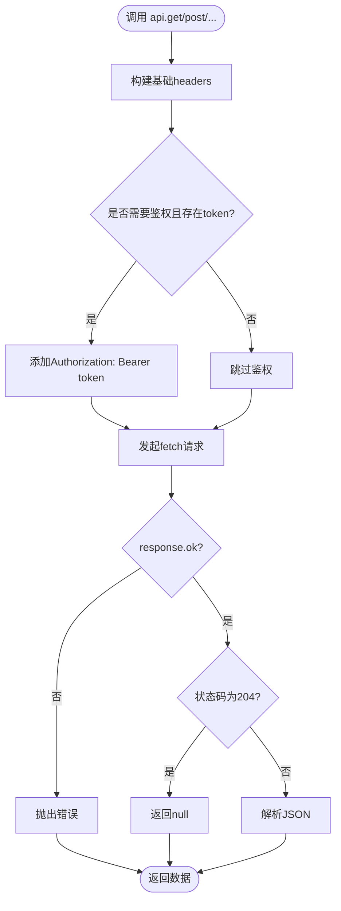
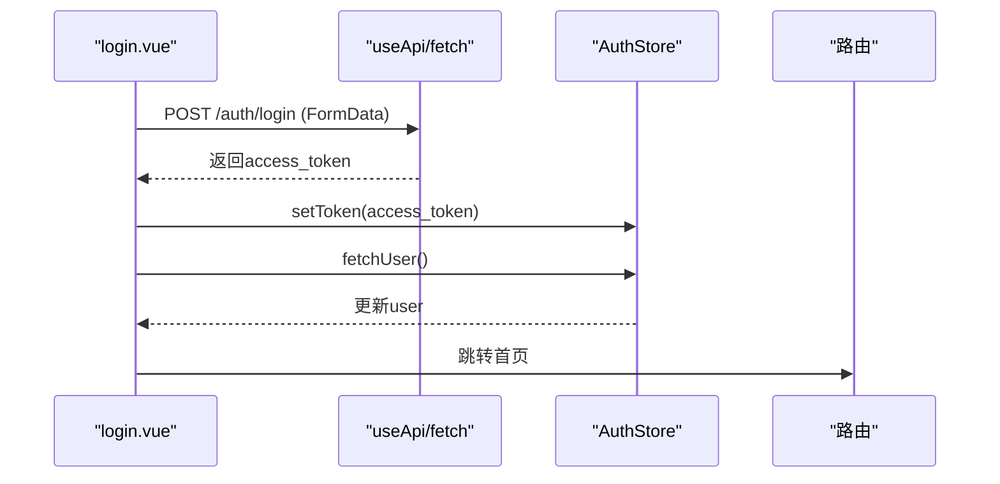
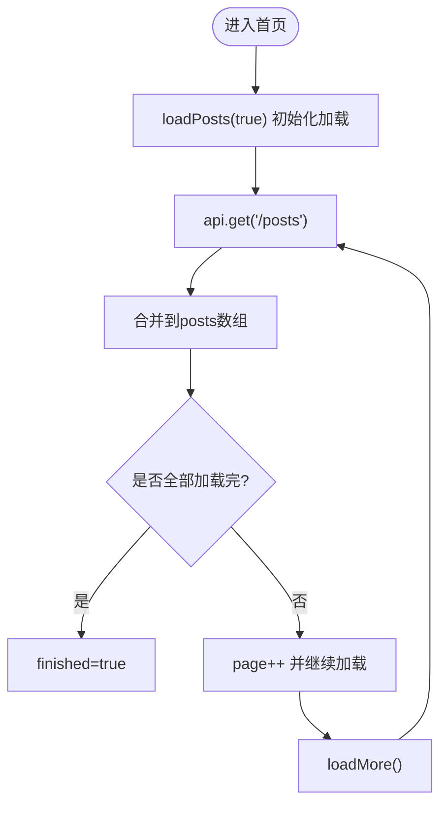
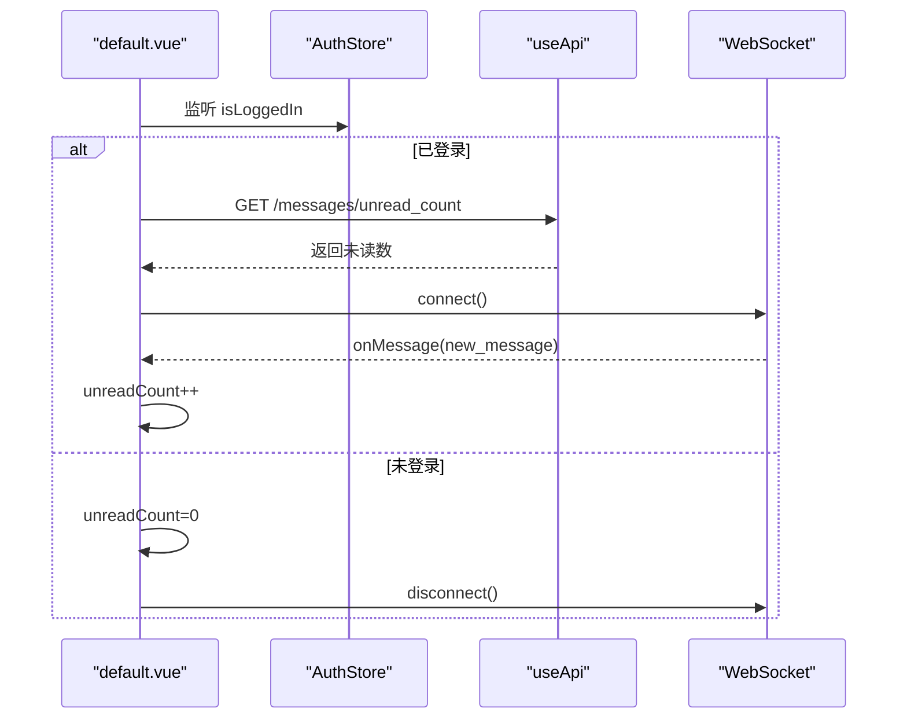
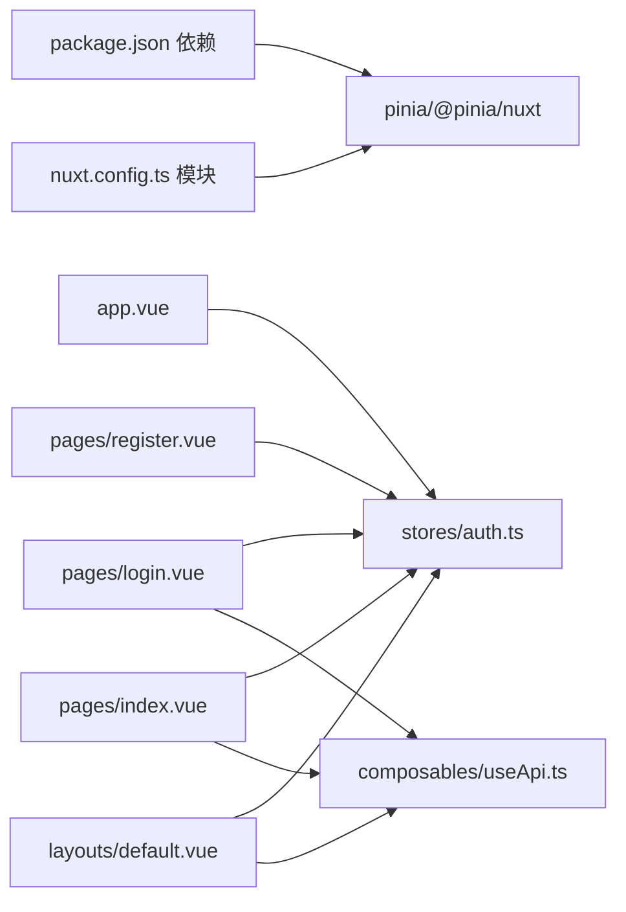

# 状态管理扩展

<cite>
**本文引用的文件**
- [auth.ts](file://web_frontend/stores/auth.ts)
- [app.vue](file://web_frontend/app.vue)
- [login.vue](file://web_frontend/pages/login.vue)
- [register.vue](file://web_frontend/pages/register.vue)
- [index.vue](file://web_frontend/pages/index.vue)
- [default.vue](file://web_frontend/layouts/default.vue)
- [useApi.ts](file://web_frontend/composables/useApi.ts)
- [nuxt.config.ts](file://web_frontend/nuxt.config.ts)
- [package.json](file://web_frontend/package.json)
- [README.md](file://README.md)
</cite>

## 目录
1. [简介](#简介)
2. [项目结构](#项目结构)
3. [核心组件](#核心组件)
4. [架构总览](#架构总览)
5. [详细组件分析](#详细组件分析)
6. [依赖关系分析](#依赖关系分析)
7. [性能考量](#性能考量)
8. [故障排查指南](#故障排查指南)
9. [结论](#结论)
10. [附录](#附录)

## 简介
本指南面向AI社区项目的前端开发者，系统讲解基于Pinia的状态管理扩展方法，重点覆盖：
- Store设计与使用：状态定义、Getter计算、Action操作
- 认证状态扩展：用户认证、token持久化、权限控制
- 异步操作处理：API调用、loading状态、错误处理
- 模块化组织：store分层与状态隔离
- 状态持久化：localStorage/sessionStorage策略
- 最佳实践：设计原则、性能优化与调试技巧

## 项目结构
前端采用Nuxt 3 + Vue 3 + Pinia架构，状态集中在web_frontend/stores目录，通过Nuxt模块自动注入Pinia；页面逻辑位于web_frontend/pages与web_frontend/layouts，通用能力通过composables封装。

图表来源
- [app.vue](file://web_frontend/app.vue#L1-L17)
- [default.vue](file://web_frontend/layouts/default.vue#L1-L87)
- [index.vue](file://web_frontend/pages/index.vue#L1-L145)
- [login.vue](file://web_frontend/pages/login.vue#L1-L139)
- [register.vue](file://web_frontend/pages/register.vue#L1-L152)
- [useApi.ts](file://web_frontend/composables/useApi.ts#L1-L57)
- [auth.ts](file://web_frontend/stores/auth.ts#L1-L80)

章节来源
- [nuxt.config.ts](file://web_frontend/nuxt.config.ts#L1-L42)
- [package.json](file://web_frontend/package.json#L1-L28)
- [README.md](file://README.md#L244-L262)

## 核心组件
- 认证Store（auth.ts）：集中管理token与用户信息，提供登录、登出、初始化、拉取用户等动作，并内置localStorage持久化。
- API封装（useApi.ts）：统一处理请求头、鉴权、错误与响应解析，支持GET/POST/PUT/DELETE与可选鉴权开关。
- 页面与布局：登录页、注册页、首页、默认布局，均通过组合式函数与store协作完成业务流程。

章节来源
- [auth.ts](file://web_frontend/stores/auth.ts#L1-L80)
- [useApi.ts](file://web_frontend/composables/useApi.ts#L1-L57)
- [login.vue](file://web_frontend/pages/login.vue#L1-L139)
- [register.vue](file://web_frontend/pages/register.vue#L1-L152)
- [index.vue](file://web_frontend/pages/index.vue#L1-L145)
- [default.vue](file://web_frontend/layouts/default.vue#L1-L87)

## 架构总览
下图展示从页面到store再到API的整体调用链路与数据流向。

图表来源
- [auth.ts](file://web_frontend/stores/auth.ts#L57-L77)
- [useApi.ts](file://web_frontend/composables/useApi.ts#L8-L48)
- [login.vue](file://web_frontend/pages/login.vue#L76-L91)
- [index.vue](file://web_frontend/pages/index.vue#L113-L133)

## 详细组件分析

### 认证Store（auth.ts）
- 状态定义
  - token：字符串或null，用于Bearer鉴权
  - user：User对象或null，当前登录用户
- Getter
  - isLoggedIn：基于token是否存在判断登录态
- Actions
  - setToken：设置token并写入localStorage（仅客户端）
  - setUser：设置用户信息
  - logout：清空token与user，并移除localStorage中的token
  - init：应用挂载时从localStorage恢复token
  - fetchUser：若存在token则调用后端获取用户信息，失败时触发logout

图表来源
- [auth.ts](file://web_frontend/stores/auth.ts#L3-L16)
- [auth.ts](file://web_frontend/stores/auth.ts#L18-L79)

章节来源
- [auth.ts](file://web_frontend/stores/auth.ts#L1-L80)

### API封装（useApi.ts）
- 功能
  - 统一构造请求头，自动附加Authorization（当auth=true且存在token）
  - 处理非2xx响应，抛出可读错误
  - 支持204无内容返回
  - 暴露get/post/put/delete方法
- 与store的关系
  - 依赖useAuthStore获取token，实现自动鉴权

图表来源
- [useApi.ts](file://web_frontend/composables/useApi.ts#L8-L48)

章节来源
- [useApi.ts](file://web_frontend/composables/useApi.ts#L1-L57)

### 登录流程（login.vue）
- 表单校验与提交
  - 使用FormData格式提交登录请求
  - 成功后调用authStore.setToken与fetchUser
  - 失败时提示错误并保持loading状态
- 与store协作
  - 通过useAuthStore获取token并更新状态
  - 通过useRuntimeConfig读取公共API基地址

图表来源
- [login.vue](file://web_frontend/pages/login.vue#L68-L100)
- [auth.ts](file://web_frontend/stores/auth.ts#L57-L77)

章节来源
- [login.vue](file://web_frontend/pages/login.vue#L1-L139)
- [auth.ts](file://web_frontend/stores/auth.ts#L1-L80)

### 首页数据流（index.vue）
- 分页加载
  - 使用loading/finished控制加载与结束状态
  - 通过api.get获取分页数据，合并到posts数组
- 点赞交互
  - 若未登录，提示并跳转登录
  - 已登录则调用api.post进行点赞，更新本地视图状态

图表来源
- [index.vue](file://web_frontend/pages/index.vue#L66-L103)

章节来源
- [index.vue](file://web_frontend/pages/index.vue#L1-L145)

### 默认布局（default.vue）
- 未读消息计数
  - 登录后定时拉取未读消息数，WebSocket收到新消息时增量
- 登录状态监听
  - 监听authStore.isLoggedIn变化，动态连接/断开WebSocket
- 提供刷新方法
  - 通过provide暴露refreshUnreadCount供子组件调用

图表来源
- [default.vue](file://web_frontend/layouts/default.vue#L22-L75)
- [useApi.ts](file://web_frontend/composables/useApi.ts#L50-L55)

章节来源
- [default.vue](file://web_frontend/layouts/default.vue#L1-L87)

### 应用入口（app.vue）
- 初始化
  - 在mounted中调用authStore.init()恢复token
  - 若存在token，则调用fetchUser拉取用户信息

章节来源
- [app.vue](file://web_frontend/app.vue#L1-L17)
- [auth.ts](file://web_frontend/stores/auth.ts#L48-L55)
- [auth.ts](file://web_frontend/stores/auth.ts#L57-L77)

## 依赖关系分析
- 模块化与注入
  - Nuxt通过@pinia/nuxt模块自动注册Pinia，无需手动创建store实例
  - 运行时配置通过useRuntimeConfig读取公共API基地址
- 组件耦合
  - 页面组件通过组合式函数useAuthStore与useApi直接依赖store与封装
  - store与页面之间为单向数据流：页面触发Action，store更新状态并持久化
- 外部依赖
  - 浏览器localStorage用于token持久化
  - fetch用于HTTP请求，配合useRuntimeConfig与useApi封装

图表来源
- [package.json](file://web_frontend/package.json#L13-L21)
- [nuxt.config.ts](file://web_frontend/nuxt.config.ts#L5-L8)
- [app.vue](file://web_frontend/app.vue#L8-L15)
- [auth.ts](file://web_frontend/stores/auth.ts#L1-L80)
- [login.vue](file://web_frontend/pages/login.vue#L59-L60)
- [index.vue](file://web_frontend/pages/index.vue#L56-L57)
- [default.vue](file://web_frontend/layouts/default.vue#L19-L20)
- [useApi.ts](file://web_frontend/composables/useApi.ts#L1-L57)

章节来源
- [package.json](file://web_frontend/package.json#L1-L28)
- [nuxt.config.ts](file://web_frontend/nuxt.config.ts#L1-L42)

## 性能考量
- 防重复加载
  - 首页在加载中时阻止重复触发loadMore，避免并发请求
- 本地状态优先
  - 首屏直接渲染本地缓存数据，随后异步更新，提升首屏体验
- 请求去重与节流
  - 对高频接口（如未读消息）建议增加防抖/节流策略
- 体积与懒加载
  - 将大型store拆分为多个模块，按需加载
- 缓存策略
  - 对静态数据（如帖子列表）可引入内存缓存，减少重复请求
- 错误降级
  - API失败时提供兜底数据或离线提示，避免白屏

## 故障排查指南
- token丢失或失效
  - 现象：登录后仍提示未登录
  - 排查：确认localStorage中token存在；检查init与fetchUser流程；核对后端Authorization头
- 登录失败
  - 现象：登录页报错
  - 排查：检查FormData提交格式；确认后端返回的access_token字段；查看useApi错误抛出
- 未读消息不更新
  - 现象：收到新消息但未增加
  - 排查：确认WebSocket连接状态；检查onMessage回调；验证未读数拉取逻辑
- 首页加载异常
  - 现象：分页加载卡住或重复
  - 排查：检查loading/finished状态切换；确认page与pageSize参数；查看api.get返回结构

章节来源
- [auth.ts](file://web_frontend/stores/auth.ts#L48-L55)
- [auth.ts](file://web_frontend/stores/auth.ts#L57-L77)
- [login.vue](file://web_frontend/pages/login.vue#L84-L87)
- [index.vue](file://web_frontend/pages/index.vue#L66-L103)
- [default.vue](file://web_frontend/layouts/default.vue#L47-L54)

## 结论
本项目以Pinia为核心实现了清晰的认证状态管理与API封装，结合Nuxt模块化与组合式函数，形成了高内聚、低耦合的状态体系。通过localStorage持久化token、统一的鉴权头与错误处理，满足了认证、权限与异步数据场景的需求。建议后续在store分层、缓存策略与调试工具方面进一步完善，以获得更佳的开发体验与运行性能。

## 附录

### 状态持久化方案
- localStorage
  - 适用：token、用户偏好等轻量数据
  - 实现：在setToken与init中同步localStorage
- sessionStorage
  - 适用：会话级临时数据（如临时草稿）
  - 实现：在对应Action中替换localStorage为sessionStorage
- Cookie
  - 适用：跨域或需要HttpOnly的敏感数据（不建议在前端存储token）
- IndexedDB
  - 适用：大量结构化数据（如历史消息、缓存）

章节来源
- [auth.ts](file://web_frontend/stores/auth.ts#L31-L33)
- [auth.ts](file://web_frontend/stores/auth.ts#L49-L54)

### 最佳实践清单
- 设计原则
  - 单一职责：每个store专注一个领域（如auth、ui、data）
  - 明确边界：避免跨store互相写入，通过事件或API间接通信
  - 可预测性：Action命名语义化，返回值明确
- 性能优化
  - 合理拆分store，避免大store导致不必要的响应式更新
  - 使用getter缓存派生数据
  - 对高频接口做去抖/节流
- 调试技巧
  - 使用Vue DevTools查看store状态变更
  - 在Action中打印关键路径日志
  - 对API封装增加统一的日志与错误上报