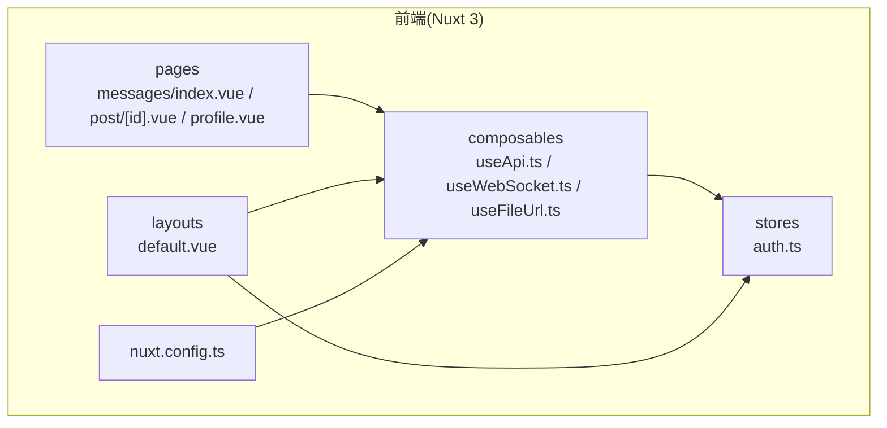
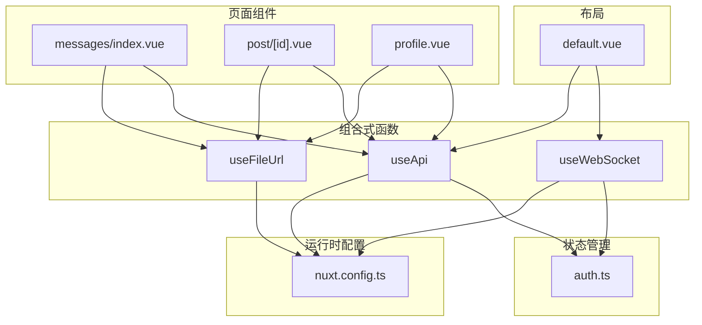
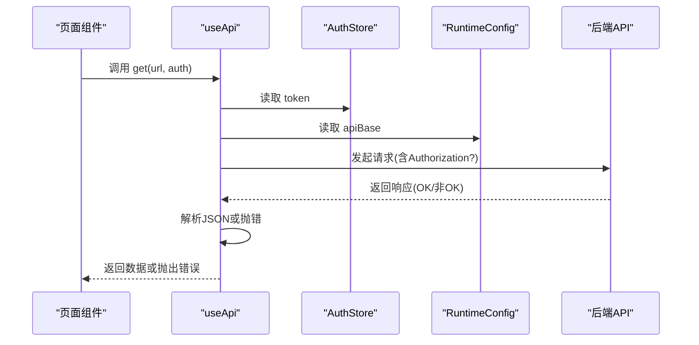
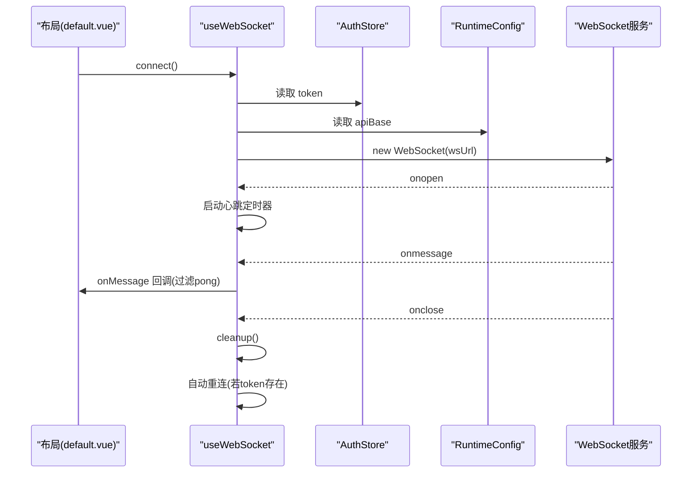
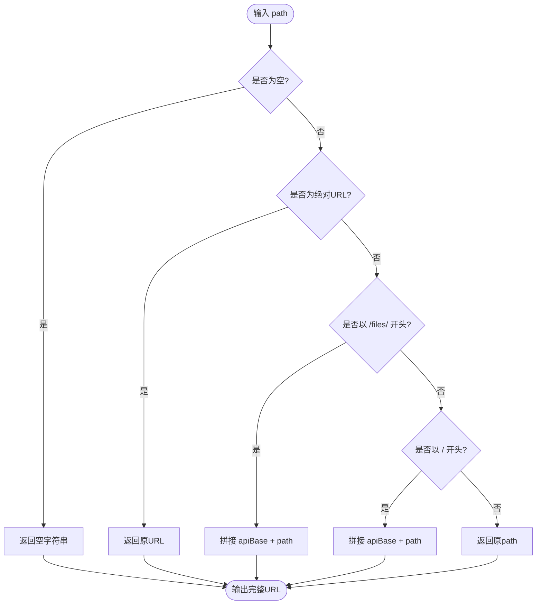
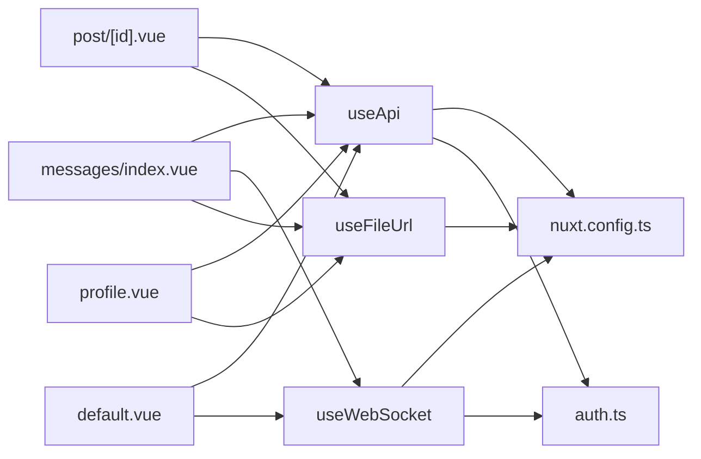

# 组合式函数扩展

<cite>
**本文引用的文件**
- [useApi.ts](file://web_frontend/composables/useApi.ts)
- [useWebSocket.ts](file://web_frontend/composables/useWebSocket.ts)
- [useFileUrl.ts](file://web_frontend/composables/useFileUrl.ts)
- [auth.ts](file://web_frontend/stores/auth.ts)
- [default.vue](file://web_frontend/layouts/default.vue)
- [messages/index.vue](file://web_frontend/pages/messages/index.vue)
- [post/[id].vue](file://web_frontend/pages/post/[id].vue)
- [profile.vue](file://web_frontend/pages/profile.vue)
- [nuxt.config.ts](file://web_frontend/nuxt.config.ts)
- [package.json](file://web_frontend/package.json)
- [README.md](file://README.md)
</cite>

## 目录
1. [简介](#简介)
2. [项目结构](#项目结构)
3. [核心组件](#核心组件)
4. [架构总览](#架构总览)
5. [详细组件分析](#详细组件分析)
6. [依赖关系分析](#依赖关系分析)
7. [性能考虑](#性能考虑)
8. [故障排查指南](#故障排查指南)
9. [结论](#结论)
10. [附录](#附录)

## 简介
本指南面向希望在 Nuxt 3 中扩展与优化组合式函数（Composables）的开发者，围绕响应式状态管理与逻辑复用展开，重点讲解以下三个组合式函数：
- useApi：HTTP 请求封装、认证头注入、错误处理与状态管理
- useWebSocket：实时通信、连接生命周期管理、心跳与自动重连
- useFileUrl：文件资源 URL 生成与缓存策略

同时提供自定义组合式函数的开发流程、测试方法与性能优化建议，帮助你在复杂业务场景中高效构建可维护的前端逻辑。

## 项目结构
前端采用 Nuxt 3 + Vue 3 + Pinia + Vant 的技术栈，组合式函数位于 composables 目录，页面组件位于 pages 目录，全局状态通过 Pinia store 管理，布局层负责全局 WebSocket 连接与未读消息计数。

图表来源
- [useApi.ts](file://web_frontend/composables/useApi.ts#L1-L57)
- [useWebSocket.ts](file://web_frontend/composables/useWebSocket.ts#L1-L104)
- [useFileUrl.ts](file://web_frontend/composables/useFileUrl.ts#L1-L28)
- [auth.ts](file://web_frontend/stores/auth.ts#L1-L80)
- [default.vue](file://web_frontend/layouts/default.vue#L1-L87)
- [messages/index.vue](file://web_frontend/pages/messages/index.vue#L1-L198)
- [post/[id].vue](file://web_frontend/pages/post/[id].vue#L1-L387)
- [profile.vue](file://web_frontend/pages/profile.vue#L1-L309)
- [nuxt.config.ts](file://web_frontend/nuxt.config.ts#L1-L42)

章节来源
- [nuxt.config.ts](file://web_frontend/nuxt.config.ts#L1-L42)
- [package.json](file://web_frontend/package.json#L1-L28)

## 核心组件
本节对三个组合式函数进行深入解析，包括设计理念、数据结构、依赖关系与使用方式。

- useApi
  - 设计理念：统一 HTTP 请求入口，自动注入认证头，集中处理错误与状态码，提供类型安全的泛型返回值。
  - 关键能力：GET/POST/PUT/DELETE 方法封装；可选认证开关；204 空响应处理；JSON 解析与错误抛出。
  - 依赖：运行时配置（apiBase）、Pinia 认证 store（token）。
  - 复杂度：O(1) 请求开销，错误处理为 O(1)。
  - 性能：避免重复序列化；仅在非 GET 时发送 body；204 直接返回 null，减少不必要的解析。

- useWebSocket
  - 设计理念：全局单例 WebSocket，集中管理连接、心跳、消息分发与自动重连。
  - 关键能力：connect/disconnect 生命周期；onMessage 订阅机制；心跳 ping/pong；断线自动重连；清理定时器与事件监听。
  - 依赖：运行时配置（apiBase）、Pinia 认证 store（token）。
  - 复杂度：连接建立 O(1)，消息分发 O(n)（n 为订阅者数量）。
  - 性能：心跳间隔 30s；重连延迟 3s；及时清理定时器防止内存泄漏。

- useFileUrl
  - 设计理念：根据路径类型自动拼接完整 URL，支持绝对 URL、相对路径与 /files/ 前缀。
  - 关键能力：路径判断与拼接；返回原始字符串或拼接后的完整 URL。
  - 依赖：运行时配置（apiBase）。
  - 复杂度：O(1) 字符串拼接与判断。
  - 性能：常量时间判断与拼接，无额外网络请求。

章节来源
- [useApi.ts](file://web_frontend/composables/useApi.ts#L1-L57)
- [useWebSocket.ts](file://web_frontend/composables/useWebSocket.ts#L1-L104)
- [useFileUrl.ts](file://web_frontend/composables/useFileUrl.ts#L1-L28)

## 架构总览
下图展示了组合式函数在页面与布局中的协作关系，以及与认证 store 和运行时配置的交互。

图表来源
- [messages/index.vue](file://web_frontend/pages/messages/index.vue#L73-L130)
- [post/[id].vue](file://web_frontend/pages/post/[id].vue#L148-L252)
- [profile.vue](file://web_frontend/pages/profile.vue#L138-L202)
- [default.vue](file://web_frontend/layouts/default.vue#L38-L75)
- [useApi.ts](file://web_frontend/composables/useApi.ts#L1-L57)
- [useWebSocket.ts](file://web_frontend/composables/useWebSocket.ts#L1-L104)
- [useFileUrl.ts](file://web_frontend/composables/useFileUrl.ts#L1-L28)
- [auth.ts](file://web_frontend/stores/auth.ts#L1-L80)
- [nuxt.config.ts](file://web_frontend/nuxt.config.ts#L15-L19)

## 详细组件分析

### useApi 组件分析
- 设计模式：工厂函数返回一组方法，内部共享配置与认证状态，便于统一管理。
- 参数与返回值：
  - request(url, options)：泛型返回值 T；options.method/body/auth。
  - get/post/put/delete：便捷方法，分别固定 method 并可传入 body。
- 错误处理：
  - 非 OK 响应抛出错误，优先使用后端 JSON 错误信息。
  - 204 空响应直接返回 null。
- 认证与安全：
  - auth=true 时自动附加 Authorization: Bearer token。
  - 从运行时配置读取 apiBase，避免硬编码。
- 使用示例（路径）
  - [消息列表加载](file://web_frontend/pages/messages/index.vue#L86-L96)
  - [点赞操作](file://web_frontend/pages/post/[id].vue#L178-L196)
  - [评论提交](file://web_frontend/pages/post/[id].vue#L202-L225)

图表来源
- [useApi.ts](file://web_frontend/composables/useApi.ts#L8-L48)
- [auth.ts](file://web_frontend/stores/auth.ts#L18-L26)
- [nuxt.config.ts](file://web_frontend/nuxt.config.ts#L15-L19)

章节来源
- [useApi.ts](file://web_frontend/composables/useApi.ts#L1-L57)
- [messages/index.vue](file://web_frontend/pages/messages/index.vue#L86-L96)
- [post/[id].vue](file://web_frontend/pages/post/[id].vue#L178-L196)

### useWebSocket 组件分析
- 设计模式：全局单例 + 订阅发布模式，确保应用内只存在一个 WebSocket 实例。
- 关键流程：
  - connect：基于 token 与 apiBase 构造 ws URL，建立连接并开启心跳。
  - onMessage：注册回调，收到消息时遍历执行；过滤 pong 类型。
  - disconnect/cleanup：关闭连接并清理定时器与事件监听。
  - 自动重连：断开后延迟重试，直到重新连接或用户登出。
- 状态与副作用：
  - isConnected 响应式状态，用于 UI 展示。
  - 定时器 pingTimer/reconnectTimer 需在断开时清理。
- 使用示例（路径）
  - [布局中连接与监听](file://web_frontend/layouts/default.vue#L40-L75)
  - [消息页订阅新消息](file://web_frontend/pages/messages/index.vue#L118-L130)

图表来源
- [useWebSocket.ts](file://web_frontend/composables/useWebSocket.ts#L14-L68)
- [default.vue](file://web_frontend/layouts/default.vue#L40-L75)
- [auth.ts](file://web_frontend/stores/auth.ts#L18-L26)
- [nuxt.config.ts](file://web_frontend/nuxt.config.ts#L15-L19)

章节来源
- [useWebSocket.ts](file://web_frontend/composables/useWebSocket.ts#L1-L104)
- [default.vue](file://web_frontend/layouts/default.vue#L38-L75)
- [messages/index.vue](file://web_frontend/pages/messages/index.vue#L118-L130)

### useFileUrl 组件分析
- 设计模式：纯函数式工具，根据路径类型返回完整 URL。
- 路径规则：
  - 空值返回空字符串。
  - 已为 http(s) 开头的绝对 URL 直接返回。
  - 以 /files/ 开头的相对路径拼接 apiBase。
  - 其他以 / 开头的相对路径同样拼接 apiBase。
  - 其余情况原样返回。
- 使用示例（路径）
  - [消息页头像显示](file://web_frontend/pages/messages/index.vue#L24)
  - [帖子详情头像与图片](file://web_frontend/pages/post/[id].vue#L21-L41)
  - [个人资料头像](file://web_frontend/pages/profile.vue#L22)

图表来源
- [useFileUrl.ts](file://web_frontend/composables/useFileUrl.ts#L5-L24)
- [nuxt.config.ts](file://web_frontend/nuxt.config.ts#L15-L19)

章节来源
- [useFileUrl.ts](file://web_frontend/composables/useFileUrl.ts#L1-L28)
- [messages/index.vue](file://web_frontend/pages/messages/index.vue#L24)
- [post/[id].vue](file://web_frontend/pages/post/[id].vue#L21-L41)
- [profile.vue](file://web_frontend/pages/profile.vue#L22)

### 组合式函数的测试方法
- 单元测试要点
  - useApi：构造 mock fetch，覆盖 200/204/4xx/5xx 场景；验证 headers 与 body；校验错误抛出。
  - useWebSocket：模拟连接、断开、消息与错误事件；验证心跳定时器与自动重连；清理资源。
  - useFileUrl：覆盖空值、绝对 URL、/files/、其他 / 开头与普通路径等分支。
- 集成测试要点
  - 页面组件中组合式函数的调用链路，如消息页的 WebSocket 新消息订阅与列表刷新。
  - 布局层的未读消息计数联动与登录态切换。
- 测试工具建议
  - 使用 Vitest + @nuxt/test-utils 进行 Nuxt 3 环境下的单元与集成测试。
  - 对异步行为使用 fake timers 控制定时器。

### 自定义组合式函数开发流程
- 参数设计
  - 明确输入参数与默认值；区分必需与可选参数；提供 options 对象以增强可扩展性。
- 返回值定义
  - 提供方法集合（如 get/post/delete）与响应式状态（如 isConnected）；必要时返回清理函数。
- 副作用处理
  - 在 onMounted/onUnmounted 中注册/清理事件与定时器；在 watch 中监听状态变化触发副作用。
- 类型安全
  - 使用 TypeScript 泛型约束返回值类型；为 options 接口定义明确字段与可选性。
- 可复用性
  - 将通用逻辑抽取为独立 composable；避免在页面中重复实现相同逻辑。

## 依赖关系分析
- 组合式函数之间的耦合
  - useApi 与 useWebSocket、useFileUrl 均依赖运行时配置与认证 store。
  - 布局层 default.vue 同时依赖 useApi 与 useWebSocket，形成全局通信与数据刷新中枢。
- 外部依赖
  - Nuxt 3 运行时配置（public.apiBase）。
  - Pinia 认证 store（token、user）。
  - 浏览器 WebSocket 与 fetch API。
- 潜在循环依赖
  - 当前结构清晰，无直接循环依赖；注意避免在组合式函数中相互调用导致的环状依赖。

图表来源
- [useApi.ts](file://web_frontend/composables/useApi.ts#L1-L57)
- [useWebSocket.ts](file://web_frontend/composables/useWebSocket.ts#L1-L104)
- [useFileUrl.ts](file://web_frontend/composables/useFileUrl.ts#L1-L28)
- [auth.ts](file://web_frontend/stores/auth.ts#L1-L80)
- [default.vue](file://web_frontend/layouts/default.vue#L1-L87)
- [messages/index.vue](file://web_frontend/pages/messages/index.vue#L1-L198)
- [post/[id].vue](file://web_frontend/pages/post/[id].vue#L1-L387)
- [profile.vue](file://web_frontend/pages/profile.vue#L1-L309)
- [nuxt.config.ts](file://web_frontend/nuxt.config.ts#L15-L19)

章节来源
- [auth.ts](file://web_frontend/stores/auth.ts#L1-L80)
- [nuxt.config.ts](file://web_frontend/nuxt.config.ts#L15-L19)

## 性能考虑
- 请求与连接优化
  - useApi：避免不必要的 JSON.stringify；仅在非 GET 时发送 body；204 直接返回 null。
  - useWebSocket：心跳间隔 30s，断线重连 3s；及时清理定时器与事件监听，防止内存泄漏。
- 资源加载优化
  - useFileUrl：常量时间判断与拼接，避免重复计算；结合浏览器缓存策略提升图片加载速度。
- 状态更新优化
  - 在布局层统一管理未读消息计数，减少页面级重复请求。
- 并发控制
  - 页面组件中使用 Promise.all 并发加载多个数据源，缩短首屏渲染时间。

## 故障排查指南
- 认证相关
  - 现象：接口返回 401 或被重定向到登录页。
  - 排查：确认 token 是否存在且有效；检查 useApi 的 auth 选项；查看 auth store 的 setToken 与 logout 行为。
- WebSocket 连接
  - 现象：无法接收新消息或频繁断开。
  - 排查：确认 apiBase 与 ws URL 构造正确；检查 token 是否在连接时传递；观察心跳定时器是否正常；查看断线重连逻辑。
- 文件 URL 生成
  - 现象：图片或头像无法显示。
  - 排查：确认路径类型（绝对/相对）；检查 apiBase 配置；验证 /files/ 前缀与 / 开头路径的拼接逻辑。
- 页面行为异常
  - 现象：消息页未刷新或未读数不更新。
  - 排查：确认布局层的 WebSocket onMessage 订阅与未读计数刷新逻辑；检查路由变化监听与登录态监听。

章节来源
- [useApi.ts](file://web_frontend/composables/useApi.ts#L22-L24)
- [useWebSocket.ts](file://web_frontend/composables/useWebSocket.ts#L21-L22)
- [useFileUrl.ts](file://web_frontend/composables/useFileUrl.ts#L9-L21)
- [default.vue](file://web_frontend/layouts/default.vue#L48-L53)
- [messages/index.vue](file://web_frontend/pages/messages/index.vue#L124-L129)

## 结论
本指南系统梳理了 Nuxt 3 中组合式函数的设计与实践，围绕 useApi、useWebSocket、useFileUrl 三类核心能力，给出了参数设计、返回值定义、副作用处理与测试方法的完整方案。通过统一的运行时配置与 Pinia 认证 store，这些组合式函数实现了高内聚、低耦合的逻辑复用，为复杂业务场景提供了稳定可靠的基础设施。

## 附录
- 相关文件与路径
  - [useApi.ts](file://web_frontend/composables/useApi.ts#L1-L57)
  - [useWebSocket.ts](file://web_frontend/composables/useWebSocket.ts#L1-L104)
  - [useFileUrl.ts](file://web_frontend/composables/useFileUrl.ts#L1-L28)
  - [auth.ts](file://web_frontend/stores/auth.ts#L1-L80)
  - [default.vue](file://web_frontend/layouts/default.vue#L1-L87)
  - [messages/index.vue](file://web_frontend/pages/messages/index.vue#L1-L198)
  - [post/[id].vue](file://web_frontend/pages/post/[id].vue#L1-L387)
  - [profile.vue](file://web_frontend/pages/profile.vue#L1-L309)
  - [nuxt.config.ts](file://web_frontend/nuxt.config.ts#L15-L19)
  - [package.json](file://web_frontend/package.json#L1-L28)
  - [README.md](file://README.md#L1-L290)