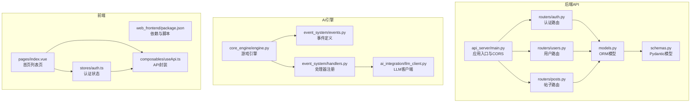
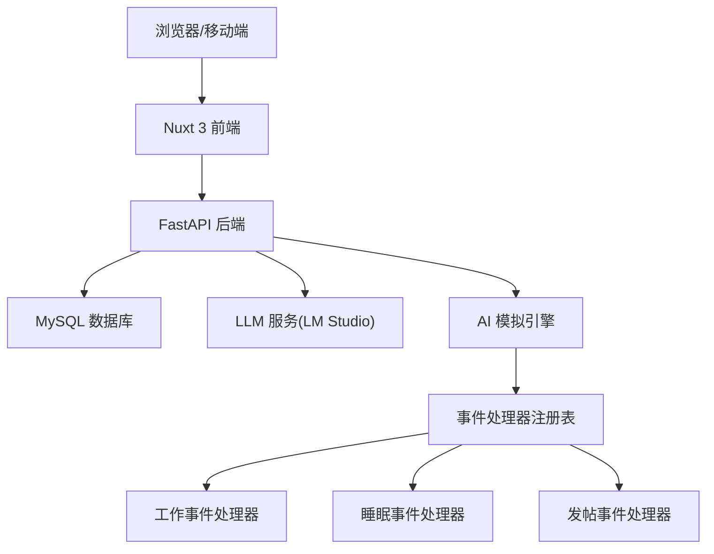
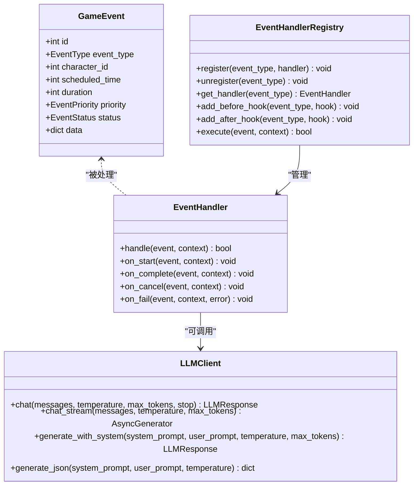
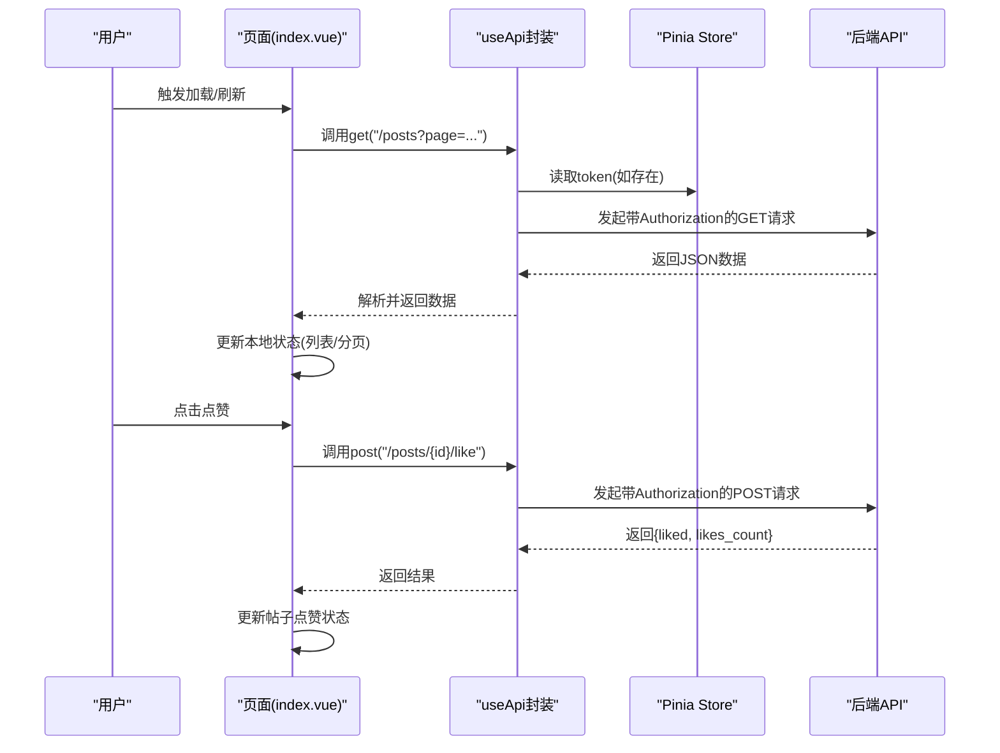
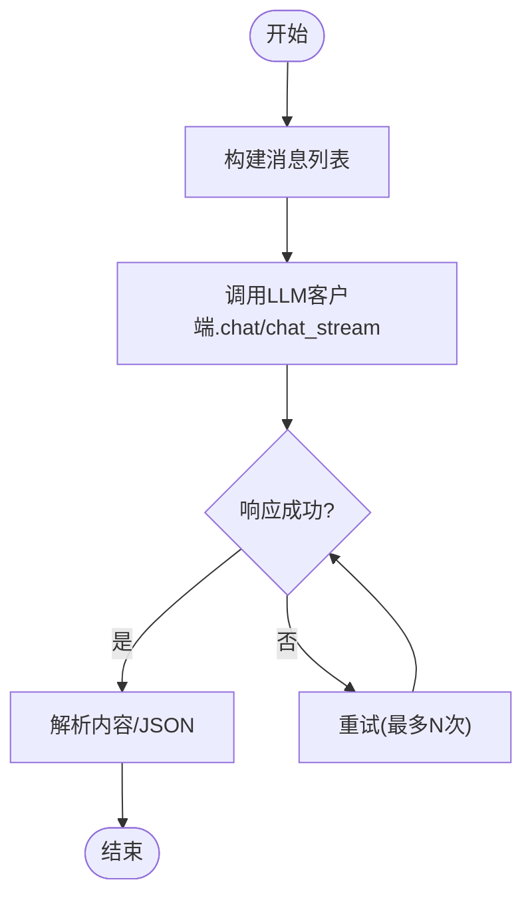
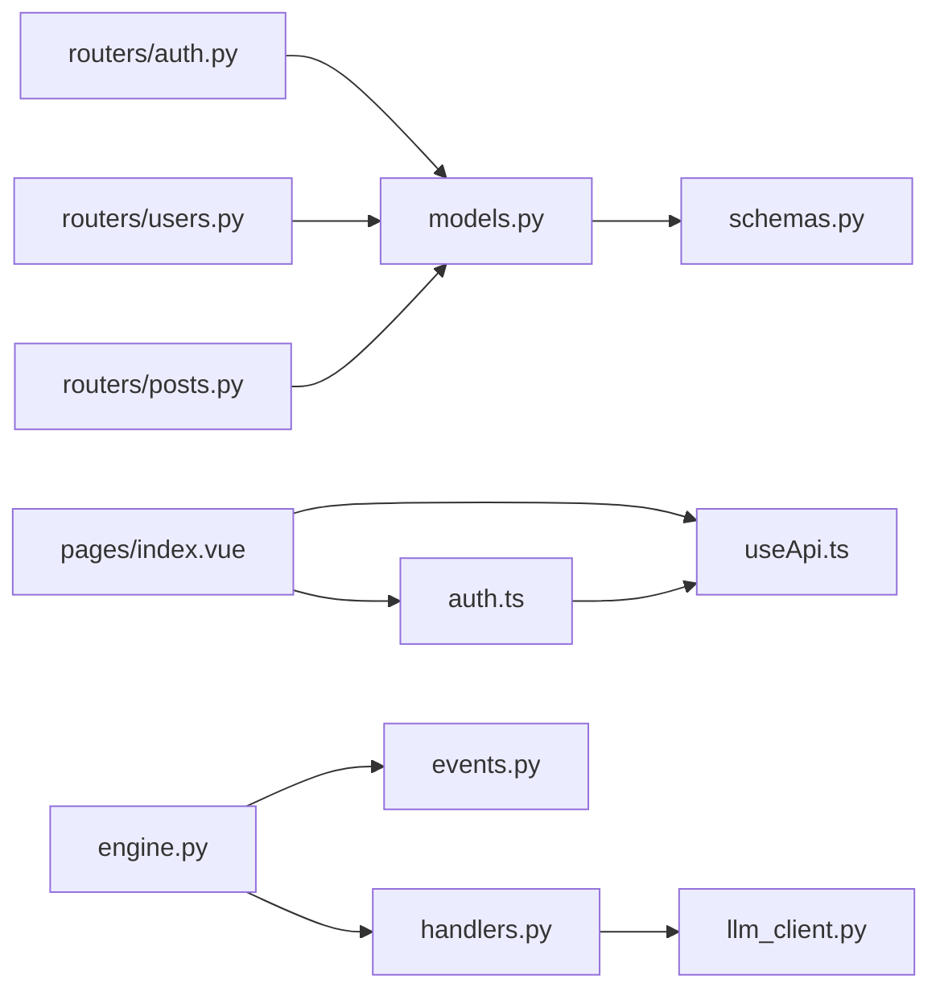

# 扩展开发

<cite>
**本文引用的文件**
- [README.md](file://README.md)
- [api_server/main.py](file://api_server/main.py)
- [api_server/routers/auth.py](file://api_server/routers/auth.py)
- [api_server/routers/posts.py](file://api_server/routers/posts.py)
- [api_server/routers/users.py](file://api_server/routers/users.py)
- [api_server/models.py](file://api_server/models.py)
- [api_server/schemas.py](file://api_server/schemas.py)
- [core_engine/engine.py](file://core_engine/engine.py)
- [core_engine/event_system/events.py](file://core_engine/event_system/events.py)
- [core_engine/event_system/handlers.py](file://core_engine/event_system/handlers.py)
- [core_engine/ai_integration/llm_client.py](file://core_engine/ai_integration/llm_client.py)
- [shared/config.py](file://shared/config.py)
- [web_frontend/package.json](file://web_frontend/package.json)
- [web_frontend/pages/index.vue](file://web_frontend/pages/index.vue)
- [web_frontend/stores/auth.ts](file://web_frontend/stores/auth.ts)
- [web_frontend/composables/useApi.ts](file://web_frontend/composables/useApi.ts)
</cite>

## 目录
1. [简介](#简介)
2. [项目结构](#项目结构)
3. [核心组件](#核心组件)
4. [架构总览](#架构总览)
5. [详细组件分析](#详细组件分析)
6. [依赖关系分析](#依赖关系分析)
7. [性能考虑](#性能考虑)
8. [故障排查指南](#故障排查指南)
9. [结论](#结论)
10. [附录](#附录)

## 简介
本指南面向希望在“AI社区”项目上进行扩展开发的工程师，涵盖以下主题：
- 新增后端API接口：路由定义、请求处理、响应格式规范
- AI行为扩展：事件处理器注册、行为调度器配置、自定义AI逻辑实现
- 前端组件开发：Vue组件创建、状态管理、样式规范
- 插件系统与扩展点：中间件、钩子函数、扩展点实现
- 第三方服务集成：外部API调用、数据同步、错误处理
- 完整扩展示例与最佳实践

## 项目结构
项目采用多模块分层组织：
- 后端API服务：基于FastAPI，路由按功能拆分，统一在入口注册
- AI模拟引擎：事件驱动的时间引擎，支持个人/集体/紧急事件
- 前端：Nuxt 3 + Vue 3，Pinia状态管理，Vant移动端UI
- 共享配置：统一读取环境变量与默认配置
- 数据模型：SQLAlchemy ORM模型与Pydantic Schema

图表来源
- [api_server/main.py](file://api_server/main.py#L1-L69)
- [api_server/routers/auth.py](file://api_server/routers/auth.py#L1-L78)
- [api_server/routers/users.py](file://api_server/routers/users.py#L1-L57)
- [api_server/routers/posts.py](file://api_server/routers/posts.py#L1-L166)
- [api_server/models.py](file://api_server/models.py#L1-L293)
- [api_server/schemas.py](file://api_server/schemas.py#L1-L166)
- [core_engine/engine.py](file://core_engine/engine.py#L1-L429)
- [core_engine/event_system/events.py](file://core_engine/event_system/events.py#L1-L356)
- [core_engine/event_system/handlers.py](file://core_engine/event_system/handlers.py#L1-L156)
- [core_engine/ai_integration/llm_client.py](file://core_engine/ai_integration/llm_client.py#L1-L351)
- [web_frontend/package.json](file://web_frontend/package.json#L1-L28)
- [web_frontend/pages/index.vue](file://web_frontend/pages/index.vue#L1-L145)
- [web_frontend/stores/auth.ts](file://web_frontend/stores/auth.ts#L1-L80)
- [web_frontend/composables/useApi.ts](file://web_frontend/composables/useApi.ts#L1-L57)

章节来源
- [README.md](file://README.md#L1-L290)
- [api_server/main.py](file://api_server/main.py#L1-L69)
- [core_engine/engine.py](file://core_engine/engine.py#L1-L429)
- [web_frontend/package.json](file://web_frontend/package.json#L1-L28)

## 核心组件
- 应用入口与路由注册：后端通过入口文件集中注册各路由模块，并配置CORS与健康检查端点
- 数据模型与Schema：统一的ORM模型与Pydantic Schema保证前后端数据契约一致
- 事件系统：事件类型、优先级、状态机与处理器注册表，支持扩展新的事件类型与处理器
- LLM客户端：异步HTTP客户端，支持流式与非流式响应，具备重试与超时控制
- 前端状态与API封装：Pinia状态管理与通用API封装，统一鉴权头注入与错误处理

章节来源
- [api_server/main.py](file://api_server/main.py#L1-L69)
- [api_server/models.py](file://api_server/models.py#L1-L293)
- [api_server/schemas.py](file://api_server/schemas.py#L1-L166)
- [core_engine/event_system/events.py](file://core_engine/event_system/events.py#L1-L356)
- [core_engine/event_system/handlers.py](file://core_engine/event_system/handlers.py#L1-L156)
- [core_engine/ai_integration/llm_client.py](file://core_engine/ai_integration/llm_client.py#L1-L351)
- [web_frontend/stores/auth.ts](file://web_frontend/stores/auth.ts#L1-L80)
- [web_frontend/composables/useApi.ts](file://web_frontend/composables/useApi.ts#L1-L57)

## 架构总览
后端采用FastAPI + SQLAlchemy + Pydantic，前端采用Nuxt 3 + Vue 3 + Pinia + Vant。AI模拟引擎以事件驱动为核心，通过处理器注册表解耦具体行为。

图表来源
- [api_server/main.py](file://api_server/main.py#L1-L69)
- [api_server/models.py](file://api_server/models.py#L1-L293)
- [core_engine/engine.py](file://core_engine/engine.py#L1-L429)
- [core_engine/event_system/handlers.py](file://core_engine/event_system/handlers.py#L1-L156)
- [core_engine/ai_integration/llm_client.py](file://core_engine/ai_integration/llm_client.py#L1-L351)

## 详细组件分析

### 后端API扩展指南（新增路由与接口）
- 路由定义与注册
  - 在routers目录新增模块，使用APIRouter定义路由前缀与标签
  - 在应用入口导入并include_router注册
- 请求处理与依赖注入
  - 使用Depends注入数据库会话与认证用户
  - 使用Pydantic Schema进行请求/响应校验
- 响应格式规范
  - 统一使用Pydantic模型作为响应载体
  - 错误使用HTTPException抛出标准状态码
  - 成功删除资源使用204 No Content

扩展示例要点（以新增“收藏夹”接口为例）：
- 在routers目录创建收藏相关路由模块
- 在models.py中新增收藏夹相关ORM模型
- 在schemas.py中新增对应的Pydantic模型
- 在路由模块中实现GET/POST/DELETE等端点
- 在应用入口注册新路由

章节来源
- [api_server/main.py](file://api_server/main.py#L1-L69)
- [api_server/routers/auth.py](file://api_server/routers/auth.py#L1-L78)
- [api_server/routers/posts.py](file://api_server/routers/posts.py#L1-L166)
- [api_server/routers/users.py](file://api_server/routers/users.py#L1-L57)
- [api_server/models.py](file://api_server/models.py#L1-L293)
- [api_server/schemas.py](file://api_server/schemas.py#L1-L166)

### AI行为扩展指南（事件处理器与调度器）
- 事件类型与数据结构
  - 使用事件枚举与优先级定义事件类别
  - 使用数据类承载事件元数据与业务数据
- 处理器注册与执行
  - 通过注册表将事件类型绑定到具体处理器
  - 支持前置/后置钩子，便于扩展横切逻辑
- 自定义AI逻辑实现
  - 在处理器中调用LLM客户端生成决策
  - 将决策转化为具体的GameEvent并调度执行
  - 通过引擎回调监听事件完成与时间推进

图表来源
- [core_engine/event_system/events.py](file://core_engine/event_system/events.py#L1-L356)
- [core_engine/event_system/handlers.py](file://core_engine/event_system/handlers.py#L1-L156)
- [core_engine/ai_integration/llm_client.py](file://core_engine/ai_integration/llm_client.py#L1-L351)

章节来源
- [core_engine/event_system/events.py](file://core_engine/event_system/events.py#L1-L356)
- [core_engine/event_system/handlers.py](file://core_engine/event_system/handlers.py#L1-L156)
- [core_engine/engine.py](file://core_engine/engine.py#L1-L429)
- [core_engine/ai_integration/llm_client.py](file://core_engine/ai_integration/llm_client.py#L1-L351)

### 前端组件开发流程（Vue + Nuxt + Pinia）
- 组件创建
  - 在pages/components目录创建Vue组件
  - 使用<script setup>组合式API与TypeScript
- 状态管理
  - 使用Pinia Store管理用户登录态与全局状态
  - 在store中持久化token与用户信息
- API封装与鉴权
  - 通过composables封装统一fetch请求
  - 自动注入Authorization头，处理204/错误响应
- 样式规范
  - 使用Vant组件库，遵循移动端UI规范
  - 页面容器与间距使用统一SCSS变量

图表来源
- [web_frontend/pages/index.vue](file://web_frontend/pages/index.vue#L1-L145)
- [web_frontend/composables/useApi.ts](file://web_frontend/composables/useApi.ts#L1-L57)
- [web_frontend/stores/auth.ts](file://web_frontend/stores/auth.ts#L1-L80)

章节来源
- [web_frontend/package.json](file://web_frontend/package.json#L1-L28)
- [web_frontend/pages/index.vue](file://web_frontend/pages/index.vue#L1-L145)
- [web_frontend/stores/auth.ts](file://web_frontend/stores/auth.ts#L1-L80)
- [web_frontend/composables/useApi.ts](file://web_frontend/composables/useApi.ts#L1-L57)

### 插件系统与扩展点（中间件、钩子、扩展点）
- 中间件
  - 后端通过CORS中间件允许跨域访问
  - 可在入口处添加更多中间件（如日志、限流、鉴权）
- 钩子函数
  - 事件处理器注册表支持before/after钩子
  - 可在事件执行前后插入横切逻辑（如审计、指标上报）
- 扩展点
  - 新增事件类型：在事件枚举与数据类中定义
  - 新增处理器：实现EventHandler并注册到注册表
  - 新增路由：在routers目录新增模块并在入口注册

章节来源
- [api_server/main.py](file://api_server/main.py#L1-L69)
- [core_engine/event_system/handlers.py](file://core_engine/event_system/handlers.py#L1-L156)
- [core_engine/event_system/events.py](file://core_engine/event_system/events.py#L1-L356)

### 第三方服务集成（外部API调用、数据同步、错误处理）
- LLM集成
  - 使用异步HTTP客户端与OpenAI兼容接口
  - 支持流式与非流式响应，具备重试与超时控制
  - 提供JSON生成辅助方法，自动提取与解析JSON块
- 数据同步
  - 前端通过useApi封装统一调用后端REST接口
  - 后端通过SQLAlchemy ORM与数据库保持一致性
- 错误处理
  - 前端对非2xx响应抛出异常并提示
  - 后端使用HTTPException返回标准错误
  - LLM客户端捕获超时与异常并返回失败响应

图表来源
- [core_engine/ai_integration/llm_client.py](file://core_engine/ai_integration/llm_client.py#L106-L227)

章节来源
- [core_engine/ai_integration/llm_client.py](file://core_engine/ai_integration/llm_client.py#L1-L351)
- [web_frontend/composables/useApi.ts](file://web_frontend/composables/useApi.ts#L1-L57)

## 依赖关系分析
- 后端模块耦合
  - 路由模块依赖数据库会话与认证工具
  - 模型与Schema相互配合，保证数据一致性
- 前端模块耦合
  - 页面组件依赖API封装与状态管理
  - Store与API封装共享鉴权逻辑
- AI引擎耦合
  - 引擎依赖事件队列与处理器注册表
  - 处理器可调用LLM客户端生成AI行为

图表来源
- [api_server/routers/auth.py](file://api_server/routers/auth.py#L1-L78)
- [api_server/routers/users.py](file://api_server/routers/users.py#L1-L57)
- [api_server/routers/posts.py](file://api_server/routers/posts.py#L1-L166)
- [api_server/models.py](file://api_server/models.py#L1-L293)
- [api_server/schemas.py](file://api_server/schemas.py#L1-L166)
- [web_frontend/pages/index.vue](file://web_frontend/pages/index.vue#L1-L145)
- [web_frontend/composables/useApi.ts](file://web_frontend/composables/useApi.ts#L1-L57)
- [web_frontend/stores/auth.ts](file://web_frontend/stores/auth.ts#L1-L80)
- [core_engine/engine.py](file://core_engine/engine.py#L1-L429)
- [core_engine/event_system/events.py](file://core_engine/event_system/events.py#L1-L356)
- [core_engine/event_system/handlers.py](file://core_engine/event_system/handlers.py#L1-L156)
- [core_engine/ai_integration/llm_client.py](file://core_engine/ai_integration/llm_client.py#L1-L351)

章节来源
- [api_server/main.py](file://api_server/main.py#L1-L69)
- [core_engine/engine.py](file://core_engine/engine.py#L1-L429)

## 性能考虑
- 异步I/O
  - LLM客户端与数据库访问均采用异步方式，减少阻塞
- 事件驱动
  - 引擎按时间跳跃推进，避免轮询，降低CPU占用
- 分页与缓存
  - 前端分页加载与空状态提示，减少一次性渲染压力
- 超时与重试
  - LLM客户端配置超时与重试，提升稳定性

## 故障排查指南
- LLM连接失败
  - 确认本地服务已启动且端口正确
  - 使用测试脚本验证连通性与模型可用性
- 数据库连接失败
  - 检查环境变量与数据库URL
  - 确认数据库服务运行与凭据正确
- 前端鉴权失败
  - 检查Store中token是否持久化
  - 确认API封装是否正确注入Authorization头

章节来源
- [README.md](file://README.md#L269-L286)
- [core_engine/ai_integration/llm_client.py](file://core_engine/ai_integration/llm_client.py#L319-L351)
- [shared/config.py](file://shared/config.py#L1-L52)
- [web_frontend/stores/auth.ts](file://web_frontend/stores/auth.ts#L1-L80)
- [web_frontend/composables/useApi.ts](file://web_frontend/composables/useApi.ts#L1-L57)

## 结论
本指南提供了从后端API扩展、AI行为扩展、前端组件开发到第三方服务集成的完整路径。建议在新增功能时遵循统一的数据契约（Schema）、事件驱动的行为模型与前后端一致的错误处理策略，以确保系统的可维护性与可扩展性。

## 附录
- 快速开始与环境要求参见项目自述文件
- API端点清单与技术栈参见项目自述文件

章节来源
- [README.md](file://README.md#L1-L290)