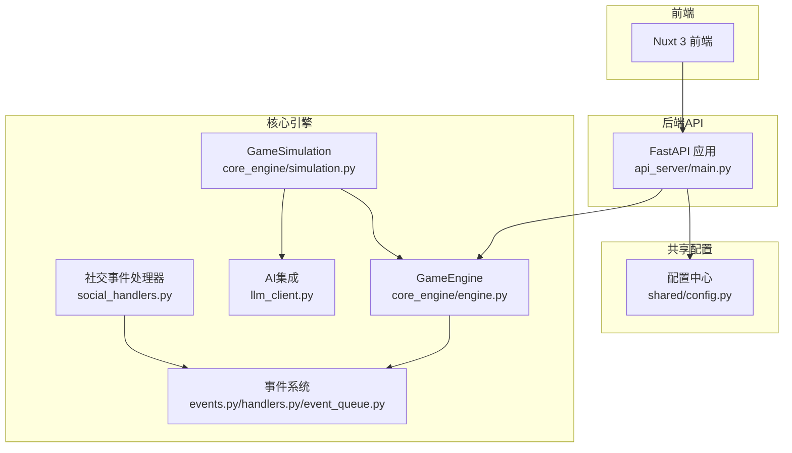
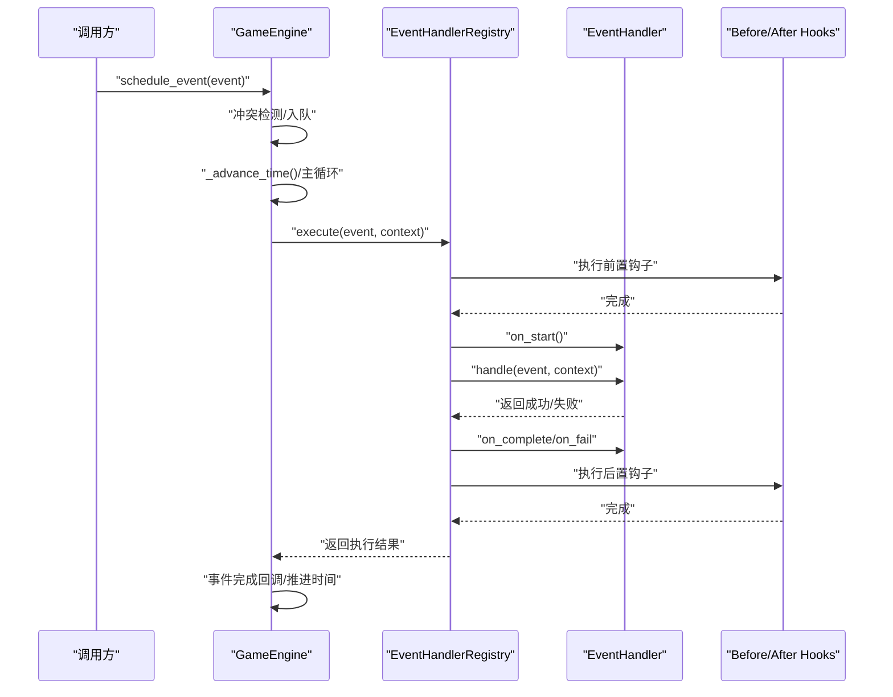
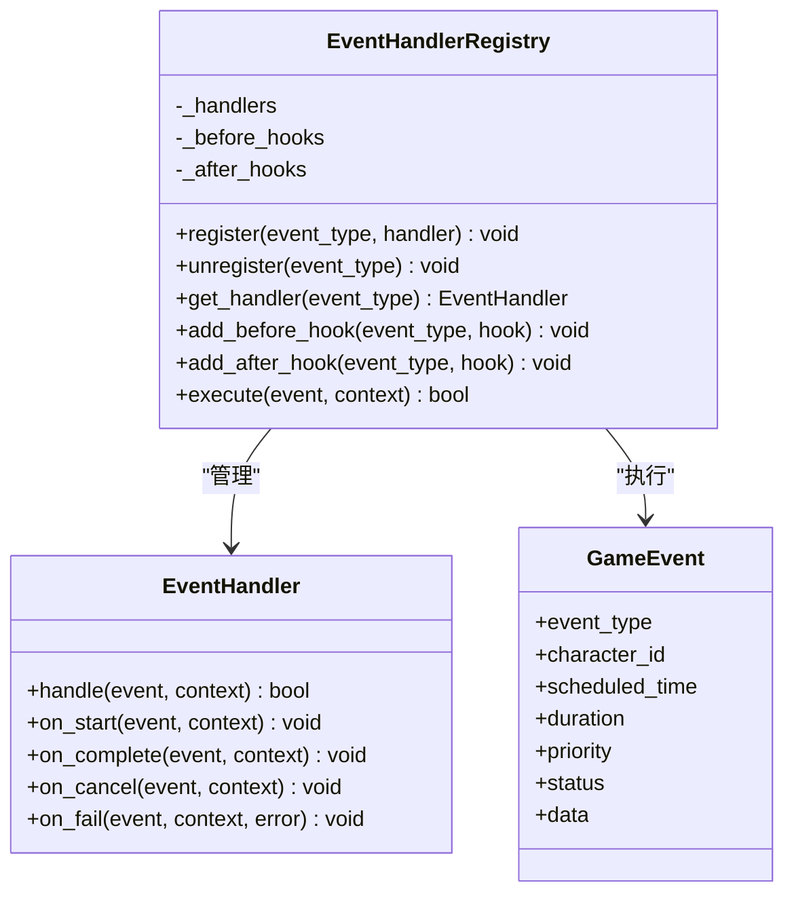
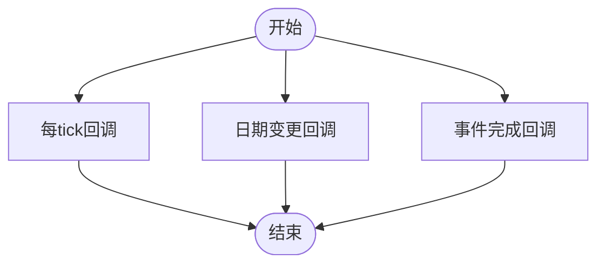
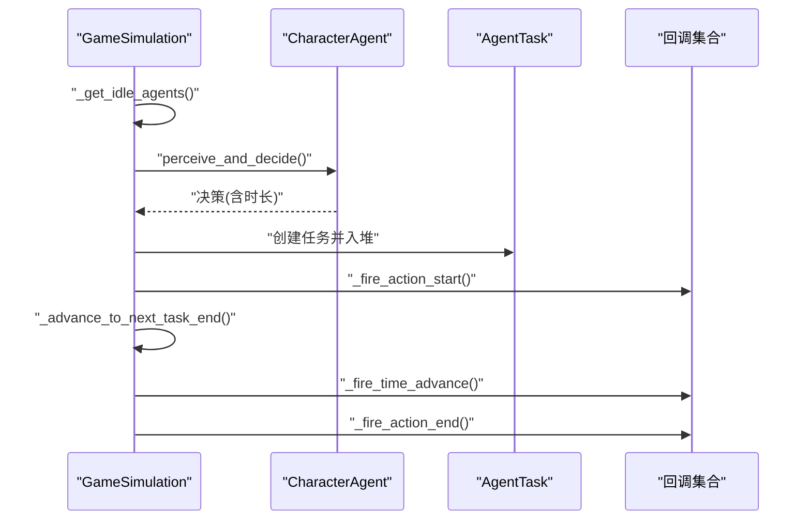
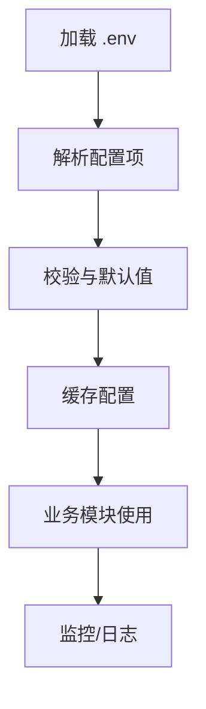
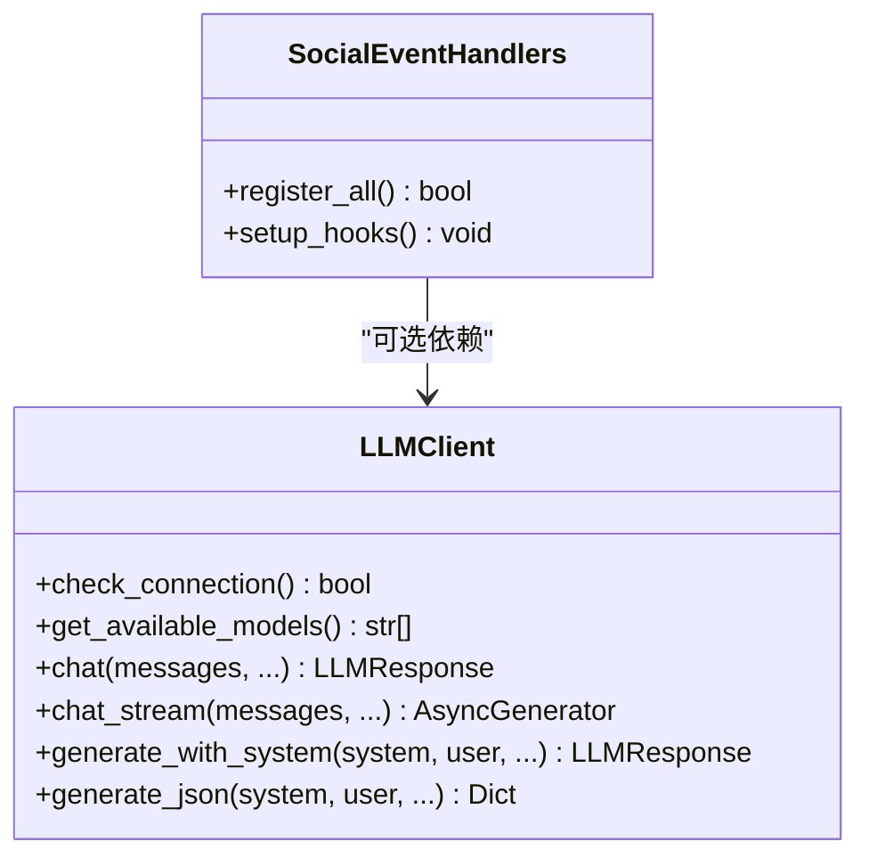
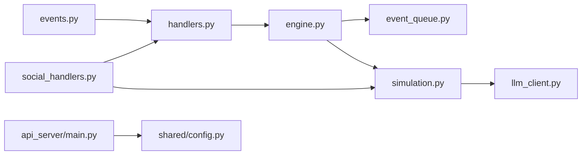

# 插件系统扩展

<cite>
**本文引用的文件**
- [core_engine/engine.py](file://core_engine/engine.py)
- [core_engine/__init__.py](file://core_engine/__init__.py)
- [core_engine/event_system/events.py](file://core_engine/event_system/events.py)
- [core_engine/event_system/handlers.py](file://core_engine/event_system/handlers.py)
- [core_engine/event_system/event_queue.py](file://core_engine/event_system/event_queue.py)
- [core_engine/simulation.py](file://core_engine/simulation.py)
- [core_engine/ai_integration/llm_client.py](file://core_engine/ai_integration/llm_client.py)
- [core_engine/social/social_handlers.py](file://core_engine/social/social_handlers.py)
- [shared/config.py](file://shared/config.py)
- [api_server/main.py](file://api_server/main.py)
- [run_simulation.py](file://run_simulation.py)
- [README.md](file://README.md)
</cite>

## 目录
1. [简介](#简介)
2. [项目结构](#项目结构)
3. [核心组件](#核心组件)
4. [架构总览](#架构总览)
5. [详细组件分析](#详细组件分析)
6. [依赖分析](#依赖分析)
7. [性能考虑](#性能考虑)
8. [故障排查指南](#故障排查指南)
9. [结论](#结论)
10. [附录](#附录)

## 简介
本指南面向希望为AI社区项目扩展插件系统的开发者，围绕GameEngine的事件驱动架构，系统讲解插件机制（中间件开发、钩子函数注册、扩展点实现）、事件系统的插件扩展（事件处理器动态注册、事件链管理、插件间通信）、配置系统的插件集成（环境变量扩展、配置文件管理、运行时配置更新），并提供第三方服务集成、自定义AI行为插件、UI组件插件的完整开发示例。同时涵盖插件生命周期管理、错误处理与性能监控的实现方法。

## 项目结构
AI社区采用分层架构：后端API服务（FastAPI）、前端（Nuxt 3 + Vue 3）、核心模拟引擎（事件驱动）。核心引擎包含时间管理、事件系统、环境系统、AI角色系统、社交功能与AI集成模块。插件扩展主要围绕事件系统与配置系统展开。

**图表来源**
- [api_server/main.py](file://api_server/main.py#L1-L69)
- [shared/config.py](file://shared/config.py#L1-L52)
- [core_engine/engine.py](file://core_engine/engine.py#L167-L429)
- [core_engine/simulation.py](file://core_engine/simulation.py#L64-L529)
- [core_engine/event_system/events.py](file://core_engine/event_system/events.py#L1-L356)
- [core_engine/event_system/handlers.py](file://core_engine/event_system/handlers.py#L1-L156)
- [core_engine/event_system/event_queue.py](file://core_engine/event_system/event_queue.py#L1-L244)
- [core_engine/ai_integration/llm_client.py](file://core_engine/ai_integration/llm_client.py#L1-L351)
- [core_engine/social/social_handlers.py](file://core_engine/social/social_handlers.py#L1-L253)

**章节来源**
- [README.md](file://README.md#L1-L290)
- [api_server/main.py](file://api_server/main.py#L1-L69)
- [shared/config.py](file://shared/config.py#L1-L52)

## 核心组件
- GameEngine：时间推进、事件调度与执行、状态管理、生命周期回调（每tick、日期变更、事件完成）。
- 事件系统：事件类型与优先级、事件队列（冲突检测、懒删除、时间跳跃）、处理器注册与钩子。
- GameSimulation：基于行动结束触发的模拟器，封装角色任务堆、时间跳跃、回调扩展点。
- 配置系统：Pydantic Settings + .env，集中管理数据库、JWT、服务器、文件存储、AI与ComfyUI等配置。
- 社交事件处理器：内置社交相关事件处理器（看手机、发帖、私聊、相遇），展示插件式扩展模式。

**章节来源**
- [core_engine/engine.py](file://core_engine/engine.py#L167-L429)
- [core_engine/event_system/events.py](file://core_engine/event_system/events.py#L1-L356)
- [core_engine/event_system/event_queue.py](file://core_engine/event_system/event_queue.py#L1-L244)
- [core_engine/event_system/handlers.py](file://core_engine/event_system/handlers.py#L1-L156)
- [core_engine/simulation.py](file://core_engine/simulation.py#L64-L529)
- [shared/config.py](file://shared/config.py#L1-L52)
- [core_engine/social/social_handlers.py](file://core_engine/social/social_handlers.py#L1-L253)

## 架构总览
插件系统建立在“事件处理器注册表 + 钩子函数 + 生命周期回调”的三层扩展点之上：

**图表来源**
- [core_engine/engine.py](file://core_engine/engine.py#L288-L382)
- [core_engine/event_system/handlers.py](file://core_engine/event_system/handlers.py#L99-L137)

**章节来源**
- [core_engine/engine.py](file://core_engine/engine.py#L211-L382)
- [core_engine/event_system/handlers.py](file://core_engine/event_system/handlers.py#L50-L156)

## 详细组件分析

### 事件系统插件扩展
- 中间件与钩子：通过注册表为特定事件类型添加“前置钩子”和“后置钩子”，实现跨处理器的横切逻辑（如审计、缓存、统计）。
- 动态注册：使用装饰器将处理器注册到注册表；也可在运行时通过注册表动态增删处理器。
- 事件链管理：事件在处理器执行前后依次经历“开始/完成/失败”状态变化，配合钩子形成可观察的事件链。
- 插件间通信：通过事件上下文（context）传递共享对象（如引擎、数据库会话、Agent实例），实现插件间解耦协作。

**图表来源**
- [core_engine/event_system/handlers.py](file://core_engine/event_system/handlers.py#L12-L156)
- [core_engine/event_system/events.py](file://core_engine/event_system/events.py#L55-L129)

**章节来源**
- [core_engine/event_system/handlers.py](file://core_engine/event_system/handlers.py#L50-L156)
- [core_engine/event_system/events.py](file://core_engine/event_system/events.py#L1-L356)

### GameEngine 插件机制
- 生命周期回调：提供每tick、日期变更、事件完成三类回调注册接口，便于插件在关键节点注入逻辑。
- 事件执行上下文：在执行事件时构建上下文（包含引擎、时间、状态、数据库会话），供处理器与钩子使用。
- 状态持久化：支持保存/加载引擎状态与事件队列，保障插件扩展的可恢复性。

**图表来源**
- [core_engine/engine.py](file://core_engine/engine.py#L276-L287)

**章节来源**
- [core_engine/engine.py](file://core_engine/engine.py#L167-L429)

### GameSimulation 插件扩展点
- 行动开始/结束回调：在角色行动开始与结束时触发，适合接入日志、统计、外部服务调用。
- 时间推进回调：在时间跳跃时触发，适合批量刷新世界状态、触发定时任务。
- 任务堆与时间跳跃：基于任务结束时间的堆结构，支持最大跳跃限制，避免长时间阻塞。

**图表来源**
- [core_engine/simulation.py](file://core_engine/simulation.py#L220-L478)

**章节来源**
- [core_engine/simulation.py](file://core_engine/simulation.py#L64-L529)

### 配置系统插件集成
- 环境变量扩展：通过Pydantic Settings读取.env文件，支持数据库、JWT、服务器、文件存储、AI与ComfyUI等配置项。
- 配置文件管理：统一在shared/config.py中声明，使用缓存函数get_settings()提供全局访问。
- 运行时配置更新：建议在应用启动阶段加载配置，若需热更新，可在业务层监听配置变更并重建相关组件实例。

**图表来源**
- [shared/config.py](file://shared/config.py#L6-L52)

**章节来源**
- [shared/config.py](file://shared/config.py#L1-L52)
- [api_server/main.py](file://api_server/main.py#L10-L13)

### 第三方服务集成示例
- LLM服务集成：通过LLMClient封装OpenAI兼容接口，支持同步与流式响应、重试与超时控制，适合在处理器中作为AI行为决策的插件。
- 社交事件处理器：内置看手机、发帖、私聊、相遇等处理器，展示如何通过装饰器注册处理器与钩子，以及如何在处理器中调用社交调度器与Agent。

**图表来源**
- [core_engine/ai_integration/llm_client.py](file://core_engine/ai_integration/llm_client.py#L54-L317)
- [core_engine/social/social_handlers.py](file://core_engine/social/social_handlers.py#L208-L253)

**章节来源**
- [core_engine/ai_integration/llm_client.py](file://core_engine/ai_integration/llm_client.py#L1-L351)
- [core_engine/social/social_handlers.py](file://core_engine/social/social_handlers.py#L1-L253)

### 自定义AI行为插件开发
- 设计思路：继承EventHandler，实现handle方法；使用装饰器注册到对应事件类型；在handle中调用LLMClient进行决策，或调用社交调度器执行具体动作。
- 生命周期：利用on_start/on_complete/on_fail在处理器内部管理状态；通过注册表钩子实现跨处理器的审计与统计。
- 示例路径：参考UsePhoneHandler、PostContentHandler、OnlinePrivateChatHandler、EncounterHandler的实现方式。

**章节来源**
- [core_engine/event_system/handlers.py](file://core_engine/event_system/handlers.py#L12-L48)
- [core_engine/social/social_handlers.py](file://core_engine/social/social_handlers.py#L18-L206)

### UI组件插件扩展
- 前端集成：前端使用Nuxt 3 + Vue 3，可通过API服务暴露的端点与后端交互；插件可作为独立模块在前端侧引入，通过Composables封装API调用。
- 事件驱动：前端组件订阅后端推送或轮询API，结合GameEngine的状态输出（如引擎状态、事件队列）实现可视化展示。
- 示例路径：参考web_frontend目录下的页面、布局与组件，结合后端API端点进行对接。

**章节来源**
- [README.md](file://README.md#L154-L243)

## 依赖分析
- 模块耦合：事件系统与GameEngine紧密耦合；GameSimulation依赖GameEngine与AgentManager；社交处理器依赖社交调度器与AgentManager。
- 外部依赖：FastAPI、SQLAlchemy、aiohttp、Pydantic Settings等。
- 插件边界：通过注册表与钩子实现低耦合扩展；配置通过Settings集中管理，避免硬编码。

**图表来源**
- [core_engine/event_system/events.py](file://core_engine/event_system/events.py#L1-L356)
- [core_engine/event_system/handlers.py](file://core_engine/event_system/handlers.py#L1-L156)
- [core_engine/engine.py](file://core_engine/engine.py#L167-L429)
- [core_engine/event_system/event_queue.py](file://core_engine/event_system/event_queue.py#L1-L244)
- [core_engine/simulation.py](file://core_engine/simulation.py#L64-L529)
- [core_engine/ai_integration/llm_client.py](file://core_engine/ai_integration/llm_client.py#L1-L351)
- [core_engine/social/social_handlers.py](file://core_engine/social/social_handlers.py#L1-L253)
- [api_server/main.py](file://api_server/main.py#L1-L69)
- [shared/config.py](file://shared/config.py#L1-L52)

**章节来源**
- [core_engine/__init__.py](file://core_engine/__init__.py#L1-L73)

## 性能考虑
- 事件队列优化：使用堆结构与懒删除策略，减少无效事件的内存占用；冲突检测与重调度需谨慎，避免频繁重建堆。
- 异步执行：处理器与回调均采用异步模式，注意避免阻塞操作；必要时使用超时与重试策略。
- 时间跳跃：GameSimulation的最大跳跃限制可防止长时间阻塞；合理设置决策超时，避免LLM调用阻塞主循环。
- 配置缓存：使用缓存函数避免重复解析.env文件；在高频访问场景中减少IO开销。

## 故障排查指南
- LLM连接失败：检查本地LLM服务是否启动、端口与模型是否正确；使用测试脚本验证连通性。
- 数据库连接失败：确认MySQL服务、账号密码与数据库存在；检查驱动版本与连接字符串。
- AI角色缺失：确保数据库中存在is_ai=True的用户记录；模拟器启动前加载AI角色。
- 事件冲突：检查事件调度逻辑，避免同一角色在相同时间段安排多个事件；使用冲突检测与重调度机制。
- 回调异常：注册回调时捕获异常，避免影响主流程；在GameEngine与GameSimulation中均有异常处理示例。

**章节来源**
- [README.md](file://README.md#L269-L286)
- [core_engine/ai_integration/llm_client.py](file://core_engine/ai_integration/llm_client.py#L319-L351)
- [core_engine/engine.py](file://core_engine/engine.py#L320-L382)
- [core_engine/simulation.py](file://core_engine/simulation.py#L329-L343)

## 结论
本插件系统以事件驱动为核心，通过处理器注册表、钩子函数与生命周期回调提供强大的扩展能力。结合统一配置中心与异步执行模型，开发者可快速实现第三方服务集成、自定义AI行为与UI组件扩展，并在保证性能与稳定性的同时实现灵活的插件化架构。

## 附录
- 快速启动与测试：参考README中的启动步骤与测试命令，确保各服务正常运行。
- API端点：参考README中的API文档入口与端点列表，结合前端页面进行联调。

**章节来源**
- [README.md](file://README.md#L100-L243)