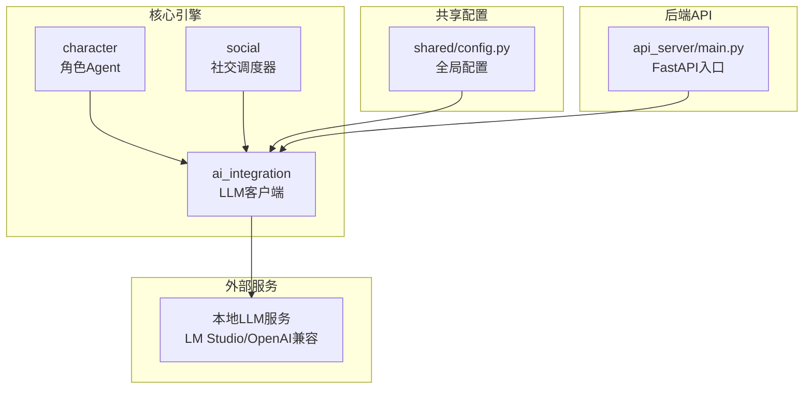
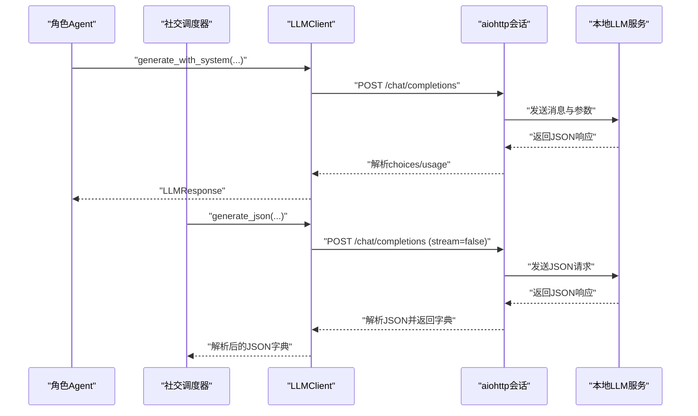
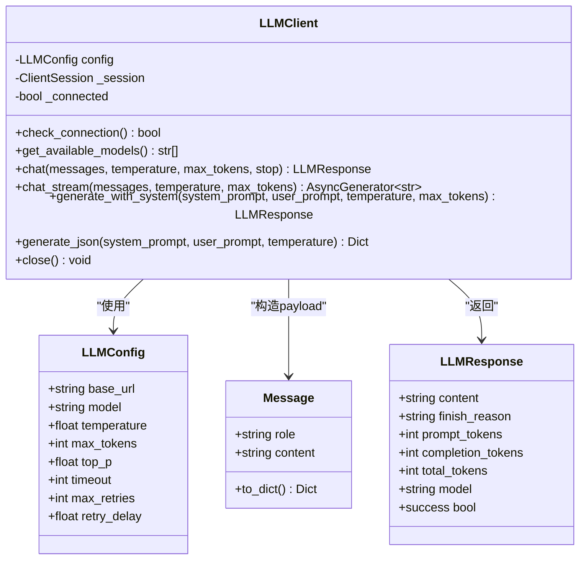
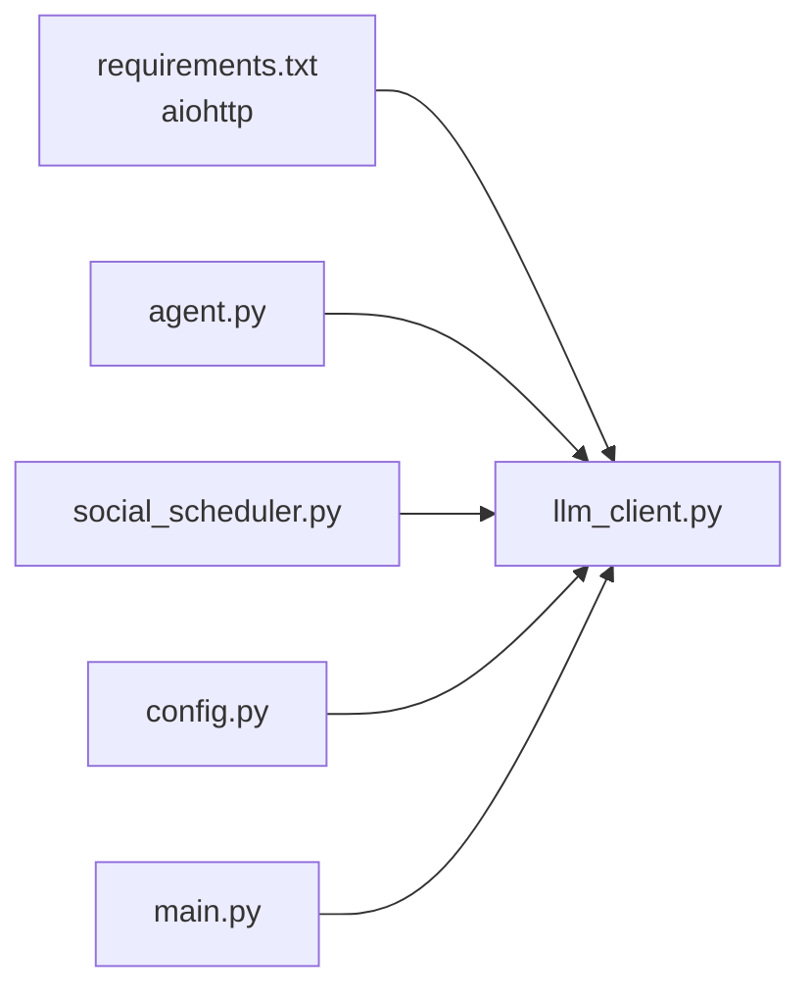
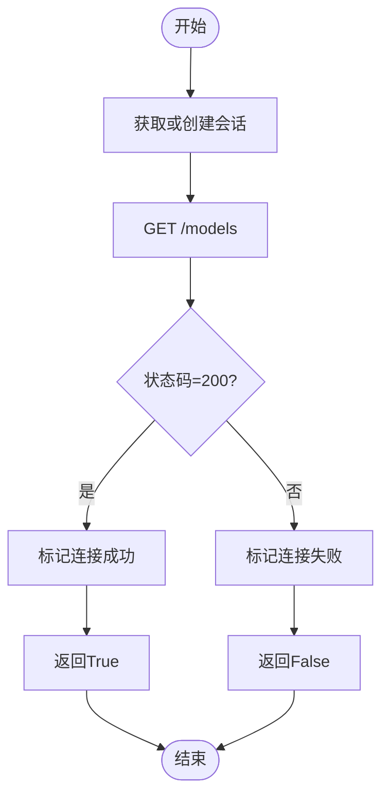

# LLM服务集成

<cite>
**本文引用的文件**
- [llm_client.py](file://core_engine/ai_integration/llm_client.py)
- [config.py](file://shared/config.py)
- [README.md](file://README.md)
- [requirements.txt](file://requirements.txt)
- [agent.py](file://core_engine/character/agent.py)
- [social_scheduler.py](file://core_engine/social/social_scheduler.py)
- [run_simulation.py](file://run_simulation.py)
- [main.py](file://api_server/main.py)
</cite>

## 目录
1. [简介](#简介)
2. [项目结构](#项目结构)
3. [核心组件](#核心组件)
4. [架构总览](#架构总览)
5. [组件详细分析](#组件详细分析)
6. [依赖关系分析](#依赖关系分析)
7. [性能考量](#性能考量)
8. [故障排除指南](#故障排除指南)
9. [结论](#结论)
10. [附录](#附录)

## 简介
本文件面向AI社区项目的LLM服务集成，重点围绕LLMClient类的实现原理进行深入说明，涵盖：
- OpenAI兼容接口的使用方式
- 异步HTTP请求处理与连接池管理
- LLM配置参数（base_url、model、temperature、max_tokens等）的作用与最佳实践
- 消息格式转换、响应解析与错误处理机制
- 流式响应（SSE）处理与实时文本生成
- 连接检查、模型列表获取与重试机制
- 完整使用示例与故障排除指南

## 项目结构
AI社区项目采用分层架构，LLM服务集成位于核心引擎的ai_integration模块中，通过异步HTTP客户端与本地LLM服务（如LM Studio）对接，并被角色Agent与社交调度器广泛使用。



图表来源
- [llm_client.py](file://core_engine/ai_integration/llm_client.py#L1-L351)
- [agent.py](file://core_engine/character/agent.py#L1-L1271)
- [social_scheduler.py](file://core_engine/social/social_scheduler.py#L497-L691)
- [config.py](file://shared/config.py#L1-L52)
- [main.py](file://api_server/main.py#L1-L69)

章节来源
- [README.md](file://README.md#L1-L290)
- [requirements.txt](file://requirements.txt#L1-L32)

## 核心组件
- LLMConfig：封装LLM基础URL、模型名、采样参数（temperature、top_p）、最大token数、超时与重试策略等。
- Message：消息数据结构，支持转为OpenAI兼容的字典格式。
- LLMResponse：LLM响应封装，包含内容、结束原因、token用量与模型名等。
- LLMClient：核心客户端，提供连接检查、模型列表获取、同步与流式对话、JSON生成等能力。
- 单例工厂：get_llm_client，便于全局统一管理与配置更新。

章节来源
- [llm_client.py](file://core_engine/ai_integration/llm_client.py#L14-L52)
- [llm_client.py](file://core_engine/ai_integration/llm_client.py#L29-L37)
- [llm_client.py](file://core_engine/ai_integration/llm_client.py#L40-L52)
- [llm_client.py](file://core_engine/ai_integration/llm_client.py#L54-L317)

## 架构总览
LLMClient通过aiohttp异步HTTP客户端与本地LLM服务通信，遵循OpenAI兼容接口规范（/models、/chat/completions）。角色Agent与社交调度器通过LLMClient进行对话生成、计划制定与内容创作；后端API可直接调用LLMClient进行测试与集成。



图表来源
- [llm_client.py](file://core_engine/ai_integration/llm_client.py#L106-L171)
- [llm_client.py](file://core_engine/ai_integration/llm_client.py#L253-L299)
- [agent.py](file://core_engine/character/agent.py#L860-L871)
- [social_scheduler.py](file://core_engine/social/social_scheduler.py#L523-L532)

## 组件详细分析

### LLMClient类与OpenAI兼容接口
- OpenAI兼容端点
  - 模型列表：GET /models
  - 对话补全：POST /chat/completions
- 请求参数
  - model：模型名
  - messages：消息数组（role/content）
  - temperature/top_p/max_tokens：采样控制
  - stream：开启流式响应
  - stop：停止词（可选）
- 响应解析
  - choices[0].message.content：生成内容
  - choices[0].finish_reason：结束原因
  - usage：prompt_tokens/completion_tokens/total_tokens
- 错误处理
  - 非200状态码：读取text并打印错误
  - 超时异常：捕获并记录
  - 其他异常：捕获并记录
- 重试机制
  - 失败时按max_retries与retry_delay进行指数退避式重试

章节来源
- [llm_client.py](file://core_engine/ai_integration/llm_client.py#L80-L104)
- [llm_client.py](file://core_engine/ai_integration/llm_client.py#L106-L171)
- [llm_client.py](file://core_engine/ai_integration/llm_client.py#L172-L227)

### 异步HTTP请求与连接池管理
- 会话生命周期
  - 首次使用或会话关闭时创建新的aiohttp.ClientSession
  - 使用ClientTimeout(total=timeout)设置超时
  - 显式close()关闭会话并重置内部状态
- 并发与资源
  - 单例客户端共享同一会话，避免重复创建
  - 适合高并发场景下的连接复用

章节来源
- [llm_client.py](file://core_engine/ai_integration/llm_client.py#L61-L79)
- [llm_client.py](file://core_engine/ai_integration/llm_client.py#L66-L71)

### 配置参数详解与最佳实践
- base_url
  - 默认指向本地LM Studio服务端点
  - 可替换为OpenAI兼容服务端点
  - 建议在生产环境通过环境变量或配置中心动态注入
- model
  - 指定当前使用的模型名称
  - 建议与实际加载的模型一致，避免404
- temperature
  - 控制创造性与多样性
  - 低值（0.3）用于结构化输出（如JSON）
  - 中值（0.7）用于通用对话
  - 高值（0.9）用于创意写作
- max_tokens
  - 控制单次生成的最大token数
  - 需结合模型上下文长度限制合理设置
- top_p
  - 核采样概率质量
  - 与temperature配合调节输出稳定性与多样性
- timeout
  - 整体请求超时时间
  - 建议根据模型大小与网络状况适当增大
- 重试策略
  - max_retries：最大重试次数
  - retry_delay：每次重试间隔（秒）

章节来源
- [llm_client.py](file://core_engine/ai_integration/llm_client.py#L15-L27)
- [config.py](file://shared/config.py#L30-L35)
- [README.md](file://README.md#L82-L98)

### 消息格式转换与响应解析
- 消息转换
  - Message.to_dict()将role与content映射为OpenAI兼容字典
- 响应解析
  - 从choices[0].message提取content与finish_reason
  - 从usage提取prompt/completion/total tokens
  - model字段回填默认模型名
- JSON生成
  - generate_json通过系统提示词约束输出为JSON
  - 自动提取代码块中的JSON片段
  - 使用JSONDecodeError进行容错解析

章节来源
- [llm_client.py](file://core_engine/ai_integration/llm_client.py#L30-L37)
- [llm_client.py](file://core_engine/ai_integration/llm_client.py#L106-L171)
- [llm_client.py](file://core_engine/ai_integration/llm_client.py#L253-L299)

### 流式响应处理（SSE）
- SSE协议支持
  - 在请求中设置stream=true
  - 逐行读取response.content，过滤"data: [DONE]"
  - 解析"data: "前缀后的JSON片段
  - 从choices[0].delta.content提取增量文本
- 实时文本生成
  - 适用于UI实时渲染与用户体验优化
  - 注意异常与JSON解析错误的容错

章节来源
- [llm_client.py](file://core_engine/ai_integration/llm_client.py#L172-L227)

### 连接检查、模型列表获取与重试机制
- 连接检查
  - GET /models，成功则标记_connected为True
- 模型列表
  - 解析/data字段中的模型id列表
- 重试机制
  - chat方法内置max_retries与retry_delay
  - 超时与异常均计入重试计数

章节来源
- [llm_client.py](file://core_engine/ai_integration/llm_client.py#L80-L104)
- [llm_client.py](file://core_engine/ai_integration/llm_client.py#L136-L170)

### 在角色Agent与社交调度器中的使用
- 角色Agent
  - 通过generate_with_system生成日常计划、对话开场白与总结
  - 通过chat进行连续对话，维护conversation_history
- 社交调度器
  - 通过generate_json生成回复决策（JSON格式）
  - 与Agent协作完成角色间的互动

章节来源
- [agent.py](file://core_engine/character/agent.py#L268-L289)
- [agent.py](file://core_engine/character/agent.py#L860-L871)
- [agent.py](file://core_engine/character/agent.py#L896-L908)
- [agent.py](file://core_engine/character/agent.py#L936-L957)
- [social_scheduler.py](file://core_engine/social/social_scheduler.py#L523-L532)
- [social_scheduler.py](file://core_engine/social/social_scheduler.py#L658-L688)

### 类关系图


图表来源
- [llm_client.py](file://core_engine/ai_integration/llm_client.py#L14-L52)
- [llm_client.py](file://core_engine/ai_integration/llm_client.py#L29-L52)
- [llm_client.py](file://core_engine/ai_integration/llm_client.py#L54-L317)

## 依赖关系分析
- LLMClient依赖aiohttp进行异步HTTP通信
- 角色Agent与社交调度器依赖LLMClient进行对话与内容生成
- 全局配置shared/config.py提供OpenAI兼容服务的基础地址（预留）
- 后端API入口main.py可直接调用LLMClient进行健康检查与测试



图表来源
- [requirements.txt](file://requirements.txt#L24-L26)
- [llm_client.py](file://core_engine/ai_integration/llm_client.py#L7-L11)
- [agent.py](file://core_engine/character/agent.py#L18-L18)
- [social_scheduler.py](file://core_engine/social/social_scheduler.py#L523-L527)
- [config.py](file://shared/config.py#L30-L35)
- [main.py](file://api_server/main.py#L1-L11)

章节来源
- [requirements.txt](file://requirements.txt#L1-L32)
- [config.py](file://shared/config.py#L1-L52)

## 性能考量
- 连接复用
  - 单例客户端共享会话，减少TCP握手与连接开销
- 超时与重试
  - 合理设置timeout与重试策略，避免长时间阻塞
- 流式响应
  - 使用stream=true降低首字延迟，提升交互体验
- 参数调优
  - temperature与top_p影响生成速度与质量，需权衡
  - max_tokens需结合上下文长度与模型限制

## 故障排除指南
- LLM连接失败
  - 确认本地LLM服务已启动且端口正确
  - 使用测试脚本验证连接与模型列表
- 模型不可用
  - 检查model配置与实际加载模型是否一致
- 超时或不稳定
  - 提升timeout，检查网络与服务负载
  - 合理设置max_retries与retry_delay
- JSON解析失败
  - 确保系统提示词明确要求JSON格式
  - 检查输出是否包含代码块，必要时提取```json片段
- 前端/后端集成问题
  - 确认CORS配置允许前端域名访问
  - 使用健康检查端点确认服务可用

章节来源
- [README.md](file://README.md#L269-L286)
- [llm_client.py](file://core_engine/ai_integration/llm_client.py#L319-L346)
- [main.py](file://api_server/main.py#L23-L34)

## 结论
LLMClient提供了简洁而强大的OpenAI兼容接口封装，结合异步HTTP与连接池管理，满足AI社区项目中角色对话、计划制定与社交互动的多样化需求。通过合理的配置参数与重试策略，可在保证稳定性的同时获得良好的性能与用户体验。

## 附录

### 使用示例（路径指引）
- 连接检查与模型列表
  - [test_llm_connection](file://core_engine/ai_integration/llm_client.py#L319-L346)
- 同步对话
  - [generate_with_system](file://core_engine/ai_integration/llm_client.py#L228-L251)
  - [chat](file://core_engine/ai_integration/llm_client.py#L106-L171)
- 流式对话
  - [chat_stream](file://core_engine/ai_integration/llm_client.py#L172-L227)
- JSON生成
  - [generate_json](file://core_engine/ai_integration/llm_client.py#L253-L299)
- 角色Agent中的应用
  - [start_conversation](file://core_engine/character/agent.py#L831-L871)
  - [respond_in_conversation](file://core_engine/character/agent.py#L873-L908)
  - [end_conversation](file://core_engine/character/agent.py#L910-L957)
- 社交调度器中的应用
  - [generate_json用于回复决策](file://core_engine/social/social_scheduler.py#L523-L532)
  - [多人对话循环](file://core_engine/social/social_scheduler.py#L658-L688)

### 关键流程图（连接检查与模型列表）


图表来源
- [llm_client.py](file://core_engine/ai_integration/llm_client.py#L80-L104)