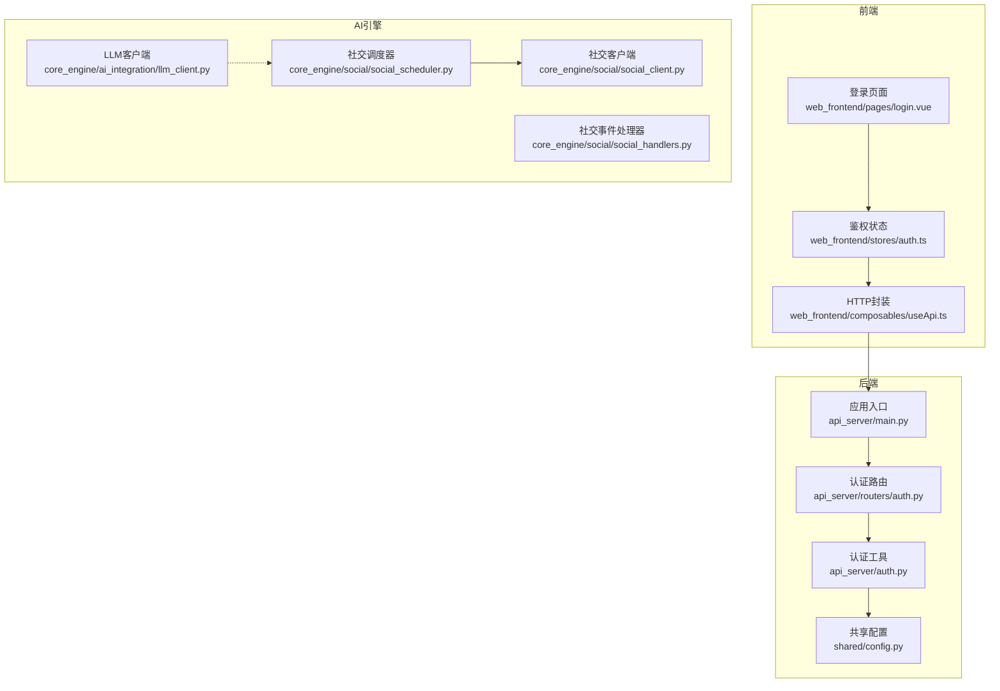
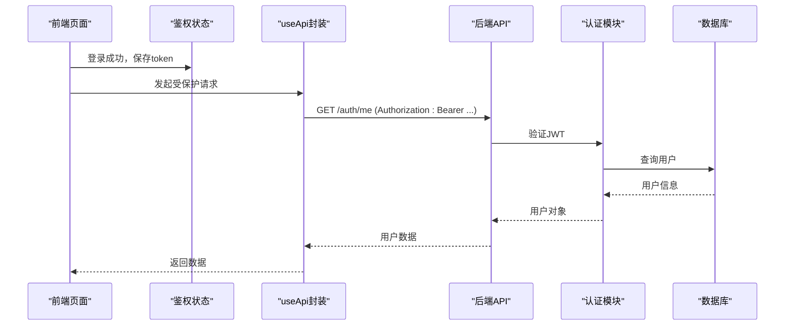
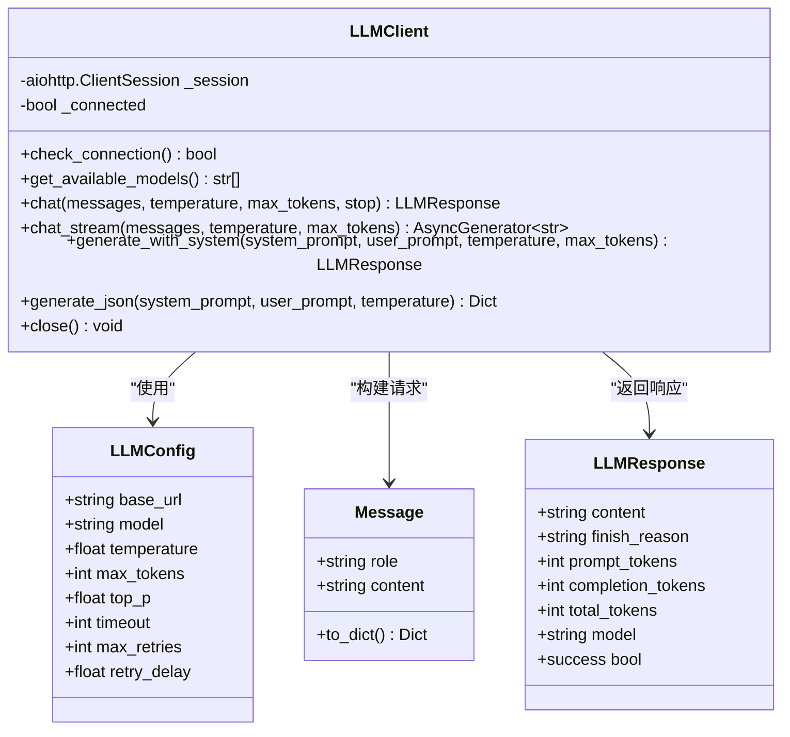
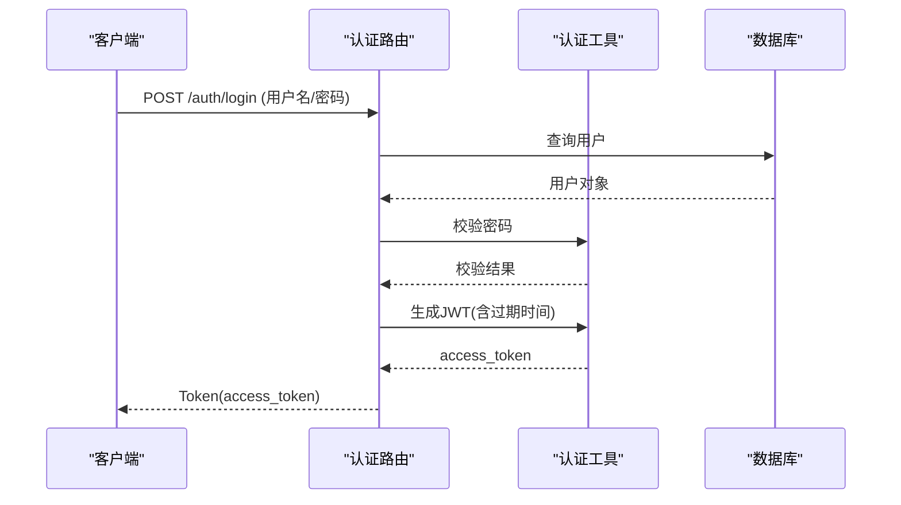
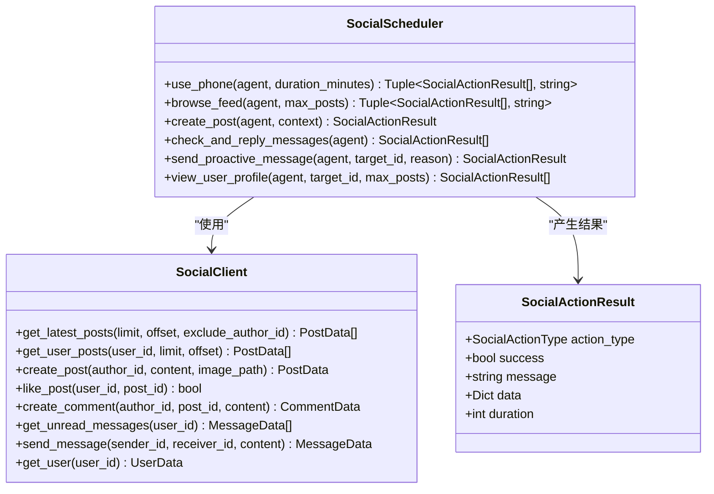
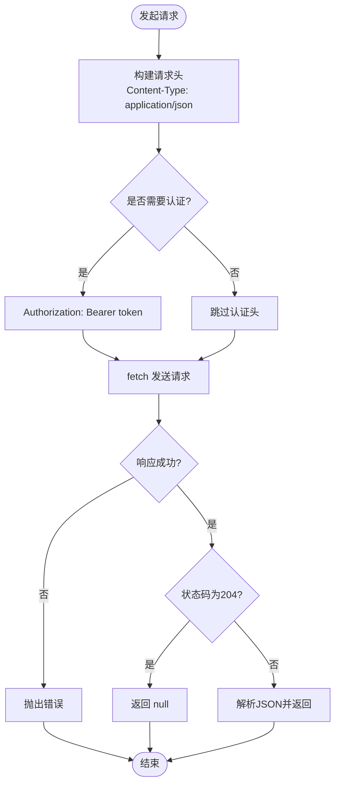
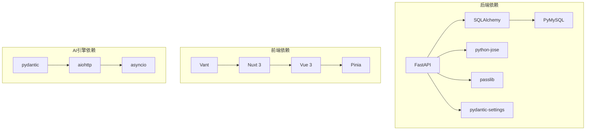

# 外部API集成

<cite>
**本文引用的文件**
- [README.md](file://README.md)
- [requirements.txt](file://requirements.txt)
- [shared/config.py](file://shared/config.py)
- [api_server/main.py](file://api_server/main.py)
- [api_server/auth.py](file://api_server/auth.py)
- [api_server/routers/auth.py](file://api_server/routers/auth.py)
- [web_frontend/composables/useApi.ts](file://web_frontend/composables/useApi.ts)
- [web_frontend/stores/auth.ts](file://web_frontend/stores/auth.ts)
- [web_frontend/pages/login.vue](file://web_frontend/pages/login.vue)
- [core_engine/ai_integration/llm_client.py](file://core_engine/ai_integration/llm_client.py)
- [core_engine/social/social_client.py](file://core_engine/social/social_client.py)
- [core_engine/social/social_scheduler.py](file://core_engine/social/social_scheduler.py)
- [core_engine/social/social_handlers.py](file://core_engine/social/social_handlers.py)
</cite>

## 目录
1. [简介](#简介)
2. [项目结构](#项目结构)
3. [核心组件](#核心组件)
4. [架构总览](#架构总览)
5. [详细组件分析](#详细组件分析)
6. [依赖关系分析](#依赖关系分析)
7. [性能考量](#性能考量)
8. [故障排查指南](#故障排查指南)
9. [结论](#结论)
10. [附录](#附录)

## 简介
本指南面向需要在AI社区项目中进行外部API集成的开发者，重点覆盖：
- HTTP客户端实现与最佳实践（基于aiohttp）
- 请求认证与JWT令牌管理（获取、验证、刷新）
- 社交API客户端实现（用户信息同步、发帖、评论、私聊）
- API调用最佳实践（超时、重试、错误处理）
- API版本管理、速率限制与安全考虑
- 完整集成示例与调试技巧

## 项目结构
项目采用前后端分离与AI模拟引擎协同的架构：
- 后端API服务（FastAPI）：提供认证、用户、帖子、评论、文件、消息等REST接口
- 前端（Nuxt 3 + Vue 3）：通过封装的useApi工具发起带认证的HTTP请求
- AI模拟引擎：包含LLM客户端与社交行为调度器，负责AI角色的社交行为与内容生成
- 共享配置：集中管理数据库、JWT、服务器、文件存储、AI相关等配置

图表来源
- [api_server/main.py](file://api_server/main.py#L1-L69)
- [api_server/routers/auth.py](file://api_server/routers/auth.py#L1-L78)
- [api_server/auth.py](file://api_server/auth.py#L1-L89)
- [shared/config.py](file://shared/config.py#L1-L52)
- [web_frontend/composables/useApi.ts](file://web_frontend/composables/useApi.ts#L1-L57)
- [web_frontend/stores/auth.ts](file://web_frontend/stores/auth.ts#L1-L79)
- [web_frontend/pages/login.vue](file://web_frontend/pages/login.vue#L46-L107)
- [core_engine/ai_integration/llm_client.py](file://core_engine/ai_integration/llm_client.py#L1-L351)
- [core_engine/social/social_client.py](file://core_engine/social/social_client.py#L1-L598)
- [core_engine/social/social_scheduler.py](file://core_engine/social/social_scheduler.py#L1-L735)
- [core_engine/social/social_handlers.py](file://core_engine/social/social_handlers.py#L1-L253)

章节来源
- [README.md](file://README.md#L1-L290)
- [api_server/main.py](file://api_server/main.py#L1-L69)
- [shared/config.py](file://shared/config.py#L1-L52)

## 核心组件
- HTTP客户端与aiohttp集成：LLM客户端使用aiohttp异步HTTP会话，支持超时、重试与流式响应
- JWT认证体系：后端提供OAuth2密码流登录，生成JWT；前端通过useApi自动附加Bearer头
- 社交API客户端：封装数据库访问，提供发帖、评论、点赞、私聊、用户信息查询等能力
- 社交行为调度器：协调AI角色的社交行为，结合LLM生成内容与数据库操作
- 前端API封装：统一请求方法、认证头注入、错误处理与204特殊处理

章节来源
- [core_engine/ai_integration/llm_client.py](file://core_engine/ai_integration/llm_client.py#L1-L351)
- [api_server/auth.py](file://api_server/auth.py#L1-L89)
- [api_server/routers/auth.py](file://api_server/routers/auth.py#L1-L78)
- [web_frontend/composables/useApi.ts](file://web_frontend/composables/useApi.ts#L1-L57)
- [core_engine/social/social_client.py](file://core_engine/social/social_client.py#L1-L598)
- [core_engine/social/social_scheduler.py](file://core_engine/social/social_scheduler.py#L1-L735)

## 架构总览
后端API通过CORS允许前端域名访问，认证采用JWT Bearer方案。前端通过useApi封装统一请求，自动携带Authorization头。AI引擎内部通过SQLAlchemy直接访问数据库，避免HTTP往返开销；同时通过LLM客户端与本地LLM服务交互。

图表来源
- [web_frontend/pages/login.vue](file://web_frontend/pages/login.vue#L68-L100)
- [web_frontend/stores/auth.ts](file://web_frontend/stores/auth.ts#L57-L77)
- [web_frontend/composables/useApi.ts](file://web_frontend/composables/useApi.ts#L8-L48)
- [api_server/routers/auth.py](file://api_server/routers/auth.py#L74-L78)
- [api_server/auth.py](file://api_server/auth.py#L58-L74)

## 详细组件分析

### HTTP客户端与aiohttp集成
- 会话管理：延迟创建ClientSession，设置整体超时，避免重复创建
- 连接检查：访问模型列表端点判断服务可达性
- 请求重试：在chat方法中内置最大重试次数与退避延迟
- 错误处理：捕获超时与异常，打印尝试次数与错误信息
- 流式响应：支持SSE风格的增量数据流，逐行解析并yield片段
- JSON生成：提供生成JSON响应的方法，并自动提取代码块中的JSON

图表来源
- [core_engine/ai_integration/llm_client.py](file://core_engine/ai_integration/llm_client.py#L14-L52)
- [core_engine/ai_integration/llm_client.py](file://core_engine/ai_integration/llm_client.py#L54-L317)

章节来源
- [core_engine/ai_integration/llm_client.py](file://core_engine/ai_integration/llm_client.py#L66-L92)
- [core_engine/ai_integration/llm_client.py](file://core_engine/ai_integration/llm_client.py#L106-L171)
- [core_engine/ai_integration/llm_client.py](file://core_engine/ai_integration/llm_client.py#L172-L227)
- [core_engine/ai_integration/llm_client.py](file://core_engine/ai_integration/llm_client.py#L228-L300)

### JWT令牌管理与认证流程
- 登录：OAuth2密码流，校验密码后生成JWT，设置过期时间
- 验证：解码JWT，从payload提取用户ID，查询数据库确认用户存在
- 依赖注入：FastAPI依赖项自动注入当前用户，未登录抛出401
- 前端携带：useApi在auth=true时自动附加Authorization: Bearer头
- 可选用户：提供可选依赖，便于匿名场景

图表来源
- [api_server/routers/auth.py](file://api_server/routers/auth.py#L45-L71)
- [api_server/auth.py](file://api_server/auth.py#L24-L31)
- [api_server/auth.py](file://api_server/auth.py#L34-L43)
- [api_server/auth.py](file://api_server/auth.py#L58-L74)

章节来源
- [api_server/routers/auth.py](file://api_server/routers/auth.py#L1-L78)
- [api_server/auth.py](file://api_server/auth.py#L1-L89)
- [web_frontend/composables/useApi.ts](file://web_frontend/composables/useApi.ts#L18-L24)
- [web_frontend/stores/auth.ts](file://web_frontend/stores/auth.ts#L57-L77)

### 社交API客户端与行为调度
- 社交客户端：提供帖子、评论、点赞、私聊、用户信息的数据库操作封装
- 行为调度器：协调AI角色的“看手机”、“发帖”、“回复私信”、“查看主页”、“线下相遇”等行为
- 事件处理器：将社交行为映射为游戏事件，驱动AI角色的日常活动
- 配置联动：通过共享配置控制AI浏览评论数量等行为参数

图表来源
- [core_engine/social/social_client.py](file://core_engine/social/social_client.py#L102-L598)
- [core_engine/social/social_scheduler.py](file://core_engine/social/social_scheduler.py#L47-L735)
- [core_engine/social/social_scheduler.py](file://core_engine/social/social_scheduler.py#L37-L45)

章节来源
- [core_engine/social/social_client.py](file://core_engine/social/social_client.py#L138-L237)
- [core_engine/social/social_client.py](file://core_engine/social/social_client.py#L296-L419)
- [core_engine/social/social_client.py](file://core_engine/social/social_client.py#L422-L529)
- [core_engine/social/social_client.py](file://core_engine/social/social_client.py#L545-L591)
- [core_engine/social/social_scheduler.py](file://core_engine/social/social_scheduler.py#L69-L108)
- [core_engine/social/social_scheduler.py](file://core_engine/social/social_scheduler.py#L110-L224)
- [core_engine/social/social_scheduler.py](file://core_engine/social/social_scheduler.py#L226-L271)
- [core_engine/social/social_scheduler.py](file://core_engine/social/social_scheduler.py#L399-L481)
- [core_engine/social/social_scheduler.py](file://core_engine/social/social_scheduler.py#L534-L602)
- [core_engine/social/social_scheduler.py](file://core_engine/social/social_scheduler.py#L272-L395)

### 前端API封装与最佳实践
- 统一请求方法：get/post/put/delete，支持auth开关自动附加Authorization头
- 错误处理：非2xx响应抛出异常，204返回null
- 配置来源：通过Nuxt运行时配置public.apiBase获取后端地址
- 登录流程：OAuth2表单提交，成功后保存token并拉取用户信息

图表来源
- [web_frontend/composables/useApi.ts](file://web_frontend/composables/useApi.ts#L8-L48)
- [web_frontend/pages/login.vue](file://web_frontend/pages/login.vue#L68-L100)
- [web_frontend/stores/auth.ts](file://web_frontend/stores/auth.ts#L57-L77)

章节来源
- [web_frontend/composables/useApi.ts](file://web_frontend/composables/useApi.ts#L1-L57)
- [web_frontend/pages/login.vue](file://web_frontend/pages/login.vue#L46-L107)
- [web_frontend/stores/auth.ts](file://web_frontend/stores/auth.ts#L1-L79)

## 依赖关系分析
- 后端依赖：FastAPI、SQLAlchemy、PyMySQL、python-jose、passlib、pydantic-settings等
- 前端依赖：Nuxt 3、Vue 3、Pinia、Vant等
- AI引擎依赖：aiohttp、asyncio、pydantic等

图表来源
- [requirements.txt](file://requirements.txt#L1-L32)
- [README.md](file://README.md#L244-L262)

章节来源
- [requirements.txt](file://requirements.txt#L1-L32)
- [README.md](file://README.md#L244-L262)

## 性能考量
- 异步I/O：LLM客户端使用aiohttp异步会话，减少阻塞；建议在高并发场景复用会话
- 超时与重试：合理设置超时与重试间隔，避免长时间占用资源；对不可恢复错误及时终止
- 数据库直连：社交客户端直接使用SQLAlchemy访问数据库，避免HTTP往返，适合高频读写场景
- 缓存与批处理：在业务层对热点数据进行缓存，批量查询减少往返次数
- 前端请求合并：对频繁的小请求进行合并或节流，降低网络开销

## 故障排查指南
- LLM连接失败
  - 确认本地LLM服务已启动且端口正确
  - 使用测试脚本验证连接与模型列表
  - 检查超时与重试配置是否合理
- JWT认证失败
  - 核对JWT密钥、算法与过期时间配置
  - 确保前端请求头Authorization格式正确
  - 检查后端依赖注入是否正确解析token
- CORS跨域问题
  - 确认后端CORS允许的源包含前端地址
  - 检查预检请求与凭据传递
- 数据库连接问题
  - 校验数据库URL与凭据
  - 确认数据库服务运行与网络可达
- 社交行为异常
  - 检查AI角色是否为is_ai=True
  - 确认社交调度器与社交客户端实例化正确
  - 关注数据库事务提交与回滚

章节来源
- [README.md](file://README.md#L269-L285)
- [core_engine/ai_integration/llm_client.py](file://core_engine/ai_integration/llm_client.py#L80-L92)
- [api_server/auth.py](file://api_server/auth.py#L34-L55)
- [api_server/main.py](file://api_server/main.py#L23-L34)
- [shared/config.py](file://shared/config.py#L40-L42)

## 结论
本项目通过清晰的模块划分实现了外部API集成的关键能力：后端提供标准JWT认证与REST接口，前端通过统一的HTTP封装进行受保护请求，AI引擎内部采用高性能的数据库直连与异步HTTP客户端，既满足了AI行为的实时性需求，又保持了系统的可维护性与安全性。遵循本文的最佳实践与故障排查建议，可进一步提升集成质量与稳定性。

## 附录
- 环境与配置
  - 数据库：MySQL 8.0+
  - LLM服务：LM Studio（或其他OpenAI兼容本地服务）
  - 服务器：FastAPI + Uvicorn
  - 前端：Nuxt 3 + Vue 3
- 关键端点
  - POST /auth/register：用户注册
  - POST /auth/login：用户登录（OAuth2密码流）
  - GET /auth/me：获取当前用户
  - GET /posts：获取帖子列表
  - POST /posts：创建帖子
  - POST /comments：发表评论
  - GET /messages：获取私信
  - POST /files/upload：上传文件
- 集成示例路径
  - 前端登录与鉴权：[web_frontend/pages/login.vue](file://web_frontend/pages/login.vue#L68-L100)、[web_frontend/stores/auth.ts](file://web_frontend/stores/auth.ts#L57-L77)
  - 前端HTTP封装：[web_frontend/composables/useApi.ts](file://web_frontend/composables/useApi.ts#L8-L48)
  - 后端认证路由：[api_server/routers/auth.py](file://api_server/routers/auth.py#L45-L71)
  - JWT工具：[api_server/auth.py](file://api_server/auth.py#L34-L74)
  - LLM客户端：[core_engine/ai_integration/llm_client.py](file://core_engine/ai_integration/llm_client.py#L66-L171)
  - 社交客户端：[core_engine/social/social_client.py](file://core_engine/social/social_client.py#L138-L237)
  - 社交调度器：[core_engine/social/social_scheduler.py](file://core_engine/social/social_scheduler.py#L69-L108)