# 数据库服务扩展

<cite>
**本文档引用的文件**
- [api_server/database.py](file://api_server/database.py)
- [api_server/models.py](file://api_server/models.py)
- [shared/config.py](file://shared/config.py)
- [init_db.py](file://init_db.py)
- [data/migrations/001_init.sql](file://data/migrations/001_init.sql)
- [data/migrations/002_action_logs.sql](file://data/migrations/002_action_logs.sql)
- [api_server/routers/users.py](file://api_server/routers/users.py)
- [api_server/routers/posts.py](file://api_server/routers/posts.py)
- [api_server/schemas.py](file://api_server/schemas.py)
- [requirements.txt](file://requirements.txt)
</cite>

## 目录
1. [简介](#简介)
2. [项目结构](#项目结构)
3. [核心组件](#核心组件)
4. [架构概览](#架构概览)
5. [详细组件分析](#详细组件分析)
6. [依赖关系分析](#依赖关系分析)
7. [性能优化策略](#性能优化策略)
8. [故障排除指南](#故障排除指南)
9. [结论](#结论)

## 简介

本指南面向AI社区项目的数据库服务扩展需求，基于现有的SQLAlchemy ORM实现，提供从模型定义、关系映射到查询优化的完整解决方案。项目采用FastAPI + SQLAlchemy + MySQL的技术栈，实现了完整的用户、帖子、评论、消息等核心业务功能的数据持久化。

## 项目结构

AI社区项目采用分层架构设计，数据库相关的核心组件分布如下：

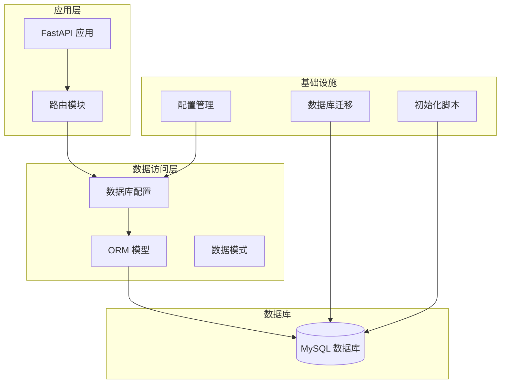

**图表来源**
- [api_server/main.py](file://api_server/main.py#L1-L69)
- [api_server/database.py](file://api_server/database.py#L1-L33)
- [shared/config.py](file://shared/config.py#L1-L52)

**章节来源**
- [api_server/main.py](file://api_server/main.py#L1-L69)
- [api_server/database.py](file://api_server/database.py#L1-L33)
- [shared/config.py](file://shared/config.py#L1-L52)

## 核心组件

### 数据库引擎配置

项目使用SQLAlchemy创建数据库引擎，配置了连接池参数以确保生产环境的稳定性：

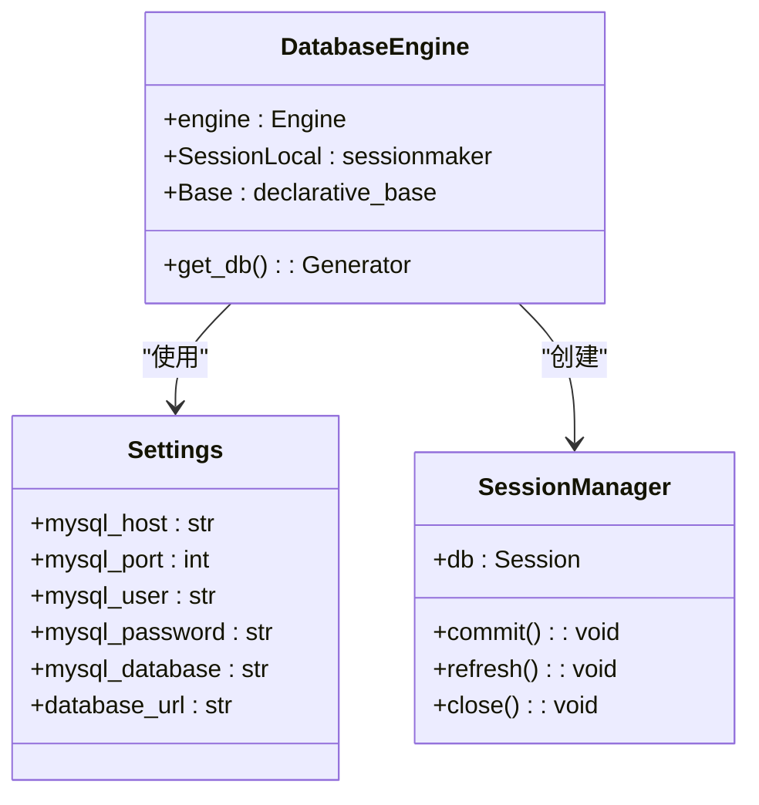

**图表来源**
- [api_server/database.py](file://api_server/database.py#L14-L33)
- [shared/config.py](file://shared/config.py#L40-L43)

### ORM模型体系

项目实现了完整的用户社交网络模型，包括用户、帖子、评论、消息等核心实体：

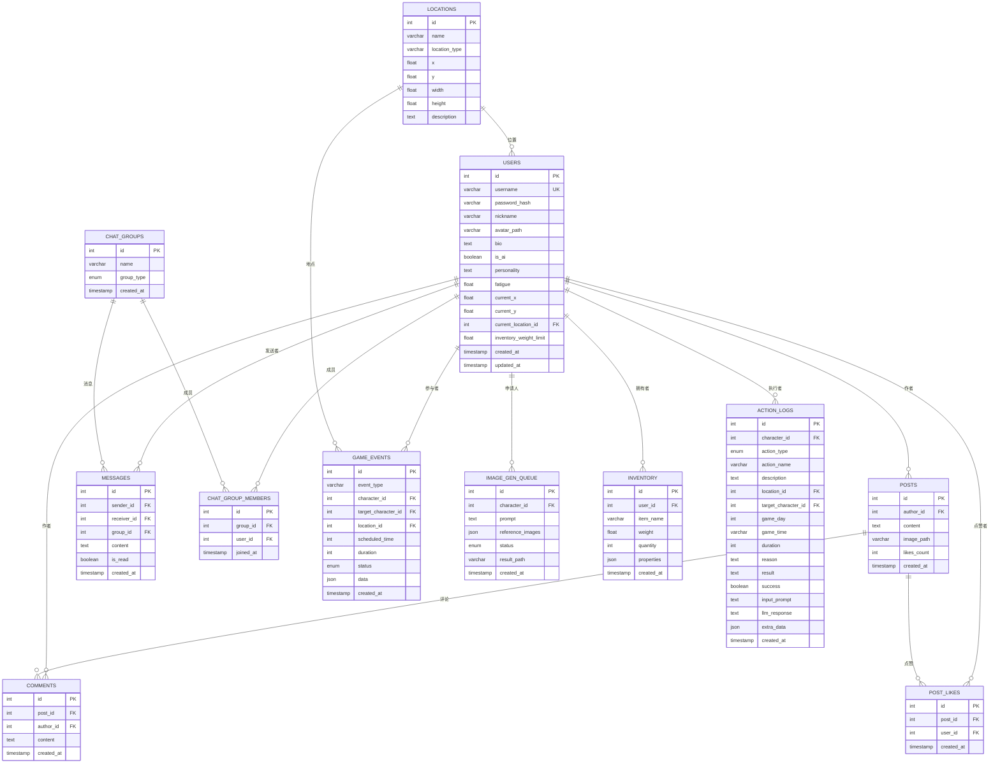

**图表来源**
- [api_server/models.py](file://api_server/models.py#L35-L293)

**章节来源**
- [api_server/database.py](file://api_server/database.py#L1-L33)
- [api_server/models.py](file://api_server/models.py#L1-L293)
- [shared/config.py](file://shared/config.py#L1-L52)

## 架构概览

### 数据流架构

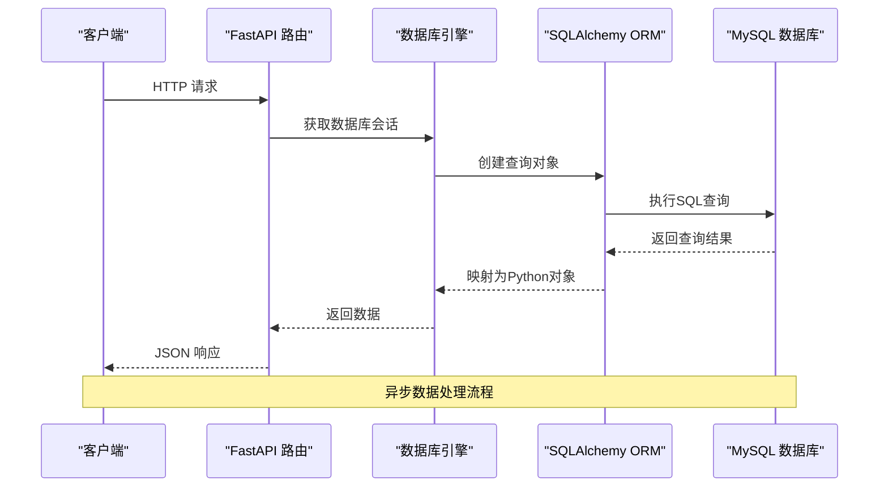

**图表来源**
- [api_server/routers/users.py](file://api_server/routers/users.py#L13-L22)
- [api_server/routers/posts.py](file://api_server/routers/posts.py#L72-L88)

### 连接池管理

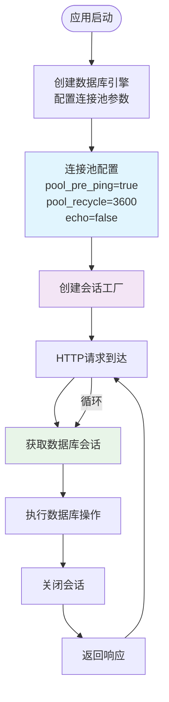

**图表来源**
- [api_server/database.py](file://api_server/database.py#L14-L33)

**章节来源**
- [api_server/database.py](file://api_server/database.py#L14-L33)
- [api_server/routers/users.py](file://api_server/routers/users.py#L13-L22)
- [api_server/routers/posts.py](file://api_server/routers/posts.py#L72-L88)

## 详细组件分析

### 数据库连接池配置

项目采用了生产级的连接池配置策略：

| 配置参数 | 值 | 作用 | 优化建议 |
|---------|----|------|---------|
| pool_pre_ping | True | 连接前验证 | 确保连接有效性，避免死连接 |
| pool_recycle | 3600秒 | 连接回收时间 | 防止长时间连接导致的内存泄漏 |
| echo | False | SQL日志开关 | 生产环境关闭，避免性能影响 |

### ORM模型设计模式

#### 主键与索引策略

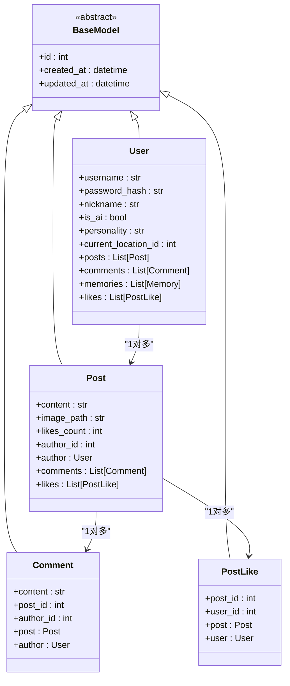

**图表来源**
- [api_server/models.py](file://api_server/models.py#L35-L110)

#### 关系映射实现

项目实现了多种复杂的关系映射：

1. **一对多关系**：用户与帖子、评论、点赞
2. **多对多关系**：通过中间表实现的群组成员关系
3. **自引用关系**：用户与目标用户的关联
4. **级联操作**：删除父实体时自动删除子实体

**章节来源**
- [api_server/models.py](file://api_server/models.py#L56-L110)

### 查询优化策略

#### N+1查询问题解决

项目通过`joinedload`优化了常见的N+1查询问题：

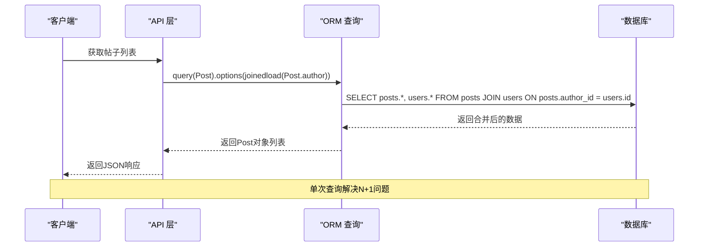

**图表来源**
- [api_server/routers/posts.py](file://api_server/routers/posts.py#L54-L60)

#### 索引设计策略

基于业务查询模式，项目建立了以下索引：

| 表名 | 索引类型 | 字段组合 | 查询场景 |
|------|----------|----------|----------|
| users | 唯一索引 | username | 用户登录查询 |
| users | 普通索引 | is_ai | AI用户筛选 |
| posts | 普通索引 | author_id | 用户帖子查询 |
| posts | 普通索引 | created_at | 时间排序查询 |
| comments | 普通索引 | post_id | 帖子评论查询 |
| post_likes | 唯一索引 | (post_id, user_id) | 点赞状态查询 |
| messages | 普通索引 | (sender_id, receiver_id) | 私聊查询 |
| messages | 普通索引 | group_id | 群聊查询 |
| action_logs | 普通索引 | character_id | 角色行动查询 |
| action_logs | 普通索引 | created_at | 时间排序查询 |

**章节来源**
- [data/migrations/001_init.sql](file://data/migrations/001_init.sql#L25-L129)
- [data/migrations/002_action_logs.sql](file://data/migrations/002_action_logs.sql#L39-L43)

### 数据库初始化与迁移

#### 初始化脚本设计

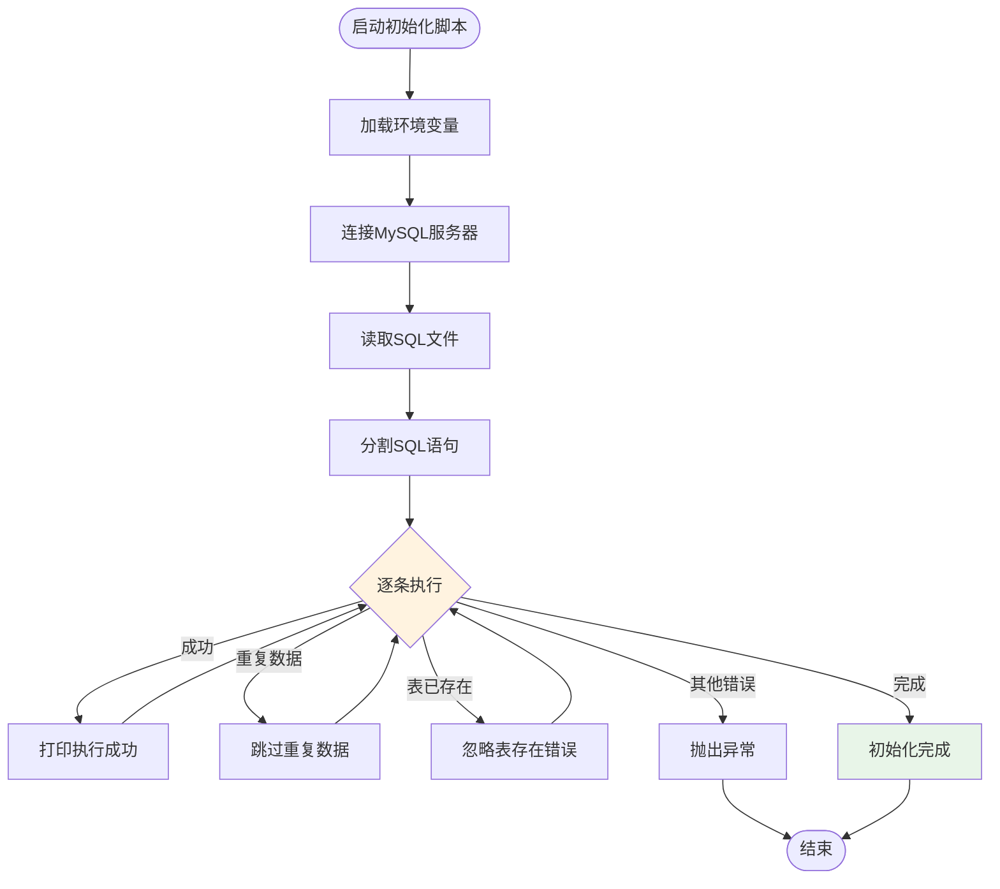

**图表来源**
- [init_db.py](file://init_db.py#L18-L57)

**章节来源**
- [init_db.py](file://init_db.py#L1-L70)
- [data/migrations/001_init.sql](file://data/migrations/001_init.sql#L1-L205)

## 依赖关系分析

### 外部依赖关系

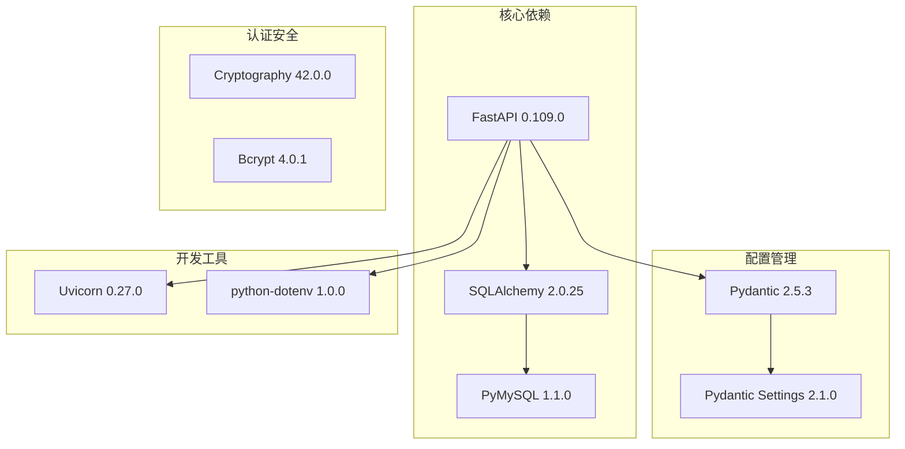

**图表来源**
- [requirements.txt](file://requirements.txt#L1-L32)

### 内部模块依赖

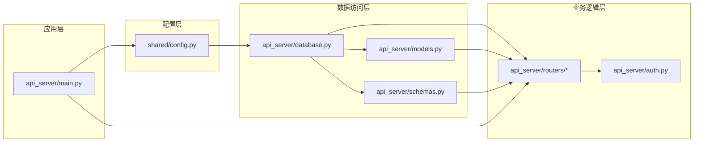

**图表来源**
- [api_server/main.py](file://api_server/main.py#L10-L42)
- [api_server/database.py](file://api_server/database.py#L10-L12)

**章节来源**
- [requirements.txt](file://requirements.txt#L1-L32)
- [api_server/main.py](file://api_server/main.py#L10-L42)

## 性能优化策略

### 查询性能优化

#### 连接池优化

1. **连接预检测**：启用`pool_pre_ping=True`确保连接有效性
2. **连接回收**：设置`pool_recycle=3600`防止长时间连接导致的问题
3. **日志控制**：生产环境关闭SQL日志输出

#### 查询优化技巧

1. **批量查询**：使用`joinedload`减少N+1查询
2. **索引利用**：根据查询模式建立合适的索引
3. **分页处理**：实现合理的分页机制避免大数据量查询

### 缓存策略

虽然项目当前未实现数据库缓存，但可以考虑以下方案：

1. **查询结果缓存**：对热点查询结果进行缓存
2. **会话缓存**：缓存用户会话信息减少数据库查询
3. **二级缓存**：实现应用级缓存层

### 批量操作优化

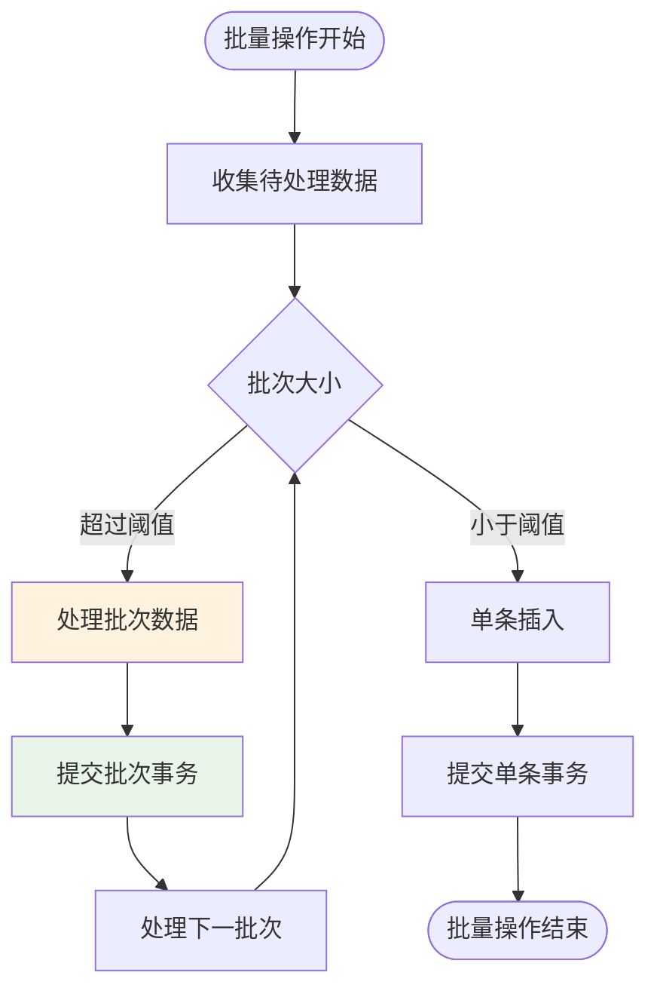

## 故障排除指南

### 常见数据库问题

#### 连接问题诊断

1. **连接超时**：检查`pool_recycle`配置和网络连接
2. **连接池耗尽**：监控活跃连接数，调整连接池大小
3. **字符集问题**：确保数据库和表使用utf8mb4字符集

#### 查询性能问题

1. **慢查询识别**：使用EXPLAIN分析查询计划
2. **索引缺失**：根据查询模式添加合适索引
3. **锁竞争**：优化事务粒度，减少锁持有时间

### 错误处理机制

项目实现了完善的错误处理：

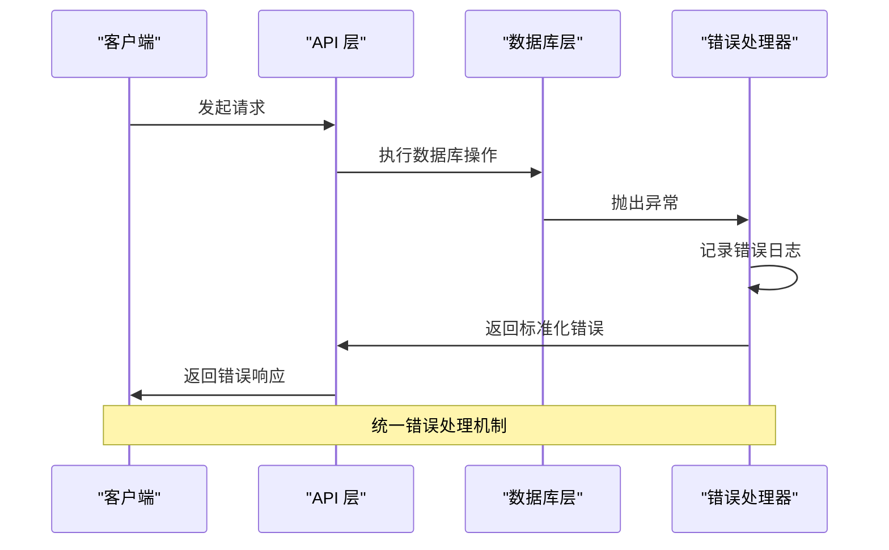

**章节来源**
- [api_server/routers/users.py](file://api_server/routers/users.py#L17-L21)
- [api_server/routers/posts.py](file://api_server/routers/posts.py#L99-L103)

## 结论

AI社区项目的数据库服务扩展已经建立了完整的基础设施，包括：

1. **成熟的ORM模型设计**：涵盖了用户社交网络的核心业务场景
2. **优化的连接池配置**：确保生产环境的稳定性和性能
3. **完善的查询优化策略**：有效解决了N+1查询等性能问题
4. **规范的数据库迁移管理**：支持版本控制和数据同步

未来可以进一步扩展的方向包括：
- 实现数据库缓存层以提升查询性能
- 添加数据库监控和告警机制
- 实现更复杂的批量操作和异步处理
- 建立完整的数据库备份和恢复策略

这些扩展将使AI社区项目具备企业级的数据库服务能力，为后续的功能扩展奠定坚实基础。