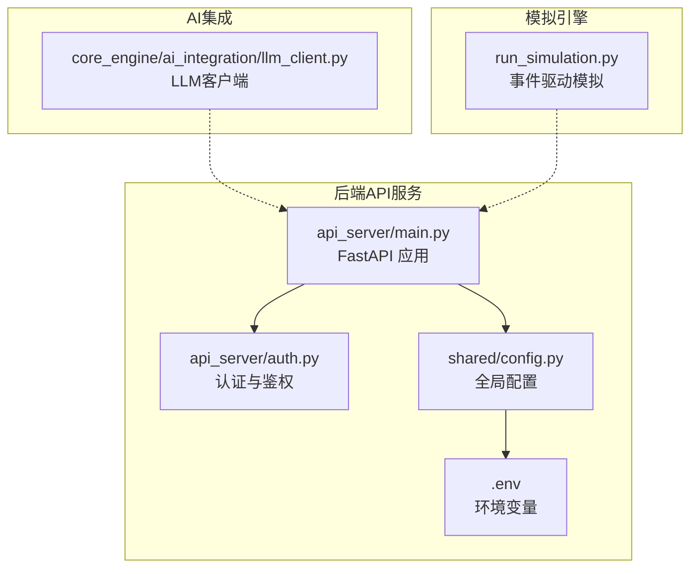
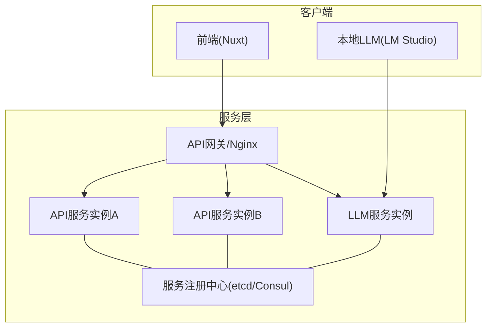
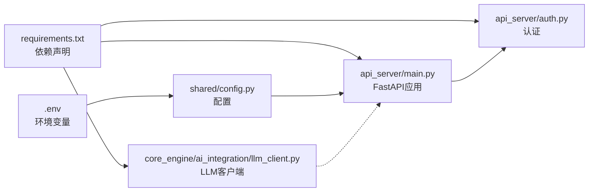
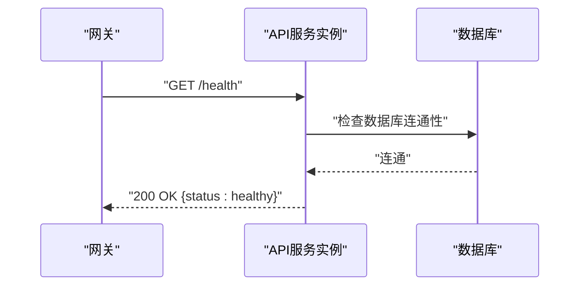
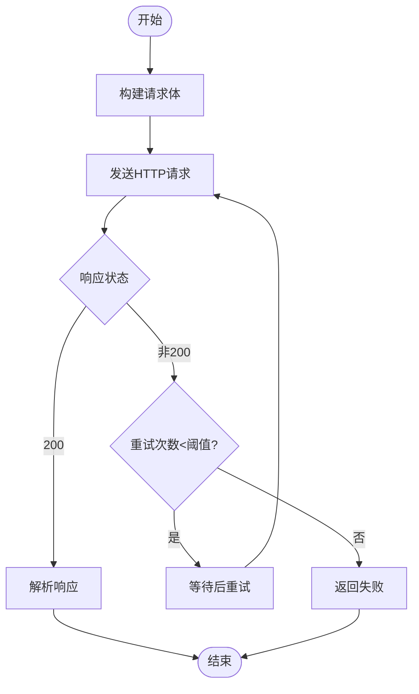

# 服务发现与负载均衡

<cite>
**本文引用的文件**
- [README.md](file://README.md)
- [requirements.txt](file://requirements.txt)
- [.env](file://.env)
- [shared/config.py](file://shared/config.py)
- [api_server/main.py](file://api_server/main.py)
- [api_server/auth.py](file://api_server/auth.py)
- [core_engine/ai_integration/llm_client.py](file://core_engine/ai_integration/llm_client.py)
- [run_simulation.py](file://run_simulation.py)
</cite>

## 目录
1. [简介](#简介)
2. [项目结构](#项目结构)
3. [核心组件](#核心组件)
4. [架构总览](#架构总览)
5. [组件详解](#组件详解)
6. [依赖关系分析](#依赖关系分析)
7. [性能考量](#性能考量)
8. [故障排查指南](#故障排查指南)
9. [结论](#结论)
10. [附录](#附录)

## 简介
本指南面向在本地或小型分布式环境中部署与运维“AI社区”系统的工程团队，聚焦于服务发现与负载均衡的实现思路与最佳实践。当前仓库中的后端服务为单机FastAPI应用，未内置服务注册中心或统一负载均衡器；因此本指南提供一套可扩展的设计方案，帮助在不改变现有代码的前提下，平滑引入服务注册与发现、健康检查、故障转移、负载均衡与监控告警，并给出分布式一致性与冲突处理建议。

## 项目结构
- 后端API服务：基于FastAPI，提供认证、用户、帖子、评论、文件与消息等接口，支持健康检查端点。
- AI集成层：通过异步HTTP客户端对接本地LLM服务（LM Studio），具备连接检查、重试与流式响应能力。
- 模拟引擎：独立的Python脚本，负责AI角色的事件驱动模拟，与API服务解耦。
- 配置体系：通过共享配置模块与环境变量集中管理数据库、JWT、服务端口、前端地址等。

**图表来源**
- [api_server/main.py](file://api_server/main.py#L1-L69)
- [api_server/auth.py](file://api_server/auth.py#L1-L89)
- [shared/config.py](file://shared/config.py#L1-L52)
- [.env](file://.env#L1-L30)
- [core_engine/ai_integration/llm_client.py](file://core_engine/ai_integration/llm_client.py#L1-L351)
- [run_simulation.py](file://run_simulation.py#L1-L258)

**章节来源**
- [README.md](file://README.md#L1-L290)
- [requirements.txt](file://requirements.txt#L1-L32)
- [shared/config.py](file://shared/config.py#L1-L52)
- [api_server/main.py](file://api_server/main.py#L1-L69)
- [.env](file://.env#L1-L30)

## 核心组件
- 配置与环境
  - 全局配置类集中管理数据库、JWT、服务端口、前端地址、AI相关预留项等。
  - 环境变量文件提供运行时覆盖，便于不同环境差异化部署。
- API服务
  - FastAPI应用，启用CORS，注册路由，提供健康检查端点。
  - 认证模块基于JWT，提供受保护资源访问。
- LLM客户端
  - 异步HTTP客户端，封装连接检查、模型查询、聊天请求、流式响应与重试逻辑。
- 模拟引擎
  - 独立脚本，事件驱动的时间推进与角色行为模拟，与API服务解耦。

**章节来源**
- [shared/config.py](file://shared/config.py#L1-L52)
- [.env](file://.env#L1-L30)
- [api_server/main.py](file://api_server/main.py#L1-L69)
- [api_server/auth.py](file://api_server/auth.py#L1-L89)
- [core_engine/ai_integration/llm_client.py](file://core_engine/ai_integration/llm_client.py#L1-L351)
- [run_simulation.py](file://run_simulation.py#L1-L258)

## 架构总览
当前系统为单机后端服务 + 本地LLM + 模拟引擎的组合。若需引入服务发现与负载均衡，建议在现有架构上增加如下组件：
- 服务注册中心：如Consul、etcd或Nacos，用于服务注册与发现。
- API网关/反向代理：如Nginx、Envoy或Kong，承担健康检查、路由与负载均衡。
- 健康检查：后端暴露健康端点，网关定期探测。
- 限流与熔断：在网关或服务内部实现，避免雪崩效应。
- 监控与告警：Prometheus + Grafana + Alertmanager，采集指标并推送告警。

[此图为概念性架构示意，不直接映射具体源文件，故不提供图表来源]

## 组件详解

### 服务注册与发现机制
- 服务元数据管理
  - 服务启动时向注册中心上报自身元数据（主机、端口、版本、标签、健康状态）。
  - 元数据建议包含：服务名、实例ID、IP/域名、端口、协议、权重、区域/机房、标签（如版本、特性开关）。
- 健康检查与故障检测
  - 后端提供健康检查端点，网关定时探测，失败次数阈值触发摘除。
  - 健康检查可结合业务探针（如数据库连通性、关键依赖可用性）。
- 动态配置与灰度发布
  - 注册中心支持标签匹配与路由规则，便于灰度与蓝绿发布。

[本节为通用设计说明，不直接分析具体文件，故不提供章节来源]

### 负载均衡算法实现
- 轮询（Round Robin）
  - 顺序分配请求，适合实例性能一致的场景。
- 加权轮询（Weighted Round Robin）
  - 根据权重分配流量，权重可基于实例规格、历史负载或管理员配置。
- 最少连接（Least Connections）
  - 将新请求分配给当前活跃连接数最少的实例，适合请求时长波动较大的场景。
- 哈希一致性（Consistent Hash）
  - 基于客户端标识（如Cookie、用户ID）进行哈希，提升会话粘性与缓存命中。

[本节为通用设计说明，不直接分析具体文件，故不提供章节来源]

### 故障转移与降级策略
- 自动切换
  - 网关根据健康检查结果将流量从故障实例切换至健康实例。
- 降级策略
  - 依赖不可用时返回兜底数据或简化响应；对非核心接口进行快速失败。
- 熔断与隔离
  - 对下游依赖设置熔断窗口与失败阈值，防止级联故障；必要时进行线程池/信号量隔离。

[本节为通用设计说明，不直接分析具体文件，故不提供章节来源]

### 监控告警配置
- 指标采集
  - 请求量、错误率、响应时间、并发连接数、健康检查失败率、CPU/内存使用率。
- 告警规则
  - 错误率阈值、P95/P99延迟、健康检查连续失败、实例存活率等。
- 可视化
  - 使用Grafana展示趋势与告警面板，结合邮件/IM推送通知。

[本节为通用设计说明，不直接分析具体文件，故不提供章节来源]

### 分布式一致性与冲突解决
- 一致性模型
  - 采用最终一致的注册中心模型，避免强一致带来的可用性损失。
- 冲突解决
  - 实例心跳超时抢占、带版本号的CAS更新、幂等写入。
- 幂等性
  - 关键操作（如注册、注销、配置变更）需保证幂等，避免重复执行导致的状态不一致。

[本节为通用设计说明，不直接分析具体文件，故不提供章节来源]

### 部署配置与运维最佳实践
- 单机到多实例
  - 保持配置中心与环境变量一致，确保实例间无状态或状态可共享。
- 网关与反向代理
  - Nginx示例：上游配置多个后端实例，开启健康检查与重试；对慢请求设置超时。
- 健康检查端点
  - 后端提供轻量级健康检查，网关定期探测；探测失败即刻摘除。
- 日志与追踪
  - 统一日志格式与追踪ID，便于跨服务定位问题。
- 版本与灰度
  - 通过标签与路由规则实现灰度发布，逐步扩大流量比例。

[本节为通用设计说明，不直接分析具体文件，故不提供章节来源]

## 依赖关系分析
- 后端服务依赖
  - FastAPI、Uvicorn、SQLAlchemy、PyMySQL、Pydantic、python-jose等。
  - 配置模块与环境变量共同决定数据库连接、JWT密钥、服务端口与前端地址。
- AI集成依赖
  - aiohttp用于异步HTTP通信，支持连接检查、模型查询、聊天与流式响应。
- 模拟引擎
  - 与API服务解耦，通过数据库与事件系统协作。

**图表来源**
- [requirements.txt](file://requirements.txt#L1-L32)
- [shared/config.py](file://shared/config.py#L1-L52)
- [.env](file://.env#L1-L30)
- [api_server/main.py](file://api_server/main.py#L1-L69)
- [api_server/auth.py](file://api_server/auth.py#L1-L89)
- [core_engine/ai_integration/llm_client.py](file://core_engine/ai_integration/llm_client.py#L1-L351)

**章节来源**
- [requirements.txt](file://requirements.txt#L1-L32)
- [shared/config.py](file://shared/config.py#L1-L52)
- [.env](file://.env#L1-L30)
- [api_server/main.py](file://api_server/main.py#L1-L69)
- [api_server/auth.py](file://api_server/auth.py#L1-L89)
- [core_engine/ai_integration/llm_client.py](file://core_engine/ai_integration/llm_client.py#L1-L351)

## 性能考量
- 连接池与超时
  - 数据库连接池大小与超时设置需与实例数量和QPS匹配，避免连接争用。
- 异步与并发
  - LLM客户端使用异步HTTP，减少阻塞；合理设置并发上限与超时，避免资源耗尽。
- 缓存与CDN
  - 对静态资源与热点数据使用缓存与CDN，降低后端压力。
- 负载均衡策略选择
  - 根据请求特征选择合适的负载均衡算法，动态调整权重以适配实例差异。

[本节为通用指导，不直接分析具体文件，故不提供章节来源]

## 故障排查指南
- 健康检查失败
  - 确认后端健康端点可达；检查网关探测配置与超时；查看后端日志与依赖状态。
- LLM连接异常
  - 检查本地LLM服务是否启动、端口是否正确；使用测试脚本验证连接与模型可用性。
- 数据库连接问题
  - 核对数据库主机、端口、账号与密码；确认数据库服务运行正常。
- 权限与认证
  - 校验JWT密钥与算法配置；确认前端与后端的前端地址一致，避免CORS问题。

**章节来源**
- [README.md](file://README.md#L194-L286)
- [api_server/main.py](file://api_server/main.py#L55-L58)
- [core_engine/ai_integration/llm_client.py](file://core_engine/ai_integration/llm_client.py#L319-L346)
- [shared/config.py](file://shared/config.py#L1-L52)
- [.env](file://.env#L1-L30)

## 结论
当前项目以单机后端服务为核心，具备清晰的配置与认证体系。引入服务发现与负载均衡的关键在于：以注册中心承载服务元数据与路由规则，以网关实现健康检查与流量分发，以监控与告警保障稳定性。通过合理的负载均衡策略、故障转移与降级机制，以及完善的运维流程，可在不破坏现有架构的基础上，平滑扩展至多实例与分布式环境。

[本节为总结性内容，不直接分析具体文件，故不提供章节来源]

## 附录

### 健康检查端点序列图

**图表来源**
- [api_server/main.py](file://api_server/main.py#L55-L58)

### LLM客户端请求流程（简化）

**图表来源**
- [core_engine/ai_integration/llm_client.py](file://core_engine/ai_integration/llm_client.py#L106-L171)