# 第三方服务集成

<cite>
**本文引用的文件**
- [README.md](file://README.md)
- [requirements.txt](file://requirements.txt)
- [shared/config.py](file://shared/config.py)
- [api_server/main.py](file://api_server/main.py)
- [api_server/database.py](file://api_server/database.py)
- [api_server/models.py](file://api_server/models.py)
- [api_server/schemas.py](file://api_server/schemas.py)
- [api_server/auth.py](file://api_server/auth.py)
- [api_server/routers/auth.py](file://api_server/routers/auth.py)
- [api_server/routers/posts.py](file://api_server/routers/posts.py)
- [api_server/routers/files.py](file://api_server/routers/files.py)
- [core_engine/ai_integration/llm_client.py](file://core_engine/ai_integration/llm_client.py)
- [core_engine/social/social_client.py](file://core_engine/social/social_client.py)
- [run_simulation.py](file://run_simulation.py)
</cite>

## 目录
1. [简介](#简介)
2. [项目结构](#项目结构)
3. [核心组件](#核心组件)
4. [架构总览](#架构总览)
5. [详细组件分析](#详细组件分析)
6. [依赖关系分析](#依赖关系分析)
7. [性能考虑](#性能考虑)
8. [故障排查指南](#故障排查指南)
9. [结论](#结论)
10. [附录](#附录)

## 简介
本指南面向在AI社区项目中进行第三方服务集成的开发者，围绕以下目标展开：
- LLM服务集成：OpenAI兼容接口使用、流式响应处理、错误重试机制
- 外部API调用：HTTP客户端配置、请求认证、响应处理
- 数据库服务扩展：连接池管理、事务处理、数据同步
- 完整示例：支付服务、推送通知、文件存储、身份认证服务
- 运维能力：服务发现、负载均衡、故障转移、监控告警

项目采用FastAPI后端、SQLAlchemy数据库、异步HTTP客户端（aiohttp）以及事件驱动的AI模拟引擎，具备良好的扩展性与可维护性。

## 项目结构
项目采用分层与功能域结合的组织方式：
- api_server：后端API服务，包含路由、认证、数据库、模型与Schema定义
- core_engine：AI模拟引擎，包含角色、环境、事件系统与AI集成模块
- shared：共享配置模块
- web_frontend：前端应用（Nuxt 3）
- data：数据库迁移与存档
- 根目录：运行脚本与环境配置

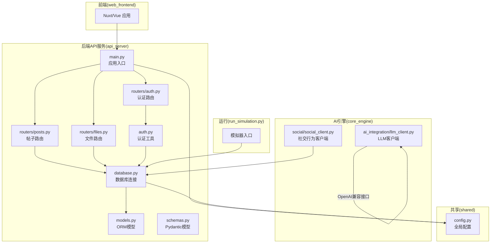

**图表来源**
- [api_server/main.py](file://api_server/main.py#L1-L69)
- [api_server/routers/auth.py](file://api_server/routers/auth.py#L1-L78)
- [api_server/routers/posts.py](file://api_server/routers/posts.py#L1-L166)
- [api_server/routers/files.py](file://api_server/routers/files.py#L1-L138)
- [api_server/auth.py](file://api_server/auth.py#L1-L89)
- [api_server/database.py](file://api_server/database.py#L1-L33)
- [api_server/models.py](file://api_server/models.py#L1-L293)
- [api_server/schemas.py](file://api_server/schemas.py#L1-L166)
- [core_engine/ai_integration/llm_client.py](file://core_engine/ai_integration/llm_client.py#L1-L351)
- [core_engine/social/social_client.py](file://core_engine/social/social_client.py#L1-L598)
- [shared/config.py](file://shared/config.py#L1-L52)
- [run_simulation.py](file://run_simulation.py#L1-L258)

**章节来源**
- [README.md](file://README.md#L1-L290)
- [requirements.txt](file://requirements.txt#L1-L32)

## 核心组件
- 全局配置：集中管理数据库、JWT、文件存储、AI与ComfyUI等配置项，并通过缓存函数提供统一访问
- 数据库层：基于SQLAlchemy，启用连接预检与回收，提供会话依赖注入
- 认证与授权：基于JWT的OAuth2密码流，支持可选登录与当前用户解析
- LLM客户端：OpenAI兼容接口封装，支持同步与流式响应、重试策略与JSON解析
- 社交行为客户端：直接数据库访问，提供发帖、评论、点赞、私聊等能力
- 文件上传：支持图片与头像上传，生成安全文件名并返回可访问URL
- 模拟器：事件驱动的时间模型，AI角色在空闲时决策行动

**章节来源**
- [shared/config.py](file://shared/config.py#L1-L52)
- [api_server/database.py](file://api_server/database.py#L1-L33)
- [api_server/auth.py](file://api_server/auth.py#L1-L89)
- [core_engine/ai_integration/llm_client.py](file://core_engine/ai_integration/llm_client.py#L1-L351)
- [core_engine/social/social_client.py](file://core_engine/social/social_client.py#L1-L598)
- [api_server/routers/files.py](file://api_server/routers/files.py#L1-L138)
- [run_simulation.py](file://run_simulation.py#L1-L258)

## 架构总览
后端API通过FastAPI提供REST接口，认证中间件与CORS配置保证跨域与安全；数据库连接采用连接池与会话依赖；AI引擎通过LLM客户端与OpenAI兼容接口交互；社交行为通过直接数据库访问提升性能；文件上传与下载通过统一的存储目录与URL前缀管理。

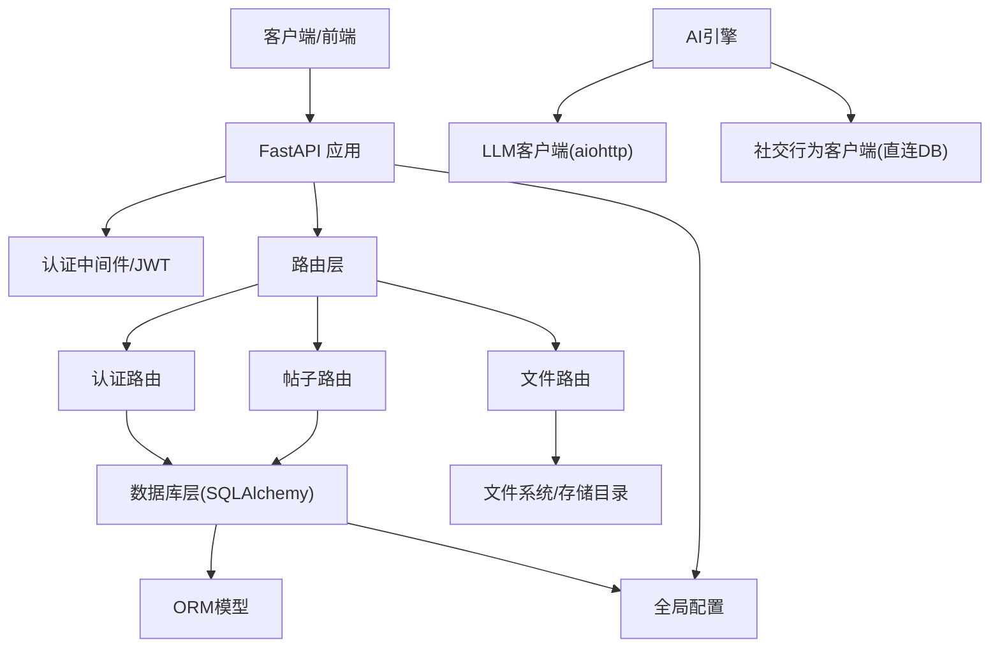

**图表来源**
- [api_server/main.py](file://api_server/main.py#L1-L69)
- [api_server/routers/posts.py](file://api_server/routers/posts.py#L1-L166)
- [api_server/routers/files.py](file://api_server/routers/files.py#L1-L138)
- [api_server/routers/auth.py](file://api_server/routers/auth.py#L1-L78)
- [api_server/auth.py](file://api_server/auth.py#L1-L89)
- [api_server/database.py](file://api_server/database.py#L1-L33)
- [api_server/models.py](file://api_server/models.py#L1-L293)
- [core_engine/ai_integration/llm_client.py](file://core_engine/ai_integration/llm_client.py#L1-L351)
- [core_engine/social/social_client.py](file://core_engine/social/social_client.py#L1-L598)
- [shared/config.py](file://shared/config.py#L1-L52)

## 详细组件分析

### LLM客户端与OpenAI兼容接口
- OpenAI兼容接口：通过HTTP POST调用/chat/completions，支持temperature、max_tokens、top_p与stop参数
- 同步与流式响应：同步返回完整内容，流式接口逐段产出增量内容
- 错误重试：指数退避式重试，支持超时与异常捕获
- JSON解析：支持从LLM响应中提取JSON结构，包含代码块识别与清洗
- 连接管理：复用aiohttp会话，支持连接检查与关闭

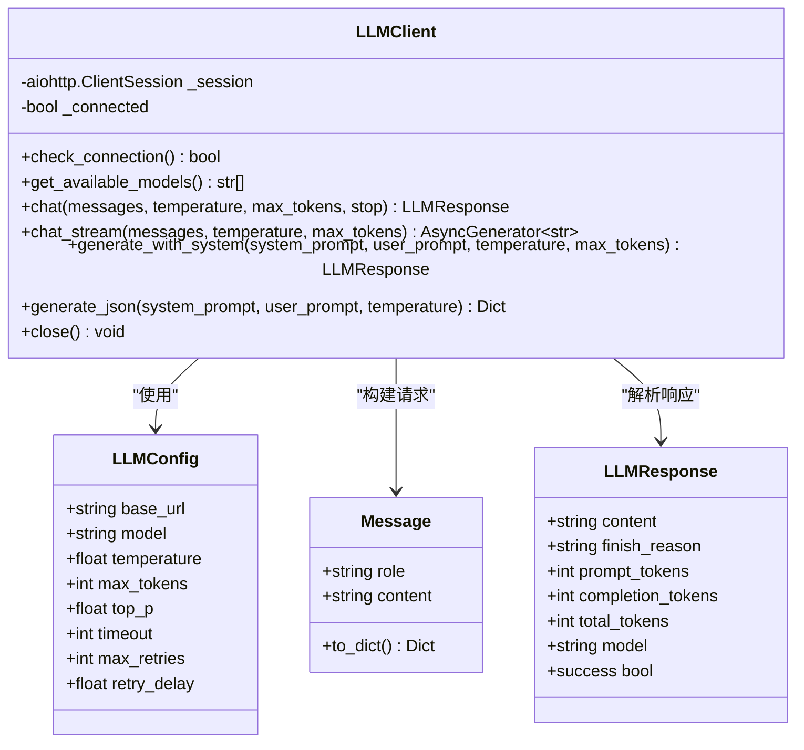

**图表来源**
- [core_engine/ai_integration/llm_client.py](file://core_engine/ai_integration/llm_client.py#L14-L351)

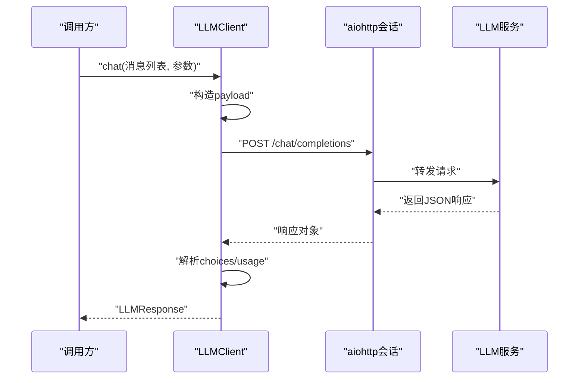

**图表来源**
- [core_engine/ai_integration/llm_client.py](file://core_engine/ai_integration/llm_client.py#L106-L171)

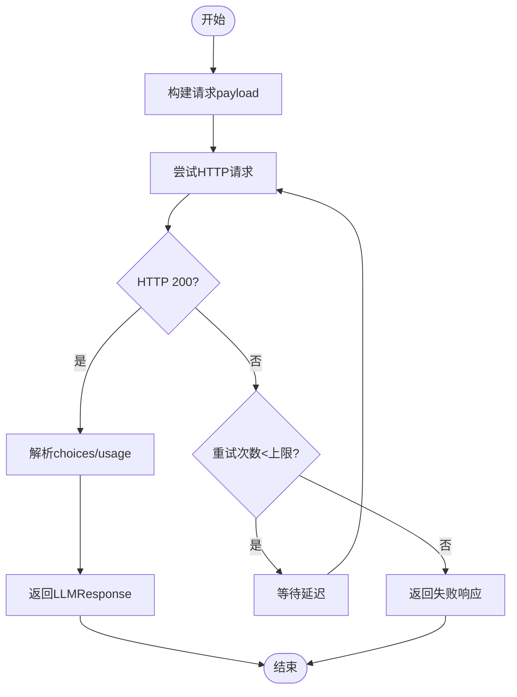

**图表来源**
- [core_engine/ai_integration/llm_client.py](file://core_engine/ai_integration/llm_client.py#L136-L170)

**章节来源**
- [core_engine/ai_integration/llm_client.py](file://core_engine/ai_integration/llm_client.py#L1-L351)

### 外部API调用实现（HTTP客户端、认证、响应处理）
- HTTP客户端配置：使用aiohttp.ClientSession，设置超时与连接复用
- 请求认证：后端通过JWT Bearer认证，OAuth2PasswordBearer自动校验
- 响应处理：统一的Pydantic模型进行数据验证与序列化

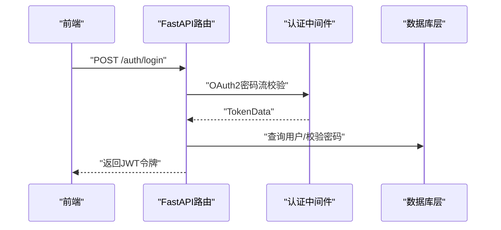

**图表来源**
- [api_server/routers/auth.py](file://api_server/routers/auth.py#L45-L71)
- [api_server/auth.py](file://api_server/auth.py#L58-L89)

**章节来源**
- [api_server/routers/auth.py](file://api_server/routers/auth.py#L1-L78)
- [api_server/auth.py](file://api_server/auth.py#L1-L89)
- [api_server/schemas.py](file://api_server/schemas.py#L1-L166)

### 数据库服务扩展（连接池、事务、数据同步）
- 连接池管理：SQLAlchemy create_engine启用pool_pre_ping与pool_recycle，提升连接稳定性
- 事务处理：通过SessionLocal提供会话，依赖注入get_db确保每个请求独立会话
- 数据同步：模型定义清晰，关系映射完整，支持复杂查询与联结

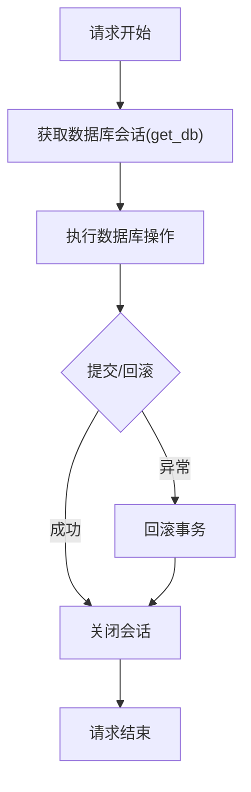

**图表来源**
- [api_server/database.py](file://api_server/database.py#L26-L33)
- [api_server/models.py](file://api_server/models.py#L1-L293)

**章节来源**
- [api_server/database.py](file://api_server/database.py#L1-L33)
- [api_server/models.py](file://api_server/models.py#L1-L293)

### 文件存储集成（上传、访问、清理）
- 上传流程：校验类型与大小，生成唯一文件名，写入存储目录
- 访问控制：返回相对URL路径，静态文件服务提供下载
- 目录结构：images与avatars子目录，便于分类管理

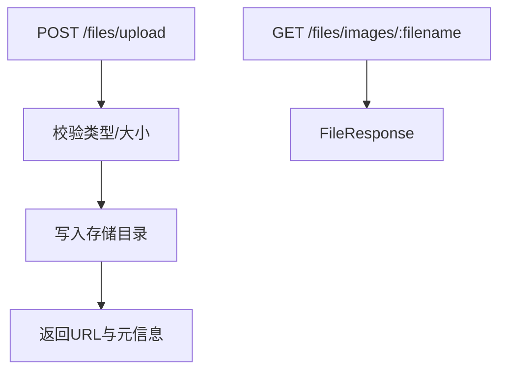

**图表来源**
- [api_server/routers/files.py](file://api_server/routers/files.py#L41-L81)
- [api_server/routers/files.py](file://api_server/routers/files.py#L122-L128)

**章节来源**
- [api_server/routers/files.py](file://api_server/routers/files.py#L1-L138)
- [shared/config.py](file://shared/config.py#L26-L28)

### 身份认证服务集成（JWT）
- 密码哈希：bcrypt加密，verify_password校验
- 令牌签发：create_access_token携带过期时间
- 令牌解码：decode_token解析用户ID
- 当前用户：get_current_user与get_current_user_optional

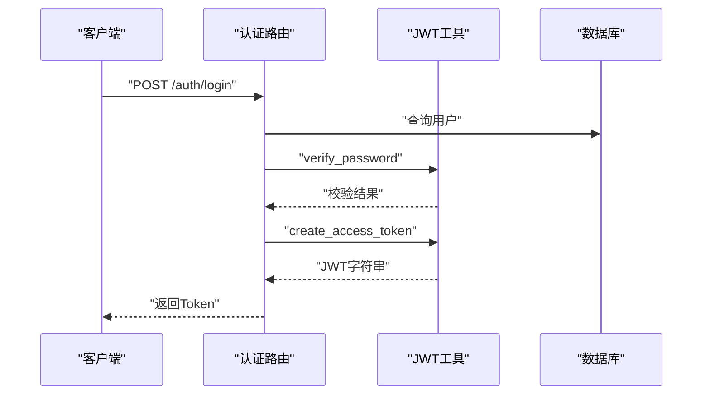

**图表来源**
- [api_server/routers/auth.py](file://api_server/routers/auth.py#L45-L71)
- [api_server/auth.py](file://api_server/auth.py#L24-L43)

**章节来源**
- [api_server/auth.py](file://api_server/auth.py#L1-L89)
- [api_server/routers/auth.py](file://api_server/routers/auth.py#L1-L78)

### 社交行为客户端（直接数据库访问）
- 帖子：获取最新/用户帖子、创建、点赞/取消、评论管理
- 私聊：获取未读消息、聊天历史、发送消息、标记已读
- 用户：获取用户信息、筛选AI角色
- 性能优势：避免HTTP开销，直接使用SQLAlchemy ORM

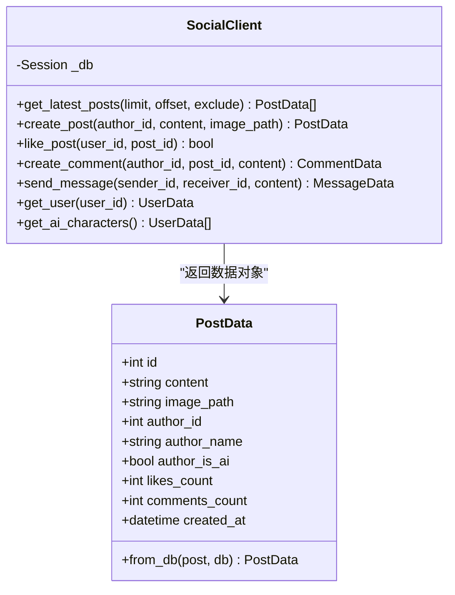

**图表来源**
- [core_engine/social/social_client.py](file://core_engine/social/social_client.py#L36-L598)

**章节来源**
- [core_engine/social/social_client.py](file://core_engine/social/social_client.py#L1-L598)

### 支付服务集成（设计建议）
- 接口设计：定义支付订单模型与状态枚举，提供创建订单、查询状态、回调处理
- 安全性：签名验证、防重放、敏感信息脱敏
- 可靠性：幂等设计、异步回调、失败重试与人工介入
- 监控：埋点统计成功率、耗时分布、异常指标

[本节为概念性指导，不直接分析具体文件]

### 推送通知服务集成（设计建议）
- 通道选择：邮件、短信、站内信、移动推送
- 模板管理：统一模板与变量替换
- 并发控制：队列化发送，限流与熔断
- 回执追踪：送达与打开率统计

[本节为概念性指导，不直接分析具体文件]

### 身份认证服务扩展（设计建议）
- 多因子认证：短信/邮箱验证码
- 第三方登录：OAuth2提供商接入
- 权限体系：RBAC模型，细粒度权限控制
- 审计日志：登录登出、权限变更记录

[本节为概念性指导，不直接分析具体文件]

## 依赖关系分析
- 后端依赖：FastAPI、SQLAlchemy、PyMySQL、Pydantic、python-jose、passlib、aiofiles等
- 前端依赖：Nuxt 3、Vue 3、Pinia、Vant等
- AI依赖：aiohttp、asyncio（用于异步HTTP与调度）

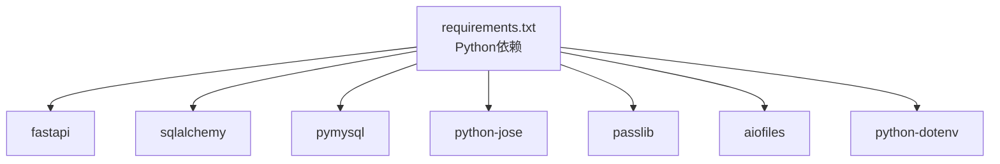

**图表来源**
- [requirements.txt](file://requirements.txt#L1-L32)

**章节来源**
- [requirements.txt](file://requirements.txt#L1-L32)

## 性能考虑
- 连接池与会话：SQLAlchemy连接池与pre_ping减少连接失效导致的错误
- 异步I/O：aiohttp用于LLM与外部服务调用，避免阻塞
- 缓存与预热：配置缓存函数与预热数据库连接
- 查询优化：合理使用联结、索引与分页参数
- 文件存储：异步写入与目录分层，降低磁盘IO压力

[本节提供通用指导，不直接分析具体文件]

## 故障排查指南
- LLM连接失败：确认本地服务端口与模型可用性，使用测试脚本验证
- 数据库连接失败：检查主机、端口、账号与密码，确认数据库存在
- AI角色缺失：确保数据库中存在is_ai=True的用户记录
- 健康检查：访问/health端点确认服务可用

**章节来源**
- [README.md](file://README.md#L269-L286)
- [api_server/main.py](file://api_server/main.py#L55-L58)

## 结论
本项目提供了完善的第三方服务集成基础：统一配置、健壮的数据库层、成熟的认证体系、高性能的LLM与社交行为客户端。在此基础上，可按需扩展支付、推送、文件存储与身份认证等服务，遵循本文的设计建议与最佳实践，确保系统的可扩展性、可靠性与可观测性。

## 附录
- 快速启动与测试：参考README中的快速开始与测试命令
- 模拟器使用：交互模式与步进模式，便于调试与演示

**章节来源**
- [README.md](file://README.md#L44-L156)
- [run_simulation.py](file://run_simulation.py#L54-L186)