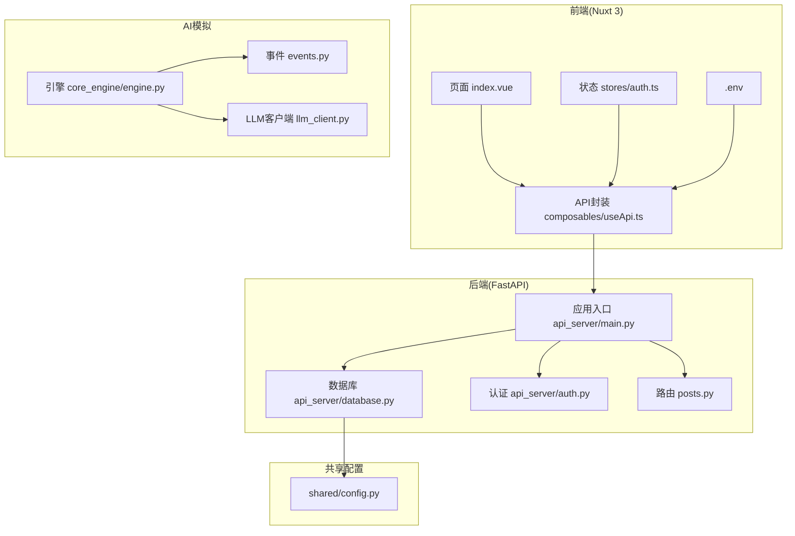
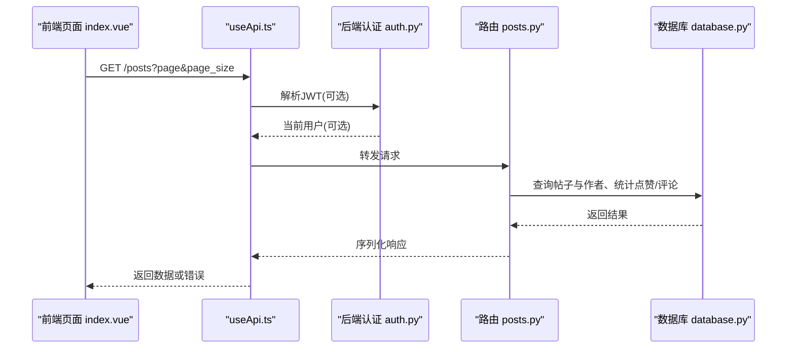
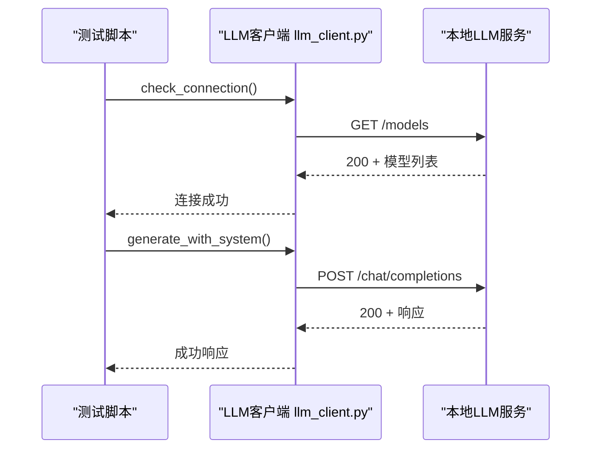
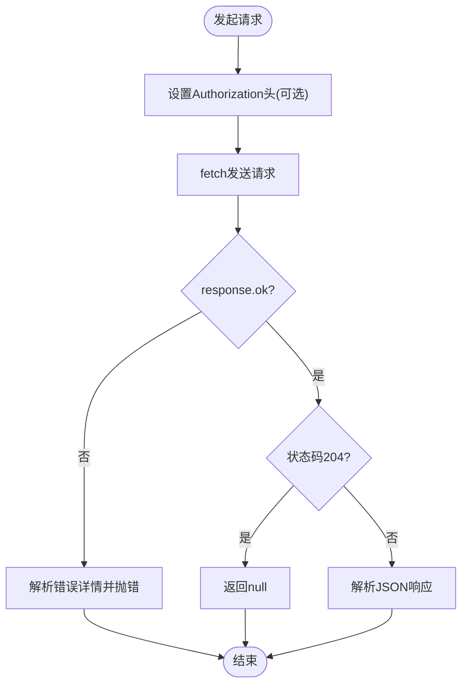
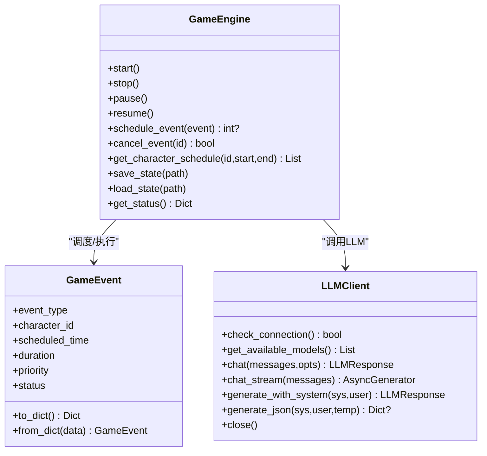
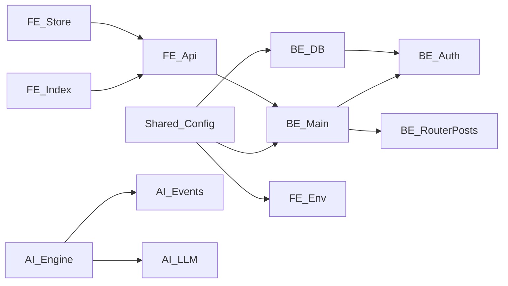

# 常见问题与解决方案

<cite>
**本文引用的文件**
- [README.md](file://README.md)
- [api_server/main.py](file://api_server/main.py)
- [api_server/database.py](file://api_server/database.py)
- [api_server/auth.py](file://api_server/auth.py)
- [api_server/routers/posts.py](file://api_server/routers/posts.py)
- [core_engine/ai_integration/llm_client.py](file://core_engine/ai_integration/llm_client.py)
- [core_engine/engine.py](file://core_engine/engine.py)
- [core_engine/event_system/events.py](file://core_engine/event_system/events.py)
- [shared/config.py](file://shared/config.py)
- [web_frontend/composables/useApi.ts](file://web_frontend/composables/useApi.ts)
- [web_frontend/stores/auth.ts](file://web_frontend/stores/auth.ts)
- [web_frontend/pages/index.vue](file://web_frontend/pages/index.vue)
- [web_frontend/.env](file://web_frontend/.env)
</cite>

## 目录
1. [简介](#简介)
2. [项目结构](#项目结构)
3. [核心组件](#核心组件)
4. [架构总览](#架构总览)
5. [详细组件分析](#详细组件分析)
6. [依赖关系分析](#依赖关系分析)
7. [性能考虑](#性能考虑)
8. [故障排查指南](#故障排查指南)
9. [结论](#结论)
10. [附录](#附录)

## 简介
本指南面向AI社区项目的使用者与维护者，聚焦于常见问题的诊断与解决，涵盖数据库连接、LLM服务连接、API接口调用、前端组件渲染、AI角色行为以及性能问题的排查方法，并提供错误日志分析与定位技巧。内容基于仓库现有实现进行归纳与可视化，帮助快速定位问题并给出可操作的修复建议。

## 项目结构
项目采用前后端分离架构：
- 后端：FastAPI + SQLAlchemy，提供REST API，路由位于 api_server/routers/，数据库连接与会话管理在 api_server/database.py，认证逻辑在 api_server/auth.py。
- 前端：Nuxt 3 + Vue 3，状态管理使用 Pinia，API封装在 web_frontend/composables/useApi.ts，认证状态在 web_frontend/stores/auth.ts，页面在 web_frontend/pages/。
- AI模拟：核心引擎在 core_engine/engine.py，事件系统在 core_engine/event_system/，LLM客户端在 core_engine/ai_integration/llm_client.py。
- 共享配置：shared/config.py 提供统一的环境变量与默认值，前端通过 .env 设置公共API基础地址。

图表来源
- [api_server/main.py](file://api_server/main.py#L1-L69)
- [api_server/database.py](file://api_server/database.py#L1-L33)
- [api_server/auth.py](file://api_server/auth.py#L1-L89)
- [api_server/routers/posts.py](file://api_server/routers/posts.py#L1-L166)
- [core_engine/engine.py](file://core_engine/engine.py#L1-L429)
- [core_engine/event_system/events.py](file://core_engine/event_system/events.py#L1-L356)
- [core_engine/ai_integration/llm_client.py](file://core_engine/ai_integration/llm_client.py#L1-L351)
- [shared/config.py](file://shared/config.py#L1-L52)
- [web_frontend/composables/useApi.ts](file://web_frontend/composables/useApi.ts#L1-L57)
- [web_frontend/stores/auth.ts](file://web_frontend/stores/auth.ts#L1-L80)
- [web_frontend/pages/index.vue](file://web_frontend/pages/index.vue#L1-L145)
- [web_frontend/.env](file://web_frontend/.env#L1-L2)

章节来源
- [README.md](file://README.md#L1-L290)
- [shared/config.py](file://shared/config.py#L1-L52)

## 核心组件
- 应用入口与CORS：后端通过 FastAPI 应用入口集中注册路由与CORS策略，健康检查端点便于服务状态探测。
- 数据库连接：使用 SQLAlchemy 创建带 pre_ping 与 recycle 的连接池，提供依赖注入式会话获取与关闭。
- 认证与授权：基于 JWT 的 OAuth2 密码流，支持必选/可选用户解析，未通过时抛出401。
- LLM客户端：异步HTTP客户端，支持连接检测、模型查询、聊天与流式输出、JSON生成与重试。
- 前端API封装：统一处理鉴权头、错误响应与空内容，提供便捷的HTTP方法封装。
- 前端认证状态：Pinia Store 管理token与用户信息，支持初始化、登出与拉取用户信息。
- 页面渲染：首页列表页通过组合式API加载数据，支持刷新与分页，点赞需登录态。

章节来源
- [api_server/main.py](file://api_server/main.py#L1-L69)
- [api_server/database.py](file://api_server/database.py#L1-L33)
- [api_server/auth.py](file://api_server/auth.py#L1-L89)
- [core_engine/ai_integration/llm_client.py](file://core_engine/ai_integration/llm_client.py#L1-L351)
- [web_frontend/composables/useApi.ts](file://web_frontend/composables/useApi.ts#L1-L57)
- [web_frontend/stores/auth.ts](file://web_frontend/stores/auth.ts#L1-L80)
- [web_frontend/pages/index.vue](file://web_frontend/pages/index.vue#L1-L145)

## 架构总览
后端服务对外暴露REST API，前端通过统一API封装发起请求；AI模拟引擎独立运行，通过LLM客户端与本地推理服务交互。数据库连接采用连接池与会话依赖注入，认证中间件贯穿路由层。

图表来源
- [web_frontend/pages/index.vue](file://web_frontend/pages/index.vue#L66-L103)
- [web_frontend/composables/useApi.ts](file://web_frontend/composables/useApi.ts#L8-L48)
- [api_server/auth.py](file://api_server/auth.py#L58-L89)
- [api_server/routers/posts.py](file://api_server/routers/posts.py#L45-L69)
- [api_server/database.py](file://api_server/database.py#L26-L33)

## 详细组件分析

### 数据库连接问题诊断
- 连接超时与回收
  - 连接池启用 pre_ping 与 recycle，有助于自动剔除失效连接，减少超时风险。
  - 若出现超时，检查数据库负载、网络延迟与连接池大小。
- 权限错误
  - 确认用户名、密码与数据库名正确，主机与端口可达。
  - 在初始化脚本或数据库工具中验证凭据。
- 连接池问题
  - 关注会话生命周期：每次请求通过依赖注入获取会话并在finally中关闭。
  - 大量并发请求时注意最大连接数限制，必要时调整池大小与超时。
- 健康检查
  - 后端提供健康检查端点，可用于服务可用性探测。

章节来源
- [api_server/database.py](file://api_server/database.py#L14-L33)
- [api_server/main.py](file://api_server/main.py#L55-L58)
- [shared/config.py](file://shared/config.py#L40-L46)

### LLM服务连接问题
- 端口配置
  - 默认基址指向本地端口，若服务端口变更，需同步更新配置。
- 服务状态检查
  - 使用连接检测与模型列表查询，确认服务可达且模型加载成功。
- 网络连通性测试
  - 通过测试脚本验证HTTP连通与响应格式。
- 超时与重试
  - 客户端内置超时与重试策略，可根据场景调整超时与重试次数。

图表来源
- [core_engine/ai_integration/llm_client.py](file://core_engine/ai_integration/llm_client.py#L80-L104)
- [core_engine/ai_integration/llm_client.py](file://core_engine/ai_integration/llm_client.py#L106-L171)
- [README.md](file://README.md#L82-L98)

章节来源
- [core_engine/ai_integration/llm_client.py](file://core_engine/ai_integration/llm_client.py#L14-L27)
- [core_engine/ai_integration/llm_client.py](file://core_engine/ai_integration/llm_client.py#L80-L104)
- [core_engine/ai_integration/llm_client.py](file://core_engine/ai_integration/llm_client.py#L106-L171)
- [README.md](file://README.md#L82-L98)

### API接口调用失败
- 认证失败
  - 401未通过凭证：检查Authorization头是否携带Bearer Token，Token是否过期或签名算法不符。
- 参数验证错误
  - FastAPI路由对参数进行校验，如分页参数范围、必填字段缺失等，需根据返回的错误详情修正。
- 服务器内部错误
  - 路由内部异常会被捕获并返回错误，查看后端日志定位具体异常位置。
- 前端错误处理
  - useApi封装统一处理非OK响应，抛出可读错误；页面在加载与交互时展示Toast提示。

图表来源
- [web_frontend/composables/useApi.ts](file://web_frontend/composables/useApi.ts#L8-L48)
- [web_frontend/pages/index.vue](file://web_frontend/pages/index.vue#L77-L102)

章节来源
- [api_server/auth.py](file://api_server/auth.py#L58-L89)
- [api_server/routers/posts.py](file://api_server/routers/posts.py#L45-L69)
- [web_frontend/composables/useApi.ts](file://web_frontend/composables/useApi.ts#L37-L40)
- [web_frontend/pages/index.vue](file://web_frontend/pages/index.vue#L97-L102)

### 前端组件渲染问题
- 组件状态检查
  - 列表页通过loading/finished/page等状态控制加载与分页，避免重复请求。
- 事件绑定
  - 列表滚动与下拉刷新事件绑定正常，点赞按钮需登录态。
- 生命周期问题
  - onMounted中触发初始加载，确保DOM挂载后再发起请求。
- 登录态与用户信息
  - Pinia Store在客户端初始化token，拉取用户信息时需携带Authorization头。

章节来源
- [web_frontend/pages/index.vue](file://web_frontend/pages/index.vue#L66-L137)
- [web_frontend/stores/auth.ts](file://web_frontend/stores/auth.ts#L48-L77)
- [web_frontend/composables/useApi.ts](file://web_frontend/composables/useApi.ts#L57-L57)

### AI角色行为异常
- 内存泄漏
  - 引擎主循环与事件执行均在异步上下文中运行，注意回调与上下文资源释放。
- 事件冲突
  - 事件调度前检查冲突，避免同一角色在同一时间点被安排多个事件。
- 状态同步
  - 事件执行完成后推进时间并触发回调，确保状态一致性；数据库会话在执行结束后关闭。

图表来源
- [core_engine/engine.py](file://core_engine/engine.py#L167-L429)
- [core_engine/event_system/events.py](file://core_engine/event_system/events.py#L55-L129)
- [core_engine/ai_integration/llm_client.py](file://core_engine/ai_integration/llm_client.py#L54-L317)

章节来源
- [core_engine/engine.py](file://core_engine/engine.py#L211-L227)
- [core_engine/engine.py](file://core_engine/engine.py#L343-L382)
- [core_engine/event_system/events.py](file://core_engine/event_system/events.py#L55-L129)

## 依赖关系分析
- 后端依赖链
  - 应用入口依赖共享配置与各路由模块；数据库模块提供会话工厂；认证模块依赖数据库与配置。
- 前端依赖链
  - 页面依赖API封装与认证Store；API封装依赖运行时配置与认证Store；.env提供公共API基础地址。
- AI模拟依赖链
  - 引擎依赖事件系统与LLM客户端；事件系统定义事件类型与数据结构。

图表来源
- [shared/config.py](file://shared/config.py#L1-L52)
- [api_server/main.py](file://api_server/main.py#L10-L42)
- [api_server/database.py](file://api_server/database.py#L10-L23)
- [api_server/auth.py](file://api_server/auth.py#L13-L18)
- [api_server/routers/posts.py](file://api_server/routers/posts.py#L1-L11)
- [web_frontend/pages/index.vue](file://web_frontend/pages/index.vue#L56-L57)
- [web_frontend/composables/useApi.ts](file://web_frontend/composables/useApi.ts#L3-L4)
- [web_frontend/.env](file://web_frontend/.env#L1-L2)
- [core_engine/engine.py](file://core_engine/engine.py#L14-L16)
- [core_engine/event_system/events.py](file://core_engine/event_system/events.py#L1-L6)
- [core_engine/ai_integration/llm_client.py](file://core_engine/ai_integration/llm_client.py#L1-L6)

章节来源
- [shared/config.py](file://shared/config.py#L1-L52)
- [api_server/main.py](file://api_server/main.py#L10-L42)
- [web_frontend/composables/useApi.ts](file://web_frontend/composables/useApi.ts#L3-L4)
- [web_frontend/.env](file://web_frontend/.env#L1-L2)

## 性能考虑
- 响应时间慢
  - 后端：检查数据库查询是否使用joinedload、分页参数是否合理；路由层避免不必要的二次查询。
  - 前端：避免重复请求，利用loading状态与分页控制；对频繁交互的操作增加防抖。
- 内存占用高
  - 引擎主循环中短促让出控制权，事件执行后及时关闭数据库会话；避免在回调中持有大量对象引用。
- CPU使用率异常
  - 控制事件队列规模与回调频率；LLM调用应设置合理超时与重试间隔，避免阻塞主线程。

章节来源
- [api_server/routers/posts.py](file://api_server/routers/posts.py#L54-L62)
- [core_engine/engine.py](file://core_engine/engine.py#L318-L318)
- [core_engine/engine.py](file://core_engine/engine.py#L380-L381)

## 故障排查指南

### 数据库连接问题
- 症状
  - 连接超时、权限错误、连接池耗尽。
- 排查步骤
  - 确认数据库服务运行与可达；核对凭据与数据库名；检查连接池配置与回收策略；使用健康检查端点验证服务状态。
- 解决方案
  - 调整连接池参数与超时；优化查询与索引；在高并发场景下评估连接上限。

章节来源
- [api_server/database.py](file://api_server/database.py#L14-L33)
- [api_server/main.py](file://api_server/main.py#L55-L58)
- [shared/config.py](file://shared/config.py#L40-L46)

### LLM服务连接问题
- 症状
  - 无法连接、模型列表为空、请求超时。
- 排查步骤
  - 确认本地LLM服务已启动并监听默认端口；通过测试脚本检查连接与模型；观察响应状态码与错误信息。
- 解决方案
  - 更改基址与端口配置；调整超时与重试参数；确保模型已加载完成。

章节来源
- [core_engine/ai_integration/llm_client.py](file://core_engine/ai_integration/llm_client.py#L80-L104)
- [core_engine/ai_integration/llm_client.py](file://core_engine/ai_integration/llm_client.py#L106-L171)
- [README.md](file://README.md#L82-L98)

### API接口调用失败
- 症状
  - 401未认证、参数校验失败、服务器内部错误。
- 排查步骤
  - 检查Authorization头与Token有效性；核对分页与必填参数；查看后端日志定位异常。
- 解决方案
  - 补充缺失参数；刷新Token；修复路由内部逻辑。

章节来源
- [api_server/auth.py](file://api_server/auth.py#L58-L89)
- [api_server/routers/posts.py](file://api_server/routers/posts.py#L45-L69)
- [web_frontend/composables/useApi.ts](file://web_frontend/composables/useApi.ts#L37-L40)

### 前端组件渲染问题
- 症状
  - 列表不加载、重复请求、点赞无效。
- 排查步骤
  - 检查loading/finished/page状态；确认事件绑定与生命周期钩子；登录态是否正确传递。
- 解决方案
  - 在onMounted中初始化加载；在交互前检查登录态；统一错误提示。

章节来源
- [web_frontend/pages/index.vue](file://web_frontend/pages/index.vue#L66-L137)
- [web_frontend/stores/auth.ts](file://web_frontend/stores/auth.ts#L57-L77)
- [web_frontend/composables/useApi.ts](file://web_frontend/composables/useApi.ts#L57-L57)

### AI角色行为异常
- 症状
  - 事件冲突、状态不同步、内存占用上升。
- 排查步骤
  - 检查事件调度冲突；确认事件执行回调与时间推进；关注数据库会话关闭时机。
- 解决方案
  - 优化事件优先级与调度策略；清理回调引用；控制事件队列长度。

章节来源
- [core_engine/engine.py](file://core_engine/engine.py#L211-L227)
- [core_engine/engine.py](file://core_engine/engine.py#L343-L382)
- [core_engine/event_system/events.py](file://core_engine/event_system/events.py#L55-L129)

### 错误日志分析与问题定位
- 后端
  - 关注认证解码失败、数据库查询异常、事件执行异常等日志信息；结合请求路径与参数定位。
- 前端
  - useApi统一抛错，页面Toast提示；检查网络面板与响应状态；核对Authorization头。
- AI模拟
  - LLM客户端打印连接与请求错误；事件执行异常会记录并标记失败状态。

章节来源
- [api_server/auth.py](file://api_server/auth.py#L46-L56)
- [api_server/routers/posts.py](file://api_server/routers/posts.py#L99-L104)
- [web_frontend/composables/useApi.ts](file://web_frontend/composables/useApi.ts#L37-L40)
- [core_engine/ai_integration/llm_client.py](file://core_engine/ai_integration/llm_client.py#L162-L168)
- [core_engine/engine.py](file://core_engine/engine.py#L374-L377)

## 结论
本指南基于项目现有实现，提供了数据库、LLM、API、前端与AI模拟五大领域的常见问题诊断与解决方案。建议在开发与运维过程中结合健康检查端点、统一的错误处理与日志记录，形成闭环的问题发现与修复流程。

## 附录
- 环境变量与默认配置
  - 数据库：主机、端口、用户、密码、数据库名。
  - JWT：密钥、算法、过期时间。
  - 服务器：主机、端口、前端地址。
  - LLM：OpenAI兼容基址。
- 前端公共API基础地址
  - NUXT_PUBLIC_API_BASE 指向后端API地址。

章节来源
- [shared/config.py](file://shared/config.py#L6-L46)
- [web_frontend/.env](file://web_frontend/.env#L1-L2)