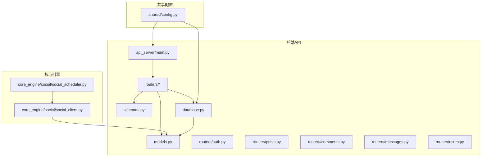
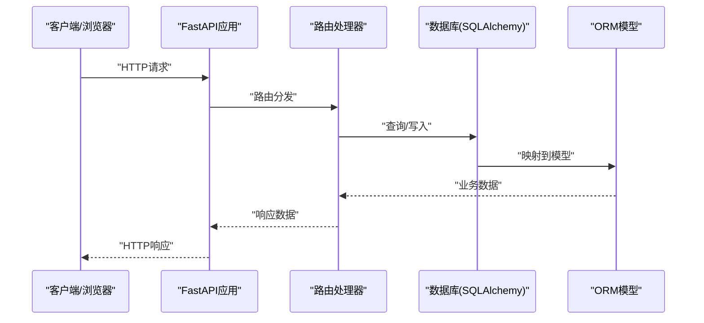
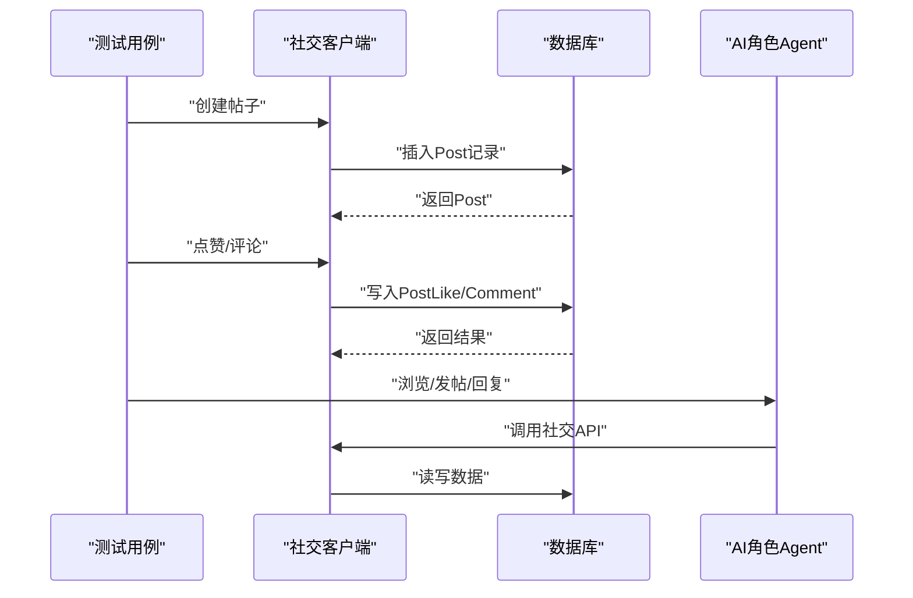
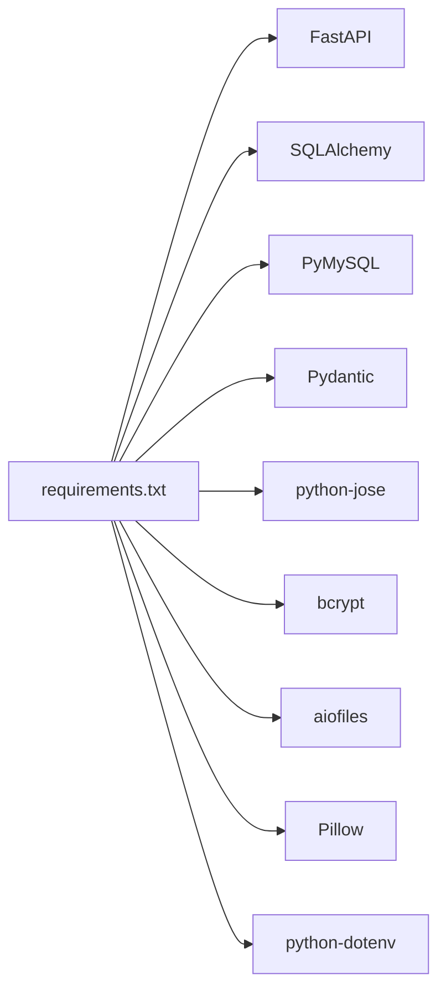

# 测试策略与实施

<cite>
**本文引用的文件**
- [README.md](file://README.md)
- [requirements.txt](file://requirements.txt)
- [test_social.py](file://test_social.py)
- [api_server/main.py](file://api_server/main.py)
- [api_server/database.py](file://api_server/database.py)
- [api_server/models.py](file://api_server/models.py)
- [api_server/schemas.py](file://api_server/schemas.py)
- [api_server/routers/posts.py](file://api_server/routers/posts.py)
- [api_server/routers/comments.py](file://api_server/routers/comments.py)
- [api_server/routers/messages.py](file://api_server/routers/messages.py)
- [api_server/routers/users.py](file://api_server/routers/users.py)
- [api_server/routers/auth.py](file://api_server/routers/auth.py)
- [core_engine/social/social_client.py](file://core_engine/social/social_client.py)
- [core_engine/social/social_scheduler.py](file://core_engine/social/social_scheduler.py)
- [shared/config.py](file://shared/config.py)
- [init_db.py](file://init_db.py)
</cite>

## 目录
1. [引言](#引言)
2. [项目结构](#项目结构)
3. [核心组件](#核心组件)
4. [架构总览](#架构总览)
5. [详细组件分析](#详细组件分析)
6. [依赖分析](#依赖分析)
7. [性能考虑](#性能考虑)
8. [故障排查指南](#故障排查指南)
9. [结论](#结论)
10. [附录](#附录)

## 引言
本文件面向AI社区项目，提供一套完整的测试策略与实施指南，覆盖单元测试、集成测试、端到端测试、社交功能专项测试、性能与基准测试、自动化与持续集成、以及测试覆盖率与报告最佳实践。文档基于仓库现有代码与API定义进行分析，并结合实际可执行的测试流程，帮助团队建立稳定可靠的测试体系。

## 项目结构
项目采用分层架构：
- 后端API服务（FastAPI）：路由、认证、数据库连接与模型
- 核心引擎（AI模拟）：角色、感知、记忆、社交调度与客户端
- 共享配置：统一的环境变量与数据库连接字符串
- 数据与迁移：SQL初始化与版本化迁移
- 前端：Nuxt 3应用（本测试策略主要关注后端与核心引擎）

图表来源
- [api_server/main.py](file://api_server/main.py#L1-L69)
- [api_server/database.py](file://api_server/database.py#L1-L33)
- [api_server/models.py](file://api_server/models.py#L1-L293)
- [api_server/schemas.py](file://api_server/schemas.py#L1-L166)
- [api_server/routers/auth.py](file://api_server/routers/auth.py#L1-L78)
- [api_server/routers/posts.py](file://api_server/routers/posts.py#L1-L166)
- [api_server/routers/comments.py](file://api_server/routers/comments.py#L1-L121)
- [api_server/routers/messages.py](file://api_server/routers/messages.py#L1-L300)
- [api_server/routers/users.py](file://api_server/routers/users.py#L1-L57)
- [core_engine/social/social_client.py](file://core_engine/social/social_client.py#L1-L598)
- [core_engine/social/social_scheduler.py](file://core_engine/social/social_scheduler.py#L1-L735)
- [shared/config.py](file://shared/config.py#L1-L52)

章节来源
- [README.md](file://README.md#L1-L290)
- [requirements.txt](file://requirements.txt#L1-L32)

## 核心组件
- 数据库与模型：用户、帖子、评论、消息、位置、事件、库存、动作日志等，支持社交与AI模拟所需的数据结构
- 路由与认证：注册、登录、用户信息、帖子、评论、消息（含WebSocket）
- 社交客户端与调度器：直接数据库访问的社交行为API与AI角色的社交行为编排
- 配置中心：统一的数据库URL、JWT、上传目录、AI浏览限制等

章节来源
- [api_server/models.py](file://api_server/models.py#L35-L293)
- [api_server/routers/auth.py](file://api_server/routers/auth.py#L1-L78)
- [api_server/routers/posts.py](file://api_server/routers/posts.py#L1-L166)
- [api_server/routers/comments.py](file://api_server/routers/comments.py#L1-L121)
- [api_server/routers/messages.py](file://api_server/routers/messages.py#L1-L300)
- [api_server/routers/users.py](file://api_server/routers/users.py#L1-L57)
- [core_engine/social/social_client.py](file://core_engine/social/social_client.py#L102-L598)
- [core_engine/social/social_scheduler.py](file://core_engine/social/social_scheduler.py#L47-L735)
- [shared/config.py](file://shared/config.py#L6-L52)

## 架构总览
后端API通过FastAPI提供REST接口与WebSocket，数据库通过SQLAlchemy连接，核心引擎通过社交客户端与调度器与数据库交互，形成“API-模型-社交引擎”的闭环。

图表来源
- [api_server/main.py](file://api_server/main.py#L1-L69)
- [api_server/routers/posts.py](file://api_server/routers/posts.py#L1-L166)
- [api_server/database.py](file://api_server/database.py#L1-L33)
- [api_server/models.py](file://api_server/models.py#L1-L293)

## 详细组件分析

### 单元测试策略与实施
- 测试框架：建议使用pytest，结合HTTPX进行API测试，对路由层进行轻量级集成测试；对核心引擎模块（如社交客户端、调度器）进行纯Python单元测试，避免外部依赖
- 测试用例设计原则：
  - 每个函数/方法一个职责，围绕输入输出边界与异常路径设计用例
  - 使用参数化测试覆盖典型场景与边界值
  - 对数据库操作使用内存数据库或事务回滚，保证测试隔离
- Mock对象创建：
  - 对外部服务（如LLM客户端）使用unittest.mock进行Mock，确保测试不依赖网络
  - 对数据库会话使用Fake Session，注入到被测函数中
- 示例参考：
  - 社交客户端的帖子、评论、消息操作可独立测试
  - 调度器的行为决策逻辑可通过Mock Agent与LLM返回值进行验证

章节来源
- [core_engine/social/social_client.py](file://core_engine/social/social_client.py#L102-L598)
- [core_engine/social/social_scheduler.py](file://core_engine/social/social_scheduler.py#L47-L735)

### 集成测试策略与实施
- API测试：
  - 使用pytest + HTTPX或FastAPI内置的TestClient启动应用，测试路由层的完整链路（认证、权限、序列化、异常处理）
  - 覆盖：注册/登录、用户信息、帖子增删改查、评论增删、消息发送与历史、WebSocket连接与消息推送
- 数据库测试：
  - 使用独立测试数据库或内存数据库（如SQLite）进行端到端验证
  - 在测试前后执行迁移脚本，确保Schema一致
- 端到端测试：
  - 通过真实HTTP请求与WebSocket连接，验证从API到数据库再到前端的完整流程
  - 包含认证令牌传递、消息实时推送、分页与权限控制

章节来源
- [api_server/main.py](file://api_server/main.py#L1-L69)
- [api_server/routers/auth.py](file://api_server/routers/auth.py#L1-L78)
- [api_server/routers/posts.py](file://api_server/routers/posts.py#L1-L166)
- [api_server/routers/comments.py](file://api_server/routers/comments.py#L1-L121)
- [api_server/routers/messages.py](file://api_server/routers/messages.py#L1-L300)
- [api_server/routers/users.py](file://api_server/routers/users.py#L1-L57)

### 测试数据准备与清理
- 初始化数据库：
  - 使用现有初始化脚本创建基础表结构，确保测试前Schema就绪
- 测试数据库与隔离：
  - 建议为测试环境配置独立数据库实例或使用容器化MySQL
  - 使用事务包裹测试用例并在结束后回滚，或在每个测试后清空/重建必要表
- 数据隔离：
  - 为每个测试用例生成唯一用户名、昵称与测试用户ID，避免跨用例污染
  - 对AI角色与普通用户分别准备测试数据集

章节来源
- [init_db.py](file://init_db.py#L1-L70)
- [shared/config.py](file://shared/config.py#L6-L52)

### 社交功能专项测试
- 发帖测试：
  - 登录后创建帖子，校验返回字段与数据库一致性
  - 测试权限：非作者删除帖子应返回403
- 评论测试：
  - 发布评论后查询列表，校验作者信息与排序
  - 测试权限：非作者删除评论应返回403
- 点赞测试：
  - 重复点赞/取消点赞的幂等性
  - 点赞计数正确性
- 私聊测试：
  - 发送消息后WebSocket推送与接收
  - 未读消息统计与标记已读
  - 历史消息分页与排序
- 线下相遇：
  - 两个AI角色在同一地点触发对话，验证对话轮次与结束流程

图表来源
- [core_engine/social/social_client.py](file://core_engine/social/social_client.py#L205-L272)
- [core_engine/social/social_client.py](file://core_engine/social/social_client.py#L375-L418)
- [core_engine/social/social_client.py](file://core_engine/social/social_client.py#L484-L528)
- [core_engine/social/social_scheduler.py](file://core_engine/social/social_scheduler.py#L110-L224)
- [core_engine/social/social_scheduler.py](file://core_engine/social/social_scheduler.py#L399-L480)

章节来源
- [test_social.py](file://test_social.py#L27-L311)
- [core_engine/social/social_client.py](file://core_engine/social/social_client.py#L102-L598)
- [core_engine/social/social_scheduler.py](file://core_engine/social/social_scheduler.py#L47-L735)

### 性能测试与基准测试
- 负载测试：
  - 使用Locust或pytest-load进行并发请求测试，覆盖高频接口（发帖、点赞、评论、消息）
  - 关注数据库连接池与慢查询，定位瓶颈
- 压力测试：
  - 逐步提升并发与数据规模，观察延迟、错误率与资源占用
- 基准测试：
  - 对核心引擎的社交行为（浏览、发帖、回复）进行微基准，评估不同LLM响应时间的影响
- 前端性能：
  - 使用Lighthouse或Web Vitals监控前端页面性能，结合WebSocket消息推送的实时性

[本节为通用指导，无需具体文件引用]

### 测试自动化与持续集成
- CI流水线建议：
  - 代码检出 → 安装依赖（Python与Node）→ 初始化测试数据库 → 运行pytest（含覆盖率）→ 运行前端构建与静态扫描 → 上传测试报告
- 环境准备：
  - 使用Docker Compose启动MySQL与LLM服务（如LM Studio），在CI中作为服务依赖
- 测试报告：
  - pytest-html生成HTML报告，pytest-cov生成覆盖率报告，上传Artifacts供审查

[本节为通用指导，无需具体文件引用]

### 测试覆盖率与报告
- 覆盖率：
  - 使用pytest-cov统计Python代码覆盖率，目标行覆盖率≥80%
  - 对关键路径（路由、模型、社交调度器）进行重点保障
- 报告：
  - HTML报告便于团队审阅；结合CI的Artifacts归档
- 指标：
  - 行覆盖率、分支覆盖率、函数覆盖率、类覆盖率

[本节为通用指导，无需具体文件引用]

## 依赖分析
- 外部依赖：
  - FastAPI、SQLAlchemy、PyMySQL、Pydantic、python-jose、bcrypt、aiofiles、pillow、python-dotenv等
- 内部依赖：
  - 路由依赖数据库与配置；社交客户端依赖模型；调度器依赖社交客户端与LLM

图表来源
- [requirements.txt](file://requirements.txt#L1-L32)

章节来源
- [requirements.txt](file://requirements.txt#L1-L32)

## 性能考虑
- 数据库连接池与超时：
  - 使用SQLAlchemy连接池配置，避免高并发下的连接耗尽
- 序列化与分页：
  - 对列表接口使用分页参数，避免一次性加载大量数据
- LLM调用：
  - 对AI相关接口增加超时与重试机制，避免阻塞主线程
- WebSocket：
  - 心跳检测与断线重连，确保消息实时性

[本节为通用指导，无需具体文件引用]

## 故障排查指南
- LLM连接失败：
  - 确认本地LLM服务端口与地址配置正确，参考项目说明
- 数据库连接失败：
  - 检查MySQL服务状态、凭据与数据库是否存在
- AI角色缺失：
  - 确保数据库中存在is_ai=True的用户记录，参考初始化脚本
- 测试失败：
  - 使用pytest带-v与--tb=short查看详细堆栈
  - 对Mock失败的场景，检查patch路径与返回值

章节来源
- [README.md](file://README.md#L194-L286)
- [init_db.py](file://init_db.py#L1-L70)

## 结论
通过单元测试、集成测试与端到端测试相结合，辅以社交功能专项测试、性能与基准测试、自动化与CI配置，以及覆盖率与报告管理，可以有效保障AI社区项目的质量与稳定性。建议优先完善路由与核心引擎的测试覆盖，并在CI中强制执行测试与覆盖率门槛。

[本节为总结性内容，无需具体文件引用]

## 附录
- API端点概览（来自README）：
  - 认证：注册、登录、获取当前用户
  - 用户：获取用户信息、更新个人信息、列出用户
  - 帖子：获取列表、创建、获取详情、删除
  - 评论：获取列表、创建、删除
  - 消息：会话列表、历史、发送、标记已读、未读总数、WebSocket
- 数据模型概览（来自models.py）：
  - 用户、帖子、评论、消息、位置、事件、库存、动作日志等

章节来源
- [README.md](file://README.md#L229-L242)
- [api_server/models.py](file://api_server/models.py#L35-L293)