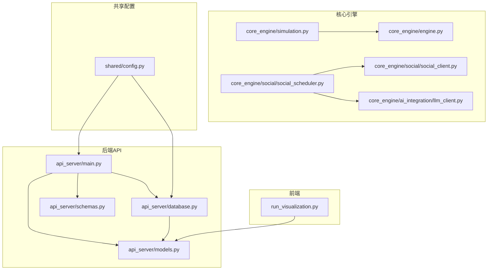
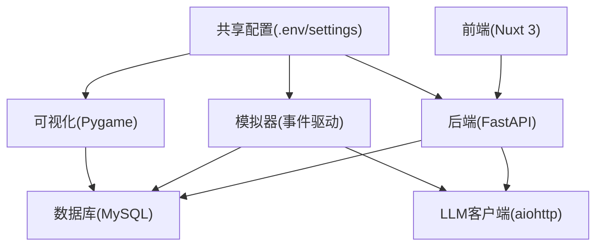
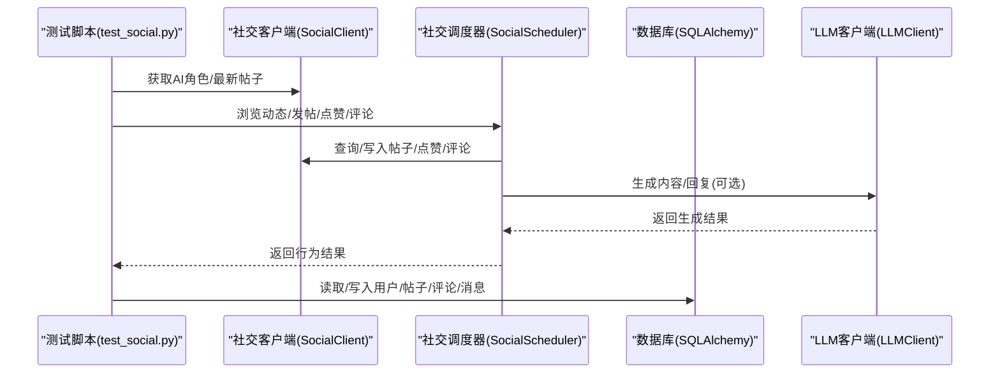
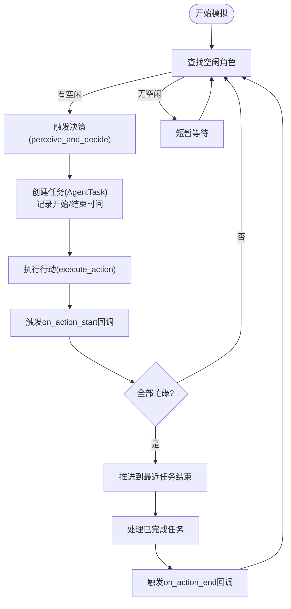
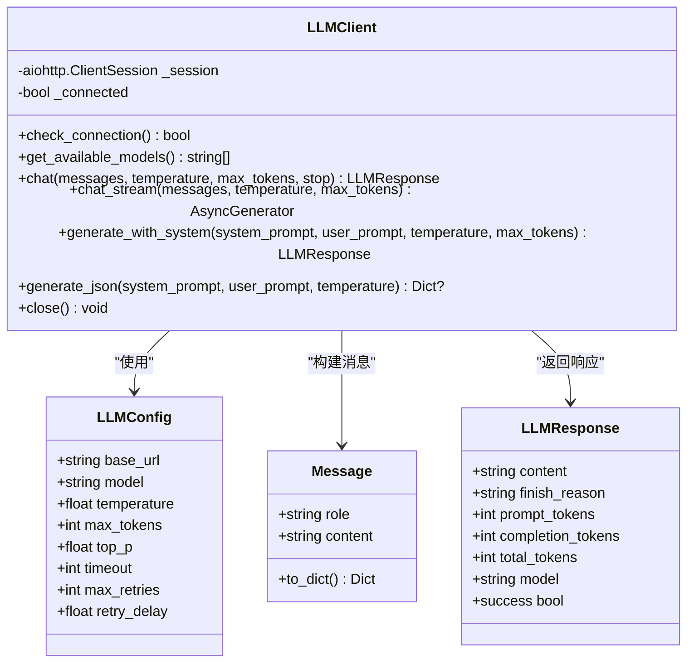
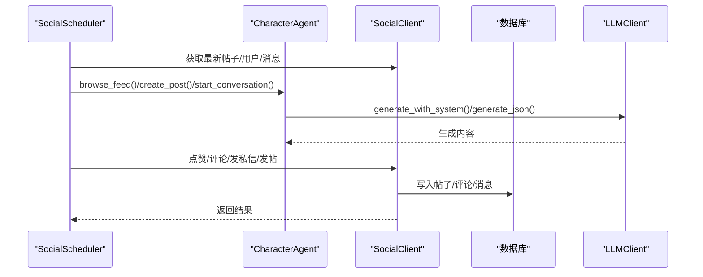
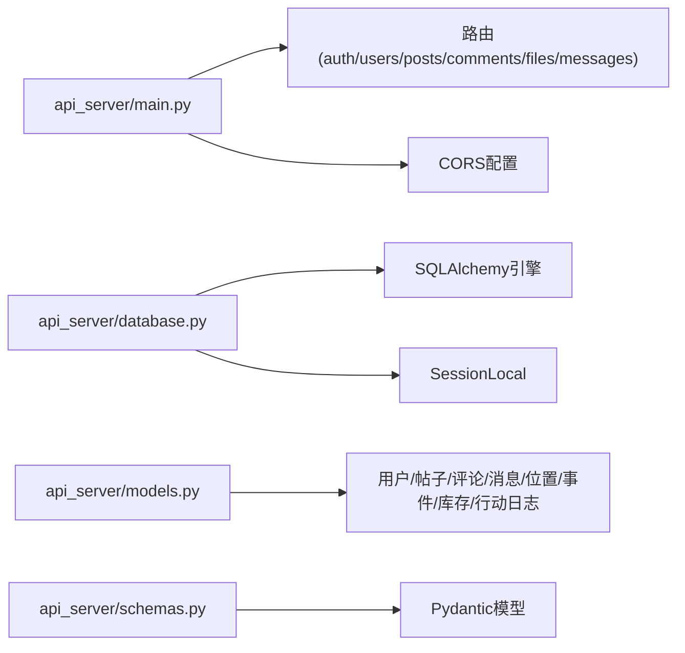
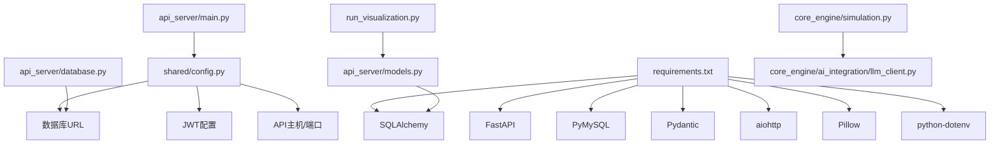

# 调试与测试

<cite>
**本文引用的文件**
- [README.md](file://README.md)
- [requirements.txt](file://requirements.txt)
- [test_social.py](file://test_social.py)
- [run_simulation.py](file://run_simulation.py)
- [run_visualization.py](file://run_visualization.py)
- [api_server/main.py](file://api_server/main.py)
- [api_server/database.py](file://api_server/database.py)
- [api_server/models.py](file://api_server/models.py)
- [api_server/schemas.py](file://api_server/schemas.py)
- [shared/config.py](file://shared/config.py)
- [core_engine/engine.py](file://core_engine/engine.py)
- [core_engine/simulation.py](file://core_engine/simulation.py)
- [core_engine/ai_integration/llm_client.py](file://core_engine/ai_integration/llm_client.py)
- [core_engine/social/social_client.py](file://core_engine/social/social_client.py)
- [core_engine/social/social_scheduler.py](file://core_engine/social/social_scheduler.py)
</cite>

## 目录
1. [简介](#简介)
2. [项目结构](#项目结构)
3. [核心组件](#核心组件)
4. [架构总览](#架构总览)
5. [详细组件分析](#详细组件分析)
6. [依赖分析](#依赖分析)
7. [性能考虑](#性能考虑)
8. [故障排查指南](#故障排查指南)
9. [结论](#结论)
10. [附录](#附录)

## 简介
本指南面向AI社区项目的开发者，提供一套系统化的调试与测试方法论，涵盖：
- 调试技巧与工具：Python调试器、浏览器开发者工具、日志分析
- 单元测试与集成测试：pytest使用、Mock对象、测试用例设计
- API测试、数据库测试与端到端测试策略
- 性能测试与基准测试
- 错误处理与异常捕获最佳实践
- 测试数据准备与清理
- 常见问题的调试案例与解决方案

## 项目结构
项目采用分层架构：后端API（FastAPI）、前端（Nuxt 3）、核心引擎（事件驱动模拟）、共享配置与数据库模型。测试覆盖范围包括社交功能、模拟器、可视化以及LLM客户端。

图表来源
- [api_server/main.py](file://api_server/main.py#L1-L69)
- [api_server/database.py](file://api_server/database.py#L1-L33)
- [api_server/models.py](file://api_server/models.py#L1-L293)
- [api_server/schemas.py](file://api_server/schemas.py#L1-L166)
- [core_engine/engine.py](file://core_engine/engine.py#L1-L429)
- [core_engine/simulation.py](file://core_engine/simulation.py#L1-L529)
- [core_engine/ai_integration/llm_client.py](file://core_engine/ai_integration/llm_client.py#L1-L351)
- [core_engine/social/social_client.py](file://core_engine/social/social_client.py#L1-L598)
- [core_engine/social/social_scheduler.py](file://core_engine/social/social_scheduler.py#L1-L735)
- [run_visualization.py](file://run_visualization.py#L1-L439)
- [shared/config.py](file://shared/config.py#L1-L52)

章节来源
- [README.md](file://README.md#L1-L290)
- [requirements.txt](file://requirements.txt#L1-L32)

## 核心组件
- API服务：FastAPI应用，注册路由、CORS配置、健康检查端点
- 数据库：SQLAlchemy引擎与会话工厂，模型定义与枚举
- 共享配置：统一读取环境变量，构造数据库URL
- 模拟引擎：事件驱动的时间推进与状态管理
- 社交调度：AI角色的社交行为编排（浏览、发帖、点赞、评论、私聊、相遇）
- LLM客户端：异步OpenAI兼容接口，支持流式与JSON生成
- 可视化：Pygame渲染世界、角色与行动日志

章节来源
- [api_server/main.py](file://api_server/main.py#L1-L69)
- [api_server/database.py](file://api_server/database.py#L1-L33)
- [api_server/models.py](file://api_server/models.py#L1-L293)
- [api_server/schemas.py](file://api_server/schemas.py#L1-L166)
- [shared/config.py](file://shared/config.py#L1-L52)
- [core_engine/engine.py](file://core_engine/engine.py#L1-L429)
- [core_engine/simulation.py](file://core_engine/simulation.py#L1-L529)
- [core_engine/ai_integration/llm_client.py](file://core_engine/ai_integration/llm_client.py#L1-L351)
- [core_engine/social/social_client.py](file://core_engine/social/social_client.py#L1-L598)
- [core_engine/social/social_scheduler.py](file://core_engine/social/social_scheduler.py#L1-L735)
- [run_visualization.py](file://run_visualization.py#L1-L439)

## 架构总览
后端通过FastAPI提供REST API，前端通过Nuxt 3访问；核心引擎通过事件队列驱动模拟，社交调度器协调AI角色行为，LLM客户端提供语言模型能力；可视化模块从数据库加载数据进行渲染。

图表来源
- [api_server/main.py](file://api_server/main.py#L1-L69)
- [api_server/database.py](file://api_server/database.py#L1-L33)
- [core_engine/simulation.py](file://core_engine/simulation.py#L1-L529)
- [core_engine/ai_integration/llm_client.py](file://core_engine/ai_integration/llm_client.py#L1-L351)
- [run_visualization.py](file://run_visualization.py#L1-L439)
- [shared/config.py](file://shared/config.py#L1-L52)

## 详细组件分析

### 组件A：社交功能测试脚本
该脚本演示了如何直接调用社交客户端与调度器，进行发帖、点赞、评论、私聊、线下相遇等行为测试。适合集成测试与端到端场景。

图表来源
- [test_social.py](file://test_social.py#L1-L311)
- [core_engine/social/social_client.py](file://core_engine/social/social_client.py#L1-L598)
- [core_engine/social/social_scheduler.py](file://core_engine/social/social_scheduler.py#L1-L735)
- [core_engine/ai_integration/llm_client.py](file://core_engine/ai_integration/llm_client.py#L1-L351)
- [api_server/database.py](file://api_server/database.py#L1-L33)

章节来源
- [test_social.py](file://test_social.py#L1-L311)

### 组件B：模拟器与引擎（事件驱动）
模拟器基于“行动结束触发”模型，空闲角色决策行动，忙碌角色导致时间跳跃。引擎负责时间推进、事件队列与回调。

图表来源
- [core_engine/simulation.py](file://core_engine/simulation.py#L220-L478)
- [core_engine/engine.py](file://core_engine/engine.py#L288-L382)

章节来源
- [core_engine/simulation.py](file://core_engine/simulation.py#L1-L529)
- [core_engine/engine.py](file://core_engine/engine.py#L1-L429)

### 组件C：LLM客户端（异步OpenAI兼容）
LLM客户端封装异步HTTP请求，支持连接检查、模型列表获取、聊天、流式响应与JSON生成，并内置重试与超时控制。

图表来源
- [core_engine/ai_integration/llm_client.py](file://core_engine/ai_integration/llm_client.py#L14-L351)

章节来源
- [core_engine/ai_integration/llm_client.py](file://core_engine/ai_integration/llm_client.py#L1-L351)

### 组件D：社交调度器（行为编排）
社交调度器协调AI角色的社交行为：浏览动态、发帖、点赞、评论、私聊、主动发消息、线下相遇等。通过LLM生成内容与回复。

图表来源
- [core_engine/social/social_scheduler.py](file://core_engine/social/social_scheduler.py#L1-L735)
- [core_engine/social/social_client.py](file://core_engine/social/social_client.py#L1-L598)
- [core_engine/ai_integration/llm_client.py](file://core_engine/ai_integration/llm_client.py#L1-L351)

章节来源
- [core_engine/social/social_scheduler.py](file://core_engine/social/social_scheduler.py#L1-L735)
- [core_engine/social/social_client.py](file://core_engine/social/social_client.py#L1-L598)

### 组件E：API服务与数据库
API服务注册路由、CORS与健康检查；数据库模块提供引擎与会话工厂；模型定义了用户、帖子、评论、消息、位置、事件、库存、行动日志等实体。

图表来源
- [api_server/main.py](file://api_server/main.py#L1-L69)
- [api_server/database.py](file://api_server/database.py#L1-L33)
- [api_server/models.py](file://api_server/models.py#L1-L293)
- [api_server/schemas.py](file://api_server/schemas.py#L1-L166)

章节来源
- [api_server/main.py](file://api_server/main.py#L1-L69)
- [api_server/database.py](file://api_server/database.py#L1-L33)
- [api_server/models.py](file://api_server/models.py#L1-L293)
- [api_server/schemas.py](file://api_server/schemas.py#L1-L166)

## 依赖分析
- Python依赖集中在requirements.txt，包含FastAPI、SQLAlchemy、PyMySQL、Pydantic、aiohttp、Pillow、python-dotenv等
- API服务依赖共享配置读取数据库URL与JWT等参数
- 模拟器与社交调度器依赖LLM客户端进行内容生成
- 可视化模块依赖Pygame与数据库模型

图表来源
- [requirements.txt](file://requirements.txt#L1-L32)
- [shared/config.py](file://shared/config.py#L1-L52)
- [api_server/main.py](file://api_server/main.py#L1-L69)
- [api_server/database.py](file://api_server/database.py#L1-L33)
- [api_server/models.py](file://api_server/models.py#L1-L293)
- [core_engine/simulation.py](file://core_engine/simulation.py#L1-L529)
- [core_engine/ai_integration/llm_client.py](file://core_engine/ai_integration/llm_client.py#L1-L351)
- [run_visualization.py](file://run_visualization.py#L1-L439)

章节来源
- [requirements.txt](file://requirements.txt#L1-L32)
- [shared/config.py](file://shared/config.py#L1-L52)

## 性能考虑
- 异步I/O：LLM客户端与API均采用异步HTTP，减少阻塞
- 事件驱动：模拟器按事件推进，避免轮询
- 数据库连接池：SQLAlchemy配置pool_pre_ping与pool_recycle，提升稳定性
- 可视化帧率：固定60FPS，模拟时间按秒推进，避免高负载
- 日志级别：模拟器verbose开关控制日志量，生产环境建议关闭

章节来源
- [core_engine/ai_integration/llm_client.py](file://core_engine/ai_integration/llm_client.py#L66-L78)
- [api_server/database.py](file://api_server/database.py#L14-L21)
- [run_visualization.py](file://run_visualization.py#L378-L422)
- [core_engine/simulation.py](file://core_engine/simulation.py#L504-L508)

## 故障排查指南
- LLM连接失败
  - 确认LM Studio已启动且监听端口1234
  - 使用测试脚本验证连接与模型列表
  - 检查网络与防火墙
- 数据库连接失败
  - 确认MySQL服务运行
  - 检查凭据与数据库名
  - 使用SQLAlchemy引擎连接测试
- 没有AI角色
  - 在数据库插入is_ai=True的用户记录
  - 确认模拟器加载AI角色
- 可视化依赖缺失
  - 安装pygame
  - 确认数据库中有地点与角色数据
- 日志与回调
  - 模拟器verbose开启可输出详细日志
  - 回调函数中捕获异常，避免中断主循环

章节来源
- [README.md](file://README.md#L269-L286)
- [core_engine/ai_integration/llm_client.py](file://core_engine/ai_integration/llm_client.py#L80-L93)
- [api_server/database.py](file://api_server/database.py#L14-L21)
- [run_simulation.py](file://run_simulation.py#L31-L108)
- [run_visualization.py](file://run_visualization.py#L17-L23)

## 结论
本指南提供了从调试工具、日志分析到单元与集成测试的完整方法论，结合项目实际组件（LLM客户端、社交调度器、模拟器、API与数据库）给出可操作的实践建议。建议在开发流程中：
- 使用异步与事件驱动提升性能
- 通过Mock与隔离测试保证质量
- 以可视化与日志辅助定位问题
- 建立完善的测试数据准备与清理策略

## 附录

### 调试与测试清单
- Python调试器：断点、变量检查、调用栈
- 浏览器开发者工具：Network面板观察API请求/响应、Console日志
- 日志分析：模拟器verbose、回调异常打印、数据库事务日志
- 单元测试：pytest + Mock（LLM、数据库会话）
- 集成测试：社交功能测试脚本、API端到端
- 性能测试：基准LLM响应时间、模拟器步进耗时
- 错误处理：异常捕获、降级策略、重试机制
- 测试数据：初始化脚本、测试夹具、事务回滚

### 常见问题与解决方案
- LLM不可达：检查端口、模型、超时与重试
- 数据库连接异常：核对凭据、网络、连接池参数
- AI角色无行为：确认is_ai标志、决策超时、任务堆
- 前后端跨域：CORS允许源配置
- 可视化崩溃：依赖安装、演示数据回退

章节来源
- [README.md](file://README.md#L269-L286)
- [core_engine/ai_integration/llm_client.py](file://core_engine/ai_integration/llm_client.py#L136-L170)
- [api_server/main.py](file://api_server/main.py#L23-L34)
- [run_visualization.py](file://run_visualization.py#L17-L23)