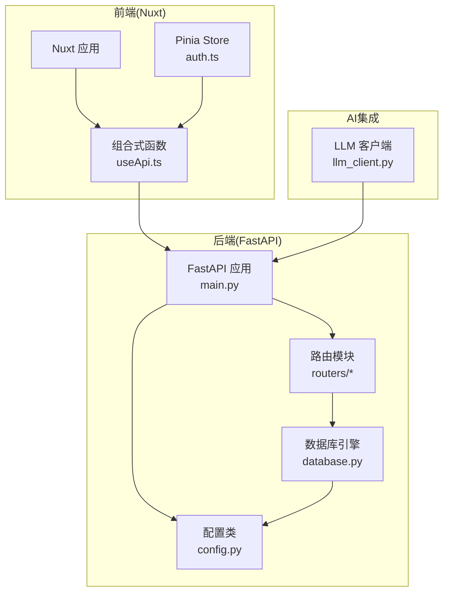
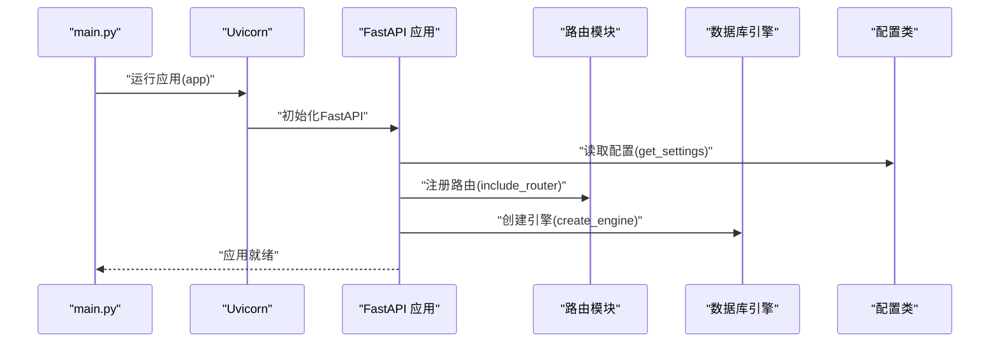
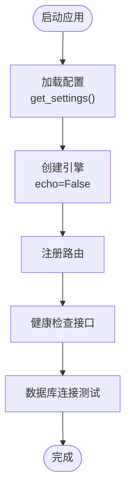
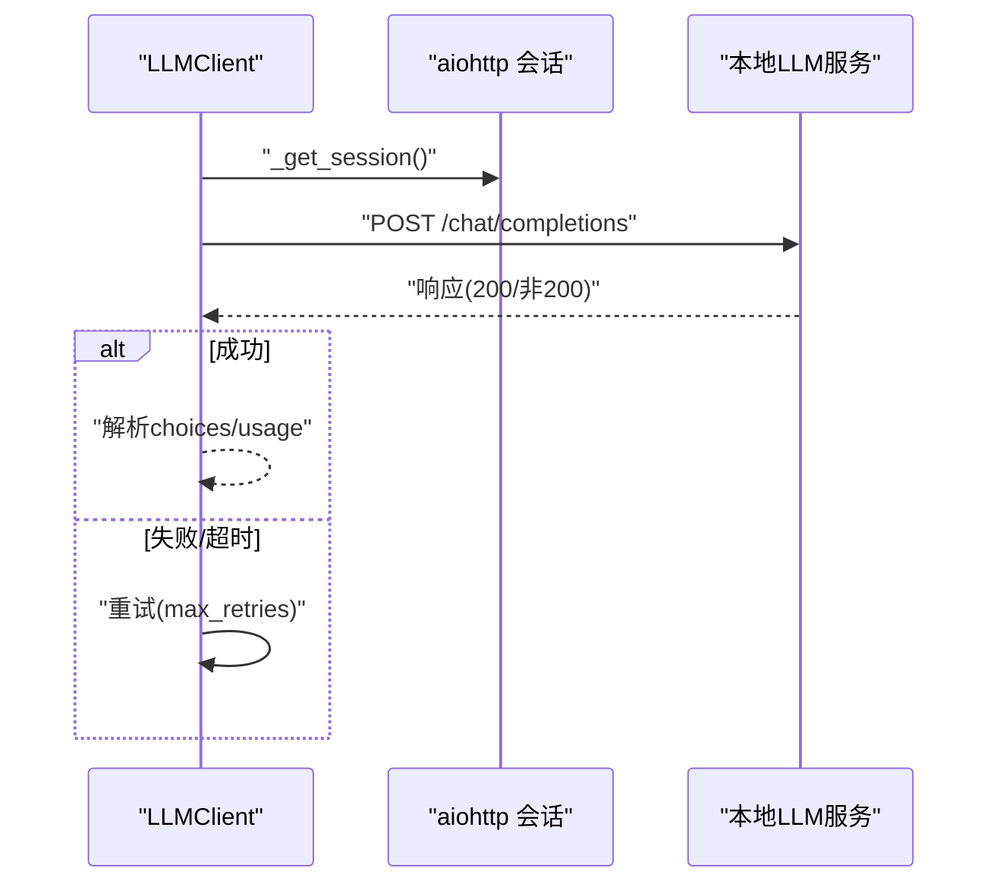
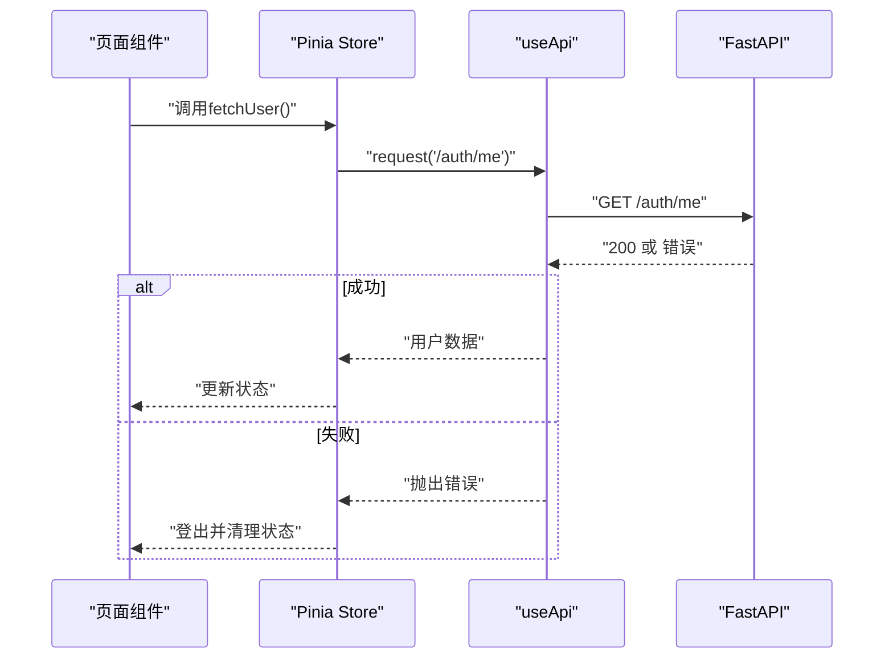
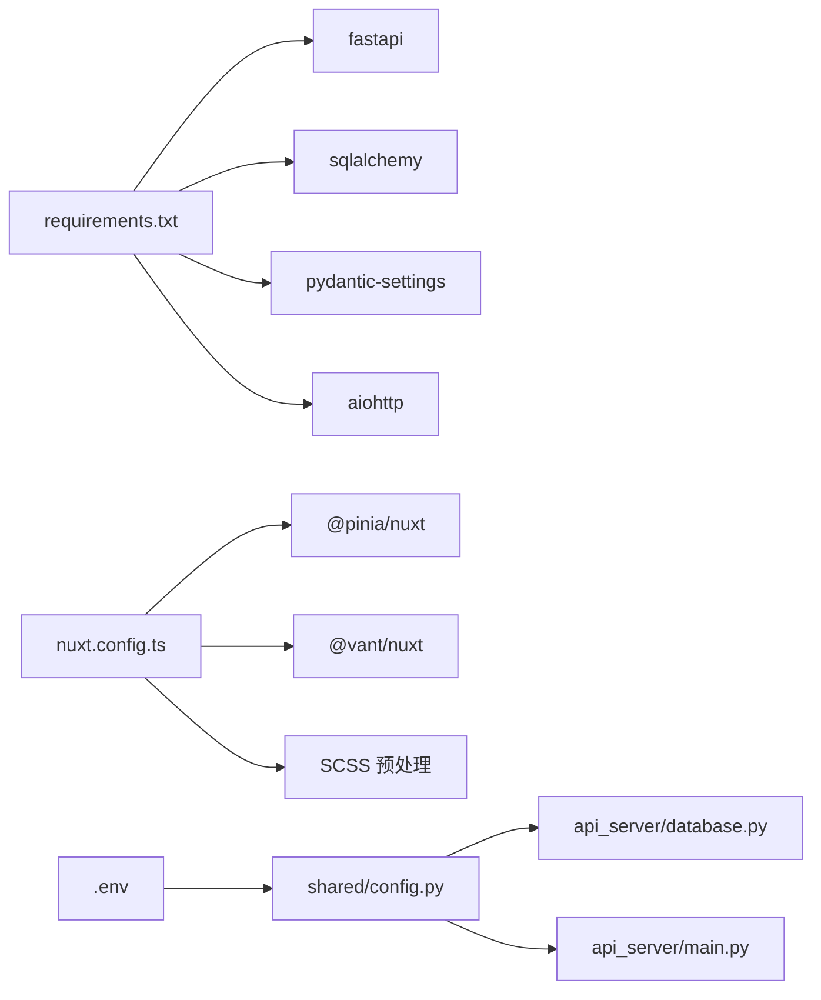

# 调试工具与技巧

<cite>
**本文引用的文件**
- [api_server/main.py](file://api_server/main.py)
- [shared/config.py](file://shared/config.py)
- [api_server/database.py](file://api_server/database.py)
- [api_server/routers/auth.py](file://api_server/routers/auth.py)
- [api_server/auth.py](file://api_server/auth.py)
- [api_server/schemas.py](file://api_server/schemas.py)
- [core_engine/ai_integration/llm_client.py](file://core_engine/ai_integration/llm_client.py)
- [web_frontend/composables/useApi.ts](file://web_frontend/composables/useApi.ts)
- [web_frontend/stores/auth.ts](file://web_frontend/stores/auth.ts)
- [web_frontend/nuxt.config.ts](file://web_frontend/nuxt.config.ts)
- [.env](file://.env)
- [requirements.txt](file://requirements.txt)
- [core_engine/character/action_logger.py](file://core_engine/character/action_logger.py)
- [core_engine/event_system/handlers.py](file://core_engine/event_system/handlers.py)
</cite>

## 目录
1. [简介](#简介)
2. [项目结构](#项目结构)
3. [核心组件](#核心组件)
4. [架构总览](#架构总览)
5. [详细组件分析](#详细组件分析)
6. [依赖关系分析](#依赖关系分析)
7. [性能考量](#性能考量)
8. [故障排查指南](#故障排查指南)
9. [结论](#结论)
10. [附录](#附录)

## 简介
本指南面向AI社区项目的开发与运维人员，提供从后端FastAPI、数据库、LLM客户端到前端Nuxt应用的全链路调试方法与技巧。内容涵盖：
- Python调试器（PDB）在项目中的断点设置、变量检查与单步执行实践
- FastAPI应用的日志配置与日志级别设置，包括结构化日志输出与错误追踪
- 浏览器开发者工具的使用：Network面板检查API请求、Console面板查看JavaScript错误、Elements面板调试前端组件
- 数据库查询日志的启用与分析方法
- LLM客户端的调试方法：请求响应跟踪与错误重试机制
- 常见问题的调试流程与解决方案：API连接问题、数据库连接问题、前端渲染问题

## 项目结构
项目采用前后端分离架构：
- 后端：FastAPI + SQLAlchemy，提供REST API与认证、路由模块
- 前端：Nuxt（Vue 3）+ Pinia状态管理，通过自定义组合式函数封装API请求
- AI集成：本地LLM客户端（OpenAI兼容接口），支持重试与流式响应
- 配置：统一的Pydantic Settings配置类，支持环境变量加载

图表来源
- [api_server/main.py](file://api_server/main.py#L1-L69)
- [api_server/database.py](file://api_server/database.py#L1-L33)
- [shared/config.py](file://shared/config.py#L1-L52)
- [core_engine/ai_integration/llm_client.py](file://core_engine/ai_integration/llm_client.py#L1-L351)
- [web_frontend/composables/useApi.ts](file://web_frontend/composables/useApi.ts#L1-L57)
- [web_frontend/stores/auth.ts](file://web_frontend/stores/auth.ts#L1-L80)

章节来源
- [api_server/main.py](file://api_server/main.py#L1-L69)
- [shared/config.py](file://shared/config.py#L1-L52)
- [api_server/database.py](file://api_server/database.py#L1-L33)
- [web_frontend/nuxt.config.ts](file://web_frontend/nuxt.config.ts#L1-L42)

## 核心组件
- FastAPI应用与路由：提供认证、用户、帖子、评论、文件、消息等接口，并内置CORS与健康检查
- 数据库层：基于SQLAlchemy，使用连接池与预检策略，提供依赖注入式会话
- 配置系统：集中管理数据库、JWT、服务器、前端地址、上传目录、AI服务等配置
- LLM客户端：异步HTTP客户端，支持模型列表查询、聊天、流式响应与多轮重试
- 前端API封装：统一的请求封装与错误处理，自动携带Authorization头
- 认证与令牌：JWT生成、校验与当前用户解析，支持可选认证依赖

章节来源
- [api_server/main.py](file://api_server/main.py#L1-L69)
- [api_server/routers/auth.py](file://api_server/routers/auth.py#L1-L78)
- [api_server/auth.py](file://api_server/auth.py#L1-L89)
- [api_server/database.py](file://api_server/database.py#L1-L33)
- [shared/config.py](file://shared/config.py#L1-L52)
- [core_engine/ai_integration/llm_client.py](file://core_engine/ai_integration/llm_client.py#L1-L351)
- [web_frontend/composables/useApi.ts](file://web_frontend/composables/useApi.ts#L1-L57)
- [web_frontend/stores/auth.ts](file://web_frontend/stores/auth.ts#L1-L80)

## 架构总览
后端启动流程与关键调用序列如下：

图表来源
- [api_server/main.py](file://api_server/main.py#L61-L69)
- [shared/config.py](file://shared/config.py#L49-L52)
- [api_server/database.py](file://api_server/database.py#L14-L19)

## 详细组件分析

### FastAPI应用与路由调试
- 断点设置建议
  - 在路由处理函数入口处设置断点，如认证登录、用户信息获取等
  - 在数据库依赖函数中设置断点，检查会话生命周期与异常抛出
- 变量检查
  - 检查请求体、查询参数、路径参数与当前用户上下文
  - 校验JWT过期时间、算法与密钥配置
- 单步执行
  - 使用PDB逐步进入数据库查询、密码哈希与令牌生成逻辑
- 错误追踪
  - 利用HTTP异常与状态码定位业务错误
  - 结合日志级别与结构化输出定位异常

章节来源
- [api_server/main.py](file://api_server/main.py#L15-L58)
- [api_server/routers/auth.py](file://api_server/routers/auth.py#L45-L77)
- [api_server/auth.py](file://api_server/auth.py#L58-L74)

### 数据库连接与查询日志
- 连接配置
  - 使用配置类生成数据库URL，启用连接池预检与回收策略
- 查询日志启用
  - 将引擎创建时的echo参数设为True以输出SQL语句
  - 分析慢查询与重复查询，结合索引优化
- 事务与会话
  - 通过依赖注入获取会话，确保try/finally正确关闭
  - 在断点处检查会话状态与异常回滚

图表来源
- [shared/config.py](file://shared/config.py#L40-L42)
- [api_server/database.py](file://api_server/database.py#L14-L19)
- [api_server/main.py](file://api_server/main.py#L55-L58)

章节来源
- [api_server/database.py](file://api_server/database.py#L1-L33)
- [shared/config.py](file://shared/config.py#L1-L52)

### LLM客户端调试
- 请求响应跟踪
  - 记录请求负载、响应状态码与JSON解析结果
  - 捕获超时与异常，打印重试尝试次数
- 错误重试机制
  - 配置最大重试次数与延迟，避免瞬时网络波动影响
  - 流式响应逐行解析，过滤无效数据行
- 连接检查
  - 获取模型列表验证服务连通性
  - 输出可用模型名与测试响应摘要

图表来源
- [core_engine/ai_integration/llm_client.py](file://core_engine/ai_integration/llm_client.py#L106-L171)
- [core_engine/ai_integration/llm_client.py](file://core_engine/ai_integration/llm_client.py#L172-L227)

章节来源
- [core_engine/ai_integration/llm_client.py](file://core_engine/ai_integration/llm_client.py#L1-L351)

### 前端API封装与调试
- 请求封装
  - 自动拼接基础URL与鉴权头，统一处理非2xx响应
  - 204无内容场景返回null，简化调用方逻辑
- 错误处理
  - 捕获并抛出后端返回的错误详情
  - 在store中发起用户信息拉取时捕获异常并登出
- 开发者工具
  - Network面板观察请求头、响应体与状态码
  - Console面板查看错误堆栈与日志
  - Elements面板检查组件渲染与DOM结构

图表来源
- [web_frontend/stores/auth.ts](file://web_frontend/stores/auth.ts#L57-L77)
- [web_frontend/composables/useApi.ts](file://web_frontend/composables/useApi.ts#L8-L48)

章节来源
- [web_frontend/composables/useApi.ts](file://web_frontend/composables/useApi.ts#L1-L57)
- [web_frontend/stores/auth.ts](file://web_frontend/stores/auth.ts#L1-L80)
- [web_frontend/nuxt.config.ts](file://web_frontend/nuxt.config.ts#L15-L19)

### 认证与令牌调试
- 密码哈希与校验
  - 在断点处检查明文与哈希一致性
- JWT生成与解码
  - 校验算法、密钥与过期时间
  - 解码失败时返回401并检查令牌格式
- 当前用户解析
  - 依赖可选认证时，未提供令牌返回None

章节来源
- [api_server/auth.py](file://api_server/auth.py#L24-L89)
- [api_server/routers/auth.py](file://api_server/routers/auth.py#L45-L77)

### AI行动日志与事件系统调试
- 行动日志记录
  - 在断点处检查日志字段完整性与数据库写入状态
  - 分析LLM输入与响应字段，辅助AI行为追踪
- 事件处理器
  - 在事件处理前后钩子中设置断点，观察异常捕获与状态变更
  - 记录处理器返回值与on_fail回调

章节来源
- [core_engine/character/action_logger.py](file://core_engine/character/action_logger.py#L115-L156)
- [core_engine/event_system/handlers.py](file://core_engine/event_system/handlers.py#L116-L137)

## 依赖关系分析
- 后端依赖
  - FastAPI、SQLAlchemy、Pydantic Settings、aiohttp
- 前端依赖
  - Nuxt、Pinia、Vant UI、SCSS预处理
- 配置依赖
  - 环境变量文件与Pydantic Settings映射

图表来源
- [requirements.txt](file://requirements.txt#L1-L32)
- [web_frontend/nuxt.config.ts](file://web_frontend/nuxt.config.ts#L5-L19)
- [.env](file://.env#L1-L30)
- [shared/config.py](file://shared/config.py#L1-L52)

章节来源
- [requirements.txt](file://requirements.txt#L1-L32)
- [web_frontend/nuxt.config.ts](file://web_frontend/nuxt.config.ts#L1-L42)
- [.env](file://.env#L1-L30)

## 性能考量
- 数据库连接池
  - 合理设置连接池大小与回收策略，避免连接泄漏
  - 使用预检策略减少无效连接
- 异步I/O
  - LLM客户端使用异步HTTP会话，避免阻塞主线程
  - 流式响应按行解析，降低内存占用
- 前端请求缓存
  - 对静态资源与不频繁变更的数据进行缓存
  - 合理使用204无内容响应，减少不必要的数据传输

## 故障排查指南

### API连接问题
- 症状
  - 前端Network面板显示跨域错误或404/500
- 排查步骤
  - 检查CORS配置与允许的源
  - 确认后端监听地址与端口与前端配置一致
  - 查看健康检查接口是否返回健康状态
- 相关文件
  - [api_server/main.py](file://api_server/main.py#L23-L34)
  - [web_frontend/nuxt.config.ts](file://web_frontend/nuxt.config.ts#L15-L19)

章节来源
- [api_server/main.py](file://api_server/main.py#L23-L34)
- [web_frontend/nuxt.config.ts](file://web_frontend/nuxt.config.ts#L15-L19)

### 数据库连接问题
- 症状
  - 应用启动时报连接错误或查询超时
- 排查步骤
  - 检查数据库URL与凭据
  - 启用SQL日志（echo=True）观察SQL执行
  - 确认数据库服务可达与防火墙放行
- 相关文件
  - [shared/config.py](file://shared/config.py#L40-L42)
  - [api_server/database.py](file://api_server/database.py#L14-L19)

章节来源
- [shared/config.py](file://shared/config.py#L40-L42)
- [api_server/database.py](file://api_server/database.py#L14-L19)

### 前端渲染问题
- 症状
  - 页面空白、组件不显示或控制台报错
- 排查步骤
  - Console面板查看JavaScript错误与堆栈
  - Network面板确认API请求与响应
  - Elements面板检查DOM结构与样式
  - 检查Pinia状态是否正确更新
- 相关文件
  - [web_frontend/composables/useApi.ts](file://web_frontend/composables/useApi.ts#L37-L40)
  - [web_frontend/stores/auth.ts](file://web_frontend/stores/auth.ts#L57-L77)

章节来源
- [web_frontend/composables/useApi.ts](file://web_frontend/composables/useApi.ts#L37-L40)
- [web_frontend/stores/auth.ts](file://web_frontend/stores/auth.ts#L57-L77)

### LLM连接与响应问题
- 症状
  - LLM请求超时、返回空内容或JSON解析失败
- 排查步骤
  - 检查本地LLM服务是否启动与端口开放
  - 查看重试日志与错误信息
  - 验证模型列表与基础URL配置
- 相关文件
  - [core_engine/ai_integration/llm_client.py](file://core_engine/ai_integration/llm_client.py#L80-L93)
  - [core_engine/ai_integration/llm_client.py](file://core_engine/ai_integration/llm_client.py#L136-L171)
  - [core_engine/ai_integration/llm_client.py](file://core_engine/ai_integration/llm_client.py#L294-L299)

章节来源
- [core_engine/ai_integration/llm_client.py](file://core_engine/ai_integration/llm_client.py#L80-L93)
- [core_engine/ai_integration/llm_client.py](file://core_engine/ai_integration/llm_client.py#L136-L171)
- [core_engine/ai_integration/llm_client.py](file://core_engine/ai_integration/llm_client.py#L294-L299)

## 结论
通过本指南提供的调试工具与技巧，可以系统地定位与解决AI社区项目在后端、数据库、LLM与前端各层面的问题。建议在开发过程中：
- 使用PDB在关键路径设置断点，配合变量检查与单步执行
- 启用结构化日志与数据库SQL日志，结合错误追踪快速定位问题
- 善用浏览器开发者工具的Network、Console与Elements面板
- 为LLM客户端配置合理的重试与超时策略
- 建立完善的错误处理与状态管理机制

## 附录

### Python调试器（PDB）使用要点
- 在FastAPI路由处理函数、数据库依赖函数、LLM客户端方法中设置断点
- 使用变量检查确认请求参数、数据库会话状态、JWT令牌与LLM响应
- 使用单步执行逐步进入内部逻辑，观察异常抛出位置
- 结合日志级别与结构化输出，定位异常源头

### FastAPI日志配置与级别
- 建议在开发环境启用更详细的日志输出，生产环境使用结构化日志
- 结合Uvicorn的日志级别参数调整输出粒度
- 对于数据库SQL日志，可在引擎创建时启用echo以输出SQL语句

### 浏览器开发者工具使用
- Network面板：检查请求头、响应体、状态码与响应时间
- Console面板：查看JavaScript错误、堆栈与控制台输出
- Elements面板：检查DOM结构、样式与组件渲染状态

### 数据库查询日志启用与分析
- 在引擎创建时将echo参数设为True以输出SQL
- 分析慢查询与重复查询，结合索引优化
- 使用事务与会话依赖注入，确保异常时正确回滚

### LLM客户端调试方法
- 记录请求负载与响应状态码，捕获超时与异常
- 配置最大重试次数与延迟，避免瞬时网络波动影响
- 流式响应逐行解析，过滤无效数据行
- 连接检查与模型列表获取验证服务连通性