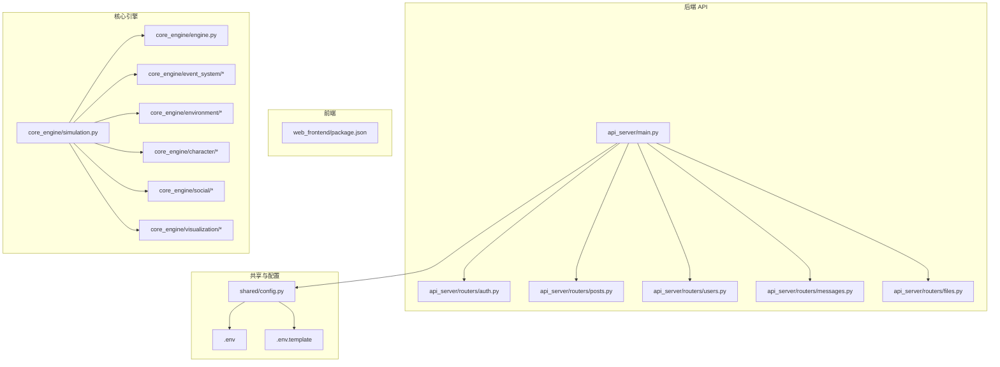
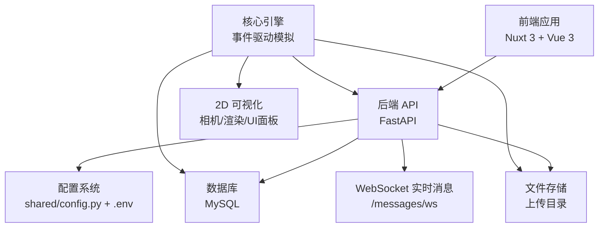
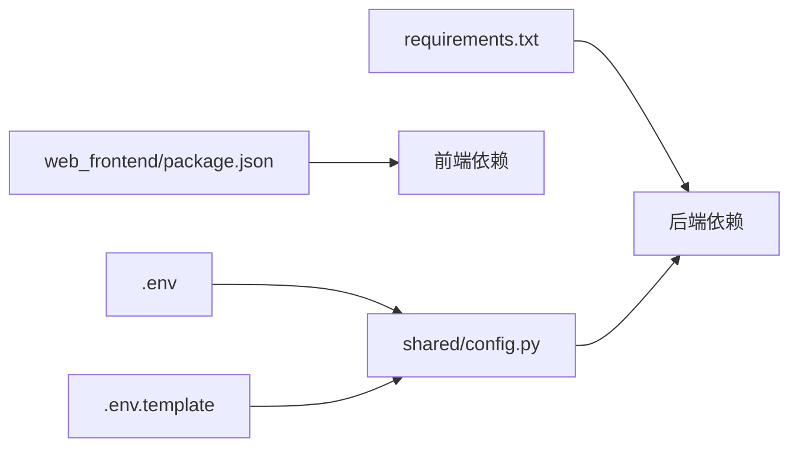

# 贡献指南

<cite>
**本文引用的文件**
- [README.md](file://README.md)
- [开发目标.md](file://开发目标.md)
- [开发进度.md](file://开发进度.md)
- [.env](file://.env)
- [.env.template](file://.env.template)
- [requirements.txt](file://requirements.txt)
- [shared/config.py](file://shared/config.py)
- [api_server/main.py](file://api_server/main.py)
- [api_server/routers/auth.py](file://api_server/routers/auth.py)
- [api_server/routers/posts.py](file://api_server/routers/posts.py)
- [api_server/routers/users.py](file://api_server/routers/users.py)
- [api_server/routers/messages.py](file://api_server/routers/messages.py)
- [api_server/routers/files.py](file://api_server/routers/files.py)
- [web_frontend/package.json](file://web_frontend/package.json)
</cite>

## 目录
1. [简介](#简介)
2. [项目结构](#项目结构)
3. [核心组件](#核心组件)
4. [架构总览](#架构总览)
5. [详细组件分析](#详细组件分析)
6. [依赖分析](#依赖分析)
7. [性能注意事项](#性能注意事项)
8. [故障排除指南](#故障排除指南)
9. [结论](#结论)
10. [附录](#附录)

## 简介
本指南面向希望参与“AI社区”开源项目的贡献者，提供从 Fork 项目、创建分支、提交代码、提交 Issue、创建与审查 Pull Request，到社区参与、治理与许可、新贡献者入门与资源、以及感谢与认可机制的全流程说明。项目采用前后端分离架构：后端基于 FastAPI，前端基于 Nuxt 3 + Vue 3，核心模拟引擎以事件驱动的方式组织 AI 角色的线下与线上社交行为。

## 项目结构
项目采用多模块分层组织，便于贡献者定位职责域：
- 后端 API 服务：api_server
- 前端应用：web_frontend
- 核心引擎：core_engine（模拟、事件、环境、角色、社交、可视化）
- 共享配置：shared
- 数据与迁移：data
- 启动与演示脚本：run_simulation.py、run_visualization.py、init_db.py、start.bat

图表来源
- [api_server/main.py](file://api_server/main.py#L1-L69)
- [shared/config.py](file://shared/config.py#L1-L52)
- [web_frontend/package.json](file://web_frontend/package.json#L1-L28)
- [开发进度.md](file://开发进度.md#L228-L311)

章节来源
- [README.md](file://README.md#L5-L35)
- [开发进度.md](file://开发进度.md#L228-L311)

## 核心组件
- 配置与环境
  - 环境变量与配置加载：通过 shared/config.py 读取 .env/.env.template 并提供 database_url、JWT、上传目录等配置项。
  - 环境变量样例：MYSQL、JWT、API、前端地址、上传目录、预留的 AI 与 ComfyUI 接口等。
- 后端 API
  - 路由模块：认证、用户、帖子、评论、文件、私聊消息等。
  - CORS、静态文件挂载、健康检查端点。
- 前端
  - Nuxt 3 + Vue 3 + Pinia + Vant，包含布局、页面、组合式函数与状态管理。
- 核心引擎
  - 事件驱动的模拟器、时间管理器、环境系统、角色 Agent、社交行为调度与处理、2D 可视化与行动日志。

章节来源
- [shared/config.py](file://shared/config.py#L1-L52)
- [.env](file://.env#L1-L30)
- [.env.template](file://.env.template#L1-L30)
- [api_server/main.py](file://api_server/main.py#L1-L69)
- [api_server/routers/auth.py](file://api_server/routers/auth.py#L1-L78)
- [api_server/routers/posts.py](file://api_server/routers/posts.py#L1-L166)
- [api_server/routers/users.py](file://api_server/routers/users.py#L1-L57)
- [api_server/routers/messages.py](file://api_server/routers/messages.py#L1-L300)
- [api_server/routers/files.py](file://api_server/routers/files.py#L1-L138)
- [web_frontend/package.json](file://web_frontend/package.json#L1-L28)
- [开发进度.md](file://开发进度.md#L96-L214)

## 架构总览
后端 API 通过 FastAPI 提供 REST 与 WebSocket 接口；前端通过 Nuxt 3 提供移动端友好的社区界面；核心引擎负责 AI 角色的线下与线上行为模拟，事件系统驱动时间推进与社交交互；共享配置贯穿后端与引擎，保证部署一致性。

图表来源
- [api_server/main.py](file://api_server/main.py#L1-L69)
- [shared/config.py](file://shared/config.py#L1-L52)
- [api_server/routers/messages.py](file://api_server/routers/messages.py#L263-L300)
- [开发进度.md](file://开发进度.md#L267-L311)

## 详细组件分析

### 贡献流程：Fork、分支与提交
- Fork 仓库至个人账号
- 在本地克隆仓库并创建开发分支（建议使用语义化命名，如 feature/xxx、fix/xxx、docs/xxx）
- 提交前确保通过本地测试与格式校验
- 推送分支并创建 Pull Request（PR），填写 PR 模板中的必要信息

章节来源
- [README.md](file://README.md#L44-L65)

### Issue 提交规范
- Bug 报告
  - 环境信息：Python 版本、Node.js 版本、数据库版本、LLM 服务端口与模型
  - 复现步骤：最小可复现步骤、期望结果 vs 实际结果
  - 日志与截图：后端错误日志、前端控制台信息、数据库异常
- 功能请求
  - 背景与动机：为什么需要该功能
  - 期望行为：简述接口或行为
  - 影响范围：对现有模块的影响评估
- 问题描述
  - 使用清晰标题，分类标签（bug、enhancement、question 等）
  - 提供最小可复现示例与相关文件路径

章节来源
- [README.md](file://README.md#L269-L286)

### Pull Request 创建与审查流程
- PR 描述
  - 关联 Issue 编号（如 #123）
  - 变更摘要：做了什么、为什么做、如何验证
  - 截图/录屏（UI/行为变更时）
- 代码审查要点
  - 代码风格与一致性：遵循现有模块命名与文件组织
  - 安全性：输入校验、权限控制、敏感信息处理
  - 性能：避免阻塞操作、合理使用异步与缓存
  - 兼容性：后端接口变更需同步更新前端与文档
- 合并条件
  - 至少一名维护者批准
  - CI 通过（若配置）
  - 无重大安全与性能问题
  - 文档与测试更新（如适用）

章节来源
- [api_server/routers/auth.py](file://api_server/routers/auth.py#L20-L42)
- [api_server/routers/posts.py](file://api_server/routers/posts.py#L72-L88)
- [api_server/routers/messages.py](file://api_server/routers/messages.py#L191-L227)

### 社区参与方式
- 讨论区参与
  - GitHub Discussions（如启用）、Issue 区讨论
  - 对现有功能提出改进建议与使用反馈
- 文档改进
  - 更新 README、开发目标与进度、API 文档
  - 修复拼写与错别字，补充缺失的使用示例
- 翻译贡献
  - 将 README 与开发文档翻译为其他语言
  - 保持术语一致性与上下文准确

章节来源
- [README.md](file://README.md#L264-L268)

### 项目治理与决策流程
- 分支策略
  - 主分支：稳定版本，仅接受经审查的 PR 合并
  - 开发分支：feature/* 与 fix/*，合并到 develop 后再进入主分支
- 决策流程
  - 重大变更通过 Issue 讨论与 PR 审查
  - 维护者拥有最终决策权
- 版本发布
  - 依据功能完成度与稳定性进行版本标注与发布说明

章节来源
- [开发进度.md](file://开发进度.md#L8-L93)

### 知识产权与许可证
- 许可证：MIT
- 贡献即默认同意以项目许可证发布贡献内容
- 若引入第三方依赖，需遵守其许可证并在依赖清单中标注

章节来源
- [README.md](file://README.md#L287-L290)
- [requirements.txt](file://requirements.txt#L1-L32)

### 新贡献者入门与资源
- 环境准备
  - Python 3.10+、Node.js 18+、MySQL 8.0+
  - LLM 服务（LM Studio 或兼容服务）
- 快速开始
  - 克隆与安装依赖、初始化数据库、启动后端、前端与模拟器
- 资源链接
  - API 文档：http://localhost:8000/docs
  - 健康检查：http://localhost:8000/health
  - 开发目标与进度文档

章节来源
- [README.md](file://README.md#L37-L128)
- [开发目标.md](file://开发目标.md#L1-L204)
- [开发进度.md](file://开发进度.md#L1-L370)

### 感谢与认可机制
- 贡献者列表：在 README 或贡献者名单中展示
- 里程碑致谢：对关键功能贡献者公开致谢
- 社区激励：优秀 PR 与文档贡献可获得特别鸣谢与优先审核通道

章节来源
- [README.md](file://README.md#L1-L3)

## 依赖分析
后端依赖通过 requirements.txt 管理，前端依赖通过 package.json 管理；配置通过 shared/config.py 与 .env/.env.template 统一注入。

图表来源
- [requirements.txt](file://requirements.txt#L1-L32)
- [web_frontend/package.json](file://web_frontend/package.json#L1-L28)
- [shared/config.py](file://shared/config.py#L1-L52)
- [.env](file://.env#L1-L30)
- [.env.template](file://.env.template#L1-L30)

章节来源
- [requirements.txt](file://requirements.txt#L1-L32)
- [web_frontend/package.json](file://web_frontend/package.json#L1-L28)
- [shared/config.py](file://shared/config.py#L1-L52)

## 性能注意事项
- 后端
  - 使用异步文件写入与数据库连接池，避免阻塞
  - WebSocket 连接管理与心跳检测，及时清理断开连接
  - 图片上传限制与路径规范化，防止路径穿越
- 前端
  - 组件懒加载与按需引入 UI 组件
  - API 请求封装与错误处理，避免重复请求
- 核心引擎
  - 事件队列优先级与时间跳跃，减少无效轮询
  - AI 决策超时与重试策略，避免长时间阻塞

章节来源
- [api_server/routers/files.py](file://api_server/routers/files.py#L41-L81)
- [api_server/routers/messages.py](file://api_server/routers/messages.py#L17-L50)
- [README.md](file://README.md#L192-L227)

## 故障排除指南
- LLM 连接失败
  - 确认本地 LLM 服务已启动且端口正确
  - 运行 LLM 客户端测试脚本验证连通性
- 数据库连接失败
  - 检查 MySQL 服务状态、凭据与数据库是否存在
  - 校验 shared/config.py 与 .env 中的配置项
- 没有 AI 角色
  - 确保数据库中存在 is_ai=True 的用户记录
- WebSocket 连接失败
  - 检查 token 是否有效、用户是否存在
  - 查看后端日志与前端控制台错误

章节来源
- [README.md](file://README.md#L269-L286)
- [shared/config.py](file://shared/config.py#L40-L46)
- [api_server/routers/messages.py](file://api_server/routers/messages.py#L263-L300)

## 结论
本指南提供了从环境准备到贡献实践、从 Issue 到 PR 审查、从社区参与至治理与许可的完整路径。建议贡献者在提交前充分阅读相关模块文档与代码，确保变更与项目整体风格一致，并通过 Issue 与 PR 模板清晰表达意图与验证方法。

## 附录
- API 端点概览（节选）
  - 认证：注册、登录、当前用户
  - 用户：查询、更新、列表
  - 帖子：列表、创建、详情、删除、点赞
  - 私聊：会话列表、历史、发送、标记已读、未读统计、WebSocket
  - 文件：图片上传、头像上传、访问接口

章节来源
- [README.md](file://README.md#L229-L242)
- [api_server/routers/auth.py](file://api_server/routers/auth.py#L20-L78)
- [api_server/routers/users.py](file://api_server/routers/users.py#L13-L57)
- [api_server/routers/posts.py](file://api_server/routers/posts.py#L45-L166)
- [api_server/routers/messages.py](file://api_server/routers/messages.py#L83-L300)
- [api_server/routers/files.py](file://api_server/routers/files.py#L41-L138)