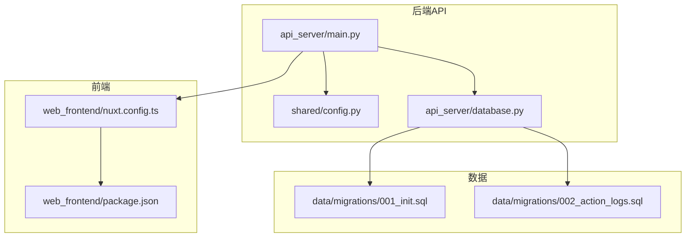

# 部署指南

<cite>
**本文引用的文件**
- [README.md](file://README.md)
- [requirements.txt](file://requirements.txt)
- [.env](file://.env)
- [.env.template](file://.env.template)
- [api_server/main.py](file://api_server/main.py)
- [shared/config.py](file://shared/config.py)
- [api_server/database.py](file://api_server/database.py)
- [data/migrations/001_init.sql](file://data/migrations/001_init.sql)
- [data/migrations/002_action_logs.sql](file://data/migrations/002_action_logs.sql)
- [init_db.py](file://init_db.py)
- [run_simulation.py](file://run_simulation.py)
- [web_frontend/package.json](file://web_frontend/package.json)
- [web_frontend/nuxt.config.ts](file://web_frontend/nuxt.config.ts)
</cite>

## 目录
1. [简介](#简介)
2. [项目结构](#项目结构)
3. [核心组件](#核心组件)
4. [架构总览](#架构总览)
5. [详细组件分析](#详细组件分析)
6. [依赖关系分析](#依赖关系分析)
7. [性能考量](#性能考量)
8. [故障排查指南](#故障排查指南)
9. [结论](#结论)
10. [附录](#附录)

## 简介
本指南面向生产环境部署“AI社区”项目，涵盖服务器配置、依赖安装、环境变量设置、数据库部署与迁移、容器化与Kubernetes部署思路、负载均衡与高可用、监控与日志、安全加固、自动化部署与CI/CD建议，以及故障排查与回滚策略。项目采用后端FastAPI、前端Nuxt 3、MySQL数据库，并通过独立的AI模拟器进程运行。

## 项目结构
项目采用分层与功能模块化组织：
- 后端API服务：FastAPI应用，路由与业务逻辑分离，数据库连接与ORM配置集中
- 核心引擎：AI模拟与事件驱动的时间模型，独立于Web服务
- 前端：Nuxt 3应用，通过环境变量配置API基础地址
- 共享配置：统一的环境变量与配置类，支持从.env加载
- 数据：SQL迁移脚本，包含初始化与扩展表

图表来源
- [api_server/main.py](file://api_server/main.py#L1-L69)
- [shared/config.py](file://shared/config.py#L1-L52)
- [api_server/database.py](file://api_server/database.py#L1-L33)
- [web_frontend/nuxt.config.ts](file://web_frontend/nuxt.config.ts#L1-L42)
- [web_frontend/package.json](file://web_frontend/package.json#L1-L28)
- [data/migrations/001_init.sql](file://data/migrations/001_init.sql#L1-L205)
- [data/migrations/002_action_logs.sql](file://data/migrations/002_action_logs.sql#L1-L44)

章节来源
- [README.md](file://README.md#L1-L35)
- [api_server/main.py](file://api_server/main.py#L1-L69)
- [shared/config.py](file://shared/config.py#L1-L52)
- [api_server/database.py](file://api_server/database.py#L1-L33)
- [web_frontend/nuxt.config.ts](file://web_frontend/nuxt.config.ts#L1-L42)
- [web_frontend/package.json](file://web_frontend/package.json#L1-L28)
- [data/migrations/001_init.sql](file://data/migrations/001_init.sql#L1-L205)
- [data/migrations/002_action_logs.sql](file://data/migrations/002_action_logs.sql#L1-L44)

## 核心组件
- 配置系统：统一的Settings类与.env加载，支持数据库、JWT、服务器、前端、文件存储、预留AI/ComfyUI参数
- 数据库连接：基于SQLAlchemy，连接池预检查与回收配置，提供依赖注入
- API入口：FastAPI应用，CORS跨域配置，健康检查端点
- 前端构建：Nuxt 3，运行时公开API基础地址，支持开发与生成模式
- 数据库初始化：Python脚本读取SQL迁移文件并执行，忽略重复与表存在等错误
- AI模拟器：独立异步事件驱动模拟，支持交互与步进模式

章节来源
- [shared/config.py](file://shared/config.py#L1-L52)
- [api_server/database.py](file://api_server/database.py#L1-L33)
- [api_server/main.py](file://api_server/main.py#L1-L69)
- [web_frontend/nuxt.config.ts](file://web_frontend/nuxt.config.ts#L1-L42)
- [init_db.py](file://init_db.py#L1-L70)
- [run_simulation.py](file://run_simulation.py#L1-L258)

## 架构总览
生产部署建议采用“API服务 + 前端静态资源 + MySQL + AI模拟器”的组合，API服务通过反向代理对外暴露，前端以静态方式部署或通过Nginx提供，AI模拟器作为独立进程运行。

图表来源
- [api_server/main.py](file://api_server/main.py#L1-L69)
- [shared/config.py](file://shared/config.py#L1-L52)
- [api_server/database.py](file://api_server/database.py#L1-L33)
- [run_simulation.py](file://run_simulation.py#L1-L258)

## 详细组件分析

### 配置与环境变量
- 数据库：主机、端口、用户、密码、数据库名
- JWT：密钥、算法、过期时间
- 服务器：监听地址与端口
- 前端：允许的来源URL
- 文件存储：上传目录与URL前缀
- AI/ComfyUI：预留远程服务地址
- AI社交行为：AI浏览评论数量限制

章节来源
- [.env](file://.env#L1-L30)
- [.env.template](file://.env.template#L1-L30)
- [shared/config.py](file://shared/config.py#L1-L52)

### 数据库部署与迁移
- 初始化脚本：读取SQL文件并逐条执行，忽略重复与表存在错误
- 迁移脚本：包含用户、帖子、评论、消息、地点、游戏事件、物品栏、动作日志等表
- 连接池：启用pool_pre_ping与pool_recycle，echo关闭

图表来源
- [init_db.py](file://init_db.py#L1-L70)
- [data/migrations/001_init.sql](file://data/migrations/001_init.sql#L1-L205)
- [data/migrations/002_action_logs.sql](file://data/migrations/002_action_logs.sql#L1-L44)

章节来源
- [init_db.py](file://init_db.py#L1-L70)
- [data/migrations/001_init.sql](file://data/migrations/001_init.sql#L1-L205)
- [data/migrations/002_action_logs.sql](file://data/migrations/002_action_logs.sql#L1-L44)
- [api_server/database.py](file://api_server/database.py#L1-L33)

### API服务与CORS
- 应用创建：标题、描述、版本、文档端点
- CORS：允许前端来源、凭证、方法与头
- 路由注册：认证、用户、帖子、评论、文件、消息
- 健康检查：/health返回健康状态
- 开发运行：从配置读取host/port

章节来源
- [api_server/main.py](file://api_server/main.py#L1-L69)
- [shared/config.py](file://shared/config.py#L1-L52)

### 前端构建与运行
- 构建脚本：dev/build/generate/preview
- 运行时配置：公开API基础地址默认localhost:8000
- 模块与样式：Pinia、Vant、SCSS

章节来源
- [web_frontend/package.json](file://web_frontend/package.json#L1-L28)
- [web_frontend/nuxt.config.ts](file://web_frontend/nuxt.config.ts#L1-L42)

### AI模拟器
- 交互模式：启动/停止/暂停/恢复/单步/状态查询
- 步进模式：指定步数的手动推进
- 回调：行动开始/结束、时间推进
- 数据库：加载AI角色并初始化位置

章节来源
- [run_simulation.py](file://run_simulation.py#L1-L258)

## 依赖关系分析
- 后端依赖：FastAPI、Uvicorn、SQLAlchemy、PyMySQL、Pydantic、python-jose、passlib、aiofiles、Pillow、python-dotenv
- 前端依赖：Nuxt 3、Vue 3、Pinia、Vant等

图表来源
- [requirements.txt](file://requirements.txt#L1-L32)
- [web_frontend/package.json](file://web_frontend/package.json#L1-L28)

章节来源
- [requirements.txt](file://requirements.txt#L1-L32)
- [web_frontend/package.json](file://web_frontend/package.json#L1-L28)

## 性能考量
- 数据库连接池：启用pool_pre_ping与pool_recycle，降低连接失效与重建成本
- 日志级别：SQLAlchemy echo关闭，避免生产环境冗余日志
- 前端静态化：Nuxt生成模式产出静态资源，减少运行时开销
- AI模拟器：异步事件驱动，合理设置最大时间跳跃与决策超时

章节来源
- [api_server/database.py](file://api_server/database.py#L1-L33)
- [run_simulation.py](file://run_simulation.py#L1-L258)

## 故障排查指南
- LLM连接失败：确认本地LLM服务已启动、端口正确、运行测试脚本验证
- 数据库连接失败：确认MySQL服务运行、凭据正确、数据库存在
- 缺少AI角色：需在数据库中创建is_ai=True的用户记录
- 健康检查：访问/health确认API服务可用
- 数据库初始化：执行初始化脚本，忽略重复与表存在错误

章节来源
- [README.md](file://README.md#L269-L286)
- [api_server/main.py](file://api_server/main.py#L55-L58)
- [init_db.py](file://init_db.py#L1-L70)

## 结论
本指南提供了从服务器配置、依赖安装、数据库部署到容器化与高可用、监控日志、安全加固、自动化部署与CI/CD、故障排查与回滚的完整路径。建议在生产环境中结合负载均衡、反向代理、数据库主从/集群、容器编排与监控告警体系，确保系统稳定与可扩展。

## 附录

### 生产环境部署流程
- 服务器准备：操作系统、防火墙放行、域名解析
- 依赖安装：Python虚拟环境、Node.js、MySQL
- 环境变量：复制.env.template为.env并填写生产参数
- 数据库初始化：执行初始化脚本，确认迁移成功
- API服务：使用Uvicorn在后台运行，绑定0.0.0.0与生产端口
- 前端部署：Nuxt生成静态资源，部署至Nginx或CDN
- AI模拟器：独立进程运行，接入日志与监控
- 负载均衡：反向代理转发请求至多个API实例
- 监控与日志：集中化日志与指标采集
- 安全加固：HTTPS、WAF、访问控制、定期审计

### 容器化与Kubernetes部署思路
- Docker镜像：Python基础镜像，安装依赖，复制代码，暴露端口，设置非root用户
- Kubernetes：Deployment副本数、HPA、ConfigMap/Secret管理配置，Service暴露，Ingress配置TLS
- 数据持久化：MySQL使用持久卷，前端静态资源使用ConfigMap或外部CDN
- 健康检查：HTTP探针与TCP探针结合

### 数据库备份与迁移
- 备份策略：定时快照/逻辑备份，异地存储，周期性校验
- 迁移策略：灰度发布，先在测试环境验证，再逐步切换流量
- 回滚策略：保留上一版本镜像与配置，快速回退

### 负载均衡与高可用
- 反向代理：Nginx/HAProxy，健康检查，会话保持
- 多实例：API服务横向扩展，共享数据库
- 数据库高可用：主从复制/集群，读写分离，故障转移

### 监控与日志
- 指标：CPU、内存、QPS、响应时间、错误率
- 日志：结构化日志，集中收集，索引与检索
- 告警：阈值告警、异常检测、通知渠道

### 安全配置
- 防火墙：仅开放必要端口，内网白名单
- SSL/TLS：Let’s Encrypt证书，强制HTTPS
- 访问控制：JWT鉴权、CORS白名单、速率限制
- 定期审计：漏洞扫描、权限审查、日志审计

### 自动化部署与CI/CD
- CI：代码检查、单元测试、依赖扫描
- CD：镜像构建、推送仓库、Kubernetes部署、滚动更新
- 回滚：版本标记、一键回滚、蓝绿/金丝雀发布