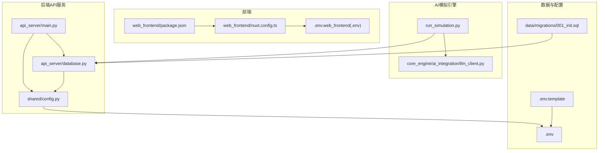
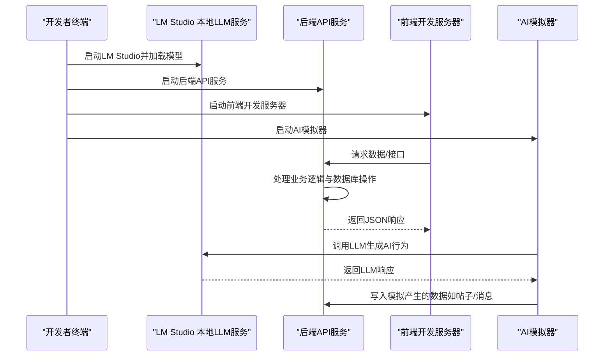
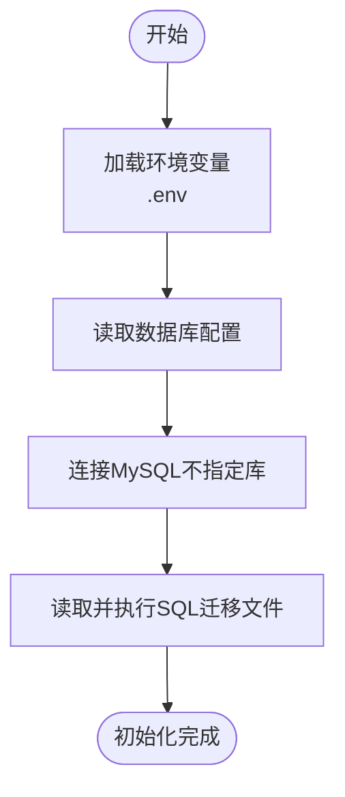
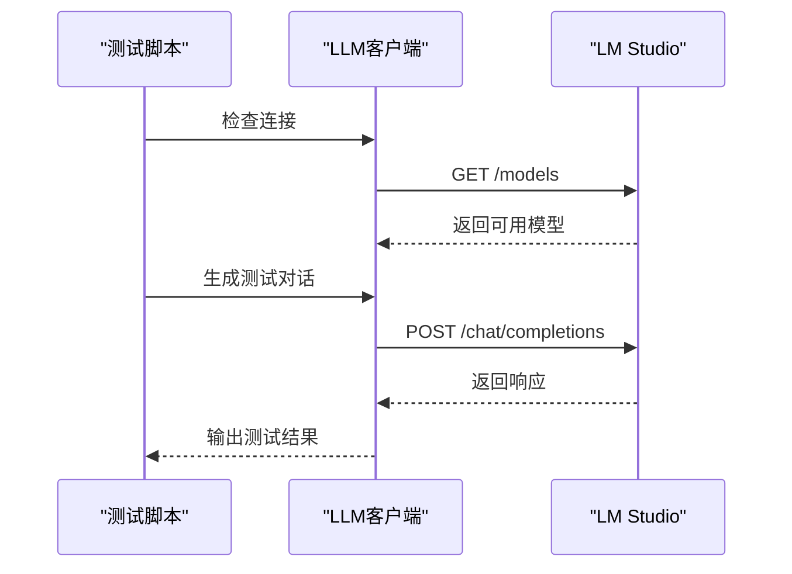
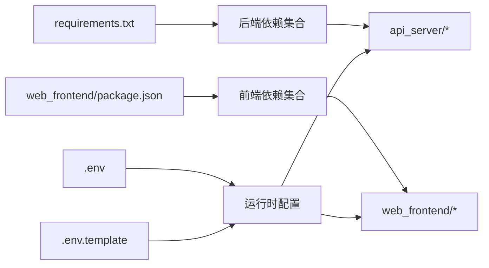

# 快速开始

<cite>
**本文引用的文件**
- [README.md](file://README.md)
- [requirements.txt](file://requirements.txt)
- [.env](file://.env)
- [.env.template](file://.env.template)
- [api_server/main.py](file://api_server/main.py)
- [shared/config.py](file://shared/config.py)
- [api_server/database.py](file://api_server/database.py)
- [core_engine/ai_integration/llm_client.py](file://core_engine/ai_integration/llm_client.py)
- [run_simulation.py](file://run_simulation.py)
- [init_db.py](file://init_db.py)
- [data/migrations/001_init.sql](file://data/migrations/001_init.sql)
- [web_frontend/package.json](file://web_frontend/package.json)
- [web_frontend/nuxt.config.ts](file://web_frontend/nuxt.config.ts)
- [web_frontend/.env](file://web_frontend/.env)
- [start.bat](file://start.bat)
</cite>

## 目录
1. [简介](#简介)
2. [项目结构](#项目结构)
3. [核心组件](#核心组件)
4. [架构总览](#架构总览)
5. [详细组件分析](#详细组件分析)
6. [依赖关系分析](#依赖关系分析)
7. [性能注意事项](#性能注意事项)
8. [故障排除指南](#故障排除指南)
9. [结论](#结论)
10. [附录](#附录)

## 简介
本指南面向新手开发者，帮助你在本地快速搭建并运行“AI社区”项目。项目包含后端API服务（FastAPI）、前端（Nuxt 3 + Vue 3）、AI模拟引擎以及本地LLM服务（LM Studio）。你将学到：
- 环境要求与安装步骤
- 虚拟环境与依赖安装
- 数据库初始化与配置
- LLM服务（LM Studio）配置与测试
- 三类服务的启动顺序与命令
- 常见问题排查与最佳实践

## 项目结构
项目采用分层与功能模块化组织：
- 后端API服务：api_server（FastAPI + SQLAlchemy）
- AI模拟引擎：core_engine（事件驱动模拟、角色系统、AI集成）
- 前端：web_frontend（Nuxt 3 + Vue 3）
- 共享配置：shared/config.py
- 数据与迁移：data/migrations/*.sql
- 启动脚本：start.bat、run_simulation.py、init_db.py

图表来源
- [api_server/main.py](file://api_server/main.py#L1-L69)
- [api_server/database.py](file://api_server/database.py#L1-L33)
- [shared/config.py](file://shared/config.py#L1-L52)
- [run_simulation.py](file://run_simulation.py#L1-L258)
- [core_engine/ai_integration/llm_client.py](file://core_engine/ai_integration/llm_client.py#L1-L351)
- [web_frontend/package.json](file://web_frontend/package.json#L1-L28)
- [web_frontend/nuxt.config.ts](file://web_frontend/nuxt.config.ts#L1-L42)
- [web_frontend/.env](file://web_frontend/.env#L1-L2)
- [data/migrations/001_init.sql](file://data/migrations/001_init.sql#L1-L200)
- [.env](file://.env#L1-L30)
- [.env.template](file://.env.template#L1-L30)

章节来源
- [README.md](file://README.md#L1-L35)
- [start.bat](file://start.bat#L1-L45)

## 核心组件
- 后端API服务（FastAPI）
  - 提供认证、用户、帖子、评论、文件、消息等REST接口
  - 默认监听地址与端口来自共享配置
- 数据库连接
  - 通过SQLAlchemy连接MySQL，支持池化与预检测
- AI模拟引擎
  - 事件驱动的时间模型，支持交互式与步进式模拟
  - 可加载数据库中的AI角色并驱动其行为
- LLM客户端
  - 与LM Studio（OpenAI兼容接口）通信，支持同步与流式响应
- 前端（Nuxt 3）
  - 使用Pinia状态管理、Vant移动端组件
  - 通过Nuxt运行时配置指向后端API

章节来源
- [api_server/main.py](file://api_server/main.py#L1-L69)
- [api_server/database.py](file://api_server/database.py#L1-L33)
- [shared/config.py](file://shared/config.py#L1-L52)
- [run_simulation.py](file://run_simulation.py#L1-L258)
- [core_engine/ai_integration/llm_client.py](file://core_engine/ai_integration/llm_client.py#L1-L351)
- [web_frontend/package.json](file://web_frontend/package.json#L1-L28)
- [web_frontend/nuxt.config.ts](file://web_frontend/nuxt.config.ts#L1-L42)

## 架构总览
下图展示三类服务的启动顺序与交互关系：

图表来源
- [README.md](file://README.md#L100-L127)
- [api_server/main.py](file://api_server/main.py#L1-L69)
- [core_engine/ai_integration/llm_client.py](file://core_engine/ai_integration/llm_client.py#L1-L351)
- [run_simulation.py](file://run_simulation.py#L1-L258)
- [web_frontend/nuxt.config.ts](file://web_frontend/nuxt.config.ts#L1-L42)

## 详细组件分析

### 环境要求与安装步骤
- 环境要求
  - Python 3.10+
  - Node.js 18+
  - MySQL 8.0+
  - LM Studio（或其他OpenAI兼容的本地LLM服务）
- 安装步骤
  - 创建并激活Python虚拟环境
  - 安装Python依赖（后端）
  - 安装前端依赖（前端）
- 参考路径
  - [README.md](file://README.md#L44-L65)

章节来源
- [README.md](file://README.md#L37-L65)

### 数据库配置与初始化
- 默认配置
  - 主机、端口、用户名、密码、数据库名均来自共享配置与环境变量
  - 默认数据库URL由配置类拼接
- 初始化流程
  - 使用初始化脚本执行SQL迁移文件
  - 脚本从.env读取数据库凭据
- 关键文件
  - [shared/config.py](file://shared/config.py#L40-L46)
  - [.env](file://.env#L1-L30)
  - [init_db.py](file://init_db.py#L1-L70)
  - [data/migrations/001_init.sql](file://data/migrations/001_init.sql#L1-L200)

图表来源
- [init_db.py](file://init_db.py#L1-L70)
- [data/migrations/001_init.sql](file://data/migrations/001_init.sql#L1-L200)
- [.env](file://.env#L1-L30)

章节来源
- [shared/config.py](file://shared/config.py#L40-L46)
- [api_server/database.py](file://api_server/database.py#L1-L33)
- [init_db.py](file://init_db.py#L1-L70)
- [.env](file://.env#L1-L30)

### LLM服务配置（LM Studio）
- 安装与启动
  - 下载并安装LM Studio
  - 下载推荐模型（如qwen3-vl-8b）
  - 启动本地服务器（默认端口1234）
- 客户端配置
  - LLM客户端默认base_url与model可在LLM客户端模块中查看
  - 可通过环境变量或配置类进行覆盖
- 连接测试
  - 提供独立测试入口，用于验证连接与可用模型
- 参考路径
  - [README.md](file://README.md#L82-L98)
  - [core_engine/ai_integration/llm_client.py](file://core_engine/ai_integration/llm_client.py#L14-L27)
  - [core_engine/ai_integration/llm_client.py](file://core_engine/ai_integration/llm_client.py#L319-L351)

图表来源
- [core_engine/ai_integration/llm_client.py](file://core_engine/ai_integration/llm_client.py#L80-L171)
- [core_engine/ai_integration/llm_client.py](file://core_engine/ai_integration/llm_client.py#L319-L351)

章节来源
- [README.md](file://README.md#L82-L98)
- [core_engine/ai_integration/llm_client.py](file://core_engine/ai_integration/llm_client.py#L14-L27)
- [core_engine/ai_integration/llm_client.py](file://core_engine/ai_integration/llm_client.py#L80-L171)

### 三类服务的启动顺序与命令
- 启动顺序建议
  1) 启动LM Studio本地LLM服务
  2) 启动后端API服务
  3) 启动前端开发服务器
  4) 启动AI模拟器（可选）
- 命令参考
  - 后端API服务：[api_server/main.py](file://api_server/main.py#L61-L68)
  - 前端开发服务器：[web_frontend/package.json](file://web_frontend/package.json#L6-L11)
  - AI模拟器：[run_simulation.py](file://run_simulation.py#L1-L258)
  - LLM连接测试：[core_engine/ai_integration/llm_client.py](file://core_engine/ai_integration/llm_client.py#L349-L351)

章节来源
- [README.md](file://README.md#L100-L127)
- [api_server/main.py](file://api_server/main.py#L61-L68)
- [web_frontend/package.json](file://web_frontend/package.json#L6-L11)
- [run_simulation.py](file://run_simulation.py#L1-L258)
- [core_engine/ai_integration/llm_client.py](file://core_engine/ai_integration/llm_client.py#L349-L351)

### 前端与后端配置要点
- 前端Nuxt配置
  - 运行时公开API基础地址可通过环境变量覆盖
  - UI组件使用Vant与SCSS样式
- 后端CORS与静态资源
  - CORS允许前端域名访问
  - 提供健康检查端点
- 参考路径
  - [web_frontend/nuxt.config.ts](file://web_frontend/nuxt.config.ts#L15-L19)
  - [web_frontend/.env](file://web_frontend/.env#L1-L2)
  - [api_server/main.py](file://api_server/main.py#L23-L34)
  - [api_server/main.py](file://api_server/main.py#L55-L58)

章节来源
- [web_frontend/nuxt.config.ts](file://web_frontend/nuxt.config.ts#L15-L19)
- [web_frontend/.env](file://web_frontend/.env#L1-L2)
- [api_server/main.py](file://api_server/main.py#L23-L34)
- [api_server/main.py](file://api_server/main.py#L55-L58)

## 依赖关系分析
- 后端依赖
  - FastAPI、Uvicorn、SQLAlchemy、PyMySQL、Pydantic、python-jose、passlib、aiofiles、Pillow、python-dotenv等
- 前端依赖
  - Nuxt 3、Vue 3、Pinia、Vant、TypeScript、Sass等
- 配置与环境
  - .env与.env.template提供数据库、JWT、服务器、上传目录、AI预留等配置
- 参考路径
  - [requirements.txt](file://requirements.txt#L1-L32)
  - [web_frontend/package.json](file://web_frontend/package.json#L1-L28)
  - [.env](file://.env#L1-L30)
  - [.env.template](file://.env.template#L1-L30)

图表来源
- [requirements.txt](file://requirements.txt#L1-L32)
- [web_frontend/package.json](file://web_frontend/package.json#L1-L28)
- [.env](file://.env#L1-L30)
- [.env.template](file://.env.template#L1-L30)

章节来源
- [requirements.txt](file://requirements.txt#L1-L32)
- [web_frontend/package.json](file://web_frontend/package.json#L1-L28)
- [.env](file://.env#L1-L30)
- [.env.template](file://.env.template#L1-L30)

## 性能注意事项
- 数据库连接池
  - 后端使用SQLAlchemy连接池并启用预检测，有助于提升并发稳定性
- LLM请求超时与重试
  - LLM客户端内置超时与重试机制，避免长时间阻塞
- 模拟器时间跳跃
  - 事件驱动模型在角色忙碌时自动跳过时间，减少无效轮询
- 建议
  - 在生产环境中调整连接池大小与超时参数
  - 根据硬件资源选择合适的LLM模型与推理参数

章节来源
- [api_server/database.py](file://api_server/database.py#L14-L19)
- [core_engine/ai_integration/llm_client.py](file://core_engine/ai_integration/llm_client.py#L24-L27)
- [run_simulation.py](file://run_simulation.py#L60-L67)

## 故障排除指南
- LLM连接失败
  - 确认LM Studio已启动且模型已加载
  - 检查默认端口（1234）与base_url配置
  - 使用测试入口验证连接与可用模型
  - 参考：[README.md](file://README.md#L269-L276)，[core_engine/ai_integration/llm_client.py](file://core_engine/ai_integration/llm_client.py#L319-L351)
- 数据库连接失败
  - 确认MySQL服务已启动
  - 检查密码与数据库是否存在
  - 使用初始化脚本执行迁移
  - 参考：[README.md](file://README.md#L277-L282)，[init_db.py](file://init_db.py#L1-L70)
- 没有AI角色
  - 确保数据库中存在is_ai=True的用户记录
  - 参考：[README.md](file://README.md#L283-L285)
- 前端无法访问后端
  - 检查CORS配置与前端API基础地址
  - 参考：[api_server/main.py](file://api_server/main.py#L23-L34)，[web_frontend/nuxt.config.ts](file://web_frontend/nuxt.config.ts#L15-L19)
- 启动脚本与批处理
  - 可使用Windows批处理脚本辅助安装与启动后端
  - 参考：[start.bat](file://start.bat#L1-L45)

章节来源
- [README.md](file://README.md#L269-L285)
- [core_engine/ai_integration/llm_client.py](file://core_engine/ai_integration/llm_client.py#L319-L351)
- [init_db.py](file://init_db.py#L1-L70)
- [api_server/main.py](file://api_server/main.py#L23-L34)
- [web_frontend/nuxt.config.ts](file://web_frontend/nuxt.config.ts#L15-L19)
- [start.bat](file://start.bat#L1-L45)

## 结论
通过本指南，你可以完成从环境准备、依赖安装、数据库初始化、LLM服务配置到三类服务启动的全流程。建议在完成上述步骤后，先进行LLM连接测试与数据库初始化，再依次启动后端API、前端与AI模拟器，最后根据README提供的命令与交互模式进行体验。

## 附录
- 快速命令清单
  - 创建并激活虚拟环境、安装Python依赖、安装前端依赖
  - 初始化数据库（执行迁移）
  - 启动后端API服务、前端开发服务器、AI模拟器
  - LLM连接测试
  - 参考：[README.md](file://README.md#L44-L127)

章节来源
- [README.md](file://README.md#L44-L127)