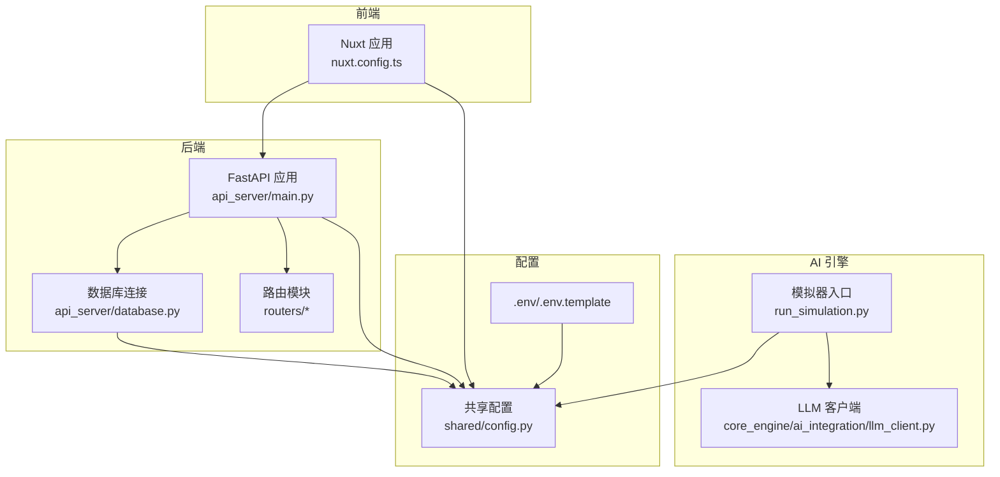
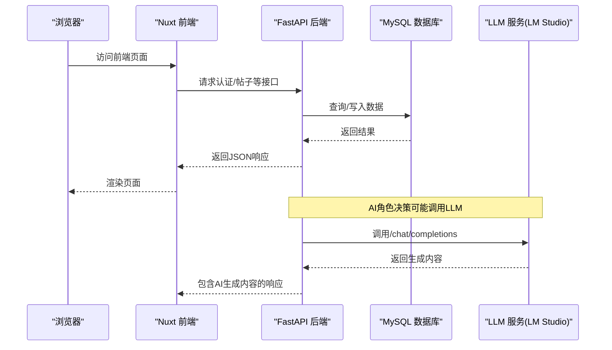
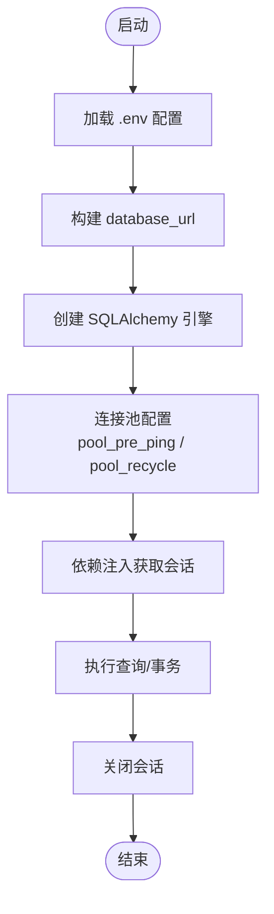
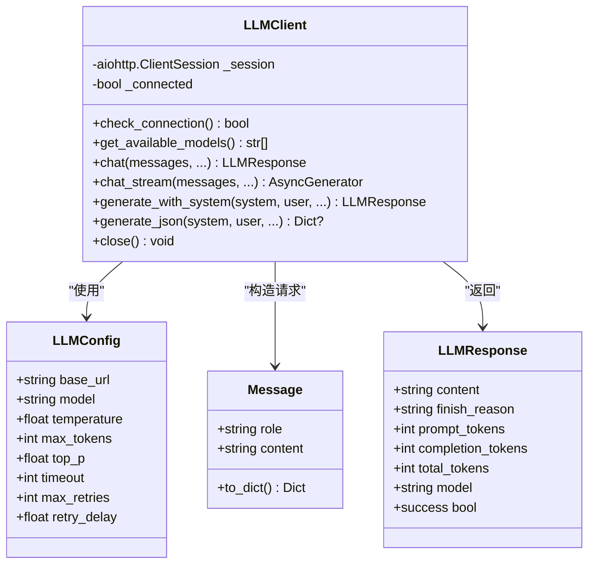
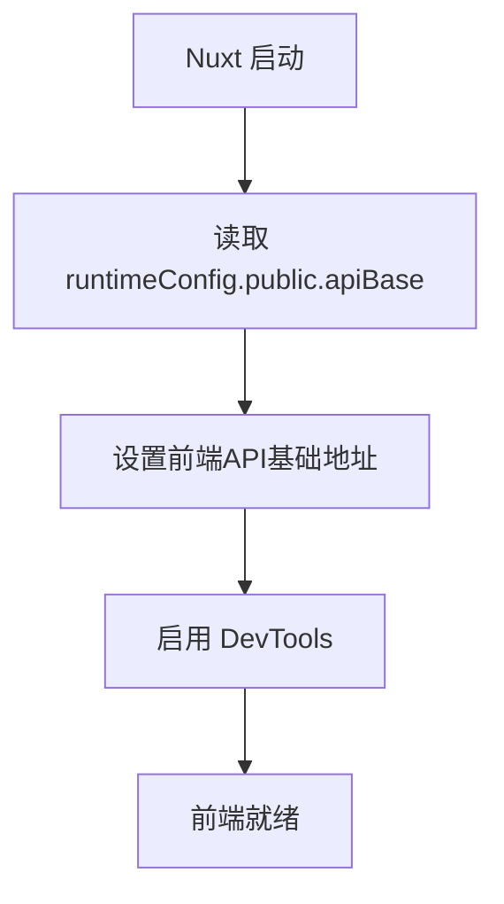
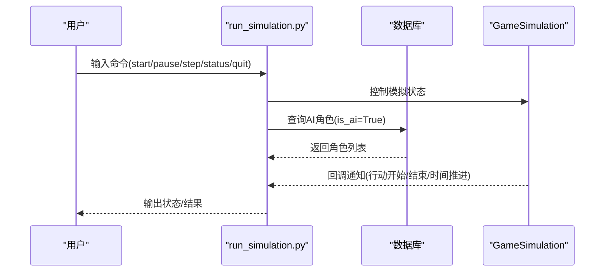
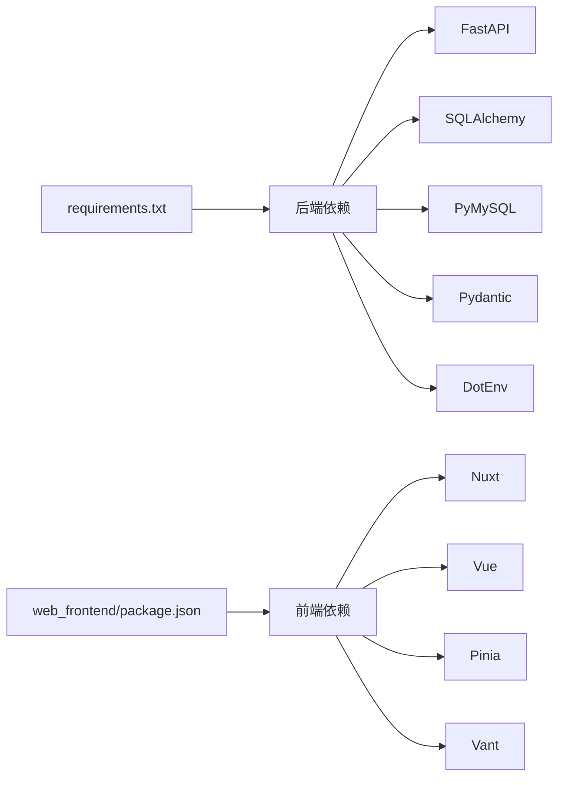

# 故障排除

<cite>
**本文引用的文件**
- [README.md](file://README.md)
- [.env](file://.env)
- [.env.template](file://.env.template)
- [requirements.txt](file://requirements.txt)
- [api_server/main.py](file://api_server/main.py)
- [api_server/database.py](file://api_server/database.py)
- [api_server/routers/auth.py](file://api_server/routers/auth.py)
- [api_server/routers/posts.py](file://api_server/routers/posts.py)
- [core_engine/ai_integration/llm_client.py](file://core_engine/ai_integration/llm_client.py)
- [shared/config.py](file://shared/config.py)
- [web_frontend/package.json](file://web_frontend/package.json)
- [web_frontend/nuxt.config.ts](file://web_frontend/nuxt.config.ts)
- [run_simulation.py](file://run_simulation.py)
- [init_db.py](file://init_db.py)
</cite>

## 目录
1. [简介](#简介)
2. [项目结构](#项目结构)
3. [核心组件](#核心组件)
4. [架构总览](#架构总览)
5. [详细组件分析](#详细组件分析)
6. [依赖关系分析](#依赖关系分析)
7. [性能考虑](#性能考虑)
8. [故障排除指南](#故障排除指南)
9. [结论](#结论)
10. [附录](#附录)

## 简介
本指南面向AI社区项目的开发者与运维人员，系统化地梳理常见问题的诊断与解决流程，覆盖数据库连接、LLM服务连接、前端编译与运行、性能问题识别与优化、配置问题诊断、错误码与异常解读、开发与生产环境差异排查，以及预防性维护与监控告警建议。内容结合仓库中的实际实现文件，提供可操作的排障步骤与可视化图示。

## 项目结构
项目采用分层架构：
- 后端API服务：FastAPI + SQLAlchemy，提供认证、用户、帖子、评论、文件、消息等接口，并通过CORS允许前端访问。
- AI模拟引擎：事件驱动的时间模型，结合LLM进行角色决策。
- 前端：Nuxt 3 + Vue 3，Pinia状态管理，移动端UI组件库。
- 共享配置：统一从环境变量加载数据库、JWT、服务器、文件存储、AI相关等配置。

图表来源
- [api_server/main.py](file://api_server/main.py#L1-L69)
- [api_server/database.py](file://api_server/database.py#L1-L33)
- [shared/config.py](file://shared/config.py#L1-L52)
- [web_frontend/nuxt.config.ts](file://web_frontend/nuxt.config.ts#L1-L42)
- [run_simulation.py](file://run_simulation.py#L1-L258)
- [core_engine/ai_integration/llm_client.py](file://core_engine/ai_integration/llm_client.py#L1-L351)
- [.env](file://.env#L1-L30)
- [.env.template](file://.env.template#L1-L30)

章节来源
- [README.md](file://README.md#L1-L290)
- [api_server/main.py](file://api_server/main.py#L1-L69)
- [shared/config.py](file://shared/config.py#L1-L52)

## 核心组件
- 共享配置与环境变量：集中定义数据库、JWT、API主机端口、前端地址、文件存储路径与AI相关预留字段，支持从.env加载。
- 后端API：CORS跨域配置、健康检查端点、路由注册；数据库连接池配置与依赖注入。
- LLM客户端：异步HTTP客户端封装，支持连接检查、模型列表获取、聊天、流式聊天、JSON生成与重试机制。
- 前端Nuxt：运行时配置API基础地址，CSS与模块引入，开发工具启用。
- 模拟器：交互式/步进式运行，加载AI角色，注册事件回调，时间推进逻辑。

章节来源
- [shared/config.py](file://shared/config.py#L1-L52)
- [api_server/main.py](file://api_server/main.py#L1-L69)
- [api_server/database.py](file://api_server/database.py#L1-L33)
- [core_engine/ai_integration/llm_client.py](file://core_engine/ai_integration/llm_client.py#L1-L351)
- [web_frontend/nuxt.config.ts](file://web_frontend/nuxt.config.ts#L1-L42)
- [run_simulation.py](file://run_simulation.py#L1-L258)

## 架构总览
下图展示从浏览器到后端API再到数据库与LLM服务的关键调用链路，以及模拟器与LLM交互的时序。

图表来源
- [api_server/main.py](file://api_server/main.py#L1-L69)
- [api_server/database.py](file://api_server/database.py#L1-L33)
- [core_engine/ai_integration/llm_client.py](file://core_engine/ai_integration/llm_client.py#L106-L171)
- [web_frontend/nuxt.config.ts](file://web_frontend/nuxt.config.ts#L15-L19)

## 详细组件分析

### 数据库连接组件分析
- 连接池配置：启用pre_ping与回收策略，避免僵尸连接；通过依赖注入提供会话生命周期管理。
- 路由层使用数据库依赖：每个请求获取独立会话，结束后关闭，减少资源泄露风险。
- 初始化脚本：读取.env配置，连接MySQL执行迁移SQL，忽略重复键与表已存在等非致命错误。

图表来源
- [shared/config.py](file://shared/config.py#L40-L46)
- [api_server/database.py](file://api_server/database.py#L14-L33)
- [api_server/routers/auth.py](file://api_server/routers/auth.py#L1-L78)
- [init_db.py](file://init_db.py#L18-L57)

章节来源
- [api_server/database.py](file://api_server/database.py#L1-L33)
- [api_server/routers/auth.py](file://api_server/routers/auth.py#L1-L78)
- [init_db.py](file://init_db.py#L1-L70)
- [shared/config.py](file://shared/config.py#L1-L52)

### LLM客户端组件分析
- 异步HTTP会话：使用aiohttp.ClientSession，支持超时控制与重试。
- 连接检查：访问模型列表端点，判断服务可达性。
- 聊天与流式聊天：构造OpenAI兼容请求体，支持停止词、温度、最大token等参数。
- JSON生成：约束模型输出JSON格式，尝试提取代码块内的JSON并解析。
- 单例客户端：全局唯一实例，支持按需更新配置。

图表来源
- [core_engine/ai_integration/llm_client.py](file://core_engine/ai_integration/llm_client.py#L14-L52)
- [core_engine/ai_integration/llm_client.py](file://core_engine/ai_integration/llm_client.py#L54-L317)

章节来源
- [core_engine/ai_integration/llm_client.py](file://core_engine/ai_integration/llm_client.py#L1-L351)

### 前端Nuxt组件分析
- 运行时配置：通过runtimeConfig.public.apiBase读取API基础地址，默认指向后端API端口。
- 模块与样式：启用Pinia与Vant模块，引入全局样式。
- 开发工具：DevTools启用，便于调试。

图表来源
- [web_frontend/nuxt.config.ts](file://web_frontend/nuxt.config.ts#L15-L19)
- [web_frontend/package.json](file://web_frontend/package.json#L1-L28)

章节来源
- [web_frontend/nuxt.config.ts](file://web_frontend/nuxt.config.ts#L1-L42)
- [web_frontend/package.json](file://web_frontend/package.json#L1-L28)

### 模拟器与AI角色分析
- 交互式/步进式运行：支持启动、停止、暂停、恢复、单步执行、状态查看等命令。
- AI角色加载：从数据库筛选is_ai=True的用户作为AI角色。
- 回调注册：行动开始/结束、时间推进等事件回调用于观测模拟状态。
- 配置项：最大时间跳跃、决策超时、初始时间等。

图表来源
- [run_simulation.py](file://run_simulation.py#L54-L186)
- [run_simulation.py](file://run_simulation.py#L188-L233)

章节来源
- [run_simulation.py](file://run_simulation.py#L1-L258)

## 依赖关系分析
- Python依赖：FastAPI、SQLAlchemy、PyMySQL、Pydantic、python-jose、aiofiles、python-dotenv等。
- 前端依赖：Nuxt 3、Vue 3、Pinia、Vant等。
- 环境变量：数据库、JWT、API主机端口、前端地址、文件存储、AI预留字段等。

图表来源
- [requirements.txt](file://requirements.txt#L1-L32)
- [web_frontend/package.json](file://web_frontend/package.json#L1-L28)

章节来源
- [requirements.txt](file://requirements.txt#L1-L32)
- [web_frontend/package.json](file://web_frontend/package.json#L1-L28)

## 性能考虑
- 数据库连接池
  - 建议：开启pool_pre_ping与合理pool_recycle，避免长时间空闲导致连接失效；控制并发连接上限，避免数据库压力过大。
  - 参考：连接池配置与依赖注入会话管理。
- LLM调用
  - 建议：合理设置超时与重试间隔；对流式响应进行背压控制；避免频繁创建会话，利用单例客户端。
  - 参考：LLM客户端超时、重试与会话复用。
- 前端构建与运行
  - 建议：开发模式启用DevTools但避免生产环境冗余日志；生产构建时启用压缩与Tree-shaking。
  - 参考：Nuxt配置与包管理脚本。
- 模拟器性能
  - 建议：批量加载AI角色，合并回调输出；控制最大时间跳跃与决策超时，避免长时间阻塞。
  - 参考：模拟器配置与回调注册。

章节来源
- [api_server/database.py](file://api_server/database.py#L14-L33)
- [core_engine/ai_integration/llm_client.py](file://core_engine/ai_integration/llm_client.py#L66-L78)
- [web_frontend/nuxt.config.ts](file://web_frontend/nuxt.config.ts#L1-L42)
- [run_simulation.py](file://run_simulation.py#L60-L73)

## 故障排除指南

### 一、数据库连接问题
- 症状
  - 后端启动时报连接错误、路由查询失败、健康检查异常。
- 诊断步骤
  - 确认MySQL服务已启动且可访问。
  - 检查环境变量与共享配置中的数据库连接串是否匹配。
  - 使用初始化脚本验证SQL迁移是否成功执行。
  - 在路由层捕获并记录SQLAlchemy异常，确认依赖注入会话是否正常关闭。
- 解决方案
  - 修改.env中的数据库凭据与主机端口，确保与实际环境一致。
  - 如为容器/远程数据库，检查防火墙与网络策略。
  - 对于重复键/表已存在等非致命错误，初始化脚本已做忽略处理，可继续使用。
- 相关实现
  - 连接池与依赖注入：[api_server/database.py](file://api_server/database.py#L14-L33)
  - 环境变量加载与URL拼装：[shared/config.py](file://shared/config.py#L40-L46)
  - 初始化脚本与错误处理：[init_db.py](file://init_db.py#L18-L57)
  - 路由层数据库使用示例：[api_server/routers/auth.py](file://api_server/routers/auth.py#L20-L42)

章节来源
- [api_server/database.py](file://api_server/database.py#L1-L33)
- [shared/config.py](file://shared/config.py#L1-L52)
- [init_db.py](file://init_db.py#L1-L70)
- [api_server/routers/auth.py](file://api_server/routers/auth.py#L1-L78)

### 二、LLM服务连接问题
- 症状
  - LLM连接检查失败、聊天请求超时、模型列表获取失败、JSON生成解析失败。
- 诊断步骤
  - 确认本地LLM服务已启动并监听默认端口。
  - 使用测试脚本验证连接与模型列表。
  - 检查网络连通性与防火墙策略。
  - 查看客户端打印的错误信息与HTTP状态码。
- 解决方案
  - 启动LM Studio并加载模型，确保端口与base_url一致。
  - 调整超时与重试参数，避免短时波动导致失败。
  - 对于JSON生成，确保系统提示词明确要求仅输出JSON。
- 相关实现
  - 连接检查与模型列表：[core_engine/ai_integration/llm_client.py](file://core_engine/ai_integration/llm_client.py#L80-L104)
  - 聊天与流式聊天：[core_engine/ai_integration/llm_client.py](file://core_engine/ai_integration/llm_client.py#L106-L227)
  - JSON生成与解析：[core_engine/ai_integration/llm_client.py](file://core_engine/ai_integration/llm_client.py#L253-L299)
  - 测试入口：[core_engine/ai_integration/llm_client.py](file://core_engine/ai_integration/llm_client.py#L319-L346)

章节来源
- [core_engine/ai_integration/llm_client.py](file://core_engine/ai_integration/llm_client.py#L1-L351)

### 三、前端编译与运行问题
- 症状
  - npm install失败、dev启动报错、构建产物缺失、静态资源无法访问。
- 诊断步骤
  - 检查Node版本与依赖完整性，清理缓存后重新安装。
  - 确认Nuxt运行时配置的API基础地址与后端一致。
  - 查看构建日志中的错误堆栈，定位具体模块或样式问题。
- 解决方案
  - 使用推荐的Node版本，确保网络可访问npm源。
  - 在nuxt.config.ts中校准runtimeConfig.public.apiBase。
  - 生产构建时检查静态资源路径与CDN配置。
- 相关实现
  - 依赖与脚本：[web_frontend/package.json](file://web_frontend/package.json#L1-L28)
  - 运行时配置：[web_frontend/nuxt.config.ts](file://web_frontend/nuxt.config.ts#L15-L19)

章节来源
- [web_frontend/package.json](file://web_frontend/package.json#L1-L28)
- [web_frontend/nuxt.config.ts](file://web_frontend/nuxt.config.ts#L1-L42)

### 四、性能问题识别与优化
- 内存泄漏
  - 症状：进程RSS持续增长、GC不回收、长时间运行后卡顿。
  - 排查：检查数据库会话是否正确关闭；LLM客户端会话是否及时释放；前端组件是否正确卸载。
  - 优化：确保依赖注入的会话在finally中关闭；客户端会话在不再使用时调用close。
- CPU占用
  - 症状：模拟器步进缓慢、LLM请求阻塞、路由处理耗时。
  - 排查：观察回调输出频率与日志密度；检查超时与重试配置。
  - 优化：降低verbose级别；合理设置决策超时；避免在回调中执行重型同步操作。
- I/O瓶颈
  - 症状：数据库慢查询、文件上传失败、磁盘IO高。
  - 排查：检查慢查询日志、文件存储路径权限、磁盘空间。
  - 优化：索引优化、分页查询、异步文件处理。
- 相关实现
  - 会话关闭与依赖注入：[api_server/database.py](file://api_server/database.py#L26-L33)
  - LLM客户端关闭：[core_engine/ai_integration/llm_client.py](file://core_engine/ai_integration/llm_client.py#L73-L78)
  - 模拟器配置与回调：[run_simulation.py](file://run_simulation.py#L60-L84)

章节来源
- [api_server/database.py](file://api_server/database.py#L1-L33)
- [core_engine/ai_integration/llm_client.py](file://core_engine/ai_integration/llm_client.py#L1-L351)
- [run_simulation.py](file://run_simulation.py#L1-L258)

### 五、配置问题诊断
- 环境变量错误
  - 症状：数据库连接失败、JWT签名异常、API端口不可达、前端无法访问。
  - 排查：核对.env与.env.template中的各项配置，确保未留默认占位符。
  - 修复：替换默认密钥、端口、主机、数据库名与密码。
- 路径配置
  - 症状：文件上传失败、静态资源路径错误。
  - 排查：确认上传目录存在且具备写权限；检查URL前缀与静态文件映射。
- 权限问题
  - 症状：数据库写入失败、文件写入失败。
  - 排查：检查用户权限与操作系统ACL；确保服务账户具备相应权限。
- 相关实现
  - 环境变量加载与URL拼装：[shared/config.py](file://shared/config.py#L40-L46)
  - 默认配置与模板：[.env](file://.env#L1-L30), [.env.template](file://.env.template#L1-L30)

章节来源
- [shared/config.py](file://shared/config.py#L1-L52)
- [.env](file://.env#L1-L30)
- [.env.template](file://.env.template#L1-L30)

### 六、错误代码与异常信息解读
- 数据库类错误
  - IntegrityError：重复键冲突，通常可忽略并继续执行。
  - ProgrammingError：SQL语法或对象不存在等错误，需修正SQL或对象名。
  - 参考：[init_db.py](file://init_db.py#L45-L53)
- LLM类错误
  - 连接失败/超时：检查服务端口与网络连通性。
  - JSON解析失败：检查系统提示词是否强制仅输出JSON。
  - 参考：[core_engine/ai_integration/llm_client.py](file://core_engine/ai_integration/llm_client.py#L162-L168), [core_engine/ai_integration/llm_client.py](file://core_engine/ai_integration/llm_client.py#L294-L299)
- 前端构建错误
  - 依赖缺失：执行npm install并清理缓存。
  - 配置错误：核对nuxt.config.ts中的runtimeConfig与模块配置。
  - 参考：[web_frontend/package.json](file://web_frontend/package.json#L1-L28), [web_frontend/nuxt.config.ts](file://web_frontend/nuxt.config.ts#L1-L42)

章节来源
- [init_db.py](file://init_db.py#L1-L70)
- [core_engine/ai_integration/llm_client.py](file://core_engine/ai_integration/llm_client.py#L1-L351)
- [web_frontend/package.json](file://web_frontend/package.json#L1-L28)
- [web_frontend/nuxt.config.ts](file://web_frontend/nuxt.config.ts#L1-L42)

### 七、开发环境与生产环境不同排查方法
- 开发环境
  - 启用DevTools与详细日志，便于快速定位问题。
  - 使用默认端口与localhost，简化网络排查。
  - 参考：[web_frontend/nuxt.config.ts](file://web_frontend/nuxt.config.ts#L3-L3)
- 生产环境
  - 固定API主机与端口，配置反向代理与HTTPS。
  - 设置安全的JWT密钥与过期策略，避免硬编码默认值。
  - 优化数据库连接池与LLM超时参数，提升稳定性。
  - 参考：[shared/config.py](file://shared/config.py#L14-L17), [api_server/main.py](file://api_server/main.py#L62-L68)

章节来源
- [web_frontend/nuxt.config.ts](file://web_frontend/nuxt.config.ts#L1-L42)
- [shared/config.py](file://shared/config.py#L1-L52)
- [api_server/main.py](file://api_server/main.py#L61-L68)

### 八、预防性维护与监控告警建议
- 日志与可观测性
  - 后端：记录关键请求与异常，区分info/warn/error级别。
  - LLM：记录请求耗时、重试次数、错误码与响应摘要。
  - 前端：保留DevTools日志，生产环境仅保留必要错误日志。
- 健康检查与告警
  - API健康端点：定期探测/health，失败即告警。
  - 数据库：连接池空闲/等待队列长度阈值告警。
  - LLM：可用性与响应延迟阈值告警。
- 配置审计
  - 定期比对.env与.env.template，确保敏感信息未提交至仓库。
  - 参考：[README.md](file://README.md#L194-L213)

章节来源
- [README.md](file://README.md#L194-L213)
- [api_server/main.py](file://api_server/main.py#L55-L58)

## 结论
本指南基于仓库中的实际实现，提供了从配置、连接、调用到性能与运维的全链路排障方法。建议在开发阶段充分利用DevTools与详细日志，在生产阶段强化健康检查、连接池与LLM超时配置，并建立完善的监控与告警体系，以保障系统的稳定运行。

## 附录
- 快速检查清单
  - 数据库：服务在线、凭据正确、迁移成功、连接池健康。
  - LLM：服务在线、端口正确、模型可用、超时与重试合理。
  - 前端：依赖安装完成、API基础地址正确、构建产物存在。
  - 性能：会话正确关闭、回调不阻塞、I/O瓶颈识别与优化。
  - 配置：环境变量完整、路径与权限正确、敏感信息安全。