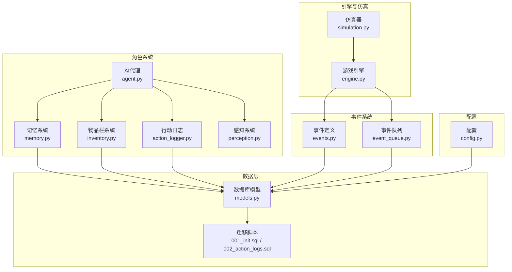
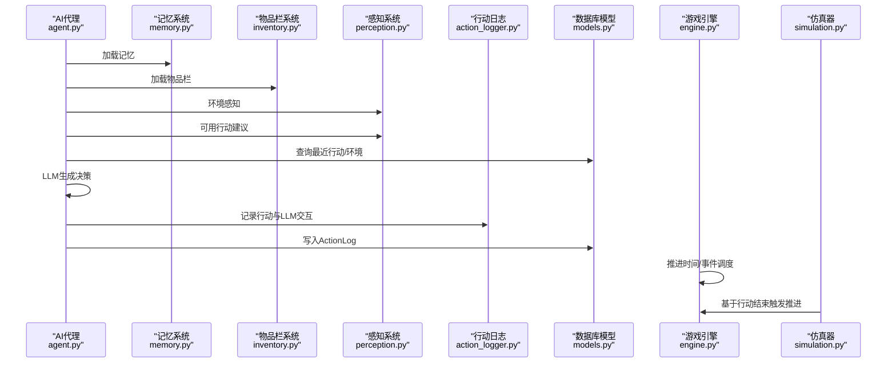
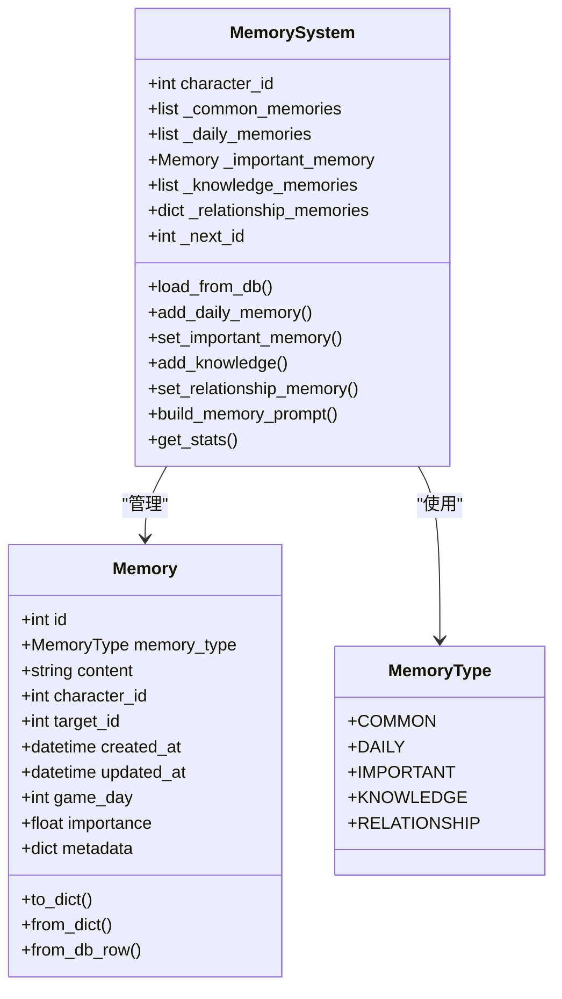
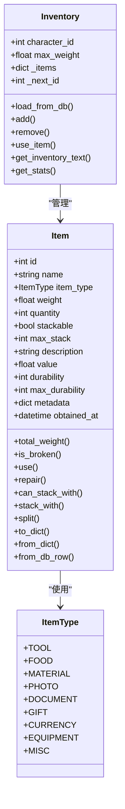
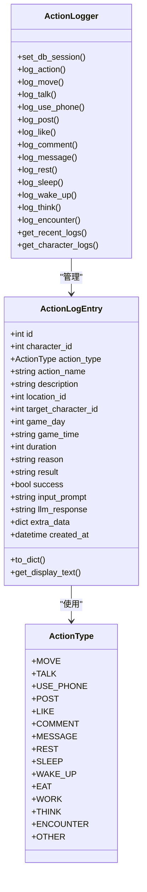
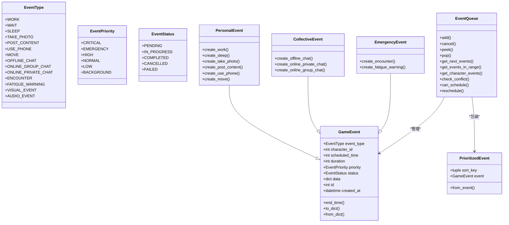
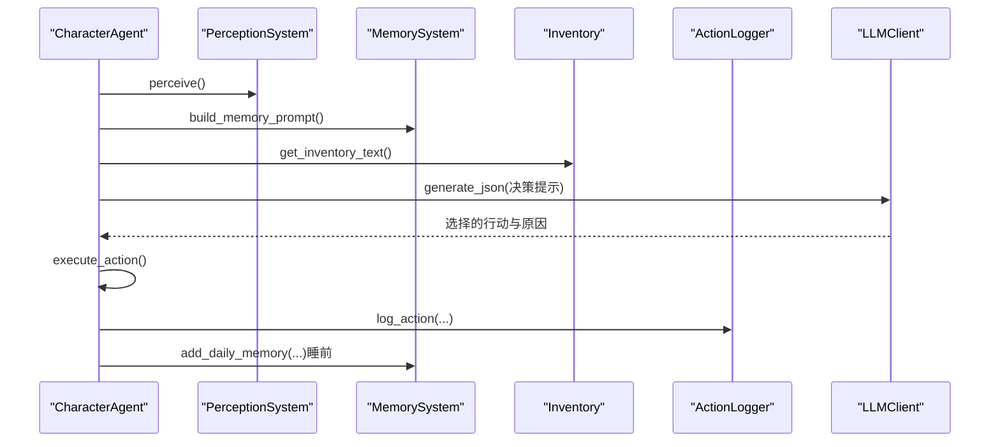
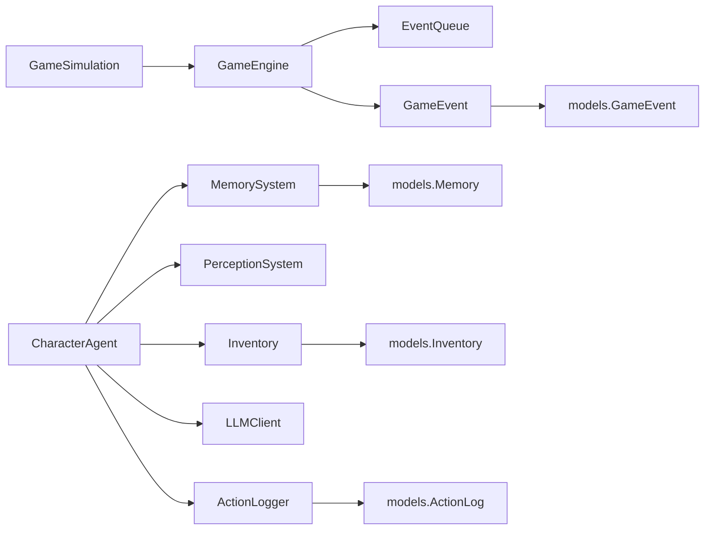

# AI角色模型

<cite>
**本文引用的文件**
- [memory.py](file://core_engine/character/memory.py)
- [inventory.py](file://core_engine/character/inventory.py)
- [action_logger.py](file://core_engine/character/action_logger.py)
- [events.py](file://core_engine/event_system/events.py)
- [event_queue.py](file://core_engine/event_system/event_queue.py)
- [models.py](file://api_server/models.py)
- [agent.py](file://core_engine/character/agent.py)
- [perception.py](file://core_engine/character/perception.py)
- [001_init.sql](file://data/migrations/001_init.sql)
- [002_action_logs.sql](file://data/migrations/002_action_logs.sql)
- [engine.py](file://core_engine/engine.py)
- [simulation.py](file://core_engine/simulation.py)
- [config.py](file://shared/config.py)
</cite>

## 目录
1. [简介](#简介)
2. [项目结构](#项目结构)
3. [核心组件](#核心组件)
4. [架构总览](#架构总览)
5. [详细组件分析](#详细组件分析)
6. [依赖分析](#依赖分析)
7. [性能考量](#性能考量)
8. [故障排查指南](#故障排查指南)
9. [结论](#结论)
10. [附录](#附录)

## 简介
本文件面向AI角色相关模型，系统性梳理并说明以下数据模型与AI系统集成要点：
- 记忆模型（Memory）及其类型枚举（COMMON、DAILY、IMPORTANT、KNOWLEDGE、RELATIONSHIP）
- 物品栏模型（Inventory）与物品（Item）的重量计算与属性系统
- 行动日志模型（ActionLog）的详细记录机制（行动类型、原因分析、LLM交互记录）
- 游戏事件模型（GameEvent）的调度机制与状态管理
- AI角色数据的持久化策略与性能优化方案
- AI行为数据的分析与统计功能
- AI角色数据的备份与恢复机制

## 项目结构
围绕AI角色的核心模块主要分布在以下路径：
- 核心角色系统：core_engine/character 下的 memory.py、inventory.py、action_logger.py、agent.py、perception.py
- 事件系统：core_engine/event_system 下的 events.py、event_queue.py
- 数据库模型与迁移：api_server/models.py、data/migrations/*.sql
- 引擎与仿真：core_engine/engine.py、core_engine/simulation.py
- 配置：shared/config.py

图表来源
- [memory.py](file://core_engine/character/memory.py#L1-L525)
- [inventory.py](file://core_engine/character/inventory.py#L1-L547)
- [action_logger.py](file://core_engine/character/action_logger.py#L1-L481)
- [events.py](file://core_engine/event_system/events.py#L1-L356)
- [event_queue.py](file://core_engine/event_system/event_queue.py#L1-L244)
- [models.py](file://api_server/models.py#L1-L293)
- [001_init.sql](file://data/migrations/001_init.sql#L1-L205)
- [002_action_logs.sql](file://data/migrations/002_action_logs.sql#L1-L44)
- [engine.py](file://core_engine/engine.py#L1-L200)
- [simulation.py](file://core_engine/simulation.py#L1-L200)
- [config.py](file://shared/config.py#L1-L52)

章节来源
- [memory.py](file://core_engine/character/memory.py#L1-L525)
- [inventory.py](file://core_engine/character/inventory.py#L1-L547)
- [action_logger.py](file://core_engine/character/action_logger.py#L1-L481)
- [events.py](file://core_engine/event_system/events.py#L1-L356)
- [event_queue.py](file://core_engine/event_system/event_queue.py#L1-L244)
- [models.py](file://api_server/models.py#L1-L293)
- [001_init.sql](file://data/migrations/001_init.sql#L1-L205)
- [002_action_logs.sql](file://data/migrations/002_action_logs.sql#L1-L44)
- [engine.py](file://core_engine/engine.py#L1-L200)
- [simulation.py](file://core_engine/simulation.py#L1-L200)
- [config.py](file://shared/config.py#L1-L52)

## 核心组件
- 记忆系统（MemorySystem）：管理COMMON、DAILY、IMPORTANT、KNOWLEDGE、RELATIONSHIP五种记忆类型，支持加载、保存、检索、汇总与统计。
- 物品栏系统（Inventory）：管理角色物品，支持重量限制、堆叠、耐久度、使用与修复等。
- 行动日志（ActionLogger）：记录AI角色的行动，包含行动类型、原因、结果、LLM交互记录与扩展数据。
- 游戏事件（GameEvent）：定义事件类型、优先级、状态，配合事件队列进行调度与冲突检测。
- AI代理（CharacterAgent）：整合感知、记忆、物品栏与LLM，驱动每日流程与行动决策。
- 感知系统（PerceptionSystem）：提供环境感知、身体状态与可用行动建议。
- 数据库模型（models.py）：定义Memory、Inventory、ActionLog、GameEvent等表结构与关系。
- 引擎与仿真（engine.py、simulation.py）：提供时间推进、事件调度与AI驱动的仿真主循环。

章节来源
- [memory.py](file://core_engine/character/memory.py#L92-L525)
- [inventory.py](file://core_engine/character/inventory.py#L194-L474)
- [action_logger.py](file://core_engine/character/action_logger.py#L89-L481)
- [events.py](file://core_engine/event_system/events.py#L55-L356)
- [event_queue.py](file://core_engine/event_system/event_queue.py#L29-L244)
- [agent.py](file://core_engine/character/agent.py#L116-L800)
- [perception.py](file://core_engine/character/perception.py#L211-L528)
- [models.py](file://api_server/models.py#L63-L293)
- [engine.py](file://core_engine/engine.py#L167-L200)
- [simulation.py](file://core_engine/simulation.py#L64-L200)

## 架构总览
AI角色数据模型通过数据库模型与迁移脚本落地到MySQL，AI代理在运行时加载角色的记忆与物品栏，结合感知系统与LLM生成行动决策，并将行动与LLM交互记录写入行动日志。事件系统负责事件的调度与冲突检测，引擎与仿真层协调时间推进与角色任务堆。

图表来源
- [agent.py](file://core_engine/character/agent.py#L181-L522)
- [memory.py](file://core_engine/character/memory.py#L119-L167)
- [inventory.py](file://core_engine/character/inventory.py#L209-L227)
- [perception.py](file://core_engine/character/perception.py#L226-L303)
- [action_logger.py](file://core_engine/character/action_logger.py#L103-L161)
- [models.py](file://api_server/models.py#L254-L293)
- [engine.py](file://core_engine/engine.py#L198-L200)
- [simulation.py](file://core_engine/simulation.py#L188-L200)

## 详细组件分析

### 记忆模型（MemorySystem）
- 类型枚举与含义
  - COMMON：共同记忆，所有AI共享的世界设定，用于构建系统提示词。
  - DAILY：日常记忆，按游戏天数存储，最多14条，自动覆盖最旧者。
  - IMPORTANT：重要记忆，单条长文本，字符上限1000，重要度1.0。
  - KNOWLEDGE：知识记忆，支持重要度评分，上限50条，超出时淘汰最低重要度。
  - RELATIONSHIP：关系记忆，针对特定角色，每目标仅保留一条。
- 重要性评分机制
  - Memory.importance为0-1浮点数；数据库层以1-10整数存储，加载时转换为0-1。
  - 知识记忆按importance排序淘汰，确保高价值知识优先留存。
- 上下文构建与提示词
  - 提供构建记忆提示词的方法，支持选择性包含类型，便于LLM决策。
- 统计与导出
  - 提供统计接口，包含各类记忆数量、长度、关系数等。

图表来源
- [memory.py](file://core_engine/character/memory.py#L14-L90)
- [memory.py](file://core_engine/character/memory.py#L92-L525)

章节来源
- [memory.py](file://core_engine/character/memory.py#L14-L90)
- [memory.py](file://core_engine/character/memory.py#L92-L525)
- [models.py](file://api_server/models.py#L63-L78)
- [001_init.sql](file://data/migrations/001_init.sql#L29-L43)

### 物品栏模型（Inventory）
- 物品类型（ItemType）
  - TOOL、FOOD、MATERIAL、PHOTO、DOCUMENT、GIFT、CURRENCY、EQUIPMENT、MISC。
- 属性系统
  - 重量weight、数量quantity、是否可堆叠stackable、最大堆叠max_stack。
  - 可选属性：价值value、耐久度durability/max_durability。
  - 元数据metadata用于扩展信息（如照片描述、手机动作集合）。
- 重量计算与限制
  - Item.total_weight = weight × quantity。
  - Inventory.current_weight为所有物品总重量；available_weight=max_weight-current_weight。
  - can_add(item)判断是否可添加；超重时拒绝。
- 堆叠与分割
  - can_stack_with(other)判断是否可堆叠；stack_with(other)合并剩余；split(amount)分割物品。
- 使用与修复
  - use()消耗耐久度；repair(amount)修复；is_broken判断损坏。
- 统计与导出
  - 提供按类型统计、百分比占用等信息。

图表来源
- [inventory.py](file://core_engine/character/inventory.py#L14-L192)
- [inventory.py](file://core_engine/character/inventory.py#L194-L474)

章节来源
- [inventory.py](file://core_engine/character/inventory.py#L14-L192)
- [inventory.py](file://core_engine/character/inventory.py#L194-L474)
- [models.py](file://api_server/models.py#L220-L233)
- [001_init.sql](file://data/migrations/001_init.sql#L163-L174)

### 行动日志模型（ActionLogger）
- 行动类型（ActionType）
  - MOVE、TALK、USE_PHONE、POST、LIKE、COMMENT、MESSAGE、REST、SLEEP、WAKE_UP、EAT、WORK、THINK、ENCOUNTER、OTHER。
- 记录字段
  - 基本：character_id、action_type、action_name、description、location_id、target_character_id。
  - 时间：game_day、game_time、duration。
  - 决策：reason、result、success。
  - LLM交互：input_prompt、llm_response。
  - 扩展：extra_data、created_at。
- 记录与查询
  - log_action()统一入口；提供多种便捷方法（log_move、log_talk、log_use_phone、log_post、log_like、log_comment、log_message、log_rest、log_sleep、log_wake_up、log_think、log_encounter）。
  - get_recent_logs()与get_character_logs()支持筛选与排序。
- 全局实例
  - get_action_logger()提供全局ActionLogger实例，支持动态设置数据库会话。

图表来源
- [action_logger.py](file://core_engine/character/action_logger.py#L13-L87)
- [action_logger.py](file://core_engine/character/action_logger.py#L89-L481)
- [models.py](file://api_server/models.py#L254-L293)
- [002_action_logs.sql](file://data/migrations/002_action_logs.sql#L7-L43)

章节来源
- [action_logger.py](file://core_engine/character/action_logger.py#L13-L87)
- [action_logger.py](file://core_engine/character/action_logger.py#L89-L481)
- [models.py](file://api_server/models.py#L254-L293)
- [002_action_logs.sql](file://data/migrations/002_action_logs.sql#L1-L44)

### 游戏事件模型（GameEvent）与调度
- 事件类型（EventType）
  - 个人事件：WORK、WAIT、SLEEP、TAKE_PHOTO、POST_CONTENT、USE_PHONE、MOVE。
  - 集体事件：OFFLINE_CHAT、ONLINE_GROUP_CHAT、ONLINE_PRIVATE_CHAT。
  - 突发事件：ENCOUNTER、FATIGUE_WARNING、VISUAL_EVENT、AUDIO_EVENT。
- 优先级（EventPriority）
  - CRITICAL、EMERGENCY、HIGH、NORMAL、LOW、BACKGROUND（数值越小优先级越高）。
- 状态（EventStatus）
  - PENDING、IN_PROGRESS、COMPLETED、CANCELLED、FAILED。
- GameEvent关键属性
  - scheduled_time（游戏分钟）、duration、priority、status、data、end_time（scheduled_time+duration）。
- 事件队列（EventQueue）
  - 基于堆的优先队列，按(scheduled_time, priority, id)排序。
  - 支持冲突检测、重新调度、懒删除取消、范围查询、按角色筛选。
- 引擎集成
  - GameEngine持有EventQueue，推进时间并执行事件；simulation.py基于行动结束触发推进。

图表来源
- [events.py](file://core_engine/event_system/events.py#L13-L129)
- [events.py](file://core_engine/event_system/events.py#L131-L356)
- [event_queue.py](file://core_engine/event_system/event_queue.py#L13-L244)
- [models.py](file://api_server/models.py#L185-L203)

章节来源
- [events.py](file://core_engine/event_system/events.py#L13-L129)
- [events.py](file://core_engine/event_system/events.py#L131-L356)
- [event_queue.py](file://core_engine/event_system/event_queue.py#L29-L244)
- [models.py](file://api_server/models.py#L185-L203)
- [engine.py](file://core_engine/engine.py#L167-L200)

### AI代理与感知（CharacterAgent、PerceptionSystem）
- 角色状态与流程
  - 每日醒来（wake_up）：清理上下文、生成今日计划；睡觉（go_to_sleep）：总结当日事件生成日常记忆。
  - 决策（perceive_and_decide）：结合感知、记忆、物品栏与最近行动，调用LLM生成行动与时长。
  - 执行（execute_action）：调用注册的处理器或默认处理器，记录事件与日志，消耗疲劳。
- 感知系统
  - 获取位置、天气、季节、温度、附近角色与地点、物理状态。
  - 生成可用行动列表（含预估时长），并根据疲劳度建议休息/睡觉。
- LLM交互
  - 记录input_prompt与llm_response，便于审计与分析。

图表来源
- [agent.py](file://core_engine/character/agent.py#L225-L355)
- [agent.py](file://core_engine/character/agent.py#L358-L478)
- [agent.py](file://core_engine/character/agent.py#L479-L522)
- [perception.py](file://core_engine/character/perception.py#L226-L303)
- [memory.py](file://core_engine/character/memory.py#L464-L492)
- [inventory.py](file://core_engine/character/inventory.py#L441-L457)
- [action_logger.py](file://core_engine/character/action_logger.py#L523-L566)

章节来源
- [agent.py](file://core_engine/character/agent.py#L116-L522)
- [perception.py](file://core_engine/character/perception.py#L211-L528)
- [memory.py](file://core_engine/character/memory.py#L446-L513)
- [inventory.py](file://core_engine/character/inventory.py#L441-L457)
- [action_logger.py](file://core_engine/character/action_logger.py#L523-L566)

## 依赖分析
- 数据模型依赖
  - Memory、Inventory、ActionLog、GameEvent均映射到api_server/models.py中的SQLAlchemy模型，具备外键关系与索引。
- 组件耦合
  - CharacterAgent依赖MemorySystem、Inventory、PerceptionSystem、ActionLogger与LLMClient。
  - GameEngine与EventQueue协作调度事件；simulation.py基于Agent任务堆推进。
- 数据一致性
  - 记忆系统与物品栏系统在加载/保存时适配数据库字段差异（如relationship与relation），并进行数值转换（importance）。

图表来源
- [agent.py](file://core_engine/character/agent.py#L116-L144)
- [engine.py](file://core_engine/engine.py#L178-L182)
- [simulation.py](file://core_engine/simulation.py#L75-L86)
- [models.py](file://api_server/models.py#L63-L203)

章节来源
- [agent.py](file://core_engine/character/agent.py#L116-L144)
- [engine.py](file://core_engine/engine.py#L178-L182)
- [simulation.py](file://core_engine/simulation.py#L75-L86)
- [models.py](file://api_server/models.py#L63-L203)

## 性能考量
- 记忆系统
  - 日常记忆限制与知识记忆淘汰降低存储与检索成本；按game_day排序便于快速定位。
  - 重要记忆字符上限控制单条大小，避免过大文本影响序列化与传输。
- 物品栏系统
  - 可堆叠物品减少存储条目；堆叠与分割操作复杂度较低；超重检查在添加前进行，避免无效写入。
  - 耐久度与价值等可选属性按需使用，避免冗余字段。
- 行动日志
  - 采用JSON存储extra_data，便于扩展；索引覆盖character_id、created_at、game_day，支持高效查询。
- 事件系统
  - 事件队列使用堆结构，O(log n)插入与弹出；冲突检测按角色过滤，减少无关比较。
- 引擎与仿真
  - 基于行动结束触发推进，避免空轮询；时间跳跃至最近结束点，提升吞吐。

[本节为通用性能讨论，无需特定文件引用]

## 故障排查指南
- 记忆导入/导出异常
  - 检查数据库字段映射（relationship vs relation）与importance转换（1-10到0-1）。
  - 确认ID计数器与内存缓存一致性。
- 物品栏超重
  - 核对max_weight与current_weight计算；确认堆叠逻辑与分割后ID分配。
- 行动日志写入失败
  - 检查数据库连接与事务提交；确认input_prompt与llm_response长度限制。
- 事件调度冲突
  - 使用check_conflict()与can_schedule()验证；必要时使用reschedule()重新安排。
- LLM交互审计
  - 通过ActionLogger记录的input_prompt与llm_response进行问题复现与调试。

章节来源
- [memory.py](file://core_engine/character/memory.py#L168-L240)
- [inventory.py](file://core_engine/character/inventory.py#L209-L308)
- [action_logger.py](file://core_engine/character/action_logger.py#L103-L161)
- [event_queue.py](file://core_engine/event_system/event_queue.py#L154-L214)

## 结论
AI角色模型通过清晰的分层设计实现了：
- 记忆、物品栏、行动日志与事件系统的协同，支撑角色的长期记忆、物质约束与行为轨迹。
- 与LLM的深度集成，使AI能够基于上下文与状态做出合理决策。
- 健全的持久化与调度机制，保证数据一致性与系统稳定性。
- 可扩展的属性系统与统计接口，便于后续分析与优化。

[本节为总结性内容，无需特定文件引用]

## 附录

### 数据模型与迁移对照
- 记忆表（memories）
  - 字段：user_id、memory_type、target_user_id、content、importance、game_day、created_at。
  - 索引：idx_user_type、idx_game_day。
- 物品栏表（inventory）
  - 字段：user_id、item_name、weight、quantity、properties、created_at。
  - 索引：idx_user。
- 行动日志表（action_logs）
  - 字段：character_id、action_type、action_name、description、location_id、target_character_id、game_day、game_time、duration、reason、result、success、input_prompt、llm_response、extra_data、created_at。
  - 索引：idx_character、idx_created_at、idx_character_time、idx_game_day。
- 游戏事件表（game_events）
  - 字段：event_type、character_id、target_character_id、location_id、scheduled_time、duration、status、data、created_at。
  - 索引：idx_scheduled、idx_status。

章节来源
- [001_init.sql](file://data/migrations/001_init.sql#L29-L43)
- [001_init.sql](file://data/migrations/001_init.sql#L163-L174)
- [002_action_logs.sql](file://data/migrations/002_action_logs.sql#L7-L43)
- [models.py](file://api_server/models.py#L63-L203)

### 配置与数据库连接
- 数据库URL构造：settings.database_url，包含主机、端口、用户名、密码与数据库名。
- 上传目录与前端URL前缀：用于文件存储与访问。
- AI与ComfyUI相关配置：预留扩展。

章节来源
- [config.py](file://shared/config.py#L40-L46)