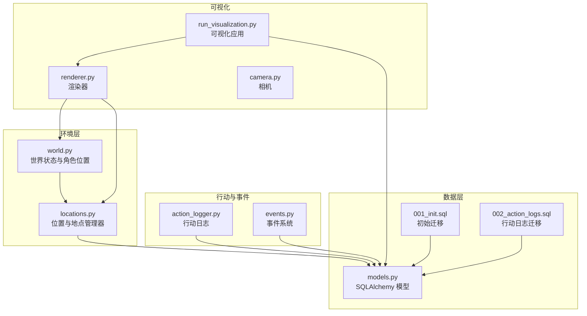
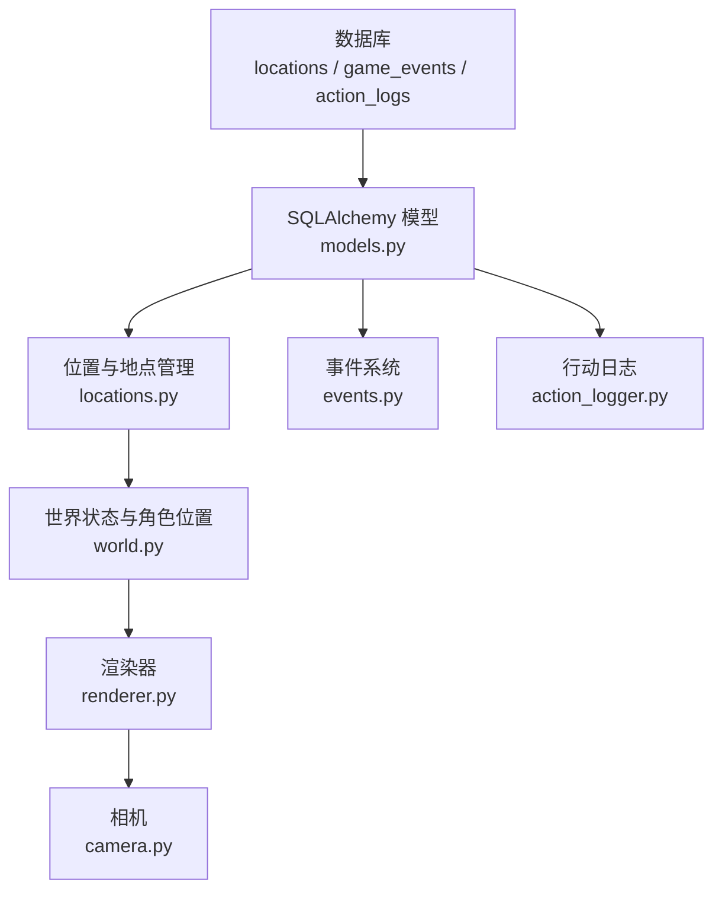
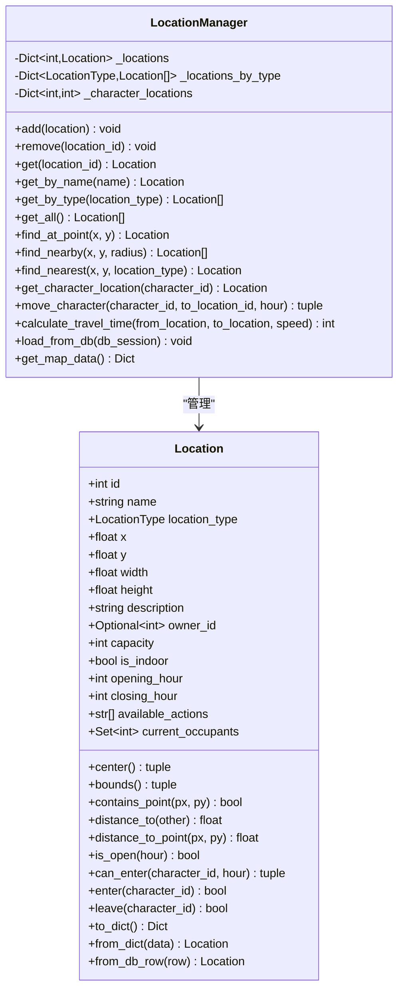
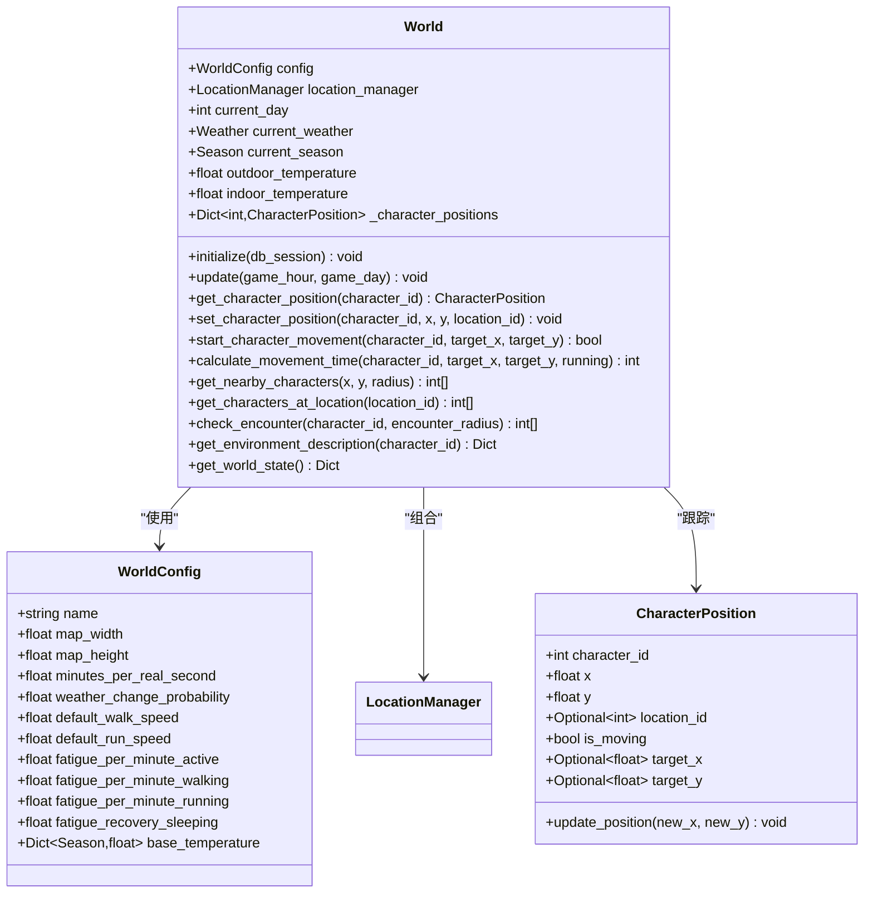
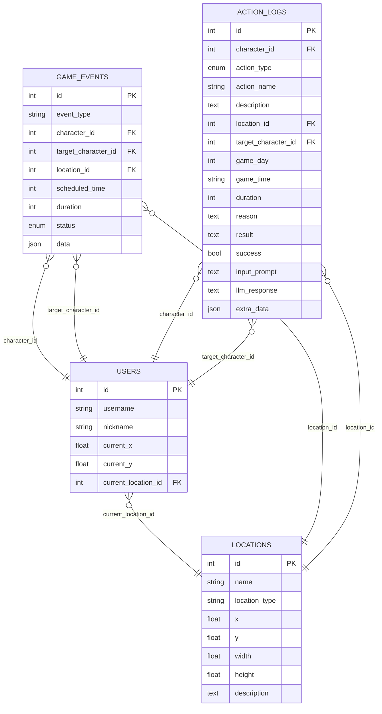
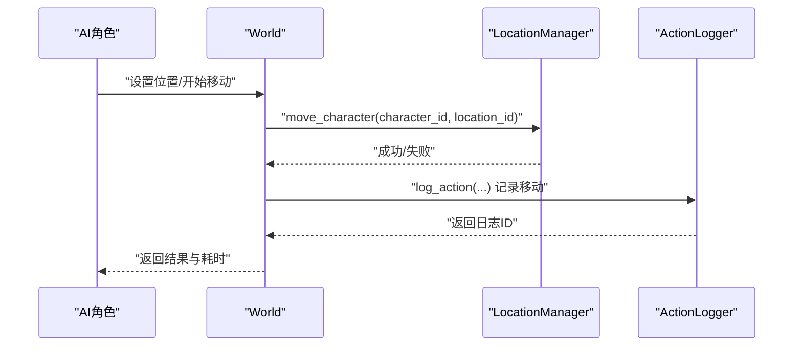
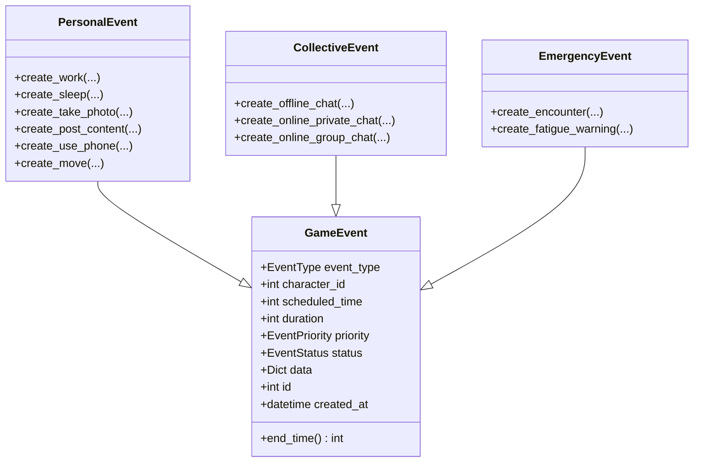
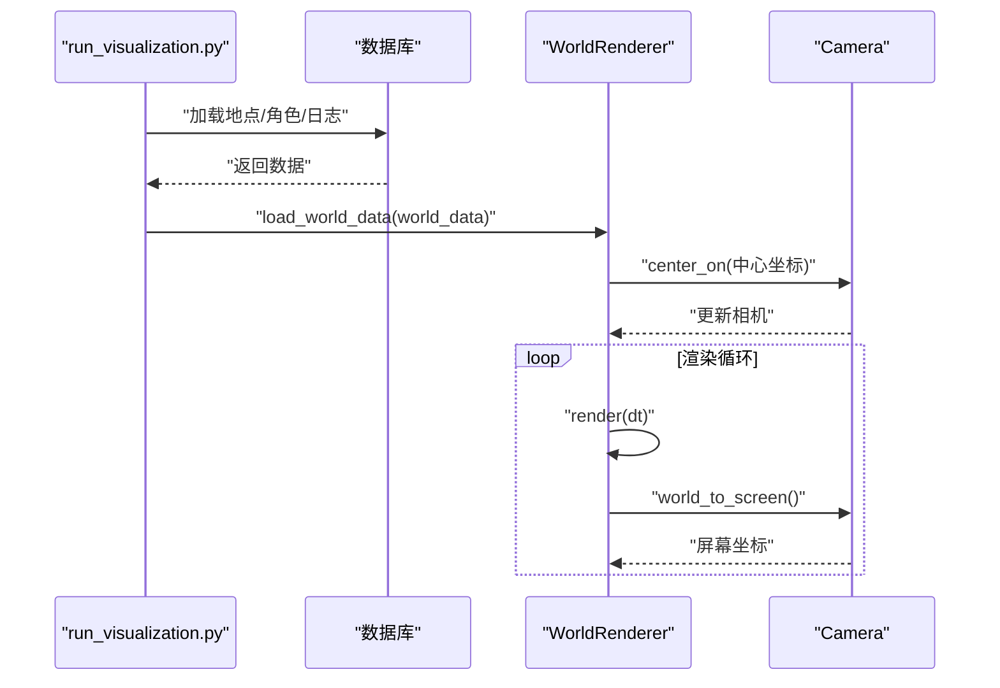
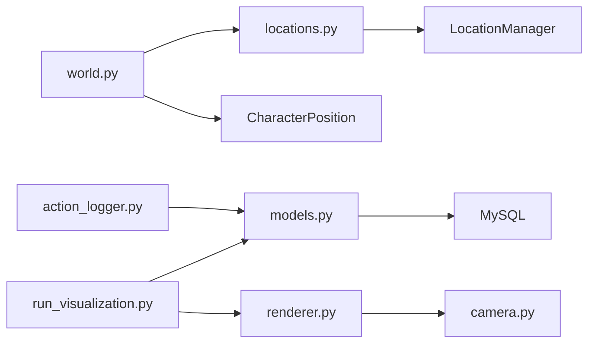

# 位置与世界模型

<cite>
**本文档引用的文件**
- [core_engine/environment/locations.py](file://core_engine/environment/locations.py)
- [core_engine/environment/world.py](file://core_engine/environment/world.py)
- [api_server/models.py](file://api_server/models.py)
- [data/migrations/001_init.sql](file://data/migrations/001_init.sql)
- [data/migrations/002_action_logs.sql](file://data/migrations/002_action_logs.sql)
- [core_engine/character/action_logger.py](file://core_engine/character/action_logger.py)
- [core_engine/event_system/events.py](file://core_engine/event_system/events.py)
- [core_engine/visualization/renderer.py](file://core_engine/visualization/renderer.py)
- [core_engine/visualization/camera.py](file://core_engine/visualization/camera.py)
- [run_visualization.py](file://run_visualization.py)
</cite>

## 目录
1. [简介](#简介)
2. [项目结构](#项目结构)
3. [核心组件](#核心组件)
4. [架构总览](#架构总览)
5. [详细组件分析](#详细组件分析)
6. [依赖关系分析](#依赖关系分析)
7. [性能考量](#性能考量)
8. [故障排查指南](#故障排查指南)
9. [结论](#结论)
10. [附录](#附录)

## 简介
本文件聚焦“位置与世界环境模型”的数据模型设计与实现，涵盖以下主题：
- 位置坐标系统（x、y）与空间范围（width、height）的定义与使用
- 位置类型字段与描述信息的存储机制
- AI角色的位置管理与移动轨迹记录
- 游戏事件与地理位置的关联关系及时间约束
- 空间查询与距离计算的数据库优化策略
- 地图数据的导入导出与可视化支持
- 位置数据的缓存策略与实时更新机制

## 项目结构
围绕位置与世界模型的关键文件组织如下：
- 环境层：位置与世界状态管理
  - core_engine/environment/locations.py：位置与地点管理器
  - core_engine/environment/world.py：世界状态与角色位置跟踪
- 数据层：数据库模型与迁移
  - api_server/models.py：SQLAlchemy 模型定义
  - data/migrations/001_init.sql：初始数据库结构
  - data/migrations/002_action_logs.sql：行动日志表结构
- 行动与事件：行动日志与事件系统
  - core_engine/character/action_logger.py：行动日志记录与查询
  - core_engine/event_system/events.py：事件类型与数据结构
- 可视化：地图渲染与交互
  - core_engine/visualization/renderer.py：Pygame 渲染器
  - core_engine/visualization/camera.py：相机与坐标转换
  - run_visualization.py：可视化应用入口与数据加载

**图表来源**
- [core_engine/environment/locations.py](file://core_engine/environment/locations.py#L176-L336)
- [core_engine/environment/world.py](file://core_engine/environment/world.py#L93-L342)
- [api_server/models.py](file://api_server/models.py#L172-L203)
- [data/migrations/001_init.sql](file://data/migrations/001_init.sql#L118-L148)
- [data/migrations/002_action_logs.sql](file://data/migrations/002_action_logs.sql#L7-L43)
- [core_engine/character/action_logger.py](file://core_engine/character/action_logger.py#L89-L481)
- [core_engine/event_system/events.py](file://core_engine/event_system/events.py#L55-L356)
- [core_engine/visualization/renderer.py](file://core_engine/visualization/renderer.py#L106-L800)
- [core_engine/visualization/camera.py](file://core_engine/visualization/camera.py#L11-L140)
- [run_visualization.py](file://run_visualization.py#L208-L289)

**章节来源**
- [core_engine/environment/locations.py](file://core_engine/environment/locations.py#L1-L336)
- [core_engine/environment/world.py](file://core_engine/environment/world.py#L1-L342)
- [api_server/models.py](file://api_server/models.py#L172-L203)
- [data/migrations/001_init.sql](file://data/migrations/001_init.sql#L118-L148)
- [data/migrations/002_action_logs.sql](file://data/migrations/002_action_logs.sql#L7-L43)
- [core_engine/character/action_logger.py](file://core_engine/character/action_logger.py#L89-L481)
- [core_engine/event_system/events.py](file://core_engine/event_system/events.py#L55-L356)
- [core_engine/visualization/renderer.py](file://core_engine/visualization/renderer.py#L106-L800)
- [core_engine/visualization/camera.py](file://core_engine/visualization/camera.py#L11-L140)
- [run_visualization.py](file://run_visualization.py#L208-L289)

## 核心组件
- 位置模型（Location）：定义二维空间中的矩形区域，包含坐标、尺寸、类型、描述、容量、开放时间等属性，并提供包含点检测、距离计算、进入许可等方法。
- 地点管理器（LocationManager）：维护位置集合、按类型索引、按点查询、邻域查询、最近地点查询、角色位置同步与旅行时间估算。
- 世界模型（World）：管理天气、季节、温度等环境参数，跟踪角色位置与移动状态，提供附近角色查询、相遇检测、环境描述生成等能力。
- 数据模型（SQLAlchemy）：数据库层面的 Location 与 GameEvent 等模型，定义字段、索引与关系。
- 行动日志（ActionLogger）：记录 AI 角色的行动历史，支持查询与展示。
- 事件系统（GameEvent）：定义事件类型、优先级、状态与数据结构，支撑时空约束。
- 可视化渲染（WorldRenderer/Camera）：基于 Pygame 的地图渲染、相机控制与交互。

**章节来源**
- [core_engine/environment/locations.py](file://core_engine/environment/locations.py#L25-L174)
- [core_engine/environment/locations.py](file://core_engine/environment/locations.py#L176-L336)
- [core_engine/environment/world.py](file://core_engine/environment/world.py#L93-L342)
- [api_server/models.py](file://api_server/models.py#L172-L203)
- [core_engine/character/action_logger.py](file://core_engine/character/action_logger.py#L89-L481)
- [core_engine/event_system/events.py](file://core_engine/event_system/events.py#L55-L356)
- [core_engine/visualization/renderer.py](file://core_engine/visualization/renderer.py#L106-L800)
- [core_engine/visualization/camera.py](file://core_engine/visualization/camera.py#L11-L140)

## 架构总览
位置与世界模型贯穿“数据层—业务层—表现层”：
- 数据层：通过 SQLAlchemy 模型与迁移脚本持久化位置、事件与日志；数据库包含位置表与事件表，并建立索引以优化查询。
- 业务层：位置与世界逻辑在 Python 类中实现，负责空间计算、角色位置同步、事件调度与环境描述。
- 表现层：可视化渲染器将世界状态与地图数据映射到屏幕，支持相机缩放与拖拽、网格与标签显示、角色与地点渲染。

**图表来源**
- [api_server/models.py](file://api_server/models.py#L172-L203)
- [data/migrations/001_init.sql](file://data/migrations/001_init.sql#L118-L148)
- [data/migrations/002_action_logs.sql](file://data/migrations/002_action_logs.sql#L7-L43)
- [core_engine/environment/locations.py](file://core_engine/environment/locations.py#L176-L336)
- [core_engine/environment/world.py](file://core_engine/environment/world.py#L93-L342)
- [core_engine/event_system/events.py](file://core_engine/event_system/events.py#L55-L356)
- [core_engine/character/action_logger.py](file://core_engine/character/action_logger.py#L89-L481)
- [core_engine/visualization/renderer.py](file://core_engine/visualization/renderer.py#L106-L800)
- [core_engine/visualization/camera.py](file://core_engine/visualization/camera.py#L11-L140)

## 详细组件分析

### 位置模型与坐标系统
- 坐标与范围
  - 位置以矩形表示，包含左上角坐标 (x, y) 与宽高 (width, height)，支持中心点与边界计算。
  - 提供点包含检测与到点/到另一地点的距离计算，用于空间查询与移动规划。
- 位置类型与描述
  - 位置类型枚举覆盖公共、商业、住宅、工作场所、医疗、政府、教育、休闲等。
  - 描述字段用于存储地点说明；可选属性包括所有者、容量、是否室内、开放时间等。
- 交互与状态
  - 支持角色进入/离开、当前占用者集合、可用行动列表等。
  - 提供开放性检查与进入许可判断，结合开放时间与容量限制。

**图表来源**
- [core_engine/environment/locations.py](file://core_engine/environment/locations.py#L25-L174)
- [core_engine/environment/locations.py](file://core_engine/environment/locations.py#L176-L336)

**章节来源**
- [core_engine/environment/locations.py](file://core_engine/environment/locations.py#L25-L174)
- [core_engine/environment/locations.py](file://core_engine/environment/locations.py#L176-L336)

### 世界环境与角色位置管理
- 世界配置与环境参数
  - 包含地图尺寸、时间比例、天气变化概率、移动速度与疲劳消耗等配置。
  - 季节与天气随时间变化，影响温度与环境描述。
- 角色位置跟踪
  - 维护角色位置对象，支持设置位置、开始移动、计算移动时间、查询附近角色与地点。
  - 与地点管理器联动，同步角色所在地点与占用者集合。
- 环境描述与相遇检测
  - 提供角色周围环境描述（位置、附近地点、附近角色、天气、季节、温度、室内/室外）。
  - 支持基于距离的相遇检测，用于触发事件。

**图表来源**
- [core_engine/environment/world.py](file://core_engine/environment/world.py#L33-L113)
- [core_engine/environment/world.py](file://core_engine/environment/world.py#L93-L342)

**章节来源**
- [core_engine/environment/world.py](file://core_engine/environment/world.py#L33-L113)
- [core_engine/environment/world.py](file://core_engine/environment/world.py#L93-L342)

### 数据模型与数据库集成
- 位置表（locations）
  - 字段：id、name、location_type、x、y、width、height、description。
  - 索引：位置复合索引（x, y）以优化空间查询。
- 游戏事件表（game_events）
  - 字段：event_type、character_id、target_character_id、location_id、scheduled_time、duration、status、data。
  - 索引：scheduled_time、status 以支持事件调度与筛选。
- 行动日志表（action_logs）
  - 字段：character_id、action_type、action_name、description、location_id、target_character_id、game_day、game_time、duration、reason、result、success、input_prompt、llm_response、extra_data。
  - 索引：character、created_at、character_time、game_day 以支持按角色与时间检索。
- 外键关系
  - users.current_location_id → locations.id
  - game_events.character_id → users.id
  - game_events.target_character_id → users.id
  - game_events.location_id → locations.id
  - action_logs.character_id → users.id
  - action_logs.location_id → locations.id
  - action_logs.target_character_id → users.id

**图表来源**
- [api_server/models.py](file://api_server/models.py#L172-L203)
- [data/migrations/001_init.sql](file://data/migrations/001_init.sql#L118-L148)
- [data/migrations/002_action_logs.sql](file://data/migrations/002_action_logs.sql#L7-L43)

**章节来源**
- [api_server/models.py](file://api_server/models.py#L172-L203)
- [data/migrations/001_init.sql](file://data/migrations/001_init.sql#L118-L148)
- [data/migrations/002_action_logs.sql](file://data/migrations/002_action_logs.sql#L7-L43)

### AI角色的位置管理与移动轨迹记录
- 位置同步与移动
  - 世界模型在设置角色位置时同步到地点管理器，确保角色所在地点与占用者集合一致。
  - 支持开始移动、计算移动时间、更新位置并检测是否到达目标。
- 行动日志记录
  - 行动日志记录器封装多种行动类型（移动、对话、使用手机、发帖、点赞、评论、私聊、休息、睡觉、醒来、思考、相遇等），并保存时间、地点、目标角色、原因、结果等信息。
  - 提供按角色、按类型、按时间的查询接口，支持分页与排序。

**图表来源**
- [core_engine/environment/world.py](file://core_engine/environment/world.py#L201-L244)
- [core_engine/environment/locations.py](file://core_engine/environment/locations.py#L261-L287)
- [core_engine/character/action_logger.py](file://core_engine/character/action_logger.py#L103-L161)

**章节来源**
- [core_engine/environment/world.py](file://core_engine/environment/world.py#L201-L244)
- [core_engine/environment/locations.py](file://core_engine/environment/locations.py#L261-L287)
- [core_engine/character/action_logger.py](file://core_engine/character/action_logger.py#L103-L161)

### 游戏事件与地理位置的关联关系与时空约束
- 事件类型与数据
  - 事件类型覆盖个人事件（工作、等待、睡眠、拍照、发帖、看手机、移动）、集体事件（线下群聊、网络群聊、网络私聊）与突发事件（相遇、疲劳警告、视觉/声音事件）。
  - 事件包含计划时间（游戏分钟）、持续时间、优先级、状态与附加数据。
- 与位置的关联
  - 事件可绑定角色、目标角色与地点，支持在特定地点触发或在移动事件中指定目标位置。
  - 事件调度与执行过程受时间与优先级约束，紧急事件可打断当前事件。

**图表来源**
- [core_engine/event_system/events.py](file://core_engine/event_system/events.py#L55-L356)

**章节来源**
- [core_engine/event_system/events.py](file://core_engine/event_system/events.py#L55-L356)

### 空间查询与距离计算的数据库优化策略
- 查询优化建议
  - 在 locations 表上建立 (x, y) 复合索引，加速点包含与邻域查询。
  - 在 game_events 表上建立 scheduled_time、status 索引，提升事件调度效率。
  - 在 action_logs 表上建立 character、created_at、character_time、game_day 索引，优化按角色与时间的检索。
- 算法复杂度
  - 点包含与距离计算为 O(1)；邻域查询在无索引情况下为 O(n)；建议结合空间索引或地理围栏策略进一步优化。

**章节来源**
- [data/migrations/001_init.sql](file://data/migrations/001_init.sql#L128-L148)
- [data/migrations/002_action_logs.sql](file://data/migrations/002_action_logs.sql#L39-L43)
- [core_engine/environment/locations.py](file://core_engine/environment/locations.py#L64-L78)

### 地图数据的导入导出与可视化支持
- 导入
  - 从数据库加载地点与角色数据，计算地图边界并传入渲染器；若数据库不可用则回退到演示数据。
- 导出
  - 地点管理器提供地图数据导出接口，包含地点列表与边界信息。
- 可视化
  - 渲染器支持网格、标签、调试信息开关，相机支持缩放与拖拽，角色与地点渲染，行动日志面板与角色详情面板。
  - 相机模块提供世界坐标与屏幕坐标互转、可视范围判断与可见性检测。

**图表来源**
- [run_visualization.py](file://run_visualization.py#L231-L289)
- [core_engine/visualization/renderer.py](file://core_engine/visualization/renderer.py#L205-L237)
- [core_engine/visualization/camera.py](file://core_engine/visualization/camera.py#L41-L96)

**章节来源**
- [run_visualization.py](file://run_visualization.py#L231-L289)
- [core_engine/visualization/renderer.py](file://core_engine/visualization/renderer.py#L205-L237)
- [core_engine/visualization/camera.py](file://core_engine/visualization/camera.py#L41-L96)

### 位置数据的缓存策略与实时更新机制
- 缓存策略
  - 地点管理器在内存中维护位置集合与按类型索引，避免频繁数据库查询。
  - 渲染器缓存地点与角色精灵数据，仅在数据变更时更新。
- 实时更新
  - 可视化应用定时刷新数据（如每5秒），从数据库拉取最新地点、角色与行动日志。
  - 相机与渲染器响应用户输入（拖拽、缩放、键盘）实时更新视图。

**章节来源**
- [core_engine/environment/locations.py](file://core_engine/environment/locations.py#L183-L194)
- [core_engine/visualization/renderer.py](file://core_engine/visualization/renderer.py#L205-L237)
- [run_visualization.py](file://run_visualization.py#L224-L227)
- [run_visualization.py](file://run_visualization.py#L281-L289)

## 依赖关系分析
- 组件耦合
  - World 依赖 LocationManager 与 CharacterPosition；LocationManager 依赖 Location；ActionLogger 依赖 SQLAlchemy 模型；渲染器依赖相机与世界数据。
- 外部依赖
  - 可视化依赖 Pygame；数据库依赖 SQLAlchemy 与 MySQL（迁移脚本）。
- 潜在风险
  - 若数据库连接异常，渲染器回退到演示数据；若日志表缺失，日志加载将跳过。

**图表来源**
- [core_engine/environment/world.py](file://core_engine/environment/world.py#L100-L120)
- [core_engine/environment/locations.py](file://core_engine/environment/locations.py#L183-L194)
- [core_engine/character/action_logger.py](file://core_engine/character/action_logger.py#L132-L150)
- [core_engine/visualization/renderer.py](file://core_engine/visualization/renderer.py#L134-L137)
- [run_visualization.py](file://run_visualization.py#L212-L216)

**章节来源**
- [core_engine/environment/world.py](file://core_engine/environment/world.py#L100-L120)
- [core_engine/environment/locations.py](file://core_engine/environment/locations.py#L183-L194)
- [core_engine/character/action_logger.py](file://core_engine/character/action_logger.py#L132-L150)
- [core_engine/visualization/renderer.py](file://core_engine/visualization/renderer.py#L134-L137)
- [run_visualization.py](file://run_visualization.py#L212-L216)

## 性能考量
- 空间查询
  - 使用 (x, y) 复合索引加速邻域与包含查询；必要时引入空间索引扩展（如 R-tree）以进一步优化。
- 事件调度
  - 事件表按 scheduled_time 与 status 建立索引，减少调度扫描范围。
- 日志查询
  - 按角色与时间的索引可显著降低日志检索成本，建议分页与缓存近期日志。
- 渲染性能
  - 相机可视范围裁剪与可见性检测减少绘制开销；网格与标签按缩放级别动态显示。

[本节为通用指导，无需具体文件分析]

## 故障排查指南
- 数据库连接失败
  - 现象：无法从数据库加载地点/角色/日志。
  - 处理：检查数据库配置与连接；回退到演示数据；确认迁移脚本已执行。
- 日志表缺失
  - 现象：日志加载报错或为空。
  - 处理：确认 action_logs 表存在；检查迁移脚本；在应用层忽略缺失表的加载。
- 渲染依赖缺失
  - 现象：无法启动可视化界面。
  - 处理：安装 Pygame；确认字体路径可用；检查窗口初始化与事件循环。

**章节来源**
- [run_visualization.py](file://run_visualization.py#L240-L248)
- [run_visualization.py](file://run_visualization.py#L74-L105)
- [core_engine/visualization/renderer.py](file://core_engine/visualization/renderer.py#L171-L197)

## 结论
本数据模型以 Location 为核心，结合 LocationManager 与 World 提供完整的空间与环境管理能力；通过 SQLAlchemy 模型与索引优化实现高效的空间查询与事件调度；借助 ActionLogger 与可视化渲染器形成从数据到表现的闭环。建议在生产环境中引入空间索引与缓存策略，以进一步提升大规模场景下的性能与稳定性。

[本节为总结性内容，无需具体文件分析]

## 附录
- 术语
  - 位置：二维空间中的矩形区域，包含坐标、尺寸与属性。
  - 地点：位置的具体实体，具有类型、描述与容量等。
  - 世界：包含天气、季节、温度与角色位置的全局状态。
  - 行动日志：记录 AI 角色行动的历史数据。
  - 事件：具有时间、地点与状态的可调度任务。

[本节为概念性内容，无需具体文件分析]