# 数据库架构概览

<cite>
**本文档引用的文件**
- [api_server/database.py](file://api_server/database.py)
- [api_server/models.py](file://api_server/models.py)
- [shared/config.py](file://shared/config.py)
- [init_db.py](file://init_db.py)
- [data/migrations/001_init.sql](file://data/migrations/001_init.sql)
- [data/migrations/002_action_logs.sql](file://data/migrations/002_action_logs.sql)
- [api_server/routers/users.py](file://api_server/routers/users.py)
- [core_engine/character/memory.py](file://core_engine/character/memory.py)
- [.env](file://.env)
- [.env.template](file://.env.template)
- [requirements.txt](file://requirements.txt)
</cite>

## 目录
1. [简介](#简介)
2. [项目结构](#项目结构)
3. [核心组件](#核心组件)
4. [架构总览](#架构总览)
5. [详细组件分析](#详细组件分析)
6. [依赖关系分析](#依赖关系分析)
7. [性能考虑](#性能考虑)
8. [故障排除指南](#故障排除指南)
9. [结论](#结论)
10. [附录](#附录)

## 简介
本文件为AI社区数据库架构的全面技术文档，围绕基于SQLAlchemy的ORM设计展开，系统阐述数据库连接配置、模型基类与继承关系、数据库初始化流程、连接池与事务管理、数据模型组织与模块化设计、配置参数说明、迁移策略与版本管理、数据访问层设计模式与最佳实践，以及性能优化与监控建议。文档面向不同技术背景的读者，力求以渐进方式呈现复杂的技术细节，并通过可视化图表帮助理解。

## 项目结构
项目采用分层与功能模块化结合的组织方式：
- 应用层：FastAPI应用与路由模块，负责HTTP请求处理与业务编排
- 数据访问层：SQLAlchemy ORM模型与会话管理
- 配置层：Pydantic设置类与环境变量加载
- 迁移与初始化：SQL脚本与初始化脚本
- 核心引擎：AI角色与社交逻辑，内部使用数据库访问

**图表来源**
- [api_server/main.py](file://api_server/main.py#L1-L69)
- [api_server/routers/users.py](file://api_server/routers/users.py#L1-L57)
- [api_server/database.py](file://api_server/database.py#L1-L33)
- [api_server/models.py](file://api_server/models.py#L1-L293)
- [shared/config.py](file://shared/config.py#L1-L52)
- [init_db.py](file://init_db.py#L1-L70)
- [data/migrations/001_init.sql](file://data/migrations/001_init.sql#L1-L205)
- [data/migrations/002_action_logs.sql](file://data/migrations/002_action_logs.sql#L1-L44)
- [core_engine/character/memory.py](file://core_engine/character/memory.py#L200-L399)

**章节来源**
- [api_server/main.py](file://api_server/main.py#L1-L69)
- [api_server/routers/users.py](file://api_server/routers/users.py#L1-L57)
- [api_server/database.py](file://api_server/database.py#L1-L33)
- [api_server/models.py](file://api_server/models.py#L1-L293)
- [shared/config.py](file://shared/config.py#L1-L52)
- [init_db.py](file://init_db.py#L1-L70)
- [data/migrations/001_init.sql](file://data/migrations/001_init.sql#L1-L205)
- [data/migrations/002_action_logs.sql](file://data/migrations/002_action_logs.sql#L1-L44)
- [core_engine/character/memory.py](file://core_engine/character/memory.py#L200-L399)

## 核心组件
- 数据库引擎与会话工厂：通过SQLAlchemy创建引擎与会话工厂，提供依赖注入式的数据库会话获取
- 模型基类与继承：统一的声明式基类，所有模型继承该基类，确保一致的元数据与生命周期
- 配置与连接字符串：集中化的配置类，提供数据库URL生成逻辑，支持环境变量覆盖
- 初始化与迁移：SQL脚本驱动的数据库初始化，后续迁移通过增量SQL脚本维护
- 数据访问层：路由层与核心引擎均通过依赖注入获取会话，实现统一的数据访问模式

**章节来源**
- [api_server/database.py](file://api_server/database.py#L1-L33)
- [api_server/models.py](file://api_server/models.py#L1-L293)
- [shared/config.py](file://shared/config.py#L1-L52)
- [init_db.py](file://init_db.py#L1-L70)
- [data/migrations/001_init.sql](file://data/migrations/001_init.sql#L1-L205)
- [data/migrations/002_action_logs.sql](file://data/migrations/002_action_logs.sql#L1-L44)

## 架构总览
下图展示数据库层在整体系统中的位置与交互关系：

**图表来源**
- [api_server/routers/users.py](file://api_server/routers/users.py#L1-L57)
- [api_server/database.py](file://api_server/database.py#L26-L33)
- [core_engine/character/memory.py](file://core_engine/character/memory.py#L206-L240)

## 详细组件分析

### 数据库连接与会话管理
- 引擎创建：基于配置类提供的数据库URL，启用连接预检与回收策略，关闭调试输出
- 会话工厂：非自动提交与刷新，绑定至引擎；提供依赖函数用于路由层注入
- 依赖注入：每次请求创建独立会话，try/finally确保会话关闭，避免资源泄漏

**图表来源**
- [api_server/database.py](file://api_server/database.py#L14-L33)
- [api_server/routers/users.py](file://api_server/routers/users.py#L13-L22)

**章节来源**
- [api_server/database.py](file://api_server/database.py#L1-L33)
- [api_server/routers/users.py](file://api_server/routers/users.py#L1-L57)

### 模型基类设计与继承关系
- 统一基类：所有模型继承声明式基类，确保表元数据、索引与关系定义的一致性
- 枚举类型：在模型内定义枚举类型，便于在列中使用强类型枚举
- 外键与级联：通过外键约束与级联策略保证数据完整性
- 关系映射：使用ORM关系定义反向关系与级联删除

```mermaid
classDiagram
class Base {
<<declarative base>>
}
class User {
+id : Integer
+username : String
+password_hash : String
+nickname : String
+is_ai : Boolean
+posts
+comments
+memories
+likes
}
class Post {
+id : Integer
+author_id : Integer
+content : Text
+likes_count : Integer
+author
+comments
+likes
}
class Comment {
+id : Integer
+post_id : Integer
+author_id : Integer
+content : Text
+post
+author
}
class PostLike {
+id : Integer
+post_id : Integer
+user_id : Integer
+post
+user
}
class Memory {
+id : Integer
+user_id : Integer
+memory_type : Enum
+content : Text
+user
+target_user
}
class ChatGroup {
+id : Integer
+name : String
+group_type : Enum
+members
+messages
}
class ChatGroupMember {
+id : Integer
+group_id : Integer
+user_id : Integer
+group
+user
}
class Message {
+id : Integer
+sender_id : Integer
+receiver_id : Integer
+group_id : Integer
+content : Text
+is_read : Boolean
+sender
+receiver
+group
}
class Location {
+id : Integer
+name : String
+location_type : String
+x : Float
+y : Float
+width : Float
+height : Float
}
class GameEvent {
+id : Integer
+event_type : String
+character_id : Integer
+target_character_id : Integer
+location_id : Integer
+scheduled_time : Integer
+duration : Integer
+status : Enum
+data : JSON
+character
+target_character
+location
}
class ImageGenQueue {
+id : Integer
+character_id : Integer
+prompt : Text
+reference_images : JSON
+status : Enum
+result_path : String
+character
}
class Inventory {
+id : Integer
+user_id : Integer
+item_name : String
+weight : Float
+quantity : Integer
+properties : JSON
+user
}
class ActionLog {
+id : Integer
+character_id : Integer
+action_type : Enum
+action_name : String
+description : Text
+location_id : Integer
+target_character_id : Integer
+game_day : Integer
+game_time : String
+duration : Integer
+reason : Text
+result : Text
+success : Boolean
+input_prompt : Text
+llm_response : Text
+extra_data : JSON
+character
+target_character
+location
}
User <|-- Base
Post <|-- Base
Comment <|-- Base
PostLike <|-- Base
Memory <|-- Base
ChatGroup <|-- Base
ChatGroupMember <|-- Base
Message <|-- Base
Location <|-- Base
GameEvent <|-- Base
ImageGenQueue <|-- Base
Inventory <|-- Base
ActionLog <|-- Base
```

**图表来源**
- [api_server/models.py](file://api_server/models.py#L35-L293)

**章节来源**
- [api_server/models.py](file://api_server/models.py#L1-L293)

### 数据库初始化流程
- 环境变量加载：初始化脚本加载.env配置，提取数据库连接参数
- SQL脚本执行：读取迁移脚本，按语句分割执行，忽略重复数据与表已存在等常见错误
- 安全性：自动提交模式执行DDL/DML，确保初始化过程稳健

**图表来源**
- [init_db.py](file://init_db.py#L18-L57)
- [data/migrations/001_init.sql](file://data/migrations/001_init.sql#L1-L205)
- [data/migrations/002_action_logs.sql](file://data/migrations/002_action_logs.sql#L1-L44)

**章节来源**
- [init_db.py](file://init_db.py#L1-L70)
- [data/migrations/001_init.sql](file://data/migrations/001_init.sql#L1-L205)
- [data/migrations/002_action_logs.sql](file://data/migrations/002_action_logs.sql#L1-L44)

### 连接池配置与事务管理机制
- 连接池：启用连接预检与回收，确保连接可用性与生命周期控制
- 事务：路由层与核心引擎在需要持久化变更时显式提交；异常时可回滚
- 会话生命周期：依赖函数创建的会话在请求结束后自动关闭，避免连接泄露

**章节来源**
- [api_server/database.py](file://api_server/database.py#L14-L33)
- [api_server/routers/users.py](file://api_server/routers/users.py#L38-L41)
- [core_engine/character/memory.py](file://core_engine/character/memory.py#L238-L249)

### 数据模型组织与模块化设计
- 功能域划分：用户、帖子、评论、点赞、聊天群组、消息、地点、事件、生图队列、物品栏、行动日志等
- 关系设计：通过外键与唯一约束保证实体间关系与数据一致性
- 枚举与JSON：使用枚举与JSON列存储结构化与半结构化数据，提升灵活性

**章节来源**
- [api_server/models.py](file://api_server/models.py#L1-L293)

### 数据库配置参数说明
- 连接字符串：由配置类根据主机、端口、用户名、密码与数据库名拼接
- 字符集与排序规则：初始化脚本使用utf8mb4与对应排序规则
- 环境变量：.env与.env.template提供默认配置，支持生产环境覆盖

**章节来源**
- [shared/config.py](file://shared/config.py#L40-L47)
- [data/migrations/001_init.sql](file://data/migrations/001_init.sql#L3-L4)
- [.env](file://.env#L1-L30)
- [.env.template](file://.env.template#L1-L30)

### 数据库迁移策略与版本管理
- 初始版本：001_init.sql创建基础表结构与测试数据
- 后续版本：002_action_logs.sql新增行动日志表，包含索引与外键约束
- 迁移方式：通过增量SQL脚本维护，初始化脚本负责首次部署

**章节来源**
- [data/migrations/001_init.sql](file://data/migrations/001_init.sql#L1-L205)
- [data/migrations/002_action_logs.sql](file://data/migrations/002_action_logs.sql#L1-L44)
- [init_db.py](file://init_db.py#L21-L23)

### 数据访问层设计模式与最佳实践
- 依赖注入：通过依赖函数提供会话，路由层与核心引擎统一获取
- 显式事务：在修改数据后显式提交，必要时回滚
- 关系查询：利用ORM关系与外键减少手写JOIN，提升可读性
- 错误处理：HTTP路由层抛出标准状态码异常，核心引擎在数据库操作失败时回滚

**章节来源**
- [api_server/routers/users.py](file://api_server/routers/users.py#L13-L22)
- [api_server/routers/users.py](file://api_server/routers/users.py#L38-L41)
- [core_engine/character/memory.py](file://core_engine/character/memory.py#L238-L249)

## 依赖关系分析

**图表来源**
- [shared/config.py](file://shared/config.py#L1-L52)
- [api_server/database.py](file://api_server/database.py#L1-L33)
- [api_server/models.py](file://api_server/models.py#L1-L293)
- [api_server/routers/users.py](file://api_server/routers/users.py#L1-L57)
- [core_engine/character/memory.py](file://core_engine/character/memory.py#L206-L240)
- [init_db.py](file://init_db.py#L1-L70)
- [data/migrations/001_init.sql](file://data/migrations/001_init.sql#L1-L205)
- [data/migrations/002_action_logs.sql](file://data/migrations/002_action_logs.sql#L1-L44)

**章节来源**
- [shared/config.py](file://shared/config.py#L1-L52)
- [api_server/database.py](file://api_server/database.py#L1-L33)
- [api_server/models.py](file://api_server/models.py#L1-L293)
- [api_server/routers/users.py](file://api_server/routers/users.py#L1-L57)
- [core_engine/character/memory.py](file://core_engine/character/memory.py#L206-L240)
- [init_db.py](file://init_db.py#L1-L70)
- [data/migrations/001_init.sql](file://data/migrations/001_init.sql#L1-L205)
- [data/migrations/002_action_logs.sql](file://data/migrations/002_action_logs.sql#L1-L44)

## 性能考虑
- 连接池参数：启用连接预检与回收，降低无效连接开销
- 索引设计：在高频查询列上建立索引（如用户名、创建时间、位置坐标等），提升查询效率
- 事务粒度：批量写入时合并提交，减少事务开销
- 字符集：使用utf8mb4支持完整UTF-8字符集，避免编码问题
- 监控建议：结合数据库慢查询日志、连接数与等待事件监控，持续优化热点查询与索引

[本节为通用性能指导，无需特定文件引用]

## 故障排除指南
- 连接失败：检查环境变量与配置类生成的数据库URL，确认MySQL服务可达
- 权限错误：核对用户名、密码与数据库权限，确保具备DDL/DML权限
- 重复数据：初始化脚本已忽略重复数据错误，若出现异常需检查SQL与数据
- 事务未提交：路由层与核心引擎需显式调用提交，避免数据不一致
- 迁移失败：检查SQL语法与依赖对象是否存在，确保按顺序执行

**章节来源**
- [init_db.py](file://init_db.py#L45-L54)
- [api_server/routers/users.py](file://api_server/routers/users.py#L38-L41)
- [core_engine/character/memory.py](file://core_engine/character/memory.py#L238-L249)

## 结论
本数据库架构以SQLAlchemy为核心，结合Pydantic配置与SQL脚本迁移，实现了清晰的分层与模块化设计。通过依赖注入、连接池与事务管理，确保了数据访问的一致性与可靠性。配合合理的索引与字符集配置，满足AI社区场景下的高并发与多模态数据存储需求。建议在生产环境中进一步完善监控与备份策略，并持续评估索引与查询性能。

[本节为总结性内容，无需特定文件引用]

## 附录

### 依赖版本与运行环境
- Python依赖：FastAPI、SQLAlchemy、PyMySQL、Pydantic、Pydantic Settings等
- 运行命令：通过Uvicorn启动FastAPI应用

**章节来源**
- [requirements.txt](file://requirements.txt#L1-L32)
- [api_server/main.py](file://api_server/main.py#L61-L69)