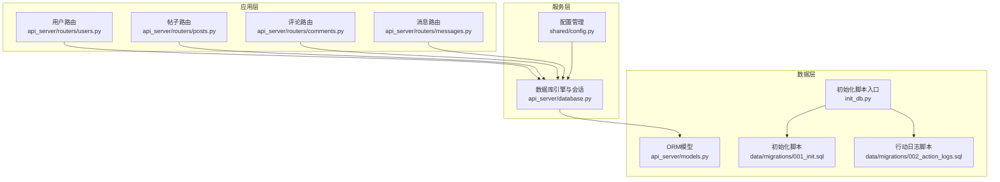
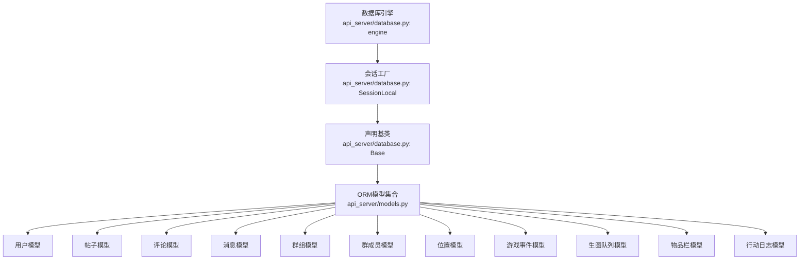
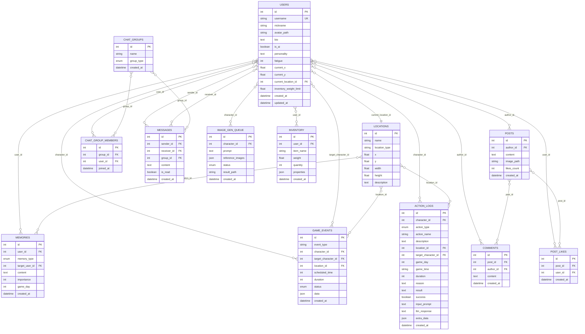
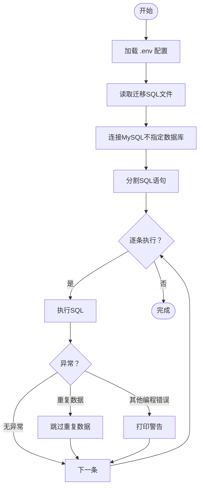
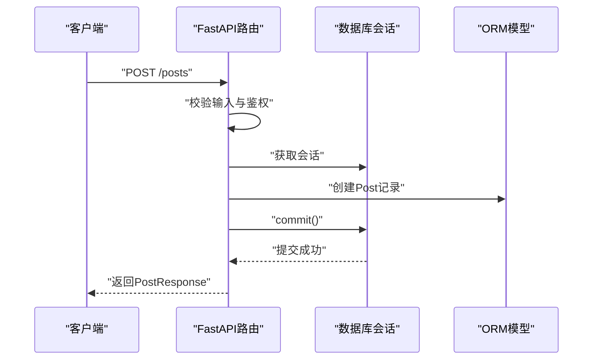
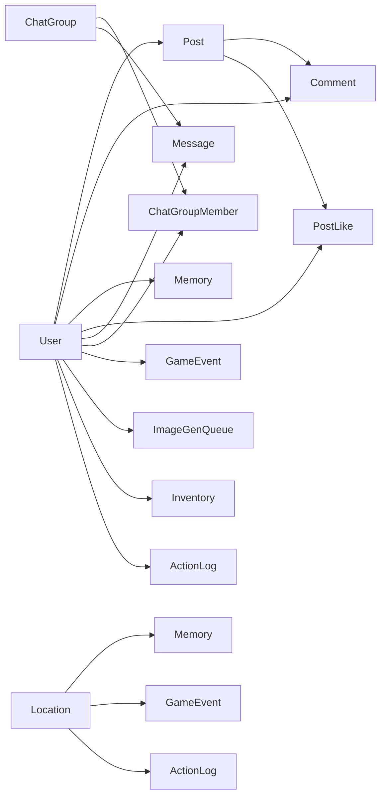

# 数据库设计

<cite>
**本文引用的文件**
- [api_server/models.py](file://api_server/models.py)
- [api_server/database.py](file://api_server/database.py)
- [data/migrations/001_init.sql](file://data/migrations/001_init.sql)
- [data/migrations/002_action_logs.sql](file://data/migrations/002_action_logs.sql)
- [init_db.py](file://init_db.py)
- [shared/config.py](file://shared/config.py)
- [api_server/schemas.py](file://api_server/schemas.py)
- [api_server/routers/users.py](file://api_server/routers/users.py)
- [api_server/routers/posts.py](file://api_server/routers/posts.py)
- [api_server/routers/messages.py](file://api_server/routers/messages.py)
- [api_server/routers/comments.py](file://api_server/routers/comments.py)
</cite>

## 目录
1. [简介](#简介)
2. [项目结构](#项目结构)
3. [核心组件](#核心组件)
4. [架构总览](#架构总览)
5. [详细组件分析](#详细组件分析)
6. [依赖分析](#依赖分析)
7. [性能考量](#性能考量)
8. [故障排查指南](#故障排查指南)
9. [结论](#结论)
10. [附录](#附录)

## 简介
本文件面向AI社区数据库系统，围绕基于SQLAlchemy的ORM模型设计，系统性梳理实体关系图、表结构定义与字段类型说明；深入阐释用户、帖子、评论、消息、事件等核心模型的设计思路与业务规则；明确主键、外键约束、索引设计与数据完整性保障；给出数据库迁移策略与版本管理方法；总结数据验证规则、业务约束与生命周期管理；并覆盖数据访问模式、缓存策略与性能优化、连接配置、事务管理与并发控制、以及数据安全与隐私保护等主题。

## 项目结构
数据库层由以下模块协同构成：
- ORM模型定义：位于api_server/models.py，定义了完整的领域模型与枚举类型
- 数据库引擎与会话：位于api_server/database.py，负责连接池、会话工厂与依赖注入
- 初始化脚本与迁移：位于data/migrations/*.sql与init_db.py，提供数据库初始化与增量迁移
- 配置管理：位于shared/config.py，集中管理数据库URL与运行参数
- 路由与数据访问：位于api_server/routers/*，展示典型查询、写入与事务处理流程
- Pydantic校验模型：位于api_server/schemas.py，提供输入输出校验与约束

图表来源
- [api_server/database.py](file://api_server/database.py#L1-L33)
- [shared/config.py](file://shared/config.py#L1-L52)
- [api_server/models.py](file://api_server/models.py#L1-L293)
- [data/migrations/001_init.sql](file://data/migrations/001_init.sql#L1-L205)
- [data/migrations/002_action_logs.sql](file://data/migrations/002_action_logs.sql#L1-L44)
- [init_db.py](file://init_db.py#L1-L70)

章节来源
- [api_server/database.py](file://api_server/database.py#L1-L33)
- [shared/config.py](file://shared/config.py#L1-L52)
- [api_server/models.py](file://api_server/models.py#L1-L293)
- [data/migrations/001_init.sql](file://data/migrations/001_init.sql#L1-L205)
- [data/migrations/002_action_logs.sql](file://data/migrations/002_action_logs.sql#L1-L44)
- [init_db.py](file://init_db.py#L1-L70)

## 核心组件
本节聚焦ORM模型中的核心实体及其关键字段、关系与约束，涵盖用户、帖子、评论、消息、事件、物品与行动日志等。

- 用户模型（users）
  - 主键：自增整型
  - 关键字段：用户名唯一索引、昵称、头像路径、个人简介、是否AI角色、AI角色特有属性（个性、疲劳度、坐标、当前位置外键、负重上限）、时间戳
  - 关系：一对多（帖子、评论、记忆、点赞），级联删除
  - 索引：用户名、是否AI角色
  - 外键：当前位置指向位置表（可为空）

- 记忆模型（memories）
  - 主键：自增整型
  - 字段：用户ID外键（级联删除）、记忆类型枚举、目标用户外键（SET NULL）、内容、重要度、游戏日、创建时间
  - 关系：与用户、目标用户（可空）
  - 索引：用户+类型、游戏日

- 帖子模型（posts）
  - 主键：自增整型
  - 字段：作者ID外键（级联删除）、内容、图片路径、点赞计数、创建时间
  - 关系：与作者、评论、点赞（级联删除）
  - 索引：作者、创建时间

- 点赞模型（post_likes）
  - 主键：自增整型
  - 字段：帖子ID、用户ID（唯一组合约束）、创建时间
  - 关系：与帖子、用户
  - 约束：唯一组合（帖子ID, 用户ID）

- 评论模型（comments）
  - 主键：自增整型
  - 字段：帖子ID、作者ID外键（级联删除）、内容、创建时间
  - 关系：与帖子、作者
  - 索引：帖子、创建时间

- 群组模型（chat_groups）
  - 主键：自增整型
  - 字段：名称、群组类型枚举、创建时间
  - 关系：群成员、消息（级联删除）

- 群成员模型（chat_group_members）
  - 主键：自增整型
  - 字段：群组ID、用户ID（唯一组合约束）、加入时间
  - 关系：群组、用户
  - 约束：唯一组合（群组ID, 用户ID）

- 消息模型（messages）
  - 主键：自增整型
  - 字段：发送者ID、接收者ID（可空）、群组ID（可空）、内容、是否已读、创建时间
  - 关系：发送者、接收者、群组
  - 索引：私聊双端、群组、创建时间

- 位置模型（locations）
  - 主键：自增整型
  - 字段：名称、类型、坐标、尺寸、描述
  - 索引：坐标

- 游戏事件模型（game_events）
  - 主键：自增整型
  - 字段：事件类型、角色、目标角色（可空）、位置（可空）、计划时间、持续时间、状态枚举、扩展数据、创建时间
  - 关系：角色、目标角色、位置（可空）

- 生图队列模型（image_gen_queue）
  - 主键：自增整型
  - 字段：角色ID外键（级联删除）、提示词、参考图、状态枚举、结果路径、创建时间
  - 关系：角色

- 物品栏模型（inventory）
  - 主键：自增整型
  - 字段：用户ID外键（级联删除）、物品名、重量、数量、属性JSON、创建时间
  - 关系：用户
  - 索引：用户

- 行动日志模型（action_logs）
  - 主键：自增整型
  - 字段：角色ID外键（级联删除）、行动类型枚举、行动名称、描述、位置（可空）、目标角色（可空）、游戏日、游戏时间、持续时间、原因、结果、成功标志、LLM输入/输出、额外数据JSON、创建时间
  - 关系：角色、位置、目标角色
  - 索引：角色、创建时间、角色+时间、游戏日

章节来源
- [api_server/models.py](file://api_server/models.py#L35-L293)

## 架构总览
下图展示数据库层的整体架构与组件交互，包括ORM模型、数据库引擎、会话管理、路由与迁移脚本之间的关系。

图表来源
- [api_server/database.py](file://api_server/database.py#L1-L33)
- [api_server/models.py](file://api_server/models.py#L1-L293)

## 详细组件分析

### 实体关系图（ERD）
下图以ER图形式呈现核心实体间的主外键关系与基数约束，便于理解数据完整性与查询路径。

图表来源
- [api_server/models.py](file://api_server/models.py#L35-L293)

### 数据模型与字段类型说明
- 字符串类型：VARCHAR/TEXT，长度限制与可空性依据业务需求设置
- 数值类型：整型（主键、外键、计数）、浮点型（坐标、负重）
- 枚举类型：通过Python枚举映射为数据库ENUM，确保取值域受控
- JSON类型：用于扩展字段与非结构化数据存储
- 时间戳：DATETIME，使用服务器默认值与更新触发器
- 索引：复合索引与单列索引结合，覆盖常见查询条件

章节来源
- [api_server/models.py](file://api_server/models.py#L1-L293)

### 主键、外键约束与索引设计
- 主键：所有实体均采用自增整型主键，保证全局唯一性
- 外键约束：
  - 用户与位置：位置可空（SET NULL），支持用户未定位场景
  - 帖子、评论、点赞、消息、群成员、生图队列、物品栏、行动日志：均采用级联删除，确保数据一致性
  - 群组消息：群组可空（SET NULL），允许群组解散后保留消息
- 唯一约束：
  - 点赞：(post_id, user_id)唯一
  - 群成员：(group_id, user_id)唯一
- 索引设计：
  - 用户：用户名、是否AI角色
  - 记忆：用户+类型、游戏日
  - 帖子：作者、创建时间
  - 评论：帖子、创建时间
  - 消息：私聊双端、群组、创建时间
  - 位置：坐标
  - 游戏事件：计划时间、状态
  - 生图队列：状态
  - 行动日志：角色、创建时间、角色+时间、游戏日

章节来源
- [api_server/models.py](file://api_server/models.py#L35-L293)
- [data/migrations/001_init.sql](file://data/migrations/001_init.sql#L1-L205)
- [data/migrations/002_action_logs.sql](file://data/migrations/002_action_logs.sql#L1-L44)

### 数据完整性与业务规则
- 用户注册与登录：用户名唯一、昵称与密码长度约束；密码哈希存储（模型中保留字段，实际逻辑在认证模块）
- 帖子发布：内容长度限制；作者必须存在且有权发布
- 评论与点赞：仅限已存在帖子与用户；点赞唯一性由唯一约束保证
- 私聊与群聊：私聊双方必须存在且不可自聊；群成员唯一性由唯一约束保证
- 事件调度：角色、目标角色、位置可空，状态枚举受控
- 物品栏：用户与物品名组合无强制唯一，数量与重量可为零或正数
- 行动日志：记录AI决策过程与LLM交互，支持按角色与时间检索

章节来源
- [api_server/schemas.py](file://api_server/schemas.py#L1-L166)
- [api_server/models.py](file://api_server/models.py#L35-L293)

### 数据库迁移策略与版本管理
- 初始化脚本：data/migrations/001_init.sql 完成基础表结构与初始数据
- 增量迁移：data/migrations/002_action_logs.sql 引入行动日志表
- 初始化入口：init_db.py 读取.env环境变量，逐条执行SQL，忽略重复数据与表已存在等常见错误
- 运行方式：python init_db.py

图表来源
- [init_db.py](file://init_db.py#L1-L70)
- [data/migrations/001_init.sql](file://data/migrations/001_init.sql#L1-L205)
- [data/migrations/002_action_logs.sql](file://data/migrations/002_action_logs.sql#L1-L44)

章节来源
- [init_db.py](file://init_db.py#L1-L70)
- [data/migrations/001_init.sql](file://data/migrations/001_init.sql#L1-L205)
- [data/migrations/002_action_logs.sql](file://data/migrations/002_action_logs.sql#L1-L44)

### 数据访问模式与事务管理
- 依赖注入：get_db 提供会话生命周期管理，确保请求结束自动关闭
- 事务边界：路由层显式commit/refresh，保证读写一致性
- 关联加载：使用joinedload减少N+1查询，提升性能
- 权限控制：路由层校验资源归属与操作权限，拒绝越权操作

图表来源
- [api_server/routers/posts.py](file://api_server/routers/posts.py#L72-L88)
- [api_server/database.py](file://api_server/database.py#L26-L33)

章节来源
- [api_server/routers/users.py](file://api_server/routers/users.py#L1-L57)
- [api_server/routers/posts.py](file://api_server/routers/posts.py#L1-L166)
- [api_server/routers/comments.py](file://api_server/routers/comments.py#L1-L121)
- [api_server/routers/messages.py](file://api_server/routers/messages.py#L1-L300)
- [api_server/database.py](file://api_server/database.py#L1-L33)

### 缓存策略与性能优化
- 索引优化：针对高频过滤与排序字段建立索引（如created_at、author_id、post_id等）
- 关联查询：使用joinedload减少多次往返
- 分页与限制：路由层对列表接口提供分页参数，避免一次性加载过多数据
- 连接池：启用pool_pre_ping与合理回收周期，提升连接稳定性
- JSON字段：仅在必要时使用，避免过度复杂化查询

章节来源
- [api_server/routers/posts.py](file://api_server/routers/posts.py#L45-L69)
- [api_server/routers/comments.py](file://api_server/routers/comments.py#L13-L50)
- [api_server/routers/messages.py](file://api_server/routers/messages.py#L145-L188)
- [api_server/database.py](file://api_server/database.py#L14-L19)

### 数据库连接配置、事务与并发控制
- 连接配置：通过shared/config.py生成database_url，统一驱动与字符集
- 会话工厂：SessionLocal提供非自动提交与刷新，路由层手动控制事务
- 并发控制：外键约束与唯一约束在数据库层面保证并发一致性；路由层在关键写操作前后进行权限与存在性校验

章节来源
- [shared/config.py](file://shared/config.py#L40-L42)
- [api_server/database.py](file://api_server/database.py#L14-L33)

### 数据安全、隐私保护与访问控制
- 输入校验：Pydantic模型对用户名、密码、内容长度等进行强约束
- 认证与授权：路由层依赖当前用户上下文，校验资源归属与操作权限
- 敏感字段：密码哈希字段存在于模型中，实际加密逻辑在认证模块实现
- 日志与审计：行动日志记录AI决策与LLM交互，便于审计与回溯

章节来源
- [api_server/schemas.py](file://api_server/schemas.py#L1-L166)
- [api_server/routers/posts.py](file://api_server/routers/posts.py#L107-L128)
- [api_server/routers/comments.py](file://api_server/routers/comments.py#L93-L120)
- [api_server/routers/messages.py](file://api_server/routers/messages.py#L191-L227)
- [api_server/models.py](file://api_server/models.py#L254-L293)

## 依赖分析
ORM模型之间通过外键与关系定义形成清晰的依赖链，耦合度低、内聚性强，便于扩展与维护。

图表来源
- [api_server/models.py](file://api_server/models.py#L35-L293)

章节来源
- [api_server/models.py](file://api_server/models.py#L35-L293)

## 性能考量
- 查询路径优化：利用索引覆盖常见过滤条件（作者、创建时间、帖子ID、群组ID等）
- 写入路径优化：批量写入与事务合并，减少往返次数
- 缓存建议：对热点列表（如最新帖子、热门话题）引入Redis缓存，设置合理TTL
- 监控指标：记录慢查询、连接池利用率、事务提交耗时，定期分析与优化

## 故障排查指南
- 连接失败：检查database_url拼装、网络连通性与凭据
- 重复数据：初始化脚本已忽略重复数据错误，若出现异常需检查唯一约束冲突
- 外键约束：违反外键约束通常出现在删除父记录或引用不存在的ID，需先清理子记录或修正引用
- 权限错误：路由层对资源归属与操作权限进行校验，确认当前用户上下文正确

章节来源
- [init_db.py](file://init_db.py#L45-L53)
- [api_server/routers/posts.py](file://api_server/routers/posts.py#L107-L128)
- [api_server/routers/comments.py](file://api_server/routers/comments.py#L93-L120)
- [api_server/routers/messages.py](file://api_server/routers/messages.py#L191-L227)

## 结论
本数据库设计方案以SQLAlchemy ORM为核心，结合明确的实体关系、严格的约束与索引策略，满足AI社区的用户、社交、事件与AI行为记录等多维度业务需求。通过初始化脚本与增量迁移实现版本演进，配合路由层的事务与权限控制，确保数据一致性与安全性。建议在生产环境中进一步引入缓存、监控与备份策略，持续优化查询与写入性能。

## 附录
- 运行初始化脚本：python init_db.py
- 数据库URL生成：shared/config.py中的database_url属性
- 路由示例：用户、帖子、评论、消息路由展示了典型CRUD与权限校验流程