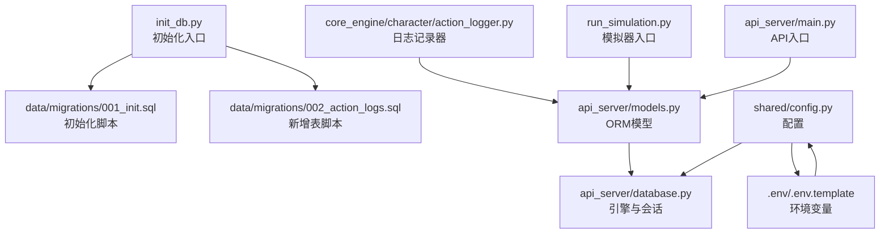
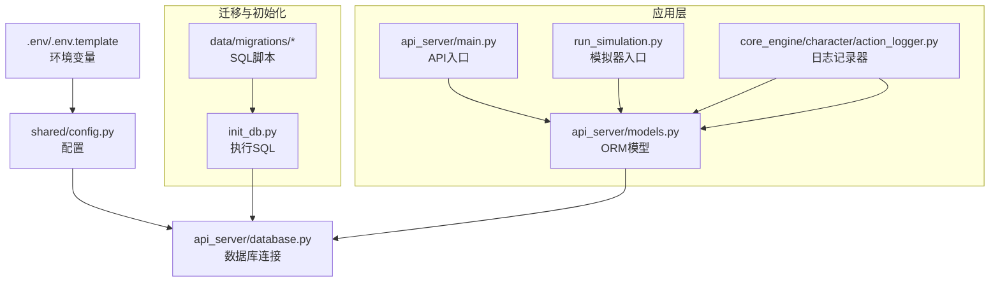
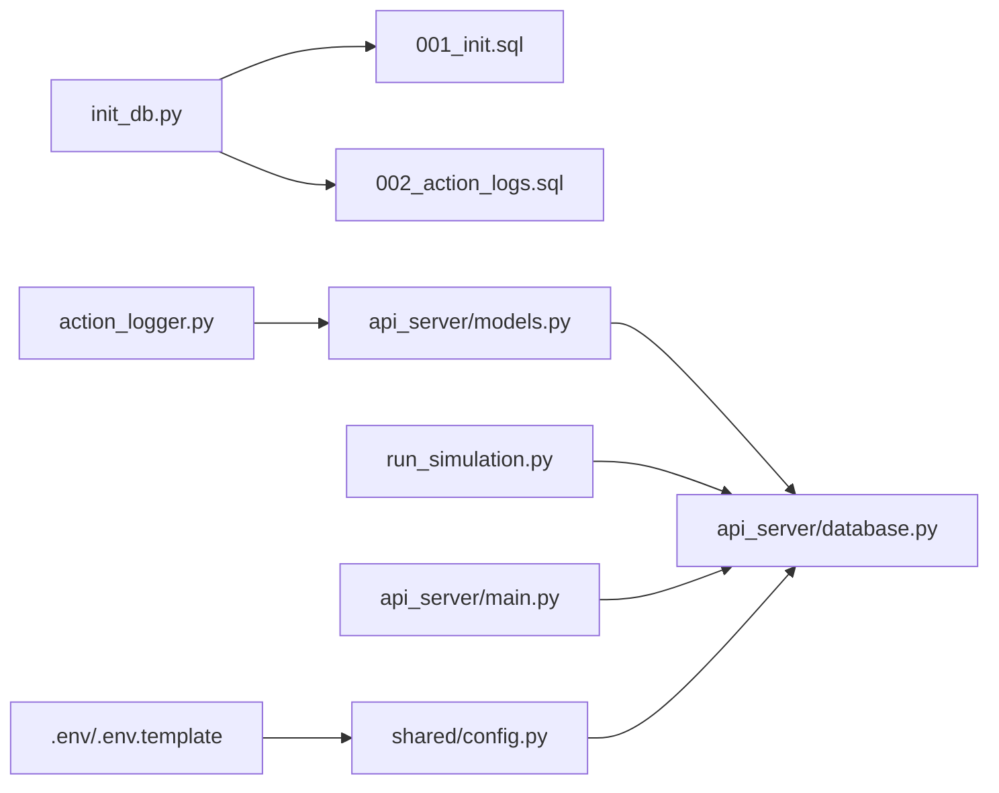

# 数据库迁移管理

<cite>
**本文引用的文件**
- [README.md](file://README.md)
- [init_db.py](file://init_db.py)
- [001_init.sql](file://data/migrations/001_init.sql)
- [002_action_logs.sql](file://data/migrations/002_action_logs.sql)
- [models.py](file://api_server/models.py)
- [database.py](file://api_server/database.py)
- [config.py](file://shared/config.py)
- [.env](file://.env)
- [.env.template](file://.env.template)
- [requirements.txt](file://requirements.txt)
- [action_logger.py](file://core_engine/character/action_logger.py)
- [run_simulation.py](file://run_simulation.py)
- [main.py](file://api_server/main.py)
</cite>

## 目录
1. [简介](#简介)
2. [项目结构](#项目结构)
3. [核心组件](#核心组件)
4. [架构总览](#架构总览)
5. [详细组件分析](#详细组件分析)
6. [依赖关系分析](#依赖关系分析)
7. [性能考量](#性能考量)
8. [故障排查指南](#故障排查指南)
9. [结论](#结论)
10. [附录](#附录)

## 简介
本操作文档面向数据库迁移系统，围绕数据库版本管理策略、迁移脚本设计、初始数据库结构与字段定义、ActionLog 表的添加与数据迁移策略、迁移执行顺序与依赖关系管理、备份与恢复最佳实践、迁移失败回滚与错误处理策略、生产环境部署流程与安全注意事项、数据库性能监控与维护计划，以及迁移工具使用与自动化脚本进行系统化说明。文档同时提供可视化图示与分层讲解，便于不同技术背景的读者理解和落地实施。

## 项目结构
本项目采用“脚本驱动 + ORM 映射”的双轨方式管理数据库结构：
- 迁移脚本：位于 data/migrations，以编号命名，明确迁移顺序与依赖。
- ORM 模型：位于 api_server/models.py，通过 SQLAlchemy 映射到数据库表。
- 初始化工具：init_db.py 读取 SQL 脚本并执行，兼容重复执行与常见错误忽略。
- 配置：shared/config.py 与 .env 提供数据库连接参数；requirements.txt 约束依赖。

图表来源
- [init_db.py](file://init_db.py#L1-L70)
- [001_init.sql](file://data/migrations/001_init.sql#L1-L205)
- [002_action_logs.sql](file://data/migrations/002_action_logs.sql#L1-L44)
- [models.py](file://api_server/models.py#L1-L293)
- [database.py](file://api_server/database.py#L1-L33)
- [config.py](file://shared/config.py#L1-L52)
- [.env](file://.env#L1-L30)
- [.env.template](file://.env.template#L1-L30)
- [action_logger.py](file://core_engine/character/action_logger.py#L1-L481)
- [run_simulation.py](file://run_simulation.py#L1-L258)
- [main.py](file://api_server/main.py#L1-L69)

章节来源
- [README.md](file://README.md#L1-L290)
- [init_db.py](file://init_db.py#L1-L70)
- [001_init.sql](file://data/migrations/001_init.sql#L1-L205)
- [002_action_logs.sql](file://data/migrations/002_action_logs.sql#L1-L44)
- [models.py](file://api_server/models.py#L1-L293)
- [database.py](file://api_server/database.py#L1-L33)
- [config.py](file://shared/config.py#L1-L52)
- [.env](file://.env#L1-L30)
- [.env.template](file://.env.template#L1-L30)
- [requirements.txt](file://requirements.txt#L1-L32)
- [action_logger.py](file://core_engine/character/action_logger.py#L1-L481)
- [run_simulation.py](file://run_simulation.py#L1-L258)
- [main.py](file://api_server/main.py#L1-L69)

## 核心组件
- 迁移脚本与版本管理
  - 001_init.sql：创建数据库与全部基础表，包含用户、记忆、帖子、评论、群组、消息、地点、事件、图像生成队列、物品栏等，并补充外键约束与初始数据。
  - 002_action_logs.sql：新增 ActionLog 表，记录 AI 角色行动历史，包含游戏时间、LLM 交互、额外数据等字段。
- 初始化工具 init_db.py
  - 读取 SQL 文件，连接 MySQL，逐条执行语句；对重复数据与表已存在等常见错误进行容忍性处理；打印执行与警告信息。
- ORM 模型与数据库连接
  - models.py 定义 ActionLog 及其他表的 ORM 映射；database.py 基于 shared/config.py 的配置创建 SQLAlchemy 引擎与会话。
- 配置与环境
  - config.py 提供 Settings 类与 database_url 属性；.env/.env.template 提供 MYSQL_* 等关键配置。
- 日志记录器
  - action_logger.py 提供 ActionLog 的记录与查询接口，封装数据库事务与异常回滚。

章节来源
- [001_init.sql](file://data/migrations/001_init.sql#L1-L205)
- [002_action_logs.sql](file://data/migrations/002_action_logs.sql#L1-L44)
- [init_db.py](file://init_db.py#L1-L70)
- [models.py](file://api_server/models.py#L254-L293)
- [database.py](file://api_server/database.py#L1-L33)
- [config.py](file://shared/config.py#L1-L52)
- [.env](file://.env#L1-L30)
- [.env.template](file://.env.template#L1-L30)
- [action_logger.py](file://core_engine/character/action_logger.py#L89-L481)

## 架构总览
下图展示迁移系统在整体项目中的位置与交互关系：

图表来源
- [init_db.py](file://init_db.py#L1-L70)
- [001_init.sql](file://data/migrations/001_init.sql#L1-L205)
- [002_action_logs.sql](file://data/migrations/002_action_logs.sql#L1-L44)
- [models.py](file://api_server/models.py#L1-L293)
- [database.py](file://api_server/database.py#L1-L33)
- [config.py](file://shared/config.py#L1-L52)
- [.env](file://.env#L1-L30)
- [.env.template](file://.env.template#L1-L30)
- [action_logger.py](file://core_engine/character/action_logger.py#L1-L481)
- [run_simulation.py](file://run_simulation.py#L1-L258)
- [main.py](file://api_server/main.py#L1-L69)

## 详细组件分析

### 初始数据库结构与字段定义
- 数据库与字符集
  - 初始化脚本显式创建数据库并设置字符集与排序规则，确保后续表继承一致的字符集。
- 用户表 users
  - 字段覆盖用户名唯一性、头像、个人简介、AI 角色标识、个性、疲劳度、坐标、当前位置外键、负重上限等；包含索引提升查询效率。
- 记忆表 memories
  - 支持多种记忆类型枚举，关联用户与目标用户，包含重要性与游戏日字段。
- 帖子 posts、评论 comments、点赞 post_likes
  - 帖子与作者、评论与作者/帖子、点赞唯一性约束，均具备时间索引。
- 群组 chat_groups、群成员 chat_group_members、消息 messages
  - 群成员唯一约束，消息支持私聊与群聊，具备多维索引。
- 地点表 locations
  - 位置坐标与尺寸，辅助角色移动与事件定位。
- 游戏事件 game_events、图像生成队列 image_gen_queue、物品栏 inventory
  - 事件包含状态与数据 JSON，图像队列包含状态与结果路径，物品栏支持属性 JSON。
- 外键补充
  - 在 locations 创建后再为 users 补充 current_location_id 外键，保证引用完整性。
- 初始数据
  - 插入测试 AI 角色、地点与共同/重要记忆，便于快速验证系统功能。

章节来源
- [001_init.sql](file://data/migrations/001_init.sql#L1-L205)
- [models.py](file://api_server/models.py#L35-L233)

### ActionLog 表的添加与数据迁移策略
- 新增表结构
  - ActionLog 表记录 AI 角色的行动类型、名称、描述、地点、目标角色、游戏时间、持续时间、决策原因与结果、LLM 输入输出、额外数据 JSON、创建时间等；包含多处索引优化查询。
- 数据迁移策略
  - 若需将已有 AI 行为历史迁移到新表，建议：
    - 评估现有日志存储方案（如内存/文件），制定导出与清洗流程。
    - 分批导入，控制事务大小，避免长时间锁表。
    - 导入前校验外键对应记录是否存在，缺失则先行补齐。
    - 导入后进行抽样核对与索引重建优化。
- 与 ORM 的映射
  - models.py 中定义 ActionLogType 与 ActionLog 模型，确保类型安全与查询便捷。

章节来源
- [002_action_logs.sql](file://data/migrations/002_action_logs.sql#L1-L44)
- [models.py](file://api_server/models.py#L235-L293)
- [action_logger.py](file://core_engine/character/action_logger.py#L89-L481)

### 迁移脚本的执行顺序与依赖关系管理
- 执行顺序
  - 001_init.sql 必须在 002_action_logs.sql 之前执行，因为后者依赖 users 与 locations 表的存在。
- 依赖关系
  - ActionLog 表对外键 users(id)、locations(id)、users(id)（目标角色）进行约束，确保引用完整性。
  - users 表的 current_location_id 外键在 locations 创建之后补充，避免建表阶段的依赖问题。
- 自动化与幂等性
  - init_db.py 将 SQL 文件按分号分割逐条执行，对重复数据与表已存在等错误进行容忍处理，提升脚本的可重复执行能力。

章节来源
- [001_init.sql](file://data/migrations/001_init.sql#L176-L178)
- [002_action_logs.sql](file://data/migrations/002_action_logs.sql#L35-L43)
- [init_db.py](file://init_db.py#L35-L56)

### 数据库备份与恢复最佳实践
- 备份策略
  - 全量备份：定期执行逻辑备份（mysqldump）或物理备份（如 Percona XtraBackup），保留二进制日志以便增量恢复。
  - 结构与数据分离：优先备份结构（DDL）与数据（DML），确保迁移脚本与实际数据一致。
  - 多版本保留：保留最近 N 个版本的备份，满足回滚需求。
- 恢复流程
  - 恢复前验证备份完整性与一致性。
  - 在隔离环境中验证恢复结果，确认表结构、索引、外键与数据正确性。
  - 逐步切换流量，观察应用日志与指标，确认无异常后再完全切流。
- 迁移与备份结合
  - 迁移前先做备份，迁移后验证数据一致性，再更新备份策略与保留周期。

[本节为通用实践指导，无需特定文件引用]

### 迁移失败的回滚机制与错误处理策略
- 回滚机制
  - 采用“向前迁移 + 向后回滚”脚本对称设计，回滚脚本与迁移脚本一一对应。
  - 回滚时优先删除新增对象（如表、索引、列），再恢复受影响的数据。
  - 对关键变更（如重命名列、删除列）采用“影子列 + 数据迁移 + 切换”的渐进式策略。
- 错误处理
  - init_db.py 对重复数据与表已存在等错误进行容忍，避免因幂等性导致的中断。
  - ORM 层面使用事务包裹写入，捕获异常后回滚，确保数据一致性。
  - 日志记录器在记录失败时主动回滚，防止脏数据入库。

章节来源
- [init_db.py](file://init_db.py#L45-L56)
- [action_logger.py](file://core_engine/character/action_logger.py#L157-L161)

### 生产环境的迁移部署流程与安全注意事项
- 部署流程
  - 准备阶段：在预生产环境验证迁移脚本与回滚脚本，准备备份与监控告警。
  - 执行阶段：在维护窗口内停止写入或开启只读，执行迁移脚本，验证结构与数据。
  - 切流阶段：更新应用配置与依赖，重启服务，验证 API 与模拟器功能。
  - 收尾阶段：清理临时对象，更新备份策略，归档迁移记录。
- 安全注意事项
  - 最小权限原则：迁移账户仅授予必要权限，避免过度授权。
  - 网络隔离：迁移期间限制外部访问，必要时启用只读代理。
  - 密码与密钥：使用环境变量与密钥管理服务，避免硬编码。
  - 审计与日志：记录所有变更与执行者，便于追溯与审计。

[本节为通用实践指导，无需特定文件引用]

### 数据库性能监控与维护计划
- 监控指标
  - 连接数与等待事件、慢查询、锁等待、缓冲池命中率、磁盘 IO、复制延迟（如适用）。
- 维护计划
  - 定期执行 ANALYZE/优化索引、统计信息更新，保持查询计划最优。
  - 按需重建碎片化索引，避免大表 DDL 造成长时间锁表。
  - 清理历史日志与归档数据，控制表规模增长。

[本节为通用实践指导，无需特定文件引用]

### 迁移工具使用指南与自动化脚本
- 使用指南
  - 环境准备：确保 MySQL 服务可用，Python 环境与依赖安装完成。
  - 执行初始化：运行 init_db.py，脚本会自动读取 data/migrations 下的 SQL 文件并执行。
  - 验证结果：检查数据库表结构、索引与初始数据是否正确。
- 自动化脚本
  - 可将 init_db.py 与环境变量注入整合到 CI/CD 流水线，实现“一键迁移”。
  - 结合备份与回滚脚本，形成“变更-验证-回滚”的闭环。

章节来源
- [README.md](file://README.md#L67-L81)
- [init_db.py](file://init_db.py#L1-L70)
- [.env](file://.env#L1-L30)
- [.env.template](file://.env.template#L1-L30)
- [requirements.txt](file://requirements.txt#L1-L32)

## 依赖关系分析
- 组件耦合
  - init_db.py 与 data/migrations/* 强耦合，负责结构初始化与幂等执行。
  - models.py 与 database.py 弱耦合，通过配置与引擎解耦。
  - action_logger.py 与 models.py 强耦合，直接依赖 ORM 模型进行持久化。
- 外部依赖
  - SQLAlchemy 与 PyMySQL 提供 ORM 与连接能力；dotenv 提供环境变量加载。
- 循环依赖
  - 当前结构未发现循环依赖，各模块职责清晰。

图表来源
- [init_db.py](file://init_db.py#L1-L70)
- [001_init.sql](file://data/migrations/001_init.sql#L1-L205)
- [002_action_logs.sql](file://data/migrations/002_action_logs.sql#L1-L44)
- [models.py](file://api_server/models.py#L1-L293)
- [database.py](file://api_server/database.py#L1-L33)
- [action_logger.py](file://core_engine/character/action_logger.py#L1-L481)
- [run_simulation.py](file://run_simulation.py#L1-L258)
- [main.py](file://api_server/main.py#L1-L69)
- [config.py](file://shared/config.py#L1-L52)
- [.env](file://.env#L1-L30)
- [.env.template](file://.env.template#L1-L30)

章节来源
- [requirements.txt](file://requirements.txt#L1-L32)
- [config.py](file://shared/config.py#L1-L52)
- [database.py](file://api_server/database.py#L1-L33)
- [models.py](file://api_server/models.py#L1-L293)
- [action_logger.py](file://core_engine/character/action_logger.py#L1-L481)
- [init_db.py](file://init_db.py#L1-L70)

## 性能考量
- 索引设计
  - 初始脚本为高频查询字段建立索引（如用户名、AI 标识、帖子作者、创建时间等），有助于提升查询性能。
- 查询优化
  - 使用 EXPLAIN 分析复杂查询，避免全表扫描；合理利用覆盖索引与复合索引。
- 连接池与超时
  - database.py 设置连接池预检与回收策略，减少连接抖动带来的开销。
- 大事务与批量操作
  - 迁移与日志写入尽量拆分为小事务，避免长时间锁表影响业务。

章节来源
- [001_init.sql](file://data/migrations/001_init.sql#L25-L27)
- [001_init.sql](file://data/migrations/001_init.sql#L54-L56)
- [001_init.sql](file://data/migrations/001_init.sql#L113-L116)
- [database.py](file://api_server/database.py#L14-L21)

## 故障排查指南
- 数据库连接失败
  - 检查 .env/.env.template 中的 MYSQL_* 配置是否正确，确认 MySQL 服务已启动。
- 迁移执行报错
  - init_db.py 对重复数据与表已存在等错误进行容忍；若出现其他错误，查看具体异常并修复 SQL。
- ORM 写入失败
  - action_logger.py 在捕获异常后会回滚事务，检查数据库连接与权限，确认表结构与数据类型匹配。
- 模拟器无法加载 AI 角色
  - 确认数据库中存在 is_ai=True 的用户记录，或参考 README 的“创建 AI 角色”章节进行添加。

章节来源
- [.env](file://.env#L1-L30)
- [.env.template](file://.env.template#L1-L30)
- [init_db.py](file://init_db.py#L45-L56)
- [action_logger.py](file://core_engine/character/action_logger.py#L157-L161)
- [README.md](file://README.md#L176-L191)

## 结论
本项目通过“SQL 脚本 + ORM 映射 + 初始化工具”的组合实现了清晰、可重复、可回滚的数据库迁移体系。遵循既定的执行顺序与依赖关系，配合完善的错误处理与回滚策略，能够在开发与生产环境中稳定地演进数据库结构。建议在生产环境严格执行备份与变更评审流程，并结合监控与维护计划，保障系统长期可靠运行。

## 附录
- 快速参考
  - 初始化数据库：python init_db.py
  - 启动 API 服务：python -m api_server.main
  - 启动模拟器：python run_simulation.py
- 关键文件路径
  - 迁移脚本：data/migrations/001_init.sql、data/migrations/002_action_logs.sql
  - 初始化工具：init_db.py
  - ORM 模型：api_server/models.py
  - 数据库连接：api_server/database.py
  - 配置：shared/config.py、.env、.env.template
  - 依赖：requirements.txt