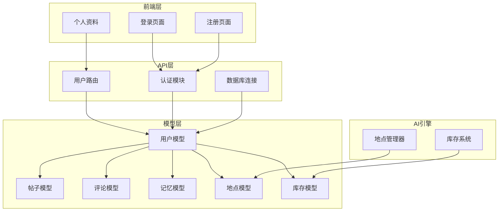
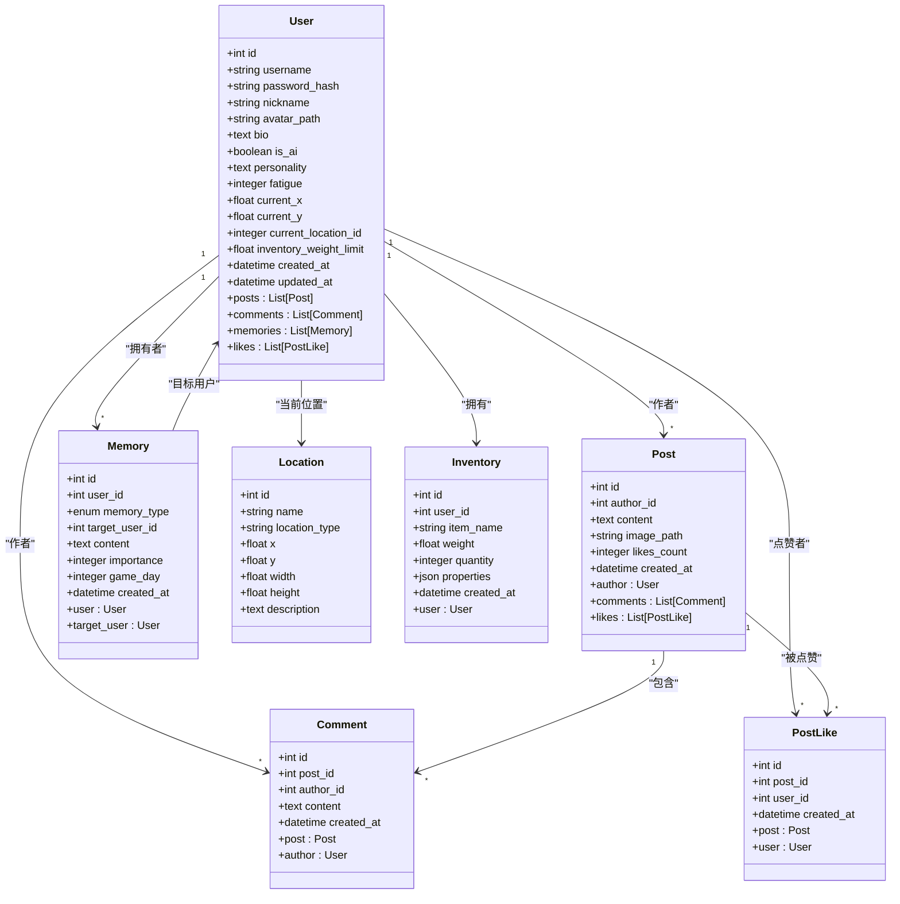
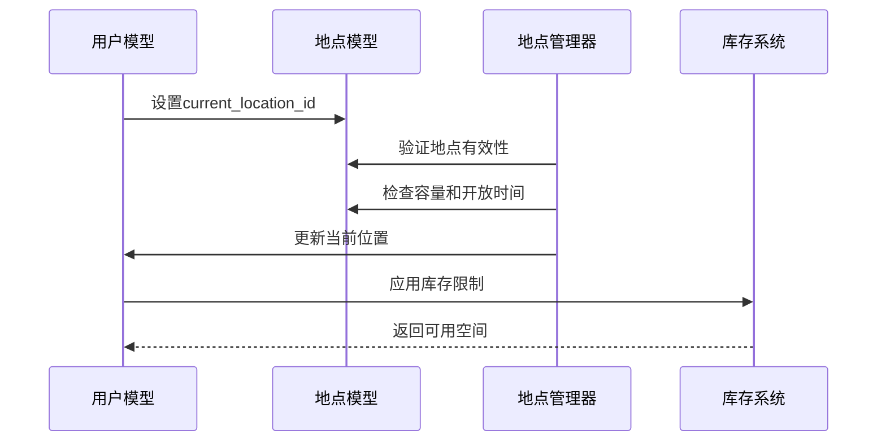
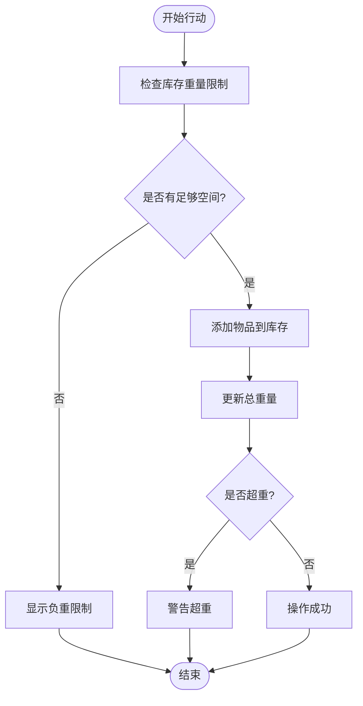
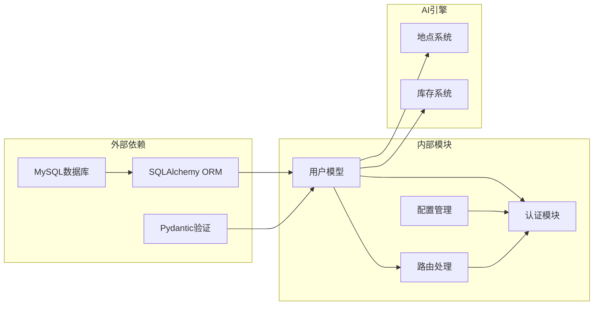

# 用户模型设计

<cite>
**本文引用的文件**
- [api_server/models.py](file://api_server/models.py)
- [api_server/schemas.py](file://api_server/schemas.py)
- [data/migrations/001_init.sql](file://data/migrations/001_init.sql)
- [core_engine/character/inventory.py](file://core_engine/character/inventory.py)
- [core_engine/environment/locations.py](file://core_engine/environment/locations.py)
- [api_server/routers/users.py](file://api_server/routers/users.py)
- [api_server/database.py](file://api_server/database.py)
- [shared/config.py](file://shared/config.py)
</cite>

## 目录
1. [简介](#简介)
2. [项目结构](#项目结构)
3. [核心组件](#核心组件)
4. [架构概览](#架构概览)
5. [详细组件分析](#详细组件分析)
6. [依赖关系分析](#依赖关系分析)
7. [性能考量](#性能考量)
8. [故障排除指南](#故障排除指南)
9. [结论](#结论)

## 简介
本文档详细介绍了AI社区项目的用户模型设计，涵盖字段定义、数据类型、约束规则、业务含义以及与其他组件的关联关系。该模型支持真实用户和AI角色两种身份，并集成了地理位置系统、库存重量限制机制和完整的认证体系。

## 项目结构
用户模型位于后端API服务器的核心位置，采用ORM映射方式与数据库交互，同时与前端界面和AI引擎紧密集成。

**图表来源**
- [api_server/models.py](file://api_server/models.py#L35-L61)
- [api_server/routers/users.py](file://api_server/routers/users.py#L10-L56)
- [core_engine/environment/locations.py](file://core_engine/environment/locations.py#L176-L335)

**章节来源**
- [api_server/models.py](file://api_server/models.py#L1-L293)
- [api_server/routers/users.py](file://api_server/routers/users.py#L1-L57)

## 核心组件
用户模型是整个AI社区系统的核心实体，支持双身份模式（真实用户/AI角色），具备完整的社交功能和AI行为能力。

### 字段定义与数据类型

#### 基本信息字段
- **username** (`String(50)`) - 用户名，唯一标识符，必填，建立索引
- **nickname** (`String(50)`) - 昵称，必填
- **avatar_path** (`String(500)`) - 头像路径，可选
- **bio** (`Text`) - 个人简介，可选

#### 认证相关字段
- **password_hash** (`String(255)`) - 密码哈希值，存储加密后的密码
- **is_ai** (`Boolean`) - 标识是否为AI角色，默认False，建立索引便于查询

#### AI角色专用字段
- **personality** (`Text`) - 角色个性描述，AI角色特有
- **fatigue** (`Integer`) - 疲劳值，默认100，范围0-100
- **current_x** (`Float`) - 当前X坐标，默认0
- **current_y** (`Float`) - 当前Y坐标，默认0
- **current_location_id** (`Integer`) - 当前位置ID，外键关联locations表
- **inventory_weight_limit** (`Float`) - 库存重量限制，默认20.0公斤

#### 时间戳字段
- **created_at** (`DateTime`) - 创建时间，服务器默认当前时间
- **updated_at** (`DateTime`) - 更新时间，服务器默认当前时间，更新时自动刷新

**章节来源**
- [api_server/models.py](file://api_server/models.py#L35-L61)
- [data/migrations/001_init.sql](file://data/migrations/001_init.sql#L6-L27)

### 约束规则
- 所有字段均设置适当的长度限制和默认值
- username必须唯一且不可为空
- nickname不可为空
- AI角色具有额外的个性和行为参数
- 外键约束确保数据完整性

## 架构概览
用户模型采用分层架构设计，通过关系映射实现与其他实体的关联。

**图表来源**
- [api_server/models.py](file://api_server/models.py#L35-L124)

## 详细组件分析

### 用户地理位置系统
用户模型集成了完整的地理位置管理系统，支持AI角色的空间定位和移动。

#### 地理位置字段设计
- **current_x/current_y**: 浮点坐标系统，支持精确的位置定位
- **current_location_id**: 外键关联locations表，建立强一致的位置关系
- **inventory_weight_limit**: 库存重量限制，影响角色的行动能力和物品携带量

#### 地点管理集成

**图表来源**
- [core_engine/environment/locations.py](file://core_engine/environment/locations.py#L26-L118)
- [core_engine/character/inventory.py](file://core_engine/character/inventory.py#L194-L323)

**章节来源**
- [api_server/models.py](file://api_server/models.py#L45-L51)
- [core_engine/environment/locations.py](file://core_engine/environment/locations.py#L176-L335)

### 库存重量限制机制
AI角色的库存系统通过用户模型的inventory_weight_limit字段实现，确保角色行为的真实性和合理性。

#### 库存管理流程

**图表来源**
- [core_engine/character/inventory.py](file://core_engine/character/inventory.py#L324-L358)

**章节来源**
- [core_engine/character/inventory.py](file://core_engine/character/inventory.py#L194-L474)

### 认证与安全机制
用户模型与认证系统深度集成，确保数据安全和访问控制。

#### 密码安全管理
- 使用bcrypt算法进行密码哈希
- 存储加密后的密码而非明文
- 支持密码验证和重新哈希

#### JWT令牌管理
- 24小时有效期
- 安全密钥配置
- 自动令牌刷新机制

**章节来源**
- [api_server/auth.py](file://api_server/auth.py#L24-L41)
- [shared/config.py](file://shared/config.py#L14-L17)

### 关联关系定义

#### 一对多关系
- **用户-帖子**: 一个用户可以发布多个帖子
- **用户-评论**: 一个用户可以发表多条评论  
- **用户-记忆**: 一个用户拥有多个记忆条目
- **用户-点赞**: 一个用户可以给多个帖子点赞

#### 多对一关系
- **帖子-用户**: 帖子属于特定作者
- **评论-用户**: 评论属于特定作者
- **记忆-用户**: 记忆属于特定用户

#### 多对多关系
- **帖子-用户点赞**: 帖子可以被多个用户点赞
- **用户-用户关系**: 用户可以关注其他用户

**章节来源**
- [api_server/models.py](file://api_server/models.py#L56-L60)

### 数据验证规则

#### 后端验证（Pydantic模型）
- **用户名**: 长度3-50字符，必填
- **密码**: 长度6-100字符，必填
- **昵称**: 长度1-50字符，必填
- **内容长度**: 帖子内容1-5000字符，评论1-1000字符

#### 数据库约束
- 所有字段的长度和类型约束
- username唯一性约束
- 外键级联删除规则
- 索引优化查询性能

**章节来源**
- [api_server/schemas.py](file://api_server/schemas.py#L8-L16)
- [data/migrations/001_init.sql](file://data/migrations/001_init.sql#L6-L27)

## 依赖关系分析

**图表来源**
- [api_server/database.py](file://api_server/database.py#L1-L33)
- [shared/config.py](file://shared/config.py#L1-L52)

### 外部依赖
- **SQLAlchemy**: 提供ORM功能和数据库抽象
- **Pydantic**: 实现数据验证和序列化
- **MySQL**: 主数据库存储

### 内部模块依赖
- 用户模型依赖数据库连接和配置
- 路由处理依赖用户模型和认证模块
- AI引擎通过用户模型获取位置和库存信息

**章节来源**
- [api_server/database.py](file://api_server/database.py#L1-L33)
- [shared/config.py](file://shared/config.py#L1-L52)

## 性能考量
用户模型设计充分考虑了性能优化，通过索引、缓存和合理的数据结构提升系统响应速度。

### 查询优化
- 在username和is_ai字段建立索引，支持快速用户检索
- 为created_at字段建立索引，优化时间序列查询
- 使用关系预加载避免N+1查询问题

### 缓存策略
- 用户信息缓存减少数据库访问
- JWT令牌本地存储避免重复认证
- 地点和库存信息按需加载

### 扩展性设计
- 支持用户分页查询
- 可扩展的AI角色系统
- 模块化的认证机制

## 故障排除指南

### 常见问题及解决方案

#### 用户名冲突
**问题**: 注册时出现用户名重复错误
**解决**: 检查用户名唯一性约束，提供重名检测功能

#### 密码验证失败
**问题**: 登录时密码验证失败
**解决**: 确认密码哈希算法一致性，检查bcrypt配置

#### 位置更新异常
**问题**: AI角色位置更新不生效
**解决**: 验证外键约束，检查地点管理器配置

#### 库存超重
**问题**: 物品添加时提示超重
**解决**: 检查inventory_weight_limit设置，优化物品重量配置

**章节来源**
- [api_server/routers/users.py](file://api_server/routers/users.py#L13-L22)
- [core_engine/character/inventory.py](file://core_engine/character/inventory.py#L324-L358)

## 结论
用户模型设计体现了现代Web应用的最佳实践，通过清晰的字段定义、严格的约束规则、完善的关联关系和高效的性能优化，为AI社区提供了坚实的数据基础。该模型不仅支持传统的用户管理功能，还为AI角色的行为模拟提供了必要的基础设施，是整个系统架构的核心支柱。