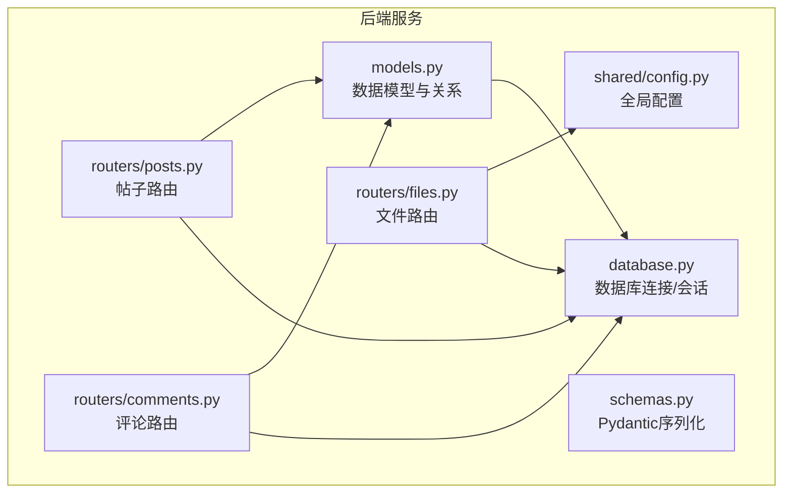
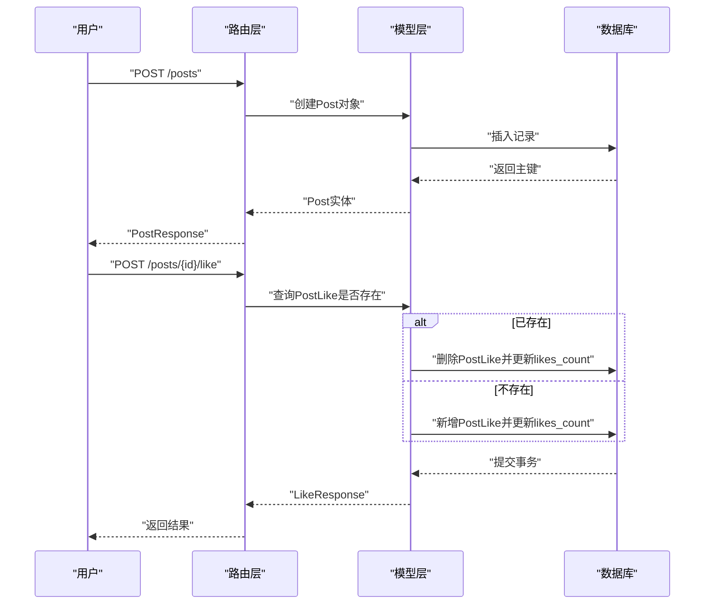
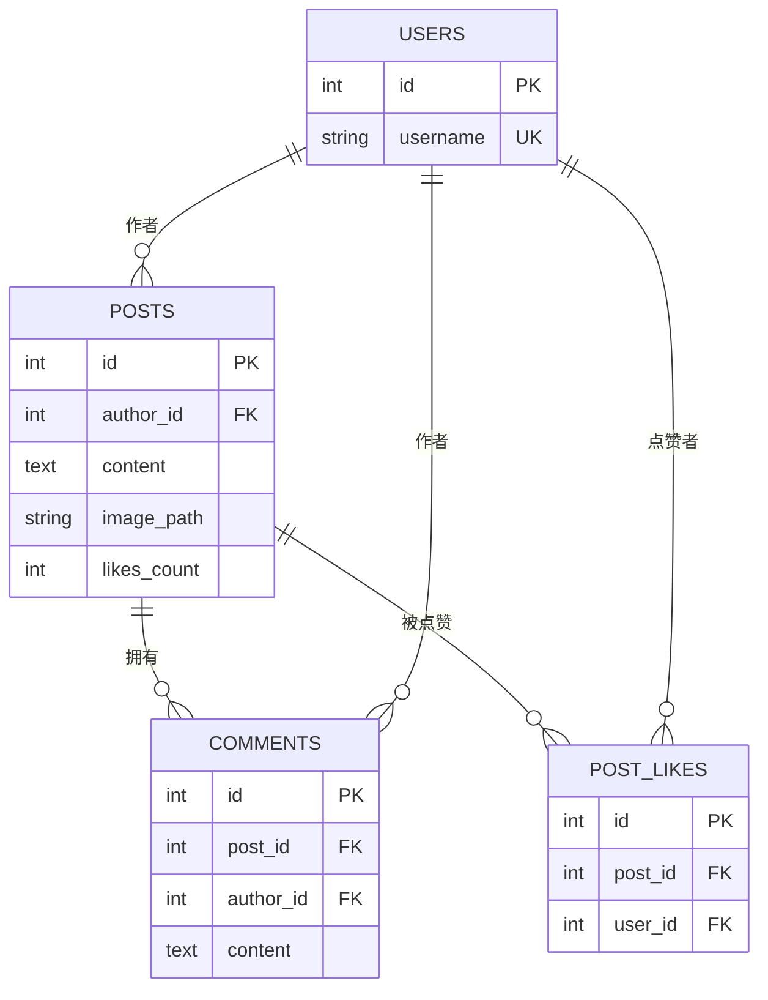
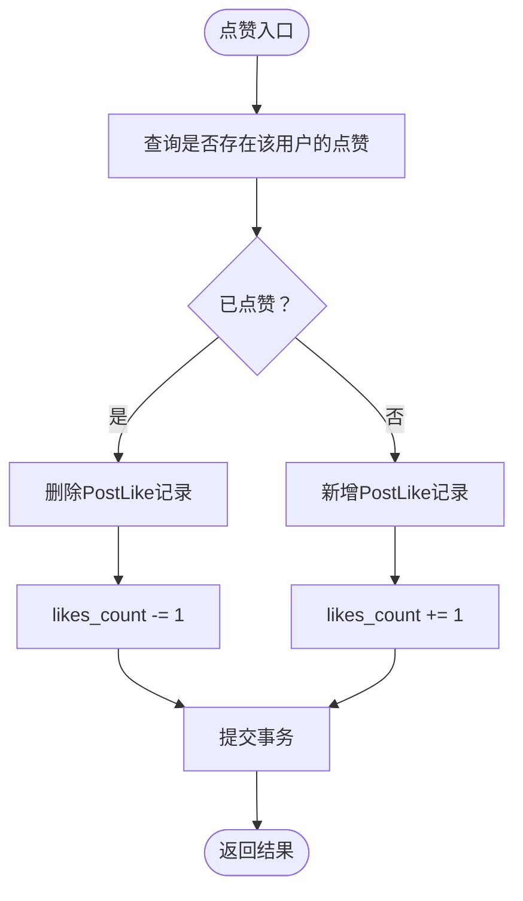
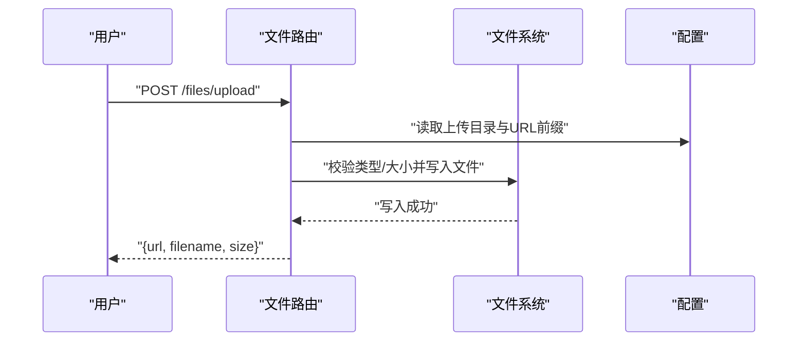
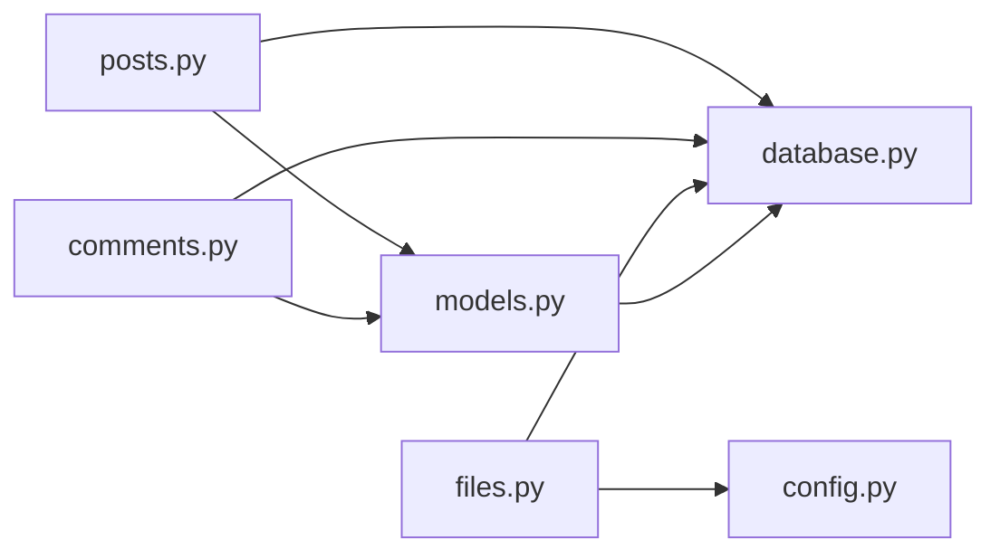

# 社交内容模型

<cite>
**本文引用的文件**
- [api_server/models.py](file://api_server/models.py)
- [api_server/schemas.py](file://api_server/schemas.py)
- [api_server/routers/posts.py](file://api_server/routers/posts.py)
- [api_server/routers/comments.py](file://api_server/routers/comments.py)
- [api_server/routers/files.py](file://api_server/routers/files.py)
- [api_server/database.py](file://api_server/database.py)
- [shared/config.py](file://shared/config.py)
- [README.md](file://README.md)
</cite>

## 目录
1. [简介](#简介)
2. [项目结构](#项目结构)
3. [核心组件](#核心组件)
4. [架构总览](#架构总览)
5. [详细组件分析](#详细组件分析)
6. [依赖关系分析](#依赖关系分析)
7. [性能考量](#性能考量)
8. [故障排查指南](#故障排查指南)
9. [结论](#结论)
10. [附录](#附录)

## 简介
本文件面向“社交内容”相关的核心数据模型与实现，围绕以下主题展开：
- Post、Comment、PostLike 模型的字段定义、关系映射与约束设计
- 帖子内容与图片资源的存储与访问机制
- 评论内容的存储与层级关系设计
- 点赞系统的唯一约束与并发安全、性能优化策略
- 删除级联与数据完整性保障
- 社交互动的数据访问模式与查询优化
- 图片资源管理与文件存储策略
- 审核与内容安全的现状与建议

## 项目结构
后端采用 FastAPI + SQLAlchemy 的分层架构：
- 数据模型与关系定义位于 models.py
- Pydantic 序列化模型位于 schemas.py
- 路由层负责业务流程编排，如帖子、评论、文件上传
- 数据库连接与会话管理位于 database.py
- 全局配置（含文件存储路径与 URL 前缀）位于 shared/config.py

图表来源
- [api_server/models.py](file://api_server/models.py#L80-L124)
- [api_server/schemas.py](file://api_server/schemas.py#L68-L131)
- [api_server/routers/posts.py](file://api_server/routers/posts.py#L1-L166)
- [api_server/routers/comments.py](file://api_server/routers/comments.py#L1-L121)
- [api_server/routers/files.py](file://api_server/routers/files.py#L1-L138)
- [api_server/database.py](file://api_server/database.py#L1-L33)
- [shared/config.py](file://shared/config.py#L26-L28)

章节来源
- [README.md](file://README.md#L1-L35)
- [api_server/models.py](file://api_server/models.py#L80-L124)
- [api_server/database.py](file://api_server/database.py#L1-L33)
- [shared/config.py](file://shared/config.py#L26-L28)

## 核心组件
- 帖子模型 Post：包含作者、内容、图片路径、点赞计数与创建时间；与用户、评论、点赞建立一对多关系，并通过外键级联删除保障数据一致性。
- 评论模型 Comment：包含帖子、作者、内容与创建时间；与帖子、用户建立一对多关系，同样受外键级联删除保护。
- 点赞模型 PostLike：记录用户对帖子的点赞，采用联合唯一约束防止重复点赞；与帖子、用户建立多对一关系，级联删除保证数据一致性。
- 文件模型（间接体现）：文件上传路由提供图片与头像上传能力，统一存储至配置指定目录并通过 URL 前缀对外提供访问。

章节来源
- [api_server/models.py](file://api_server/models.py#L80-L124)
- [api_server/routers/files.py](file://api_server/routers/files.py#L1-L138)
- [shared/config.py](file://shared/config.py#L26-L28)

## 架构总览
社交内容的典型流程：
- 用户通过帖子路由创建/查询/删除帖子
- 通过评论路由对帖子发表/删除评论
- 通过点赞路由进行点赞/取消点赞
- 通过文件路由上传图片资源，返回可访问 URL
- 数据持久化由 SQLAlchemy ORM 与数据库连接管理

图表来源
- [api_server/routers/posts.py](file://api_server/routers/posts.py#L131-L166)
- [api_server/models.py](file://api_server/models.py#L96-L110)

## 详细组件分析

### 帖子模型 Post
- 字段与索引
  - 主键 id
  - author_id 外键关联 users.id，删除时级联删除
  - content 文本内容
  - image_path 图片路径（字符串）
  - likes_count 整型计数
  - created_at 服务器默认时间戳，带索引
- 关系
  - 与 User 的多对一（作者）
  - 与 Comment 的一对多（评论）
  - 与 PostLike 的一对多（点赞）
- 级联与完整性
  - author_id 外键删除策略为 CASCADE，确保用户删除时其帖子被级联删除
  - 评论与点赞通过 back_populates 和 cascade="all, delete-orphan" 实现孤儿删除，避免悬挂数据

章节来源
- [api_server/models.py](file://api_server/models.py#L80-L94)

### 评论模型 Comment
- 字段与索引
  - 主键 id
  - post_id 外键关联 posts.id，删除时级联删除
  - author_id 外键关联 users.id，删除时级联删除
  - content 文本内容
  - created_at 服务器默认时间戳
- 关系
  - 与 Post 的多对一（所属帖子）
  - 与 User 的多对一（作者）
- 级联与完整性
  - post_id 与 author_id 均采用 CASCADE，确保删除帖子或用户时评论同步清理

章节来源
- [api_server/models.py](file://api_server/models.py#L112-L124)

### 点赞模型 PostLike
- 字段与索引
  - 主键 id
  - post_id 外键关联 posts.id，删除时级联删除
  - user_id 外键关联 users.id，删除时级联删除
  - created_at 服务器默认时间戳
- 唯一约束
  - 使用联合唯一约束 (post_id, user_id)，防止同一用户对同一帖子重复点赞
- 关系
  - 与 Post 的多对一（所属帖子）
  - 与 User 的多对一（点赞用户）

图表来源
- [api_server/models.py](file://api_server/models.py#L35-L61)
- [api_server/models.py](file://api_server/models.py#L80-L124)

章节来源
- [api_server/models.py](file://api_server/models.py#L96-L110)

### 帖子路由与数据访问模式
- 列表与详情
  - 支持分页查询，按创建时间倒序
  - 使用 joinedload 预加载作者信息，减少 N+1 查询
- 点赞/取消点赞
  - 先查询是否存在该用户的点赞记录，存在则删除并递减计数，否则新增并递增计数
  - 通过 likes_count 字段维护计数，避免每次查询统计
- 删除帖子
  - 校验权限（仅作者本人），随后删除，依赖数据库级联删除清理评论与点赞

图表来源
- [api_server/routers/posts.py](file://api_server/routers/posts.py#L131-L166)

章节来源
- [api_server/routers/posts.py](file://api_server/routers/posts.py#L45-L166)

### 评论路由与层级关系
- 列表
  - 支持分页与排序，预加载作者信息
- 发布与删除
  - 发布时校验帖子存在性
  - 删除时校验评论归属与权限

章节来源
- [api_server/routers/comments.py](file://api_server/routers/comments.py#L13-L121)

### 图片上传与资源管理
- 文件上传
  - 支持图片与头像两类上传
  - 限制文件类型与大小，生成唯一文件名，保存至配置目录
- 资源访问
  - 提供图片与头像的下载接口，基于配置中的上传目录与 URL 前缀
- 存储策略
  - 上传目录按 images/avatars 子目录组织
  - URL 前缀可配置，便于反向代理或 CDN 集成

图表来源
- [api_server/routers/files.py](file://api_server/routers/files.py#L41-L82)
- [shared/config.py](file://shared/config.py#L26-L28)

章节来源
- [api_server/routers/files.py](file://api_server/routers/files.py#L1-L138)
- [shared/config.py](file://shared/config.py#L26-L28)

### 数据库连接与会话
- 使用 SQLAlchemy 创建引擎与会话工厂
- 通过依赖注入提供数据库会话，确保请求生命周期内的事务一致性

章节来源
- [api_server/database.py](file://api_server/database.py#L1-L33)

## 依赖关系分析
- 路由层依赖模型层进行数据读写
- 文件路由依赖共享配置提供存储路径与 URL 前缀
- 数据模型依赖数据库连接与会话管理

图表来源
- [api_server/routers/posts.py](file://api_server/routers/posts.py#L1-L166)
- [api_server/routers/comments.py](file://api_server/routers/comments.py#L1-L121)
- [api_server/routers/files.py](file://api_server/routers/files.py#L1-L138)
- [api_server/models.py](file://api_server/models.py#L80-L124)
- [api_server/database.py](file://api_server/database.py#L1-L33)
- [shared/config.py](file://shared/config.py#L26-L28)

## 性能考量
- 查询优化
  - 帖子列表按 created_at 倒序分页，使用 joinedload 预加载作者，降低 N+1 查询
  - 评论列表按创建时间正序分页，控制每页数量上限
- 计数缓存
  - likes_count 字段直接维护，避免每次查询统计点赞数
- 并发与唯一性
  - PostLike 的联合唯一约束在数据库层面保证唯一性，避免重复点赞
  - 点赞/取消点赞逻辑在应用层先查后改，结合事务保证一致性
- I/O 与存储
  - 文件上传采用异步写入，限制文件类型与大小，降低异常风险
  - 上传目录按类型分层，便于管理与清理

章节来源
- [api_server/routers/posts.py](file://api_server/routers/posts.py#L45-L69)
- [api_server/routers/posts.py](file://api_server/routers/posts.py#L131-L166)
- [api_server/routers/comments.py](file://api_server/routers/comments.py#L13-L51)
- [api_server/routers/files.py](file://api_server/routers/files.py#L17-L19)

## 故障排查指南
- 帖子不存在
  - 列表/详情/点赞/删除均会检查帖子存在性，不存在时返回 404
- 权限不足
  - 删除帖子/评论需校验作者身份，否则返回 403
- 文件类型/大小错误
  - 上传接口会校验扩展名与大小，不符合要求返回 400
- 数据库连接
  - 若出现连接异常，检查数据库配置与服务状态

章节来源
- [api_server/routers/posts.py](file://api_server/routers/posts.py#L91-L128)
- [api_server/routers/comments.py](file://api_server/routers/comments.py#L93-L121)
- [api_server/routers/files.py](file://api_server/routers/files.py#L41-L82)

## 结论
本社交内容模型以简洁的关系设计与明确的约束实现了：
- 帖子、评论、点赞三者清晰的层次与关联
- 基于外键级联与联合唯一约束的数据完整性保障
- 高效的查询模式与计数缓存策略
- 完整的图片资源上传与访问链路

在现有实现基础上，建议进一步引入内容安全与审核机制，以满足更严格的内容治理需求。

## 附录
- API 端点概览（来自项目文档）
  - 帖子：GET /posts、POST /posts、GET /posts/{id}、DELETE /posts/{id}
  - 评论：GET /posts/{post_id}/comments、POST /posts/{post_id}/comments、DELETE /posts/{post_id}/comments/{comment_id}
  - 文件：POST /files/upload、POST /files/upload/avatar、GET /files/images/{filename}、GET /files/avatars/{filename}

章节来源
- [README.md](file://README.md#L229-L242)