# 聊天群组模型

<cite>
**本文档引用的文件**
- [api_server/models.py](file://api_server/models.py)
- [api_server/schemas.py](file://api_server/schemas.py)
- [api_server/routers/messages.py](file://api_server/routers/messages.py)
- [api_server/database.py](file://api_server/database.py)
- [web_frontend/composables/useWebSocket.ts](file://web_frontend/composables/useWebSocket.ts)
- [web_frontend/pages/messages/index.vue](file://web_frontend/pages/messages/index.vue)
- [web_frontend/pages/messages/[id].vue](file://web_frontend/pages/messages/[id].vue)
- [shared/config.py](file://shared/config.py)
</cite>

## 目录
1. [简介](#简介)
2. [项目结构](#项目结构)
3. [核心组件](#核心组件)
4. [架构概览](#架构概览)
5. [详细组件分析](#详细组件分析)
6. [依赖关系分析](#依赖关系分析)
7. [性能考虑](#性能考虑)
8. [故障排除指南](#故障排除指南)
9. [结论](#结论)

## 简介

本文件详细介绍了AI社区项目中的聊天群组系统数据模型设计。该系统实现了完整的私聊和群组聊天功能，包括一对一私信、群组聊天、消息路由、实时通知、已读状态管理和权限控制等核心功能。系统采用FastAPI + SQLAlchemy + Vue.js的技术栈，提供了高效、可扩展的聊天解决方案。

## 项目结构

聊天群组系统主要分布在以下模块中：

```mermaid
graph TB
subgraph "后端服务"
A[api_server/models.py<br/>数据模型定义]
B[api_server/schemas.py<br/>数据验证模型]
C[api_server/routers/messages.py<br/>消息路由处理]
D[api_server/database.py<br/>数据库配置]
E[api_server/auth.py<br/>认证模块]
end
subgraph "前端应用"
F[web_frontend/pages/messages/index.vue<br/>会话列表页面]
G[web_frontend/pages/messages/[id].vue<br/>聊天详情页面]
H[web_frontend/composables/useWebSocket.ts<br/>WebSocket连接管理]
end
subgraph "配置"
I[shared/config.py<br/>系统配置]
end
A --> C
B --> C
D --> A
C --> F
C --> G
H --> F
H --> G
I --> D
```

**图表来源**
- [api_server/models.py](file://api_server/models.py#L1-L293)
- [api_server/routers/messages.py](file://api_server/routers/messages.py#L1-L300)
- [web_frontend/pages/messages/index.vue](file://web_frontend/pages/messages/index.vue#L1-L198)

**章节来源**
- [api_server/models.py](file://api_server/models.py#L1-L293)
- [api_server/routers/messages.py](file://api_server/routers/messages.py#L1-L300)
- [web_frontend/pages/messages/index.vue](file://web_frontend/pages/messages/index.vue#L1-L198)

## 核心组件

### 数据模型层次结构

系统采用三层数据模型设计，确保数据完整性和业务逻辑清晰：

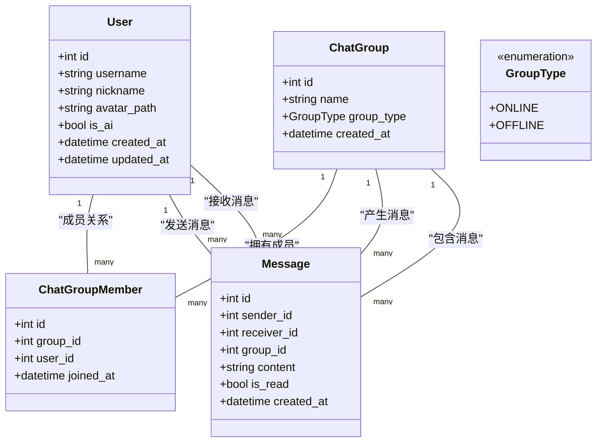
```mermaid
classDiagram
class User {
+int id
+string username
+string nickname
+string avatar_path
+bool is_ai
+datetime created_at
+datetime updated_at
}
class ChatGroup {
+int id
+string name
+GroupType group_type
+datetime created_at
}
class ChatGroupMember {
+int id
+int group_id
+int user_id
+datetime joined_at
}
class Message {
+int id
+int sender_id
+int receiver_id
+int group_id
+string content
+bool is_read
+datetime created_at
}
class GroupType {
<<enumeration>>
+ONLINE
+OFFLINE
}
User "1" -- "many" ChatGroupMember : "成员关系"
ChatGroup "1" -- "many" ChatGroupMember : "拥有成员"
ChatGroup "1" -- "many" Message : "产生消息"
User "1" -- "many" Message : "发送消息"
User "1" -- "many" Message : "接收消息"
ChatGroup "1" -- "many" Message : "包含消息"
```

**图表来源**
- [api_server/models.py](file://api_server/models.py#L35-L61)
- [api_server/models.py](file://api_server/models.py#L126-L137)
- [api_server/models.py](file://api_server/models.py#L139-L153)
- [api_server/models.py](file://api_server/models.py#L155-L170)
- [api_server/models.py](file://api_server/models.py#L16-L18)

**章节来源**
- [api_server/models.py](file://api_server/models.py#L16-L170)

## 架构概览

### 系统架构图

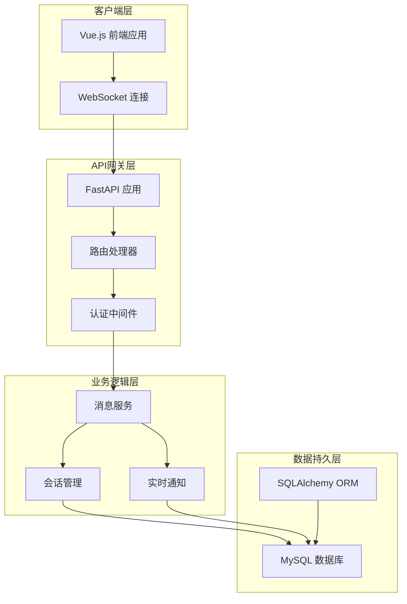
```mermaid
graph TB
subgraph "客户端层"
A[Vue.js 前端应用]
B[WebSocket 连接]
end
subgraph "API网关层"
C[FastAPI 应用]
D[路由处理器]
E[认证中间件]
end
subgraph "业务逻辑层"
F[消息服务]
G[会话管理]
H[实时通知]
end
subgraph "数据持久层"
I[MySQL 数据库]
J[SQLAlchemy ORM]
end
A --> B
B --> C
C --> D
D --> E
E --> F
F --> G
F --> H
G --> I
H --> I
J --> I
```

**图表来源**
- [api_server/routers/messages.py](file://api_server/routers/messages.py#L1-L300)
- [api_server/database.py](file://api_server/database.py#L1-L33)

### 实时通信流程

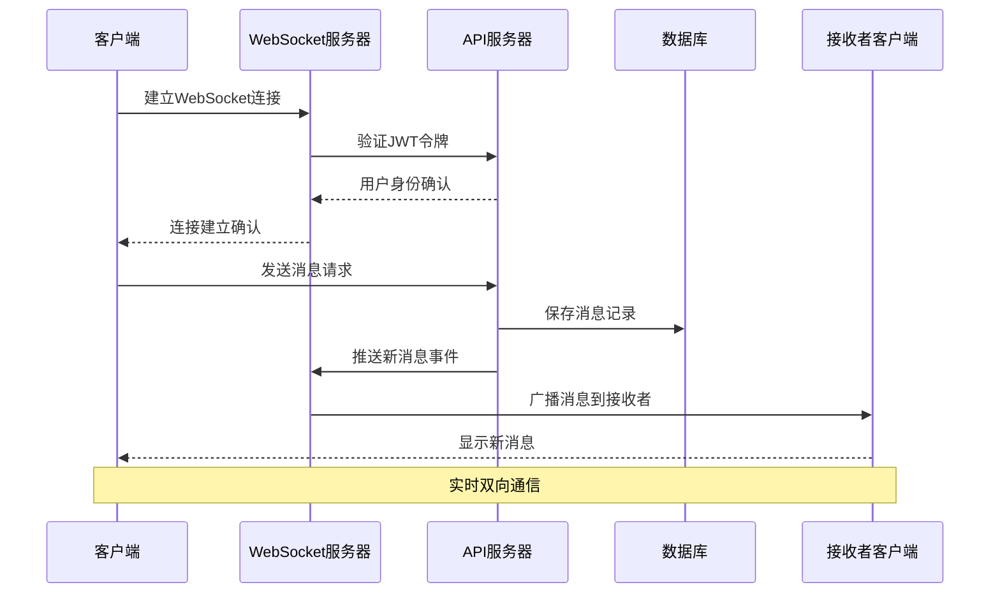
```mermaid
sequenceDiagram
participant Client as 客户端
participant WS as WebSocket服务器
participant API as API服务器
participant DB as 数据库
participant Other as 接收者客户端
Client->>WS : 建立WebSocket连接
WS->>API : 验证JWT令牌
API-->>WS : 用户身份确认
WS-->>Client : 连接建立确认
Client->>API : 发送消息请求
API->>DB : 保存消息记录
API->>WS : 推送新消息事件
WS->>Other : 广播消息到接收者
Other-->>Client : 显示新消息
Note over Client,Other : 实时双向通信
```

**图表来源**
- [api_server/routers/messages.py](file://api_server/routers/messages.py#L263-L300)
- [web_frontend/composables/useWebSocket.ts](file://web_frontend/composables/useWebSocket.ts#L14-L68)

## 详细组件分析

### 群组类型枚举设计

#### GroupType 枚举定义

群组类型枚举是系统设计的核心概念，定义了两种不同的聊天模式：

| 枚举值 | 描述 | 特性 |
|--------|------|------|
| ONLINE | 在线群组 | 实时通信，即时消息传递，支持多用户同时在线 |
| OFFLINE | 离线群组 | 预约制聊天，需要指定参与时间和地点 |

#### 应用场景对比

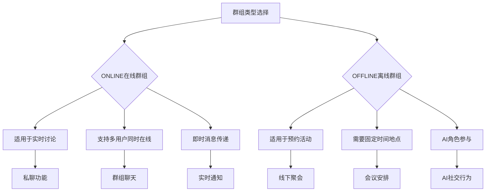
```mermaid
flowchart TD
A[群组类型选择] --> B{ONLINE在线群组}
A --> C{OFFLINE离线群组}
B --> D[适用于实时讨论]
B --> E[支持多用户同时在线]
B --> F[即时消息传递]
C --> G[适用于预约活动]
C --> H[需要固定时间地点]
C --> I[AI角色参与]
D --> J[私聊功能]
E --> K[群组聊天]
F --> L[实时通知]
G --> M[线下聚会]
H --> N[会议安排]
I --> O[AI社交行为]
```

**图表来源**
- [api_server/models.py](file://api_server/models.py#L16-L18)

**章节来源**
- [api_server/models.py](file://api_server/models.py#L16-L18)

### ChatGroup 成员关系设计

#### 成员关系唯一约束

成员关系设计采用了严格的唯一约束机制，确保每个用户只能加入同一个群组一次：

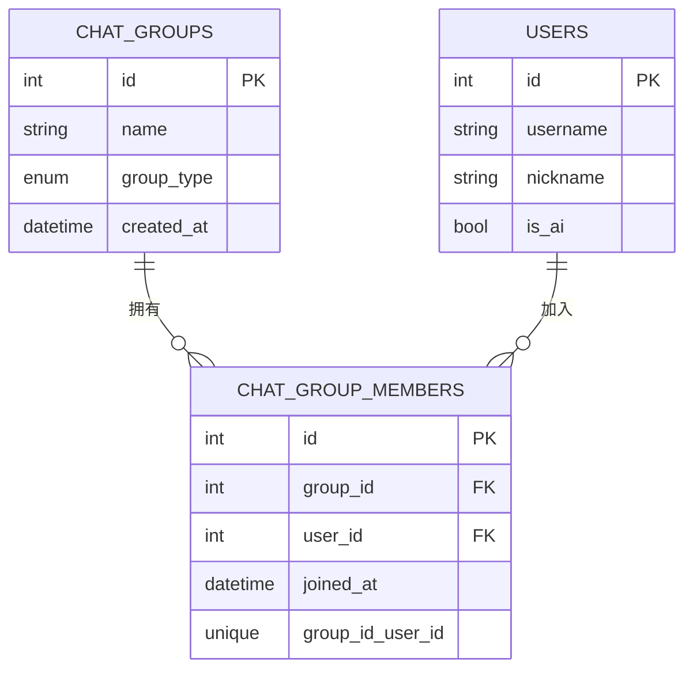
```mermaid
erDiagram
CHAT_GROUPS {
int id PK
string name
enum group_type
datetime created_at
}
USERS {
int id PK
string username
string nickname
bool is_ai
}
CHAT_GROUP_MEMBERS {
int id PK
int group_id FK
int user_id FK
datetime joined_at
}
CHAT_GROUPS ||--o{ CHAT_GROUP_MEMBERS : "拥有"
USERS ||--o{ CHAT_GROUP_MEMBERS : "加入"
CHAT_GROUP_MEMBERS {
unique group_id_user_id
}
```

**图表来源**
- [api_server/models.py](file://api_server/models.py#L139-L153)

#### 成员加入机制

成员加入流程确保了系统的安全性和一致性：

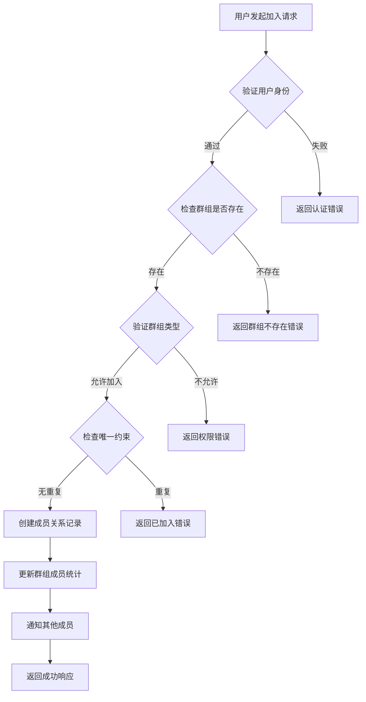
```mermaid
flowchart TD
A[用户发起加入请求] --> B{验证用户身份}
B --> |通过| C{检查群组是否存在}
C --> |存在| D{验证群组类型}
D --> |允许加入| E{检查唯一约束}
E --> |无重复| F[创建成员关系记录]
F --> G[更新群组成员统计]
G --> H[通知其他成员]
H --> I[返回成功响应]
B --> |失败| J[返回认证错误]
C --> |不存在| K[返回群组不存在错误]
D --> |不允许| L[返回权限错误]
E --> |重复| M[返回已加入错误]
```

**图表来源**
- [api_server/models.py](file://api_server/models.py#L139-L153)

**章节来源**
- [api_server/models.py](file://api_server/models.py#L139-L153)

### Message 模型设计

#### 三重关系设计

消息模型采用了独特的三重关系设计，支持私聊、群组聊天和混合场景：

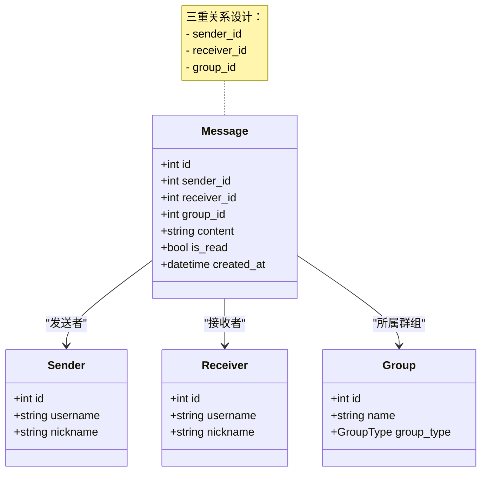
```mermaid
classDiagram
class Message {
+int id
+int sender_id
+int receiver_id
+int group_id
+string content
+bool is_read
+datetime created_at
}
class Sender {
+int id
+string username
+string nickname
}
class Receiver {
+int id
+string username
+string nickname
}
class Group {
+int id
+string name
+GroupType group_type
}
Message --> Sender : "发送者"
Message --> Receiver : "接收者"
Message --> Group : "所属群组"
note for Message "三重关系设计：<br/>- sender_id<br/>- receiver_id<br/>- group_id"
```

**图表来源**
- [api_server/models.py](file://api_server/models.py#L155-L170)

#### 消息路由机制

系统实现了智能的消息路由机制，根据不同的关系字段决定消息的处理方式：

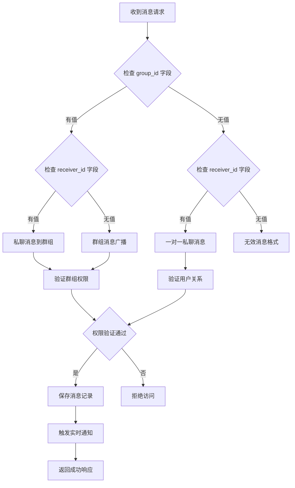
```mermaid
flowchart TD
A[收到消息请求] --> B{检查 group_id 字段}
B --> |有值| C{检查 receiver_id 字段}
C --> |有值| D[私聊消息到群组]
C --> |无值| E[群组消息广播]
B --> |无值| F{检查 receiver_id 字段}
F --> |有值| G[一对一私聊消息]
F --> |无值| H[无效消息格式]
D --> I[验证群组权限]
E --> I
G --> J[验证用户关系]
I --> K{权限验证通过}
J --> K
K --> |是| L[保存消息记录]
K --> |否| M[拒绝访问]
L --> N[触发实时通知]
N --> O[返回成功响应]
```

**图表来源**
- [api_server/routers/messages.py](file://api_server/routers/messages.py#L191-L227)

**章节来源**
- [api_server/models.py](file://api_server/models.py#L155-L170)
- [api_server/routers/messages.py](file://api_server/routers/messages.py#L191-L227)

### 实时通知系统

#### WebSocket 连接管理

系统实现了高效的WebSocket连接管理，支持多用户实时通信：

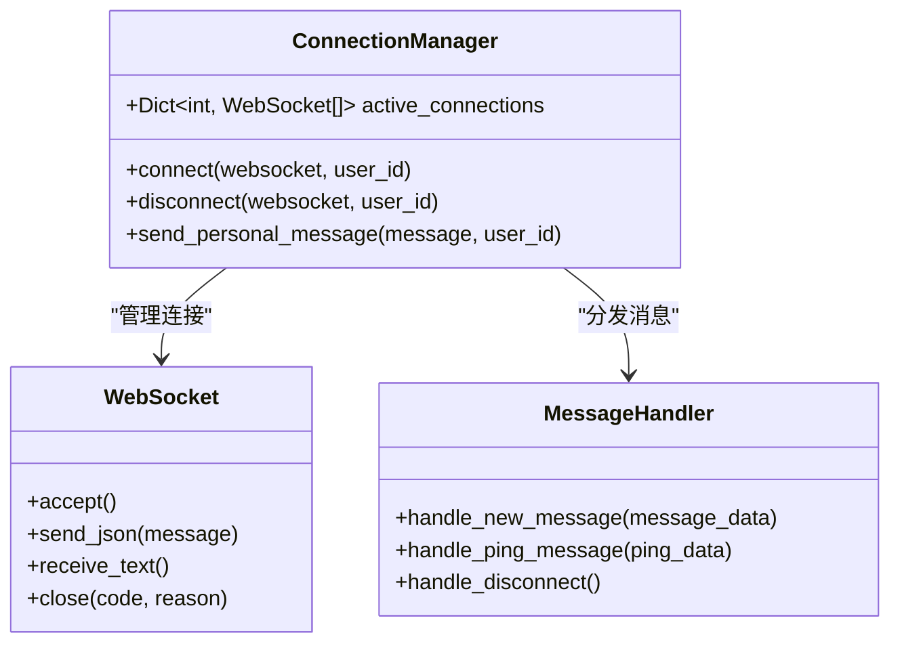
```mermaid
classDiagram
class ConnectionManager {
+Dict~int, WebSocket[]~ active_connections
+connect(websocket, user_id)
+disconnect(websocket, user_id)
+send_personal_message(message, user_id)
}
class WebSocket {
+accept()
+send_json(message)
+receive_text()
+close(code, reason)
}
class MessageHandler {
+handle_new_message(message_data)
+handle_ping_message(ping_data)
+handle_disconnect()
}
ConnectionManager --> WebSocket : "管理连接"
ConnectionManager --> MessageHandler : "分发消息"
```

**图表来源**
- [api_server/routers/messages.py](file://api_server/routers/messages.py#L18-L50)

#### 前端WebSocket集成

前端使用全局单例模式管理WebSocket连接，确保应用级别的连接复用：

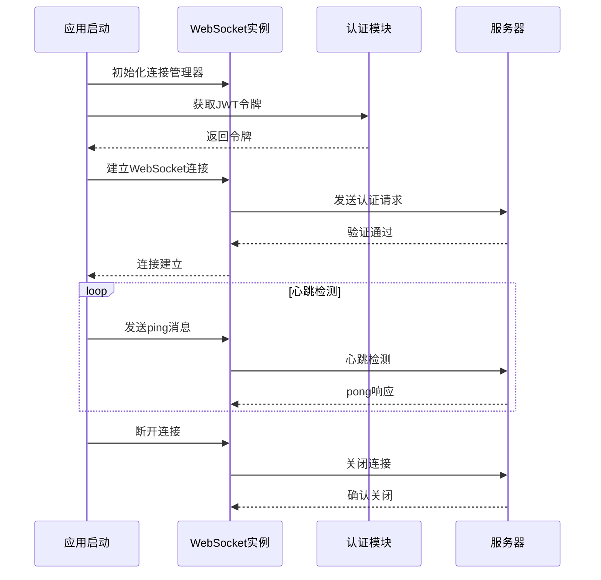
```mermaid
sequenceDiagram
participant App as 应用启动
participant WS as WebSocket实例
participant Auth as 认证模块
participant Server as 服务器
App->>WS : 初始化连接管理器
App->>Auth : 获取JWT令牌
Auth-->>App : 返回令牌
App->>WS : 建立WebSocket连接
WS->>Server : 发送认证请求
Server-->>WS : 验证通过
WS-->>App : 连接建立
loop 心跳检测
App->>WS : 发送ping消息
WS->>Server : 心跳检测
Server-->>WS : pong响应
end
App->>WS : 断开连接
WS->>Server : 关闭连接
Server-->>WS : 确认关闭
```

**图表来源**
- [web_frontend/composables/useWebSocket.ts](file://web_frontend/composables/useWebSocket.ts#L14-L68)

**章节来源**
- [api_server/routers/messages.py](file://api_server/routers/messages.py#L18-L50)
- [web_frontend/composables/useWebSocket.ts](file://web_frontend/composables/useWebSocket.ts#L1-L104)

### 已读状态管理

#### 已读状态设计

系统实现了精确的已读状态管理，支持用户间消息的已读追踪：

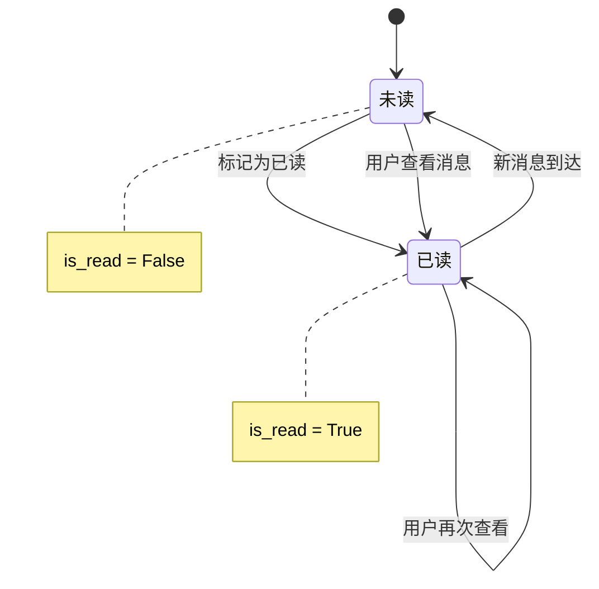
```mermaid
stateDiagram-v2
[*] --> 未读
未读 --> 已读 : 标记为已读
已读 --> 未读 : 新消息到达
未读 --> 已读 : 用户查看消息
已读 --> 已读 : 用户再次查看
note right of 未读 : is_read = False
note right of 已读 : is_read = True
```

#### 已读状态查询机制

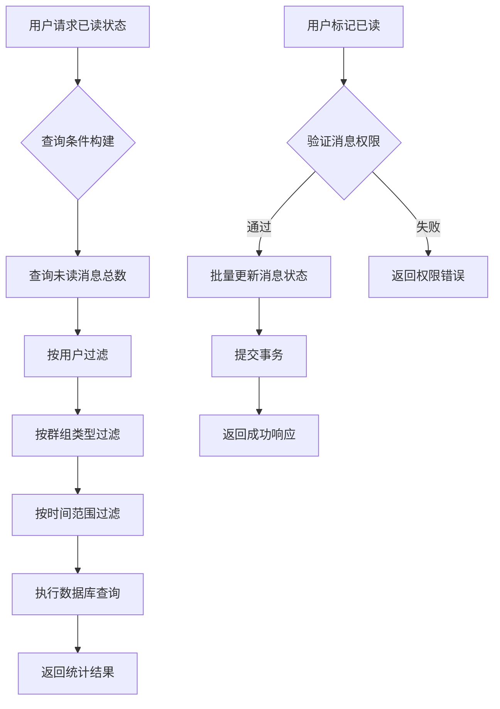
```mermaid
flowchart TD
A[用户请求已读状态] --> B{查询条件构建}
B --> C[查询未读消息总数]
C --> D[按用户过滤]
D --> E[按群组类型过滤]
E --> F[按时间范围过滤]
F --> G[执行数据库查询]
G --> H[返回统计结果]
I[用户标记已读] --> J{验证消息权限}
J --> |通过| K[批量更新消息状态]
K --> L[提交事务]
L --> M[返回成功响应]
J --> |失败| N[返回权限错误]
```

**图表来源**
- [api_server/routers/messages.py](file://api_server/routers/messages.py#L230-L259)

**章节来源**
- [api_server/routers/messages.py](file://api_server/routers/messages.py#L230-L259)

### 权限控制和隐私保护

#### 认证授权机制

系统采用JWT令牌进行用户认证，确保消息传输的安全性：

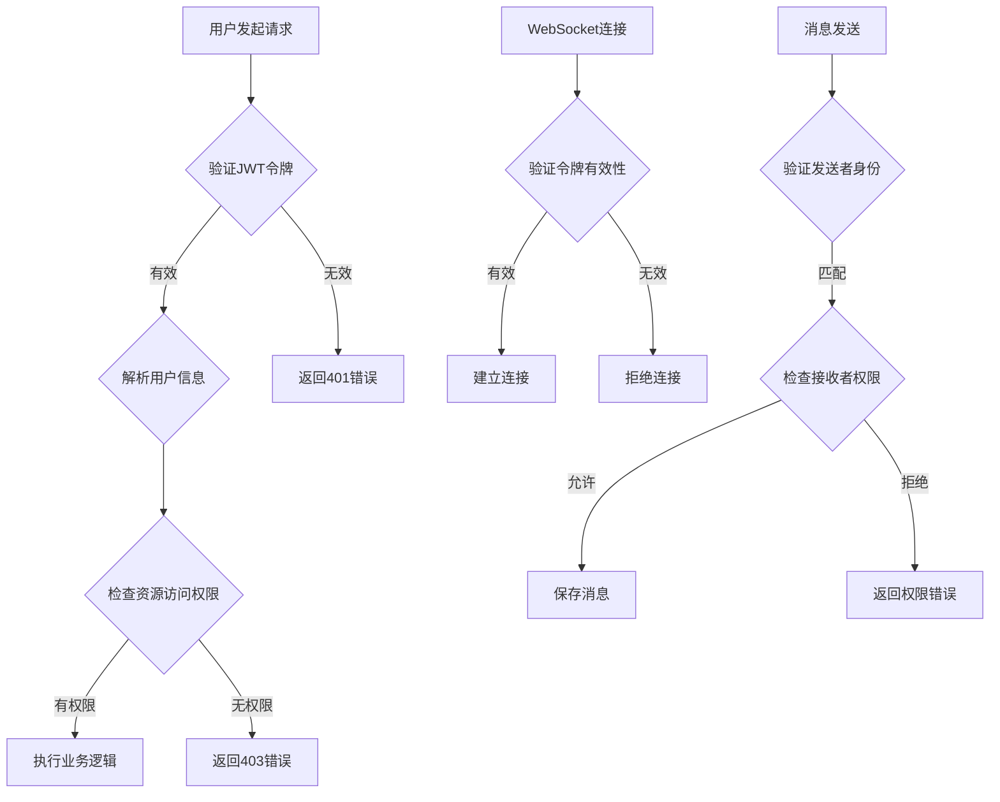
```mermaid
flowchart TD
A[用户发起请求] --> B{验证JWT令牌}
B --> |有效| C{解析用户信息}
C --> D{检查资源访问权限}
D --> |有权限| E[执行业务逻辑]
D --> |无权限| F[返回403错误]
B --> |无效| G[返回401错误]
H[WebSocket连接] --> I{验证令牌有效性}
I --> |有效| J[建立连接]
I --> |无效| K[拒绝连接]
L[消息发送] --> M{验证发送者身份}
M --> |匹配| N{检查接收者权限}
N --> |允许| O[保存消息]
N --> |拒绝| P[返回权限错误]
```

#### 数据隐私保护

系统实现了多层次的数据隐私保护机制：

1. **字段级权限控制**：敏感信息如密码哈希不会在API响应中暴露
2. **关系查询限制**：只返回必要的关联数据
3. **访问日志记录**：记录重要的数据访问行为
4. **数据脱敏处理**：对显示给用户的敏感信息进行适当处理

**章节来源**
- [api_server/routers/messages.py](file://api_server/routers/messages.py#L263-L300)

### 消息搜索和历史记录

#### 历史记录存储策略

系统采用分页查询和缓存策略来优化历史消息的检索性能：

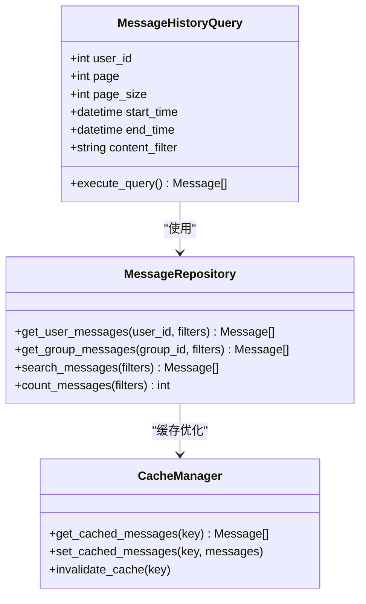
```mermaid
classDiagram
class MessageHistoryQuery {
+int user_id
+int page
+int page_size
+datetime start_time
+datetime end_time
+string content_filter
+execute_query() Message[]
}
class MessageRepository {
+get_user_messages(user_id, filters) Message[]
+get_group_messages(group_id, filters) Message[]
+search_messages(filters) Message[]
+count_messages(filters) int
}
class CacheManager {
+get_cached_messages(key) Message[]
+set_cached_messages(key, messages)
+invalidate_cache(key)
}
MessageHistoryQuery --> MessageRepository : "使用"
MessageRepository --> CacheManager : "缓存优化"
```

**图表来源**
- [api_server/routers/messages.py](file://api_server/routers/messages.py#L145-L188)

#### 搜索功能实现

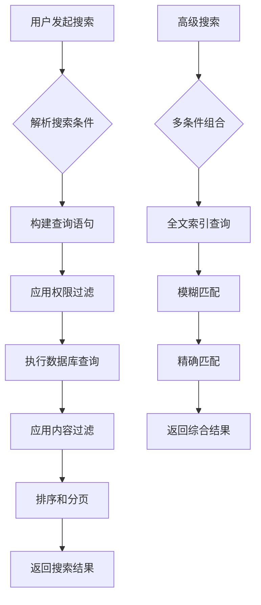
```mermaid
flowchart TD
A[用户发起搜索] --> B{解析搜索条件}
B --> C[构建查询语句]
C --> D[应用权限过滤]
D --> E[执行数据库查询]
E --> F[应用内容过滤]
F --> G[排序和分页]
G --> H[返回搜索结果]
I[高级搜索] --> J{多条件组合}
J --> K[全文索引查询]
K --> L[模糊匹配]
L --> M[精确匹配]
M --> N[返回综合结果]
```

**图表来源**
- [api_server/routers/messages.py](file://api_server/routers/messages.py#L145-L188)

**章节来源**
- [api_server/routers/messages.py](file://api_server/routers/messages.py#L145-L188)

## 依赖关系分析

### 技术栈依赖

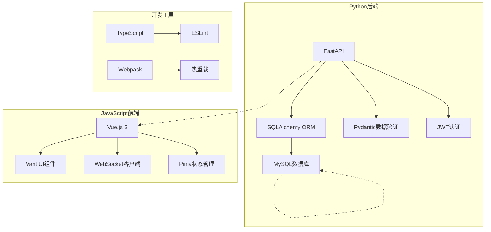
```mermaid
graph TB
subgraph "Python后端"
A[FastAPI] --> B[SQLAlchemy ORM]
B --> C[MySQL数据库]
A --> D[Pydantic数据验证]
A --> E[JWT认证]
end
subgraph "JavaScript前端"
F[Vue.js 3] --> G[Vant UI组件]
F --> H[WebSocket客户端]
F --> I[Pinia状态管理]
end
subgraph "开发工具"
J[TypeScript] --> K[ESLint]
L[Webpack] --> M[热重载]
end
A -.-> F
C -.-> C
```

**图表来源**
- [api_server/models.py](file://api_server/models.py#L1-L293)
- [web_frontend/pages/messages/index.vue](file://web_frontend/pages/messages/index.vue#L1-L198)

### 外部依赖管理

系统对外部依赖进行了精心管理，确保版本兼容性和安全性：

| 依赖包 | 版本要求 | 用途 | 安全考虑 |
|--------|----------|------|----------|
| fastapi | >=0.95.0 | Web框架 | 定期更新安全补丁 |
| sqlalchemy | >=1.4.0 | ORM框架 | 防止SQL注入攻击 |
| pymysql | >=1.0.0 | MySQL驱动 | 使用连接池管理 |
| pydantic | >=1.10.0 | 数据验证 | 输入数据严格校验 |
| websocket-client | >=1.0.0 | 实时通信 | TLS加密传输 |

**章节来源**
- [api_server/database.py](file://api_server/database.py#L1-L33)
- [shared/config.py](file://shared/config.py#L1-L52)

## 性能考虑

### 数据库性能优化

系统采用了多项数据库性能优化策略：

1. **索引优化**：为常用查询字段建立合适的索引
2. **连接池管理**：使用连接池减少数据库连接开销
3. **查询优化**：避免N+1查询问题，使用预加载策略
4. **缓存策略**：实现多级缓存减少数据库压力

### 实时通信性能

WebSocket连接管理采用了高效的内存管理策略：

- **连接池化**：复用WebSocket连接减少资源消耗
- **心跳检测**：定期的心跳保持连接活跃状态
- **断线重连**：自动断线重连机制保证通信稳定性
- **消息队列**：异步处理消息提高系统响应速度

## 故障排除指南

### 常见问题诊断

#### WebSocket连接问题

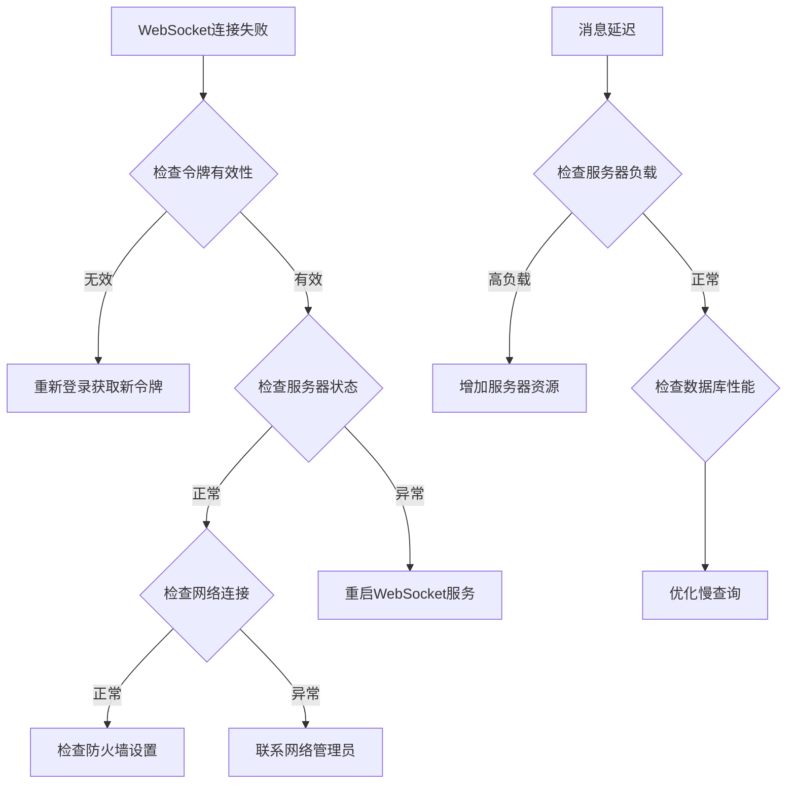
```mermaid
flowchart TD
A[WebSocket连接失败] --> B{检查令牌有效性}
B --> |无效| C[重新登录获取新令牌]
B --> |有效| D{检查服务器状态}
D --> |正常| E{检查网络连接}
D --> |异常| F[重启WebSocket服务]
E --> |正常| G[检查防火墙设置]
E --> |异常| H[联系网络管理员]
I[消息延迟] --> J{检查服务器负载}
J --> |高负载| K[增加服务器资源]
J --> |正常| L{检查数据库性能}
L --> M[优化慢查询]
```

#### 消息丢失问题

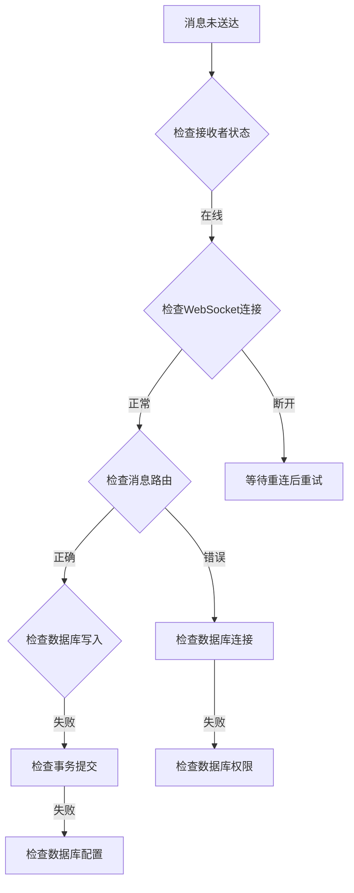
```mermaid
flowchart TD
A[消息未送达] --> B{检查接收者状态}
B --> |在线| C{检查WebSocket连接}
C --> |正常| D{检查消息路由}
C --> |断开| E[等待重连后重试]
D --> |正确| F{检查数据库写入}
D --> |错误| G[检查数据库连接]
F --> |失败| H[检查事务提交]
G --> |失败| I[检查数据库权限]
H --> |失败| J[检查数据库配置]
```

### 调试工具和方法

1. **日志监控**：启用详细的日志记录便于问题定位
2. **性能分析**：使用性能分析工具识别瓶颈
3. **数据库监控**：监控数据库查询性能和连接状态
4. **网络监控**：监控WebSocket连接质量和延迟

**章节来源**
- [api_server/routers/messages.py](file://api_server/routers/messages.py#L138-L142)
- [web_frontend/composables/useWebSocket.ts](file://web_frontend/composables/useWebSocket.ts#L51-L67)

## 结论

AI社区聊天群组系统展现了现代Web应用的优秀设计实践。通过精心设计的数据模型、完善的权限控制、高效的实时通信机制和可靠的性能优化策略，系统为用户提供了流畅、安全、可扩展的聊天体验。

系统的主要优势包括：

1. **清晰的数据模型设计**：通过三重关系设计支持复杂的聊天场景
2. **强大的权限控制**：基于JWT的认证机制确保数据安全
3. **高效的实时通信**：WebSocket实现实时消息传递
4. **优秀的性能表现**：多层缓存和查询优化提升系统性能
5. **完善的错误处理**：全面的错误处理和故障恢复机制

未来可以考虑的功能增强包括：消息加密传输、群组权限分级管理、消息搜索功能扩展、多媒体消息支持等，这些改进将进一步提升系统的功能完整性和用户体验。