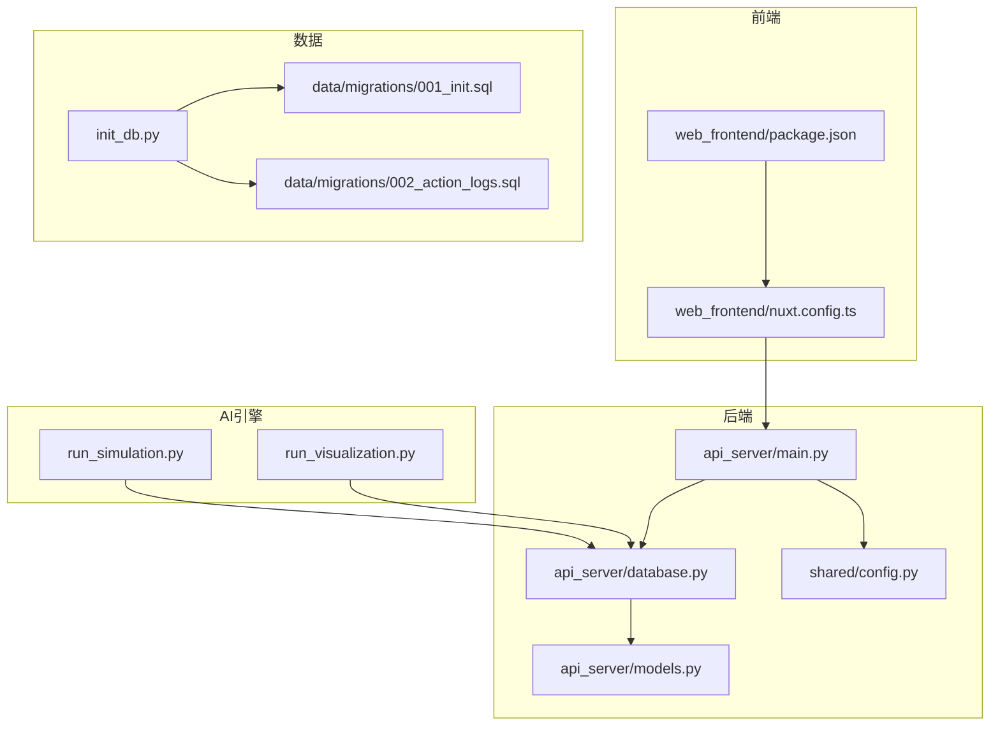
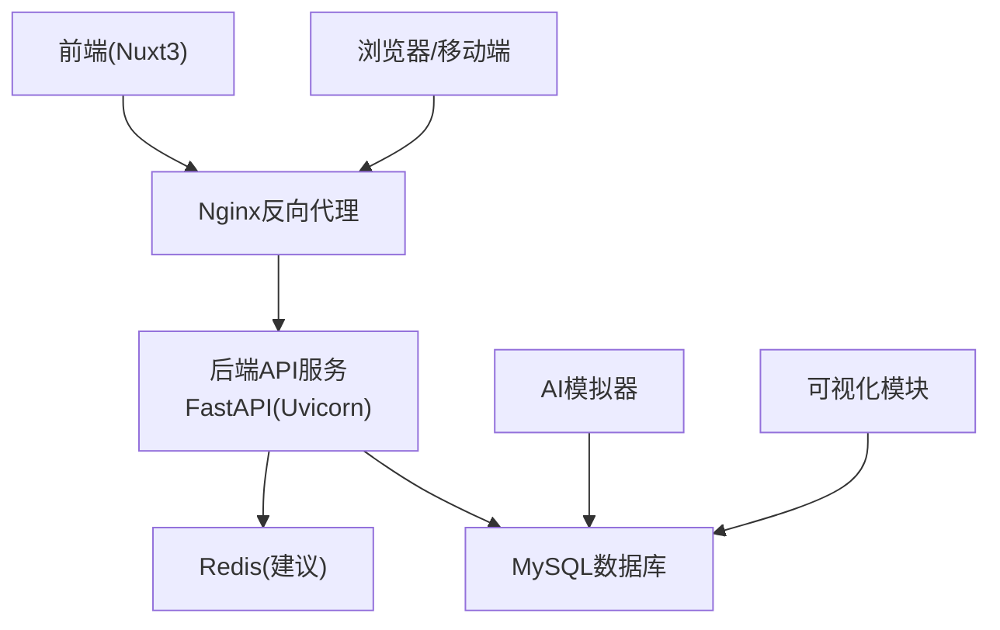
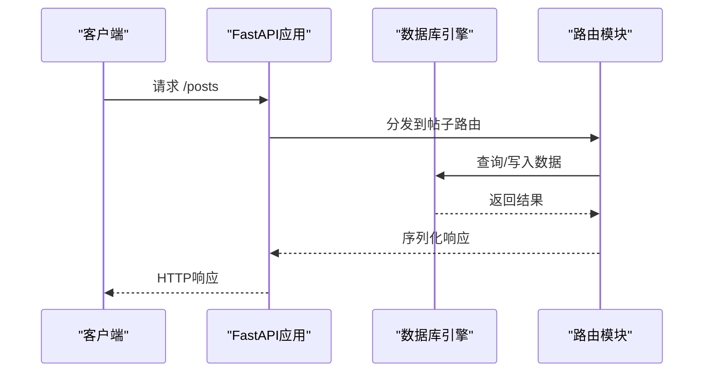
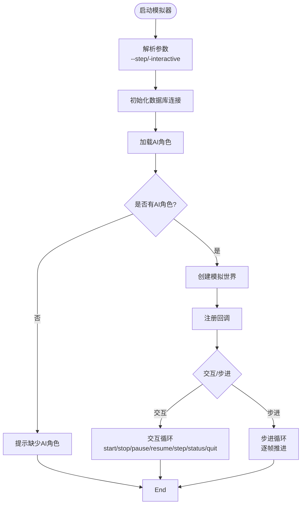
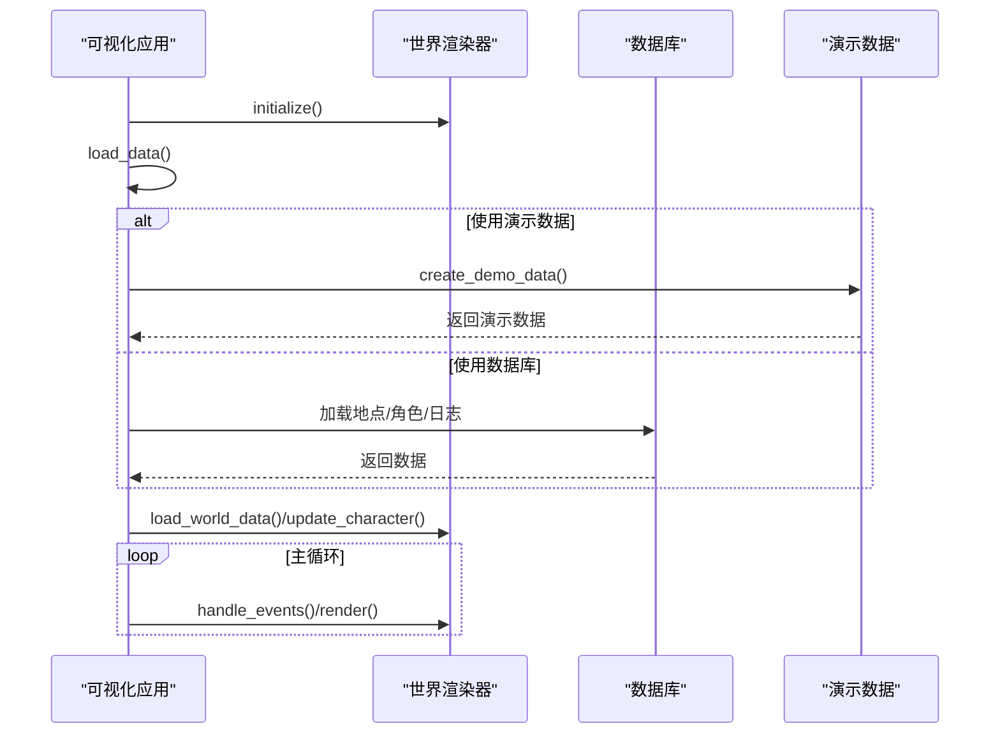
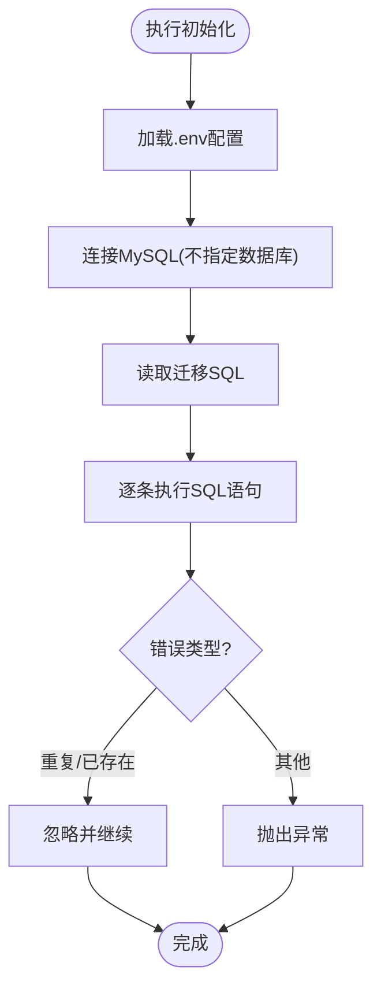
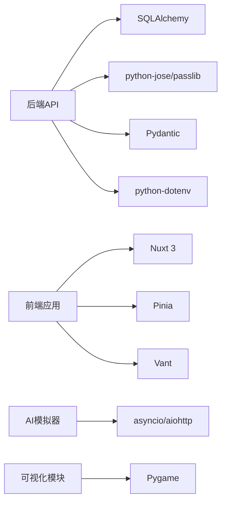

# 部署与运维

<cite>
**本文引用的文件**
- [README.md](file://README.md)
- [requirements.txt](file://requirements.txt)
- [start.bat](file://start.bat)
- [run_simulation.py](file://run_simulation.py)
- [run_visualization.py](file://run_visualization.py)
- [init_db.py](file://init_db.py)
- [shared/config.py](file://shared/config.py)
- [api_server/main.py](file://api_server/main.py)
- [api_server/database.py](file://api_server/database.py)
- [api_server/models.py](file://api_server/models.py)
- [test_social.py](file://test_social.py)
- [web_frontend/package.json](file://web_frontend/package.json)
- [web_frontend/nuxt.config.ts](file://web_frontend/nuxt.config.ts)
- [data/migrations/001_init.sql](file://data/migrations/001_init.sql)
- [data/migrations/002_action_logs.sql](file://data/migrations/002_action_logs.sql)
- [.env.template](file://.env.template)
</cite>

## 目录
1. [简介](#简介)
2. [项目结构](#项目结构)
3. [核心组件](#核心组件)
4. [架构总览](#架构总览)
5. [详细组件分析](#详细组件分析)
6. [依赖关系分析](#依赖关系分析)
7. [性能考量](#性能考量)
8. [故障排除指南](#故障排除指南)
9. [结论](#结论)
10. [附录](#附录)

## 简介
本文件面向AI社区项目的部署与运维团队，提供从开发到生产的完整实践指南。内容涵盖服务启动脚本使用（后端API、前端开发服务器、AI模拟器与可视化）、开发工具配置（单元测试、代码质量检查、性能监控）、生产环境部署（服务器配置、负载均衡、容器化）、日志与监控、数据库备份与维护、故障排除、安全加固与访问控制、以及运维自动化与告警配置。

## 项目结构
项目采用前后端分离与AI模拟引擎并行的多服务架构：
- 后端API服务：基于FastAPI，提供认证、用户、帖子、评论、文件、消息等接口，并内置健康检查。
- 前端应用：基于Nuxt 3 + Vue 3，通过环境变量配置API基础地址。
- AI模拟引擎：事件驱动的时间模型，支持交互式与步进式模拟。
- 可视化模块：Pygame渲染世界、角色与行动日志，支持演示模式与数据库模式。
- 数据层：MySQL数据库，包含用户、地点、记忆、帖子、评论、消息、事件、生图队列、物品栏、行动日志等表。
- 配置层：共享配置与环境变量，集中管理数据库、JWT、文件存储、AI服务等参数。

图表来源
- [api_server/main.py](file://api_server/main.py#L1-L69)
- [api_server/database.py](file://api_server/database.py#L1-L33)
- [api_server/models.py](file://api_server/models.py#L1-L293)
- [shared/config.py](file://shared/config.py#L1-L52)
- [run_simulation.py](file://run_simulation.py#L1-L258)
- [run_visualization.py](file://run_visualization.py#L1-L439)
- [init_db.py](file://init_db.py#L1-L70)
- [data/migrations/001_init.sql](file://data/migrations/001_init.sql#L1-L205)
- [data/migrations/002_action_logs.sql](file://data/migrations/002_action_logs.sql#L1-L44)
- [web_frontend/package.json](file://web_frontend/package.json#L1-L28)
- [web_frontend/nuxt.config.ts](file://web_frontend/nuxt.config.ts#L1-L42)

章节来源
- [README.md](file://README.md#L1-L290)
- [requirements.txt](file://requirements.txt#L1-L32)

## 核心组件
- 后端API服务
  - 入口与路由：[api_server/main.py](file://api_server/main.py#L1-L69)，注册认证、用户、帖子、评论、文件、消息等路由。
  - 数据库连接：[api_server/database.py](file://api_server/database.py#L1-L33)，使用共享配置生成数据库URL并建立连接池。
  - 数据模型：[api_server/models.py](file://api_server/models.py#L1-L293)，定义用户、记忆、帖子、评论、消息、地点、事件、生图队列、物品栏、行动日志等表及枚举。
  - 配置中心：[shared/config.py](file://shared/config.py#L1-L52)，集中管理数据库、JWT、服务器、前端、文件存储、AI预留参数等。
- 前端应用
  - 包管理与脚本：[web_frontend/package.json](file://web_frontend/package.json#L1-L28)，定义构建、开发、预览等脚本。
  - 运行时配置：[web_frontend/nuxt.config.ts](file://web_frontend/nuxt.config.ts#L1-L42)，设置公开API基础地址、模块、样式等。
- AI模拟器
  - 交互与步进：[run_simulation.py](file://run_simulation.py#L1-L258)，支持交互命令（start/stop/pause/resume/step/status/quit）与步进模式。
  - 数据库集成：通过数据库会话工厂加载AI角色、地点与行动日志，初始化模拟世界。
- 可视化模块
  - Pygame渲染：[run_visualization.py](file://run_visualization.py#L1-L439)，支持从数据库加载数据或演示数据，渲染世界、角色与行动日志。
- 数据库初始化与迁移
  - 初始化脚本：[init_db.py](file://init_db.py#L1-L70)，读取.env配置，执行SQL迁移文件。
  - 迁移脚本：[data/migrations/001_init.sql](file://data/migrations/001_init.sql#L1-L205)、[data/migrations/002_action_logs.sql](file://data/migrations/002_action_logs.sql#L1-L44)，创建核心表与索引。
- 环境与依赖
  - 依赖清单：[requirements.txt](file://requirements.txt#L1-L32)，包含FastAPI、SQLAlchemy、PyMySQL、JWT、Pydantic、CORS、异步、图像处理、dotenv等。
  - 环境模板：[.env.template](file://.env.template#L1-L30)，定义数据库、JWT、服务器、前端、文件存储、AI预留等参数。

章节来源
- [api_server/main.py](file://api_server/main.py#L1-L69)
- [api_server/database.py](file://api_server/database.py#L1-L33)
- [api_server/models.py](file://api_server/models.py#L1-L293)
- [shared/config.py](file://shared/config.py#L1-L52)
- [run_simulation.py](file://run_simulation.py#L1-L258)
- [run_visualization.py](file://run_visualization.py#L1-L439)
- [init_db.py](file://init_db.py#L1-L70)
- [data/migrations/001_init.sql](file://data/migrations/001_init.sql#L1-L205)
- [data/migrations/002_action_logs.sql](file://data/migrations/002_action_logs.sql#L1-L44)
- [web_frontend/package.json](file://web_frontend/package.json#L1-L28)
- [web_frontend/nuxt.config.ts](file://web_frontend/nuxt.config.ts#L1-L42)
- [requirements.txt](file://requirements.txt#L1-L32)
- [.env.template](file://.env.template#L1-L30)

## 架构总览
系统采用“前端-Nginx反向代理-后端API-数据库”的典型三层架构；AI模拟器与可视化作为独立进程运行，通过数据库共享状态。

图表来源
- [api_server/main.py](file://api_server/main.py#L1-L69)
- [api_server/database.py](file://api_server/database.py#L1-L33)
- [run_simulation.py](file://run_simulation.py#L1-L258)
- [run_visualization.py](file://run_visualization.py#L1-L439)

## 详细组件分析

### 后端API服务
- 启动方式
  - 开发模式：直接运行入口模块，自动热更新。
  - 生产模式：建议使用Uvicorn/Gunicorn + Nginx部署。
- 健康检查：提供健康检查端点，便于Kubernetes/负载均衡探活。
- CORS与静态资源：允许前端域名访问，支持静态文件挂载。
- 路由组织：按业务域划分路由模块，便于扩展与维护。

图表来源
- [api_server/main.py](file://api_server/main.py#L1-L69)
- [api_server/database.py](file://api_server/database.py#L1-L33)

章节来源
- [api_server/main.py](file://api_server/main.py#L1-L69)
- [api_server/database.py](file://api_server/database.py#L1-L33)

### AI模拟器
- 交互模式：支持启动/停止/暂停/恢复/单步/状态查询/退出等命令。
- 步进模式：指定步数的手动推进，适合调试与演示。
- 回调机制：行动开始/结束、时间推进回调，便于日志与可视化联动。
- 数据加载：从数据库加载AI角色与世界配置，初始化模拟世界。

图表来源
- [run_simulation.py](file://run_simulation.py#L1-L258)

章节来源
- [run_simulation.py](file://run_simulation.py#L1-L258)

### 可视化模块
- 数据源：优先从数据库加载地点、角色、行动日志；若失败则降级为演示数据。
- 渲染器：Pygame渲染世界、角色、标签、网格与调试信息。
- 交互：鼠标中键拖拽、滚轮缩放、点击角色查看详情、快捷键切换显示选项。
- 动画演示：在演示模式下模拟角色移动，便于展示。

图表来源
- [run_visualization.py](file://run_visualization.py#L1-L439)

章节来源
- [run_visualization.py](file://run_visualization.py#L1-L439)

### 数据库初始化与迁移
- 初始化流程：读取.env配置，连接MySQL，执行迁移SQL文件，忽略重复与表已存在等非致命错误。
- 迁移清单：初始表结构与索引、AI行动日志表，确保AI行为可追溯。

图表来源
- [init_db.py](file://init_db.py#L1-L70)
- [data/migrations/001_init.sql](file://data/migrations/001_init.sql#L1-L205)
- [data/migrations/002_action_logs.sql](file://data/migrations/002_action_logs.sql#L1-L44)

章节来源
- [init_db.py](file://init_db.py#L1-L70)
- [data/migrations/001_init.sql](file://data/migrations/001_init.sql#L1-L205)
- [data/migrations/002_action_logs.sql](file://data/migrations/002_action_logs.sql#L1-L44)

### 前端开发与构建
- 开发脚本：Nuxt Dev提供热更新与调试工具。
- 构建与预览：Nuxt Build与Preview用于生产前验证。
- API基础地址：通过运行时配置注入，支持不同环境切换。

章节来源
- [web_frontend/package.json](file://web_frontend/package.json#L1-L28)
- [web_frontend/nuxt.config.ts](file://web_frontend/nuxt.config.ts#L1-L42)

## 依赖关系分析
- 后端依赖
  - FastAPI/Uvicorn：Web框架与ASGI服务器。
  - SQLAlchemy/PyMySQL：ORM与MySQL驱动。
  - Pydantic/Pydantic-settings：数据校验与配置管理。
  - python-jose/passlib/bcrypt：JWT与密码加密。
  - python-dotenv：环境变量加载。
- 前端依赖
  - Nuxt 3/Vue 3：框架与响应式系统。
  - Pinia：状态管理。
  - Vant：移动端UI组件库。
- AI可视化
  - Pygame：渲染与交互。
  - aiohttp/asyncio：异步调度与HTTP请求。

图表来源
- [requirements.txt](file://requirements.txt#L1-L32)
- [api_server/main.py](file://api_server/main.py#L1-L69)
- [web_frontend/package.json](file://web_frontend/package.json#L1-L28)

章节来源
- [requirements.txt](file://requirements.txt#L1-L32)

## 性能考量
- 数据库连接池
  - 后端使用连接池与pre_ping，避免长时间空闲导致的连接失效。
  - 建议在生产环境中设置合理的最大连接数与回收周期。
- 异步与并发
  - AI模拟器与可视化采用异步与事件循环，减少阻塞。
  - 前端请求尽量合并与缓存，降低后端压力。
- 缓存策略
  - 建议引入Redis缓存热点数据（如热门帖子、用户资料），减轻数据库压力。
- 日志与指标
  - 后端开启结构化日志，结合APM（如OpenTelemetry）采集指标。
  - 可视化与模拟器输出关键事件日志，便于性能分析。

## 故障排除指南
- LLM连接失败
  - 确认本地LLM服务已启动且端口正确；运行测试模块验证连通性。
- 数据库连接失败
  - 检查MySQL服务状态、凭据与数据库是否存在；执行初始化脚本。
- 没有AI角色
  - 确保数据库中存在is_ai=True的用户记录；模拟器需要AI角色才能运行。
- 健康检查失败
  - 检查后端监听地址与端口；确认防火墙与负载均衡配置。
- 可视化无法加载数据
  - 若数据库不可用，切换演示模式；检查数据库迁移是否完整。

章节来源
- [README.md](file://README.md#L269-L286)
- [run_simulation.py](file://run_simulation.py#L94-L96)
- [run_visualization.py](file://run_visualization.py#L240-L248)

## 结论
本部署与运维文档提供了从开发到生产的全链路实践指南。通过规范的服务启动流程、完善的开发工具配置、生产级的服务器与容器化部署建议、日志与监控体系、数据库备份与维护策略、安全加固与访问控制、以及自动化与告警配置，可有效保障AI社区项目的稳定性与可扩展性。

## 附录

### 服务启动脚本使用
- 后端API服务
  - 开发模式：运行后端入口模块，自动热更新。
  - 生产模式：使用Uvicorn/Gunicorn + Nginx部署，配置健康检查端点。
- 前端开发服务器
  - 进入前端目录，安装依赖后启动开发服务器。
- AI模拟器
  - 交互模式：启动后输入命令控制模拟。
  - 步进模式：指定步数进行手动推进。
- 可视化启动
  - 支持演示模式与数据库模式，根据需要选择。

章节来源
- [README.md](file://README.md#L100-L128)
- [run_simulation.py](file://run_simulation.py#L135-L182)
- [run_visualization.py](file://run_visualization.py#L425-L434)

### 开发工具配置
- 单元测试
  - 社交功能测试脚本覆盖发帖、点赞、评论、私聊、线下相遇等场景。
- 代码质量检查
  - 建议在CI中集成Python与前端代码检查工具（如flake8、black、ESLint、Prettier）。
- 性能监控
  - 后端启用结构化日志与指标采集；前端监控页面加载与交互延迟。

章节来源
- [test_social.py](file://test_social.py#L1-L311)

### 生产环境部署指南
- 服务器配置
  - 操作系统：Linux（推荐Ubuntu/CentOS）。
  - 软件栈：Nginx + Uvicorn/Gunicorn + MySQL + Redis（可选）。
- 负载均衡
  - 使用Nginx或云厂商LB，配置健康检查与会话保持（如有需要）。
- 容器化部署
  - 建议为后端、前端、AI模拟器与可视化分别构建镜像，使用Compose或Kubernetes编排。

章节来源
- [api_server/main.py](file://api_server/main.py#L1-L69)
- [web_frontend/package.json](file://web_frontend/package.json#L1-L28)

### 日志管理、错误监控与性能优化
- 日志管理
  - 后端输出结构化日志，按天切割；前端收集错误堆栈。
- 错误监控
  - 集成APM（如Sentry/OpenTelemetry）捕获异常与慢请求。
- 性能优化
  - 数据库索引优化、连接池参数调优、缓存策略与CDN加速。

章节来源
- [api_server/database.py](file://api_server/database.py#L1-L33)

### 数据库备份、恢复与维护
- 备份策略
  - 全量备份：每周一次；增量备份：每日一次。
  - 使用mysqldump或Percona XtraBackup，定期校验备份完整性。
- 恢复流程
  - 制定RTO/RPO目标，演练恢复流程，确保可回滚到最近可用版本。
- 维护操作
  - 定期清理过期日志与临时数据，重建索引，统计分析表大小与查询性能。

章节来源
- [init_db.py](file://init_db.py#L1-L70)
- [data/migrations/001_init.sql](file://data/migrations/001_init.sql#L1-L205)
- [data/migrations/002_action_logs.sql](file://data/migrations/002_action_logs.sql#L1-L44)

### 安全加固、访问控制与数据保护
- 安全加固
  - 强制HTTPS、最小权限原则、禁用不必要服务端口。
- 访问控制
  - JWT密钥轮换、短有效期令牌、黑名单与二次验证（可选）。
- 数据保护
  - 敏感字段加密存储、传输加密、审计日志与合规检查。

章节来源
- [shared/config.py](file://shared/config.py#L14-L17)
- [api_server/main.py](file://api_server/main.py#L24-L34)

### 运维自动化脚本与监控告警
- 自动化脚本
  - 部署脚本：一键安装依赖、初始化数据库、启动服务。
  - 备份脚本：定时执行备份与校验。
- 监控告警
  - CPU/内存/磁盘/网络/数据库连接数/响应时间/错误率阈值告警。
  - 告警收敛与通知渠道（邮件/短信/IM）。

章节来源
- [start.bat](file://start.bat#L1-L45)
- [README.md](file://README.md#L1-L290)