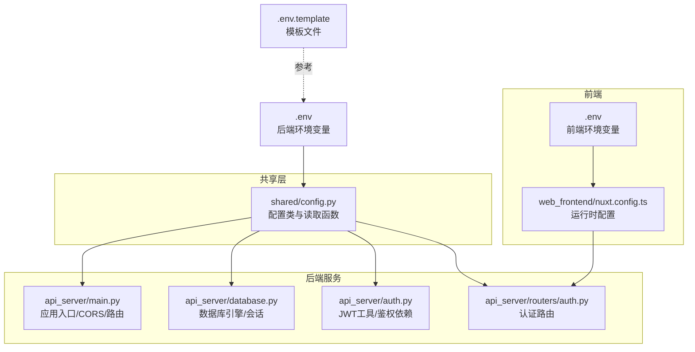
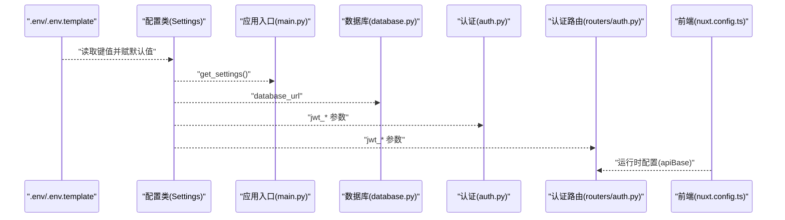
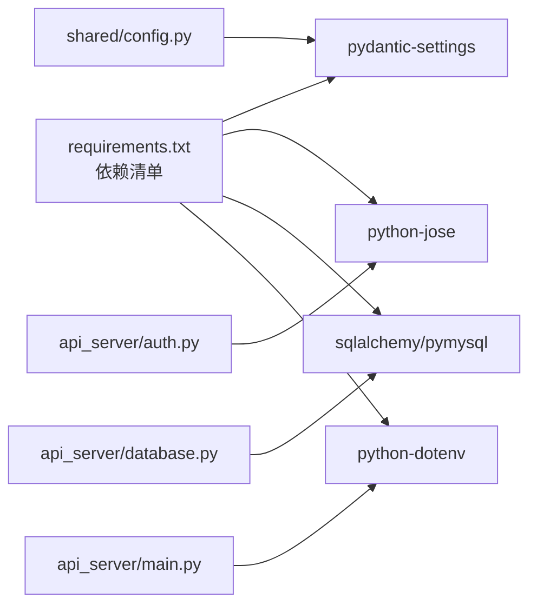

# 配置管理

<cite>
**本文引用的文件**
- [shared/config.py](file://shared/config.py)
- [.env](file://.env)
- [.env.template](file://.env.template)
- [api_server/main.py](file://api_server/main.py)
- [api_server/database.py](file://api_server/database.py)
- [api_server/auth.py](file://api_server/auth.py)
- [api_server/routers/auth.py](file://api_server/routers/auth.py)
- [web_frontend/.env](file://web_frontend/.env)
- [web_frontend/nuxt.config.ts](file://web_frontend/nuxt.config.ts)
- [requirements.txt](file://requirements.txt)
- [README.md](file://README.md)
- [.gitignore](file://.gitignore)
</cite>

## 目录
1. [简介](#简介)
2. [项目结构](#项目结构)
3. [核心组件](#核心组件)
4. [架构总览](#架构总览)
5. [详细组件分析](#详细组件分析)
6. [依赖关系分析](#依赖关系分析)
7. [性能考量](#性能考量)
8. [故障排查指南](#故障排查指南)
9. [结论](#结论)
10. [附录](#附录)

## 简介
本文件系统性梳理AI社区项目的全局配置管理方案，覆盖环境变量配置、数据库连接配置、JWT认证配置、配置文件组织与优先级、环境隔离、配置验证与默认值、错误处理策略、开发/测试/生产差异、热更新与动态配置建议、配置安全与备份策略等。读者无需深入代码即可理解配置体系的设计与使用。

## 项目结构
- 后端通过共享模块集中定义配置类与读取逻辑，供各子模块按需注入。
- 前端通过Nuxt运行时配置与环境变量协同，实现API基础地址等公共配置。
- 配置文件采用.env与模板文件配合的方式，便于团队协作与环境隔离。

图表来源
- [shared/config.py](file://shared/config.py#L6-L51)
- [api_server/main.py](file://api_server/main.py#L10-L34)
- [api_server/database.py](file://api_server/database.py#L10-L23)
- [api_server/auth.py](file://api_server/auth.py#L13-L18)
- [api_server/routers/auth.py](file://api_server/routers/auth.py#L14-L16)
- [web_frontend/nuxt.config.ts](file://web_frontend/nuxt.config.ts#L15-L19)
- [.env](file://.env#L1-L30)
- [.env.template](file://.env.template#L1-L30)

章节来源
- [shared/config.py](file://shared/config.py#L6-L51)
- [api_server/main.py](file://api_server/main.py#L10-L34)
- [api_server/database.py](file://api_server/database.py#L10-L23)
- [api_server/auth.py](file://api_server/auth.py#L13-L18)
- [api_server/routers/auth.py](file://api_server/routers/auth.py#L14-L16)
- [web_frontend/nuxt.config.ts](file://web_frontend/nuxt.config.ts#L15-L19)
- [.env](file://.env#L1-L30)
- [.env.template](file://.env.template#L1-L30)

## 核心组件
- 配置类与读取函数
  - 配置类集中定义数据库、JWT、服务器、前端、文件存储、AI预留等键值，提供默认值与环境文件映射。
  - 提供带缓存的读取函数，避免重复解析环境文件。
- 应用入口与中间件
  - 应用入口读取配置，设置CORS允许的前端源，注册路由。
- 数据库连接
  - 从配置派生数据库URL，建立连接池参数，提供依赖注入的会话获取。
- 认证与JWT
  - 使用配置中的密钥、算法与过期时间生成与校验令牌；在路由中作为安全依赖使用。
- 前端运行时配置
  - 前端通过运行时配置与环境变量组合，确定API基础地址。

章节来源
- [shared/config.py](file://shared/config.py#L6-L51)
- [api_server/main.py](file://api_server/main.py#L10-L34)
- [api_server/database.py](file://api_server/database.py#L10-L23)
- [api_server/auth.py](file://api_server/auth.py#L13-L18)
- [api_server/routers/auth.py](file://api_server/routers/auth.py#L14-L16)
- [web_frontend/nuxt.config.ts](file://web_frontend/nuxt.config.ts#L15-L19)

## 架构总览
下图展示配置在系统中的流向与耦合关系：

图表来源
- [shared/config.py](file://shared/config.py#L6-L51)
- [api_server/main.py](file://api_server/main.py#L10-L34)
- [api_server/database.py](file://api_server/database.py#L10-L23)
- [api_server/auth.py](file://api_server/auth.py#L13-L18)
- [api_server/routers/auth.py](file://api_server/routers/auth.py#L14-L16)
- [web_frontend/nuxt.config.ts](file://web_frontend/nuxt.config.ts#L15-L19)
- [.env](file://.env#L1-L30)
- [.env.template](file://.env.template#L1-L30)

## 详细组件分析

### 配置类与环境变量
- 配置类字段与默认值
  - 数据库：主机、端口、用户、密码、库名
  - JWT：密钥、算法、过期时间（分钟）
  - 服务器：监听地址、端口
  - 前端：允许的前端URL
  - 文件存储：上传目录、URL前缀
  - AI预留：LLM服务基础地址、API Key占位
  - ComfyUI预留：服务地址
  - AI社交行为：浏览评论上限
- 环境文件映射
  - 配置类声明使用.env文件与UTF-8编码。
  - 实际键名遵循后端约定（如MYSQL_*、JWT_*、API_*、UPLOAD_*、OPENAI_*、COMFYUI_*）。
- 默认值与类型
  - 字符串/整数均有合理默认值，便于快速启动。
- 数据库URL派生
  - 通过属性方法拼接标准ORM连接串，避免分散硬编码。

章节来源
- [shared/config.py](file://shared/config.py#L6-L51)
- [.env](file://.env#L1-L30)
- [.env.template](file://.env.template#L1-L30)

### 配置优先级与环境隔离
- 优先级
  - 环境变量 > 默认值；.env文件被配置类显式指定加载。
- 环境隔离
  - 使用模板文件作为基线，不同环境复制为.env并覆盖敏感值。
  - 前端独立的环境变量文件与运行时配置，避免与后端混淆。
- 版本控制与敏感信息
  - .gitignore中忽略.env与前端构建产物，防止误提交。

章节来源
- [shared/config.py](file://shared/config.py#L44-L46)
- [.env](file://.env#L1-L30)
- [.env.template](file://.env.template#L1-L30)
- [.gitignore](file://.gitignore#L1-L20)

### 数据库连接配置
- 连接参数
  - 从配置派生数据库URL，启用连接预检与回收策略，关闭SQL日志。
- 会话生命周期
  - 提供依赖注入的会话获取与关闭流程，确保资源释放。
- 与ORM集成
  - 与声明式基类与会话工厂配合，统一数据访问入口。

章节来源
- [shared/config.py](file://shared/config.py#L40-L42)
- [api_server/database.py](file://api_server/database.py#L10-L33)

### JWT认证配置
- 令牌签发与校验
  - 使用配置中的密钥与算法，结合过期时间生成访问令牌；解码时进行异常捕获。
- 安全依赖
  - 在路由中以安全依赖方式获取当前用户，未登录或无效令牌将触发认证错误。
- 密钥与算法
  - 默认算法与密钥可直接用于开发，生产需替换为强随机密钥并妥善保管。

章节来源
- [shared/config.py](file://shared/config.py#L14-L17)
- [api_server/auth.py](file://api_server/auth.py#L13-L18)
- [api_server/auth.py](file://api_server/auth.py#L34-L55)
- [api_server/routers/auth.py](file://api_server/routers/auth.py#L14-L16)

### 前端配置与跨域
- 前端运行时配置
  - 通过运行时配置读取公开API基础地址，支持环境变量覆盖。
- 跨域策略
  - 应用入口根据配置允许的前端URL设置CORS，保障前后端联调。

章节来源
- [web_frontend/nuxt.config.ts](file://web_frontend/nuxt.config.ts#L15-L19)
- [api_server/main.py](file://api_server/main.py#L24-L34)
- [web_frontend/.env](file://web_frontend/.env#L1-L2)

### 配置验证机制、默认值与错误处理
- 验证与类型转换
  - 配置类基于强类型字段，读取时进行类型转换与校验。
- 默认值
  - 大量字段提供默认值，降低首次部署成本。
- 错误处理
  - JWT解码异常被捕获并返回空结果，路由层据此抛出认证异常。
  - 数据库连接失败需检查环境变量与服务可达性。

章节来源
- [shared/config.py](file://shared/config.py#L6-L51)
- [api_server/auth.py](file://api_server/auth.py#L46-L55)
- [api_server/database.py](file://api_server/database.py#L14-L19)

### 开发/测试/生产环境差异
- 开发环境
  - 默认密钥与端口便于本地调试；前端默认开发端口与后端端口。
- 测试环境
  - 建议使用独立数据库与短过期时间；密钥与算法保持一致但不复用开发密钥。
- 生产环境
  - 替换为强随机密钥与安全算法；限制监听地址与端口；严格控制文件存储路径权限。
  - 前端运行时配置指向生产域名与HTTPS端点。

章节来源
- [shared/config.py](file://shared/config.py#L14-L17)
- [api_server/main.py](file://api_server/main.py#L24-L34)
- [web_frontend/nuxt.config.ts](file://web_frontend/nuxt.config.ts#L15-L19)

### 配置热更新、动态配置与监控
- 热更新与动态配置
  - 当前实现为进程启动时一次性读取并缓存配置；若需热更新，建议引入配置中心或信号重载机制。
- 监控与可观测性
  - 健康检查端点可用于配置生效后的可用性验证。
  - 建议在应用启动阶段打印关键配置摘要，便于排障。

章节来源
- [api_server/main.py](file://api_server/main.py#L55-L58)

### 配置安全性、敏感信息保护与备份策略
- 敏感信息保护
  - 密钥与密码使用环境变量注入；.env加入忽略清单；生产环境使用强随机密钥。
- 配置备份
  - .env.template作为模板备份；.env仅存放当前环境变量快照。
- 最佳实践
  - 不将任何含密钥的配置文件纳入版本控制；定期轮换密钥；最小权限原则管理数据库账号。

章节来源
- [.gitignore](file://.gitignore#L1-L20)
- [.env](file://.env#L1-L30)
- [.env.template](file://.env.template#L1-L30)

## 依赖关系分析
- 组件耦合
  - 应用入口、数据库、认证与路由均依赖共享配置；耦合度低、职责清晰。
- 外部依赖
  - 配置读取依赖dotenv与pydantic-settings；JWT依赖python-jose；数据库依赖SQLAlchemy与PyMySQL。

图表来源
- [requirements.txt](file://requirements.txt#L1-L32)
- [shared/config.py](file://shared/config.py#L1-L3)
- [api_server/auth.py](file://api_server/auth.py#L3-L6)
- [api_server/database.py](file://api_server/database.py#L1-L3)
- [api_server/main.py](file://api_server/main.py#L4-L6)

章节来源
- [requirements.txt](file://requirements.txt#L1-L32)
- [shared/config.py](file://shared/config.py#L1-L3)
- [api_server/auth.py](file://api_server/auth.py#L3-L6)
- [api_server/database.py](file://api_server/database.py#L1-L3)
- [api_server/main.py](file://api_server/main.py#L4-L6)

## 性能考量
- 连接池与预检
  - 启用连接预检与回收策略，减少连接失效导致的请求延迟。
- 缓存配置
  - 配置读取函数使用缓存，避免重复解析环境文件带来的开销。
- 日志与调试
  - 关闭SQL日志输出，降低I/O开销；开发阶段可按需开启。

章节来源
- [api_server/database.py](file://api_server/database.py#L14-L19)
- [shared/config.py](file://shared/config.py#L49-L51)

## 故障排查指南
- 数据库连接失败
  - 检查环境变量键名与值；确认MySQL服务运行与防火墙；核对默认库是否存在。
- JWT认证失败
  - 检查密钥与算法一致性；确认令牌未过期；查看路由认证异常响应。
- 前后端跨域问题
  - 核对CORS允许的前端URL与实际访问域名；确认前端运行时配置正确。
- 健康检查
  - 通过健康检查端点判断服务可用性；若不可用，检查配置与依赖服务状态。

章节来源
- [api_server/database.py](file://api_server/database.py#L14-L19)
- [api_server/auth.py](file://api_server/auth.py#L46-L55)
- [api_server/main.py](file://api_server/main.py#L24-L34)
- [api_server/main.py](file://api_server/main.py#L55-L58)

## 结论
本项目采用“共享配置类 + 环境变量 + 模板文件”的组合方案，实现了清晰的配置分层与环境隔离。通过强类型与默认值提升易用性，通过JWT与CORS保障安全与互通。建议在生产环境强化密钥管理与访问控制，并评估引入配置中心以支持热更新与集中治理。

## 附录

### 配置项一览与说明
- 数据库
  - 键：MYSQL_HOST、MYSQL_PORT、MYSQL_USER、MYSQL_PASSWORD、MYSQL_DATABASE
  - 说明：数据库连接参数；默认值来自配置类与.env
  - 参考：[shared/config.py](file://shared/config.py#L8-L12)，[.env](file://.env#L2-L6)
- JWT
  - 键：JWT_SECRET_KEY、JWT_ALGORITHM、JWT_EXPIRE_MINUTES
  - 说明：令牌密钥、签名算法、过期时间（分钟）
  - 参考：[shared/config.py](file://shared/config.py#L14-L17)，[.env](file://.env#L8-L11)
- 服务器
  - 键：API_HOST、API_PORT
  - 说明：后端监听地址与端口
  - 参考：[shared/config.py](file://shared/config.py#L19-L21)，[.env](file://.env#L13-L15)
- 前端
  - 键：FRONTEND_URL
  - 说明：允许跨域的前端地址
  - 参考：[shared/config.py](file://shared/config.py#L23-L24)，[.env](file://.env#L17-L18)
- 文件存储
  - 键：UPLOAD_DIR、UPLOAD_URL_PREFIX
  - 说明：上传目录与URL前缀
  - 参考：[shared/config.py](file://shared/config.py#L26-L28)，[.env](file://.env#L20-L22)
- AI预留
  - 键：OPENAI_API_BASE、OPENAI_API_KEY
  - 说明：LLM服务基础地址与API Key占位
  - 参考：[shared/config.py](file://shared/config.py#L30-L32)，[.env](file://.env#L24-L26)
- ComfyUI预留
  - 键：COMFYUI_API_URL
  - 说明：ComfyUI服务地址
  - 参考：[shared/config.py](file://shared/config.py#L34-L35)，[.env](file://.env#L28-L29)
- AI社交行为
  - 键：AI_BROWSE_COMMENTS_LIMIT
  - 说明：AI浏览帖子时显示的评论数量
  - 参考：[shared/config.py](file://shared/config.py#L37-L38)

### 环境变量与模板对照
- 后端
  - .env与配置类字段一一对应；.env.template提供模板基线
  - 参考：[.env](file://.env#L1-L30)，[.env.template](file://.env.template#L1-L30)
- 前端
  - 运行时配置与环境变量共同决定API基础地址
  - 参考：[web_frontend/nuxt.config.ts](file://web_frontend/nuxt.config.ts#L15-L19)，[web_frontend/.env](file://web_frontend/.env#L1-L2)

### 依赖与版本
- 关键依赖
  - pydantic-settings、python-jose、sqlalchemy、pymysql、python-dotenv
  - 参考：[requirements.txt](file://requirements.txt#L1-L32)