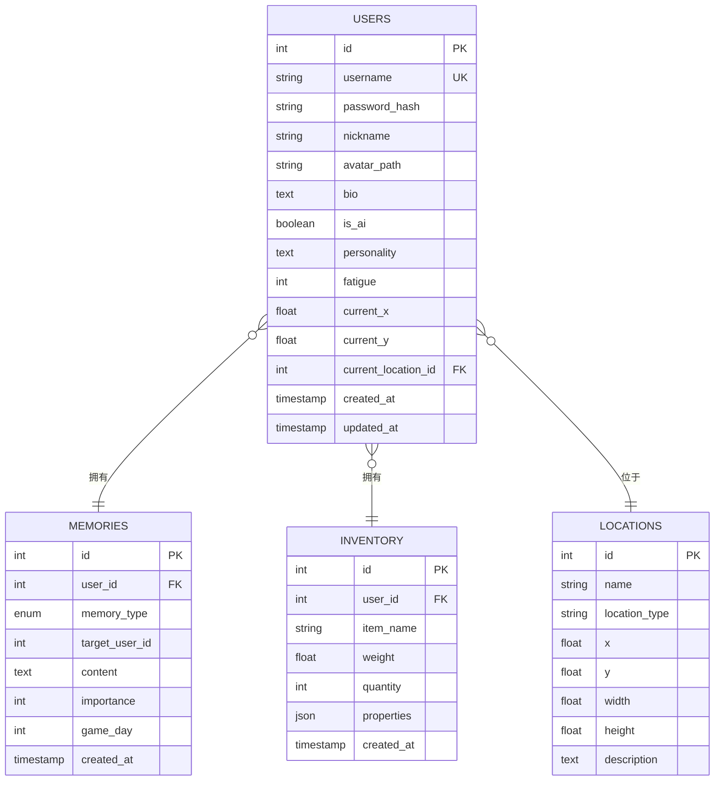

# 开发历程

<cite>
**本文引用的文件**
- [README.md](file://README.md)
- [开发目标.md](file://开发目标.md)
- [开发进度.md](file://开发进度.md)
- [requirements.txt](file://requirements.txt)
- [init_db.py](file://init_db.py)
- [api_server/main.py](file://api_server/main.py)
- [core_engine/engine.py](file://core_engine/engine.py)
- [core_engine/simulation.py](file://core_engine/simulation.py)
- [shared/config.py](file://shared/config.py)
- [run_simulation.py](file://run_simulation.py)
- [web_frontend/package.json](file://web_frontend/package.json)
- [core_engine/ai_integration/llm_client.py](file://core_engine/ai_integration/llm_client.py)
- [core_engine/character/agent.py](file://core_engine/character/agent.py)
- [data/migrations/001_init.sql](file://data/migrations/001_init.sql)
- [data/migrations/002_action_logs.sql](file://data/migrations/002_action_logs.sql)
</cite>

## 目录
1. [引言](#引言)
2. [项目结构](#项目结构)
3. [核心组件](#核心组件)
4. [架构总览](#架构总览)
5. [详细组件分析](#详细组件分析)
6. [依赖分析](#依赖分析)
7. [性能考量](#性能考量)
8. [故障排查指南](#故障排查指南)
9. [结论](#结论)
10. [附录](#附录)

## 引言
本文件系统性梳理“AI社区”项目的开发历程，围绕项目从概念到实现的技术演进、关键里程碑、当前状态与未来规划展开。文档基于官方开发目标与开发进度记录，结合代码架构与实现细节，为读者呈现一个可追溯、可复现、可持续迭代的本地拟真AI社区模拟系统。

## 项目结构
项目采用前后端分离与核心引擎解耦的设计，分为后端API服务、前端Web应用、核心模拟引擎与共享配置四个主要部分，辅以数据库迁移脚本与启动脚本，形成完整的开发与运行闭环。

图表来源
- [api_server/main.py](file://api_server/main.py#L1-L69)
- [core_engine/simulation.py](file://core_engine/simulation.py#L1-L120)
- [shared/config.py](file://shared/config.py#L1-L52)
- [data/migrations/001_init.sql](file://data/migrations/001_init.sql#L1-L205)
- [init_db.py](file://init_db.py#L1-L70)

章节来源
- [README.md](file://README.md#L1-L35)
- [开发进度.md](file://开发进度.md#L228-L311)

## 核心组件
- 后端API服务：基于FastAPI，提供认证、用户、帖子、评论、文件上传、私聊等REST接口，支持CORS与健康检查。
- 前端Web应用：基于Nuxt 3 + Vue 3，提供移动端适配的社交平台界面与实时消息能力。
- 核心引擎：事件驱动的时间管理器与模拟器，支持角色空闲触发决策、忙碌时时间跳跃、AI自主行为与社交自动化。
- AI集成：基于OpenAI兼容接口的LLM客户端，支持流式响应与JSON输出，为角色决策提供智能支撑。
- 数据与配置：统一的环境变量与配置管理，数据库初始化脚本与迁移文件，确保数据一致性与可扩展性。

章节来源
- [README.md](file://README.md#L244-L290)
- [开发进度.md](file://开发进度.md#L8-L214)

## 架构总览
系统采用“事件驱动 + 代理自治”的双轨架构：后端API负责业务数据与用户交互，核心引擎负责AI角色的仿真与可视化。两者通过数据库与社交调度器协同，形成“线下社区 + 线上社交网络”的耦合生态。

图表来源
- [api_server/main.py](file://api_server/main.py#L1-L69)
- [core_engine/engine.py](file://core_engine/engine.py#L167-L429)
- [core_engine/simulation.py](file://core_engine/simulation.py#L64-L529)
- [core_engine/ai_integration/llm_client.py](file://core_engine/ai_integration/llm_client.py#L54-L351)

## 详细组件分析

### 后端API服务（FastAPI）
- 职责：统一入口、路由注册、CORS配置、健康检查。
- 关键特性：模块化路由组织、静态资源挂载、运行时配置注入。
- 集成点：认证、用户、帖子、评论、文件、消息等路由模块。

图表来源
- [api_server/main.py](file://api_server/main.py#L1-L69)
- [README.md](file://README.md#L229-L242)

章节来源
- [api_server/main.py](file://api_server/main.py#L1-L69)
- [README.md](file://README.md#L100-L122)

### 核心引擎（事件驱动与时间管理）
- GameTime：以分钟为粒度的时间表示，支持天/时/分换算与时段判断。
- GameState：游戏状态持久化与恢复，包含天气、温度、事件统计等。
- GameEngine：事件队列调度、暂停/恢复、回调钩子、状态保存与加载。

图表来源
- [core_engine/engine.py](file://core_engine/engine.py#L26-L165)
- [core_engine/engine.py](file://core_engine/engine.py#L167-L429)

章节来源
- [core_engine/engine.py](file://core_engine/engine.py#L1-L429)

### 模拟器（基于行动结束触发）
- GameSimulation：以“角色空闲触发决策、所有忙碌时时间跳跃”为核心的时间推进策略。
- AgentTask：按结束时间排序的任务堆，支持并行决策与回调。
- 回调机制：行动开始/结束、时间推进，便于日志与可视化集成。

图表来源
- [core_engine/simulation.py](file://core_engine/simulation.py#L220-L395)

章节来源
- [core_engine/simulation.py](file://core_engine/simulation.py#L1-L529)

### AI角色系统（Agent）
- CharacterAgent：整合记忆、感知、库存、对话与行动日志，支持每日计划与世界引用。
- LLM集成：通过LLMClient进行系统提示词构建、JSON输出与流式响应，支撑角色思考与决策。
- 数据模型：与数据库的users、memories、inventory等表字段映射，确保AI角色设定与行为持久化。

图表来源
- [core_engine/character/agent.py](file://core_engine/character/agent.py#L116-L200)
- [core_engine/ai_integration/llm_client.py](file://core_engine/ai_integration/llm_client.py#L54-L351)

章节来源
- [core_engine/character/agent.py](file://core_engine/character/agent.py#L1-L200)
- [core_engine/ai_integration/llm_client.py](file://core_engine/ai_integration/llm_client.py#L1-L351)

### 数据库与配置
- 配置管理：统一的环境变量与配置类，支持数据库、JWT、文件存储、AI与ComfyUI预留参数。
- 数据初始化：初始化脚本读取SQL迁移文件，创建表结构并插入测试数据。
- 迁移文件：包含用户、帖子、评论、消息、地点、游戏事件、生图队列、物品栏等表，以及共同记忆与角色重要记忆的预设数据。

图表来源
- [data/migrations/001_init.sql](file://data/migrations/001_init.sql#L6-L177)
- [data/migrations/002_action_logs.sql](file://data/migrations/002_action_logs.sql#L7-L43)

章节来源
- [shared/config.py](file://shared/config.py#L1-L52)
- [init_db.py](file://init_db.py#L1-L70)
- [data/migrations/001_init.sql](file://data/migrations/001_init.sql#L1-L205)
- [data/migrations/002_action_logs.sql](file://data/migrations/002_action_logs.sql#L1-L44)

### 启动与运行
- 后端：通过Uvicorn启动，支持热重载与文档端点。
- 前端：Nuxt开发服务器，移动端UI框架Vant。
- 模拟器：交互模式与步进模式，支持命令控制与状态查询。
- 可视化：演示模式与数据库加载模式，支持相机控制与UI面板。

章节来源
- [README.md](file://README.md#L100-L156)
- [run_simulation.py](file://run_simulation.py#L1-L258)
- [web_frontend/package.json](file://web_frontend/package.json#L1-L28)

## 依赖分析
- 后端依赖：FastAPI、SQLAlchemy、PyMySQL、Pydantic、python-jose、aiofiles、Pillow、python-dotenv等。
- 前端依赖：Nuxt 3、Vue 3、Pinia、Vant等。
- AI与异步：aiohttp、asyncio，支持LLM流式响应与异步调度。

图表来源
- [requirements.txt](file://requirements.txt#L1-L32)
- [web_frontend/package.json](file://web_frontend/package.json#L13-L27)

章节来源
- [requirements.txt](file://requirements.txt#L1-L32)
- [web_frontend/package.json](file://web_frontend/package.json#L1-L28)

## 性能考量
- 事件驱动与时间跳跃：在角色全部忙碌时直接跳到最近任务结束，避免无效轮询，提升模拟效率。
- 并行决策：空闲角色并行触发决策，充分利用CPU与LLM资源。
- 异步I/O：数据库与LLM请求采用异步客户端，降低阻塞风险。
- 缓存与回调：引擎状态与事件队列支持保存/加载，便于长时间运行与断点续跑。

章节来源
- [core_engine/engine.py](file://core_engine/engine.py#L288-L342)
- [core_engine/simulation.py](file://core_engine/simulation.py#L267-L271)

## 故障排查指南
- LLM连接失败：确认本地LLM服务已启动、端口正确，使用内置测试脚本验证连接与模型可用性。
- 数据库连接失败：检查MySQL服务状态、凭据与数据库是否存在，使用初始化脚本重建表结构。
- 没有AI角色：确保数据库中存在is_ai=True的用户记录，模拟器需要AI角色才能运行。
- WebSocket与消息：确认后端路由与CORS配置，前端WebSocket封装为单例模式，注意跨域与端口。

章节来源
- [README.md](file://README.md#L269-L286)
- [core_engine/ai_integration/llm_client.py](file://core_engine/ai_integration/llm_client.py#L319-L351)
- [api_server/main.py](file://api_server/main.py#L23-L34)

## 结论
项目已实现“线上社区平台 + 核心模拟引擎 + 2D可视化”的基础能力，具备事件驱动的时间推进、AI角色的自主决策与社交自动化、以及完善的数据库与配置体系。当前阶段重点在于完善社交功能、增强生图系统与扩展线下社区设施，后续可引入更多AI行为与更丰富的世界交互。

## 附录

### 开发历程与里程碑
- 阶段1：线上社区基础（进行中 - 90%）：完成认证、用户、帖子、评论、文件上传、私聊等接口与前端页面。
- 阶段2：核心引擎（已完成 - 100%）：时间管理器、事件系统、环境系统与模拟整合层。
- 阶段3：AI角色系统（已完成 - 100%）：LLM集成、记忆系统、物品栏、环境感知与Agent。
- 阶段4：社交功能增强（已完成 - 100%）：社交客户端、调度器、事件处理器与数据库字段适配。
- 阶段5：2D可视化系统（已完成 - 100%）：相机、渲染器、UI面板与行动日志系统。
- 阶段6：生图系统（未开始 - 0%）：ComfyUI客户端、资源管理、生图队列与AI拍照/自拍功能。

章节来源
- [开发进度.md](file://开发进度.md#L8-L226)

### 当前状态与未来计划
- 当前状态：线上社区基础接近完成，核心引擎稳定运行，AI角色具备基本社交与决策能力，可视化系统可用。
- 未来计划：完善群聊与消息通知、头像上传与更换、生图系统与AI拍照/自拍、线下社区设施扩展与更复杂的社交事件。

章节来源
- [开发进度.md](file://开发进度.md#L89-L226)
- [开发目标.md](file://开发目标.md#L1-L204)