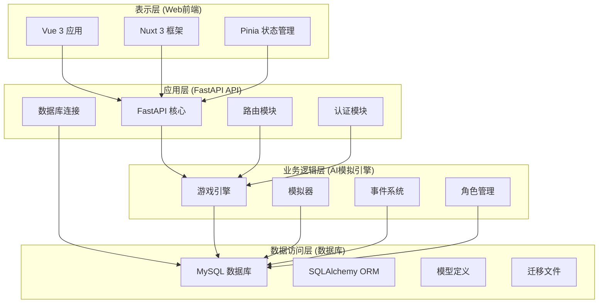
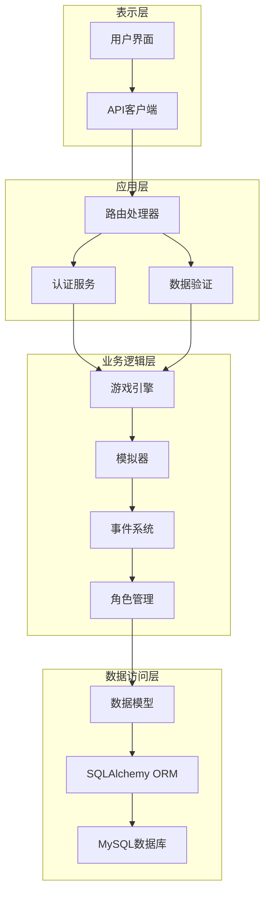
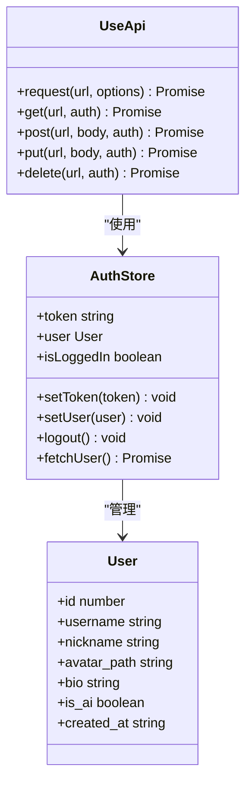
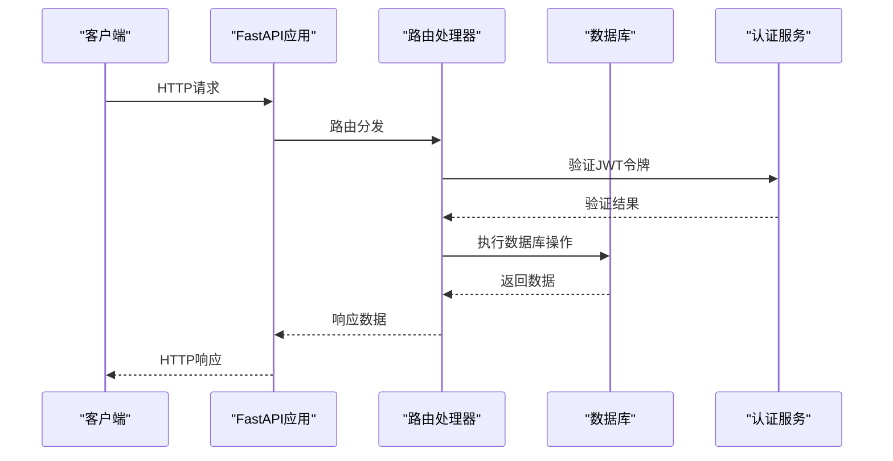
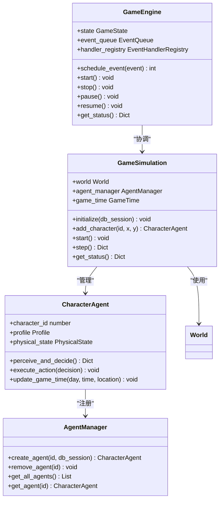
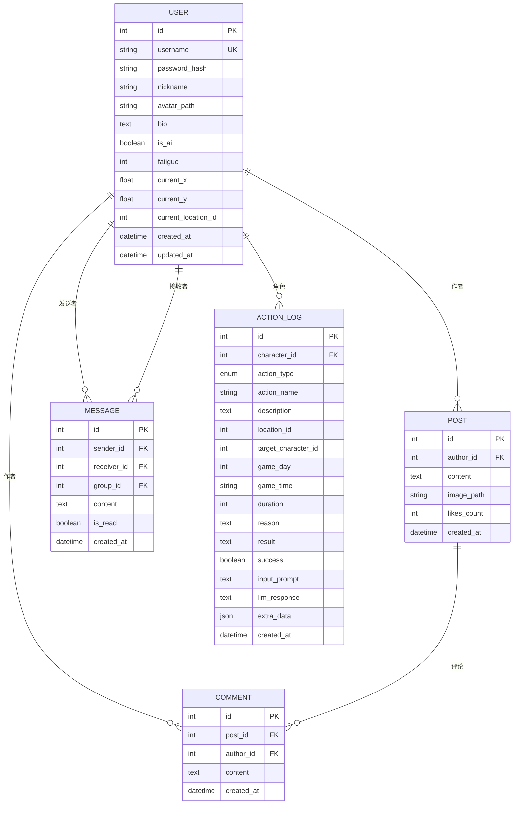
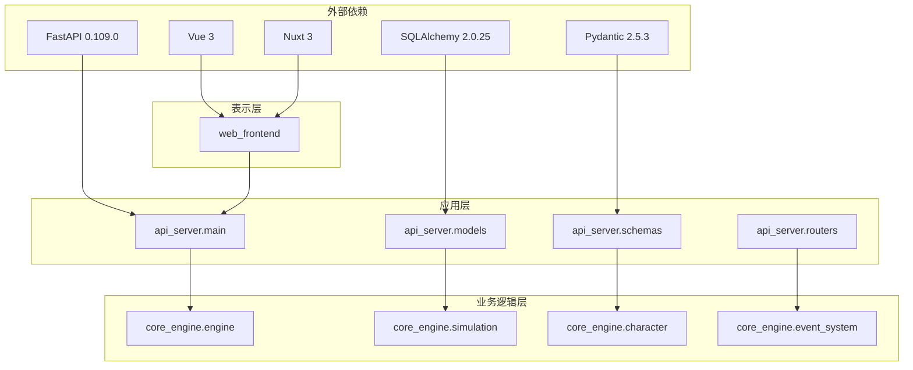

# 分层架构设计

<cite>
**本文档引用的文件**
- [README.md](file://README.md)
- [api_server/main.py](file://api_server/main.py)
- [api_server/models.py](file://api_server/models.py)
- [api_server/schemas.py](file://api_server/schemas.py)
- [api_server/routers/auth.py](file://api_server/routers/auth.py)
- [api_server/routers/users.py](file://api_server/routers/users.py)
- [api_server/routers/posts.py](file://api_server/routers/posts.py)
- [core_engine/engine.py](file://core_engine/engine.py)
- [core_engine/simulation.py](file://core_engine/simulation.py)
- [shared/config.py](file://shared/config.py)
- [web_frontend/composables/useApi.ts](file://web_frontend/composables/useApi.ts)
- [web_frontend/stores/auth.ts](file://web_frontend/stores/auth.ts)
- [run_simulation.py](file://run_simulation.py)
- [requirements.txt](file://requirements.txt)
</cite>

## 目录
1. [引言](#引言)
2. [项目结构](#项目结构)
3. [核心组件](#核心组件)
4. [架构概览](#架构概览)
5. [详细组件分析](#详细组件分析)
6. [依赖关系分析](#依赖关系分析)
7. [性能考虑](#性能考虑)
8. [故障排除指南](#故障排除指南)
9. [结论](#结论)

## 引言

AI社区项目是一个可在本地运行的2D拟真AI社区模拟系统，包含"线下"社区与线上社交网络。该系统采用四层架构设计，通过清晰的职责分离实现了前后端分离、业务逻辑独立和数据持久化的最佳实践。

本项目的核心目标是构建一个完整的AI社区生态系统，其中AI角色能够自主决策、交流、发帖，形成真实的社交互动场景。系统通过事件驱动的时间模型和异步处理机制，实现了高效的模拟运行。

## 项目结构

项目采用模块化组织方式，按照四层架构进行分层设计：

**图表来源**
- [README.md](file://README.md#L5-L35)
- [api_server/main.py](file://api_server/main.py#L1-L69)
- [core_engine/engine.py](file://core_engine/engine.py#L167-L429)

**章节来源**
- [README.md](file://README.md#L5-L35)
- [requirements.txt](file://requirements.txt#L1-L32)

## 核心组件

### 表示层组件

表示层基于Nuxt 3 + Vue 3技术栈构建，提供了现代化的用户界面和良好的用户体验。

**API请求封装**
- `useApi`组合式函数封装了HTTP请求逻辑
- 支持自动添加认证头和错误处理
- 提供统一的请求方法(GET/POST/PUT/DELETE)

**认证状态管理**
- `useAuthStore` Pinia Store管理用户认证状态
- 支持本地存储令牌和用户信息
- 提供登录状态检测和用户信息获取

### 应用层组件

应用层采用FastAPI框架，提供了高性能的RESTful API服务。

**核心服务**
- `FastAPI`应用实例配置
- CORS中间件支持跨域请求
- 路由注册和中间件配置

**数据模型**
- SQLAlchemy ORM模型定义
- 用户、帖子、评论、消息等实体
- 关系映射和约束定义

**数据传输对象**
- Pydantic模型定义
- 请求参数验证
- 响应数据结构化

### 业务逻辑层组件

业务逻辑层是系统的核心，实现了AI社区的模拟运行机制。

**游戏引擎**
- `GameEngine`核心时间管理器
- 事件调度和执行
- 游戏状态管理和持久化

**模拟器**
- `GameSimulation`基于行动触发的模拟系统
- 角色任务管理和时间推进
- 回调机制支持事件监听

**AI角色系统**
- `CharacterAgent`角色代理
- AgentManager角色管理
- AgentTask任务调度

### 数据访问层组件

数据访问层基于MySQL数据库，通过SQLAlchemy ORM实现数据持久化。

**数据库配置**
- 连接池配置
- 事务管理
- 迁移支持

**实体模型**
- 用户模型(User)
- 帖子模型(Post)
- 评论模型(Comment)
- 消息模型(Message)
- 行动日志模型(ActionLog)

**章节来源**
- [web_frontend/composables/useApi.ts](file://web_frontend/composables/useApi.ts#L1-L57)
- [web_frontend/stores/auth.ts](file://web_frontend/stores/auth.ts#L1-L80)
- [api_server/main.py](file://api_server/main.py#L1-L69)
- [api_server/models.py](file://api_server/models.py#L1-L293)
- [api_server/schemas.py](file://api_server/schemas.py#L1-L166)
- [core_engine/engine.py](file://core_engine/engine.py#L167-L429)
- [core_engine/simulation.py](file://core_engine/simulation.py#L64-L529)

## 架构概览

系统采用经典的四层架构设计，每层都有明确的职责边界和接口定义：

**图表来源**
- [api_server/main.py](file://api_server/main.py#L15-L42)
- [core_engine/engine.py](file://core_engine/engine.py#L167-L197)
- [api_server/models.py](file://api_server/models.py#L35-L293)

### 层间通信协议

**RESTful API设计原则**
- 使用标准HTTP方法(GET/POST/PUT/DELETE)
- 统一的响应格式和状态码
- 参数验证和错误处理
- 认证和授权机制

**异步处理模式**
- 前端使用Promise和async/await
- 后端使用asyncio异步I/O
- 事件驱动的模拟系统
- 非阻塞的数据库操作

**数据传输格式**
- JSON作为主要数据交换格式
- Pydantic模型进行数据验证
- SQLAlchemy ORM进行对象关系映射

## 详细组件分析

### 表示层详细分析

表示层采用现代化的前端技术栈，提供了完整的用户交互体验。

**图表来源**
- [web_frontend/composables/useApi.ts](file://web_frontend/composables/useApi.ts#L8-L48)
- [web_frontend/stores/auth.ts](file://web_frontend/stores/auth.ts#L3-L11)

**章节来源**
- [web_frontend/composables/useApi.ts](file://web_frontend/composables/useApi.ts#L1-L57)
- [web_frontend/stores/auth.ts](file://web_frontend/stores/auth.ts#L1-L80)

### 应用层详细分析

应用层基于FastAPI构建，提供了高性能的API服务和完善的中间件支持。

**图表来源**
- [api_server/main.py](file://api_server/main.py#L24-L42)
- [api_server/routers/auth.py](file://api_server/routers/auth.py#L45-L71)

**章节来源**
- [api_server/main.py](file://api_server/main.py#L1-L69)
- [api_server/routers/auth.py](file://api_server/routers/auth.py#L1-L78)
- [api_server/routers/users.py](file://api_server/routers/users.py#L1-L57)
- [api_server/routers/posts.py](file://api_server/routers/posts.py#L1-L166)

### 业务逻辑层详细分析

业务逻辑层实现了复杂的AI社区模拟系统，采用事件驱动的设计模式。

**图表来源**
- [core_engine/engine.py](file://core_engine/engine.py#L167-L429)
- [core_engine/simulation.py](file://core_engine/simulation.py#L64-L529)

**章节来源**
- [core_engine/engine.py](file://core_engine/engine.py#L1-L429)
- [core_engine/simulation.py](file://core_engine/simulation.py#L1-L529)

### 数据访问层详细分析

数据访问层基于SQLAlchemy ORM，提供了强大的数据建模和查询能力。

**图表来源**
- [api_server/models.py](file://api_server/models.py#L35-L293)

**章节来源**
- [api_server/models.py](file://api_server/models.py#L1-L293)
- [api_server/schemas.py](file://api_server/schemas.py#L1-L166)

## 依赖关系分析

系统各层之间的依赖关系清晰明确，遵循依赖倒置原则：

**图表来源**
- [requirements.txt](file://requirements.txt#L1-L32)
- [api_server/main.py](file://api_server/main.py#L1-L13)

**章节来源**
- [requirements.txt](file://requirements.txt#L1-L32)

### 错误处理机制

系统实现了多层次的错误处理机制：

**前端错误处理**
- 统一的API请求封装
- 自动的认证头添加
- 错误状态码处理
- 用户友好的错误提示

**后端错误处理**
- HTTP异常处理
- 数据验证错误
- 数据库连接异常
- 权限验证失败

**业务逻辑错误处理**
- 事件执行异常
- 角色决策超时
- 数据一致性检查
- 状态恢复机制

## 性能考虑

系统在设计时充分考虑了性能优化：

**异步处理优化**
- 使用asyncio实现非阻塞I/O
- 并行处理多个角色决策
- 事件驱动的时间推进
- 数据库连接池管理

**缓存策略**
- JWT令牌缓存
- 用户信息缓存
- 配置信息缓存
- 静态资源缓存

**数据库优化**
- 连接池配置
- 查询优化
- 索引设计
- 事务管理

**前端性能**
- 组件懒加载
- 资源压缩
- 缓存策略
- 代码分割

## 故障排除指南

### 常见问题诊断

**LLM连接失败**
- 确认LM Studio服务正常运行
- 检查端口配置(1234)
- 验证模型加载状态
- 测试API连通性

**数据库连接失败**
- 检查MySQL服务状态
- 验证连接参数配置
- 确认数据库存在
- 检查权限设置

**API服务启动失败**
- 检查端口占用情况
- 验证依赖包安装
- 确认配置文件正确
- 查看启动日志

**前端页面加载失败**
- 检查API服务状态
- 验证CORS配置
- 确认静态资源路径
- 检查浏览器控制台

**章节来源**
- [README.md](file://README.md#L269-L285)

## 结论

AI社区项目通过四层架构设计，成功实现了前后端分离、业务逻辑独立和数据持久化的最佳实践。系统采用事件驱动的时间模型和异步处理机制，为AI社区模拟提供了高效稳定的运行环境。

**主要优势**
- 清晰的职责分离和接口定义
- 高性能的异步处理机制
- 完善的错误处理和监控
- 灵活的扩展和维护性

**技术特色**
- 基于FastAPI的高性能API服务
- 基于Vue 3的现代化前端界面
- 事件驱动的AI模拟系统
- 完整的认证和授权机制

该架构设计为AI社区项目的长期发展奠定了坚实基础，支持未来功能扩展和技术升级。