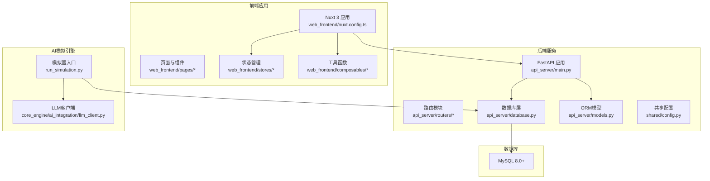
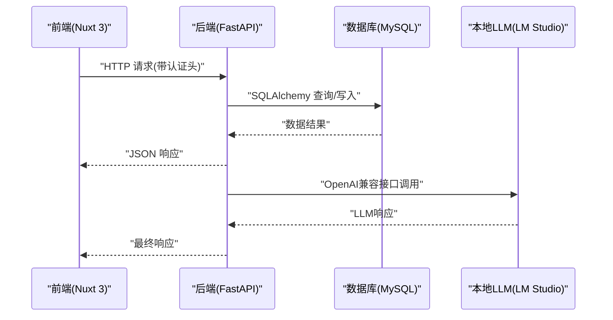
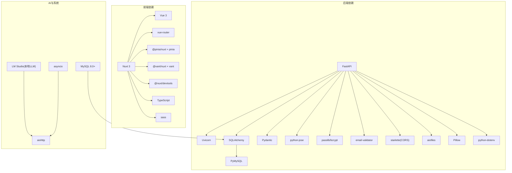

# 技术栈选择

<cite>
**本文引用的文件**
- [README.md](file://README.md)
- [requirements.txt](file://requirements.txt)
- [package.json](file://web_frontend/package.json)
- [main.py](file://api_server/main.py)
- [nuxt.config.ts](file://web_frontend/nuxt.config.ts)
- [config.py](file://shared/config.py)
- [llm_client.py](file://core_engine/ai_integration/llm_client.py)
- [database.py](file://api_server/database.py)
- [useApi.ts](file://web_frontend/composables/useApi.ts)
- [001_init.sql](file://data/migrations/001_init.sql)
- [models.py](file://api_server/models.py)
- [auth.ts](file://web_frontend/stores/auth.ts)
- [run_simulation.py](file://run_simulation.py)
</cite>

## 目录
1. [引言](#引言)
2. [项目结构](#项目结构)
3. [核心组件](#核心组件)
4. [架构总览](#架构总览)
5. [详细组件分析](#详细组件分析)
6. [依赖关系分析](#依赖关系分析)
7. [性能考量](#性能考量)
8. [故障排除指南](#故障排除指南)
9. [结论](#结论)

## 引言
本技术栈选择文档面向“AI社区”项目，系统阐述后端使用FastAPI、前端使用Nuxt 3/Vue 3、数据库采用MySQL、AI推理通过LM Studio本地LLM服务的选型原因与优势，并解释各组件间的兼容性与集成方案，说明该技术组合如何满足AI社区模拟系统的需求。同时给出版本要求与依赖关系说明，便于开发者快速搭建与维护。

## 项目结构
项目采用前后端分离架构，后端为FastAPI服务，前端为Nuxt 3应用，AI模拟引擎独立运行，数据库为MySQL。整体结构清晰，职责边界明确，便于扩展与维护。

图表来源
- [main.py](file://api_server/main.py#L1-L69)
- [nuxt.config.ts](file://web_frontend/nuxt.config.ts#L1-L42)
- [config.py](file://shared/config.py#L1-L52)
- [database.py](file://api_server/database.py#L1-L33)
- [models.py](file://api_server/models.py#L1-L293)
- [run_simulation.py](file://run_simulation.py#L1-L258)
- [llm_client.py](file://core_engine/ai_integration/llm_client.py#L1-L351)

章节来源
- [README.md](file://README.md#L1-L35)
- [main.py](file://api_server/main.py#L1-L69)
- [nuxt.config.ts](file://web_frontend/nuxt.config.ts#L1-L42)
- [config.py](file://shared/config.py#L1-L52)
- [database.py](file://api_server/database.py#L1-L33)
- [models.py](file://api_server/models.py#L1-L293)
- [run_simulation.py](file://run_simulation.py#L1-L258)
- [llm_client.py](file://core_engine/ai_integration/llm_client.py#L1-L351)

## 核心组件
- 后端：FastAPI + SQLAlchemy + Pydantic + PyMySQL + python-jose + passlib
- 前端：Nuxt 3 + Vue 3 + Pinia + Vant + TypeScript
- 数据库：MySQL 8.0+
- AI推理：LM Studio（本地LLM服务，OpenAI兼容接口）
- 模拟引擎：事件驱动的时间模型，异步调度与HTTP客户端

章节来源
- [README.md](file://README.md#L244-L262)
- [requirements.txt](file://requirements.txt#L1-L32)
- [package.json](file://web_frontend/package.json#L1-L28)

## 架构总览
后端通过FastAPI提供REST API，前端Nuxt 3负责展示与交互，两者通过CORS互通；数据库采用MySQL，ORM为SQLAlchemy；AI推理通过LM Studio提供的OpenAI兼容接口实现，模拟器独立运行并与数据库交互。

图表来源
- [main.py](file://api_server/main.py#L15-L42)
- [database.py](file://api_server/database.py#L14-L21)
- [llm_client.py](file://core_engine/ai_integration/llm_client.py#L106-L171)
- [useApi.ts](file://web_frontend/composables/useApi.ts#L8-L48)

## 详细组件分析

### 后端技术栈：FastAPI
- 选择原因
  - 高性能：基于Starlette与Pydantic，异步I/O与类型校验开销低
  - 自动化文档：集成Swagger/OpenAPI，无需手写文档
  - 类型安全：Pydantic模型提供运行时数据校验
  - 易于扩展：模块化路由与中间件机制
- 实现要点
  - CORS跨域配置允许前端域名访问
  - 路由模块化组织，包含认证、用户、帖子、评论、文件、消息等
  - 健康检查端点便于运维监控
  - 配置集中管理，支持环境变量与dotenv

章节来源
- [main.py](file://api_server/main.py#L15-L42)
- [README.md](file://README.md#L246-L251)

### 数据库：MySQL + SQLAlchemy
- 选择原因
  - 成熟稳定：企业级关系型数据库，生态完善
  - 可观测性强：索引、事务、外键约束保障数据一致性
  - 易于迁移：SQL迁移脚本清晰，便于版本演进
- 实现要点
  - SQLAlchemy ORM映射用户、帖子、评论、消息、地点、事件等实体
  - 外键关系明确，支持级联删除与空值处理
  - 连接池配置与预检，提升并发稳定性

章节来源
- [database.py](file://api_server/database.py#L14-L21)
- [models.py](file://api_server/models.py#L35-L293)
- [001_init.sql](file://data/migrations/001_init.sql#L6-L205)

### 前端技术栈：Nuxt 3 + Vue 3
- 选择原因
  - SSR/SSG：Nuxt 3提供服务端渲染与静态生成能力，利于SEO与首屏性能
  - TypeScript支持：类型安全，提升开发体验与可维护性
  - 组合式API：Vue 3响应式系统，逻辑复用与状态管理更灵活
  - 生态丰富：Pinia、Vant等生态组件完善
- 实现要点
  - 模块化配置，集成Pinia与Vant
  - 运行时配置暴露API基础地址，便于跨环境部署
  - 页面路由与组件解耦，便于扩展

章节来源
- [nuxt.config.ts](file://web_frontend/nuxt.config.ts#L1-L42)
- [package.json](file://web_frontend/package.json#L13-L26)
- [README.md](file://README.md#L253-L257)

### 状态管理：Pinia
- 作用：集中管理用户登录态与全局状态
- 特点：轻量、TypeScript友好、模块化store
- 与后端配合：通过Authorization头传递JWT令牌

章节来源
- [auth.ts](file://web_frontend/stores/auth.ts#L1-L80)
- [useApi.ts](file://web_frontend/composables/useApi.ts#L8-L48)

### API封装：useApi
- 作用：统一HTTP请求封装，支持GET/POST/PUT/DELETE与鉴权头
- 特点：泛型返回类型、错误处理、204特殊处理
- 与后端配合：读取运行时配置中的API基础地址

章节来源
- [useApi.ts](file://web_frontend/composables/useApi.ts#L1-L57)

### AI推理：LM Studio（本地LLM服务）
- 选择原因
  - 本地可控：隐私与数据安全，避免云端传输
  - OpenAI兼容：统一接口，便于替换与扩展
  - 异步调用：支持流式与非流式响应，适配不同场景
- 实现要点
  - LLMConfig集中配置base_url、model、温度、最大tokens等
  - LLMClient提供连接检查、模型查询、聊天、流式聊天、JSON生成等方法
  - 支持重试与超时控制，增强鲁棒性

章节来源
- [llm_client.py](file://core_engine/ai_integration/llm_client.py#L14-L351)
- [README.md](file://README.md#L82-L98)

### 模拟引擎：事件驱动的时间模型
- 选择原因
  - 事件驱动：角色空闲→AI决策→行动→时间跳跃→循环
  - 异步调度：支持多角色并发与流式响应
  - 可视化与社交：结合渲染器与社交调度器
- 实现要点
  - run_simulation.py提供交互式与步进式两种运行模式
  - 与数据库交互，加载AI角色并初始化世界状态
  - 回调机制记录行动开始/结束与时间推进

章节来源
- [run_simulation.py](file://run_simulation.py#L1-L258)
- [README.md](file://README.md#L157-L174)

## 依赖关系分析

图表来源
- [requirements.txt](file://requirements.txt#L1-L32)
- [package.json](file://web_frontend/package.json#L13-L26)

章节来源
- [requirements.txt](file://requirements.txt#L1-L32)
- [package.json](file://web_frontend/package.json#L1-L28)

## 性能考量
- 后端性能
  - FastAPI基于ASGI异步框架，适合高并发I/O密集型API
  - SQLAlchemy连接池与预检减少连接开销
  - Pydantic模型校验在序列化阶段完成，降低运行时错误
- 前端性能
  - Nuxt 3 SSR/SSG提升首屏加载速度与SEO
  - TypeScript静态类型检查减少运行时异常
  - Pinia轻量状态管理，避免过度渲染
- AI推理性能
  - LM Studio本地部署，避免网络延迟
  - 异步HTTP客户端与重试机制提升稳定性
- 数据库性能
  - 合理索引（用户名、AI标记、时间戳等）提升查询效率
  - 外键与级联策略保证数据一致性与删除性能

## 故障排除指南
- LLM连接失败
  - 确认LM Studio已启动并监听默认端口
  - 使用内置测试脚本验证连接与模型可用性
- 数据库连接失败
  - 检查MySQL服务状态与凭据配置
  - 确认数据库存在且具备相应权限
- 前端无法访问后端API
  - 检查CORS配置是否包含前端域名
  - 确认后端运行端口与防火墙设置
- JWT认证失败
  - 确认前端已正确存储与发送Authorization头
  - 检查后端JWT密钥与算法配置

章节来源
- [README.md](file://README.md#L269-L285)
- [llm_client.py](file://core_engine/ai_integration/llm_client.py#L319-L346)
- [useApi.ts](file://web_frontend/composables/useApi.ts#L8-L48)
- [auth.ts](file://web_frontend/stores/auth.ts#L28-L77)

## 结论
本技术栈组合充分考虑了AI社区模拟系统的功能需求与运行特点：
- 后端FastAPI提供高性能、类型安全、自动生成文档的API服务
- 前端Nuxt 3/Vue 3结合SSR与TypeScript，兼顾性能与开发体验
- MySQL关系型数据库保障数据一致性与可观测性
- LM Studio本地LLM服务满足隐私与低延迟需求
- 事件驱动的模拟引擎与异步调度提升系统吞吐与实时性

该组合在可维护性、可扩展性与运行效率之间取得良好平衡，适合构建本地化的AI社区模拟平台。