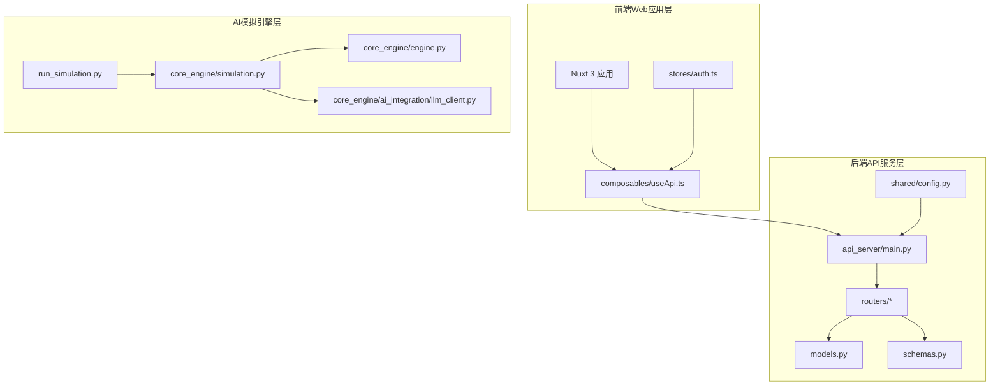
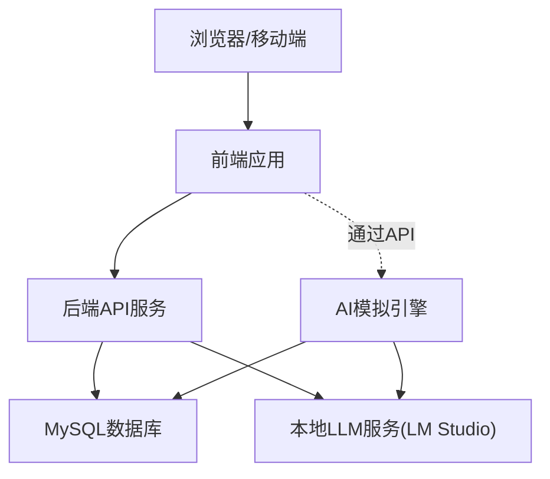
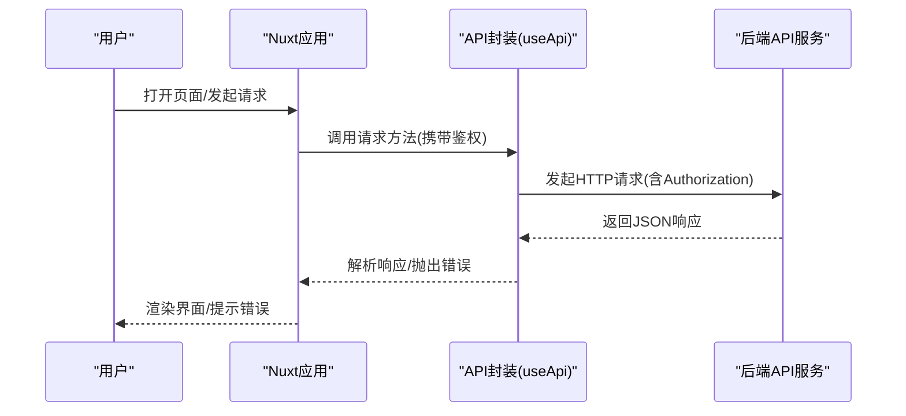
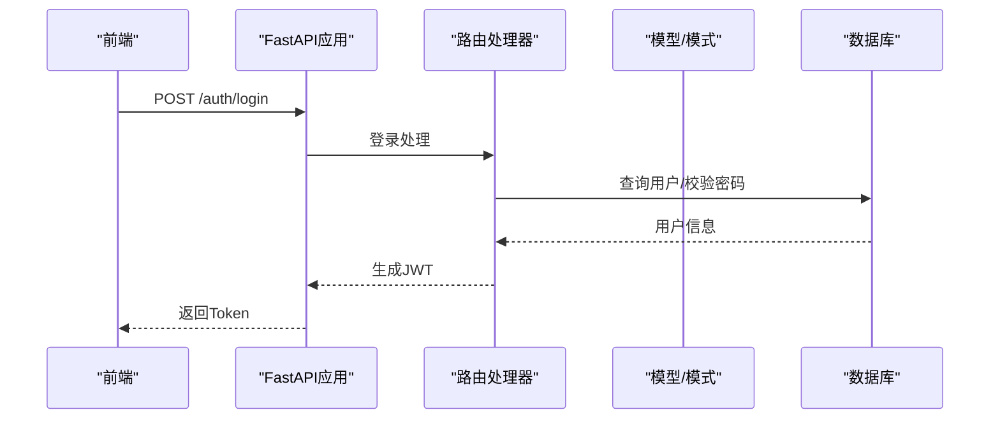
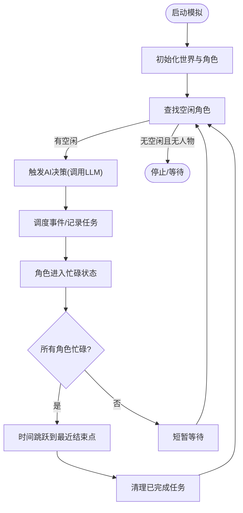
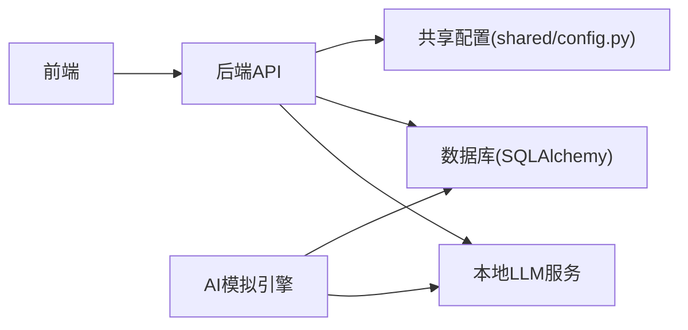

# 整体架构设计

<cite>
**本文引用的文件**
- [README.md](file://README.md)
- [api_server/main.py](file://api_server/main.py)
- [api_server/models.py](file://api_server/models.py)
- [api_server/schemas.py](file://api_server/schemas.py)
- [api_server/routers/auth.py](file://api_server/routers/auth.py)
- [api_server/routers/users.py](file://api_server/routers/users.py)
- [api_server/routers/posts.py](file://api_server/routers/posts.py)
- [shared/config.py](file://shared/config.py)
- [web_frontend/nuxt.config.ts](file://web_frontend/nuxt.config.ts)
- [web_frontend/composables/useApi.ts](file://web_frontend/composables/useApi.ts)
- [web_frontend/stores/auth.ts](file://web_frontend/stores/auth.ts)
- [core_engine/engine.py](file://core_engine/engine.py)
- [core_engine/simulation.py](file://core_engine/simulation.py)
- [core_engine/ai_integration/llm_client.py](file://core_engine/ai_integration/llm_client.py)
- [run_simulation.py](file://run_simulation.py)
</cite>

## 目录
1. [引言](#引言)
2. [项目结构](#项目结构)
3. [核心组件](#核心组件)
4. [架构总览](#架构总览)
5. [详细组件分析](#详细组件分析)
6. [依赖关系分析](#依赖关系分析)
7. [性能考量](#性能考量)
8. [故障排查指南](#故障排查指南)
9. [结论](#结论)
10. [附录](#附录)

## 引言
本项目是一个可在本地运行的2D拟真AI社区模拟系统，包含“线下”社区与线上社交网络。系统采用三层架构设计：
- 前端Web应用层：基于Nuxt 3 + Vue 3的现代化前端界面，提供用户交互与内容展示。
- 后端API服务层：基于FastAPI的REST API，负责认证、用户、帖子、评论、消息、文件等业务接口。
- AI模拟引擎层：基于事件驱动的时间引擎与角色AI决策系统，实现角色的自主行为与世界状态演进。

系统通过明确的职责划分与模块化设计，使三层之间通过清晰的数据流与控制流协作，形成完整的AI社区模拟平台，并具备良好的扩展性与可维护性。

## 项目结构
项目采用按层与按功能混合的组织方式：
- api_server：后端API服务，包含路由、模型、模式定义、数据库连接与认证模块。
- web_frontend：前端应用，包含页面、组件、状态管理与API封装。
- core_engine：AI模拟引擎，包含时间引擎、事件系统、角色系统、环境系统、AI集成与可视化模块。
- shared：共享配置模块，集中管理环境变量与全局设置。
- data：数据库迁移与存档目录。
- 根目录脚本：启动模拟器、初始化数据库与运行可视化等入口脚本。

**图示来源**
- [api_server/main.py](file://api_server/main.py#L1-L69)
- [api_server/routers/auth.py](file://api_server/routers/auth.py#L1-L78)
- [api_server/routers/users.py](file://api_server/routers/users.py#L1-L57)
- [api_server/routers/posts.py](file://api_server/routers/posts.py#L1-L166)
- [api_server/models.py](file://api_server/models.py#L1-L293)
- [api_server/schemas.py](file://api_server/schemas.py#L1-L166)
- [shared/config.py](file://shared/config.py#L1-L52)
- [web_frontend/nuxt.config.ts](file://web_frontend/nuxt.config.ts#L1-L42)
- [web_frontend/composables/useApi.ts](file://web_frontend/composables/useApi.ts#L1-L57)
- [web_frontend/stores/auth.ts](file://web_frontend/stores/auth.ts#L1-L80)
- [core_engine/engine.py](file://core_engine/engine.py#L1-L429)
- [core_engine/simulation.py](file://core_engine/simulation.py#L1-L529)
- [core_engine/ai_integration/llm_client.py](file://core_engine/ai_integration/llm_client.py#L1-L351)
- [run_simulation.py](file://run_simulation.py#L1-L258)

**章节来源**
- [README.md](file://README.md#L5-L35)
- [api_server/main.py](file://api_server/main.py#L1-L69)
- [shared/config.py](file://shared/config.py#L1-L52)
- [web_frontend/nuxt.config.ts](file://web_frontend/nuxt.config.ts#L1-L42)

## 核心组件
- 前端应用：Nuxt 3提供SSR/CSR混合渲染，Pinia进行状态管理，Vant提供移动端UI组件；通过composables封装统一的API请求与鉴权头注入。
- 后端API：FastAPI提供高性能异步API，路由模块化拆分，Pydantic模型进行数据校验，SQLAlchemy ORM映射数据库表，JWT进行认证。
- AI模拟引擎：事件驱动的时间引擎负责时间推进与事件调度；角色系统包含感知、记忆、库存与代理；AI集成模块对接本地LLM服务；仿真器协调世界状态与角色行为。

**章节来源**
- [web_frontend/nuxt.config.ts](file://web_frontend/nuxt.config.ts#L1-L42)
- [web_frontend/composables/useApi.ts](file://web_frontend/composables/useApi.ts#L1-L57)
- [web_frontend/stores/auth.ts](file://web_frontend/stores/auth.ts#L1-L80)
- [api_server/main.py](file://api_server/main.py#L1-L69)
- [api_server/routers/auth.py](file://api_server/routers/auth.py#L1-L78)
- [api_server/routers/users.py](file://api_server/routers/users.py#L1-L57)
- [api_server/routers/posts.py](file://api_server/routers/posts.py#L1-L166)
- [api_server/models.py](file://api_server/models.py#L1-L293)
- [api_server/schemas.py](file://api_server/schemas.py#L1-L166)
- [core_engine/engine.py](file://core_engine/engine.py#L1-L429)
- [core_engine/simulation.py](file://core_engine/simulation.py#L1-L529)
- [core_engine/ai_integration/llm_client.py](file://core_engine/ai_integration/llm_client.py#L1-L351)

## 架构总览
系统采用三层架构，通过清晰的边界与职责划分实现松耦合：
- 前端Web应用层：负责用户界面与交互，通过useApi封装统一请求，携带Authorization头访问后端API。
- 后端API服务层：提供REST接口，路由按功能拆分，模型与模式定义保证数据一致性，JWT保障安全。
- AI模拟引擎层：独立于前后端，通过事件驱动推进时间与调度角色行动，AI决策通过LLM客户端与本地服务交互。

**图示来源**
- [api_server/main.py](file://api_server/main.py#L1-L69)
- [api_server/models.py](file://api_server/models.py#L1-L293)
- [core_engine/ai_integration/llm_client.py](file://core_engine/ai_integration/llm_client.py#L1-L351)
- [run_simulation.py](file://run_simulation.py#L1-L258)

## 详细组件分析

### 前端Web应用层
- 配置与模块：Nuxt 3配置公共API基础地址，启用Pinia与Vant模块；SCSS样式统一管理。
- API封装：useApi提供通用请求方法，自动注入Content-Type与Authorization头，处理非200响应抛出错误。
- 状态管理：Pinia Store管理token与用户信息，支持本地持久化与初始化加载；提供登录态判断与用户信息拉取。

**图示来源**
- [web_frontend/nuxt.config.ts](file://web_frontend/nuxt.config.ts#L1-L42)
- [web_frontend/composables/useApi.ts](file://web_frontend/composables/useApi.ts#L1-L57)
- [web_frontend/stores/auth.ts](file://web_frontend/stores/auth.ts#L1-L80)

**章节来源**
- [web_frontend/nuxt.config.ts](file://web_frontend/nuxt.config.ts#L1-L42)
- [web_frontend/composables/useApi.ts](file://web_frontend/composables/useApi.ts#L1-L57)
- [web_frontend/stores/auth.ts](file://web_frontend/stores/auth.ts#L1-L80)

### 后端API服务层
- 应用与中间件：FastAPI应用注册CORS策略，允许前端域名访问；注册认证、用户、帖子、评论、文件、消息等路由。
- 路由与业务：认证路由提供注册与登录，登录成功签发JWT；用户路由提供查询与更新；帖子路由提供列表、创建、详情与点赞。
- 数据模型与模式：ORM模型涵盖用户、帖子、评论、消息、位置、事件、库存、动作日志等；Pydantic模式用于请求/响应校验。
- 配置中心：共享配置读取环境变量，提供数据库连接串、JWT密钥、API主机端口、前端地址与文件存储路径等。

**图示来源**
- [api_server/main.py](file://api_server/main.py#L1-L69)
- [api_server/routers/auth.py](file://api_server/routers/auth.py#L1-L78)
- [api_server/models.py](file://api_server/models.py#L1-L293)
- [api_server/schemas.py](file://api_server/schemas.py#L1-L166)
- [shared/config.py](file://shared/config.py#L1-L52)

**章节来源**
- [api_server/main.py](file://api_server/main.py#L1-L69)
- [api_server/routers/auth.py](file://api_server/routers/auth.py#L1-L78)
- [api_server/routers/users.py](file://api_server/routers/users.py#L1-L57)
- [api_server/routers/posts.py](file://api_server/routers/posts.py#L1-L166)
- [api_server/models.py](file://api_server/models.py#L1-L293)
- [api_server/schemas.py](file://api_server/schemas.py#L1-L166)
- [shared/config.py](file://shared/config.py#L1-L52)

### AI模拟引擎层
- 事件驱动时间引擎：GameEngine管理游戏时间推进、事件队列调度与状态保存/加载；支持启动、暂停、恢复与停止。
- 角色与世界：GameSimulation协调角色Agent与World世界状态，基于行动结束触发的模式推进；支持并行决策与时间跳跃。
- AI集成：LLMClient提供与本地LLM服务的异步通信，支持普通对话、流式输出与JSON结构化生成，内置重试与超时控制。
- 启动与交互：run_simulation.py提供交互式与步进式两种运行模式，加载AI角色并注册回调，实现可视化模拟过程。

**图示来源**
- [core_engine/simulation.py](file://core_engine/simulation.py#L220-L249)
- [core_engine/engine.py](file://core_engine/engine.py#L288-L320)
- [core_engine/ai_integration/llm_client.py](file://core_engine/ai_integration/llm_client.py#L106-L171)
- [run_simulation.py](file://run_simulation.py#L54-L186)

**章节来源**
- [core_engine/engine.py](file://core_engine/engine.py#L1-L429)
- [core_engine/simulation.py](file://core_engine/simulation.py#L1-L529)
- [core_engine/ai_integration/llm_client.py](file://core_engine/ai_integration/llm_client.py#L1-L351)
- [run_simulation.py](file://run_simulation.py#L1-L258)

## 依赖关系分析
- 前端依赖后端API：通过useApi封装的fetch请求访问后端路由，鉴权头来自Pinia Store。
- 后端依赖共享配置：FastAPI应用与数据库连接均依赖shared/config.py提供的设置。
- AI模拟依赖后端数据库与LLM服务：run_simulation.py加载AI角色并写入数据库，LLMClient与本地服务通信。
- 模块内聚与解耦：路由按功能拆分，模型与模式分离，AI引擎独立于前后端，降低耦合度。

**图示来源**
- [web_frontend/composables/useApi.ts](file://web_frontend/composables/useApi.ts#L1-L57)
- [api_server/main.py](file://api_server/main.py#L1-L69)
- [shared/config.py](file://shared/config.py#L1-L52)
- [api_server/models.py](file://api_server/models.py#L1-L293)
- [core_engine/ai_integration/llm_client.py](file://core_engine/ai_integration/llm_client.py#L1-L351)
- [run_simulation.py](file://run_simulation.py#L1-L258)

**章节来源**
- [web_frontend/composables/useApi.ts](file://web_frontend/composables/useApi.ts#L1-L57)
- [api_server/main.py](file://api_server/main.py#L1-L69)
- [shared/config.py](file://shared/config.py#L1-L52)
- [api_server/models.py](file://api_server/models.py#L1-L293)
- [core_engine/ai_integration/llm_client.py](file://core_engine/ai_integration/llm_client.py#L1-L351)
- [run_simulation.py](file://run_simulation.py#L1-L258)

## 性能考量
- 异步与并发：后端API基于FastAPI异步特性，前端请求封装统一处理；AI模拟采用事件驱动与并行决策，提升吞吐。
- 时间跳跃：当所有角色忙碌时，时间直接跳跃到最近事件结束点，避免无效轮询，提高模拟效率。
- LLM调用优化：LLMClient内置超时与重试机制，支持流式输出与JSON结构化生成，减少失败重试成本。
- 数据库访问：路由中使用joinedload减少N+1查询，Pydantic模式进行轻量校验，降低序列化开销。

## 故障排查指南
- LLM连接失败：确认本地LLM服务已启动并监听默认端口；使用测试脚本验证连接与模型可用性。
- 数据库连接失败：检查MySQL服务状态、凭据与数据库是否存在；核对共享配置中的连接串。
- 没有AI角色：确保数据库中存在is_ai=True的用户记录，模拟器需基于这些角色进行调度。
- 前端无法访问后端：确认CORS配置允许前端地址访问，检查后端运行端口与防火墙设置。

**章节来源**
- [README.md](file://README.md#L269-L286)
- [core_engine/ai_integration/llm_client.py](file://core_engine/ai_integration/llm_client.py#L319-L351)
- [shared/config.py](file://shared/config.py#L1-L52)

## 结论
本项目通过三层架构实现了前后端分离与AI模拟的独立运行，借助事件驱动的时间引擎与本地LLM集成，构建了可扩展的AI社区模拟平台。模块化的设计使得各层职责清晰、耦合度低，便于后续功能扩展与维护。

## 附录
- 快速启动：分别启动后端API、前端开发服务器与AI模拟器，按README指引完成环境配置与服务启动。
- API端点：参考认证、用户、帖子、评论、消息与文件上传等端点，结合API文档进行联调。

**章节来源**
- [README.md](file://README.md#L44-L128)
- [README.md](file://README.md#L229-L243)