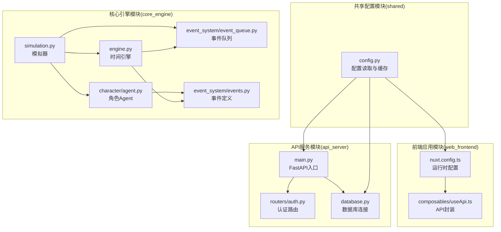
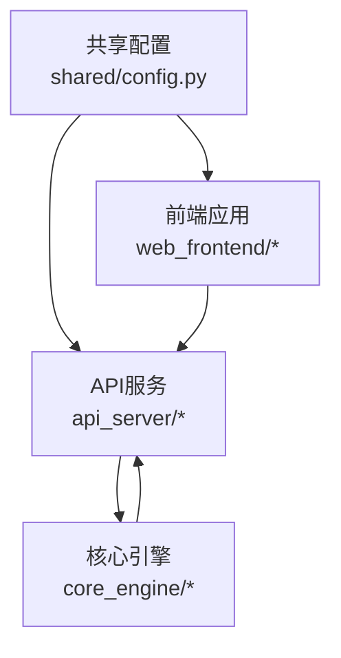
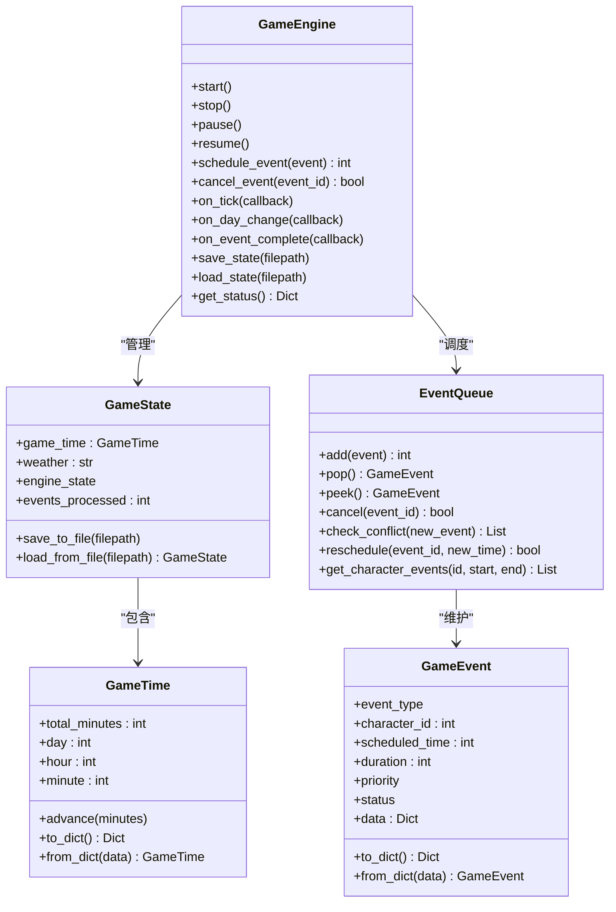
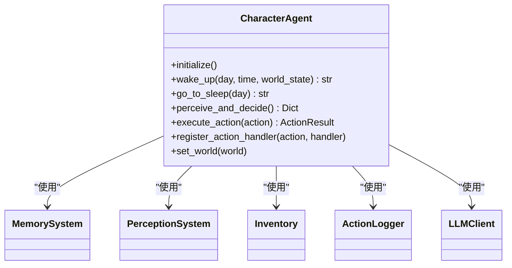
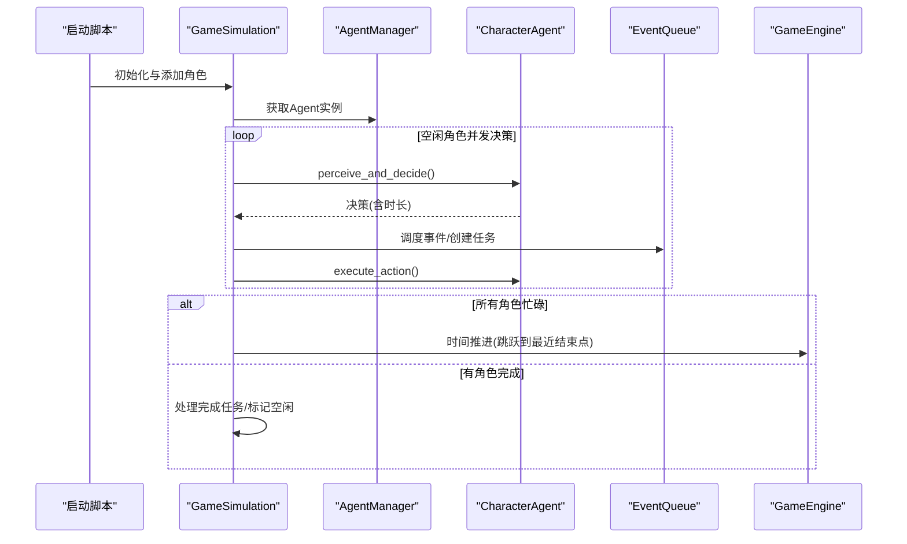
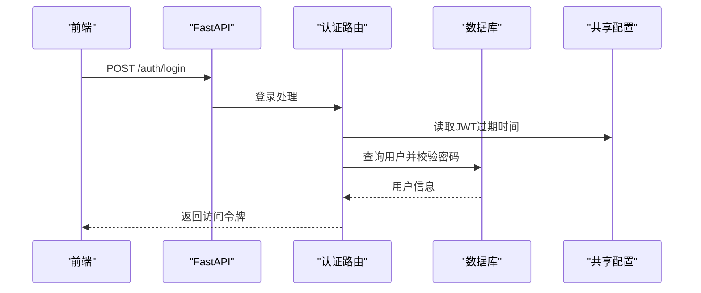
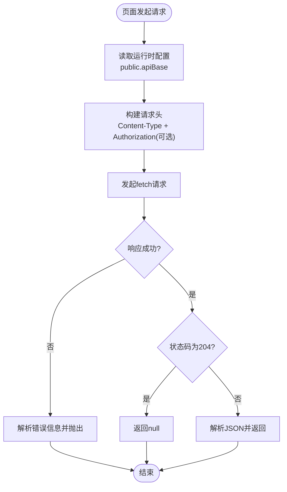
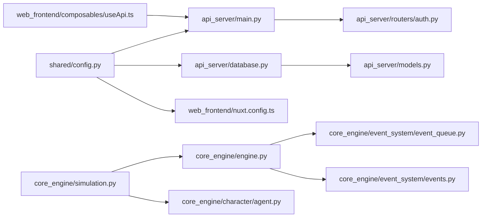

# 模块化设计

<cite>
**本文引用的文件**
- [README.md](file://README.md)
- [shared/config.py](file://shared/config.py)
- [api_server/main.py](file://api_server/main.py)
- [api_server/routers/auth.py](file://api_server/routers/auth.py)
- [api_server/database.py](file://api_server/database.py)
- [web_frontend/nuxt.config.ts](file://web_frontend/nuxt.config.ts)
- [web_frontend/composables/useApi.ts](file://web_frontend/composables/useApi.ts)
- [core_engine/engine.py](file://core_engine/engine.py)
- [core_engine/event_system/events.py](file://core_engine/event_system/events.py)
- [core_engine/event_system/event_queue.py](file://core_engine/event_system/event_queue.py)
- [core_engine/character/agent.py](file://core_engine/character/agent.py)
- [core_engine/simulation.py](file://core_engine/simulation.py)
- [run_simulation.py](file://run_simulation.py)
- [requirements.txt](file://requirements.txt)
- [web_frontend/package.json](file://web_frontend/package.json)
</cite>

## 目录
1. [简介](#简介)
2. [项目结构](#项目结构)
3. [核心组件](#核心组件)
4. [架构总览](#架构总览)
5. [详细组件分析](#详细组件分析)
6. [依赖关系分析](#依赖关系分析)
7. [性能考量](#性能考量)
8. [故障排查指南](#故障排查指南)
9. [结论](#结论)
10. [附录](#附录)

## 简介
本项目采用模块化设计，围绕“核心引擎模块、API服务模块、前端应用模块、共享配置模块”四大领域进行组织。通过事件驱动的时间引擎、角色AI决策子系统、社交行为调度与持久化，形成可交互、可扩展、可替换的本地拟真AI社区模拟系统。模块间通过清晰的接口契约（配置注入、回调注册、事件队列）实现松耦合协作，并提供插件化与配置驱动的扩展能力。

## 项目结构
项目采用按领域分层的模块化布局：
- 核心引擎模块（core_engine）：时间引擎、事件系统、角色Agent、环境与社交行为、AI集成等
- API服务模块（api_server）：FastAPI后端、路由、数据库连接与ORM模型
- 前端应用模块（web_frontend）：Nuxt 3 + Vue 3 + Pinia + Vant
- 共享配置模块（shared）：统一的配置读取与缓存

图表来源
- [shared/config.py](file://shared/config.py#L1-L52)
- [api_server/main.py](file://api_server/main.py#L1-L69)
- [api_server/routers/auth.py](file://api_server/routers/auth.py#L1-L78)
- [api_server/database.py](file://api_server/database.py#L1-L33)
- [core_engine/engine.py](file://core_engine/engine.py#L1-L429)
- [core_engine/event_system/events.py](file://core_engine/event_system/events.py#L1-L356)
- [core_engine/event_system/event_queue.py](file://core_engine/event_system/event_queue.py#L1-L244)
- [core_engine/character/agent.py](file://core_engine/character/agent.py#L1-L800)
- [core_engine/simulation.py](file://core_engine/simulation.py#L1-L529)
- [web_frontend/nuxt.config.ts](file://web_frontend/nuxt.config.ts#L1-L42)
- [web_frontend/composables/useApi.ts](file://web_frontend/composables/useApi.ts#L1-L57)

章节来源
- [README.md](file://README.md#L5-L35)

## 核心组件
- 共享配置模块（shared/config.py）
  - 提供统一的配置读取、缓存与环境变量绑定，集中管理数据库、JWT、服务端口、前端地址、文件存储、AI与ComfyUI预留参数等
  - 通过缓存函数减少重复解析成本
- API服务模块（api_server）
  - FastAPI应用入口，注册路由、CORS中间件，暴露认证、用户、帖子、评论、文件、消息等接口
  - 数据库连接通过共享配置注入，路由模块依赖共享配置读取JWT等参数
- 核心引擎模块（core_engine）
  - 时间引擎与状态管理：GameEngine、GameTime、GameState
  - 事件系统：事件类型、优先级、状态；事件队列（优先队列+懒删除）；事件处理器注册
  - 角色Agent：感知、记忆、库存、行动日志、LLM集成；支持注册自定义行动处理器
  - 模拟器：基于行动结束触发的事件驱动模拟，支持并行决策、时间跳跃、回调通知
- 前端应用模块（web_frontend）
  - Nuxt 3配置：模块、样式、运行时公共配置（API基础地址）
  - 组合式API封装：统一请求方法、鉴权头注入、错误处理

章节来源
- [shared/config.py](file://shared/config.py#L1-L52)
- [api_server/main.py](file://api_server/main.py#L1-L69)
- [api_server/routers/auth.py](file://api_server/routers/auth.py#L1-L78)
- [api_server/database.py](file://api_server/database.py#L1-L33)
- [core_engine/engine.py](file://core_engine/engine.py#L1-L429)
- [core_engine/event_system/events.py](file://core_engine/event_system/events.py#L1-L356)
- [core_engine/event_system/event_queue.py](file://core_engine/event_system/event_queue.py#L1-L244)
- [core_engine/character/agent.py](file://core_engine/character/agent.py#L1-L800)
- [core_engine/simulation.py](file://core_engine/simulation.py#L1-L529)
- [web_frontend/nuxt.config.ts](file://web_frontend/nuxt.config.ts#L1-L42)
- [web_frontend/composables/useApi.ts](file://web_frontend/composables/useApi.ts#L1-L57)

## 架构总览
系统采用“事件驱动 + 模块解耦”的架构：
- 共享配置贯穿API、前端与核心引擎，保证部署一致性
- API服务模块负责HTTP接入与数据持久化
- 核心引擎模块负责AI决策、事件调度与世界状态推进
- 前端模块通过运行时配置与API封装与后端交互

图表来源
- [shared/config.py](file://shared/config.py#L1-L52)
- [api_server/main.py](file://api_server/main.py#L1-L69)
- [web_frontend/nuxt.config.ts](file://web_frontend/nuxt.config.ts#L1-L42)

## 详细组件分析

### 时间引擎与事件系统
- 时间引擎（GameEngine）
  - 管理游戏时间推进、状态保存/加载、事件执行上下文（含数据库会话）、回调注册（每tick、日期变更、事件完成）
  - 通过事件队列与处理器注册表实现事件的调度与执行
- 事件系统（事件定义与队列）
  - 事件类型、优先级、状态；事件队列支持冲突检测、懒删除、范围查询、重新调度
  - 事件对象可序列化/反序列化，便于状态持久化

图表来源
- [core_engine/engine.py](file://core_engine/engine.py#L167-L429)
- [core_engine/event_system/event_queue.py](file://core_engine/event_system/event_queue.py#L29-L244)
- [core_engine/event_system/events.py](file://core_engine/event_system/events.py#L55-L129)

章节来源
- [core_engine/engine.py](file://core_engine/engine.py#L167-L429)
- [core_engine/event_system/events.py](file://core_engine/event_system/events.py#L1-L356)
- [core_engine/event_system/event_queue.py](file://core_engine/event_system/event_queue.py#L1-L244)

### 角色Agent与社交行为
- 角色Agent
  - 整合记忆、感知、库存、行动日志与LLM客户端，支持注册自定义行动处理器
  - 提供每日流程（醒来/睡觉）、感知与决策、行动执行与日志记录
- 社交行为调度
  - 通过社交调度器实现浏览动态、发帖、私信、互动等行为，与事件系统结合推进模拟

图表来源
- [core_engine/character/agent.py](file://core_engine/character/agent.py#L116-L800)

章节来源
- [core_engine/character/agent.py](file://core_engine/character/agent.py#L1-L800)

### 模拟器与交互流程
- 模拟器（GameSimulation）
  - 基于行动结束触发的事件驱动模拟：空闲角色并发决策、忙碌角色时间跳跃至最近结束点、处理完成任务
  - 支持回调注册（行动开始/结束、时间推进）、状态查询、手动步进
- 启动脚本（run_simulation.py）
  - 加载AI角色、注册回调、交互式命令控制（start/stop/pause/resume/step/status）

图表来源
- [core_engine/simulation.py](file://core_engine/simulation.py#L64-L529)
- [run_simulation.py](file://run_simulation.py#L37-L186)

章节来源
- [core_engine/simulation.py](file://core_engine/simulation.py#L1-L529)
- [run_simulation.py](file://run_simulation.py#L1-L258)

### API服务与认证流程
- 认证路由
  - 注册、登录、获取当前用户信息；登录时使用共享配置中的JWT过期时间生成访问令牌
- 数据库连接
  - 通过共享配置构造数据库URL，提供依赖注入的会话工厂

图表来源
- [api_server/routers/auth.py](file://api_server/routers/auth.py#L1-L78)
- [api_server/database.py](file://api_server/database.py#L1-L33)
- [shared/config.py](file://shared/config.py#L1-L52)

章节来源
- [api_server/routers/auth.py](file://api_server/routers/auth.py#L1-L78)
- [api_server/database.py](file://api_server/database.py#L1-L33)
- [shared/config.py](file://shared/config.py#L1-L52)

### 前端配置与API封装
- 运行时配置
  - 通过Nuxt运行时配置读取公共API基础地址，支持开发与生产环境切换
- API封装
  - 统一请求方法、自动注入Authorization头、错误处理与204特殊处理

图表来源
- [web_frontend/nuxt.config.ts](file://web_frontend/nuxt.config.ts#L15-L19)
- [web_frontend/composables/useApi.ts](file://web_frontend/composables/useApi.ts#L1-L57)

章节来源
- [web_frontend/nuxt.config.ts](file://web_frontend/nuxt.config.ts#L1-L42)
- [web_frontend/composables/useApi.ts](file://web_frontend/composables/useApi.ts#L1-L57)

## 依赖关系分析
- 模块导入导出机制
  - 各模块通过相对/绝对路径导入共享配置与核心组件，避免循环依赖
  - API服务模块通过共享配置注入数据库URL与JWT参数
- 配置传递方式
  - 共享配置统一读取环境变量，提供缓存函数；前端通过Nuxt运行时配置读取公共参数
- 事件订阅发布模式
  - 核心引擎通过回调注册（on_tick/on_day_change/on_event_complete）实现事件驱动的扩展点
  - 模拟器通过回调（on_action_start/on_action_end/on_time_advance）对外通知状态变化

图表来源
- [shared/config.py](file://shared/config.py#L1-L52)
- [api_server/main.py](file://api_server/main.py#L1-L69)
- [api_server/routers/auth.py](file://api_server/routers/auth.py#L1-L78)
- [api_server/database.py](file://api_server/database.py#L1-L33)
- [web_frontend/nuxt.config.ts](file://web_frontend/nuxt.config.ts#L1-L42)
- [web_frontend/composables/useApi.ts](file://web_frontend/composables/useApi.ts#L1-L57)
- [core_engine/simulation.py](file://core_engine/simulation.py#L1-L529)
- [core_engine/engine.py](file://core_engine/engine.py#L1-L429)
- [core_engine/event_system/event_queue.py](file://core_engine/event_system/event_queue.py#L1-L244)
- [core_engine/event_system/events.py](file://core_engine/event_system/events.py#L1-L356)

章节来源
- [requirements.txt](file://requirements.txt#L1-L32)
- [web_frontend/package.json](file://web_frontend/package.json#L1-L28)

## 性能考量
- 事件调度与时间推进
  - 事件队列采用优先队列与懒删除策略，降低冲突检测与清理开销
  - 时间推进按最近任务结束点跳跃，避免逐分钟推进带来的CPU消耗
- 并发与异步
  - 角色决策并发执行，提升吞吐；事件执行与时间推进异步化，减少阻塞
- 缓存与配置
  - 共享配置使用缓存函数，减少重复解析；数据库连接池配置提升I/O效率

## 故障排查指南
- LLM连接失败
  - 确认本地LLM服务已启动且端口正确；可通过模块化测试入口验证连接
- 数据库连接失败
  - 检查MySQL服务状态、密码与数据库是否存在；确认共享配置中的数据库URL
- 没有AI角色
  - 在数据库中创建is_ai=True的用户记录，模拟器需依赖该条件加载角色
- 前端无法访问后端
  - 检查CORS配置与前端运行时API基础地址；确认后端监听地址与端口

章节来源
- [README.md](file://README.md#L269-L286)

## 结论
本项目通过清晰的模块划分与事件驱动架构，实现了前后端分离、核心引擎可替换、配置驱动的扩展能力。共享配置统一治理、回调与事件系统提供灵活的扩展点，使得第三方集成与插件化成为可能。建议在后续迭代中进一步完善模块边界、引入插件注册机制与配置热更新，以增强系统的可维护性与可演进性。

## 附录
- 模块开发最佳实践
  - 配置优先：所有外部依赖（数据库、AI服务、文件存储）通过共享配置注入
  - 松耦合：通过回调与事件契约扩展功能，避免直接耦合
  - 可测试：为核心模块提供独立单元测试与集成测试入口
- 模块扩展与替换
  - 插件化：通过注册表与工厂模式扩展事件处理器与社交行为
  - 配置驱动：通过环境变量与运行时配置控制模块启用与行为
  - 第三方集成：遵循统一接口（如LLMClient、文件存储）进行适配