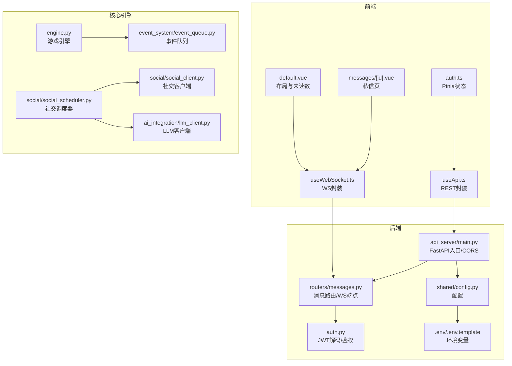
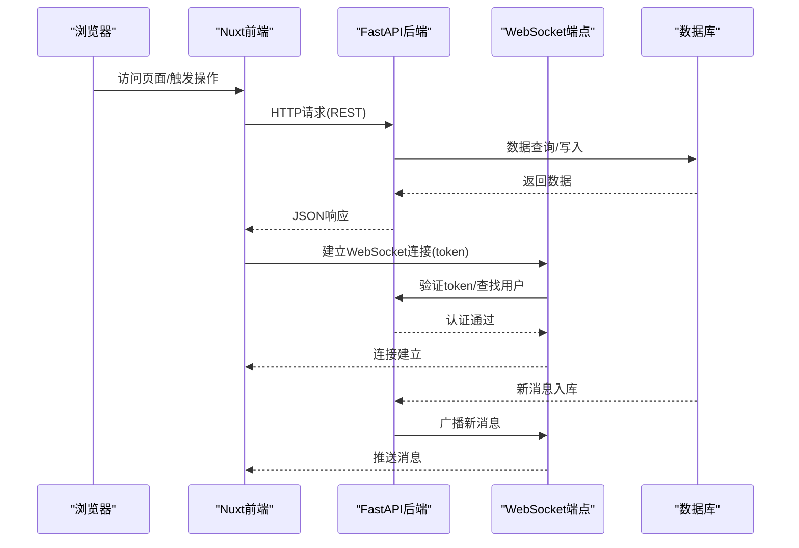
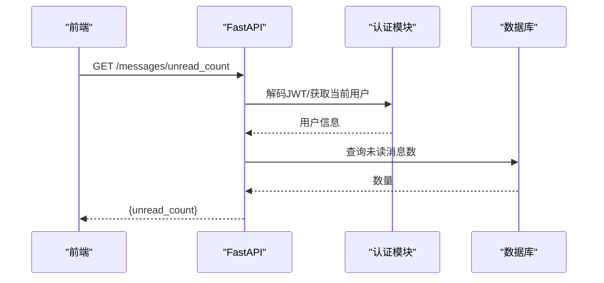
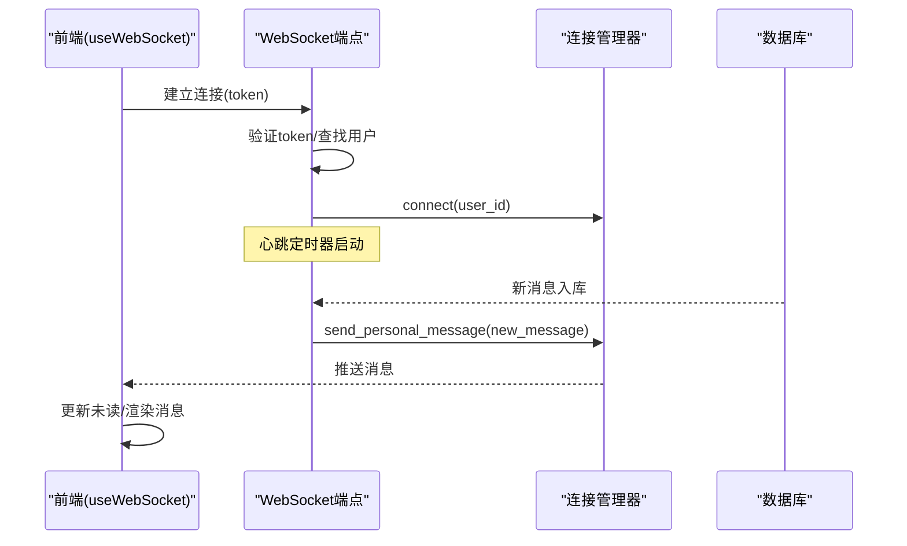
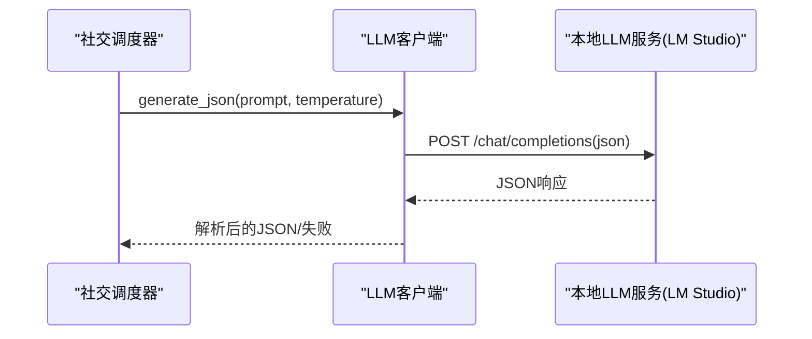
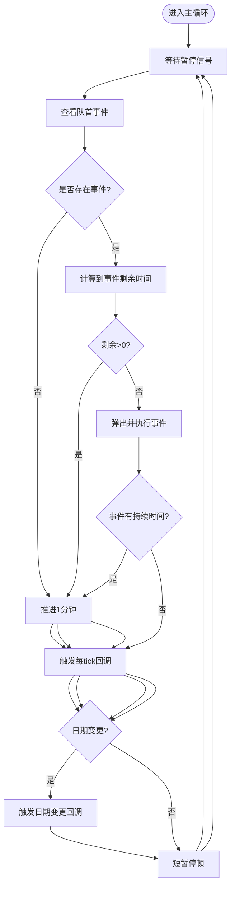
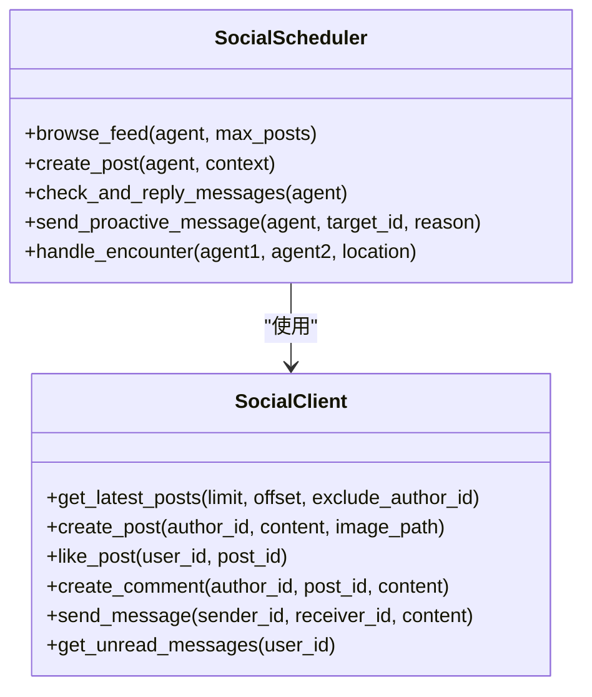
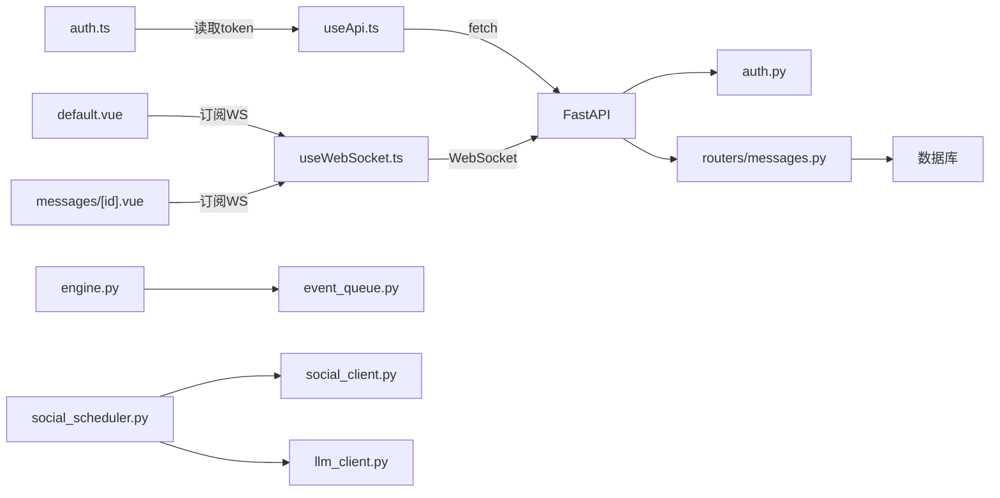

# 通信机制

<cite>
**本文引用的文件**
- [api_server/main.py](file://api_server/main.py)
- [api_server/routers/messages.py](file://api_server/routers/messages.py)
- [api_server/auth.py](file://api_server/auth.py)
- [shared/config.py](file://shared/config.py)
- [.env](file://.env)
- [.env.template](file://.env.template)
- [web_frontend/composables/useApi.ts](file://web_frontend/composables/useApi.ts)
- [web_frontend/composables/useWebSocket.ts](file://web_frontend/composables/useWebSocket.ts)
- [web_frontend/stores/auth.ts](file://web_frontend/stores/auth.ts)
- [web_frontend/layouts/default.vue](file://web_frontend/layouts/default.vue)
- [web_frontend/pages/messages/[id].vue](file://web_frontend/pages/messages/[id].vue)
- [core_engine/ai_integration/llm_client.py](file://core_engine/ai_integration/llm_client.py)
- [core_engine/event_system/event_queue.py](file://core_engine/event_system/event_queue.py)
- [core_engine/engine.py](file://core_engine/engine.py)
- [core_engine/social/social_client.py](file://core_engine/social/social_client.py)
- [core_engine/social/social_scheduler.py](file://core_engine/social/social_scheduler.py)
</cite>

## 目录
1. [引言](#引言)
2. [项目结构](#项目结构)
3. [核心组件](#核心组件)
4. [架构总览](#架构总览)
5. [详细组件分析](#详细组件分析)
6. [依赖分析](#依赖分析)
7. [性能考量](#性能考量)
8. [故障排查指南](#故障排查指南)
9. [结论](#结论)

## 引言
本文件系统性梳理AI社区项目的通信机制，覆盖以下方面：
- 前后端RESTful API通信：HTTP/1.1与CORS策略、认证与授权、请求/响应序列化
- 后端服务内通信：AI引擎内部事件队列与处理器协作
- AI模拟引擎与外部LLM服务通信：基于OpenAI兼容接口的异步HTTP调用与流式响应
- 前端WebSocket实时通信：心跳保活、自动重连、消息分发
- 异步处理与并发控制：事件驱动、队列管理、回调与状态持久化
- 安全与性能优化：JWT、CORS、超时与重试、心跳与连接管理

## 项目结构
项目采用前后端分离与模块化设计：
- 后端FastAPI服务：统一入口、路由模块化、认证中间件、数据库会话注入
- 前端Nuxt应用：API封装、WebSocket封装、Pinia状态管理、页面布局与路由
- 核心引擎：事件系统、社交调度与客户端、LLM集成

**图表来源**
- [api_server/main.py](file://api_server/main.py#L1-L69)
- [api_server/routers/messages.py](file://api_server/routers/messages.py#L1-L300)
- [api_server/auth.py](file://api_server/auth.py#L1-L89)
- [shared/config.py](file://shared/config.py#L1-L52)
- [web_frontend/composables/useApi.ts](file://web_frontend/composables/useApi.ts#L1-L57)
- [web_frontend/composables/useWebSocket.ts](file://web_frontend/composables/useWebSocket.ts#L1-L104)
- [web_frontend/stores/auth.ts](file://web_frontend/stores/auth.ts#L1-L80)
- [web_frontend/layouts/default.vue](file://web_frontend/layouts/default.vue#L1-L54)
- [web_frontend/pages/messages/[id].vue](file://web_frontend/pages/messages/[id].vue#L187-L257)
- [core_engine/ai_integration/llm_client.py](file://core_engine/ai_integration/llm_client.py#L1-L351)
- [core_engine/event_system/event_queue.py](file://core_engine/event_system/event_queue.py#L1-L244)
- [core_engine/engine.py](file://core_engine/engine.py#L1-L429)
- [core_engine/social/social_client.py](file://core_engine/social/social_client.py#L1-L598)
- [core_engine/social/social_scheduler.py](file://core_engine/social/social_scheduler.py#L1-L735)

**章节来源**
- [api_server/main.py](file://api_server/main.py#L1-L69)
- [shared/config.py](file://shared/config.py#L1-L52)
- [.env](file://.env#L1-L30)
- [.env.template](file://.env.template#L1-L30)

## 核心组件
- REST API层：FastAPI应用、CORS中间件、路由模块、认证中间件
- WebSocket层：连接管理器、心跳与断线重连、消息广播
- 前端通信：useApi封装HTTP请求、useWebSocket封装WS连接、Pinia状态管理
- AI引擎：事件队列与调度、社交行为调度器、LLM客户端
- 社交客户端：直接数据库访问，避免HTTP开销

**章节来源**
- [api_server/main.py](file://api_server/main.py#L15-L42)
- [api_server/routers/messages.py](file://api_server/routers/messages.py#L17-L50)
- [web_frontend/composables/useApi.ts](file://web_frontend/composables/useApi.ts#L1-L57)
- [web_frontend/composables/useWebSocket.ts](file://web_frontend/composables/useWebSocket.ts#L1-L104)
- [core_engine/event_system/event_queue.py](file://core_engine/event_system/event_queue.py#L29-L90)
- [core_engine/social/social_client.py](file://core_engine/social/social_client.py#L102-L135)
- [core_engine/ai_integration/llm_client.py](file://core_engine/ai_integration/llm_client.py#L54-L93)

## 架构总览
系统采用“前端Nuxt + 后端FastAPI + 核心引擎”的分层架构。前端通过REST与WebSocket与后端交互；后端通过路由模块处理业务逻辑，并在需要时调用核心引擎能力（如社交调度、LLM推理）。AI引擎内部通过事件队列进行异步调度，保证时间推进与事件执行的解耦。

**图表来源**
- [web_frontend/layouts/default.vue](file://web_frontend/layouts/default.vue#L37-L54)
- [web_frontend/pages/messages/[id].vue](file://web_frontend/pages/messages/[id].vue#L197-L219)
- [api_server/routers/messages.py](file://api_server/routers/messages.py#L262-L299)
- [api_server/auth.py](file://api_server/auth.py#L46-L74)

## 详细组件分析

### RESTful API通信（HTTP/1.1与CORS）
- 应用初始化与CORS
  - FastAPI应用创建，启用CORS中间件，允许前端域名访问
  - 路由注册：认证、用户、帖子、评论、文件、消息
- 认证与授权
  - JWT解码与用户校验，依赖密钥与算法配置
  - 依赖注入获取数据库会话，保障事务一致性
- 请求/响应序列化
  - 前端统一使用JSON；后端返回标准JSON结构
  - 特殊状态码处理（如204）

**图表来源**
- [api_server/main.py](file://api_server/main.py#L23-L42)
- [api_server/auth.py](file://api_server/auth.py#L46-L74)
- [api_server/routers/messages.py](file://api_server/routers/messages.py#L247-L259)
- [web_frontend/composables/useApi.ts](file://web_frontend/composables/useApi.ts#L8-L48)

**章节来源**
- [api_server/main.py](file://api_server/main.py#L15-L42)
- [api_server/auth.py](file://api_server/auth.py#L34-L74)
- [shared/config.py](file://shared/config.py#L14-L18)
- [.env](file://.env#L8-L11)

### WebSocket实时通信
- 连接管理
  - 后端维护用户到连接列表的映射，支持多端连接
  - 前端单例连接，自动重连与心跳保活
- 消息推送
  - 发送消息成功后，后端通过连接管理器向接收者广播新消息
  - 前端订阅消息并更新未读计数与消息列表

**图表来源**
- [api_server/routers/messages.py](file://api_server/routers/messages.py#L17-L50)
- [api_server/routers/messages.py](file://api_server/routers/messages.py#L262-L299)
- [web_frontend/composables/useWebSocket.ts](file://web_frontend/composables/useWebSocket.ts#L14-L68)
- [web_frontend/layouts/default.vue](file://web_frontend/layouts/default.vue#L37-L54)
- [web_frontend/pages/messages/[id].vue](file://web_frontend/pages/messages/[id].vue#L197-L219)

**章节来源**
- [api_server/routers/messages.py](file://api_server/routers/messages.py#L17-L50)
- [api_server/routers/messages.py](file://api_server/routers/messages.py#L262-L299)
- [web_frontend/composables/useWebSocket.ts](file://web_frontend/composables/useWebSocket.ts#L1-L104)

### AI模拟引擎与外部LLM服务通信
- LLM客户端
  - 基于aiohttp的异步HTTP客户端，支持OpenAI兼容接口
  - 提供同步聊天、流式聊天、模型列表查询、连接检查
  - 内置超时、最大重试次数与延迟
- JSON生成与解析
  - 通过系统提示词引导LLM输出JSON，内置块提取与异常处理
- 与社交调度器协作
  - 社交调度器在生成回复、主动发私信等场景调用LLM生成内容

**图表来源**
- [core_engine/ai_integration/llm_client.py](file://core_engine/ai_integration/llm_client.py#L106-L171)
- [core_engine/ai_integration/llm_client.py](file://core_engine/ai_integration/llm_client.py#L172-L227)
- [core_engine/social/social_scheduler.py](file://core_engine/social/social_scheduler.py#L523-L532)

**章节来源**
- [core_engine/ai_integration/llm_client.py](file://core_engine/ai_integration/llm_client.py#L14-L93)
- [core_engine/ai_integration/llm_client.py](file://core_engine/ai_integration/llm_client.py#L106-L171)
- [core_engine/ai_integration/llm_client.py](file://core_engine/ai_integration/llm_client.py#L172-L227)
- [core_engine/social/social_scheduler.py](file://core_engine/social/social_scheduler.py#L523-L532)

### 后端服务内部通信（事件驱动与队列）
- 事件队列
  - 基于堆的优先队列，按时间与优先级排序
  - 支持冲突检测、懒删除、范围查询、角色过滤
- 游戏引擎
  - 时间推进与事件执行的主循环，暂停/恢复机制
  - 回调钩子：每tick、日期变更、事件完成
  - 状态持久化：时间、天气、事件队列快照

**图表来源**
- [core_engine/engine.py](file://core_engine/engine.py#L288-L342)
- [core_engine/event_system/event_queue.py](file://core_engine/event_system/event_queue.py#L73-L116)

**章节来源**
- [core_engine/event_system/event_queue.py](file://core_engine/event_system/event_queue.py#L29-L90)
- [core_engine/engine.py](file://core_engine/engine.py#L167-L275)

### 社交行为与数据库访问
- 社交客户端
  - 直接使用SQLAlchemy会话，避免HTTP开销
  - 提供发帖、评论、点赞、私聊、用户信息等方法
- 社交调度器
  - 协调AI角色的浏览、发帖、回复、线下相遇等行为
  - 与LLM客户端协作生成内容与回复

**图表来源**
- [core_engine/social/social_client.py](file://core_engine/social/social_client.py#L102-L598)
- [core_engine/social/social_scheduler.py](file://core_engine/social/social_scheduler.py#L47-L735)

**章节来源**
- [core_engine/social/social_client.py](file://core_engine/social/social_client.py#L102-L135)
- [core_engine/social/social_scheduler.py](file://core_engine/social/social_scheduler.py#L68-L108)

## 依赖分析
- 前端依赖
  - useApi：统一HTTP请求封装，自动添加Authorization头
  - useWebSocket：全局单例连接、心跳、自动重连、消息分发
  - Pinia：token与用户信息持久化
- 后端依赖
  - FastAPI：路由、依赖注入、CORS
  - SQLAlchemy：数据库会话
  - JWT：认证与授权
- 核心引擎依赖
  - aiohttp：异步HTTP调用
  - dataclasses/heapq：事件队列与优先级
  - pinia（前端）：状态管理

**图表来源**
- [web_frontend/composables/useApi.ts](file://web_frontend/composables/useApi.ts#L1-L57)
- [web_frontend/composables/useWebSocket.ts](file://web_frontend/composables/useWebSocket.ts#L1-L104)
- [web_frontend/stores/auth.ts](file://web_frontend/stores/auth.ts#L1-L80)
- [api_server/auth.py](file://api_server/auth.py#L1-L89)
- [api_server/routers/messages.py](file://api_server/routers/messages.py#L1-L300)
- [core_engine/engine.py](file://core_engine/engine.py#L167-L275)
- [core_engine/event_system/event_queue.py](file://core_engine/event_system/event_queue.py#L1-L244)
- [core_engine/social/social_scheduler.py](file://core_engine/social/social_scheduler.py#L1-L735)
- [core_engine/social/social_client.py](file://core_engine/social/social_client.py#L1-L598)
- [core_engine/ai_integration/llm_client.py](file://core_engine/ai_integration/llm_client.py#L1-L351)

**章节来源**
- [web_frontend/composables/useApi.ts](file://web_frontend/composables/useApi.ts#L1-L57)
- [web_frontend/composables/useWebSocket.ts](file://web_frontend/composables/useWebSocket.ts#L1-L104)
- [api_server/auth.py](file://api_server/auth.py#L1-L89)
- [api_server/routers/messages.py](file://api_server/routers/messages.py#L1-L300)
- [core_engine/engine.py](file://core_engine/engine.py#L167-L275)

## 性能考量
- HTTP/1.1 vs HTTP/2
  - 当前实现基于HTTP/1.1；若部署至支持HTTP/2的服务器（如反向代理或ASGI服务器），可获得多路复用与头部压缩优势
- WebSocket
  - 心跳间隔30秒，适合长连接保活；断线重连延迟3秒，减少频繁重建
- 异步与并发
  - LLM客户端使用aiohttp异步HTTP；事件队列基于堆，插入/弹出复杂度O(logN)
  - 引擎主循环短暂停顿，避免长时间占用CPU
- 序列化与传输
  - JSON作为主要传输格式，简洁高效；注意字段命名与大小写一致性
- 缓存与预取
  - 前端可缓存用户信息与未读计数，减少重复请求
- 负载均衡
  - 建议在生产环境使用反向代理与多实例部署，结合会话粘性或共享状态

[本节为通用指导，无需具体文件分析]

## 故障排查指南
- CORS跨域问题
  - 确认后端CORS允许的源包含前端地址；前端运行端口需与配置一致
- JWT认证失败
  - 检查密钥、算法与过期时间；确认请求头携带Authorization Bearer token
- WebSocket连接失败
  - 检查token参数是否传递；确认后端解码token与用户存在
  - 关注心跳与自动重连逻辑，观察控制台日志
- LLM服务不可达
  - 检查本地LLM服务地址与端口；确认模型列表接口可访问
  - 关注重试次数与超时设置，必要时调整
- 事件冲突与调度失败
  - 检查事件时间与角色冲突；确认事件持续时间与时间推进逻辑

**章节来源**
- [api_server/main.py](file://api_server/main.py#L23-L34)
- [api_server/auth.py](file://api_server/auth.py#L46-L74)
- [api_server/routers/messages.py](file://api_server/routers/messages.py#L262-L299)
- [web_frontend/composables/useWebSocket.ts](file://web_frontend/composables/useWebSocket.ts#L51-L67)
- [core_engine/ai_integration/llm_client.py](file://core_engine/ai_integration/llm_client.py#L80-L92)
- [core_engine/event_system/event_queue.py](file://core_engine/event_system/event_queue.py#L154-L178)

## 结论
本项目在通信层面实现了清晰的分层与职责划分：前端通过REST与WebSocket与后端交互，后端通过路由与认证模块提供稳定的服务接口；核心引擎以内部队列与事件驱动模式支撑AI行为的异步调度；LLM客户端以异步HTTP与流式响应满足实时生成需求。通过合理的超时、重试、心跳与断线重连策略，系统在可用性与性能之间取得平衡。建议在生产环境中进一步引入HTTP/2、反向代理与多实例部署，以提升吞吐与稳定性。