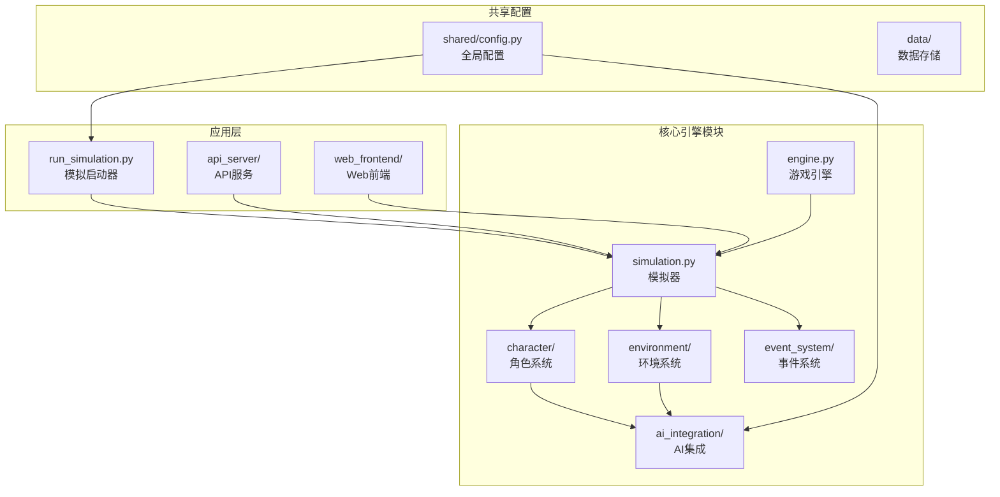
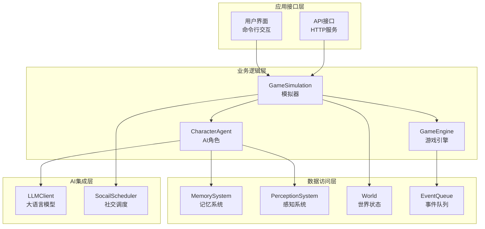
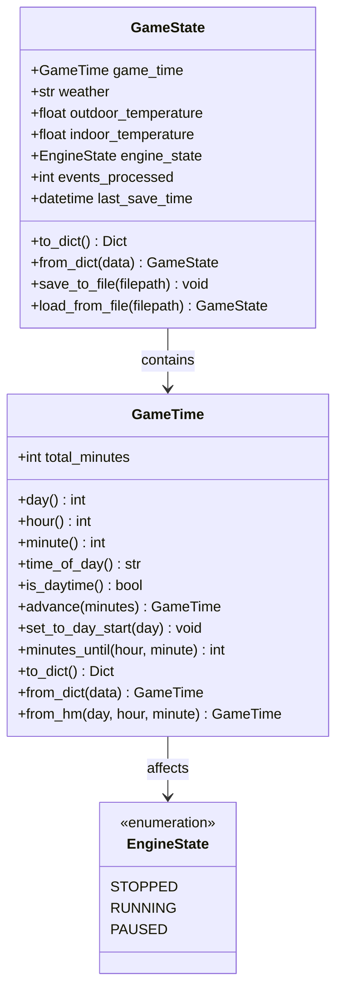
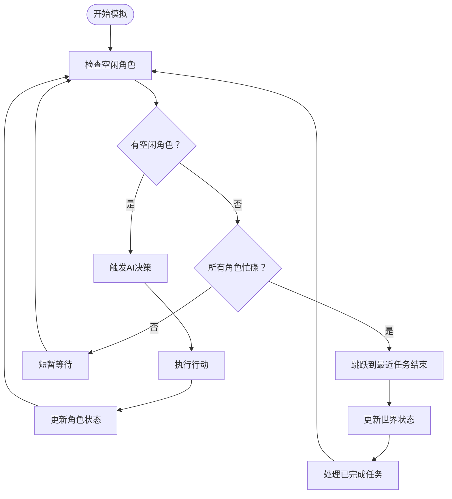
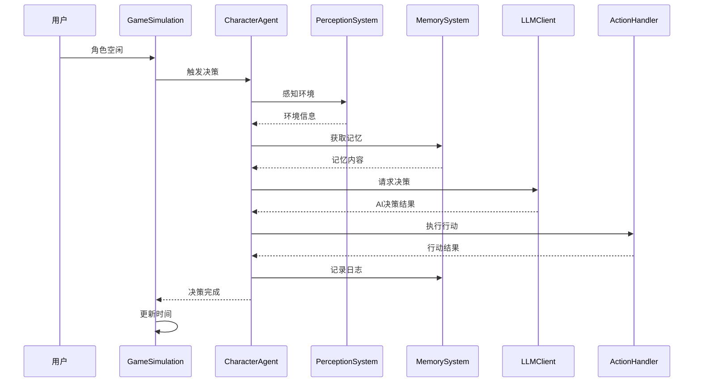
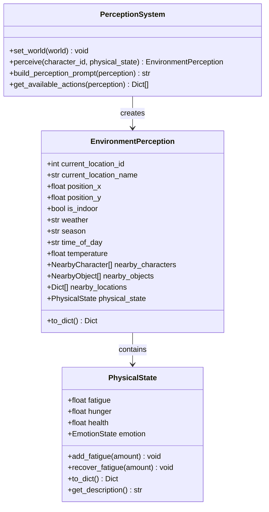
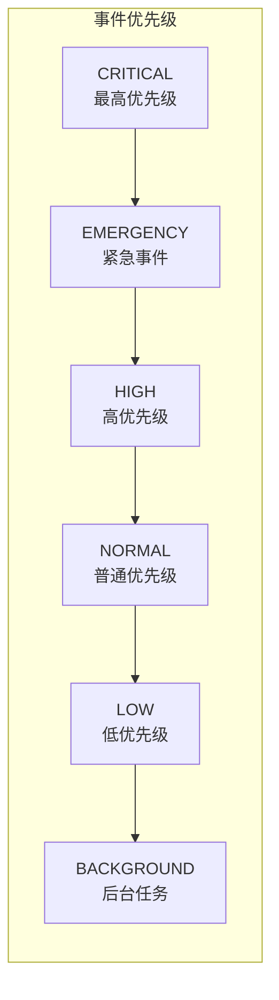
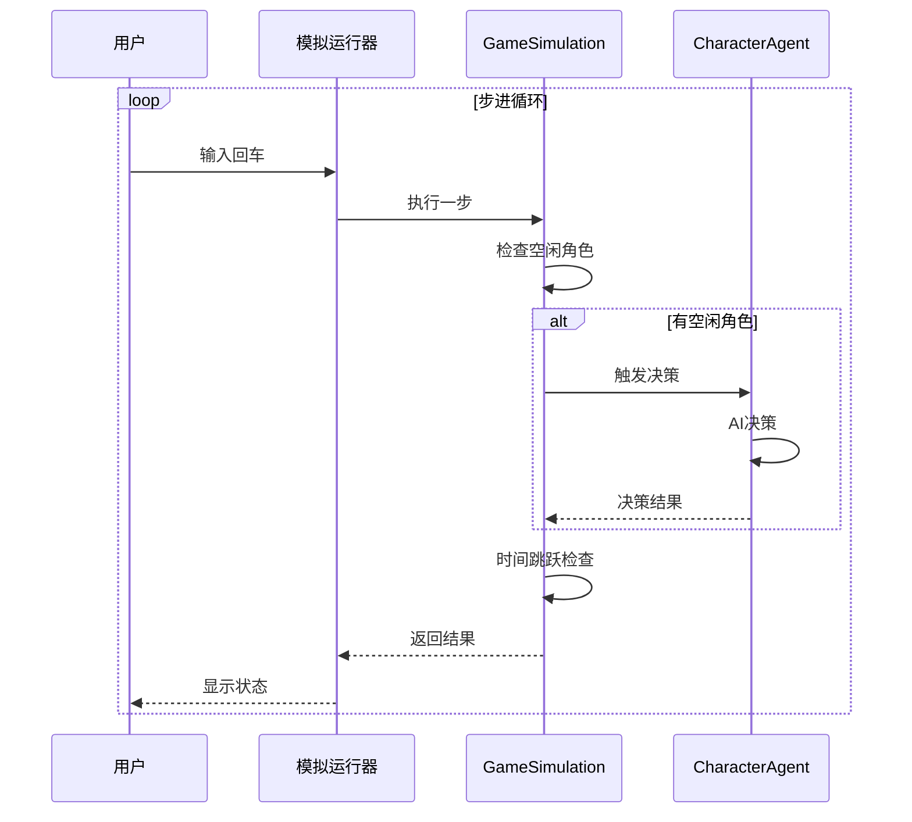
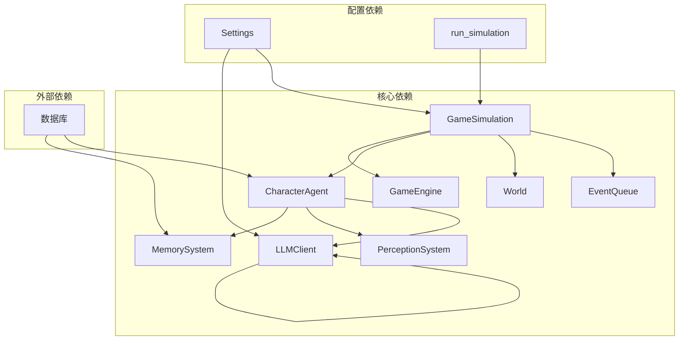

# AI模拟系统

<cite>
**本文档引用的文件**
- [engine.py](file://core_engine/engine.py)
- [simulation.py](file://core_engine/simulation.py)
- [agent.py](file://core_engine/character/agent.py)
- [perception.py](file://core_engine/character/perception.py)
- [memory.py](file://core_engine/character/memory.py)
- [world.py](file://core_engine/environment/world.py)
- [event_queue.py](file://core_engine/event_system/event_queue.py)
- [events.py](file://core_engine/event_system/events.py)
- [llm_client.py](file://core_engine/ai_integration/llm_client.py)
- [run_simulation.py](file://run_simulation.py)
- [config.py](file://shared/config.py)
- [README.md](file://README.md)
- [requirements.txt](file://requirements.txt)
</cite>

## 目录
1. [简介](#简介)
2. [项目结构](#项目结构)
3. [核心组件](#核心组件)
4. [架构概览](#架构概览)
5. [详细组件分析](#详细组件分析)
6. [依赖关系分析](#依赖关系分析)
7. [性能考量](#性能考量)
8. [故障排除指南](#故障排除指南)
9. [结论](#结论)
10. [附录](#附录)

## 简介

AI模拟系统是一个基于事件驱动的2D拟真AI社区模拟平台，能够在本地运行的环境中实现AI角色的自主决策、交流和社交互动。该系统采用异步事件调度机制，通过LLM（大语言模型）驱动AI角色的行为决策，实现了从环境感知到行动执行的完整AI决策流程。

系统的核心特性包括：
- **事件驱动架构**：基于优先队列的事件调度系统，支持角色空闲时的AI决策和所有角色忙碌时的时间跳跃
- **自主决策机制**：AI角色通过感知环境、记忆系统和LLM推理进行自主决策
- **双模式运行**：支持交互模式（自动模拟）和步进模式（手动控制）
- **时间管理系统**：精确的分钟级时间推进机制，支持时间跳跃和状态同步
- **社交集成**：内置社交网络功能，支持发帖、评论、私信等社交行为

## 项目结构

AI模拟系统采用模块化设计，主要分为以下几个核心模块：



**图表来源**
- [engine.py](file://core_engine/engine.py#L167-L429)
- [simulation.py](file://core_engine/simulation.py#L64-L529)
- [run_simulation.py](file://run_simulation.py#L1-L258)

**章节来源**
- [README.md](file://README.md#L1-L290)

## 核心组件

### 游戏引擎 GameEngine

GameEngine是整个模拟系统的核心控制器，负责时间管理和事件调度。它维护着游戏状态、时间推进和事件执行的完整生命周期。

关键功能：
- **时间管理**：以分钟为最小单位的时间推进机制
- **事件调度**：基于优先队列的事件调度系统
- **状态管理**：引擎状态的运行、暂停、停止控制
- **回调机制**：支持tick回调、日期变更回调和事件完成回调

### 游戏模拟器 GameSimulation

GameSimulation实现了基于行动触发的模拟逻辑，采用"角色空闲→AI决策→行动执行→时间跳跃"的循环模式。

核心特性：
- **行动触发机制**：角色空闲时自动触发AI决策
- **时间跳跃算法**：当所有角色忙碌时，时间自动跳跃到最近的行动结束点
- **并行决策**：支持多个角色同时进行AI决策
- **手动步进**：提供手动执行一步的功能

### AI角色 Agent

CharacterAgent是AI角色的核心控制器，集成了感知、记忆、决策和行动执行的完整功能。

主要子系统：
- **感知系统**：EnvironmentPerception负责环境信息收集
- **记忆系统**：MemorySystem管理各类记忆（日常、重要、知识、关系）
- **行动系统**：支持多种行动类型和自定义处理器
- **状态管理**：AgentState管理角色的当前状态

**章节来源**
- [engine.py](file://core_engine/engine.py#L167-L429)
- [simulation.py](file://core_engine/simulation.py#L64-L529)
- [agent.py](file://core_engine/character/agent.py#L116-L800)

## 架构概览

系统采用分层架构设计，从底层的事件驱动到顶层的应用接口，形成了清晰的职责分离：



**图表来源**
- [simulation.py](file://core_engine/simulation.py#L64-L529)
- [engine.py](file://core_engine/engine.py#L167-L429)
- [agent.py](file://core_engine/character/agent.py#L116-L800)

## 详细组件分析

### 时间管理系统

时间管理系统是整个模拟系统的基础，提供了精确的时间推进和状态同步机制。

#### GameTime 类



**图表来源**
- [engine.py](file://core_engine/engine.py#L26-L165)

#### 时间推进算法

时间推进采用智能跳跃机制，避免不必要的等待：



**图表来源**
- [simulation.py](file://core_engine/simulation.py#L220-L395)

**章节来源**
- [engine.py](file://core_engine/engine.py#L26-L165)
- [simulation.py](file://core_engine/simulation.py#L220-L395)

### AI角色决策机制

AI角色的决策过程体现了完整的从环境感知到行动执行的AI流程。

#### 决策流程



**图表来源**
- [agent.py](file://core_engine/character/agent.py#L358-L478)
- [perception.py](file://core_engine/character/perception.py#L211-L327)
- [memory.py](file://core_engine/character/memory.py#L444-L492)

#### 环境感知系统

感知系统负责收集角色周围的环境信息，包括物理状态、位置信息、天气条件和附近角色。



**图表来源**
- [perception.py](file://core_engine/character/perception.py#L211-L327)
- [perception.py](file://core_engine/character/perception.py#L126-L209)

**章节来源**
- [agent.py](file://core_engine/character/agent.py#L358-L478)
- [perception.py](file://core_engine/character/perception.py#L211-L327)

### 事件队列调度算法

事件队列采用优先队列实现，支持基于时间、优先级和事件ID的排序机制。

#### 事件优先级体系



**图表来源**
- [events.py](file://core_engine/event_system/events.py#L36-L44)

#### 事件调度流程

```mermaid
flowchart TD
AddEvent[添加事件] --> CheckConflict[检查冲突]
CheckConflict --> HasConflict{"有冲突？"}
HasConflict --> |是| Reject[拒绝调度]
HasConflict --> |否| Schedule[加入队列]
Schedule --> Peek[查看队首]
Peek --> HasEvent{"有事件？"}
HasEvent --> |否| AdvanceTime[推进1分钟]
HasEvent --> |是| CalcDelay[计算延迟]
CalcDelay --> Delay>0{"延迟>0？"}
Delay>0 --> |是| AdvanceTime
Delay>0 --> |否| ExecuteEvent[执行事件]
ExecuteEvent --> UpdateDuration[更新持续时间]
UpdateDuration --> AdvanceTime
```

**图表来源**
- [event_queue.py](file://core_engine/event_system/event_queue.py#L73-L117)
- [engine.py](file://core_engine/engine.py#L343-L382)

**章节来源**
- [event_queue.py](file://core_engine/event_system/event_queue.py#L29-L244)
- [events.py](file://core_engine/event_system/events.py#L55-L129)

### 启动模式与配置

系统提供两种运行模式，满足不同的使用场景需求。

#### 交互模式

交互模式提供完整的命令行界面，支持实时控制和监控：

| 命令 | 功能 | 描述 |
|------|------|------|
| `start` | 启动模拟 | 开始自动模拟运行 |
| `stop` | 停止模拟 | 停止当前模拟进程 |
| `pause` | 暂停模拟 | 暂停模拟运行 |
| `resume` | 恢复模拟 | 恢复暂停的模拟 |
| `step` | 手动执行 | 执行一步模拟并显示结果 |
| `status` | 查看状态 | 显示当前模拟状态和统计数据 |

#### 步进模式

步进模式适合调试和学习，允许逐步观察模拟过程：



**图表来源**
- [run_simulation.py](file://run_simulation.py#L188-L233)

**章节来源**
- [run_simulation.py](file://run_simulation.py#L54-L233)

## 依赖关系分析

系统采用模块化设计，各组件之间的依赖关系清晰明确：



**图表来源**
- [simulation.py](file://core_engine/simulation.py#L84-L86)
- [agent.py](file://core_engine/character/agent.py#L139-L144)
- [config.py](file://shared/config.py#L6-L52)

**章节来源**
- [requirements.txt](file://requirements.txt#L1-L32)

## 性能考量

### 异步并发优化

系统采用异步编程模型，通过`asyncio`实现高效的并发处理：

- **并行决策**：多个角色的AI决策可以并行执行，提高决策效率
- **非阻塞IO**：数据库操作和网络请求采用异步方式，避免阻塞主线程
- **事件驱动**：基于事件的调度机制减少了轮询开销

### 内存管理策略

- **惰性加载**：角色和记忆数据按需加载，减少内存占用
- **缓存机制**：常用数据在内存中缓存，避免重复查询
- **垃圾回收**：及时释放不再使用的对象，防止内存泄漏

### 时间复杂度分析

- **事件调度**：O(log n) - 优先队列插入和删除操作
- **冲突检测**：O(n) - 需要检查所有现有事件
- **AI决策**：O(m) - m为可用行动数量，通常较小
- **感知收集**：O(k) - k为附近角色和物体数量

## 故障排除指南

### 常见问题诊断

#### LLM连接问题

**症状**：AI角色无法进行决策，出现连接超时错误

**解决方案**：
1. 检查LM Studio服务是否正常运行
2. 验证API端口配置（默认1234）
3. 确认模型已正确加载
4. 检查网络连接和防火墙设置

#### 数据库连接问题

**症状**：模拟器启动时数据库连接失败

**解决方案**：
1. 确认MySQL服务已启动
2. 检查数据库凭据配置
3. 验证数据库是否存在
4. 检查网络连接

#### 角色加载问题

**症状**：模拟器找不到AI角色

**解决方案**：
1. 确认数据库中存在`is_ai=True`的用户
2. 检查用户数据完整性
3. 验证数据库连接权限

**章节来源**
- [README.md](file://README.md#L269-L286)

## 结论

AI模拟系统通过事件驱动的架构设计，成功实现了复杂的AI角色自主决策机制。系统的主要优势包括：

1. **模块化设计**：清晰的职责分离使得系统易于维护和扩展
2. **异步并发**：高效的异步编程模型提升了系统性能
3. **灵活配置**：支持多种运行模式和配置选项
4. **完整生态**：从感知到行动的完整AI决策流程

未来可以考虑的改进方向：
- 增加更多的社交行为类型
- 实现更复杂的记忆检索算法
- 支持分布式部署
- 提供更丰富的可视化功能

## 附录

### 配置参数说明

#### 模拟配置 (SimulationConfig)

| 参数名 | 类型 | 默认值 | 描述 |
|--------|------|--------|------|
| `max_time_skip` | int | 480 | 最大时间跳跃（分钟），默认8小时 |
| `decision_timeout` | float | 60.0 | AI决策超时（秒） |
| `verbose` | bool | True | 是否启用详细日志 |
| `initial_day` | int | 1 | 初始游戏天数 |
| `initial_hour` | int | 8 | 初始小时 |
| `initial_minute` | int | 0 | 初始分钟 |

#### LLM配置 (LLMConfig)

| 参数名 | 类型 | 默认值 | 描述 |
|--------|------|--------|------|
| `base_url` | str | "http://127.0.0.1:1234/v1" | LLM服务基础URL |
| `model` | str | "qwen3-vl-8b" | 使用的模型名称 |
| `temperature` | float | 0.7 | 生成文本的随机性 |
| `max_tokens` | int | 2048 | 最大生成token数 |
| `top_p` | float | 0.9 | 采样参数 |
| `timeout` | int | 120 | 请求超时（秒） |

### API端点

| 端点 | 方法 | 描述 |
|------|------|------|
| `/auth/register` | POST | 用户注册 |
| `/auth/login` | POST | 用户登录 |
| `/users/me` | GET | 获取当前用户信息 |
| `/posts` | GET/POST | 获取帖子列表/创建帖子 |
| `/comments` | POST | 发表评论 |
| `/messages` | GET | 获取私信 |
| `/files/upload` | POST | 上传文件 |