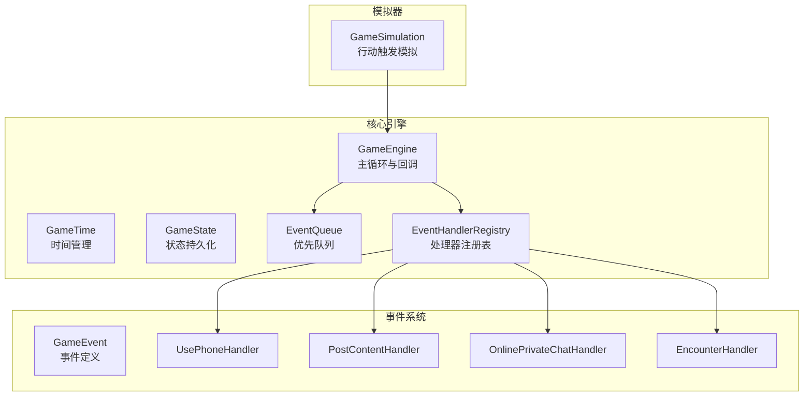
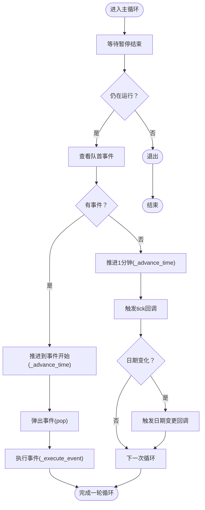
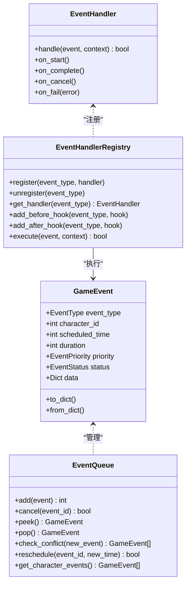
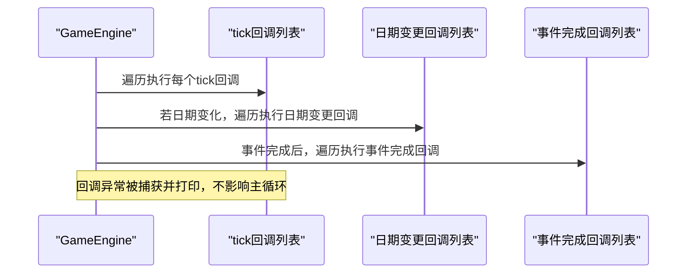
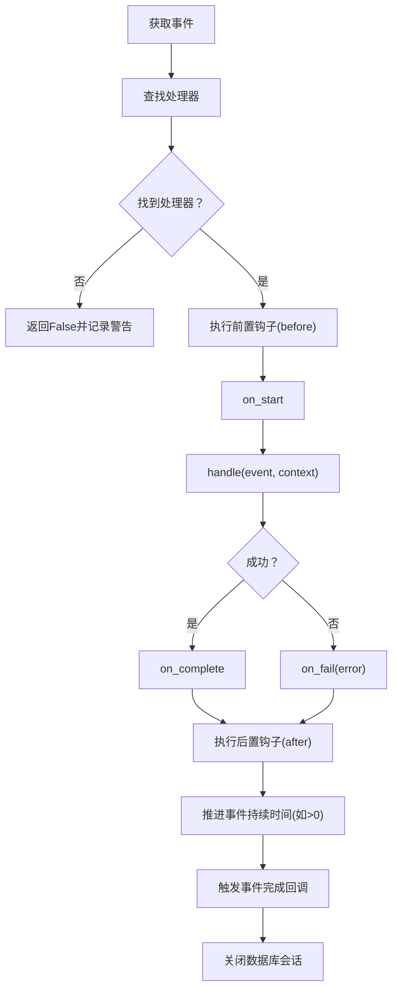
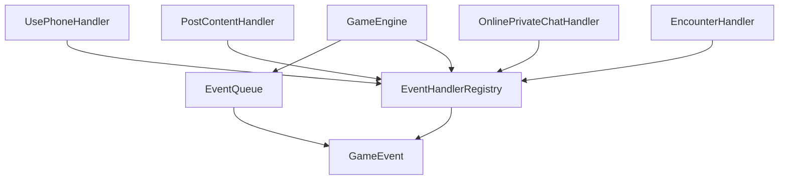

# 事件执行引擎

<cite>
**本文档引用的文件**
- [core_engine/engine.py](file://core_engine/engine.py)
- [core_engine/simulation.py](file://core_engine/simulation.py)
- [core_engine/event_system/events.py](file://core_engine/event_system/events.py)
- [core_engine/event_system/handlers.py](file://core_engine/event_system/handlers.py)
- [core_engine/event_system/event_queue.py](file://core_engine/event_system/event_queue.py)
- [core_engine/social/social_handlers.py](file://core_engine/social/social_handlers.py)
- [run_simulation.py](file://run_simulation.py)
- [README.md](file://README.md)
</cite>

## 目录
1. [简介](#简介)
2. [项目结构](#项目结构)
3. [核心组件](#核心组件)
4. [架构概览](#架构概览)
5. [详细组件分析](#详细组件分析)
6. [依赖关系分析](#依赖关系分析)
7. [性能考量](#性能考量)
8. [故障排查指南](#故障排查指南)
9. [结论](#结论)
10. [附录](#附录)

## 简介
本文件面向事件执行引擎，系统性阐述_game_loop主循环的工作原理、事件执行流程、回调系统设计，并深入解析事件执行上下文（context）的构建、数据库会话管理、异常处理机制。文档覆盖从事件获取、处理器查找、执行包装到结果处理的完整过程，详细说明回调系统的实现（on_tick、on_day_change、on_event_complete），并提供并发安全、性能监控与调试技巧。

## 项目结构
事件执行引擎位于 core_engine 目录，主要由以下模块组成：
- engine.py：游戏引擎核心，包含 GameEngine、GameTime、GameState、事件队列与回调系统
- event_system：事件系统，包含事件定义、事件队列、事件处理器与注册表
- social：社交事件处理器，提供 USE_PHONE、POST_CONTENT、ONLINE_PRIVATE_CHAT、ENCOUNTER 等处理器
- simulation.py：模拟器整合层，演示基于行动触发的模拟流程
- run_simulation.py：模拟器启动脚本，展示回调注册与数据库会话注入



图表来源
- [core_engine/engine.py](file://core_engine/engine.py#L167-L429)
- [core_engine/event_system/event_queue.py](file://core_engine/event_system/event_queue.py#L29-L244)
- [core_engine/event_system/handlers.py](file://core_engine/event_system/handlers.py#L50-L156)
- [core_engine/event_system/events.py](file://core_engine/event_system/events.py#L55-L356)
- [core_engine/social/social_handlers.py](file://core_engine/social/social_handlers.py#L18-L200)
- [core_engine/simulation.py](file://core_engine/simulation.py#L64-L529)

章节来源
- [core_engine/engine.py](file://core_engine/engine.py#L1-L429)
- [core_engine/event_system/events.py](file://core_engine/event_system/events.py#L1-L356)
- [core_engine/event_system/handlers.py](file://core_engine/event_system/handlers.py#L1-L156)
- [core_engine/event_system/event_queue.py](file://core_engine/event_system/event_queue.py#L1-L244)
- [core_engine/social/social_handlers.py](file://core_engine/social/social_handlers.py#L1-L253)
- [core_engine/simulation.py](file://core_engine/simulation.py#L1-L529)
- [run_simulation.py](file://run_simulation.py#L1-L258)

## 核心组件
- GameEngine：主循环与状态管理，负责时间推进、事件调度、回调触发与异常处理
- EventQueue：基于优先队列的事件调度系统，支持冲突检测、懒删除与批量查询
- EventHandlerRegistry：事件处理器注册表，提供处理器查找、前后置钩子与统一执行包装
- GameEvent：事件数据模型，包含类型、优先级、持续时间、状态与附加数据
- GameTime/GameState：时间与时序状态管理，支持序列化与恢复
- GameSimulation：模拟器整合层，演示基于行动触发的模拟流程与回调

章节来源
- [core_engine/engine.py](file://core_engine/engine.py#L167-L429)
- [core_engine/event_system/event_queue.py](file://core_engine/event_system/event_queue.py#L29-L244)
- [core_engine/event_system/handlers.py](file://core_engine/event_system/handlers.py#L50-L156)
- [core_engine/event_system/events.py](file://core_engine/event_system/events.py#L55-L356)
- [core_engine/simulation.py](file://core_engine/simulation.py#L64-L529)

## 架构概览
事件执行引擎采用“事件驱动 + 优先队列”的时间模型：
- 主循环按时间推进，遇到事件则执行；否则推进1分钟并触发tick回调
- 事件执行通过处理器注册表查找对应处理器，执行前后置钩子，包装状态流转
- 回调系统支持每tick、日期变更与事件完成三种回调，均具备异常保护

```mermaid
sequenceDiagram
participant Loop as "主循环(_main_loop)"
participant Queue as "事件队列(EventQueue)"
participant Engine as "GameEngine"
participant Reg as "处理器注册表(EventHandlerRegistry)"
participant Handler as "事件处理器(EventHandler)"
participant DB as "数据库会话"
Loop->>Queue : 查看队首事件
alt 无事件
Loop->>Engine : 推进1分钟(_advance_time)
Engine->>Engine : 触发tick回调
Engine->>Engine : 检查日期变更
else 有事件
Loop->>Engine : 推进到事件开始(_advance_time)
Loop->>Queue : 取出事件(pop)
Loop->>Engine : 执行事件(_execute_event)
Engine->>Reg : 查找处理器(get_handler)
Reg->>Handler : on_start
Reg->>Handler : handle(event, context)
alt 成功
Reg->>Handler : on_complete
else 失败
Reg->>Handler : on_fail
end
Engine->>Engine : 触发事件完成回调
Engine->>DB : 关闭会话
end
```

图表来源
- [core_engine/engine.py](file://core_engine/engine.py#L288-L382)
- [core_engine/event_system/handlers.py](file://core_engine/event_system/handlers.py#L99-L137)

章节来源
- [core_engine/engine.py](file://core_engine/engine.py#L288-L382)
- [core_engine/event_system/handlers.py](file://core_engine/event_system/handlers.py#L99-L137)

## 详细组件分析

### GameEngine：主循环与回调系统
- 主循环（_main_loop）：等待暂停信号，检查事件队列，推进时间到事件开始，执行事件并短暂让出控制权
- 时间推进（_advance_time）：逐分钟推进，触发每tick回调；若日期变化，触发日期变更回调
- 事件执行（_execute_event）：构建执行上下文（包含引擎、时间、状态、可选数据库会话），调用处理器注册表执行，成功则推进事件持续时间并触发事件完成回调，异常时设置事件失败状态
- 回调注册：on_tick、on_day_change、on_event_complete，均接收异步回调并进行异常保护
- 状态管理：支持保存/加载状态，包含事件队列持久化



图表来源
- [core_engine/engine.py](file://core_engine/engine.py#L288-L318)

章节来源
- [core_engine/engine.py](file://core_engine/engine.py#L240-L382)

### 事件系统：事件定义、队列与处理器
- GameEvent：事件数据模型，包含类型、优先级、持续时间、状态与附加数据；支持序列化/反序列化
- EventQueue：基于堆的优先队列，按 scheduled_time 与 priority 排序；支持冲突检测、懒删除、批量查询与重新调度
- EventHandler/EventHandlerRegistry：处理器基类与注册表，提供处理器查找、前后置钩子、统一执行包装与状态流转



图表来源
- [core_engine/event_system/events.py](file://core_engine/event_system/events.py#L55-L129)
- [core_engine/event_system/event_queue.py](file://core_engine/event_system/event_queue.py#L29-L244)
- [core_engine/event_system/handlers.py](file://core_engine/event_system/handlers.py#L12-L156)

章节来源
- [core_engine/event_system/events.py](file://core_engine/event_system/events.py#L55-L356)
- [core_engine/event_system/event_queue.py](file://core_engine/event_system/event_queue.py#L29-L244)
- [core_engine/event_system/handlers.py](file://core_engine/event_system/handlers.py#L12-L156)

### 回调系统：注册、触发与异常处理
- 每tick回调（on_tick）：每推进1分钟触发一次，接收 GameTime 参数
- 日期变更回调（on_day_change）：当日期变化时触发，接收新天数参数
- 事件完成回调（on_event_complete）：事件完成后触发，接收 GameEvent 参数
- 异常处理：所有回调在 try/except 中执行，捕获异常并打印错误信息，避免中断主循环



图表来源
- [core_engine/engine.py](file://core_engine/engine.py#L328-L372)

章节来源
- [core_engine/engine.py](file://core_engine/engine.py#L276-L382)

### 数据库会话管理与上下文构建
- 上下文构建：在事件执行前，将引擎、时间、状态与可选数据库会话注入到 context 字典
- 会话注入：当构造 GameEngine 时传入 db_session_factory，执行事件时通过工厂创建会话并放入 context
- 会话关闭：无论执行成功与否，finally 中都会关闭数据库会话，确保资源释放

章节来源
- [core_engine/engine.py](file://core_engine/engine.py#L347-L381)

### 异常处理机制
- 处理器执行异常：在执行处理器时捕获异常，调用处理器的 on_fail 并返回失败
- 回调异常：在触发回调时捕获异常并打印，避免影响主循环
- 事件状态：失败时将事件状态设置为 FAILED，便于追踪与恢复

章节来源
- [core_engine/engine.py](file://core_engine/engine.py#L374-L377)
- [core_engine/event_system/handlers.py](file://core_engine/event_system/handlers.py#L129-L131)

### 事件执行流程详解
- 事件获取：主循环从事件队列 peek/pop 获取下一个事件
- 处理器查找：通过 EventHandlerRegistry.get_handler(event.event_type) 获取处理器
- 执行包装：统一调用 on_start、handle、on_complete/on_fail，并执行前后置钩子
- 结果处理：成功则推进事件持续时间并触发事件完成回调，失败则记录失败状态



图表来源
- [core_engine/event_system/handlers.py](file://core_engine/event_system/handlers.py#L99-L137)
- [core_engine/engine.py](file://core_engine/engine.py#L343-L382)

章节来源
- [core_engine/event_system/handlers.py](file://core_engine/event_system/handlers.py#L99-L137)
- [core_engine/engine.py](file://core_engine/engine.py#L343-L382)

### 示例：注册回调、处理异常、管理数据库连接
- 注册回调：通过 GameEngine.on_tick/on_day_change/on_event_complete 注册异步回调
- 处理异常：回调内部自行 try/except，主循环捕获回调异常并打印
- 管理数据库连接：通过 db_session_factory 在事件执行前注入 context，并在 finally 中关闭

章节来源
- [core_engine/engine.py](file://core_engine/engine.py#L276-L382)
- [run_simulation.py](file://run_simulation.py#L37-L52)

## 依赖关系分析
- GameEngine 依赖 EventQueue 与 EventHandlerRegistry，负责事件调度与执行
- EventHandlerRegistry 依赖 GameEvent 类型枚举与状态，提供处理器查找与统一执行包装
- EventQueue 依赖 GameEvent 的排序规则，支持冲突检测与懒删除
- 社交事件处理器通过 @event_handler 装饰器自动注册到注册表



图表来源
- [core_engine/engine.py](file://core_engine/engine.py#L178-L182)
- [core_engine/event_system/handlers.py](file://core_engine/event_system/handlers.py#L72-L156)
- [core_engine/event_system/event_queue.py](file://core_engine/event_system/event_queue.py#L46-L59)
- [core_engine/event_system/events.py](file://core_engine/event_system/events.py#L55-L129)
- [core_engine/social/social_handlers.py](file://core_engine/social/social_handlers.py#L18-L200)

章节来源
- [core_engine/engine.py](file://core_engine/engine.py#L178-L182)
- [core_engine/event_system/handlers.py](file://core_engine/event_system/handlers.py#L72-L156)
- [core_engine/event_system/event_queue.py](file://core_engine/event_system/event_queue.py#L46-L59)
- [core_engine/event_system/events.py](file://core_engine/event_system/events.py#L55-L129)
- [core_engine/social/social_handlers.py](file://core_engine/social/social_handlers.py#L18-L200)

## 性能考量
- 优先队列复杂度：EventQueue 使用堆结构，插入/弹出为 O(log n)，冲突检测为 O(n)
- 主循环让出：每次循环短暂 sleep(0.01)，避免CPU占用过高
- 懒删除：取消事件采用懒删除策略，减少堆重建开销
- 并发安全：主循环为单线程事件循环，回调在异步上下文中执行；建议避免在回调中执行阻塞操作
- 数据库会话：每次事件创建独立会话，避免跨事件共享状态；注意连接池配置与超时设置

[本节为通用性能指导，无需特定文件引用]

## 故障排查指南
- 事件未执行：检查事件队列冲突检测与调度时间；确认处理器已注册
- 回调异常：查看主循环与处理器注册表中的异常捕获日志
- 数据库连接泄漏：确认 finally 中会话关闭逻辑；检查 db_session_factory 实现
- 主循环卡住：检查暂停/恢复状态与暂停事件；确认回调中无死循环或长时间阻塞

章节来源
- [core_engine/engine.py](file://core_engine/engine.py#L328-L381)
- [core_engine/event_system/handlers.py](file://core_engine/event_system/handlers.py#L129-L137)

## 结论
事件执行引擎通过“事件驱动 + 优先队列”的架构实现了高效、可扩展的时间推进与事件处理。其统一的处理器注册表与上下文构建机制，使得事件执行流程清晰、可维护性强。回调系统提供了灵活的扩展点，异常处理与数据库会话管理保障了稳定性与安全性。结合本文档的并发安全、性能监控与调试技巧，可进一步提升系统的可靠性与可观测性。

[本节为总结性内容，无需特定文件引用]

## 附录
- 启动模拟器：参考 run_simulation.py 中的回调注册与数据库会话注入示例
- 事件类型与处理器：参考 social_handlers.py 中的 USE_PHONE、POST_CONTENT、ONLINE_PRIVATE_CHAT、ENCOUNTER 处理器实现

章节来源
- [run_simulation.py](file://run_simulation.py#L37-L52)
- [core_engine/social/social_handlers.py](file://core_engine/social/social_handlers.py#L18-L200)