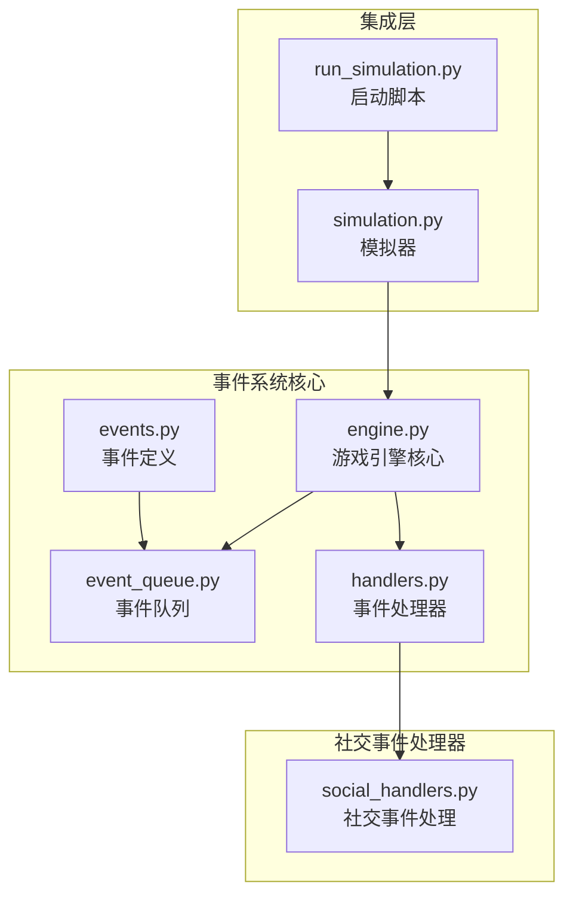
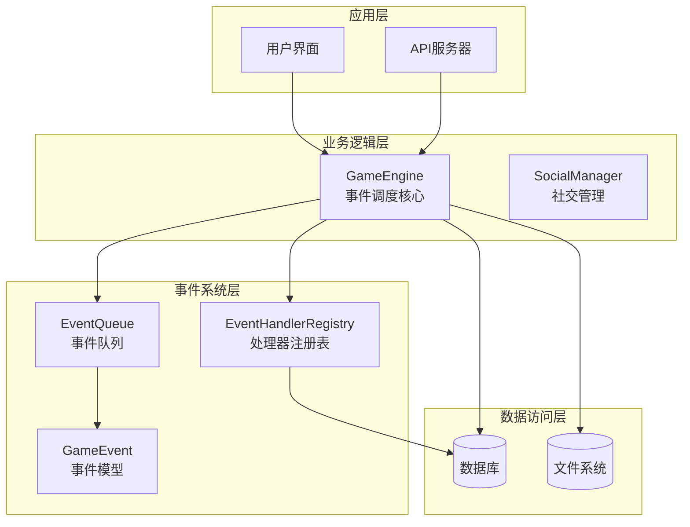
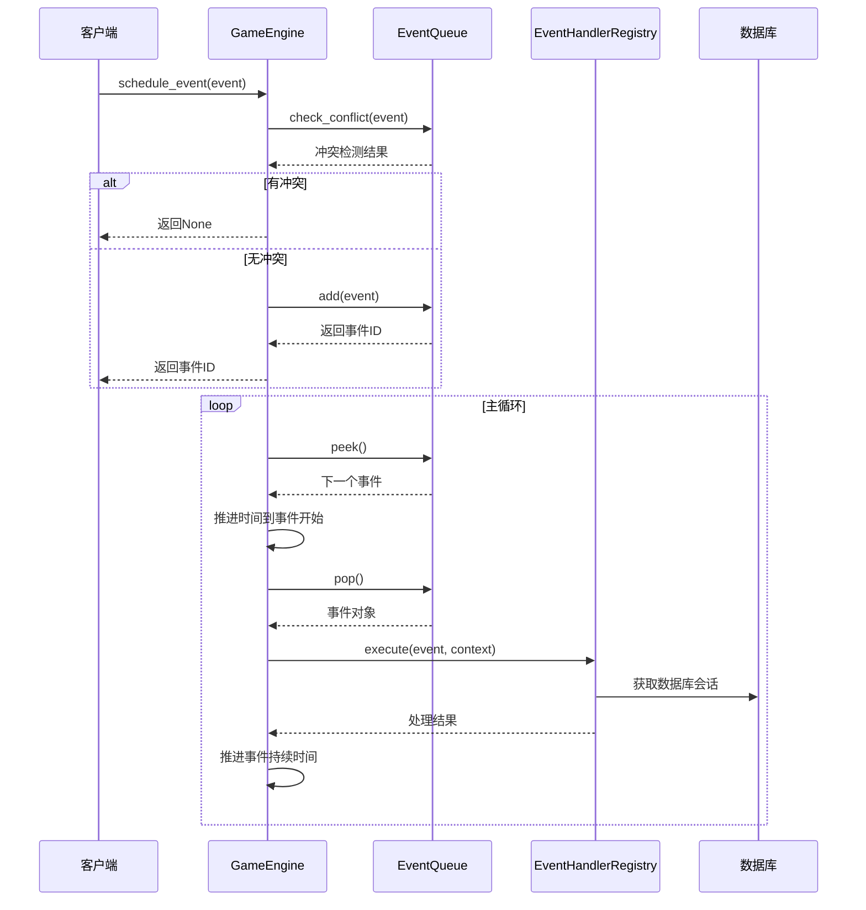
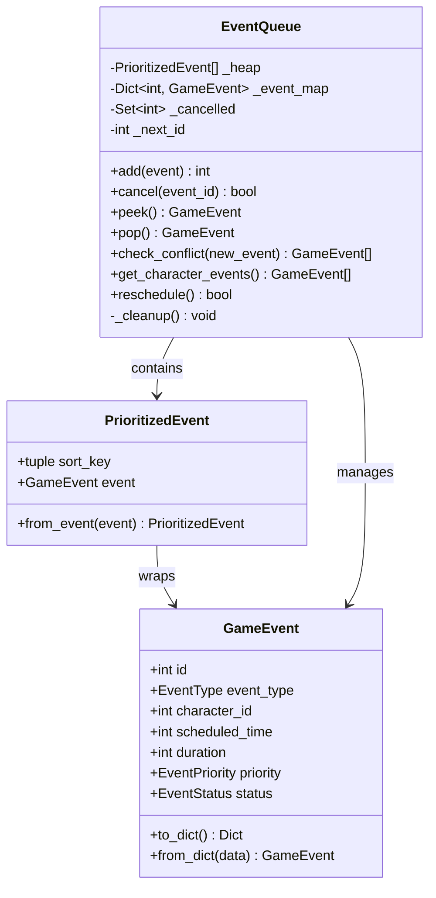
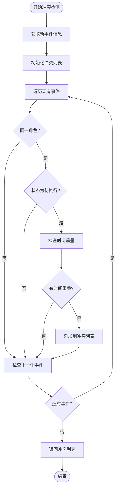
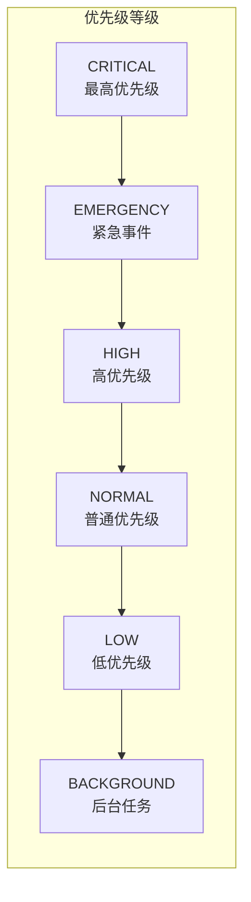
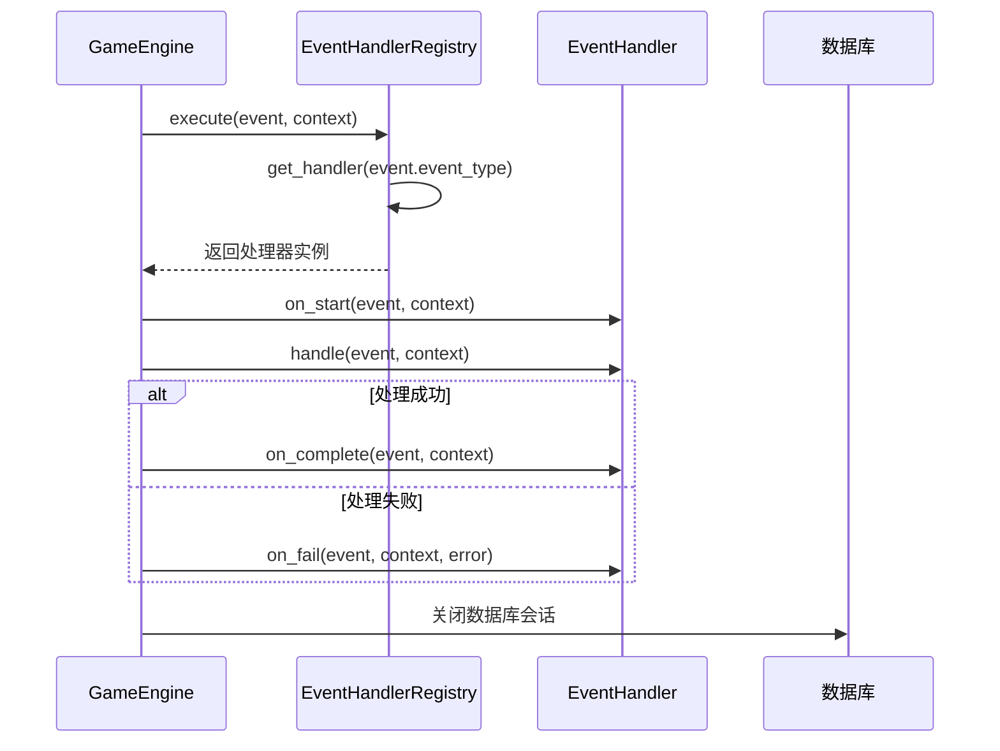
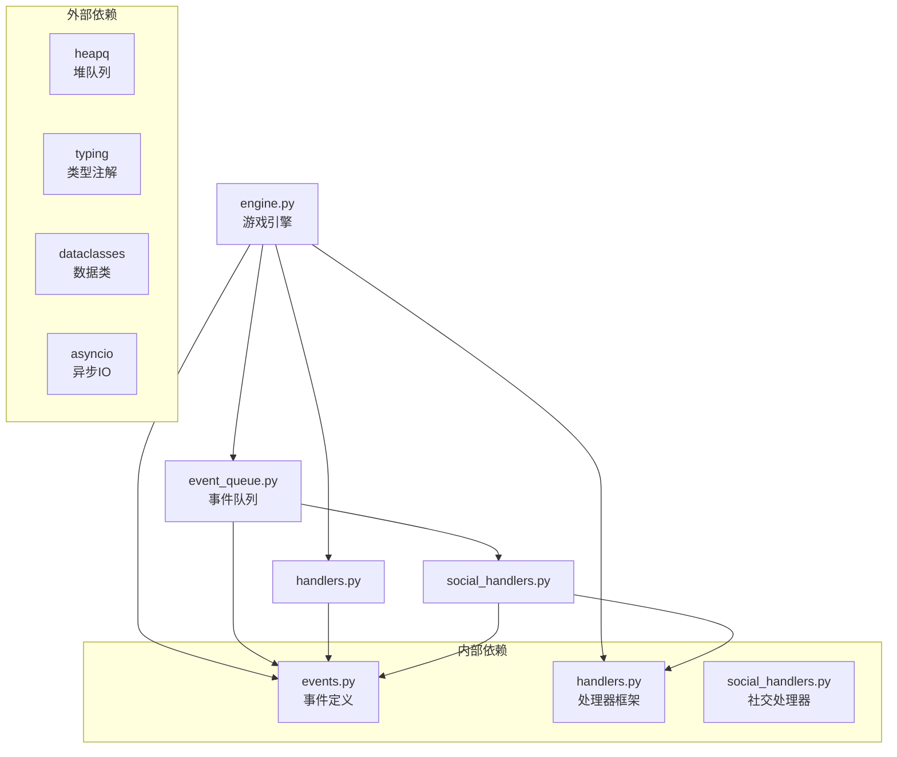

# 事件调度系统

<cite>
**本文档引用的文件**
- [engine.py](file://core_engine/engine.py)
- [events.py](file://core_engine/event_system/events.py)
- [event_queue.py](file://core_engine/event_system/event_queue.py)
- [handlers.py](file://core_engine/event_system/handlers.py)
- [social_handlers.py](file://core_engine/social/social_handlers.py)
- [simulation.py](file://core_engine/simulation.py)
- [run_simulation.py](file://run_simulation.py)
</cite>

## 目录
1. [简介](#简介)
2. [项目结构](#项目结构)
3. [核心组件](#核心组件)
4. [架构概览](#架构概览)
5. [详细组件分析](#详细组件分析)
6. [依赖分析](#依赖分析)
7. [性能考虑](#性能考虑)
8. [故障排除指南](#故障排除指南)
9. [结论](#结论)
10. [附录](#附录)

## 简介

事件调度系统是AI社区项目的核心基础设施，负责管理游戏中的各类事件调度、冲突检测和执行。该系统采用基于优先队列的事件调度机制，支持多种事件类型（个人事件、集体事件、突发事件），并提供了完整的事件生命周期管理。

系统的主要特点包括：
- 基于优先队列的高效事件调度
- 智能冲突检测和解决机制
- 支持事件取消和重新调度
- 完整的事件状态跟踪
- 可扩展的事件处理器架构

## 项目结构

事件调度系统位于`core_engine/event_system/`目录下，主要包含以下核心文件：



**图表来源**
- [engine.py](file://core_engine/engine.py#L167-L429)
- [events.py](file://core_engine/event_system/events.py#L1-L356)
- [event_queue.py](file://core_engine/event_system/event_queue.py#L1-L244)
- [handlers.py](file://core_engine/event_system/handlers.py#L1-L156)

**章节来源**
- [engine.py](file://core_engine/engine.py#L1-L429)
- [events.py](file://core_engine/event_system/events.py#L1-L356)
- [event_queue.py](file://core_engine/event_system/event_queue.py#L1-L244)
- [handlers.py](file://core_engine/event_system/handlers.py#L1-L156)

## 核心组件

事件调度系统由四个核心组件构成：

### 1. GameEngine（游戏引擎）
负责整体的事件调度协调，提供事件调度、取消、查询等接口。

### 2. EventQueue（事件队列）
基于优先队列的数据结构，实现高效的事件存储和检索。

### 3. GameEvent（事件模型）
定义事件的基本属性和行为，支持不同类型的事件。

### 4. EventHandlerRegistry（处理器注册表）
管理事件处理器的注册和执行。

**章节来源**
- [engine.py](file://core_engine/engine.py#L167-L429)
- [event_queue.py](file://core_engine/event_system/event_queue.py#L29-L244)
- [events.py](file://core_engine/event_system/events.py#L55-L129)
- [handlers.py](file://core_engine/event_system/handlers.py#L50-L156)

## 架构概览

事件调度系统采用分层架构设计，各层职责清晰分离：



**图表来源**
- [engine.py](file://core_engine/engine.py#L167-L429)
- [event_queue.py](file://core_engine/event_system/event_queue.py#L29-L244)
- [handlers.py](file://core_engine/event_system/handlers.py#L50-L156)

## 详细组件分析

### GameEngine 核心机制

GameEngine是事件调度系统的核心控制器，负责协调整个事件调度过程。

#### 事件调度流程



**图表来源**
- [engine.py](file://core_engine/engine.py#L211-L382)
- [event_queue.py](file://core_engine/event_system/event_queue.py#L73-L89)
- [handlers.py](file://core_engine/event_system/handlers.py#L99-L137)

#### 关键方法分析

**schedule_event方法**：
- 执行冲突检测
- 返回事件ID或None
- 错误处理和日志记录

**cancel_event方法**：
- 实现懒删除策略
- 标记事件为已取消
- 延迟从堆中移除

**get_character_schedule方法**：
- 查询角色特定时间段的事件
- 支持时间范围过滤
- 返回排序后的事件列表

**章节来源**
- [engine.py](file://core_engine/engine.py#L211-L238)

### EventQueue 优先队列实现

EventQueue基于Python的heapq模块实现，提供高效的事件存储和检索功能。

#### 数据结构设计



**图表来源**
- [event_queue.py](file://core_engine/event_system/event_queue.py#L29-L244)
- [events.py](file://core_engine/event_system/events.py#L55-L129)

#### 优先级调度算法

事件队列使用三元排序键：`(scheduled_time, priority.value, id(event))`

1. **时间优先**：首先按计划执行时间排序
2. **优先级次之**：时间相同时按优先级排序（数值越小优先级越高）
3. **ID保证稳定**：优先级和时间都相同时按事件ID排序

#### 冲突检测机制



**图表来源**
- [event_queue.py](file://core_engine/event_system/event_queue.py#L154-L178)

**章节来源**
- [event_queue.py](file://core_engine/event_system/event_queue.py#L13-L244)

### GameEvent 事件模型

GameEvent是所有事件的基础类，定义了事件的基本属性和行为。

#### 事件类型分类

系统支持三种主要的事件类型：

1. **个人事件**：角色独占的活动
   - WORK：工作
   - SLEEP：睡眠
   - TAKE_PHOTO：拍照
   - POST_CONTENT：发帖
   - USE_PHONE：看手机
   - MOVE：移动

2. **集体事件**：需要多个角色参与
   - OFFLINE_CHAT：线下群聊
   - ONLINE_GROUP_CHAT：网络群聊
   - ONLINE_PRIVATE_CHAT：网络私聊

3. **突发事件**：紧急或随机事件
   - ENCOUNTER：相遇
   - FATIGUE_WARNING：疲劳警告
   - VISUAL_EVENT：视觉事件
   - AUDIO_EVENT：声音事件

#### 事件优先级体系



**图表来源**
- [events.py](file://core_engine/event_system/events.py#L36-L43)

**章节来源**
- [events.py](file://core_engine/event_system/events.py#L13-L356)

### EventHandlerRegistry 处理器架构

EventHandlerRegistry实现了事件处理器的注册和管理机制。

#### 处理器生命周期



**图表来源**
- [handlers.py](file://core_engine/event_system/handlers.py#L99-L137)

#### 装饰器注册机制

系统提供了便捷的装饰器来注册事件处理器：

```python
@event_handler(EventType.WORK)
class WorkHandler(EventHandler):
    async def handle(self, event, context):
        # 处理工作事件
        pass
```

**章节来源**
- [handlers.py](file://core_engine/event_system/handlers.py#L50-L156)

### 社交事件处理器

社交事件处理器展示了如何扩展事件系统来处理复杂的社交场景。

#### 处理器类型

1. **UsePhoneHandler**：处理看手机事件
2. **PostContentHandler**：处理发帖事件  
3. **OnlinePrivateChatHandler**：处理私聊事件
4. **EncounterHandler**：处理相遇事件

#### 处理流程

每个处理器都遵循统一的模式：
- 验证上下文中的Agent实例
- 获取相应的调度器实例
- 执行具体的操作逻辑
- 更新事件数据和角色状态

**章节来源**
- [social_handlers.py](file://core_engine/social/social_handlers.py#L1-L253)

## 依赖分析

事件调度系统的依赖关系相对简单，主要依赖于标准库和核心的事件系统模块。



**图表来源**
- [engine.py](file://core_engine/engine.py#L7-L16)
- [event_queue.py](file://core_engine/event_system/event_queue.py#L7-L10)
- [handlers.py](file://core_engine/event_system/handlers.py#L7-L9)

**章节来源**
- [engine.py](file://core_engine/engine.py#L1-L16)
- [event_queue.py](file://core_engine/event_system/event_queue.py#L1-L10)
- [handlers.py](file://core_engine/event_system/handlers.py#L1-L9)

## 性能考虑

### 时间复杂度分析

1. **事件添加**：O(log n) - 堆插入操作
2. **事件取消**：O(1) - 懒删除标记
3. **冲突检测**：O(n) - 遍历现有事件
4. **事件执行**：O(log n) - 堆弹出操作
5. **角色日程查询**：O(n log n) - 需要排序

### 内存管理策略

1. **懒删除机制**：取消的事件不会立即从内存中移除
2. **清理策略**：在访问队列时进行批量清理
3. **事件ID重用**：使用单调递增的ID避免ID冲突
4. **上下文管理**：确保数据库会话正确关闭

### 优化建议

1. **批量操作**：对于大量事件操作，考虑批量处理以减少开销
2. **缓存机制**：对频繁查询的结果进行缓存
3. **并发处理**：利用异步特性提高并发处理能力
4. **内存监控**：定期监控内存使用情况，及时清理无效数据

## 故障排除指南

### 常见问题及解决方案

#### 1. 事件调度失败
**症状**：`schedule_event`返回None
**原因**：事件与现有事件发生冲突
**解决方案**：
- 检查冲突事件列表
- 调整事件时间或优先级
- 使用`reschedule`重新调度

#### 2. 事件处理器未找到
**症状**：事件执行返回False并打印警告
**原因**：对应的处理器未注册
**解决方案**：
- 确保处理器使用`@event_handler`装饰器注册
- 检查处理器模块是否被正确导入

#### 3. 内存泄漏问题
**症状**：事件队列占用内存持续增长
**原因**：取消的事件未被及时清理
**解决方案**：
- 定期调用队列的清理方法
- 检查懒删除机制是否正常工作

#### 4. 异步操作阻塞
**症状**：事件处理过程中出现阻塞
**原因**：处理器中使用了同步阻塞操作
**解决方案**：
- 确保所有操作都是异步的
- 使用适当的超时机制

**章节来源**
- [engine.py](file://core_engine/engine.py#L221-L224)
- [handlers.py](file://core_engine/event_system/handlers.py#L110-L113)

## 结论

事件调度系统是一个设计精良、功能完整的事件管理系统。其核心优势包括：

1. **高效性**：基于优先队列的事件调度，时间复杂度优秀
2. **可靠性**：完善的冲突检测和错误处理机制
3. **可扩展性**：灵活的处理器注册和扩展机制
4. **易用性**：简洁的API设计和丰富的示例

系统在AI社区项目中发挥着关键作用，为角色行为、社交互动和环境变化提供了强大的支撑。通过合理的架构设计和性能优化，该系统能够满足复杂场景下的事件调度需求。

## 附录

### 使用示例

#### 调度不同类型事件

```python
# 创建并调度工作事件
work_event = PersonalEvent.create_work(
    character_id=1,
    scheduled_time=100,
    duration=120,
    work_type="编程"
)
event_id = engine.schedule_event(work_event)

# 创建并调度发帖事件
post_event = PersonalEvent.create_post_content(
    character_id=1,
    scheduled_time=200,
    content="今天天气真好",
    image_id=None
)
event_id = engine.schedule_event(post_event)

# 创建并调度私聊事件
chat_event = CollectiveEvent.create_online_private_chat(
    sender_id=1,
    receiver_id=2,
    scheduled_time=300,
    duration=15
)
event_id = engine.schedule_event(chat_event)
```

#### 处理调度失败

```python
# 检查事件是否可以调度
if not engine.event_queue.can_schedule(event):
    conflicts = engine.event_queue.check_conflict(event)
    print(f"事件调度失败，冲突事件: {conflicts}")

# 重新调度事件
if not engine.event_queue.reschedule(existing_event_id, new_time):
    print("重新调度失败，时间冲突")
```

#### 查询角色日程安排

```python
# 获取角色未来24小时的日程
start_time = engine.game_time.total_minutes
end_time = start_time + 1440  # 24小时
schedule = engine.get_character_schedule(1, start_time, end_time)

for event in schedule:
    print(f"事件: {event.event_type.value}, "
          f"时间: {event.scheduled_time}, "
          f"持续: {event.duration}分钟")
```

### API参考

#### GameEngine 方法

| 方法 | 参数 | 返回值 | 描述 |
|------|------|--------|------|
| `schedule_event` | `event: GameEvent` | `Optional[int]` | 调度事件，返回事件ID或None |
| `cancel_event` | `event_id: int` | `bool` | 取消事件，返回是否成功 |
| `get_character_schedule` | `character_id, start_time, end_time` | `List[GameEvent]` | 获取角色日程安排 |
| `start` | 无 | `None` | 启动引擎 |
| `stop` | 无 | `None` | 停止引擎 |
| `pause` | 无 | `None` | 暂停引擎 |
| `resume` | 无 | `None` | 恢复引擎 |

#### EventQueue 方法

| 方法 | 参数 | 返回值 | 描述 |
|------|------|--------|------|
| `add` | `event: GameEvent` | `int` | 添加事件到队列 |
| `cancel` | `event_id: int` | `bool` | 取消事件 |
| `peek` | 无 | `Optional[GameEvent]` | 查看队首事件 |
| `pop` | 无 | `Optional[GameEvent]` | 取出队首事件 |
| `check_conflict` | `new_event: GameEvent` | `List[GameEvent]` | 检查冲突 |
| `get_character_events` | `character_id, start_time, end_time` | `List[GameEvent]` | 获取角色事件 |
| `reschedule` | `event_id, new_time` | `bool` | 重新调度事件 |