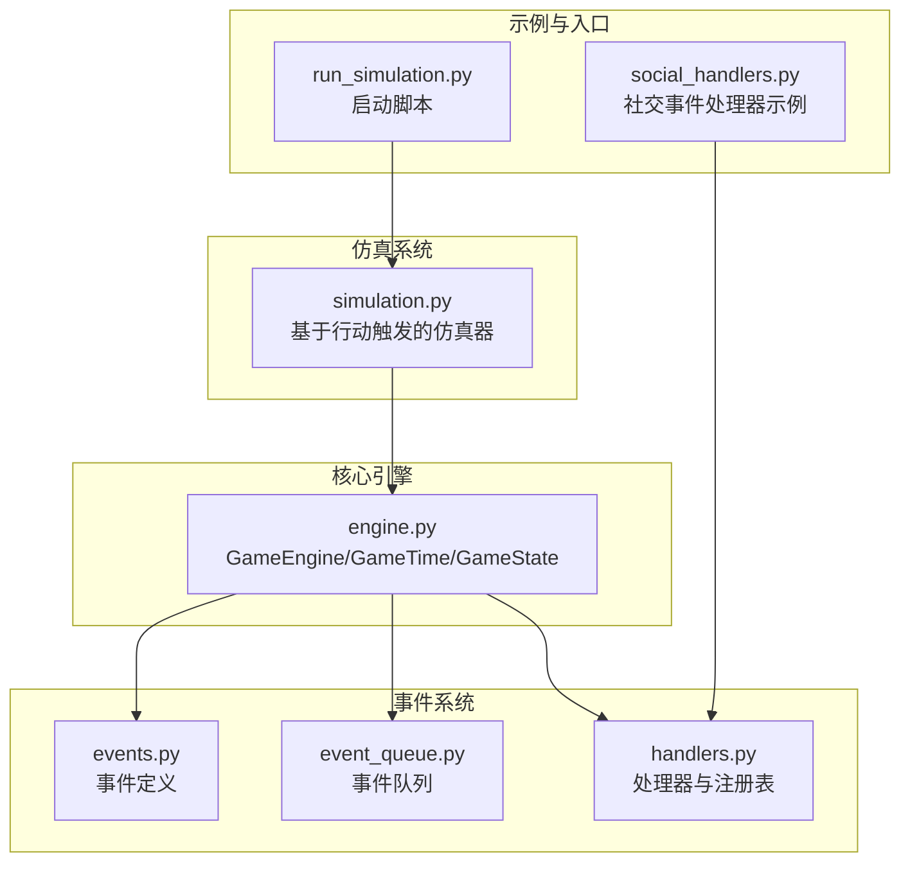
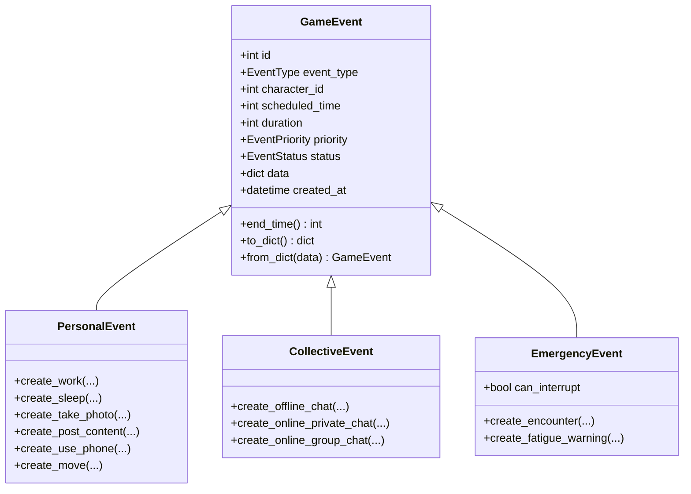
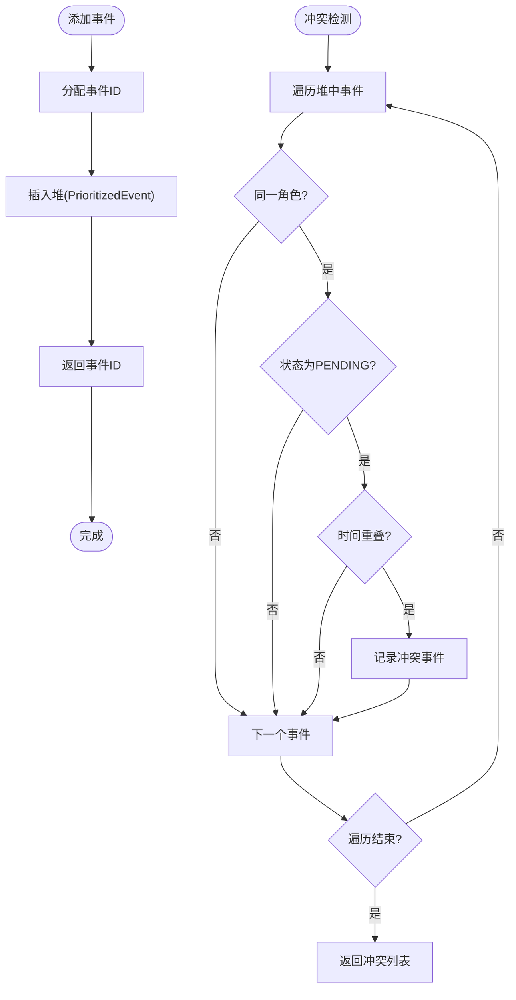
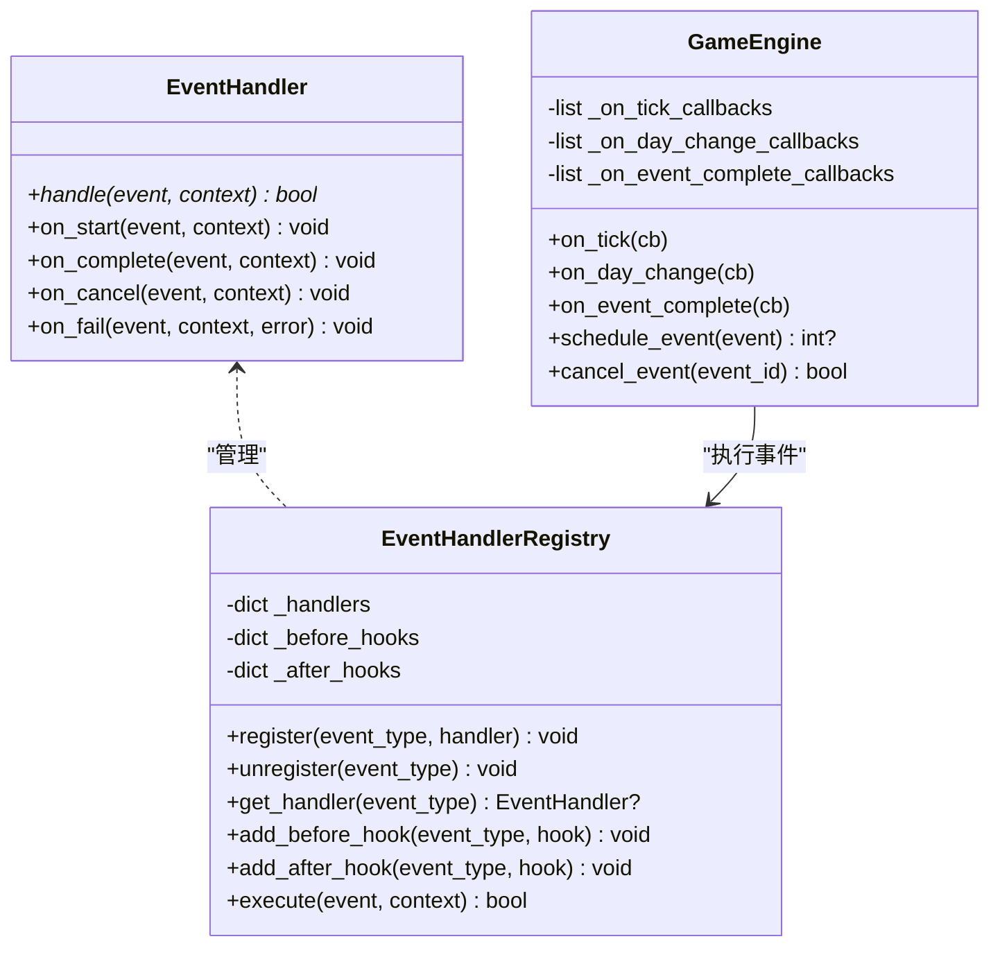
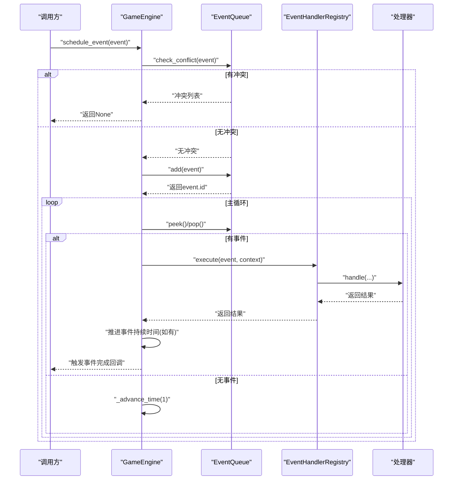
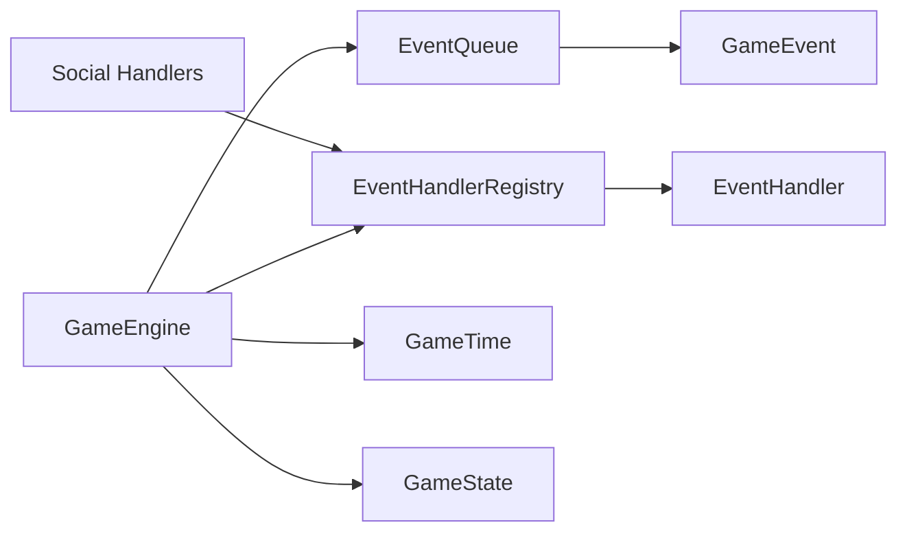

# 事件驱动引擎

<cite>
**本文引用的文件**
- [core_engine/engine.py](file://core_engine/engine.py)
- [core_engine/event_system/events.py](file://core_engine/event_system/events.py)
- [core_engine/event_system/event_queue.py](file://core_engine/event_system/event_queue.py)
- [core_engine/event_system/handlers.py](file://core_engine/event_system/handlers.py)
- [core_engine/simulation.py](file://core_engine/simulation.py)
- [core_engine/social/social_handlers.py](file://core_engine/social/social_handlers.py)
- [run_simulation.py](file://run_simulation.py)
- [README.md](file://README.md)
</cite>

## 目录
1. [简介](#简介)
2. [项目结构](#项目结构)
3. [核心组件](#核心组件)
4. [架构总览](#架构总览)
5. [详细组件分析](#详细组件分析)
6. [依赖关系分析](#依赖关系分析)
7. [性能考量](#性能考量)
8. [故障排查指南](#故障排查指南)
9. [结论](#结论)
10. [附录](#附录)

## 简介
本文件面向事件驱动引擎的使用者与维护者，系统性阐述核心架构与关键机制，包括时间管理系统（GameTime 类）、事件队列（EventQueue）的优先级调度算法、事件处理器注册机制；并详细描述事件的生命周期：从创建、调度、冲突检测到执行的完整流程。同时解释引擎的状态管理（EngineState 枚举）、暂停/恢复机制、回调系统设计，并提供可直接定位到源码的示例路径，帮助快速上手与扩展。

## 项目结构
事件驱动引擎位于 core_engine/event_system 子模块，配合核心引擎（GameEngine）与仿真系统（GameSimulation）共同构成完整的模拟体系。主要文件职责如下：
- core_engine/engine.py：核心引擎 GameEngine、时间管理 GameTime、状态管理 GameState、事件调度与执行、回调系统
- core_engine/event_system/events.py：事件类型、优先级、状态、基础事件与派生事件（个人、集体、紧急）
- core_engine/event_system/event_queue.py：基于堆的优先队列、冲突检测、懒删除策略
- core_engine/event_system/handlers.py：处理器抽象、注册表、前后置钩子、装饰器
- core_engine/simulation.py：基于行动结束触发的仿真器，与事件驱动引擎协同
- core_engine/social/social_handlers.py：社交相关事件处理器示例（使用装饰器注册）
- run_simulation.py：启动脚本与交互式演示



图表来源
- [core_engine/engine.py](file://core_engine/engine.py#L167-L429)
- [core_engine/event_system/event_queue.py](file://core_engine/event_system/event_queue.py#L29-L244)
- [core_engine/event_system/handlers.py](file://core_engine/event_system/handlers.py#L50-L156)
- [core_engine/event_system/events.py](file://core_engine/event_system/events.py#L55-L356)
- [core_engine/simulation.py](file://core_engine/simulation.py#L64-L529)
- [core_engine/social/social_handlers.py](file://core_engine/social/social_handlers.py#L18-L253)
- [run_simulation.py](file://run_simulation.py#L1-L258)

章节来源
- [README.md](file://README.md#L1-L290)

## 核心组件
- 时间管理 GameTime：以分钟为最小单位，提供天/时/分换算、时段判断、推进时间、到指定时刻剩余分钟等能力
- 事件模型 GameEvent：统一事件接口，包含类型、角色、计划时间、持续时间、优先级、状态、数据等
- 事件队列 EventQueue：基于堆的优先队列，支持冲突检测、懒删除、按角色筛选、批量获取等
- 处理器与注册表 EventHandler/EventHandlerRegistry：抽象处理器、注册/注销、前后置钩子、装饰器
- 核心引擎 GameEngine：主循环、暂停/恢复、回调、状态持久化、事件调度与执行
- 仿真系统 GameSimulation：基于行动结束触发的仿真器，与事件驱动引擎协同

章节来源
- [core_engine/engine.py](file://core_engine/engine.py#L19-L165)
- [core_engine/event_system/events.py](file://core_engine/event_system/events.py#L13-L129)
- [core_engine/event_system/event_queue.py](file://core_engine/event_system/event_queue.py#L29-L244)
- [core_engine/event_system/handlers.py](file://core_engine/event_system/handlers.py#L12-L156)
- [core_engine/simulation.py](file://core_engine/simulation.py#L64-L529)

## 架构总览
事件驱动引擎采用“时间推进 + 事件调度 + 处理器执行”的闭环：
- GameEngine 主循环等待暂停信号，推进时间或取出队首事件
- 事件执行通过 EventHandlerRegistry 分发到对应处理器
- 处理器在执行前后触发钩子，更新事件状态
- 事件完成后可推进持续时间，触发回调

```mermaid
sequenceDiagram
participant Loop as "主循环(_main_loop)"
participant Queue as "事件队列(EventQueue)"
participant Reg as "处理器注册表(EventHandlerRegistry)"
participant H as "具体处理器(EventHandler)"
participant CB as "回调(on_tick/on_day_change/on_event_complete)"
Loop->>Queue : "peek()/pop()"
alt 队列为空
Loop->>Loop : "_advance_time(1)"
Loop->>CB : "触发每分钟回调"
else 存在事件
Loop->>Loop : "_advance_time(到事件开始)"
Loop->>Reg : "execute(event, context)"
Reg->>H : "on_start() -> handle() -> on_complete/fail()"
H-->>Reg : "返回成功/失败"
Reg-->>Loop : "返回结果"
Loop->>Loop : "若事件有持续时间则推进"
Loop->>CB : "触发事件完成回调"
end
```

图表来源
- [core_engine/engine.py](file://core_engine/engine.py#L288-L382)
- [core_engine/event_system/handlers.py](file://core_engine/event_system/handlers.py#L99-L137)

## 详细组件分析

### 时间管理系统（GameTime）
- 设计要点
  - 以总分钟数表示时间，便于统一比较与计算
  - 提供 day/hour/minute/time_of_day/is_daytime 属性
  - 支持 advance/set_to_day_start/minutes_until 等实用方法
  - 支持序列化/反序列化 to_dict/from_dict/from_hm
- 复杂度
  - 访问属性为 O(1)，推进时间 O(n)（逐分钟推进）
- 使用建议
  - 在事件调度时统一使用 total_minutes 作为时间基准
  - 长时间推进建议批量推进而非逐分钟推进

章节来源
- [core_engine/engine.py](file://core_engine/engine.py#L26-L110)

### 事件模型与生命周期
- 事件类型与优先级
  - EventType：个人事件（工作、等待、睡眠、拍照、发帖、看手机、移动）、集体事件（线下群聊、网络群聊、网络私聊）、突发事件（相遇、疲劳警告、视觉/声音事件）
  - EventPriority：CRITICAL、EMERGENCY、HIGH、NORMAL、LOW、BACKGROUND（数值越小优先级越高）
  - EventStatus：PENDING、IN_PROGRESS、COMPLETED、CANCELLED、FAILED
- 事件基类与派生
  - GameEvent：统一字段与比较运算符（按 scheduled_time 优先，再按 priority）
  - PersonalEvent/CollectiveEvent/EmergencyEvent：提供便捷构造方法
- 生命周期
  - 创建：构造事件（含类型、角色、计划时间、持续时间、优先级、数据）
  - 调度：EventQueue.add()，冲突检测 check_conflict()
  - 执行：GameEngine.schedule_event() -> _execute_event() -> Registry.execute()
  - 完成/失败：处理器 on_complete/on_fail 更新状态
  - 回收：懒删除策略，清理已取消事件



图表来源
- [core_engine/event_system/events.py](file://core_engine/event_system/events.py#L55-L356)

章节来源
- [core_engine/event_system/events.py](file://core_engine/event_system/events.py#L13-L356)

### 事件队列与优先级调度算法
- 数据结构
  - 堆：PrioritizedEvent 包装 GameEvent，排序键为 (scheduled_time, priority.value, id)
  - 映射：_event_map 保存 id->event，_cancelled 懒删除集合
- 关键操作
  - add：分配 id，插入堆，返回 id
  - cancel：标记状态为 CANCELLED，加入 _cancelled
  - peek/pop：清理后取堆顶事件
  - get_next_events/get_events_in_range/get_character_events：范围查询与筛选
  - check_conflict：按角色与时间段重叠检测冲突
  - reschedule：重新安排时间并进行冲突校验
  - _cleanup：惰性清理已取消事件
- 复杂度
  - add/peek/pop/cancel：O(log n)
  - check_conflict：O(n)
  - get_character_events：O(n log n)（排序）



图表来源
- [core_engine/event_system/event_queue.py](file://core_engine/event_system/event_queue.py#L46-L214)

章节来源
- [core_engine/event_system/event_queue.py](file://core_engine/event_system/event_queue.py#L29-L244)

### 事件处理器注册机制与回调系统
- 处理器抽象
  - EventHandler：定义 handle/on_start/on_complete/on_cancel/on_fail
- 注册表
  - EventHandlerRegistry：单例，维护 event_type -> handler 映射
  - 支持注册/注销、获取处理器、添加前后置钩子
  - execute：执行前置钩子 -> on_start -> handle -> on_complete/fail -> 后置钩子
- 装饰器
  - @event_handler(EventType.XXX)：自动注册处理器实例
- 回调系统（GameEngine）
  - on_tick/on_day_change/on_event_complete：每分钟推进、日期变更、事件完成时触发
  - _advance_time：逐分钟推进并触发回调



图表来源
- [core_engine/event_system/handlers.py](file://core_engine/event_system/handlers.py#L12-L156)
- [core_engine/engine.py](file://core_engine/engine.py#L178-L287)

章节来源
- [core_engine/event_system/handlers.py](file://core_engine/event_system/handlers.py#L12-L156)
- [core_engine/engine.py](file://core_engine/engine.py#L178-L287)

### 事件生命周期：从创建到执行
- 创建与调度
  - 使用 PersonalEvent/CollectiveEvent/EmergencyEvent 的便捷构造方法
  - 通过 GameEngine.schedule_event() 调度，内部先做冲突检测
- 执行阶段
  - GameEngine._execute_event() 构造上下文（engine、game_time、state、db），调用 Registry.execute()
  - 处理器 on_start -> handle -> on_complete/fail
  - 成功后推进事件持续时间，触发事件完成回调
- 状态管理
  - EngineState：STOPPED/RUNNING/PAUSED
  - 通过 GameEngine.start/pause/resume 控制运行状态



图表来源
- [core_engine/engine.py](file://core_engine/engine.py#L211-L382)
- [core_engine/event_system/event_queue.py](file://core_engine/event_system/event_queue.py#L73-L116)
- [core_engine/event_system/handlers.py](file://core_engine/event_system/handlers.py#L99-L137)

章节来源
- [core_engine/engine.py](file://core_engine/engine.py#L211-L382)
- [core_engine/event_system/event_queue.py](file://core_engine/event_system/event_queue.py#L154-L214)
- [core_engine/event_system/handlers.py](file://core_engine/event_system/handlers.py#L99-L137)

### 示例：创建自定义事件、注册处理器、处理冲突
- 创建自定义事件
  - 使用派生类的便捷构造方法，例如：[PersonalEvent.create_use_phone](file://core_engine/event_system/events.py#L202-L221)
  - 或直接构造 GameEvent 并设置 data 字段：[GameEvent.__init__](file://core_engine/event_system/events.py#L55-L80)
- 注册事件处理器
  - 使用装饰器自动注册：[@event_handler(EventType.USE_PHONE)](file://core_engine/social/social_handlers.py#L18-L27)
  - 或手动注册：[EventHandlerRegistry.register](file://core_engine/event_system/handlers.py#L72-L74)
- 处理事件冲突
  - 调度前检测：[GameEngine.schedule_event](file://core_engine/engine.py#L211-L226)
  - 队列冲突检测：[EventQueue.check_conflict](file://core_engine/event_system/event_queue.py#L154-L178)
  - 重新调度并校验：[EventQueue.reschedule](file://core_engine/event_system/event_queue.py#L184-L213)
- 触发回调
  - 注册回调：[GameEngine.on_tick/on_day_change/on_event_complete](file://core_engine/engine.py#L276-L286)
  - 推进时间触发：[GameEngine._advance_time](file://core_engine/engine.py#L320-L342)

章节来源
- [core_engine/event_system/events.py](file://core_engine/event_system/events.py#L131-L240)
- [core_engine/social/social_handlers.py](file://core_engine/social/social_handlers.py#L18-L70)
- [core_engine/event_system/handlers.py](file://core_engine/event_system/handlers.py#L72-L74)
- [core_engine/event_system/event_queue.py](file://core_engine/event_system/event_queue.py#L154-L213)
- [core_engine/engine.py](file://core_engine/engine.py#L211-L286)

## 依赖关系分析
- 组件耦合
  - GameEngine 依赖 EventQueue、EventHandlerRegistry、GameTime、GameState
  - EventQueue 依赖 GameEvent
  - EventHandlerRegistry 依赖 EventHandler 与 GameEvent
  - 社交处理器依赖注册表与社交调度器
- 外部依赖
  - asyncio：异步事件循环与暂停控制
  - dataclasses/typing/json：数据结构与序列化
- 潜在环路
  - 当前模块间无直接循环依赖，处理器通过注册表解耦



图表来源
- [core_engine/engine.py](file://core_engine/engine.py#L14-L18)
- [core_engine/event_system/event_queue.py](file://core_engine/event_system/event_queue.py#L10-L11)
- [core_engine/event_system/handlers.py](file://core_engine/event_system/handlers.py#L9-L10)
- [core_engine/social/social_handlers.py](file://core_engine/social/social_handlers.py#L13-L15)

章节来源
- [core_engine/engine.py](file://core_engine/engine.py#L14-L18)
- [core_engine/event_system/event_queue.py](file://core_engine/event_system/event_queue.py#L10-L11)
- [core_engine/event_system/handlers.py](file://core_engine/event_system/handlers.py#L9-L10)
- [core_engine/social/social_handlers.py](file://core_engine/social/social_handlers.py#L13-L15)

## 性能考量
- 优先队列选择
  - 堆结构保证 add/peek/pop 为 O(log n)，冲突检测 check_conflict 为 O(n)
- 懒删除策略
  - _cancelled 集合避免频繁重建堆，提升 cancel 性能
- 时间推进
  - _advance_time 逐分钟触发回调，建议在高频 tick 场景减少回调数量
- 事件并发
  - 处理器 handle 为异步，注意避免阻塞；必要时拆分任务
- 序列化与持久化
  - GameState/EventQueue 的保存/加载为 JSON，注意大事件集的 IO 压力

章节来源
- [core_engine/event_system/event_queue.py](file://core_engine/event_system/event_queue.py#L215-L225)
- [core_engine/engine.py](file://core_engine/engine.py#L320-L342)

## 故障排查指南
- 事件未执行
  - 检查是否被冲突检测拦截：[EventQueue.check_conflict](file://core_engine/event_system/event_queue.py#L154-L178)
  - 检查处理器是否注册：[EventHandlerRegistry.get_handler](file://core_engine/event_system/handlers.py#L81-L83)
- 处理器异常
  - Registry.execute 捕获异常并标记为 FAILED：[handlers.execute](file://core_engine/event_system/handlers.py#L129-L131)
- 引擎无法暂停/恢复
  - 确认 _pause_event 状态与 state 字段同步：[GameEngine.pause/resume](file://core_engine/engine.py#L260-L274)
- 回调报错
  - 回调内部异常被捕获并打印，不影响主流程：[GameEngine._advance_time](file://core_engine/engine.py#L328-L341)

章节来源
- [core_engine/event_system/handlers.py](file://core_engine/event_system/handlers.py#L129-L131)
- [core_engine/engine.py](file://core_engine/engine.py#L260-L274)
- [core_engine/engine.py](file://core_engine/engine.py#L328-L341)

## 结论
事件驱动引擎通过清晰的事件模型、稳定的优先队列调度与灵活的处理器注册机制，实现了可扩展、可观测、可维护的模拟系统。结合 GameSimulation 的行动结束触发模式，形成“时间推进 + 事件调度 + 处理器执行”的高效闭环。建议在实际应用中：
- 使用装饰器统一注册处理器，保持一致性
- 在调度前进行冲突检测，避免资源竞争
- 合理设置回调频率，避免过度 I/O
- 对长时间推进场景考虑批量推进策略

## 附录
- 启动与演示
  - 交互式启动：[run_simulation.py](file://run_simulation.py#L54-L186)
  - 步进模式：[run_simulation.py](file://run_simulation.py#L188-L233)
- 仿真系统原理
  - 基于行动结束触发的模拟器，自动时间跳跃与角色状态管理：[simulation.py](file://core_engine/simulation.py#L64-L529)

章节来源
- [run_simulation.py](file://run_simulation.py#L54-L233)
- [core_engine/simulation.py](file://core_engine/simulation.py#L64-L529)