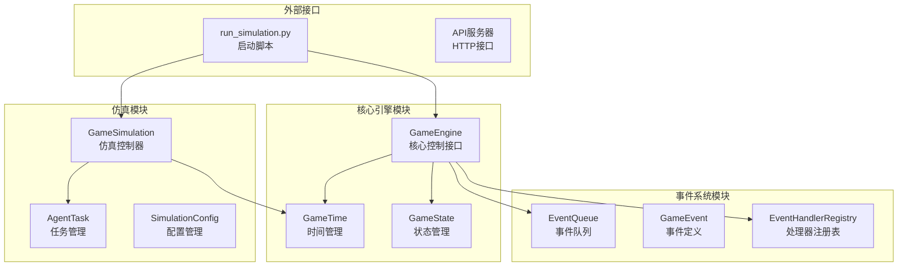
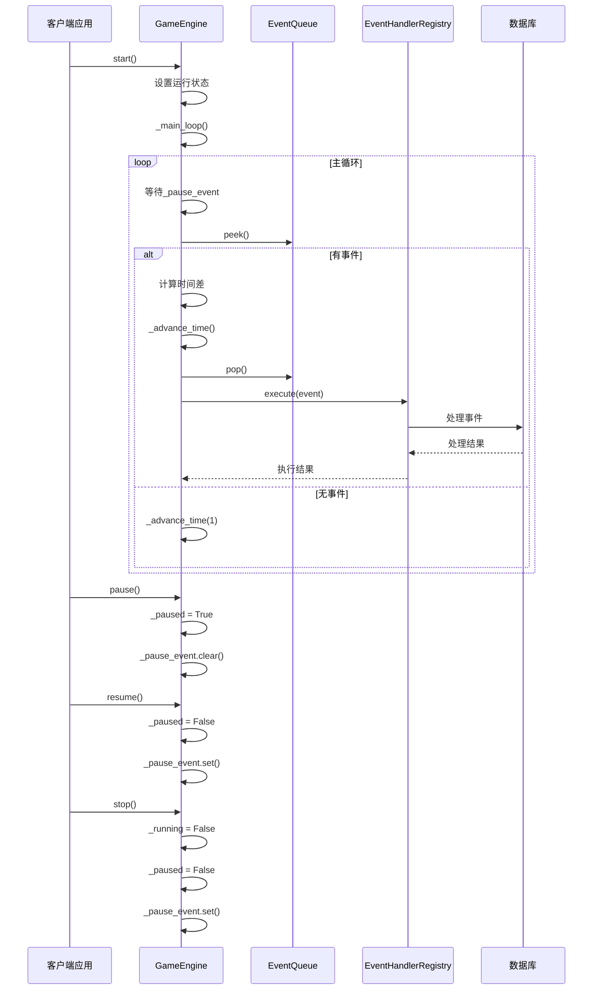
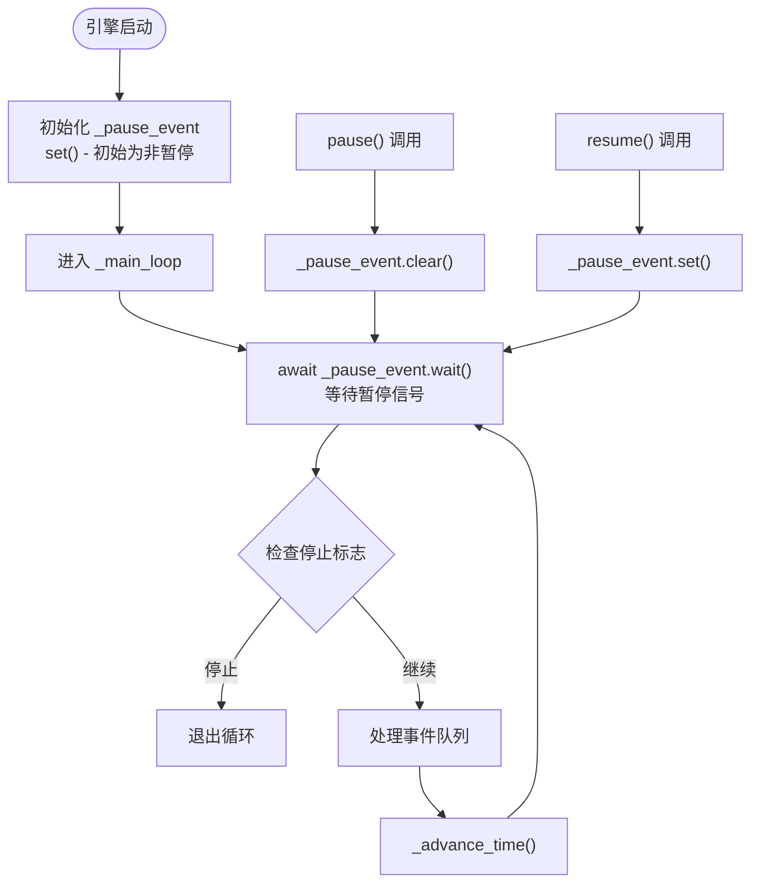
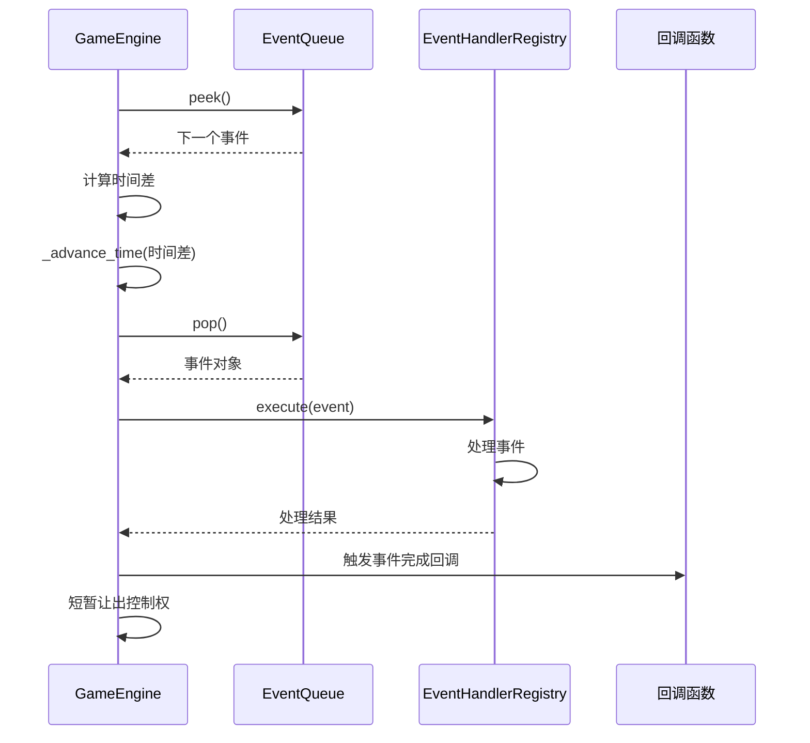
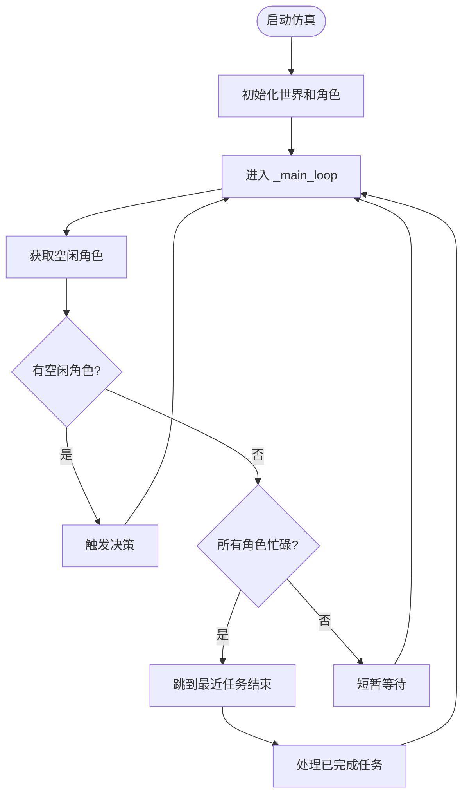
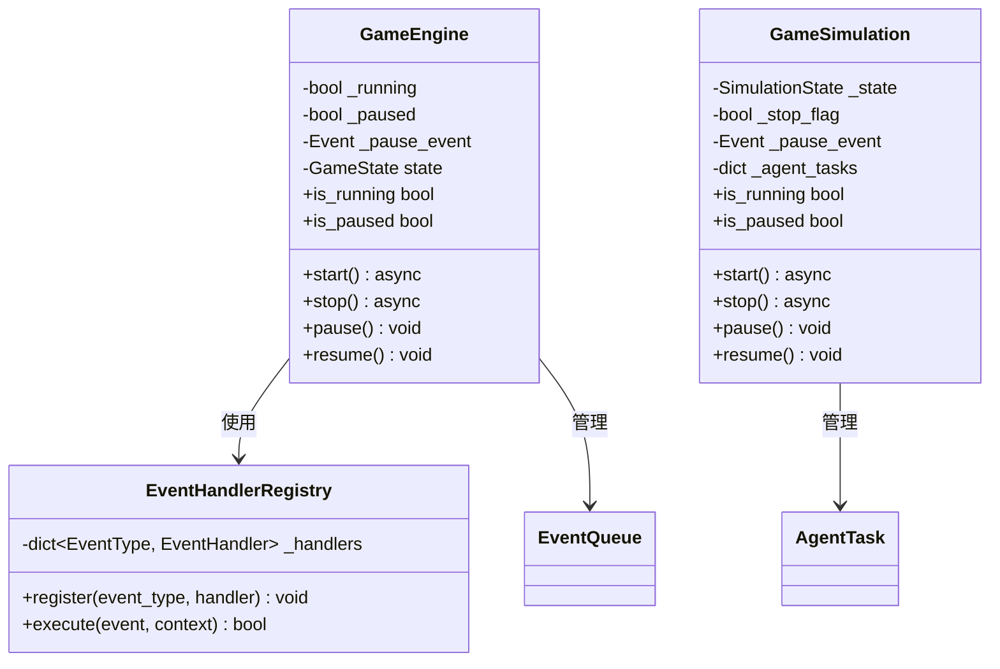
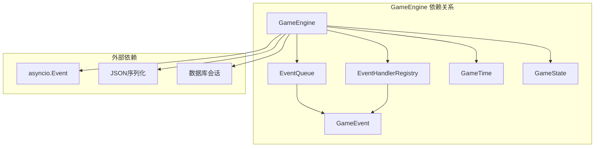
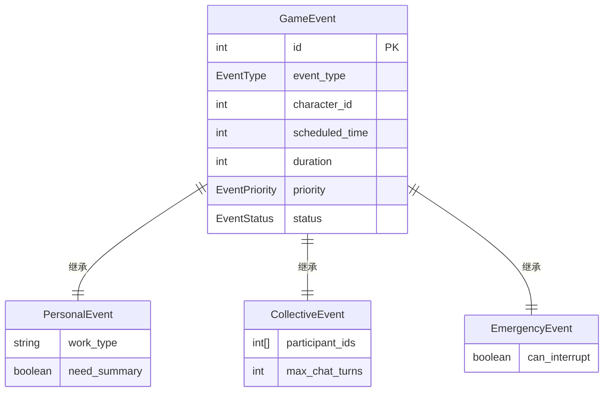

# 引擎控制接口

<cite>
**本文档引用的文件**
- [engine.py](file://core_engine/engine.py)
- [simulation.py](file://core_engine/simulation.py)
- [events.py](file://core_engine/event_system/events.py)
- [event_queue.py](file://core_engine/event_system/event_queue.py)
- [handlers.py](file://core_engine/event_system/handlers.py)
- [run_simulation.py](file://run_simulation.py)
</cite>

## 目录
1. [简介](#简介)
2. [项目结构](#项目结构)
3. [核心组件](#核心组件)
4. [架构概览](#架构概览)
5. [详细组件分析](#详细组件分析)
6. [依赖关系分析](#依赖关系分析)
7. [性能考虑](#性能考虑)
8. [故障排除指南](#故障排除指南)
9. [结论](#结论)

## 简介

本文档详细介绍了AI社区项目的引擎控制接口，重点分析GameEngine提供的核心控制方法：start、stop、pause、resume等。该系统采用异步编程模型，通过事件驱动的方式管理游戏时间推进和事件调度。文档深入解释了异步控制机制、暂停事件（_pause_event）的使用、运行状态检查（is_running、is_paused）等关键功能，并提供了线程安全性和并发控制策略的分析。

## 项目结构

该项目采用模块化的架构设计，主要包含以下核心模块：



**图表来源**
- [engine.py](file://core_engine/engine.py#L167-L429)
- [simulation.py](file://core_engine/simulation.py#L64-L529)

**章节来源**
- [engine.py](file://core_engine/engine.py#L1-L429)
- [simulation.py](file://core_engine/simulation.py#L1-L529)

## 核心组件

### GameEngine - 核心控制引擎

GameEngine是整个系统的核心控制组件，负责管理游戏时间、事件调度和整体运行状态。其核心特性包括：

- **异步控制机制**：基于asyncio.Event实现非阻塞的暂停/恢复控制
- **状态管理**：维护引擎的运行状态（RUNNING、PAUSED、STOPPED）
- **事件调度**：通过优先队列管理事件的执行顺序
- **回调机制**：支持多种类型的回调函数注册

### GameSimulation - 仿真控制引擎

GameSimulation专注于角色行为仿真，采用基于行动触发的模拟方式：

- **行动驱动**：角色空闲时触发AI决策，所有角色忙碌时自动跳过时间
- **任务管理系统**：使用堆结构管理角色的行动任务
- **时间跳跃机制**：智能地跳过未参与行动的时间段

**章节来源**
- [engine.py](file://core_engine/engine.py#L167-L429)
- [simulation.py](file://core_engine/simulation.py#L64-L529)

## 架构概览

系统采用分层架构设计，各层职责明确：



**图表来源**
- [engine.py](file://core_engine/engine.py#L240-L318)
- [handlers.py](file://core_engine/event_system/handlers.py#L99-L137)

## 详细组件分析

### GameEngine 控制接口详解

#### 核心控制方法

**启动方法 (start)**
- 检查当前运行状态，避免重复启动
- 设置运行标志和状态为RUNNING
- 启动主循环处理事件

**停止方法 (stop)**
- 清理运行状态，设置为STOPPED
- 解除暂停状态，确保主循环能够正常退出
- 清理所有资源

**暂停方法 (pause)**
- 检查引擎是否正在运行且未暂停
- 设置暂停标志和状态为PAUSED
- 清除asyncio.Event，使主循环阻塞

**恢复方法 (resume)**
- 检查引擎是否处于暂停状态
- 清除暂停标志，恢复为RUNNING状态
- 设置asyncio.Event，允许主循环继续执行

#### 状态检查属性

**is_running 属性**
```python
@property
def is_running(self) -> bool:
    return self._running and not self._paused
```
该属性综合判断引擎是否真正处于运行状态，考虑了暂停标志的影响。

**is_paused 属性**
```python
@property
def is_paused(self) -> bool:
    return self._paused
```
直接返回暂停状态，不考虑运行标志。

#### 异步控制机制

系统使用asyncio.Event作为核心的异步控制信号：



**图表来源**
- [engine.py](file://core_engine/engine.py#L184-L188)
- [engine.py](file://core_engine/engine.py#L260-L274)

#### 事件处理流程



**图表来源**
- [engine.py](file://core_engine/engine.py#L288-L318)
- [engine.py](file://core_engine/engine.py#L343-L381)

**章节来源**
- [engine.py](file://core_engine/engine.py#L240-L274)
- [engine.py](file://core_engine/engine.py#L288-L381)

### GameSimulation 控制接口

#### 控制方法对比

GameSimulation实现了类似的控制接口，但采用了不同的仿真策略：

**启动方法**
- 初始化世界和角色状态
- 设置状态为RUNNING
- 启动主循环

**暂停/恢复方法**
- 使用SimulationState枚举管理状态
- 通过asyncio.Event控制执行流

**主循环逻辑**


**图表来源**
- [simulation.py](file://core_engine/simulation.py#L220-L249)

**章节来源**
- [simulation.py](file://core_engine/simulation.py#L188-L218)
- [simulation.py](file://core_engine/simulation.py#L220-L249)

### 线程安全性分析

系统采用纯异步编程模型，具有以下线程安全特性：

#### 异步安全保证

1. **单线程事件循环**：所有GameEngine操作都在同一个事件循环中执行
2. **原子性操作**：状态标志的修改都是简单的布尔赋值
3. **协程安全**：asyncio.Event确保跨协程的安全通信

#### 并发控制策略



**图表来源**
- [engine.py](file://core_engine/engine.py#L167-L197)
- [simulation.py](file://core_engine/simulation.py#L64-L114)
- [handlers.py](file://core_engine/event_system/handlers.py#L50-L84)

**章节来源**
- [engine.py](file://core_engine/engine.py#L178-L197)
- [simulation.py](file://core_engine/simulation.py#L75-L114)

## 依赖关系分析

### 核心依赖图



**图表来源**
- [engine.py](file://core_engine/engine.py#L14-L16)
- [event_queue.py](file://core_engine/event_system/event_queue.py#L10)
- [handlers.py](file://core_engine/event_system/handlers.py#L9)

### 事件系统依赖

事件系统的依赖关系更加复杂，涉及多种事件类型和处理器：



**图表来源**
- [events.py](file://core_engine/event_system/events.py#L55-L129)
- [events.py](file://core_engine/event_system/events.py#L131-L356)

**章节来源**
- [engine.py](file://core_engine/engine.py#L14-L16)
- [events.py](file://core_engine/event_system/events.py#L1-L356)

## 性能考虑

### 时间推进优化

系统采用智能的时间推进策略：

1. **批量时间推进**：当没有事件时，一次性推进1分钟，减少循环开销
2. **事件驱动推进**：当有事件时，精确推进到事件开始时间
3. **回调优化**：tick和日变更回调采用异常隔离，避免影响主循环

### 内存管理

1. **事件队列清理**：使用懒删除策略，定期清理已取消的事件
2. **数据库连接管理**：事件处理完成后及时关闭数据库连接
3. **状态持久化**：支持游戏状态的序列化和反序列化

### 并发性能

1. **异步I/O**：所有长时间操作都采用异步方式
2. **事件处理并发**：事件处理器独立执行，互不影响
3. **内存共享**：状态数据在协程间安全共享

## 故障排除指南

### 常见问题诊断

**问题：引擎无法停止**
- 检查_pause_event是否被正确设置
- 确认_stop_flag或_running标志的状态
- 验证主循环中的退出条件

**问题：暂停无效**
- 确认pause()方法被正确调用
- 检查_pause_event.clear()是否执行
- 验证主循环中的wait()调用

**问题：状态检查不准确**
- 检查is_running和is_paused属性的实现
- 确认状态标志的同步更新
- 验证状态枚举的一致性

### 调试技巧

1. **状态监控**：使用get_status()方法获取实时状态
2. **日志输出**：利用print语句记录关键操作
3. **回调验证**：通过注册回调函数验证事件处理流程

**章节来源**
- [engine.py](file://core_engine/engine.py#L414-L429)
- [simulation.py](file://core_engine/simulation.py#L481-L502)

## 结论

AI社区项目的引擎控制接口展现了现代异步游戏引擎的设计理念。通过精心设计的异步控制机制、完善的事件系统和严格的线程安全保证，系统实现了高效、可靠的引擎控制功能。

Key Features Summary:
- **异步控制**：基于asyncio.Event的非阻塞控制机制
- **状态管理**：清晰的状态枚举和属性检查
- **事件驱动**：基于优先队列的事件调度系统
- **线程安全**：纯异步模型确保的并发安全
- **扩展性**：插件化的事件处理器注册机制

最佳实践建议：
1. 始终使用异步方法进行引擎控制
2. 正确处理暂停和恢复的时机
3. 注册必要的回调函数进行状态监控
4. 实现适当的错误处理和恢复机制
5. 使用状态检查属性进行条件判断