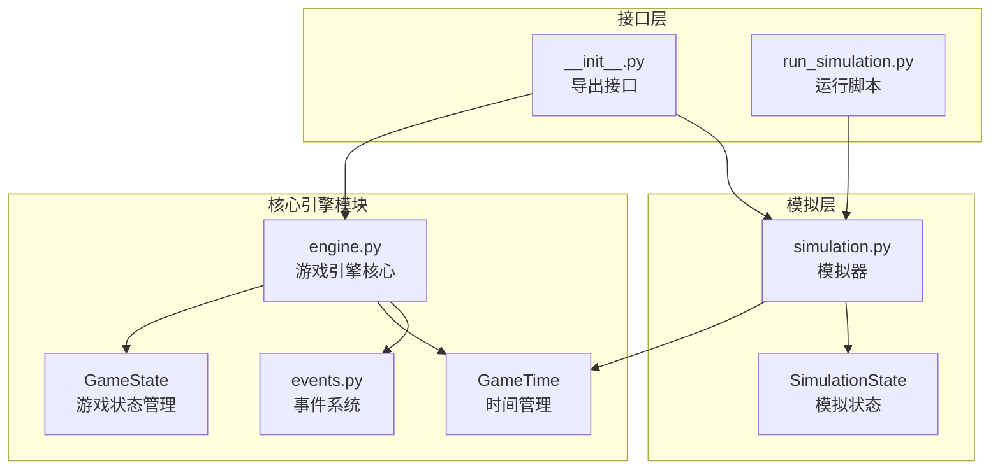
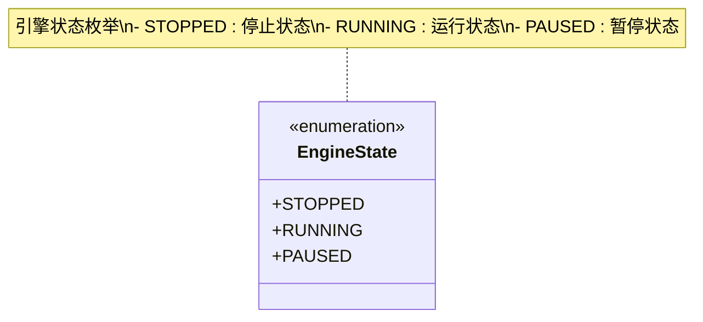
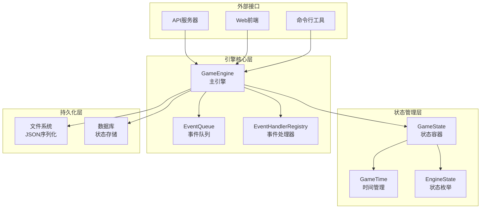
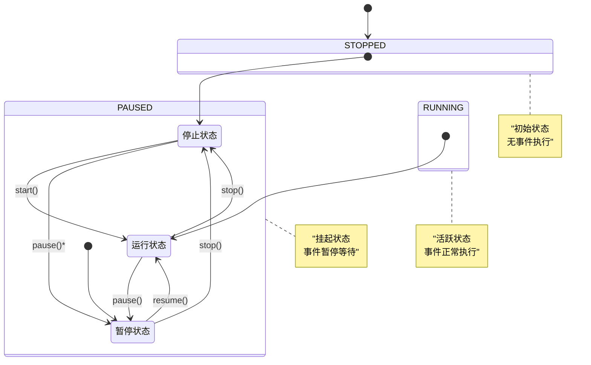
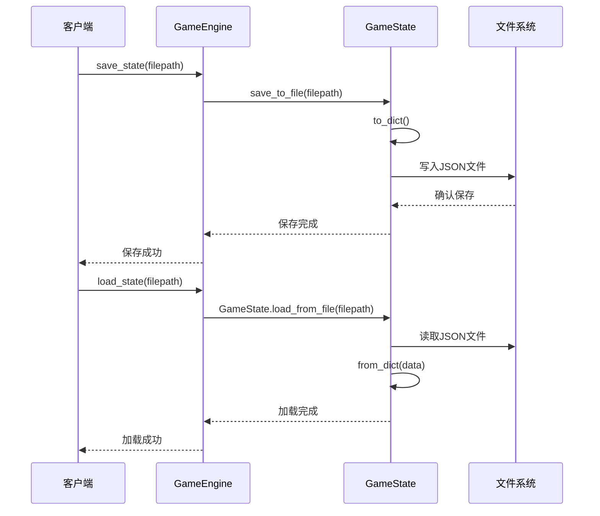
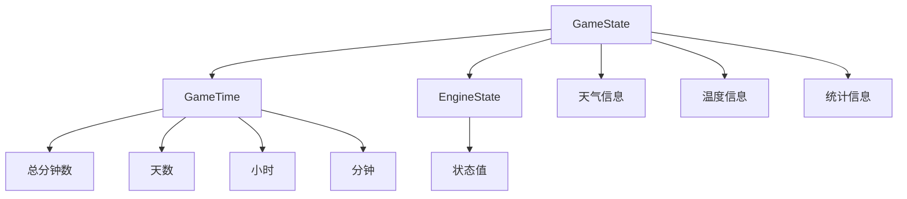
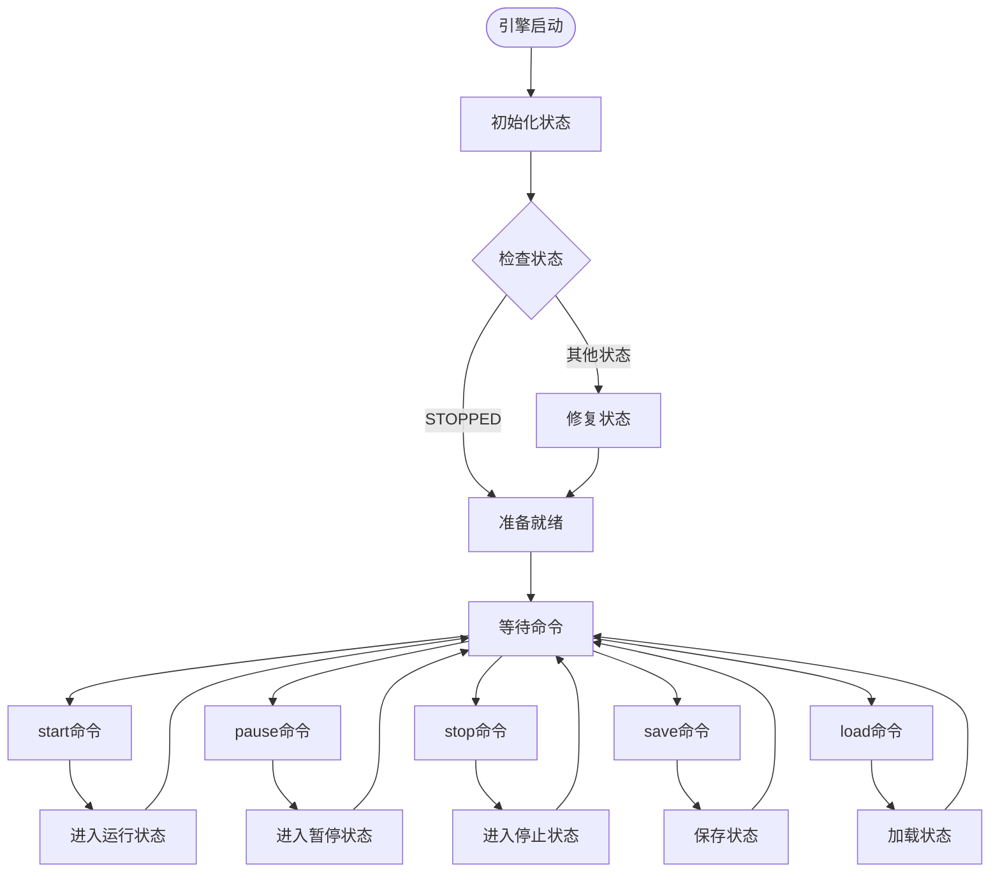
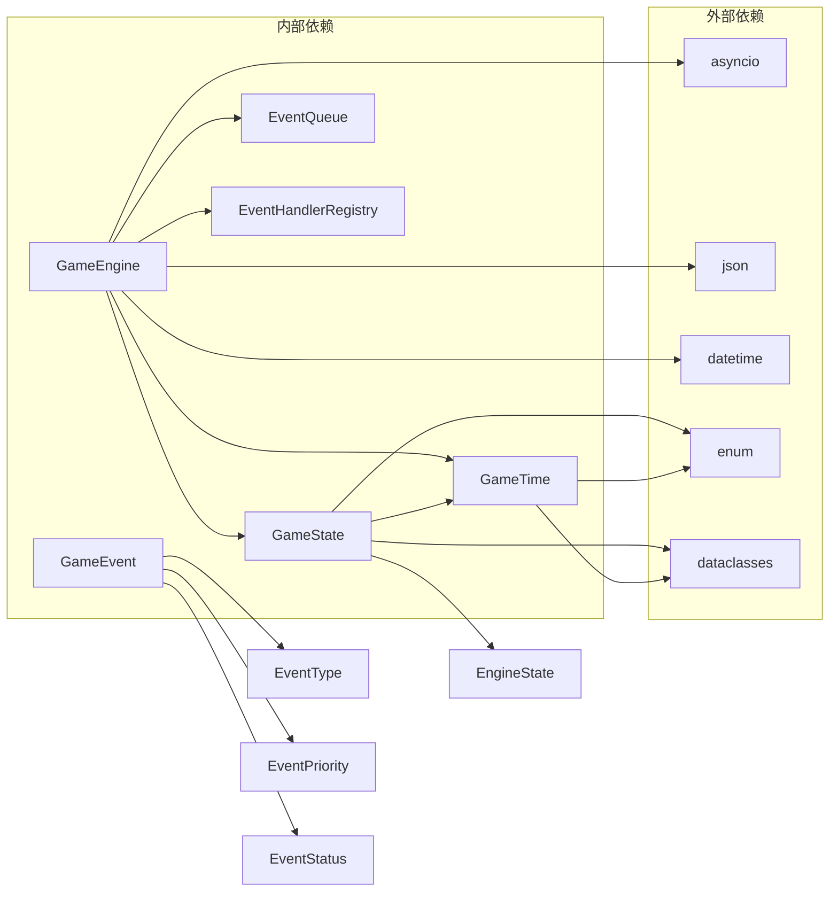

# 引擎状态管理

<cite>
**本文档引用的文件**
- [engine.py](file://core_engine/engine.py)
- [simulation.py](file://core_engine/simulation.py)
- [__init__.py](file://core_engine/__init__.py)
- [events.py](file://core_engine/event_system/events.py)
- [run_simulation.py](file://run_simulation.py)
</cite>

## 目录
1. [简介](#简介)
2. [项目结构](#项目结构)
3. [核心组件](#核心组件)
4. [架构概览](#架构概览)
5. [详细组件分析](#详细组件分析)
6. [依赖关系分析](#依赖关系分析)
7. [性能考虑](#性能考虑)
8. [故障排除指南](#故障排除指南)
9. [结论](#结论)

## 简介

本文档深入解析AI社区项目的引擎状态管理系统，重点涵盖EngineState枚举设计、GameState数据类实现以及状态转换逻辑。该系统为游戏引擎提供了完整的时间管理和状态持久化能力，支持启动、暂停、恢复、停止等操作，并确保状态的一致性和可靠性。

## 项目结构

引擎状态管理模块位于核心引擎包中，采用清晰的分层架构设计：



**图表来源**
- [engine.py](file://core_engine/engine.py#L1-L429)
- [simulation.py](file://core_engine/simulation.py#L1-L529)
- [__init__.py](file://core_engine/__init__.py#L1-L73)

**章节来源**
- [engine.py](file://core_engine/engine.py#L1-L429)
- [simulation.py](file://core_engine/simulation.py#L1-L529)
- [__init__.py](file://core_engine/__init__.py#L1-L73)

## 核心组件

### EngineState枚举设计

EngineState枚举定义了引擎的三种基本状态：



**图表来源**
- [engine.py](file://core_engine/engine.py#L19-L24)

### GameState数据类实现

GameState数据类作为状态管理的核心载体，包含以下关键属性：

| 属性名 | 类型 | 默认值 | 描述 |
|--------|------|--------|------|
| game_time | GameTime | 当前时间 | 游戏时间对象 |
| weather | str | "sunny" | 天气状况 |
| outdoor_temperature | float | 25.0 | 室外温度 |
| indoor_temperature | float | 22.0 | 室内温度 |
| engine_state | EngineState | EngineState.STOPPED | 引擎当前状态 |
| events_processed | int | 0 | 已处理事件数量 |
| last_save_time | Optional[datetime] | None | 最后保存时间 |

**章节来源**
- [engine.py](file://core_engine/engine.py#L112-L165)

## 架构概览

引擎状态管理系统采用分层架构，确保职责分离和可维护性：



**图表来源**
- [engine.py](file://core_engine/engine.py#L167-L429)
- [events.py](file://core_engine/event_system/events.py#L1-L200)

## 详细组件分析

### 状态转换逻辑

引擎状态转换遵循严格的有限状态机模型：



**图表来源**
- [engine.py](file://core_engine/engine.py#L240-L275)

#### 状态转换流程详解

1. **启动流程** (`start()`方法)
   - 检查当前运行状态
   - 设置运行标志和状态
   - 启动主循环
   - 更新引擎状态为RUNNING

2. **暂停流程** (`pause()`方法)
   - 检查运行中且未暂停状态
   - 设置暂停标志
   - 清除异步事件
   - 更新引擎状态为PAUSED

3. **恢复流程** (`resume()`方法)
   - 检查运行中且已暂停状态
   - 清除暂停标志
   - 设置异步事件
   - 更新引擎状态为RUNNING

4. **停止流程** (`stop()`方法)
   - 设置停止标志
   - 清除暂停状态
   - 解除异步事件等待
   - 更新引擎状态为STOPPED

**章节来源**
- [engine.py](file://core_engine/engine.py#L240-L275)

### 状态持久化机制

状态持久化通过JSON序列化实现，支持完整的状态保存和加载：



**图表来源**
- [engine.py](file://core_engine/engine.py#L383-L412)

#### 序列化数据结构

状态序列化包含以下层次结构：



**图表来源**
- [engine.py](file://core_engine/engine.py#L129-L151)

**章节来源**
- [engine.py](file://core_engine/engine.py#L129-L165)
- [engine.py](file://core_engine/engine.py#L383-L412)

### 引擎生命周期管理

引擎在整个生命周期中维护状态一致性：



**图表来源**
- [engine.py](file://core_engine/engine.py#L240-L275)
- [engine.py](file://core_engine/engine.py#L383-L412)

**章节来源**
- [engine.py](file://core_engine/engine.py#L240-L429)

### 状态检查和验证

系统提供多种状态检查机制：

1. **运行状态检查** (`is_running`属性)
   - 组合运行标志和暂停标志
   - 确保准确反映实际运行状态

2. **暂停状态检查** (`is_paused`属性)
   - 直接检查暂停标志
   - 提供快速状态查询

3. **状态一致性验证**
   - 异步事件与状态同步
   - 状态转换条件验证
   - 异常状态自动修复

**章节来源**
- [engine.py](file://core_engine/engine.py#L204-L210)

## 依赖关系分析

引擎状态管理模块的依赖关系清晰明确：



**图表来源**
- [engine.py](file://core_engine/engine.py#L7-L16)
- [events.py](file://core_engine/event_system/events.py#L7-L11)

**章节来源**
- [engine.py](file://core_engine/engine.py#L7-L16)
- [__init__.py](file://core_engine/__init__.py#L7-L8)

## 性能考虑

### 状态更新优化

1. **异步状态管理**
   - 使用asyncio.Event进行状态同步
   - 避免阻塞操作影响性能
   - 支持非阻塞状态检查

2. **内存效率**
   - 数据类字段默认值优化
   - 可选类型减少内存占用
   - 及时清理临时状态

3. **序列化性能**
   - JSON序列化批量处理
   - 文件I/O异步操作
   - 缓存常用状态信息

### 状态转换开销

- 状态转换操作为O(1)复杂度
- 异步事件切换避免CPU阻塞
- 状态检查操作为常数时间

## 故障排除指南

### 常见问题诊断

1. **状态不一致问题**
   - 检查异步事件标志同步
   - 验证状态转换条件
   - 确认异常处理完整性

2. **序列化错误**
   - 验证JSON格式正确性
   - 检查文件权限
   - 确认编码格式

3. **内存泄漏检测**
   - 监控状态对象生命周期
   - 检查回调注册情况
   - 验证资源释放

### 调试技巧

1. **状态监控**
   ```python
   # 获取详细状态信息
   status = engine.get_status()
   print(json.dumps(status, indent=2, default=str))
   ```

2. **事件追踪**
   - 监听事件完成回调
   - 记录事件执行时间
   - 跟踪事件状态变化

3. **性能分析**
   - 监控状态转换频率
   - 分析事件处理延迟
   - 评估内存使用情况

**章节来源**
- [engine.py](file://core_engine/engine.py#L414-L429)

## 结论

AI社区项目的引擎状态管理系统展现了优秀的软件工程实践：

1. **设计原则**
   - 清晰的状态分离和职责划分
   - 完整的序列化和反序列化机制
   - 强健的异常处理和状态恢复

2. **技术优势**
   - 基于数据类的状态管理
   - 异步状态同步机制
   - 完善的生命周期管理

3. **扩展性**
   - 模块化设计便于扩展
   - 明确的接口契约
   - 良好的向后兼容性

该系统为AI社区项目提供了可靠的状态管理基础，支持复杂的模拟场景和长时间运行的应用需求。通过合理的架构设计和完善的错误处理机制，确保了系统的稳定性和可维护性。