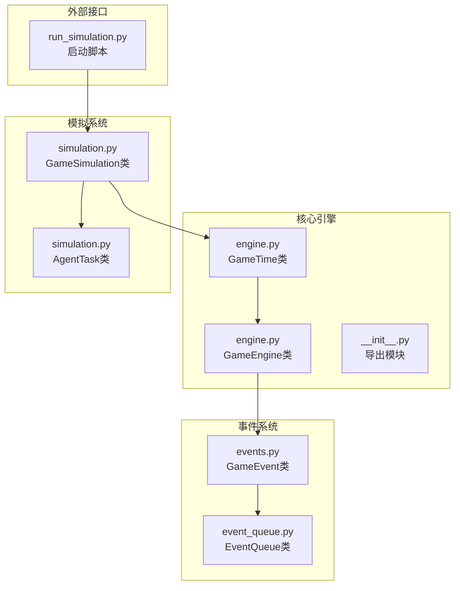
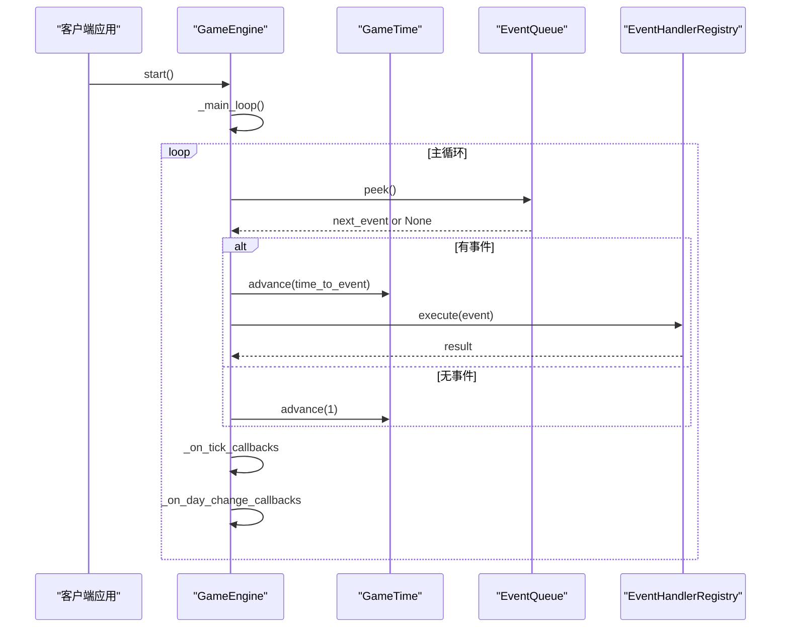
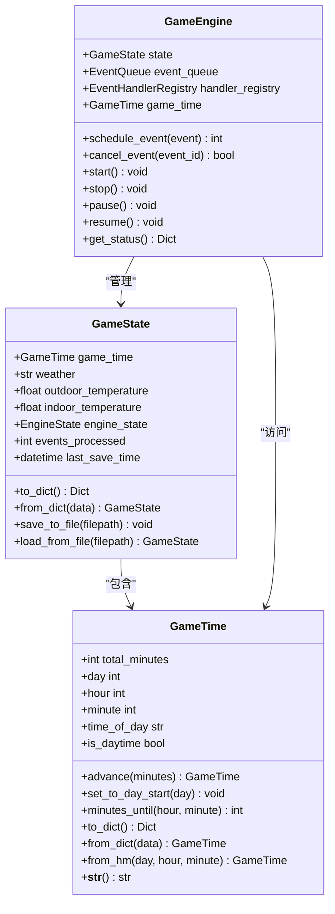
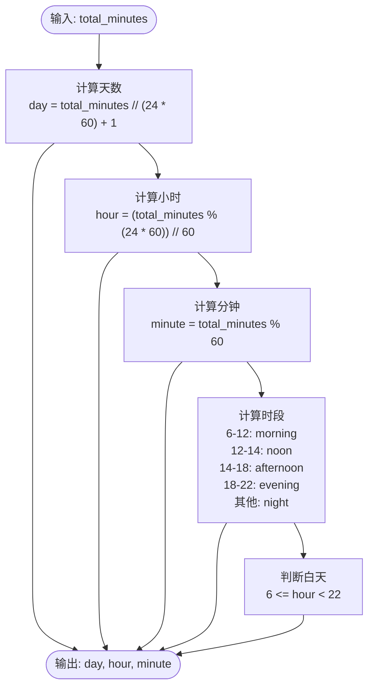
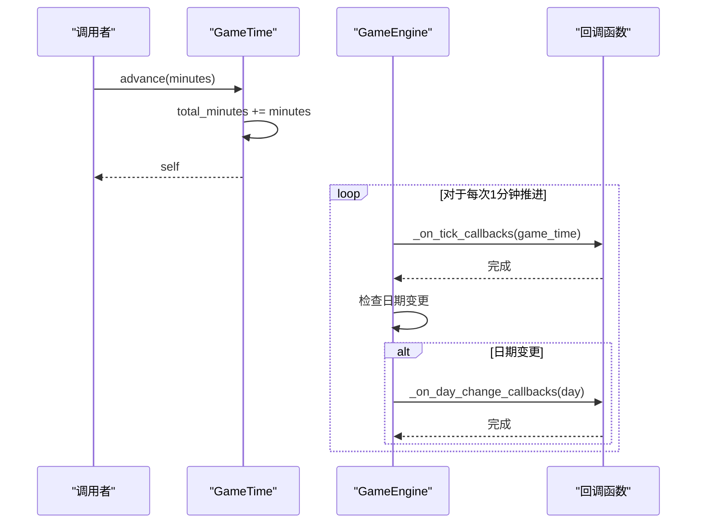
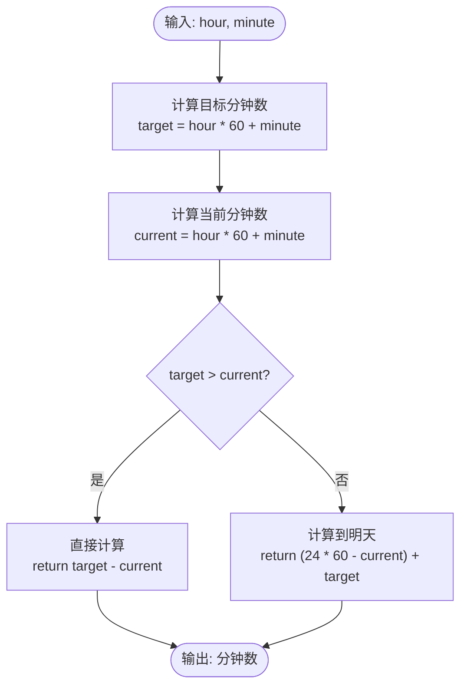
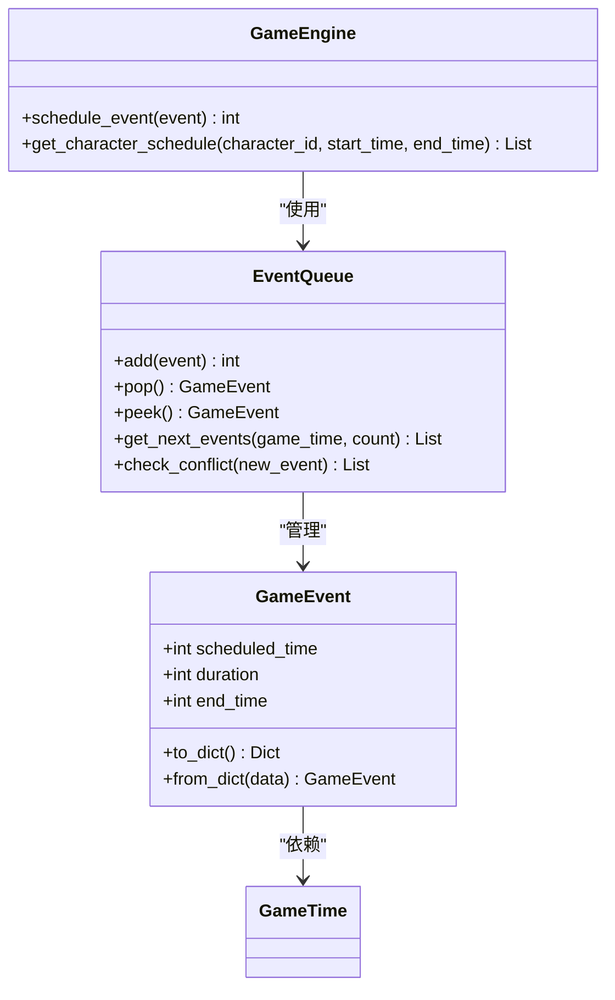
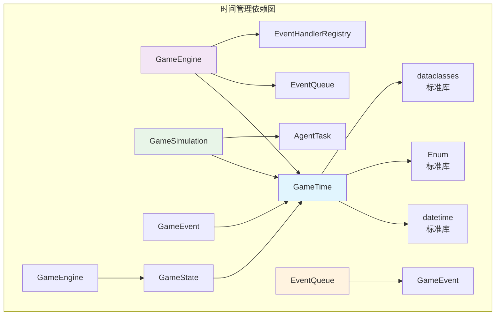

# 游戏时间管理

<cite>
**本文档引用的文件**
- [engine.py](file://core_engine/engine.py)
- [simulation.py](file://core_engine/simulation.py)
- [events.py](file://core_engine/event_system/events.py)
- [event_queue.py](file://core_engine/event_system/event_queue.py)
- [__init__.py](file://core_engine/__init__.py)
- [run_simulation.py](file://run_simulation.py)
</cite>

## 目录
1. [简介](#简介)
2. [项目结构](#项目结构)
3. [核心组件](#核心组件)
4. [架构概览](#架构概览)
5. [详细组件分析](#详细组件分析)
6. [依赖关系分析](#依赖关系分析)
7. [性能考虑](#性能考虑)
8. [故障排除指南](#故障排除指南)
9. [结论](#结论)

## 简介

本文件详细介绍了AI社区项目中的游戏时间管理系统，重点分析了GameTime类的设计理念和实现细节。该系统采用分钟作为最小时间单位，实现了完整的昼夜节律管理、时间段计算和时间推进机制。通过统一的时间管理接口，系统能够支持复杂的事件调度、角色行为模拟和环境变化追踪。

## 项目结构

游戏时间管理模块主要分布在以下文件中：

**图表来源**
- [engine.py](file://core_engine/engine.py#L26-L110)
- [simulation.py](file://core_engine/simulation.py#L64-L118)
- [events.py](file://core_engine/event_system/events.py#L55-L129)

**章节来源**
- [engine.py](file://core_engine/engine.py#L1-L429)
- [simulation.py](file://core_engine/simulation.py#L1-L529)
- [__init__.py](file://core_engine/__init__.py#L1-L73)

## 核心组件

### GameTime类设计

GameTime类是整个时间管理系统的核心，采用分钟制时间管理策略：

- **时间精度**: 以分钟为最小单位，确保精确的时间控制
- **时间表示**: 使用total_minutes属性存储自游戏开始以来的总分钟数
- **时间单位转换**: 提供day、hour、minute属性进行时间单位转换
- **昼夜节律**: 实现time_of_day和is_daytime属性管理昼夜变化

### 时间推进机制

系统提供了多种时间推进方式：

1. **增量推进**: advance()方法支持按分钟增量推进时间
2. **直接设置**: set_to_day_start()方法支持设置到指定天的开始
3. **相对计算**: minutes_until()方法计算到指定时间的剩余分钟数

**章节来源**
- [engine.py](file://core_engine/engine.py#L26-L110)

## 架构概览

**图表来源**
- [engine.py](file://core_engine/engine.py#L288-L342)
- [engine.py](file://core_engine/engine.py#L167-L197)

**章节来源**
- [engine.py](file://core_engine/engine.py#L167-L429)

## 详细组件分析

### GameTime类详细分析

#### 数据结构设计

**图表来源**
- [engine.py](file://core_engine/engine.py#L26-L110)
- [engine.py](file://core_engine/engine.py#L112-L165)
- [engine.py](file://core_engine/engine.py#L167-L429)

#### 时间单位转换算法

GameTime类实现了高效的时间单位转换算法：

**图表来源**
- [engine.py](file://core_engine/engine.py#L35-L68)

#### 时间推进机制实现

**图表来源**
- [engine.py](file://core_engine/engine.py#L320-L342)

**章节来源**
- [engine.py](file://core_engine/engine.py#L26-L110)

### 时间间隔计算功能

GameTime类提供了智能的时间间隔计算功能：

#### minutes_until方法分析

该方法实现了跨天的时间计算逻辑：

**图表来源**
- [engine.py](file://core_engine/engine.py#L79-L88)

**章节来源**
- [engine.py](file://core_engine/engine.py#L79-L88)

### 事件系统集成

#### 事件时间管理

事件系统与时间管理紧密集成：

**图表来源**
- [events.py](file://core_engine/event_system/events.py#L55-L129)
- [event_queue.py](file://core_engine/event_system/event_queue.py#L29-L244)
- [engine.py](file://core_engine/engine.py#L211-L238)

**章节来源**
- [events.py](file://core_engine/event_system/events.py#L55-L129)
- [event_queue.py](file://core_engine/event_system/event_queue.py#L29-L244)

## 依赖关系分析

**图表来源**
- [engine.py](file://core_engine/engine.py#L7-L16)
- [simulation.py](file://core_engine/simulation.py#L10-L18)

**章节来源**
- [engine.py](file://core_engine/engine.py#L7-L16)
- [simulation.py](file://core_engine/simulation.py#L10-L18)

## 性能考虑

### 时间复杂度分析

1. **GameTime属性访问**: O(1) - 基于整数运算的简单转换
2. **advance方法**: O(n) - n为推进的分钟数，逐分钟递增
3. **minutes_until方法**: O(1) - 单次计算
4. **EventQueue操作**: 
   - add/pop/peek: O(log n) - 基于堆的数据结构
   - check_conflict: O(n) - 需要遍历所有事件

### 内存使用优化

- **紧凑数据结构**: 使用dataclass减少内存开销
- **惰性计算**: 属性计算在访问时进行，避免不必要的中间变量
- **事件懒删除**: EventQueue使用懒删除策略减少内存碎片

### 性能优化建议

1. **批量时间推进**: 在GameEngine中使用批量推进而非逐分钟推进
2. **缓存策略**: 对频繁访问的时间属性进行缓存
3. **事件预处理**: 在添加事件前进行冲突检测，减少无效操作
4. **异步优化**: 利用asyncio特性优化时间推进的并发处理

## 故障排除指南

### 常见问题及解决方案

#### 时间计算错误

**问题**: 时间转换出现偏差
**原因**: 可能的整数除法精度问题
**解决方案**: 确保使用整数运算和正确的优先级

#### 事件调度冲突

**问题**: 事件无法正确调度
**原因**: 事件时间重叠或优先级冲突
**解决方案**: 使用EventQueue的check_conflict方法进行预检

#### 时间跳跃异常

**问题**: GameSimulation的时间跳跃不符合预期
**原因**: max_time_skip配置不当或任务堆清理问题
**解决方案**: 检查SimulationConfig配置和任务堆状态

**章节来源**
- [event_queue.py](file://core_engine/event_system/event_queue.py#L154-L178)
- [simulation.py](file://core_engine/simulation.py#L346-L378)

## 结论

AI社区项目的游戏时间管理系统展现了优秀的软件工程实践：

1. **设计理念**: 采用分钟制时间管理，提供了精确且灵活的时间控制能力
2. **架构设计**: 清晰的模块分离，GameTime独立于具体应用场景
3. **扩展性**: 支持多种时间计算需求，易于扩展新的时间相关功能
4. **性能**: 优化的时间转换算法和事件调度机制

该系统为AI社区的复杂模拟提供了坚实的时间基础，支持角色行为模拟、事件调度和环境变化追踪等多种应用场景。通过合理的抽象和设计，系统既保证了功能的完整性，又保持了良好的性能表现。