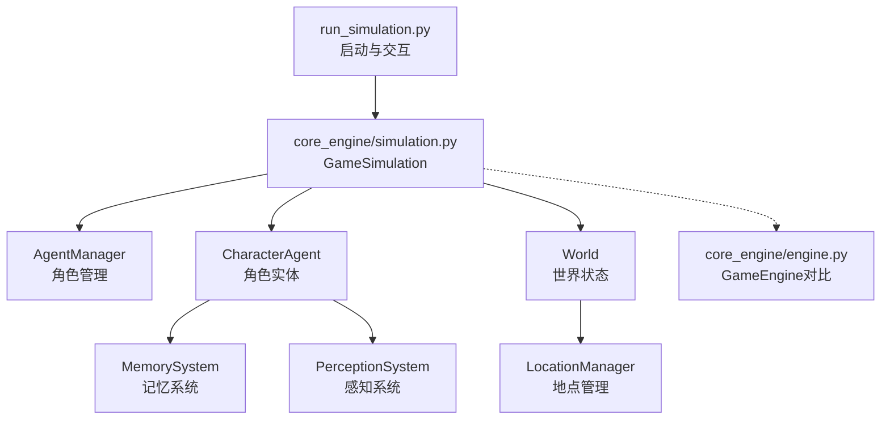
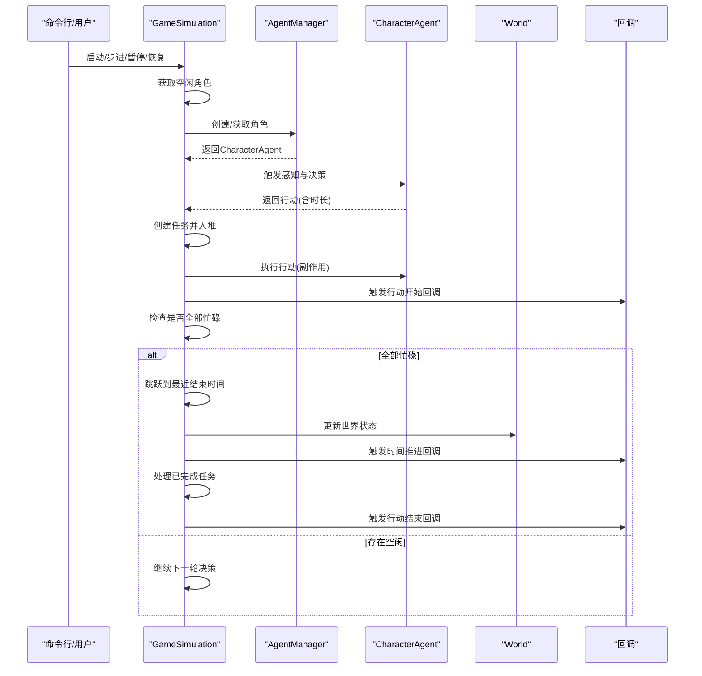
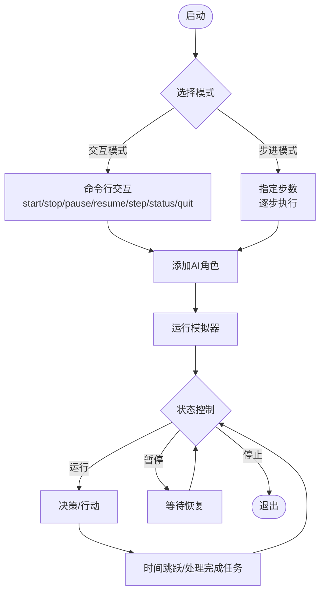
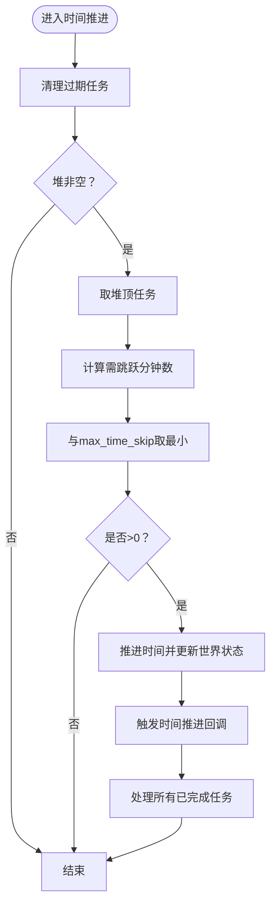
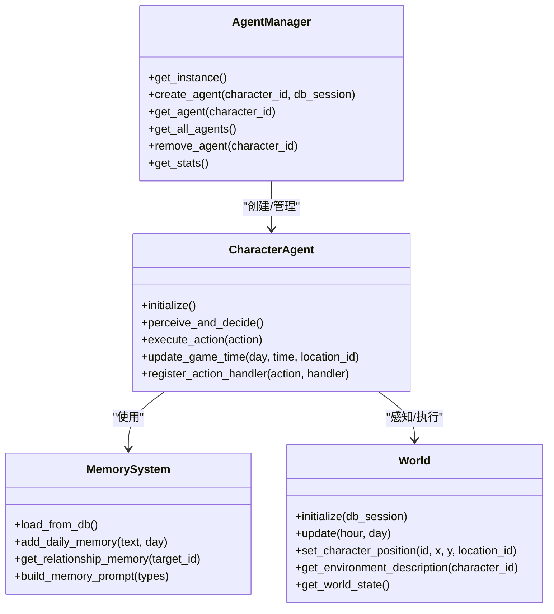
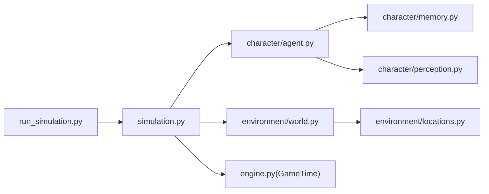

# 模拟控制

<cite>
**本文引用的文件**
- [run_simulation.py](file://run_simulation.py)
- [simulation.py](file://core_engine/simulation.py)
- [engine.py](file://core_engine/engine.py)
- [agent.py](file://core_engine/character/agent.py)
- [world.py](file://core_engine/environment/world.py)
- [memory.py](file://core_engine/character/memory.py)
- [perception.py](file://core_engine/character/perception.py)
- [config.py](file://shared/config.py)
- [README.md](file://README.md)
- [requirements.txt](file://requirements.txt)
</cite>

## 目录
1. [简介](#简介)
2. [项目结构](#项目结构)
3. [核心组件](#核心组件)
4. [架构总览](#架构总览)
5. [详细组件分析](#详细组件分析)
6. [依赖关系分析](#依赖关系分析)
7. [性能考量](#性能考量)
8. [故障排查指南](#故障排查指南)
9. [结论](#结论)
10. [附录](#附录)

## 简介
本文件面向“模拟控制系统”的技术文档，聚焦于模拟器的两种启动模式（交互模式与步进模式）、时间跳跃机制、角色状态管理与持久化、配置项说明、监控与诊断能力以及常见问题排查与恢复策略。文档以代码为依据，结合可视化图示帮助读者快速理解系统设计与运行方式。

## 项目结构
- 启动入口：run_simulation.py 提供交互模式与步进模式的命令行交互。
- 核心引擎：core_engine/simulation.py 实现基于行动结束触发的模拟器，包含时间推进、任务调度、角色管理等。
- 时间引擎：core_engine/engine.py 提供独立的时间推进与事件调度能力（用于对比理解）。
- 角色系统：core_engine/character/agent.py、memory.py、perception.py 管理角色状态、记忆与感知。
- 环境系统：core_engine/environment/world.py 管理世界状态（天气、温度、位置等）。
- 共享配置：shared/config.py 提供全局配置读取。
- 文档与依赖：README.md 提供使用说明与配置要点；requirements.txt 列出Python依赖。

图表来源
- [run_simulation.py](file://run_simulation.py#L1-L258)
- [simulation.py](file://core_engine/simulation.py#L64-L114)
- [agent.py](file://core_engine/character/agent.py#L117-L175)
- [world.py](file://core_engine/environment/world.py#L93-L121)

章节来源
- [run_simulation.py](file://run_simulation.py#L1-L258)
- [simulation.py](file://core_engine/simulation.py#L1-L120)
- [README.md](file://README.md#L1-L120)

## 核心组件
- 模拟器（GameSimulation）：负责时间推进、角色决策与行动执行、任务堆管理、状态查询与回调。
- 角色（CharacterAgent）：负责感知、决策、执行行动、状态更新与日志记录。
- 世界（World）：维护天气、温度、角色位置与地点信息。
- 记忆系统（MemorySystem）：管理共同记忆、日常记忆、重要记忆、知识与关系记忆。
- 感知系统（PerceptionSystem）：提供物理状态、环境信息与可用行动。
- 配置（SimulationConfig）：控制最大时间跳跃、决策超时、初始时间与日志详细程度。

章节来源
- [simulation.py](file://core_engine/simulation.py#L46-L126)
- [agent.py](file://core_engine/character/agent.py#L116-L175)
- [world.py](file://core_engine/environment/world.py#L93-L121)
- [memory.py](file://core_engine/character/memory.py#L92-L120)
- [perception.py](file://core_engine/character/perception.py#L24-L90)

## 架构总览
模拟器采用“事件驱动”的时间模型：角色空闲时触发AI决策，行动包含时长，所有角色忙碌时时间跳跃到最近的行动结束点，行动结束后角色变为空闲，回到决策循环。该模型通过最小化轮询、最大化并行决策与任务堆排序实现高效推进。

图表来源
- [simulation.py](file://core_engine/simulation.py#L220-L249)
- [simulation.py](file://core_engine/simulation.py#L267-L343)
- [simulation.py](file://core_engine/simulation.py#L346-L395)
- [agent.py](file://core_engine/character/agent.py#L358-L477)

## 详细组件分析

### 启动模式：交互模式与步进模式
- 交互模式
  - 启动后进入命令行界面，支持 start、stop、pause、resume、step、status、quit 等命令。
  - 自动注册行动开始/结束与时间推进回调，便于观测模拟状态。
  - 支持动态添加AI角色（数据库中 is_ai=True 的用户）。
- 步进模式
  - 通过命令行参数 --step 指定步数，每步按回车继续，适合教学与调试。
  - 与交互模式共享相同的模拟器核心逻辑。

图表来源
- [run_simulation.py](file://run_simulation.py#L54-L186)
- [run_simulation.py](file://run_simulation.py#L188-L233)

章节来源
- [run_simulation.py](file://run_simulation.py#L54-L186)
- [run_simulation.py](file://run_simulation.py#L188-L233)
- [README.md](file://README.md#L129-L156)

### 时间跳跃机制：原理、参数与使用
- 原理
  - 通过最小堆维护所有角色任务的结束时间，当全部角色忙碌时，时间推进到最近任务结束点，并限制最大跳跃量防止无限等待。
  - 推进时间后更新世界状态（天气、温度等），并触发时间推进回调。
- 参数
  - max_time_skip：最大时间跳跃（分钟），默认8小时，防止长时间阻塞。
  - decision_timeout：AI决策超时（秒），超时则默认等待。
  - initial_day/hour/minute：初始游戏时间。
- 使用
  - 在交互模式下，时间跳跃会打印“时间跳跃 X 分钟”与新的游戏时间。
  - 在步进模式下，每步执行后可查看时间推进情况。

图表来源
- [simulation.py](file://core_engine/simulation.py#L346-L395)

章节来源
- [simulation.py](file://core_engine/simulation.py#L46-L62)
- [simulation.py](file://core_engine/simulation.py#L346-L395)
- [run_simulation.py](file://run_simulation.py#L48-L52)

### 角色状态管理：初始化、同步与持久化
- 初始化
  - 通过 AgentManager 单例创建角色，加载记忆与物品栏，确保拥有手机等基础物品。
  - 角色加入世界并设置初始位置，更新游戏时间信息。
- 状态同步
  - 角色状态（空闲/忙碌）与当前任务通过字典映射维护，任务堆按结束时间排序。
  - 世界状态（天气、温度、地点占用）与角色位置实时同步。
- 持久化策略
  - 记忆系统支持从数据库加载/保存，包含共同记忆、日常记忆、重要记忆、知识与关系记忆。
  - 行动日志记录到数据库，便于审计与回溯。
  - 世界状态与事件队列可保存/加载（GameEngine侧，用于对比理解）。

图表来源
- [agent.py](file://core_engine/character/agent.py#L1175-L1271)
- [agent.py](file://core_engine/character/agent.py#L116-L175)
- [memory.py](file://core_engine/character/memory.py#L92-L120)
- [world.py](file://core_engine/environment/world.py#L93-L121)

章节来源
- [simulation.py](file://core_engine/simulation.py#L129-L175)
- [agent.py](file://core_engine/character/agent.py#L181-L195)
- [memory.py](file://core_engine/character/memory.py#L119-L200)
- [world.py](file://core_engine/environment/world.py#L114-L140)

### 模拟器配置选项详解
- SimulationConfig
  - max_time_skip：最大时间跳跃（分钟），默认480。
  - decision_timeout：决策超时（秒），默认60。
  - verbose：是否输出详细日志。
  - initial_day/hour/minute：初始时间。
- WorldConfig
  - 名称、地图尺寸、时间倍率、天气变化概率、移动速度与疲劳消耗/恢复参数、温度基线等。
- shared/config.py
  - 提供数据库、JWT、API、上传目录、AI相关等配置项，可通过环境变量覆盖。

章节来源
- [simulation.py](file://core_engine/simulation.py#L46-L62)
- [world.py](file://core_engine/environment/world.py#L33-L65)
- [config.py](file://shared/config.py#L6-L52)
- [README.md](file://README.md#L214-L227)

### 监控与诊断：性能指标、内存与事件统计
- 状态查询
  - get_status 返回模拟器状态、游戏时间、世界状态、角色状态（忙碌/空闲、当前行动、疲劳度）、待处理任务数等。
- 回调机制
  - on_action_start/on_action_end/on_time_advance 提供扩展点，便于接入日志、监控与告警。
- 事件系统（对比理解）
  - GameEngine 提供事件队列、事件处理、状态保存/加载、事件处理统计等能力，适合理解更复杂的调度场景。

章节来源
- [simulation.py](file://core_engine/simulation.py#L481-L502)
- [simulation.py](file://core_engine/simulation.py#L437-L478)
- [engine.py](file://core_engine/engine.py#L414-L429)

## 依赖关系分析
- 模块耦合
  - run_simulation.py 仅依赖 GameSimulation 与 WorldConfig，职责清晰。
  - GameSimulation 依赖 AgentManager、CharacterAgent、World、GameTime。
  - CharacterAgent 依赖 MemorySystem、PerceptionSystem、ActionLogger、LLMClient。
  - World 依赖 LocationManager。
- 外部依赖
  - Python 依赖集中在 requirements.txt，包括 FastAPI、SQLAlchemy、Pydantic、aiohttp 等异步支持库。

图表来源
- [run_simulation.py](file://run_simulation.py#L17-L24)
- [simulation.py](file://core_engine/simulation.py#L16-L18)
- [agent.py](file://core_engine/character/agent.py#L14-L18)
- [world.py](file://core_engine/environment/world.py#L12)

章节来源
- [requirements.txt](file://requirements.txt#L1-L32)

## 性能考量
- 并行决策：空闲角色的决策通过 asyncio.gather 并行触发，提升吞吐。
- 任务堆排序：使用最小堆维护结束时间，O(log N) 插入与 O(1) 取最小，时间推进高效。
- 超时保护：决策超时与最大时间跳跃限制，避免长时间阻塞。
- I/O 与数据库：角色初始化与记忆加载在启动阶段完成，运行时尽量减少数据库访问频率。

[本节为通用建议，无需特定文件引用]

## 故障排查指南
- LLM 连接失败
  - 确认本地 LLM 服务已启动且端口正确；可运行 LLM 客户端测试脚本验证。
- 数据库连接失败
  - 检查 MySQL 服务状态、凭据与数据库是否存在；确保初始化脚本已执行。
- 没有 AI 角色
  - 数据库中需存在 is_ai=True 的用户记录；启动时会加载这些角色。
- 模拟器无响应
  - 检查是否处于暂停状态；确认决策超时设置合理；查看回调是否抛错。
- 时间推进异常
  - 检查 max_time_skip 是否过大导致跳跃不明显；确认任务堆未被错误清空。

章节来源
- [README.md](file://README.md#L269-L286)

## 结论
本模拟控制系统以“事件驱动”为核心，通过角色空闲触发决策、行动时长与任务堆管理实现高效的时间推进，并提供交互与步进两种启动模式满足不同使用场景。角色状态管理与记忆系统支持持久化与可观测性，配置灵活、扩展性强。建议在生产环境中结合回调与状态查询接口完善监控与告警体系。

[本节为总结，无需特定文件引用]

## 附录
- 常用命令
  - 交互模式：python run_simulation.py
  - 步进模式：python run_simulation.py --step 10
- 关键配置位置
  - run_simulation.py 中的 SimulationConfig
  - shared/config.py 中的数据库与AI相关配置
- 相关文件
  - README.md 提供使用说明与常见问题

[本节为概览，无需特定文件引用]