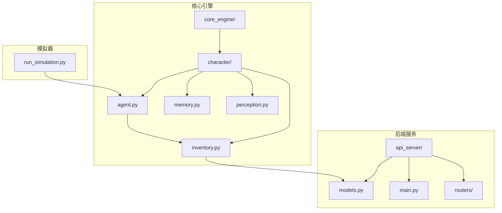
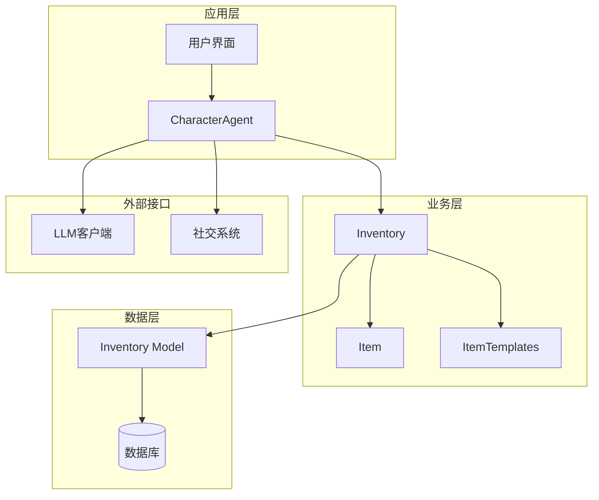
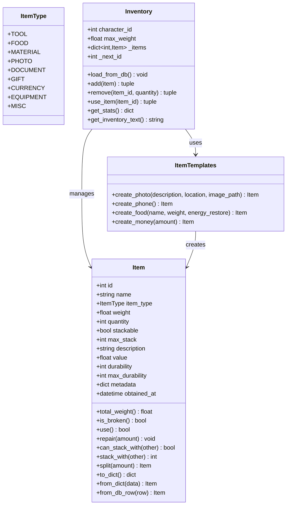
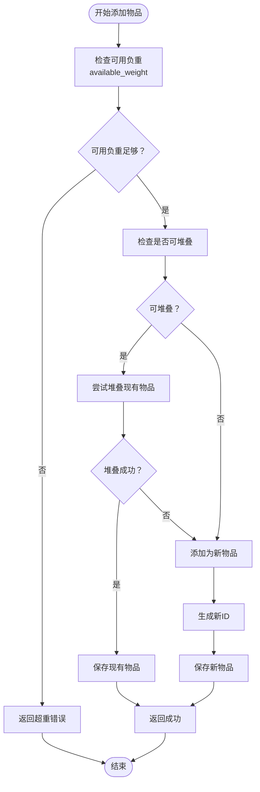
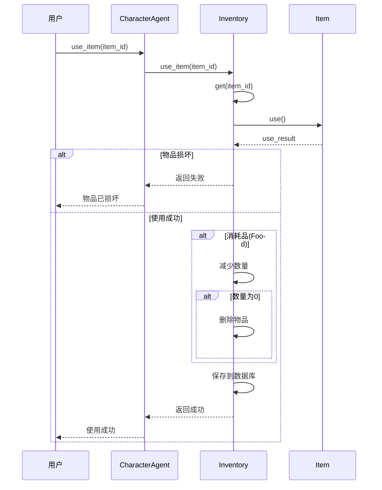
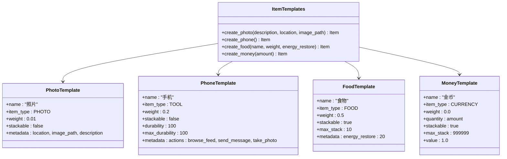
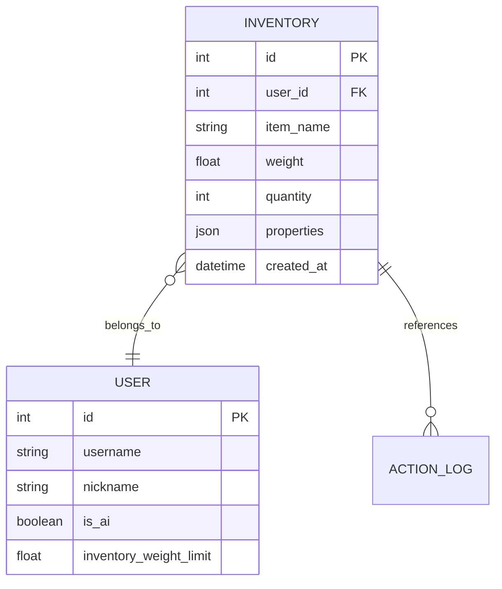
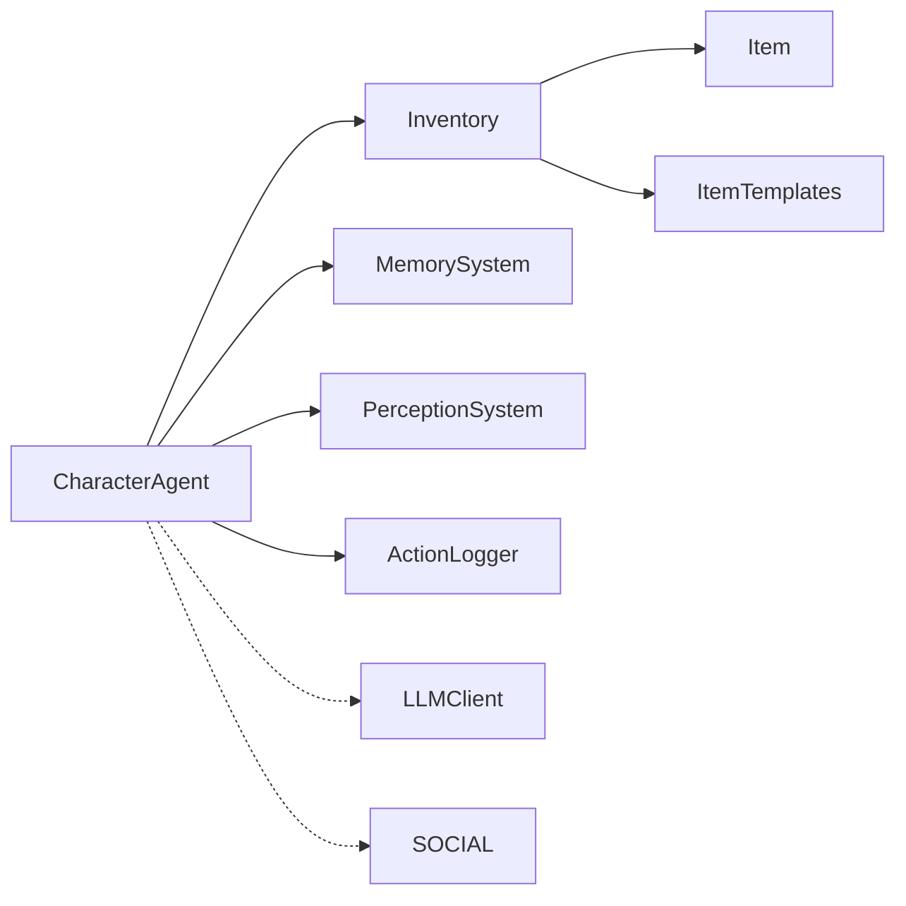

# 物品栏系统

<cite>
**本文档引用的文件**
- [inventory.py](file://core_engine/character/inventory.py)
- [agent.py](file://core_engine/character/agent.py)
- [models.py](file://api_server/models.py)
- [run_simulation.py](file://run_simulation.py)
- [README.md](file://README.md)
</cite>

## 目录
1. [简介](#简介)
2. [项目结构](#项目结构)
3. [核心组件](#核心组件)
4. [架构概览](#架构概览)
5. [详细组件分析](#详细组件分析)
6. [依赖关系分析](#依赖关系分析)
7. [性能考量](#性能考量)
8. [故障排除指南](#故障排除指南)
9. [结论](#结论)
10. [附录](#附录)

## 简介
本文档全面阐述了AI社区项目中的物品栏系统设计与实现。该系统为AI角色提供完整的物品管理能力，包括物品定义、重量限制、堆叠机制、耐久度管理、持久化存储以及模板系统。系统采用事件驱动的模拟引擎，通过数据库进行数据持久化，支持多种物品类型和丰富的扩展能力。

## 项目结构
物品栏系统位于核心引擎的character模块中，与Agent、记忆系统、感知系统协同工作，形成完整的AI角色管理体系。

**图表来源**
- [inventory.py](file://core_engine/character/inventory.py#L1-L547)
- [agent.py](file://core_engine/character/agent.py#L1-L1271)
- [models.py](file://api_server/models.py#L1-L293)

**章节来源**
- [README.md](file://README.md#L1-L290)

## 核心组件
物品栏系统由三个核心组件构成：Item物品类、Inventory物品栏管理和ItemTemplates物品模板系统。

### Item物品类
Item类是系统的基础数据结构，定义了物品的所有属性和行为：
- 基础属性：id、name、item_type、weight、quantity、description
- 可堆叠属性：stackable、max_stack
- 耐久度系统：durability、max_durability
- 元数据系统：metadata用于存储额外信息
- 时间戳：obtained_at记录获得时间

### Inventory物品栏管理
Inventory类负责物品栏的完整生命周期管理：
- 负重计算：current_weight、available_weight、is_overweight
- 物品增删：add、remove、use_item
- 查询功能：get、get_by_name、get_by_type、get_all
- 统计信息：get_stats、get_inventory_text

### ItemTemplates物品模板
预定义的物品模板提供了快速创建标准物品的能力：
- create_photo：创建照片物品
- create_phone：创建手机（工具类）
- create_food：创建食物（消耗品）
- create_money：创建货币

**章节来源**
- [inventory.py](file://core_engine/character/inventory.py#L14-L192)
- [inventory.py](file://core_engine/character/inventory.py#L194-L474)
- [inventory.py](file://core_engine/character/inventory.py#L478-L547)

## 架构概览
物品栏系统采用分层架构设计，实现了业务逻辑与数据持久化的分离。

**图表来源**
- [agent.py](file://core_engine/character/agent.py#L116-L195)
- [inventory.py](file://core_engine/character/inventory.py#L194-L308)
- [models.py](file://api_server/models.py#L220-L233)

## 详细组件分析

### 物品类型系统
系统定义了九种物品类型，每种类型都有其特定的行为和用途：

**图表来源**
- [inventory.py](file://core_engine/character/inventory.py#L14-L547)

### 负重计算算法
负重系统是物品栏的核心机制，确保角色不会携带超过其承受能力的物品。

**图表来源**
- [inventory.py](file://core_engine/character/inventory.py#L324-L358)

### 物品使用机制
系统实现了完整的物品使用流程，包括耐久度管理和消耗品处理。

**图表来源**
- [inventory.py](file://core_engine/character/inventory.py#L416-L440)

### 物品模板系统
模板系统提供了标准化的物品创建方式，确保物品属性的一致性和可扩展性。

**图表来源**
- [inventory.py](file://core_engine/character/inventory.py#L478-L547)

**章节来源**
- [inventory.py](file://core_engine/character/inventory.py#L14-L547)

## 依赖关系分析

### 数据库模型依赖
物品栏系统与数据库模型紧密耦合，通过Inventory模型实现数据持久化。

**图表来源**
- [models.py](file://api_server/models.py#L35-L61)
- [models.py](file://api_server/models.py#L220-L233)

### Agent集成关系
CharacterAgent将物品栏系统作为核心子系统之一，与其他系统协同工作。

**图表来源**
- [agent.py](file://core_engine/character/agent.py#L116-L195)
- [inventory.py](file://core_engine/character/inventory.py#L194-L208)

**章节来源**
- [models.py](file://api_server/models.py#L220-L233)
- [agent.py](file://core_engine/character/agent.py#L116-L195)

## 性能考量
物品栏系统在设计时充分考虑了性能优化：

### 时间复杂度分析
- 物品添加：O(n) - 需要遍历现有物品进行堆叠检查
- 物品查询：O(1) - 基于字典的直接查找
- 负重计算：O(n) - 需要遍历所有物品计算总重量
- 物品移除：O(1) - 直接删除字典项

### 内存优化策略
- 使用字典存储物品，提供O(1)的查找性能
- 实现懒加载机制，仅在需要时从数据库加载
- 提供统计接口，避免不必要的数据复制

### 扩展性考虑
- 支持动态添加新的物品类型
- 模板系统便于创建标准化物品
- JSON元数据支持任意扩展属性

## 故障排除指南

### 常见问题及解决方案

#### 物品超重问题
**症状**：添加物品时返回超重错误
**原因**：物品总重量超过角色的负重限制
**解决方法**：
1. 检查角色的负重限制设置
2. 通过使用物品或丢弃物品减少负重
3. 考虑升级负重能力

#### 物品损坏问题
**症状**：使用物品时返回"物品已损坏"
**原因**：物品耐久度降至0或以下
**解决方法**：
1. 使用repair()方法修复物品
2. 替换新的同类物品
3. 检查物品的耐久度属性设置

#### 数据同步问题
**症状**：物品状态在内存和数据库之间不一致
**原因**：未正确保存物品变更
**解决方法**：
1. 确保每次物品变更后调用_save_to_db()
2. 检查数据库连接状态
3. 验证事务提交

**章节来源**
- [inventory.py](file://core_engine/character/inventory.py#L324-L358)
- [inventory.py](file://core_engine/character/inventory.py#L416-L440)

## 结论
AI社区的物品栏系统展现了优秀的软件工程实践，通过清晰的分层架构、完善的负重计算、灵活的模板系统和可靠的持久化机制，为AI角色提供了完整的物品管理能力。系统的设计既满足了当前的功能需求，又为未来的扩展预留了充足的空间。

## 附录

### 物品栏扩展开发最佳实践

#### 新增物品类型
1. 在ItemType枚举中添加新类型
2. 在ItemTemplates中创建对应的工厂方法
3. 在Agent决策逻辑中处理新类型的使用场景

#### 自定义物品效果
1. 使用metadata字段存储自定义属性
2. 在Item类中添加相应的处理逻辑
3. 确保数据库模型支持新的属性存储

#### 物品合成系统
1. 设计配方规则和材料要求
2. 实现合成验证逻辑
3. 创建合成结果的物品模板

#### 持久化策略
1. 使用数据库事务确保数据一致性
2. 实现增量更新以提高性能
3. 建立备份和恢复机制

**章节来源**
- [inventory.py](file://core_engine/character/inventory.py#L478-L547)
- [agent.py](file://core_engine/character/agent.py#L116-L195)