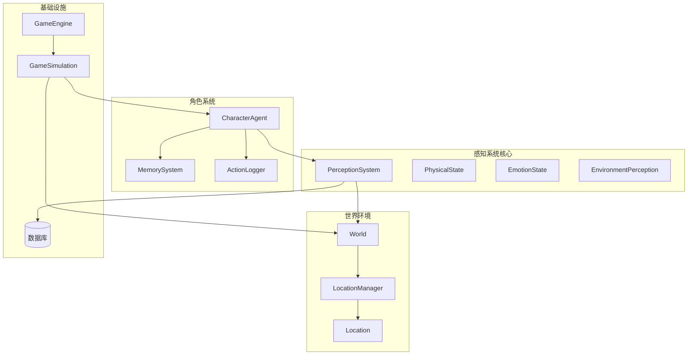
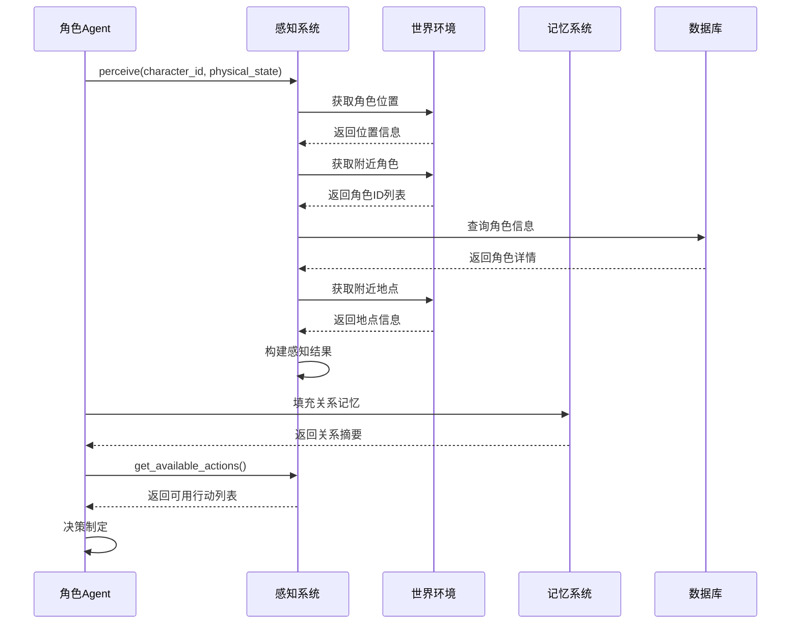
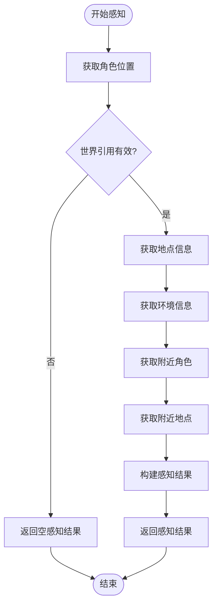
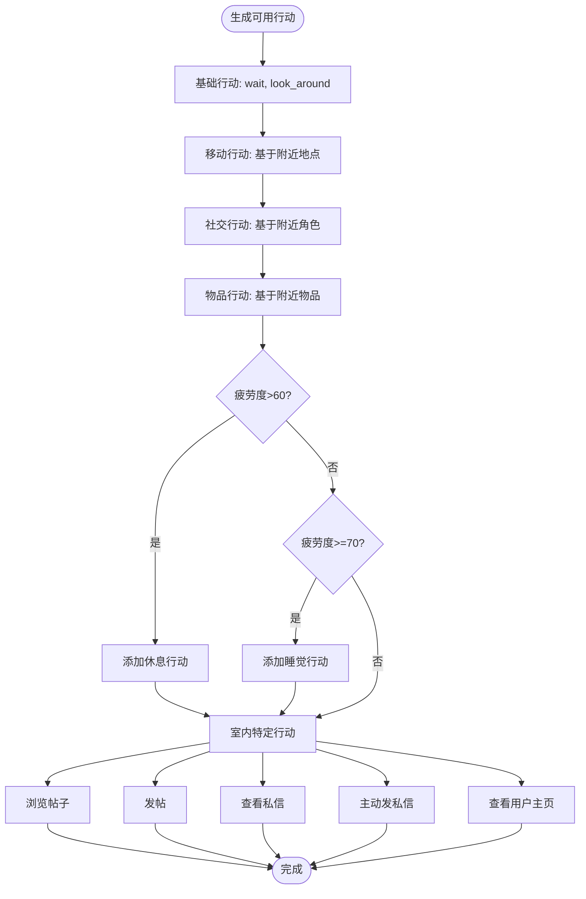
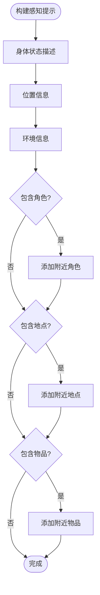
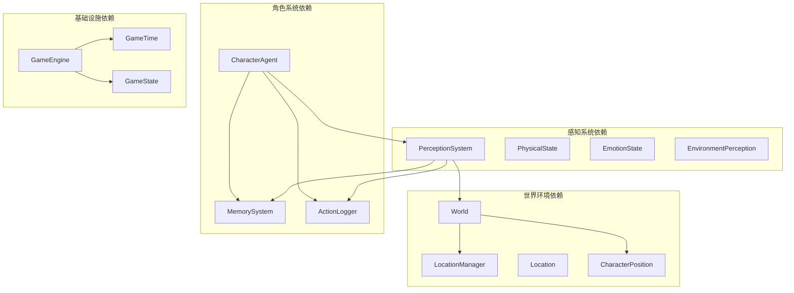

# 环境感知系统

<cite>
**本文档引用的文件**
- [perception.py](file://core_engine/character/perception.py)
- [memory.py](file://core_engine/character/memory.py)
- [agent.py](file://core_engine/character/agent.py)
- [world.py](file://core_engine/environment/world.py)
- [locations.py](file://core_engine/environment/locations.py)
- [engine.py](file://core_engine/engine.py)
- [simulation.py](file://core_engine/simulation.py)
- [action_logger.py](file://core_engine/character/action_logger.py)
- [models.py](file://api_server/models.py)
- [run_simulation.py](file://run_simulation.py)
</cite>

## 目录
1. [简介](#简介)
2. [项目结构](#项目结构)
3. [核心组件](#核心组件)
4. [架构概览](#架构概览)
5. [详细组件分析](#详细组件分析)
6. [依赖关系分析](#依赖关系分析)
7. [性能考量](#性能考量)
8. [故障排除指南](#故障排除指南)
9. [结论](#结论)
10. [附录](#附录)

## 简介
本文件为环境感知系统的详细技术文档，深入解释PerceptionSystem的设计架构，包括环境感知数据结构、物理状态（PhysicalState）、情感状态（EmotionState）管理。详细描述感知信息收集机制、环境信息处理算法、可用行动识别逻辑。解释感知提示词构建（build_perception_prompt）、关系记忆填充、行动优先级计算。包含感知系统的扩展开发指南，如新增感知类型、自定义感知规则、感知结果优化。提供感知性能优化策略和调试技巧。

## 项目结构
环境感知系统位于核心引擎的character子模块中，与世界环境、记忆系统、行动日志紧密集成。系统采用模块化设计，通过依赖注入和回调机制实现松耦合。

**图表来源**
- [perception.py](file://core_engine/character/perception.py#L211-L528)
- [world.py](file://core_engine/environment/world.py#L93-L342)
- [agent.py](file://core_engine/character/agent.py#L116-L800)
- [simulation.py](file://core_engine/simulation.py#L64-L529)

**章节来源**
- [perception.py](file://core_engine/character/perception.py#L1-L528)
- [world.py](file://core_engine/environment/world.py#L1-L342)
- [simulation.py](file://core_engine/simulation.py#L1-L529)

## 核心组件
环境感知系统的核心组件包括感知系统、物理状态管理、情感状态管理、环境感知结果封装以及相关的数据结构。

### 数据结构设计
系统采用数据类（dataclass）和枚举（Enum）确保类型安全和清晰的接口定义：

- **PhysicalState**: 身体状态管理，包含疲劳、饥饿、健康值和情感状态
- **EmotionState**: 情感状态枚举，涵盖快乐、中性、悲伤、愤怒、焦虑、兴奋、疲惫、无聊
- **EnvironmentPerception**: 环境感知结果封装，包含位置、环境条件、附近角色、物品、地点信息
- **NearbyCharacter/NearbyObject**: 附近角色和物品的信息封装

### 状态管理机制
物理状态系统实现了完整的状态管理：
- 状态阈值定义（疲劳阈值60/85，饥饿阈值50/80）
- 状态属性计算（is_tired、is_exhausted、is_hungry、is_starving、needs_rest）
- 状态变化处理（add_fatigue、recover_fatigue、add_hunger、eat）
- 状态描述生成（get_description）

**章节来源**
- [perception.py](file://core_engine/character/perception.py#L12-L124)
- [perception.py](file://core_engine/character/perception.py#L24-L87)
- [perception.py](file://core_engine/character/perception.py#L126-L208)

## 架构概览
环境感知系统采用分层架构，从底层的物理状态管理到顶层的感知决策，形成完整的感知-决策-行动闭环。

**图表来源**
- [agent.py](file://core_engine/character/agent.py#L358-L477)
- [perception.py](file://core_engine/character/perception.py#L226-L303)
- [memory.py](file://core_engine/character/memory.py#L400-L442)

## 详细组件分析

### 感知系统（PerceptionSystem）
感知系统是环境感知的核心，负责收集和整理角色周围的环境信息。

#### 感知信息收集机制
感知系统通过以下步骤收集环境信息：

1. **位置信息获取**：从世界环境中获取角色的精确坐标和当前位置
2. **地点信息查询**：根据位置ID获取地点名称和室内/室外状态
3. **环境条件获取**：获取天气、季节、温度等环境参数
4. **附近角色检测**：基于距离阈值（30.0单位）检测附近角色
5. **附近地点搜索**：基于距离阈值（50.0单位）搜索附近地点
6. **角色信息查询**：从数据库获取角色的详细信息（姓名、AI标识）

#### 环境信息处理算法
感知系统实现了多种算法来处理环境信息：

**图表来源**
- [perception.py](file://core_engine/character/perception.py#L226-L303)

#### 可用行动识别逻辑
感知系统根据环境感知结果动态生成可用行动列表：

**图表来源**
- [perception.py](file://core_engine/character/perception.py#L395-L527)

#### 感知提示词构建
感知系统提供了强大的提示词构建功能，将感知结果转换为自然语言描述：

**图表来源**
- [perception.py](file://core_engine/character/perception.py#L320-L393)

**章节来源**
- [perception.py](file://core_engine/character/perception.py#L211-L528)

### 物理状态管理（PhysicalState）
物理状态系统实现了完整的身体状态管理机制，包括疲劳、饥饿、健康值和情感状态的综合管理。

#### 状态阈值系统
系统定义了明确的状态阈值：
- 疲劳阈值：60（疲劳）、85（精疲力尽）
- 饥饿阈值：50（饥饿）、80（垂死饥饿）
- 健康值：0-100范围，低于30为严重不适，30-60为一般状况

#### 状态属性计算
系统提供了智能的状态属性计算：
- is_tired/is_exhausted：基于疲劳值的二元状态判断
- is_hungry/is_starving：基于饥饿值的二元状态判断
- needs_rest：综合疲劳和健康值的休息需求判断

#### 状态变化处理
系统实现了完整的状态变化处理机制：
- add_fatigue/recover_fatigue：疲劳的增加和恢复
- add_hunger/eat：饥饿的增加和缓解
- 自动情感状态调整：疲劳过高时自动变为疲惫状态

**章节来源**
- [perception.py](file://core_engine/character/perception.py#L24-L124)

### 情感状态管理（EmotionState）
情感状态系统提供了丰富的情感表达能力，支持8种不同的情感状态。

#### 情感状态枚举
情感状态包括：
- HAPPY（快乐）
- NEUTRAL（中性）
- SAD（悲伤）
- ANGRY（愤怒）
- ANXIOUS（焦虑）
- EXCITED（兴奋）
- TIRED（疲惫）
- BORED（无聊）

#### 情感状态描述
系统提供了情感状态的文字描述生成，用于感知提示词构建：
- 基于情感状态生成相应的描述文本
- 结合身体状态提供综合描述
- 支持状态组合描述（如疲惫+饥饿）

**章节来源**
- [perception.py](file://core_engine/character/perception.py#L12-L22)
- [perception.py](file://core_engine/character/perception.py#L89-L123)

### 环境感知结果封装
EnvironmentPerception类提供了完整的环境感知结果封装，支持序列化和反序列化。

#### 数据结构设计
感知结果包含：
- 基本位置信息：位置坐标、地点ID、室内/室外状态
- 环境条件：天气、季节、时间、温度
- 周围内容：附近角色、物品、地点列表
- 身体状态：PhysicalState实例

#### 序列化机制
系统提供了to_dict方法，支持将感知结果转换为字典格式：
- 位置信息的嵌套结构
- 环境信息的标准化
- 附近内容的列表化
- 身体状态的完整序列化

**章节来源**
- [perception.py](file://core_engine/character/perception.py#L148-L208)

### 记忆系统集成
感知系统与记忆系统深度集成，实现了关系记忆的自动填充。

#### 关系记忆填充机制
系统在感知阶段自动填充关系记忆摘要：
- 遍历附近角色列表
- 查询对应角色的关系记忆
- 将关系记忆摘要填充到NearbyCharacter对象
- 限制摘要长度（50字符）

#### 记忆类型支持
系统支持多种记忆类型：
- COMMON（共同记忆）：所有AI共享的世界设定
- DAILY（日常记忆）：每天一条，最多14条
- IMPORTANT（重要记忆）：一条长文本，最多1000字符
- KNOWLEDGE（知识记忆）：学习到的知识
- RELATIONSHIP（关系记忆）：对其他角色的记忆

**章节来源**
- [memory.py](file://core_engine/character/memory.py#L14-L21)
- [memory.py](file://core_engine/character/memory.py#L398-L442)
- [agent.py](file://core_engine/character/agent.py#L373-L378)

## 依赖关系分析

**图表来源**
- [perception.py](file://core_engine/character/perception.py#L7-L10)
- [world.py](file://core_engine/environment/world.py#L7-L12)
- [agent.py](file://core_engine/character/agent.py#L14-L18)

### 组件耦合分析
感知系统与各组件的耦合程度：
- **低耦合**：与World的依赖通过接口抽象，支持替换
- **中等耦合**：与MemorySystem的依赖用于关系记忆填充
- **中等耦合**：与ActionLogger的依赖用于行动日志记录
- **高耦合**：与CharacterAgent的直接依赖，用于决策集成

### 外部依赖
系统对外部依赖主要包括：
- 数据库访问：用于角色信息查询和记忆存储
- LLM客户端：用于决策制定和提示词生成
- 文件系统：用于状态保存和加载

**章节来源**
- [perception.py](file://core_engine/character/perception.py#L305-L318)
- [agent.py](file://core_engine/character/agent.py#L139-L143)

## 性能考量

### 感知性能优化策略

#### 1. 缓存机制
- **角色信息缓存**：避免重复查询数据库
- **地点信息缓存**：缓存常用地点信息
- **距离计算缓存**：缓存频繁计算的距离结果

#### 2. 异步处理
- **并行感知**：多个角色的感知可以并行执行
- **异步数据库查询**：使用异步数据库连接
- **非阻塞I/O**：避免阻塞主线程

#### 3. 内存优化
- **对象池**：重用感知结果对象
- **延迟加载**：只在需要时加载详细信息
- **内存映射**：对于大量数据使用内存映射

#### 4. 算法优化
- **空间索引**：使用R-tree等空间索引加速邻域查询
- **距离阈值优化**：根据场景调整感知半径
- **采样策略**：对大量对象使用采样而非全量扫描

### 性能监控指标
建议监控以下关键指标：
- 感知执行时间
- 数据库查询次数
- 内存使用量
- LLM调用次数和响应时间

## 故障排除指南

### 常见问题诊断

#### 1. 感知结果异常
**症状**：感知结果为空或不完整
**排查步骤**：
- 检查World引用是否正确设置
- 验证角色位置信息是否存在
- 确认数据库连接正常
- 检查感知半径配置是否合理

#### 2. 行动选择不合理
**症状**：AI角色做出不符合情境的行动
**排查步骤**：
- 检查物理状态计算是否正确
- 验证可用行动列表生成逻辑
- 确认记忆系统是否正常工作
- 检查LLM提示词构建质量

#### 3. 性能问题
**症状**：系统响应缓慢或内存泄漏
**排查步骤**：
- 监控感知执行时间
- 检查数据库查询性能
- 分析内存使用情况
- 评估并发处理能力

### 调试技巧

#### 1. 日志记录
- 在关键节点添加详细日志
- 记录感知输入和输出
- 监控性能指标
- 跟踪错误发生位置

#### 2. 单元测试
- 为感知算法编写测试用例
- 测试边界条件和异常情况
- 验证状态转换逻辑
- 测试性能基准

#### 3. 性能分析
- 使用性能分析工具
- 识别瓶颈环节
- 优化热点代码
- 监控资源使用

**章节来源**
- [action_logger.py](file://core_engine/character/action_logger.py#L1-L200)

## 结论
环境感知系统通过精心设计的数据结构、完善的算法实现和灵活的扩展机制，为AI角色提供了全面的环境感知能力。系统支持物理状态管理、情感状态表达、环境信息收集、可用行动识别等多个方面，形成了完整的感知-决策-行动闭环。

系统的模块化设计和依赖注入机制确保了良好的可维护性和可扩展性。通过合理的性能优化策略和完善的故障排除机制，系统能够在复杂的游戏环境中稳定运行。

未来可以在以下方面进一步改进：
- 增强感知算法的智能化程度
- 扩展感知类型的多样性
- 优化大规模场景下的性能表现
- 提供更丰富的调试和监控工具

## 附录

### 扩展开发指南

#### 新增感知类型
1. **定义数据结构**：创建新的感知数据类
2. **实现收集逻辑**：在perceive方法中添加收集代码
3. **更新提示词构建**：在build_perception_prompt中添加描述
4. **集成可用行动**：在get_available_actions中添加相关行动

#### 自定义感知规则
1. **修改阈值配置**：调整PhysicalState的状态阈值
2. **定制行动逻辑**：修改get_available_actions中的行动生成规则
3. **优化距离计算**：调整感知半径和距离计算方式
4. **扩展环境条件**：添加新的环境变量和处理逻辑

#### 感知结果优化
1. **性能优化**：实现缓存机制和异步处理
2. **准确性提升**：改进感知算法和数据处理
3. **用户体验**：优化提示词质量和呈现方式
4. **可扩展性**：设计插件化的感知扩展机制

### API参考

#### PerceptionSystem主要方法
- `perceive(character_id, physical_state)`: 执行环境感知
- `build_perception_prompt(perception)`: 构建感知提示词
- `get_available_actions(perception)`: 获取可用行动列表

#### PhysicalState主要方法
- `add_fatigue(amount)`: 增加疲劳值
- `recover_fatigue(amount)`: 恢复疲劳值
- `add_hunger(amount)`: 增加饥饿值
- `eat(amount)`: 减少饥饿值
- `get_description()`: 获取状态描述

**章节来源**
- [perception.py](file://core_engine/character/perception.py#L226-L527)
- [perception.py](file://core_engine/character/perception.py#L58-L123)